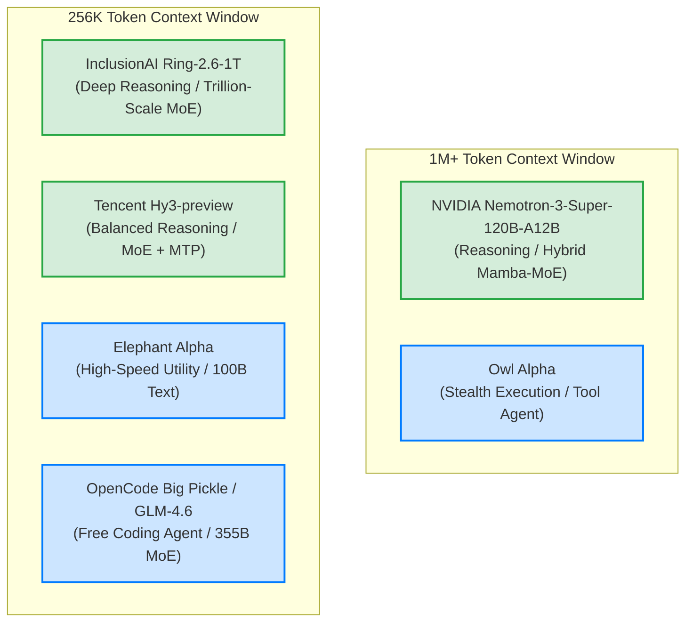

# Detailed Comparative Analysis of Next-Generation AI Models

This report provides a comprehensive, head-to-head comparison of five state-of-the-art AI models released between March and May 2026. These models represent diverse architectural strategies—from dense-like Mixture-of-Experts (MoE) and hybrid Transformer-Mamba layers to reasoning-focused "thinking" architectures.

---

## Model Positioning Matrix

Below is a visual mapping of the models based on their primary design goals: **Context Capacity** (256K vs. 1M+ tokens) and **Cognitive Depth** (Execution/Utility-focused vs. Deep Reasoning/Thinking-focused).



---

## Detailed Specifications Comparison

The following table outlines the core technical specifications, context capabilities, and access pathways for each model.

| Model Identifier | Developer | Release Date | Architecture Type | Parameters (Total / Active) | Context Window | Key Features / Special Mechanisms |
| :--- | :--- | :--- | :--- | :--- | :--- | :--- |
| **`openrouter/elephant-alpha`** | *Stealth Provider* | April 2026 | Sparse/Dense Text Model | 100B / ~100B | 256K tokens | High-speed structured outputs, prompt caching. |
| **`openrouter/owl-alpha`** | *Stealth Provider* | Late April 2026 | Foundation Model | *Undisclosed* | 1M tokens | Native tool calling, optimized for long-context execution. |
| **`tencent/hy3-preview`** | Tencent | April 2026 | MoE (Mixture-of-Experts) | 295B / 21B | 256K (262,144) | Multi-Token Prediction (3.8B MTP layer), selectable reasoning modes. |
| **`nvidia/nemotron-3-super-120b-a12b`** | NVIDIA | March 2026 | LatentMoE (Transformer-Mamba-2) | 120B / 12B | 1M tokens | Mamba-2 state space, MTP layers, NVFP4 training, reasoning trace flag. |
| **`inclusionai/ring-2.6-1t`** | InclusionAI (Ant Group) | May 2026 | MoE (Mixture-of-Experts) | 1T / 63B | 262K (expandable) | Adjustable Reasoning Effort (`high`/`xhigh`), explicit `<think>` traces. |
| **`opencode/big-pickle`** (GLM-4.6) | Zhipu AI via OpenCode Zen | Dec 2025 | MoE (Mixture-of-Experts) | 355B / 32B | 200K (practical: 50-70K) | Group Query Attention, SwiGLU, bilingual EN/ZH tokenizer (150K vocab). Free tier. |

---

## Benchmark Performance Highlights

Standardized benchmarks verify the cognitive depth, coding prowess, and agent-interaction capabilities of these models. 

> [!NOTE]
> **Elephant Alpha** and **Owl Alpha** are stealth community releases and lack official, verified academic benchmark suites. Their metrics are based on initial community evaluations and API telemetry.

### 1. Hard Reasoning & Mathematics
*   **Ring-2.6-1T:** Leads math reasoning with an outstanding **95.83 on AIME 2026** and **88.27 on GPQA Diamond**, cementing its position as a top-tier reasoning engine.
*   **Nemotron-3-Super-120B-A12B:** Achieves a highly competitive **90.21 on AIME25 (no tools)** and **94.73 on HMMT Feb25 (with tools)**, benefiting from its LatentMoE architecture.
*   **Hy3-preview:** Demonstrates excellent STEM competence, scoring **87.8 on the China High School Biology Olympiad (CHSBO 2025)** and achieving "Excellent" ratings on the Tsinghua Qiuzhen College Math PhD qualifying exams.

### 2. Autonomous Coding & Agent Execution
*   **Hy3-preview:** Showcases exceptional agentic capabilities, scoring **74.4% on SWE-bench Verified** (a massive jump from Hy2's 53%) and **70.2% on WideSearch**.
*   **Ring-2.6-1T:** Outperforms industry giants on **PinchBench with a score of 87.60** (surpassing GPT-5.4 High and Gemini-3.1-Pro High). It also scores **63.82 on ClawEval** and **95.32 on TAU2-Bench (Telecom)**.
*   **Owl-Alpha:** Community telemetry shows a tool call error rate of **3.40%** and structured output error rate of **3.95%** at a throughput of ~13 tok/s, proving reliable for basic automated pipelines.

### 6. Big Pickle (opencode/big-pickle)
*   **MMLU-Pro:** **84.3** — strong general knowledge.
*   **SWE-bench Verified:** **73.8** — competitive with Claude Sonnet 4.5 (72.1).
*   **LiveCodeBench V6:** **82.8** — above average live coding ability.
*   **HLE (with tools):** **42.8** — weaker on hard multi-step problems.

---

## Deep Dive: Individual Model Analysis

### 1. openrouter/elephant-alpha
*   **Design Philosophy:** Engineered for "intelligence efficiency." It is designed to act as a fast, cheap, and lightweight utility model rather than a deep reasoning agent.
*   **Performance Profile:** Exceptionally fast, with community-reported speeds of **~250 tokens/sec**. However, users report it is prone to hallucinations on long reasoning chains and is best used when restricted by rigid system instructions.
*   **Best Use Cases:**
    *   Sub-second code completion and simple syntax debugging.
    *   High-throughput document summarization and parsing.
    *   Structured data extraction (JSON parsing) utilizing prompt caching.

### 2. openrouter/owl-alpha
*   **Design Philosophy:** Focused on processing massive amounts of context for automated execution. It serves as an execution backend for consumer productivity agents.
*   **Performance Profile:** Provides a massive **1M token context window**. It has slower generation speeds (~13 tok/s) but maintains excellent state retention across its entire context window, making it highly reliable for continuous workflows.
*   **Best Use Cases:**
    *   Agent frameworks requiring deep context (e.g., Claude Code, OpenClaw).
    *   Large codebase ingestion and multi-file analysis.
    *   Asynchronous multi-step productivity automations.

> [!WARNING]
> **Privacy Advisory:** Both Elephant Alpha and Owl Alpha are stealth models on OpenRouter. The upstream providers log prompts and completions for optimization. **Do not feed sensitive credentials, private IP, or proprietary documents into these models.**

### 3. tencent/hy3-preview
*   **Design Philosophy:** Built on rebuilt pre-training and reinforcement learning codebases to prioritize practical real-world utility over artificial leaderboard optimization.
*   **Performance Profile:** Exceptional balance between speed and intelligence. The MoE structure activates only 21B parameters, and the **3.8B Multi-Token Prediction (MTP) layer** enables fast speculative decoding. The configurable reasoning modes (`no_think` to `high`) allow users to dial reasoning intensity up or down.
*   **Best Use Cases:**
    *   Complex multi-step web search and information gathering agents.
    *   Enterprise software development assistant (integrated into Yuanbao/CodeBuddy).
    *   Advanced scientific research and translation tasks.

### 4. nvidia/nemotron-3-super-120b-a12b
*   **Design Philosophy:** NVIDIA's showcase of architectural innovation. By blending **Mamba-2** (linear time complexity for long contexts) with **MoE** (sparse activation) and **Transformer attention** layers, it achieves elite reasoning with tiny computing footprints.
*   **Performance Profile:** Incredible inference efficiency. It acts like a 120B model but runs with the compute footprint of a 12B model. Highly optimized for NVFP4 quantization, and can reach up to **500+ tokens/sec** on high-end enterprise servers.
*   **Best Use Cases:**
    *   Multi-agent enterprise systems (e.g., automated IT helpdesk, security threat triaging).
    *   High-speed mathematical reasoning and simulation planning.
    *   Local/edge deployments on workstation GPUs (due to highly efficient KV-cache scaling via Mamba-2).

### 5. inclusionai/ring-2.6-1t
*   **Design Philosophy:** Built as a trillion-parameter "thinking" model. It uses reinforcement learning to generate detailed, explicit reasoning paths before outputting final answers.
*   **Performance Profile:** Maximum intelligence and coding correctness. While the token generation speed is slower due to the `<think>` trace generation, its accuracy is unmatched, especially in agentic benchmarks where it leads the 2026 rankings.
*   **Best Use Cases:**
    *   Autonomous coding agents handling complex refactoring or legacy codebase migrations.
    *   Advanced logical problem solving (math, logic puzzles, algorithm design).
    *   Long-horizon planning and decision-making where correctness is critical.

### 6. opencode/big-pickle (GLM-4.6)
*   **Design Philosophy:** A free, community-driven coding agent model optimized for practical software engineering. Hosted by OpenCode Zen as an experimental offering — usage data is fed back to improve the model.
*   **Performance Profile:** Strong on code analysis, planning, and documentation generation. Fast response times for a free model. However, the claimed 200K context window degrades in practice around 50-70K tokens, and it struggles with files exceeding 400-500 lines. Tends toward verbosity and occasionally ignores task constraints.
*   **Best Use Cases:**
    *   Codebase analysis and implementation planning.
    *   Documentation generation and code review.
    *   Rapid prototyping and lightweight coding tasks within moderate-sized files.
*   **Limitations:**
    *   Context reliability breaks down past 50-70K tokens.
    *   Weak on math reasoning and multi-step agentic tasks.
    *   Can execute destructive commands if not restrained (use `tirith_enabled` or command approval).
    *   Bilingual tokenizer biases toward English/Chinese — may perform differently on other languages.

> [!WARNING]
> **Privacy Advisory:** Both Elephant Alpha and Owl Alpha are stealth models on OpenRouter. The upstream providers log prompts and completions for optimization. **Do not feed sensitive credentials, private IP, or proprietary documents into these models.**
> 
> **Data Usage:** Big Pickle's free tier submits your prompts and outputs for model training. Do not share sensitive or proprietary code while using the free tier.

---

## Architectural and Operational Trade-offs

Choosing the right model depends heavily on the bottlenecks of your specific application:

```
                  ▲ HIGH COGNITION (Reasoning)
                  │
                  │       [Ring-2.6-1T]  (1T MoE, Thinking Trace)
                  │
                  │                [Hy3-preview] (295B MoE, Balanced)
                  │
                  │       [Nemotron-3-Super] (120B LatentMoE, High Speed)
                  │
                  │
                  │       [Owl-Alpha] (1M Context, Tool Agent)
                  │
                  │
                  │       [Elephant-Alpha] (100B, High Speed)
                  │
                  │
                  │       [Big Pickle] (355B MoE, Free Coding Agent)
                  │
──────────────────┼──────────────────────────────────────────────────►
                  │                                  HIGH THROUGHPUT
                  │                                  (Tokens/Second)
```

1. **For Pure Speed & Utility:** Choose **Elephant-Alpha** (if privacy allows) or **Nemotron-3-Super-120B** (configured with reasoning mode off).
2. **For High-Fidelity Complex Workflows:** Choose **Ring-2.6-1T** (high reasoning effort) or **Hy3-preview** (high thinking mode).
3. **For Long-Context Repository Ingestion:** Choose **Nemotron-3-Super-120B** (which offers a 1M token context window and native open-weights efficiency) or **Owl-Alpha**.
4. **For Free Coding & Prototyping:** Choose **Big Pickle** for codebase analysis, planning, and documentation within moderate-sized projects — but switch to a paid model if context exceeds ~50K tokens or files exceed ~400 lines.
