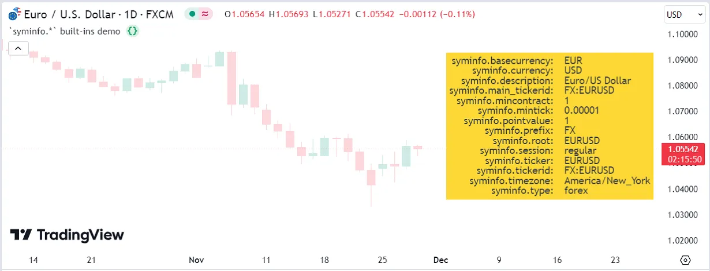

# [Chart information](../1. Concepts/concepts_chart-information.md#chart-information)

## [Introduction](../1. Concepts/concepts_chart-information.md#introduction)

The way scripts can obtain information about the chart and symbol they
are currently running on is through a subset of Pine Script®‘s
[built-in variables](../3. Language/language_built-ins.md#built-in-variables). The ones we cover here allow scripts to access information
relating to:

- The chart’s prices and volume
- The chart’s symbol
- The chart’s timeframe
- The session (or time period) the symbol trades on

## [Prices and volume](../1. Concepts/concepts_chart-information.md#prices-and-volume)

The built-in variables for OHLCV values are:

- [open](../../reference manual/variables/open.md):
the bar’s opening price.
- [high](../../reference manual/variables/high.md):
the bar’s highest price, or the highest price reached during the
realtime bar’s elapsed time.
- [low](../../reference manual/variables/low.md):
the bar’s lowest price, or the lowest price reached during the
realtime bar’s elapsed time.
- [close](../../reference manual/variables/close.md):
the bar’s closing price, or the **current price** in the realtime
bar.
- [volume](../../reference manual/variables/volume.md):
the volume traded during the bar, or the volume traded during the
realtime bar’s elapsed time. The unit of volume information varies
with the instrument. It is in shares for stocks, in lots for forex,
in contracts for futures, in the base currency for crypto, etc.

Other values are available through:

- [hl2](../../reference manual/variables/hl2.md):
the average of the bar’s
[high](../../reference manual/variables/high.md)
and
[low](../../reference manual/variables/low.md)
values.
- [hlc3](../../reference manual/variables/hlc3.md):
the average of the bar’s
[high](../../reference manual/variables/high.md),
[low](../../reference manual/variables/low.md)
and
[close](../../reference manual/variables/close.md)
values.
- [ohlc4](../../reference manual/variables/ohlc4.md):
the average of the bar’s
[open](../../reference manual/variables/open.md),
[high](../../reference manual/variables/high.md),
[low](../../reference manual/variables/low.md)
and
[close](../../reference manual/variables/close.md)
values.

On historical bars, the values of the above variables do not vary during
the bar because only OHLCV information is available on them. When
running on historical bars, scripts execute on the bar’s
[close](../../reference manual/variables/close.md),
when all the bar’s information is known and cannot change during the
script’s execution on the bar.

Realtime bars are another story altogether. When indicators (or
strategies using `calc_on_every_tick = true`) run in realtime, the
values of the above variables (except
[open](../../reference manual/variables/open.md))
will vary between successive iterations of the script on the realtime
bar, because they represent their **current** value at one point in time
during the progress of the realtime bar. This may lead to one form of
[repainting](../1. Concepts/concepts_repainting.md). See the
page on Pine Script’s
[execution model](../3. Language/language_execution-model.md) for
more details.

The
[\[\]](../../reference manual/operators/[].md) [history-referencing operator](../3. Language/language_operators.md#-history-referencing-operator) can be used to refer to past values of the built-in
variables, e.g., `close[1]` refers to the value of
[close](../../reference manual/variables/close.md)
on the previous bar, relative to the particular bar the script is
executing on.

## [Symbol information](../1. Concepts/concepts_chart-information.md#symbol-information)

Built-in variables in the `syminfo` namespace provide scripts with
information on the symbol of the chart the script is running on. This
information changes every time a script user changes the chart’s
symbol. The script then re-executes on all the chart’s bars using the
new values of the built-in variables:

- [syminfo.basecurrency](../../reference manual/variables/syminfo.basecurrency.md):
the base currency, e.g., “BTC” in “BTCUSD”, or “EUR” in
“EURUSD”.
- [syminfo.currency](../../reference manual/variables/syminfo.currency.md):
the quote currency, e.g., “USD” in “BTCUSD”, or “CAD” in
“USDCAD”.
- [syminfo.description](../../reference manual/variables/syminfo.description.md):
The long description of the symbol.
- [syminfo.main\_tickerid](../../reference manual/variables/syminfo.main_tickerid.md): The symbol’s _main_ ticker identifier. It behaves almost identically to [syminfo.tickerid](../../reference manual/variables/syminfo.tickerid.md), referencing the symbol’s exchange prefix, name, and additional ticker data. However, this variable _always_ represents the _current_ chart’s ticker ID, even within requested contexts.
- [syminfo.mincontract](../../reference manual/variables/syminfo.mincontract.md): The symbol’s smallest tradable amount, which is set by its exchange. For example, the minimum for NASDAQ asset “AAPL” is 1 token, while the minimum for BITSTAMP cryptocurrency “ETHUSD” is 0.0001 tokens.
- [syminfo.mintick](../../reference manual/variables/syminfo.mintick.md):
The symbol’s tick value, or the minimum increment price can move
in. Not to be confused with _pips_ or _points_. On “ES1!” (“S&P
500 E-Mini”) the tick size is 0.25 because that is the minimal
increment the price moves in.
- [syminfo.pointvalue](../../reference manual/variables/syminfo.pointvalue.md):
The point value is the multiple of the underlying asset determining
a contract’s value. On “ES1!” (“S&P 500 E-Mini”) the point
value is 50, so a contract is worth 50 times the price of the
instrument.
- [syminfo.prefix](../../reference manual/variables/syminfo.prefix.md):
The prefix is the exchange or broker’s identifier: “NASDAQ” or
“BATS” for “AAPL”, “CME\_MINI\_DL” for “ES1!”.
- [syminfo.root](../../reference manual/variables/syminfo.root.md):
It is the ticker’s prefix for structured tickers like those of
futures. It is “ES” for “ES1!”, “ZW” for “ZW1!”.
- [syminfo.session](../../reference manual/variables/syminfo.session.md):
It reflects the session setting on the chart for that symbol. If the
“Chart settings/Symbol/Session” field is set to “Extended”, it
will only return “extended” if the symbol and the user’s feed
allow for extended sessions. It is rarely displayed and used mostly
as an argument to the `session` parameter in
[ticker.new()](../../reference manual/functions/ticker.new.md).
- [syminfo.ticker](../../reference manual/variables/syminfo.ticker.md):
It is the symbol’s name, without the exchange part
( [syminfo.prefix](../../reference manual/variables/syminfo.prefix.md)):
“BTCUSD”, “AAPL”, “ES1!”, “USDCAD”.
- [syminfo.tickerid](../../reference manual/variables/syminfo.tickerid.md): The symbol’s ticker identifier, consisting of its exchange prefix and symbol name, e.g., “NASDAQ:MSFT”. It can also include ticker information beyond the “prefix:ticker” form, such as extended hours, dividend adjustments, currency conversion, etc. To retrieve the standard “prefix:ticker” form only, pass the variable to [ticker.standard()](../../reference manual/functions/ticker.standard.md). When used in a `request.*()` call’s `expression` argument, this variable references the _requested_ context’s ticker ID. Otherwise, it references the current chart’s ticker ID.
- [syminfo.timezone](../../reference manual/variables/syminfo.timezone.md):
The timezone the symbol is traded in. The string is an [IANA time 
zone database 
name](https://en.wikipedia.org/wiki/List_of_tz_database_time_zones)
(e.g., “America/New\_York”).
- [syminfo.type](../../reference manual/variables/syminfo.type.md):
The type of market the symbol belongs to. The values are “stock”,
“futures”, “index”, “forex”, “crypto”, “fund”, “dr”,
“cfd”, “bond”, “warrant”, “structured” and “right”.

This script displays these built-in variables and their values for the current symbol in a [table](../1. Concepts/concepts_tables.md) on the
chart:



```pine
//@version=6
indicator("`syminfo.*` built-ins demo", overlay = true)

//@variable The `syminfo.*` built-ins, displayed in the left column of the table.
string txtLeft =
"syminfo.basecurrency: "  + "\n" +
"syminfo.currency: "      + "\n" +
"syminfo.description: "   + "\n" +
"syminfo.main_tickerid: " + "\n" +
"syminfo.mincontract: "   + "\n" +
"syminfo.mintick: "       + "\n" +
"syminfo.pointvalue: "    + "\n" +
"syminfo.prefix: "        + "\n" +
"syminfo.root: "          + "\n" +
"syminfo.session: "       + "\n" +
"syminfo.ticker: "        + "\n" +
"syminfo.tickerid: "      + "\n" +
"syminfo.timezone: "      + "\n" +
"syminfo.type: "

//@variable The values of the `syminfo.*` built-ins, displayed in the right column of the table.
string txtRight =
syminfo.basecurrency              + "\n" +
syminfo.currency                  + "\n" +
syminfo.description               + "\n" +
syminfo.main_tickerid             + "\n" +
str.tostring(syminfo.mincontract) + "\n" +
str.tostring(syminfo.mintick)     + "\n" +
str.tostring(syminfo.pointvalue)  + "\n" +
syminfo.prefix                    + "\n" +
syminfo.root                      + "\n" +
syminfo.session                   + "\n" +
syminfo.ticker                    + "\n" +
syminfo.tickerid                  + "\n" +
syminfo.timezone                  + "\n" +
syminfo.type

if barstate.islast
    var table t = table.new(position.middle_right, 2, 1)
    table.cell(t, 0, 0, txtLeft, bgcolor = color.yellow, text_halign = text.align_right)
    table.cell(t, 1, 0, txtRight, bgcolor = color.yellow, text_halign = text.align_left)
```

## [Chart timeframe](../1. Concepts/concepts_chart-information.md#chart-timeframe)

A script can obtain information on the type of timeframe used on the
chart using these built-ins, which all return a “simple bool” result:

- [timeframe.isseconds](../../reference manual/variables/timeframe.isseconds.md)
- [timeframe.isminutes](../../reference manual/variables/timeframe.isminutes.md)
- [timeframe.isintraday](../../reference manual/variables/timeframe.isintraday.md)
- [timeframe.isdaily](../../reference manual/variables/timeframe.isdaily.md)
- [timeframe.isweekly](../../reference manual/variables/timeframe.isweekly.md)
- [timeframe.ismonthly](../../reference manual/variables/timeframe.ismonthly.md)
- [timeframe.isdwm](../../reference manual/variables/timeframe.isdwm.md)

Additional built-ins return more specific timeframe information:

- [timeframe.multiplier](../../reference manual/variables/timeframe.multiplier.md)
returns a “simple int” containing the multiplier of the timeframe
unit. A chart timeframe of one hour will return `60` because
intraday timeframes are expressed in minutes. A 30sec timeframe will
return `30` (seconds), a daily chart will return `1` (day), a
quarterly chart will return `3` (months), and a yearly chart will
return `12` (months). The value of this variable cannot be used as
an argument to `timeframe` parameters in built-in functions, as they
expect a string in timeframe specifications format.
- [timeframe.period](../../reference manual/variables/timeframe.period.md) holds a “string” representing the script’s timeframe. It follows Pine’s [timeframe string specifications](../1. Concepts/concepts_timeframes.md#timeframe-string-specifications), where the string consists of a quantity (multiplier) and unit, e.g., “1D”, “2W”, “3M”. When used in a `request.*()` call’s `expression` argument, this variable references the _requested_ context’s timeframe. Otherwise, it references the script’s main timeframe.
- [timeframe.main\_period](../../reference manual/variables/timeframe.main_period.md) holds a “string” representing the _main_ timeframe, which is either the `timeframe` argument specified in the [indicator()](../../reference manual/functions/indicator.md) declaration, or the current chart’s timeframe. It behaves almost identically to [timeframe.period](../../reference manual/variables/timeframe.period.md). However, this variable _always_ represents the script’s _main_ timeframe, even within requested contexts.

See the page on [Timeframes](../1. Concepts/concepts_timeframes.md) for more information.

## [Session information](../1. Concepts/concepts_chart-information.md#session-information)

Session information is available in different forms:

- The
[syminfo.session](../../reference manual/variables/syminfo.session.md)
built-in variable returns a value that is either
[session.regular](../../reference manual/constants/session.regular.md)
or
[session.extended](../../reference manual/constants/session.extended.md).
It reflects the session setting on the chart for that symbol. If the
“Chart settings/Symbol/Session” field is set to “Extended”, it
will only return “extended” if the symbol and the user’s feed
allow for extended sessions. It is used when a session type is
expected, for example as the argument for the `session` parameter in
[ticker.new()](../../reference manual/functions/ticker.new.md).
- [Session state built-ins](../1. Concepts/concepts_sessions.md#session-variables-reference) provide information on the trading session a bar belongs
to.

[Previous 
**Bar states**](../1. Concepts/concepts_bar-states.md) [Next 
**Inputs**](../1. Concepts/concepts_inputs.md)