# [Inputs](../1. Concepts/concepts_inputs.md#inputs)

## [Introduction](../1. Concepts/concepts_inputs.md#introduction)

Inputs receive values that users can change from a script’s
“Settings/Inputs” tab. By utilizing inputs, programmers can write
scripts that users can more easily adapt to their preferences.

The following script plots a 20-bar [simple moving average (SMA)](https://www.tradingview.com/support/solutions/43000502589) using a call to the [ta.sma()](../../reference manual/functions/ta.sma.md) function.
While it is straightforward to write, the code is not very _flexible_
because the function call uses specific `source` and `length` arguments
that users cannot change without modifying the code:

```pine
//@version=6
indicator("MA", "", true)
plot(ta.sma(close, 20))
```

If we write our script this way instead, it becomes much more flexible,
as users can select the `source` and the `length` values they want to
use from the “Settings/Inputs” tab without changing the source code:

```pine
//@version=6
indicator("MA", "", true)
sourceInput = input(close, "Source")
lengthInput = input(20, "Length")
plot(ta.sma(sourceInput, lengthInput))
```

Inputs are only accessible while a script runs on a chart. Users can
access script inputs from the “Settings” dialog box. To open this
dialog, users can:

- Double-click on the name of an on-chart indicator
- Right-click on the script’s name and choose the “Settings” item
from the dropdown menu
- Choose the “Settings” item from the “More” menu icon (three
dots) that appears when hovering over the indicator’s name on the
chart
- Double-click on the indicator’s name from the Data Window (fourth
icon down to the right of the chart)

The “Settings” dialog always contains the “Style” and “Visibility”
tabs, which allow users to specify their preferences about the script’s
visuals and the chart timeframes that can display its outputs.

When a script contains calls to `input.*()` functions, an “Inputs” tab
also appears in the “Settings” dialog box.

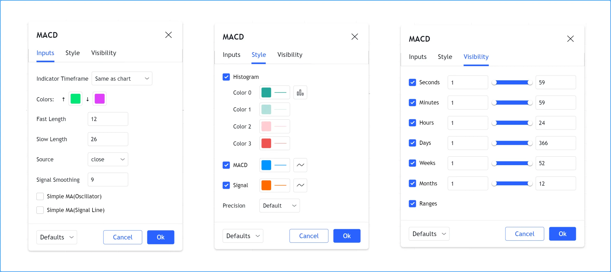

Scripts process inputs when users add them to the chart or change the
values in the script’s “Settings/Inputs” tab. Any changes to a
script’s inputs prompt it to re-execute across all available data using
the new specified values.

## [Input functions](../1. Concepts/concepts_inputs.md#input-functions)

Pine Script® features the following input functions:

- [input()](../../reference manual/functions/input.md)
- [input.int()](../../reference manual/functions/input.int.md)
- [input.float()](../../reference manual/functions/input.float.md)
- [input.bool()](../../reference manual/functions/input.bool.md)
- [input.color()](../../reference manual/functions/input.color.md)
- [input.string()](../../reference manual/functions/input.string.md)
- [input.text\_area()](../../reference manual/functions/input.text_area.md)
- [input.timeframe()](../../reference manual/functions/input.timeframe.md)
- [input.symbol()](../../reference manual/functions/input.symbol.md)
- [input.source()](../../reference manual/functions/input.source.md)
- [input.session()](../../reference manual/functions/input.session.md)
- [input.time()](../../reference manual/functions/input.time.md)
- [input.price()](../../reference manual/functions/input.price.md)
- [input.enum()](../../reference manual/functions/input.enum.md)

Scripts create input _widgets_ in the “Inputs” tab that accept
different types of inputs based on their `input.*()` function calls. By
default, each input appears on a new line of the “Inputs” tab in the
order of the `input.*()` calls. Programmers can also organize inputs in
different ways by using the `input.*()` functions’ `group` and `inline`
parameters. See [this section](../1. Concepts/concepts_inputs.md#input-function-parameters) below for more information.

Our [Style guide](../4. Writing_Scripts/writing_style-guide.md#style-guide)
recommends placing `input.*()` calls at the beginning of the script.

Input functions typically contain several parameters that allow
programmers to define their default values, value limits, their
organization in the “Inputs” tab, and other properties.

Since an `input.*()` call is simply another function call in Pine
Script, programmers can combine them with
[arithmetic](../3. Language/language_operators.md#arithmetic-operators), [comparison](../3. Language/language_operators.md#comparison-operators),
[logical](../3. Language/language_operators.md#logical-operators), and
[ternary](../3. Language/language_operators.md#-ternary-operator)
operators to assign expressions to variables. This simple script
compares the result from a call to
[input.string()](../../reference manual/functions/input.string.md)
to the “On” string and assigns the result to the `plotDisplayInput`
variable. This variable is of the “input bool” type because the
[==](../../reference manual/operators/==.md)
operator returns a “bool” value:

```pine
//@version=6
indicator("Input in an expression`", "", true)
bool plotDisplayInput = input.string("On", "Plot Display", options = ["On", "Off"]) == "On"
plot(plotDisplayInput ? close : na)
```

All values returned by `input.*()` functions except “source” ones are
“input” qualified values. See our User Manual’s section on
[type qualifiers](../3. Language/language_type-system.md#qualifiers) for more information.

## [Input function parameters](../1. Concepts/concepts_inputs.md#input-function-parameters)

The parameters common to all input functions are: `defval`, `title`,
`tooltip`, `inline`, `group`, `display`, and `active`. Some input functions also
include other parameters: `options`, `minval`, `maxval`, `step` and
`confirm`.

Most input parameters require “const” arguments. However, two parameters allow values with stronger [qualifiers](../3. Language/language_type-system.md#qualifiers): the `active` parameter of all `input*()` functions accepts an “input bool” value, and the `defval` parameter of [input.source()](../../reference manual/functions/input.source.md) accepts a “series float” value.

The parameters that require “const” arguments _cannot_ use dynamic values or results from other `input*()` calls as arguments, because “input” and other qualifiers are _stronger_ than the “const” qualifier. See the [Type system](../3. Language/language_type-system.md) page for more information.

Let’s examine each parameter:

`defval`

The default value assigned to the input variable, and the initial value that appears in the input widget. It is the first parameter of all `input*()` functions. The required type for a `defval` argument depends on the input function type, e.g., an “int” `defval` argument for [input.int()](../../reference manual/functions/input.int.md), a “string” `defval` argument for [input.string()](../../reference manual/functions/input.string.md), etc. The [generic input](../1. Concepts/concepts_inputs.md#generic-input) function infers its input type based on the `defval` argument used in the [input()](../../reference manual/functions/input.md) call.

`title`

The input field’s label in the “Inputs” tab. If the function call does not specify a `title` string, the input variable’s name appears as the label.

`tooltip`

An optional string that offers more information about the input. Using a `tooltip` argument displays a question mark icon to the right of the input field, which shows the tooltip’s text when users hover over it. The `tooltip` string supports newline (`\n`) characters.

Note that if multiple input widgets appear on the same line (using `inline`), the tooltip always appears to the right of the _rightmost_ field and displays the text of the _last_`tooltip` argument specified in the line.

`inline`

Using the same `inline` argument in multiple `input*()` calls displays their input widgets on the _same line_ in the “Inputs” tab. The tab’s width limits the amount of input widgets that can fit on one line; longer lines are automatically wrapped. The `inline` string is case-sensitive, so `input*()` calls must use the same characters and letter case in their `inline` arguments to appear in the same line.

Using any `inline` argument, unique or otherwise, displays the input’s field immediately after its label, rather than keeping it left-aligned with other input fields as default. Unlike the `group` heading, the `inline` string does not appear in the “Inputs” tab.

`group`

Using the same `group` argument in any number of `input*()` calls groups the inputs in an _organized section_ in the “Inputs” tab. The string used as the `group` argument becomes the section’s heading. The `group` string is case-sensitive, so `input*()` calls must use the same characters and letter case in their `group` arguments to appear in the same section.

` display`

Controls whether the input value appears next to the script title in the status line and Data Window. It accepts the following values: [display.all](../../reference manual/constants/display.all.md), [display.status\_line](../../reference manual/constants/display.status_line.md), [display.data\_window](../../reference manual/constants/display.data_window.md), or [display.none](../../reference manual/constants/display.none.md). The default is [display.all](../../reference manual/constants/display.all.md) for all input types except “bool” and “color” inputs, which use [display.none](../../reference manual/constants/display.none.md) by default.

Note that the input value always appears in the “Inputs” tab, regardless of the `display` argument.

`active`

Controls whether users can change the input value in the “Inputs” tab; it is `true` by default. If `false`, the input field appears dimmed and users cannot change its value. This parameter accepts an “input bool” argument, so an input’s `active` state can depend on the value of _other_ inputs.

For example, if a script uses a “bool” `showAverageInput` toggle to show or hide an average line, we can use `active = showAverageInput` in other inputs related to the average, such as `averageLengthInput` or `averageColorInput`, to enable them only when users select the “Show average” checkbox.

`options`

A list specifying the possible values that this input can have. This parameter accepts a [tuple](../3. Language/language_type-system.md#tuples), which is a comma-separated list of elements enclosed in square brackets (e.g., `["ON", "OFF"]`, `[1, 2, 3]`, `[myEnum.On, myEnum.Off]`). These elements appear in a dropdown widget, from which users can select only one value at a time. If an input uses the `options` parameter, the `defval` value must be one of the list’s elements.

`minval`

The minimum valid value for the input field in an [integer input](../1. Concepts/concepts_inputs.md#integer-input) or [float input](../1. Concepts/concepts_inputs.md#float-input).

`maxval`

The maximum valid value for the input field in an [integer input](../1. Concepts/concepts_inputs.md#integer-input) or [float input](../1. Concepts/concepts_inputs.md#float-input).

`step`

The increment by which the field’s value changes when clicking the up/down arrows in an [integer input](../1. Concepts/concepts_inputs.md#integer-input) or [float input](../1. Concepts/concepts_inputs.md#float-input) widget. The default `step` value is 1.

`confirm`

If `true`, the input widget appears in a “Confirm inputs” dialog box when users add the script to the chart, prompting them to configure the input value before the script executes. By default, this parameter’s value is `false`. If more than one `input.*()` call uses `confirm = true` in the same script, multiple input widgets appear in the dialog box.

Using `confirm = true` for a [time input](../1. Concepts/concepts_inputs.md#time-input) or [price input](../1. Concepts/concepts_inputs.md#price-input) enables an interactive input mode where users can click on the chart to set time and price values.

The `minval`, `maxval`, and `step` parameters are only present in the second signatures of the [input.int()](../../reference manual/functions/input.int.md)
and [input.float()](../../reference manual/functions/input.float.md) functions. Their first signatures use the `options` parameter instead. Function calls that use a `minval`, `maxval`, or `step` argument cannot also use an `options` argument.

## [Input types](../1. Concepts/concepts_inputs.md#input-types)

The next sections explain what each input function does. As we proceed,
we will explore the different ways you can use input functions and
organize their display.

### [Generic input](../1. Concepts/concepts_inputs.md#generic-input)

[input()](../../reference manual/functions/input.md)
is a simple, generic function that supports the fundamental Pine Script
types: “int”, “float”, “bool”, “color” and “string”. It also
supports “source” inputs, which are price-related values such as
[close](../../reference manual/variables/close.md),
[hl2](https://www.tradingview.com/pine-script-reference/v6/#hl2),
[hlc3](../../reference manual/variables/hlc3.md),
and
[hlcc4](../../reference manual/variables/hlcc4.md),
or which can be used to receive the output value of another script.

Its signature is:

```
input(defval, title, tooltip, inline, group, display, active) → input int/float/bool/color/string | series float
```

The function automatically detects the type of input by analyzing the
type of the `defval` argument used in the function call. This script
shows all the supported types and the qualified type returned by the
function when used with `defval` arguments of different types:

```pine
//@version=6
indicator("`input()`", "", true)
a = input(1, "input int")
b = input(1.0, "input float")
c = input(true, "input bool")
d = input(color.orange, "input color")
e = input("1", "input string")
f = input(close, "series float")
plot(na)
```

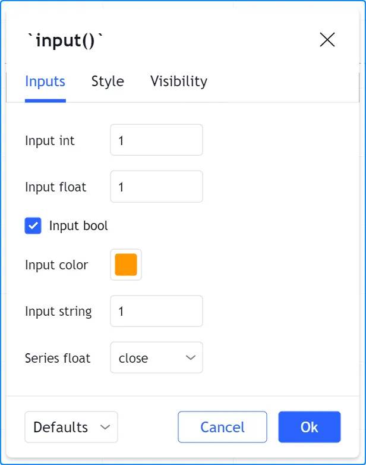

### [Integer input](../1. Concepts/concepts_inputs.md#integer-input)

Two signatures exist for the
[input.int()](../../reference manual/functions/input.int.md)
function; one when `options` is not used, the other when it is:

```
input.int(defval, title, minval, maxval, step, tooltip, inline, group, confirm, display, active) → input int

input.int(defval, title, options, tooltip, inline, group, confirm, display, active) → input int
```

This call uses the `options` parameter to propose a pre-defined list of
lengths for the MA:

```pine
//@version=6
indicator("MA", "", true)
maLengthInput = input.int(10, options = [3, 5, 7, 10, 14, 20, 50, 100, 200])
ma = ta.sma(close, maLengthInput)
plot(ma)
```

This one uses the `minval` parameter to limit the length:

```pine
//@version=6
indicator("MA", "", true)
maLengthInput = input.int(10, minval = 2)
ma = ta.sma(close, maLengthInput)
plot(ma)
```

The version with the `options` list uses a dropdown menu for its widget.
When the `options` parameter is not used, a simple input widget is used
to enter the value:

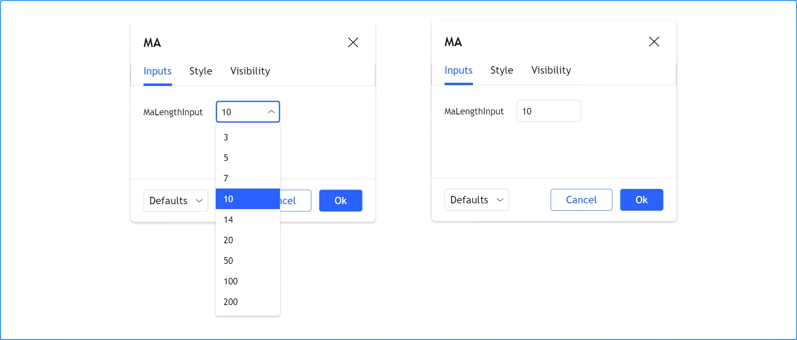

### [Float input](../1. Concepts/concepts_inputs.md#float-input)

Two signatures exist for the
[input.float()](../../reference manual/functions/input.float.md)
function; one when `options` is not used, the other when it is:

```
input.float(defval, title, minval, maxval, step, tooltip, inline, group, confirm, display, active) → input int

input.float(defval, title, options, tooltip, inline, group, confirm, display, active) → input int
```

Here, we use a “float” input for the factor used to multiple the
standard deviation, to calculate Bollinger Bands:

```pine
//@version=6
indicator("MA", "", true)
maLengthInput = input.int(10, minval = 1)
bbFactorInput = input.float(1.5, minval = 0, step = 0.5)
ma      = ta.sma(close, maLengthInput)
bbWidth = ta.stdev(ma, maLengthInput) * bbFactorInput
bbHi    = ma + bbWidth
bbLo    = ma - bbWidth
plot(ma)
plot(bbHi, "BB Hi", color.gray)
plot(bbLo, "BB Lo", color.gray)
```

The input widgets for floats are similar to the ones used for integer
inputs:

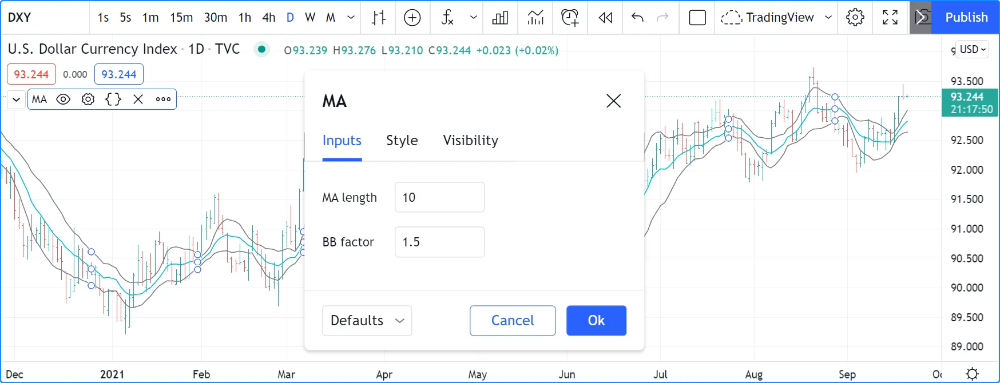

### [Boolean input](../1. Concepts/concepts_inputs.md#boolean-input)

Let’s continue to develop our script further, this time by adding a
boolean input to allow users to toggle the display of the BBs:

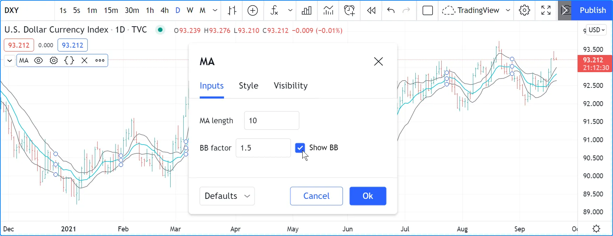

```pine
//@version=6
indicator("MA", "", true)
maLengthInput = input.int(10,    "MA length", minval = 1)
bbFactorInput = input.float(1.5, "BB factor", inline = "01", minval = 0, step = 0.5)
showBBInput   = input.bool(true, "Show BB",   inline = "01")
ma      = ta.sma(close, maLengthInput)
bbWidth = ta.stdev(ma, maLengthInput) * bbFactorInput
bbHi    = ma + bbWidth
bbLo    = ma - bbWidth
plot(ma, "MA", color.aqua)
plot(showBBInput ? bbHi : na, "BB Hi", color.gray)
plot(showBBInput ? bbLo : na, "BB Lo", color.gray)
```

Note that:

- We have added an input using
[input.bool()](../../reference manual/functions/input.bool.md)
to set the value of `showBBInput`.
- We use the `inline` parameter in that input and in the one for
`bbFactorInput` to bring them on the same line. We use `"01"` for
its argument in both cases. That is how the Pine Script compiler
recognizes that they belong on the same line. The particular string
used as an argument is unimportant and does not appear anywhere in
the “Inputs” tab; it is only used to identify which inputs go on
the same line.
- We have vertically aligned the `title` arguments of our `input.*()`
calls to make them easier to read.
- We use the `showBBInput` variable in our two
[plot()](../../reference manual/functions/plot.md)
calls to plot conditionally. When the user unchecks the checkbox of
the `showBBInput` input, the variable’s value becomes `false`. When
that happens, our
[plot()](../../reference manual/functions/plot.md)
calls plot the
[na](../../reference manual/variables/na.md)
value, which displays nothing. We use `true` as the default value of
the input, so the BBs plot by default.
- Because we use the `inline` parameter for the `bbFactorInput`
variable, its input field in the “Inputs” tab does not align
vertically with that of `maLengthInput`, which doesn’t use
`inline`.

### [Color input](../1. Concepts/concepts_inputs.md#color-input)

As explained in
[this](../2. Visuals/visuals_colors.md#maintaining-automatic-color-selectors) section of the [Colors](../2. Visuals/visuals_colors.md) page, selecting the colors of a script’s outputs via the
“Settings/Style” tab is not always possible. In the case where one
cannot choose colors from the “Style” tab, programmers can create
color inputs with the
[input.color()](../../reference manual/functions/input.color.md)
function to allow color customization from the “Settings/Inputs” tab.

Suppose we wanted to plot our BBs with a lighter transparency when the
[high](../../reference manual/variables/high.md)
and [low](../../reference manual/variables/low.md)
values are higher/lower than the BBs. We can use a code like this to
create the colors:

```pine
bbHiColor = color.new(color.gray, high > bbHi ? 60 : 0)
bbLoColor = color.new(color.gray, low  < bbLo ? 60 : 0)
```

When using dynamic (“series”) color components like the `transp`
arguments in the above code, the color widgets in the “Settings/Style”
tab will no longer appear. Let’s create our own input for color
selection, which will appear in the “Settings/Inputs” tab:

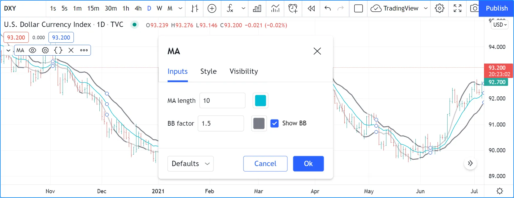

```pine
//@version=6
indicator("MA", "", true)
maLengthInput = input.int(10,           "MA length", inline = "01", minval = 1)
maColorInput  = input.color(color.aqua, "",          inline = "01")
bbFactorInput = input.float(1.5,        "BB factor", inline = "02", minval = 0, step = 0.5)
bbColorInput  = input.color(color.gray, "",          inline = "02")
showBBInput   = input.bool(true,        "Show BB",   inline = "02")
ma      = ta.sma(close, maLengthInput)
bbWidth = ta.stdev(ma, maLengthInput) * bbFactorInput
bbHi    = ma + bbWidth
bbLo    = ma - bbWidth
bbHiColor = color.new(bbColorInput, high > bbHi ? 60 : 0)
bbLoColor = color.new(bbColorInput, low  < bbLo ? 60 : 0)
plot(ma, "MA", maColorInput)
plot(showBBInput ? bbHi : na, "BB Hi", bbHiColor, 2)
plot(showBBInput ? bbLo : na, "BB Lo", bbLoColor, 2)
```

Note that:

- We have added two calls to
[input.color()](../../reference manual/functions/input.color.md)
to gather the values of the `maColorInput` and `bbColorInput`
variables. We use `maColorInput` directly in the
`plot(ma, "MA", maColorInput)` call, and we use `bbColorInput` to
build the `bbHiColor` and `bbLoColor` variables, which modulate the
transparency using the position of price relative to the BBs. We use
a conditional value for the `transp` value we call
[color.new()](../../reference manual/functions/color.new.md)
with, to generate different transparencies of the same base color.
- We do not use a `title` argument for our new color inputs because
they are on the same line as other inputs allowing users to
understand to which plots they apply.
- We have reorganized our `inline` arguments so they reflect the fact
we have inputs grouped on two distinct lines.

### [String input](../1. Concepts/concepts_inputs.md#string-input)

The [input.string()](../../reference manual/functions/input.string.md) function creates a string input with either a single-line _text field_ or a _dropdown menu_ of predefined text options. Other `input.*()` functions also return “string” values. However, most of them are specialized for specific tasks, such as defining timeframes, symbols, and sessions.

If a call to the [input.string()](../../reference manual/functions/input.string.md) function includes an `options` argument, it creates a dropdown menu containing the listed options. Otherwise, the call creates a text field that parses user-input text into a “string” value.

Like the [input.text\_area()](../../reference manual/functions/input.text_area.md) function, the [input.string()](../../reference manual/functions/input.string.md) text can contain up to 40,960 characters, including horizontal whitespaces. However, because the input’s field in the “Settings/Inputs” tab is _narrow_, [input.string()](../../reference manual/functions/input.string.md) is best suited for defining small strings or for providing a quick set of input options for customizing calculations.

The simple script below contains two [input.string()](../../reference manual/functions/input.string.md) calls. The first call creates a text field for defining the `timezone` argument of two [str.format\_time()](../../reference manual/functions/str.format_time.md) calls. It allows users to supply any text representing a [time zone](../1. Concepts/concepts_time.md#time-zones) in _UTC-offset_ or _IANA_ formats. The second call creates a _dropdown_ input with three preset options that determine the text shown in the drawn [labels](../2. Visuals/visuals_text-and-shapes.md#labels) (`"Open time"`, `"Close time"`, or `"Both"`):

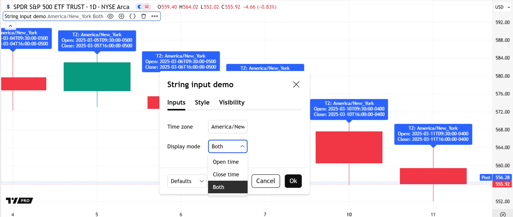

```pine
//@version=6
indicator("String input demo", overlay = true)

//@variable A "string" specifying a UTC offset or IANA identifier for time zone specification.
string timezoneInput = input.string("America/New_York", "Time zone")
//@variable A "string" specifying whether the labels show opening times, closing times, or both.
string displayModeInput = input.string("Both", "Display mode", ["Open time", "Close time", "Both"])

// Express the bar's `time` and `time_close` as formatted dates and times in the `timezoneInput` time zone.
string openText  = str.format_time(time,       timezone = timezoneInput)
string closeText = str.format_time(time_close, timezone = timezoneInput)

//@variable A formatted "string" containing the `openText`, `closeText`, or both, based on the `displayModeInput`.
string displayText = switch displayModeInput
    "Open time"  => str.format("TZ: {0}\nOpen: {1}", timezoneInput, openText)
    "Close time" => str.format("TZ: {0}\nClose: {1}", timezoneInput, closeText)
    =>              str.format("TZ: {0}\nOpen: {1}\nClose: {2}", timezoneInput, openText, closeText)

// Draw a label at the bar's `high` to show the `displayText`.
label.new(bar_index, high, displayText)
```

Note that:

- An alternative way to provide a strict list of input options is to use an [enum input](../1. Concepts/concepts_inputs.md#enum-input), which constructs a dropdown menu based on the _members_ of an [enum type](../3. Language/language_type-system.md#enum-types).
- In contrast to string declarations in code, the text field from a string input treats an input backslash (`\`) as a _literal character_. Therefore, the [input.string()](../../reference manual/functions/input.string.md) function _does not_ parse input [escape sequences](../1. Concepts/concepts_strings.md#escape-sequences) such as `\n`.

### [Text area input](../1. Concepts/concepts_inputs.md#text-area-input)

The [input.text\_area()](../../reference manual/functions/input.text_area.md) function creates a text field for parsing user-specified text into a “string” value. The text field generated by this function is much larger than the field from [input.string()](../../reference manual/functions/input.string.md). Additionally, it supports _multiline_ text.

Programmers often use text area inputs for purposes such as alert customization and multi-parameter lists.

This example uses the value of a text area input to represent a comma-separated list of symbols. The script [splits](../1. Concepts/concepts_strings.md#splitting-strings) the parsed “string” value by its comma characters to construct an [array](../../reference manual/types/array.md) of symbol substrings, then calls [request.security()](../../reference manual/functions/request.security.md) within a [for…in](../../reference manual/keywords/for...in.md) loop on that array to dynamically retrieve the latest [volume](../../reference manual/variables/volume.md) data for each specified symbol. On each loop iteration, the script converts the data to a “string” value with [str.tostring()](../../reference manual/functions/str.tostring.md) and displays the result in a [table](../../reference manual/types/table.md):

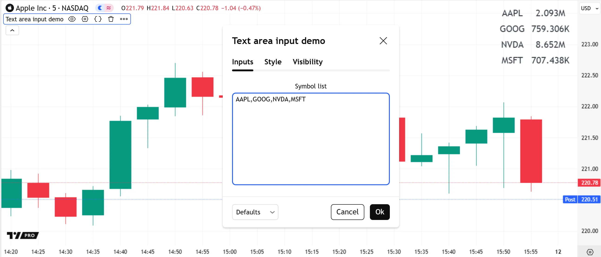

```pine
//@version=6
indicator("Text area input demo", overlay = true)

//@variable A comma-separated list of symbol names with optional exchange prefixes.
string symbolListInput = input.text_area("AAPL,GOOG,NVDA,MSFT", "Symbol list")

//@variable An array of symbol substrings formed by splitting the `symbolListInput` by its commas.
var array<string> symbols = str.split(symbolListInput, ",")

if barstate.islast
    //@variable A table displaying requested volume data for each symbol in the `symbols` array.
    var table display = table.new(position.bottom_right, 2, symbols.size())
    for [i, symbol] in symbols
        display.cell(0, i, symbol, text_color = chart.fg_color, text_size = 20)
        float vol = request.security(symbol, "", volume)
        display.cell(1, i, str.tostring(vol, format.volume), text_color = chart.fg_color, text_size = 20)
```

Note that:

- The script can use [request.security()](../../reference manual/functions/request.security.md) within a loop because [dynamic requests](../1. Concepts/concepts_other-timeframes-and-data.md#dynamic-requests) are enabled by default.
- As with [input.string()](../../reference manual/functions/input.string.md), the [input.text\_area()](../../reference manual/functions/input.text_area.md) function’s text field treats backslashes (`\`) as literal characters. It cannot process [escape sequences](../1. Concepts/concepts_strings.md#escape-sequences). However, the field automatically parses any line terminators and tab spaces in the specified text.
- Because text area inputs allow freeform, multiline text, it is often helpful to validate the [input.text\_area()](../../reference manual/functions/input.text_area.md) function’s results to prevent erroneous user inputs. Refer to the [Matching patterns](../1. Concepts/concepts_strings.md#matching-patterns) section of the [Strings](../1. Concepts/concepts_strings.md) page for an example that confirms an input symbol list using [regular expressions](https://en.wikipedia.org/wiki/Regular_expression).

### [Timeframe input](../1. Concepts/concepts_inputs.md#timeframe-input)

The [input.timeframe()](../../reference manual/functions/input.timeframe.md) function creates a dropdown input containing _timeframe choices_. It returns a “string” value representing the selected timeframe in our [specification format](../1. Concepts/concepts_timeframes.md#timeframe-string-specifications), which scripts can use in `request.*()` calls to retrieve data from user-selected timeframes.

The following script uses [request.security()](../../reference manual/functions/request.security.md) on each bar to fetch the value of a [ta.sma()](../../reference manual/functions/ta.sma.md) call from a user-specified higher timeframe, then plots the result on the chart:

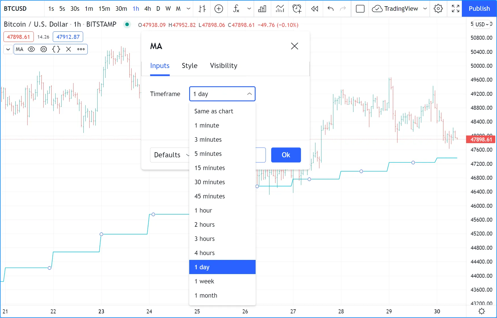

```pine
//@version=6
indicator("Timeframe input demo", "MA", true)

//@variable The timeframe of the requested data.
string tfInput = input.timeframe("1D", "Timeframe")

// Get the typical number of seconds in the chart's timeframe and the `tfInput` timeframe.
int chartSeconds = timeframe.in_seconds()
int tfSeconds    = timeframe.in_seconds(tfInput)
// Raise an error if the `tfInput` is a lower timeframe.
if tfSeconds < chartSeconds
    runtime.error("The 'Timeframe' input must represent a timeframe higher than or equal to the chart's.")

//@variable The offset of the requested expression. 1 when `tfInput` is a higher timeframe, 0 otherwise.
int offset = chartSeconds == tfSeconds ? 0 : 1
//@variable The 20-bar SMA of `close` prices for the current symbol from the `tfInput` timeframe.
float maHTF = request.security(syminfo.tickerid, tfInput, ta.sma(close, 20)[offset], lookahead = barmerge.lookahead_on)

// Plot the `maHTF` value.
plot(maHTF, "MA", color.aqua)
```

Note that:

- By default, the [input.timeframe()](../../reference manual/functions/input.timeframe.md) call’s dropdown contains options for the chart’s timeframe and all timeframes listed in the chart’s “Time interval” menu. To restrict the available options to specific preset timeframes, pass a [tuple](../3. Language/language_type-system.md#tuples) of timeframe strings to the function’s `options` parameter.
- This script calls [runtime.error()](../../reference manual/functions/runtime.error.md) to raise a custom runtime error if the [timeframe.in\_seconds()](../../reference manual/functions/timeframe.in_seconds.md) value for the `tfInput` timeframe is _less_ than the number of seconds in the main timeframe, preventing it from requesting lower-timeframe data. See [this section](../1. Concepts/concepts_other-timeframes-and-data.md#higher-timeframes) of the [Other timeframes and data](../1. Concepts/concepts_other-timeframes-and-data.md) page to learn more.
- The [request.security()](../../reference manual/functions/request.security.md) call uses [barmerge.lookahead\_on](../../reference manual/constants/barmerge.lookahead_on.md) as its `lookahead` argument, and it offsets the `expression` argument by one bar when the `tfInput` represents a _higher timeframe_ to [avoid repainting](../1. Concepts/concepts_other-timeframes-and-data.md#avoiding-repainting).

### [Symbol input](../1. Concepts/concepts_inputs.md#symbol-input)

The [input.symbol()](../../reference manual/functions/input.symbol.md) function creates an input widget that mirrors the chart’s “Symbol Search” widget. It returns a “string” _ticker identifier_ representing the chosen symbol and exchange, which scripts can use in `request.*()` calls to retrieve data from other contexts.

The script below uses [request.security()](../../reference manual/functions/request.security.md) to retrieve the value of a [ta.rsi()](../../reference manual/functions/ta.rsi.md) call evaluated on a user-specified symbol’s prices. It plots the requested result on the chart in a separate pane:

```pine
//@version=6
indicator("Symbol input demo", "RSI")

//@variable The ticker ID of the requested data. By default, it is an empty "string", which specifies the main symbol.
string symbolInput = input.symbol("", "Symbol")

//@variable The 14-bar RSI of `close` prices for the `symbolInput` symbol on the script's main timeframe.
float symbolRSI = request.security(symbolInput, timeframe.period, ta.rsi(close, 14))

// Plot the `symbolRSI` value.
plot(symbolRSI, "RSI", color.aqua)
```

Note that:

- The `defval` argument in the [input.symbol()](../../reference manual/functions/input.symbol.md) call is an empty “string”. When the [request.security()](../../reference manual/functions/request.security.md) call in this example uses this default value as the `symbol` argument, it calculates the RSI using the _chart symbol’s_ data. If the user wants to revert to the chart’s symbol after choosing another symbol, they can select “Reset settings” from the “Defaults” dropdown at the bottom of the “Settings” menu.

### [Session input](../1. Concepts/concepts_inputs.md#session-input)

Session inputs are useful to gather start-stop values for periods of
time. The
[input.session()](../../reference manual/functions/input.session.md)
built-in function creates an input widget allowing users to specify the
beginning and end time of a session. Selections can be made using a
dropdown menu, or by entering time values in “hh:mm” format.

The value returned by
[input.session()](../../reference manual/functions/input.session.md)
is a valid string in session format. See the manual’s page on
[sessions](../1. Concepts/concepts_sessions.md) for more
information.

Session information can also contain information on the days where the
session is valid. We use an
[input.string()](../../reference manual/functions/input.string.md)
function call here to input that day information:

```pine
//@version=6
indicator("Session input", "", true)
string sessionInput = input.session("0600-1700", "Session")
string daysInput = input.string("1234567", tooltip = "1 = Sunday, 7 = Saturday")
sessionString = sessionInput + ":" + daysInput
inSession = not na(time(timeframe.period, sessionString))
bgcolor(inSession ? color.silver : na)
```

Note that:

- This script proposes a default session of “0600-1700”.
- The
[input.string()](../../reference manual/functions/input.string.md)
call uses a tooltip to provide users with help on the format to use
to enter day information.
- A complete session string is built by concatenating the two strings
the script receives as inputs.
- We explicitly declare the type of our two inputs with the
[string](../../reference manual/types/string.md)
keyword to make it clear those variables will contain a string.
- We detect if the chart bar is in the user-defined session by calling
[time()](../../reference manual/functions/time.md)
with the session string. If the current bar’s
[time](../../reference manual/variables/time.md)
value (the time at the bar’s
[open](../../reference manual/variables/open.md))
is not in the session,
[time()](../../reference manual/functions/time.md)
returns
[na](../../reference manual/variables/na.md),
so `inSession` will be `true` whenever
[time()](../../reference manual/functions/time.md)
returns a value that is not
[na](../../reference manual/variables/na.md).

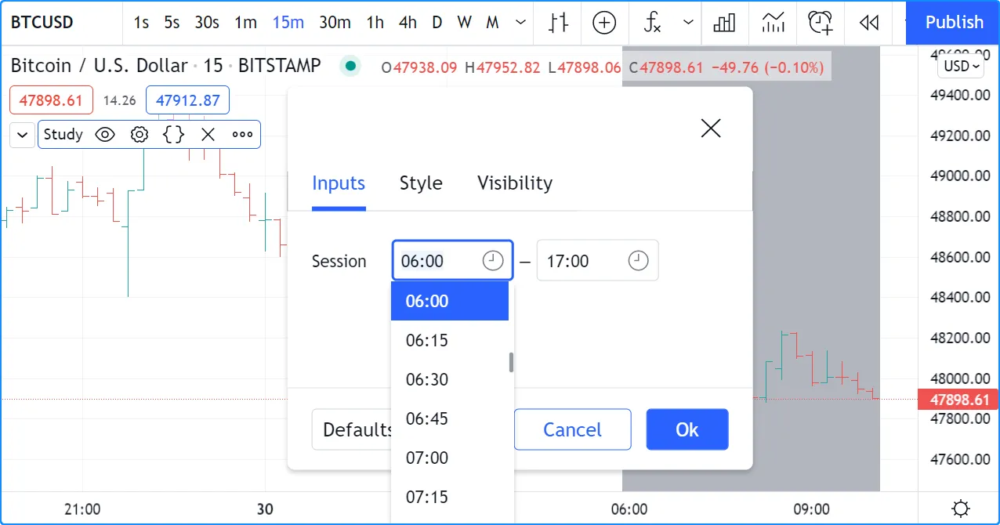

### [Source input](../1. Concepts/concepts_inputs.md#source-input)

Source inputs are useful to provide a selection of two types of sources:

- Price values, namely:
[open](../../reference manual/variables/open.md),
[high](../../reference manual/variables/high.md),
[low](../../reference manual/variables/low.md),
[close](../../reference manual/variables/close.md),
[hl2](../../reference manual/variables/hl2.md),
[hlc3](../../reference manual/variables/hlc3.md),
and
[ohlc4](../../reference manual/variables/ohlc4.md).
- The values plotted by other scripts on the chart. This can be useful
to “link” two or more scripts together by sending the output of
one as an input to another script.

This script simply plots the user’s selection of source. We propose the
[high](../../reference manual/variables/high.md)
as the default value:

```pine
//@version=6
indicator("Source input", "", true)
srcInput = input.source(high, "Source")
plot(srcInput, "Src", color.new(color.purple, 70), 6)
```

This shows a chart where, in addition to our script, we have loaded an
“Arnaud Legoux Moving Average” indicator. See here how we use our
script’s source input widget to select the output of the ALMA script as
an input into our script. Because our script plots that source in a
light-purple thick line, you see the plots from the two scripts overlap
because they plot the same value:

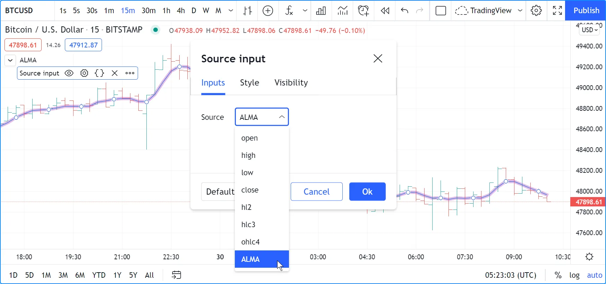

### [Time input](../1. Concepts/concepts_inputs.md#time-input)

The [input.time()](../../reference manual/functions/input.time.md) function creates a time input, which converts a user-specified date and time, in the chart’s [time zone](../1. Concepts/concepts_time.md#time-zones), into a time zone-agnostic [UNIX timestamp](../1. Concepts/concepts_time.md#unix-timestamps). The timestamp represents the absolute number of _milliseconds_ elapsed since 00:00:00
UTC on January 1, 1970. The input’s `defval` argument can be any “const int” value, including the value returned by the _single-argument_ overload of the [timestamp()](../../reference manual/functions/timestamp.md) function.

The [input.time()](../../reference manual/functions/input.time.md) function generates two fields: one for the _date_ and the other for the _time of day_. Additionally, it adds a _vertical marker_ to the chart. Users can change the input time either by moving this marker or by updating the value in the “Settings/Inputs” tab.

This simple script highlights the chart background for each bar whose opening time is past the date and time specified in a time input’s fields. This script defines the [input.time()](../../reference manual/functions/input.time.md) call’s default argument as the result of a [timestamp()](../../reference manual/functions/timestamp.md) call that calculates the UNIX timestamp corresponding to December 27, 2024, at 09:30
in UTC-5:

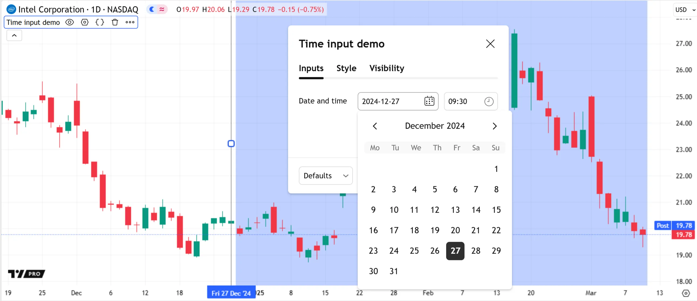

```pine
//@version=6
indicator("Time input demo", overlay = true)

//@variable A millisecond UNIX timestamp calculated from a specified date and time.
//          The input date and time are values in the chart's time zone, but the resulting UNIX timestamp
//          is time zone-agnostic.
int dateAndTimeInput = input.time(timestamp("27 Dec 2024 09:30 -0500"), "Date and time")

//@variable Is `true` if the bar's opening time is beyond the input date and time; `false` otherwise.
bool barIsLater = time > dateAndTimeInput

// Highlight the background when `barIsLater` is `true`.
bgcolor(barIsLater ? color.new(color.blue, 70) : na, title = "Bar opened later highlight")
```

Note that:

- The vertical line to the left of the background highlight is visible when selecting the script’s status line or opening the “Settings” menu. Moving this line _changes_ the input timestamp. Users can also change the time by choosing “Reset points” from the script’s “More” menu and selecting a new point directly on the chart.
- Changing the time zone in the chart’s settings can change the values shown in the input fields. However, the underlying UNIX timestamp does **not** change because it is unaffected by time zones.
- Users can _pair_ time inputs with [price inputs](../1. Concepts/concepts_inputs.md#price-input) to create interactive chart points. See the next section to learn more.

### [Price input](../1. Concepts/concepts_inputs.md#price-input)

The [input.price()](../../reference manual/functions/input.price.md) function creates a price input, which returns a specified floating-point value, similar to the [input.float()](../../reference manual/functions/input.float.md) function. Additionally, it adds a _horizontal marker_ to the chart, allowing users to adjust the “float” value graphically, without opening the “Settings/Inputs” tab.

For example, this script calculates an RSI and plots the result with different colors based on the `thresholdInput` value. The plot is green if the RSI is above the value. Otherwise, it is red. Unlike a standard [float input](../1. Concepts/concepts_inputs.md#float-input), users can set this script’s input value by dragging the input’s horizontal marker up or down on the chart:

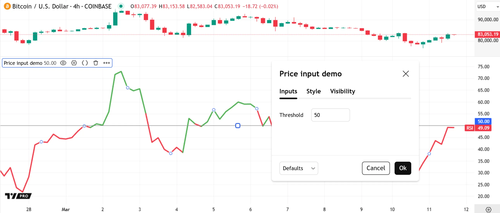

```pine
//@version=6
indicator("Price input demo")

//@variable The level at which the plot of the RSI changes color.
//          Users can adjust the value directly in the chart pane.
float thresholdInput = input.price(50.0, "Threshold")

//@variable The 14-bar RSI of `close` prices.
float rsi = ta.rsi(close, 14)

//@variable Is green if the `rsi` is above the `thresholdInput`; red otherwise.
color rsiColor = rsi > thresholdInput ? color.green : color.red

// Plot the `rsi` using the `rsiColor`.
plot(rsi, "RSI", rsiColor, 3)
```

Programmers can also _pair_ price inputs and [time inputs](../1. Concepts/concepts_inputs.md#time-input) to add _interactive points_ for custom calculations or drawings. When a script creates pairs of time and price inputs that belong to the same group, and each pair has a unique, matching `inline` argument, it adds _point markers_ on the chart instead of separate horizontal and vertical markers. Users can move these point markers to adjust input price and time values simultaneously.

This example creates four pairs of price and time inputs with distinct `inline` values. Each input includes `confirm = true`, meaning that users set the values when they add the script to a chart. The script prompts users to set four time-price points, then draws a closed [polyline](../../reference manual/types/polyline.md) that passes through all the valid chart locations closest to the specified coordinates:

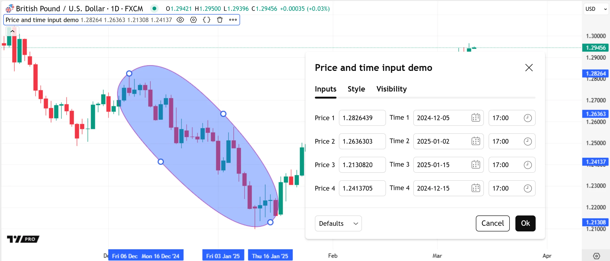

```pine
//@version=6
indicator("Price and time input demo", overlay = true)

// Create price and time inputs with the same `inline` arguments to set them together on the chart.

// Price and time for the first point.
float price1Input = input.price(0, "Price 1", inline = "1", confirm = true)
int   time1Input  = input.time(0,  "Time 1",  inline = "1", confirm = true)
// Price and time for the second point.
float price2Input = input.price(0, "Price 2", inline = "2", confirm = true)
int   time2Input  = input.time(0,  "Time 2",  inline = "2", confirm = true)
// Price and time for the third point.
float price3Input = input.price(0, "Price 3", inline = "3", confirm = true)
int   time3Input  = input.time(0,  "Time 3",  inline = "3", confirm = true)
// Price and time for the fourth point.
float price4Input = input.price(0, "Price 4", inline = "4", confirm = true)
int   time4Input  = input.time(0,  "Time 4",  inline = "4", confirm = true)

//@variable An array of chart points created from the time and price inputs.
var array<chart.point> points = array.from(
     chart.point.from_time(time1Input, price1Input),
     chart.point.from_time(time2Input, price2Input),
     chart.point.from_time(time3Input, price3Input),
     chart.point.from_time(time4Input, price4Input)
)

// Draw a closed, curved polyline connecting the points from the `points` array on the last bar.
if barstate.islast
    var polyline shape = polyline.new(points, true, true, xloc.bar_time, color.purple, color.new(color.blue, 60))
```

Note that:

- Setting input times and prices together is possible only if there is exactly _one_ input pair per `inline` value. If the inputs do not include `inline` arguments, or if more inputs have the same argument, the script sets times and prices separately.
- The script creates the drawing by constructing an [array](../../reference manual/types/array.md) of [chart points](../3. Language/language_type-system.md#chart-points), then using that array in a [polyline.new()](../../reference manual/functions/polyline.new.md) call. Refer to the [Polylines](../2. Visuals/visuals_lines-and-boxes.md#polylines) section of the [Lines and boxes](../2. Visuals/visuals_lines-and-boxes.md) page to learn more about polyline drawings.

### [Enum input](../1. Concepts/concepts_inputs.md#enum-input)

The
[input.enum()](../../reference manual/functions/input.enum.md)
function creates a dropdown input that displays _field titles_
corresponding to distinct _members_ (possible values) of an
[enum type](../3. Language/language_type-system.md#enum-types). The function returns one of the unique, named values from a
declared [enum](../3. Language/language_enums.md), which scripts
can use in calculations and logic requiring more strict control over
allowed values and operations. Supply a list of enum members to the
`options` parameter to specify the members users can select from the
dropdown. If one does not specify an enum field’s title, its title is
the “string” representation of its _name_.

This example declares a `SignalType` enum with four fields representing
named signal display modes: `long`, `short`, `both`, and `none`. The
script uses a member of this
[enum type](../3. Language/language_type-system.md#enum-types) as the `defval` argument in the
[input.enum()](../../reference manual/functions/input.enum.md)
call to generate a dropdown in the “Inputs” tab, allowing users to
select one of the enum’s titles to control which signals it displays on
the chart:

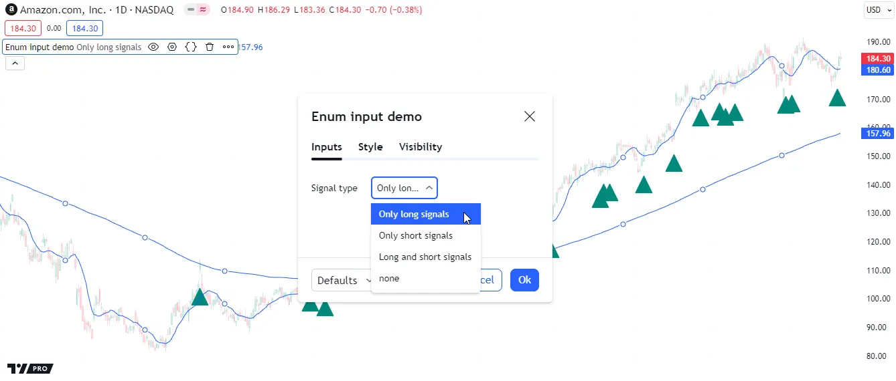

```pine
//@version=6
indicator("Enum input demo", overlay = true)

//@enum         An enumeration of named values representing signal display modes.
//@field long   Named value to specify that only long signals are allowed.
//@field short  Named value to specify that only short signals are allowed.
//@field both   Named value to specify that either signal type is allowed.
//@field none   Named value to specify that no signals are allowed.
enum SignalType
    long  = "Only long signals"
    short = "Only short signals"
    both  = "Long and short signals"
    none

//@variable An enumerator (member) of the `SignalType` enum. Controls the script's signals.
SignalType sigInput = input.enum(SignalType.long, "Signal type")

// Calculate moving averages.
float ma1 = ta.sma(ohlc4, 10)
float ma2 = ta.sma(ohlc4, 200)
// Calculate cross signals.
bool longCross  = ta.crossover(close, math.max(ma1, ma2))
bool shortCross = ta.crossunder(close, math.min(ma1, ma2))
// Calculate long and short signals based on the selected `sigInput` value.
bool longSignal = (sigInput == SignalType.long or sigInput == SignalType.both) and longCross
bool shortSignal = (sigInput == SignalType.short or sigInput == SignalType.both) and shortCross

// Plot shapes for the `longSignal` and `shortSignal`.
plotshape(longSignal, "Long signal", shape.triangleup, location.belowbar, color.teal, size = size.normal)
plotshape(shortSignal, "Short signal", shape.triangledown, location.abovebar, color.maroon, size = size.normal)
// Plot the moving averages.
plot(ma1, "Fast MA")
plot(ma2, "Slow MA")
```

Note that:

- The `sigInput` value is the `SignalType` member whose field
contains the selected title.
- Since we did not specify a title for the `none` field of the
enum, its title is the “string” representation of its name
(“none”), as we see in the above image of the enum input’s
dropdown.

By default, an enum input displays the titles of all an enum’s members
within its dropdown. If we supply an `options` argument to the
[input.enum()](../../reference manual/functions/input.enum.md)
call, it will only allow users to select the members included in that
list, e.g.:

```pine
SignalType sigInput = input.enum(SignalType.long, "Signal type", options = [SignalType.long, SignalType.short])
```

The above `options` argument specifies that users can only view and
select the titles of the `long` and `short` fields from the `SignalType`
enum. No other options are allowed:

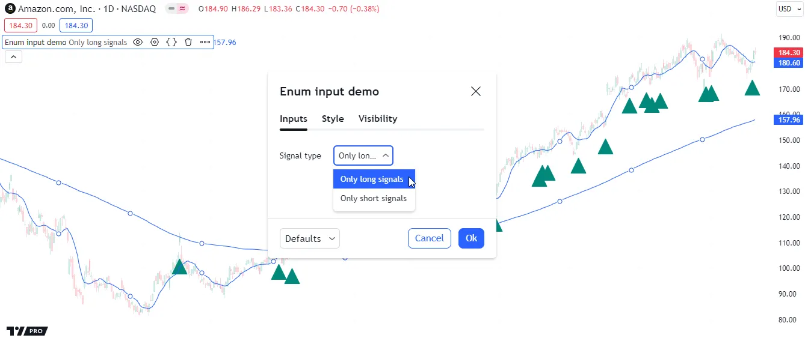

## [Other features affecting inputs](../1. Concepts/concepts_inputs.md#other-features-affecting-inputs)

Some parameters of the
[indicator()](../../reference manual/functions/indicator.md)
and
[strategy()](../../reference manual/functions/strategy.md)
functions populate a script’s “Settings/Inputs” tab with additional
inputs. These parameters are `timeframe`, `timeframe_gaps`, and
`calc_bars_count`. For example:

```pine
//@version=6
indicator("MA", "", true, timeframe = "D", timeframe_gaps = false)
plot(ta.vwma(close, 10))
```

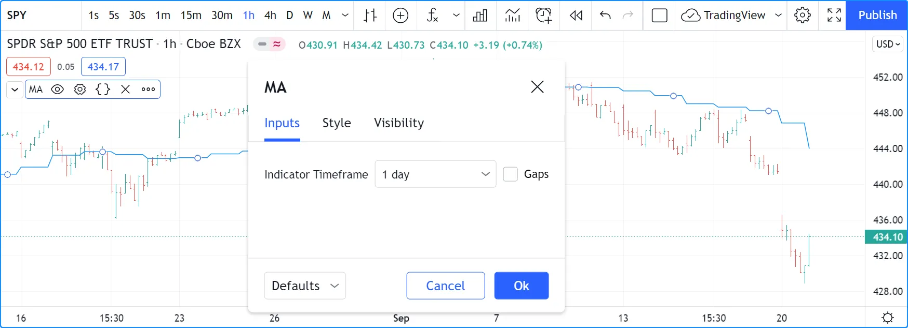

## [Tips](../1. Concepts/concepts_inputs.md#tips)

The design of your script’s inputs has an important impact on the
usability of your scripts. Well-designed inputs are more intuitively
usable and make for a better user experience:

- Choose clear and concise labels (your input’s `title` argument).
- Choose your default values carefully.
- Provide `minval` and `maxval` values that will prevent your code
from producing unexpected results, e.g., limit the minimal value of
lengths to 1 or 2, depending on the type of MA you are using.
- Provide a `step` value that is congruent with the value you are
capturing. Steps of 5 can be more useful on a 0-200 range, for
example, or steps of 0.05 on a 0.0-1.0 scale.
- Group related inputs on the same line using `inline`; bull and bear
colors for example, or the width and color of a line.
- When you have many inputs, group them into meaningful sections using
`group`. Place the most important sections at the top.
- Do the same for individual inputs **within** sections.

It can be advantageous to vertically align different arguments of
multiple `input.*()` calls in your code. When you need to make global
changes, this will allow you to use the Editor’s multi-cursor feature
to operate on all the lines at once.

It is sometimes necessary to use Unicode spaces to
achieve optimal alignment in inputs. This is an example:

```pine
//@version=6
indicator("Aligned inputs", "", true)

var GRP1 = "Not aligned"
ma1SourceInput   = input(close, "MA source",     inline = "11", group = GRP1)
ma1LengthInput   = input(close, "Length",        inline = "11", group = GRP1)
long1SourceInput = input(close, "Signal source", inline = "12", group = GRP1)
long1LengthInput = input(close, "Length",        inline = "12", group = GRP1)

var GRP2 = "Aligned"
// The three spaces after "MA source" are Unicode EN spaces (U+2002).
ma2SourceInput   = input(close, "MA source   ",  inline = "21", group = GRP2)
ma2LengthInput   = input(close, "Length",        inline = "21", group = GRP2)
long2SourceInput = input(close, "Signal source", inline = "22", group = GRP2)
long2LengthInput = input(close, "Length",        inline = "22", group = GRP2)

plot(ta.vwma(close, 10))
```

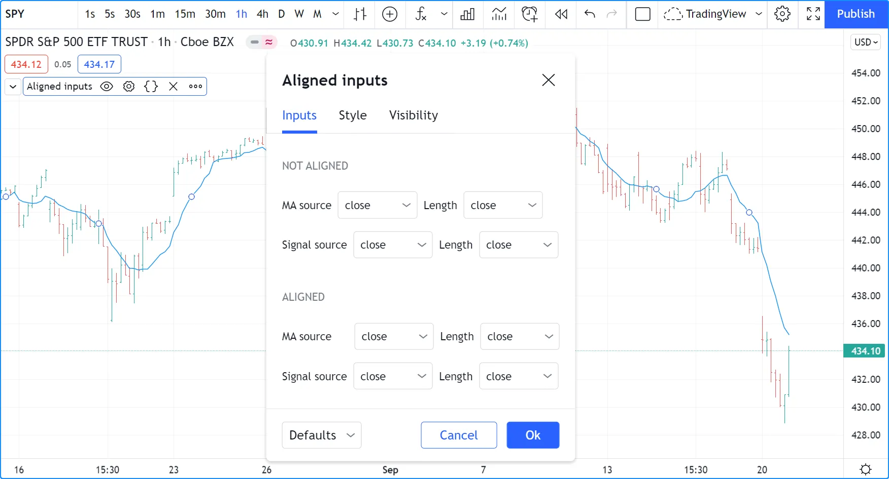

Note that:

- We use the `group` parameter to distinguish between the two sections
of inputs. We use a constant to hold the name of the groups. This
way, if we decide to change the name of the group, we only need to
change it in one place.
- The first sections inputs widgets do not align vertically. We are
using `inline`, which places the input widgets immediately to the
right of the label. Because the labels for the `ma1SourceInput` and
`long1SourceInput` inputs are of different lengths the labels are in
different _y_ positions.
- To make up for the misalignment, we pad the `title` argument in the
`ma2SourceInput` line with three Unicode EN spaces (U+2002). Unicode
spaces are necessary because ordinary spaces would be stripped from
the label. You can achieve precise alignment by combining different
quantities and types of Unicode spaces. See here for a list of
[Unicode spaces](https://jkorpela.fi/chars/spaces.html) of different
widths.

[Previous 
**Chart information**](../1. Concepts/concepts_chart-information.md) [Next 
**Libraries**](../1. Concepts/concepts_libraries.md)