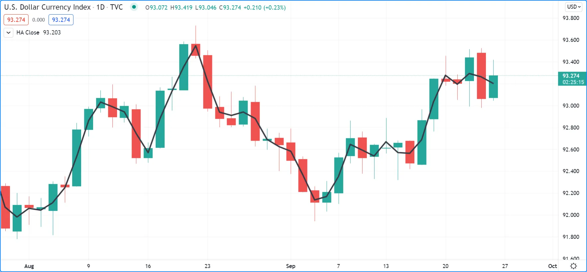
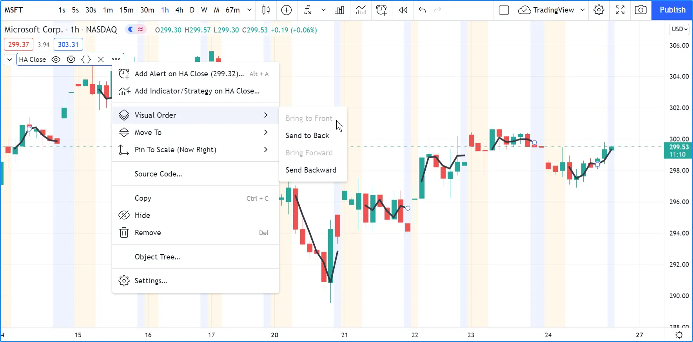
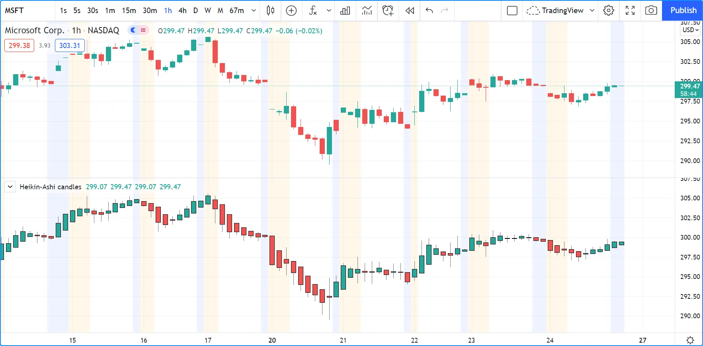

# [Non-standard charts data](../1. Concepts/concepts_non-standard-charts-data.md#non-standard-charts-data)

## [Introduction](../1. Concepts/concepts_non-standard-charts-data.md#introduction)

Pine Script® features several `ticker.*()` functions that generate _ticker identifiers_ for requesting data from _non-standard_ chart feeds. The available functions that create these ticker IDs are [ticker.heikinashi()](../../reference manual/functions/ticker.heikinashi.md), [ticker.renko()](../../reference manual/functions/ticker.renko.md), [ticker.linebreak()](../../reference manual/functions/ticker.linebreak.md), [ticker.kagi()](../../reference manual/functions/ticker.kagi.md), and [ticker.pointfigure()](../../reference manual/functions/ticker.pointfigure.md). Scripts can use these functions’ returned values as the `symbol` argument in [request.security()](../../reference manual/functions/request.security.md) calls to access non-standard chart data while running on _any_ chart type.

## [​`ticker.heikinashi()`​](../1. Concepts/concepts_non-standard-charts-data.md#tickerheikinashi)

_Heikin-Ashi_ means _average bar_ in Japanese. The open/high/low/close
values of Heikin-Ashi candlesticks are synthetic; they are not actual
market prices. They are calculated by averaging combinations of real
OHLC values from the current and previous bar. The calculations used
make Heikin-Ashi bars less noisy than normal candlesticks. They can be
useful to make visual assessments, but are unsuited to backtesting or
automated trading, as orders execute on market prices — not
Heikin-Ashi prices.

The
[ticker.heikinashi()](../../reference manual/functions/ticker.heikinashi.md)
function creates a special ticker identifier for requesting Heikin-Ashi
data with the
[request.security()](../../reference manual/functions/request.security.md)
function.

This script requests the close value of Heikin-Ashi bars and plots them
on top of the normal candlesticks:



```pine
//@version=6
indicator("HA Close", "", true)
haTicker = ticker.heikinashi(syminfo.tickerid)
haClose = request.security(haTicker, timeframe.period, close)
plot(haClose, "HA Close", color.black, 3)
```

Note that:

- The close values for Heikin-Ashi bars plotted as the black line are
very different from those of real candles using market prices. They
act more like a moving average.
- The black line appears over the chart bars because we have selected
“Visual Order/Bring to Front” from the script’s “More” menu.

If you wanted to omit values for extended hours in the last example, an
intermediary ticker without extended session information would need to
be created first:



```pine
//@version=6
indicator("HA Close", "", true)
regularSessionTicker = ticker.new(syminfo.prefix, syminfo.ticker, session.regular)
haTicker = ticker.heikinashi(regularSessionTicker)
haClose = request.security(haTicker, timeframe.period, close, gaps = barmerge.gaps_on)
plot(haClose, "HA Close", color.black, 3, plot.style_linebr)
```

Note that:

- We use the
[ticker.new()](../../reference manual/functions/ticker.new.md)
function first, to create a ticker without extended session
information.
- We use that ticker instead of
[syminfo.tickerid](../../reference manual/variables/syminfo.tickerid.md)
in our
[ticker.heikinashi()](../../reference manual/functions/ticker.heikinashi.md)
call.
- In our
[request.security()](../../reference manual/functions/request.security.md)
call, we set the `gaps` parameter’s value to `barmerge.gaps_on`.
This instructs the function not to use previous values to fill slots
where data is absent. This makes it possible for it to return
[na](../../reference manual/variables/na.md)
values outside of regular sessions.
- To be able to see this on the chart, we also need to use a special
`plot.style_linebr` style, which breaks the plots on
[na](../../reference manual/variables/na.md)
values.

This script plots Heikin-Ashi candles under the chart:



```pine
//@version=6
indicator("Heikin-Ashi candles")
CANDLE_GREEN = #26A69A
CANDLE_RED   = #EF5350

haTicker = ticker.heikinashi(syminfo.tickerid)
[haO, haH, haL, haC] = request.security(haTicker, timeframe.period, [open, high, low, close])
candleColor = haC >= haO ? CANDLE_GREEN : CANDLE_RED
plotcandle(haO, haH, haL, haC, color = candleColor)
```

Note that:

- We use a
[tuple](../3. Language/language_variable-declarations.md#tuple-declarations) with
[request.security()](../../reference manual/functions/request.security.md)
to fetch four values with the same call.
- We use
[plotcandle()](../../reference manual/functions/plotcandle.md)
to plot our candles. See the
[Bar plotting](../2. Visuals/visuals_bar-plotting.md) page
for more information.

## [​`ticker.renko()`​](../1. Concepts/concepts_non-standard-charts-data.md#tickerrenko)

_Renko_ bars only plot price movements, without taking time or volume
into consideration. They look like bricks stacked in adjacent
columns. A new brick is only drawn after the price passes the top or
bottom by a predetermined amount. The
[ticker.renko()](../../reference manual/functions/ticker.renko.md)
function creates a ticker id which can be used with
[request.security()](../../reference manual/functions/request.security.md)
to fetch Renko values, but there is no Pine Script function to draw
Renko bars on the chart:

```pine
//@version=6
indicator("", "", true)
renkoTicker = ticker.renko(syminfo.tickerid, "ATR", 10)
renkoLow = request.security(renkoTicker, timeframe.period, low)
plot(renkoLow)
```

## [​`ticker.linebreak()`​](../1. Concepts/concepts_non-standard-charts-data.md#tickerlinebreak)

The _Line Break_ chart type displays a series of vertical boxes that are
based on price changes. The
[ticker.linebreak()](../../reference manual/functions/ticker.linebreak.md)
function creates a ticker id which can be used with
[request.security()](../../reference manual/functions/request.security.md)
to fetch “Line Break” values, but there is no Pine Script function to
draw such bars on the chart:

```pine
//@version=6
indicator("", "", true)
lineBreakTicker = ticker.linebreak(syminfo.tickerid, 3)
lineBreakClose = request.security(lineBreakTicker, timeframe.period, close)
plot(lineBreakClose)
```

## [​`ticker.kagi()`​](../1. Concepts/concepts_non-standard-charts-data.md#tickerkagi)

_Kagi_ charts are made of a continuous line that changes directions. The
direction changes when the price changes beyond a predetermined
amount. The
[ticker.kagi()](../../reference manual/functions/ticker.kagi.md)
function creates a ticker id which can be used with
[request.security()](../../reference manual/functions/request.security.md)
to fetch “Kagi” values, but there is no Pine Script function to draw
such bars on the chart:

```pine
//@version=6
indicator("", "", true)
kagiBreakTicker = ticker.linebreak(syminfo.tickerid, 3)
kagiBreakClose = request.security(kagiBreakTicker, timeframe.period, close)
plot(kagiBreakClose)
```

## [​`ticker.pointfigure()`​](../1. Concepts/concepts_non-standard-charts-data.md#tickerpointfigure)

_Point and Figure_ (PnF) charts only plot price movements, without
taking time into consideration. A column of X’s is plotted as the price
rises, and O’s are plotted when price drops. The
[ticker.pointfigure()](../../reference manual/functions/ticker.pointfigure.md)
function creates a ticker id which can be used with
[request.security()](../../reference manual/functions/request.security.md)
to fetch “PnF” values, but there is no Pine Script function to draw
such bars on the chart. Every column of X’s or O’s is represented with
four numbers. You may think of them as synthetic OHLC PnF values:

```pine
//@version=6
indicator("", "", true)
pnfTicker = ticker.pointfigure(syminfo.tickerid, "hl", "ATR", 14, 3)
[pnfO, pnfC] = request.security(pnfTicker, timeframe.period, [open, close], barmerge.gaps_on)
plot(pnfO, "PnF Open", color.green, 4, plot.style_linebr)
plot(pnfC, "PnF Close", color.red, 4, plot.style_linebr)
```

[Previous 
**Libraries**](../1. Concepts/concepts_libraries.md) [Next 
**Other timeframes and data**](../1. Concepts/concepts_other-timeframes-and-data.md)