# [Sessions](../1. Concepts/concepts_sessions.md#sessions)

## [Introduction](../1. Concepts/concepts_sessions.md#introduction)

Exchanges define a _session_ for every symbol, which represents the times of day and days of the week in which the symbol can be traded. Exchanges might also define sessions other than the default one, which are called _subsessions_. Subsessions can be shorter or longer than the default session. If different sessions are available for a symbol, users can switch between them either from the “Sessions” controls in the bottom-right corner of the chart or from the chart’s “Settings/Symbol/Session” menu.

Programmers can use built-in functions and variables to define custom sessions, determine whether bars belong to specific sessions, retrieve data from named subsessions, and access session-related market states.

## [Time-based sessions](../1. Concepts/concepts_sessions.md#time-based-sessions)

A script can define a custom session by encoding the start time, end time, and, optionally, days of the week of the session into a _session string_. Scripts often [use time-based session strings](../1. Concepts/concepts_sessions.md#using-time-based-sessions) to check whether a bar belongs to certain time period.

### [Creating time-based sessions](../1. Concepts/concepts_sessions.md#creating-time-based-sessions)

Time-based session strings have the following syntax:

```
<time_period>:<days>
```

Where:

- `<time_period>` specifies the session’s start and end times in `"HHmm-HHmm"` format, where `"HH"` represents the _hour_ in 24-hour format (`"00"` to `"23"`) and `"mm"` represents the _minute_ (`"00"` to `"59"`) — for example, `"1700"` for 5PM. A comma can separate multiple time periods to specify combinations of discrete periods for the session, e.g., `"0800-0900,1230-1630"`.

- `<days>` specifies the _days of the week_ that the session applies to, using a set of digits from 1 to 7 to represent each day. The digits use `"1"` to represent Sunday, and count up through the week, ending with `"7"` to represent Saturday. `"0"` is not a valid day. If unspecified, the session applies every day.


The following table shows some examples of session strings:

| Example | Description |
| --- | --- |
| `"0000-0000:1234567"` | The normal format for a 7-day, 24-hour session beginning at midnight. |
| `"0000-0000"` | Equivalent to the previous example, because the default days are `"1234567"`. |
| `"0000-0000:23456"` | A 24-hour session beginning at midnight, but only Monday to Friday. |
| `"2000-1630:1234567"` | An overnight session that begins at 20:00<br> and ends at 16:30<br> the next day. It applies on all days of the week. |
| `"0930-1700:146"` | A session that begins at 9:30<br> and ends at 17:00<br> on Sundays (1), Wednesdays (4), and Fridays (6). |
| `"1700-1700:23456"` | An _overnight session_. The Monday session starts Sunday at 17:00<br> and ends Monday at 17:00<br>. It applies Monday through Friday. |
| `"1000-1001:26"` | An unusual session that lasts only one minute on Mondays (2) and Fridays (6). |
| `"0900-1600,1700-2000"` | A session that begins at 9:00<br>, breaks from 16:00<br> to 17:00<br>, and continues until 20:00<br>. Applies to every day of the week. |

Note that a special format exists to represent a 7-day, 24-hour session beginning at midnight: `"24x7"` — this session string is equivalent to the first two examples in the table above.

### [Using time-based sessions](../1. Concepts/concepts_sessions.md#using-time-based-sessions)

The [`time()` and `time_close()` functions](../1. Concepts/concepts_time.md#time-and-time_close-functions) can accept time-based session strings as their `session` parameter arguments:

- The [time()](../../reference manual/functions/time.md) function returns a [UNIX timestamp](../1. Concepts/concepts_sessions.md#@concepts/time/#unix-timestamps) for the _opening time_ of the current bar, or [na](../../reference manual/variables/na.md) if the bar is not in the specified session.
- The [time\_close()](../../reference manual/functions/time_close.md) function returns a UNIX timestamp for the _closing time_ of the current bar, or [na](../../reference manual/variables/na.md) if the bar is not in the specified session.

By testing for a returned [na](../../reference manual/variables/na.md) value, scripts can use the above functions to check whether a particular bar falls within a certain session.

To interpret the time zone of the specified `session`, the [time()](../../reference manual/functions/time.md) and [time\_close()](../../reference manual/functions/time_close.md) functions use the time zone of the exchange by default, unless a `timezone` argument is specified. This time zone can be different from the chart time zone, depending on the chart’s settings. For more information on time zones, see the [Time zones](../1. Concepts/concepts_time.md#time-zones) section of the [Time](../1. Concepts/concepts_time.md) page.

Additionally, the [input.session()](../../reference manual/functions/input.session.md) function also takes a time-based session string as its `defval` argument, to determine the input’s default value. Using this input type, users can define session times (but not days of the week) from a script’s “Inputs” tab. See the [Session input](../1. Concepts/concepts_inputs.md#session-input) section for more information.

The following example script checks whether the start and end time of a bar fall within a user-defined session. If the bar’s opening time, as returned by [time()](../../reference manual/functions/time.md), is within the session (i.e., the value is not [na](../../reference manual/variables/na.md)), the script draws a [label](../2. Visuals/visuals_text-and-shapes.md#labels) above the bar. Similarly, if the closing time returned by [time\_close()](../../reference manual/functions/time_close.md) is not [na](../../reference manual/variables/na.md), it draws a label below the bar. The labels display the bar open or close times and compare them to the selected session. Here, we run the script on an hourly chart with a short default morning session of “0900-1130”:

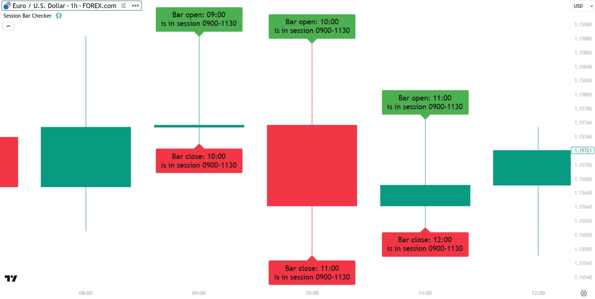

```pine
//@version=6
indicator("Session bar checker", overlay = true)

//@variable The session to check for.
string sessionInput = input.session(defval = "0900-1130", title = "Session")

// Check whether the bar open and close times are within the session.
bool isBarOpenInSession  = not na(time("", sessionInput))
bool isBarCloseInSession = not na(time_close("", sessionInput))

// If the bar open time is in the session, show the bar opening time and the session in a label.
if isBarOpenInSession
    label.new(x = bar_index, y = high, text = "Bar open: " + str.format_time(time, "HH:mm") + "\nis in session " +
      sessionInput, color = color.green, style = label.style_label_down, textcolor = chart.fg_color, size = size.large)

// If the bar close time is in the session, show the bar *closing* time and the session in a label.
if isBarCloseInSession
    label.new(x = bar_index, y = low, text = "Bar close: " + str.format_time(time_close, "HH:mm") + "\nis in session " +
      sessionInput, color = color.red, style=label.style_label_up, textcolor = chart.fg_color, size = size.large)
```

Note that:

- The script draws labels for the opening and closing times of _all_ bars that start within the session, even though the closing time of the last chart bar is _outside_ the session. This is because the [time()](../../reference manual/functions/time.md) and [time\_close()](../../reference manual/functions/time_close.md) functions create their own bar representations according to their parameters. In the image above, which is of an hourly chart, the session ends at 11:30
, so the final calculated bar representation in the session starts at 11:00
and ends at 11:30
. Therefore, the last bar’s end time is reported as being within the session, even though the chart bar ends at 12:00
.

Scripts can create _dynamic_ sessions, whose values can change during script execution, by calculating a “series string” argument for the `session` parameter of the [time()](../../reference manual/functions/time.md) or [time\_close()](../../reference manual/functions/time_close.md) functions. The following example script creates a dynamic time-based session string that differs on weekdays and weekends. The script uses the [time()](../../reference manual/functions/time.md) function to determine whether the current bar is within this dynamic session, and colors the background green if so:

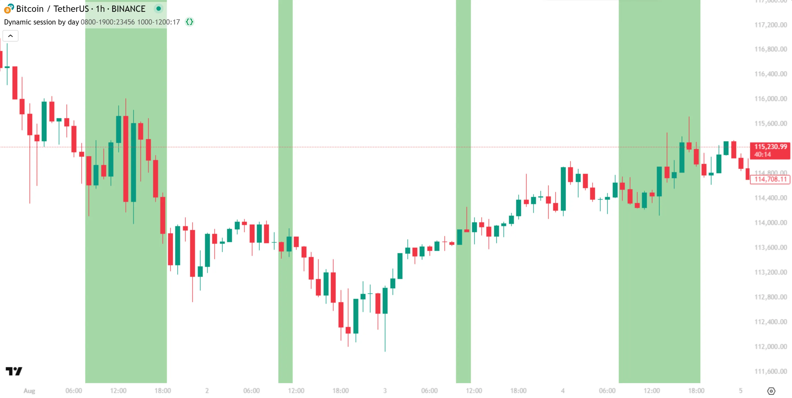

```pine
//@version=6
indicator("Dynamic session by day", overlay = true)

// Define the weekday and weekend sessions.
//@variable A time-based session string that defines the session for weekdays (Mon-Fri).
string weekdaySessionInput = input.session(defval = "0800-1900:23456", title = "Weekday Session")
//@variable A time-based session string that defines the session for weekends (Sat-Sun).
string weekendSessionInput = input.session(defval = "1000-1200:17",    title = "Weekend Session")

//@variable A "series string" for the session, which sets the session times depending on what day it is.
string dynamicSession = (dayofweek >= dayofweek.monday and dayofweek <= dayofweek.friday) ? weekdaySessionInput
: weekendSessionInput

// Use the `dynamicSession` string in the `time()` function to check if bar opening time is in the dynamic session.
//@variable Is `true` if the bar opens within the `dynamicSession` time, i.e., if `time()` does not return `na`.
bool isBarOpenInSession = not na(time(timeframe.period, dynamicSession))

// Color the background if the bar is within the session.
bgcolor(isBarOpenInSession ? color.new(color.green, 50) : na)
```

Scripts can retrieve the opening and closing times for a bar other than the current bar by using the `bars_back` parameter of the [time()](../../reference manual/functions/time.md) and [time\_close()](../../reference manual/functions/time_close.md) functions. For a positive `bars_back` value, the functions count that number of bars backward relative to the current bar, i.e., they retrieve times from _past_ bars. Passing a negative `bars_back` integer retrieves the UNIX timestamp for a bar up to 500 bars in the _future_.

The following script determines if a user-defined session is currently active by checking if the last bar is in the session. If so, the script displays the ending time of the active session in a [label](../2. Visuals/visuals_text-and-shapes.md#labels) positioned on the future bar that marks the end of the session. To find the last valid bar closing time in the session, the script uses a [loop](../3. Language/language_loops.md) to increment a dynamic `bars_back` argument for [time\_close()](../../reference manual/functions/time_close.md), stopping the loop when the returned closing time is [na](../../reference manual/variables/na.md). If the session is not active, the label displays a message to that effect at the current bar.

On the example chart below, we added a [vertical line](https://www.tradingview.com/support/solutions/43000518093-vertical-line/) using the chart’s [drawing tools](https://www.tradingview.com/support/solutions/43000703396-drawing-tools-available-on-tradingview/) to show that the bar time matches the session label:

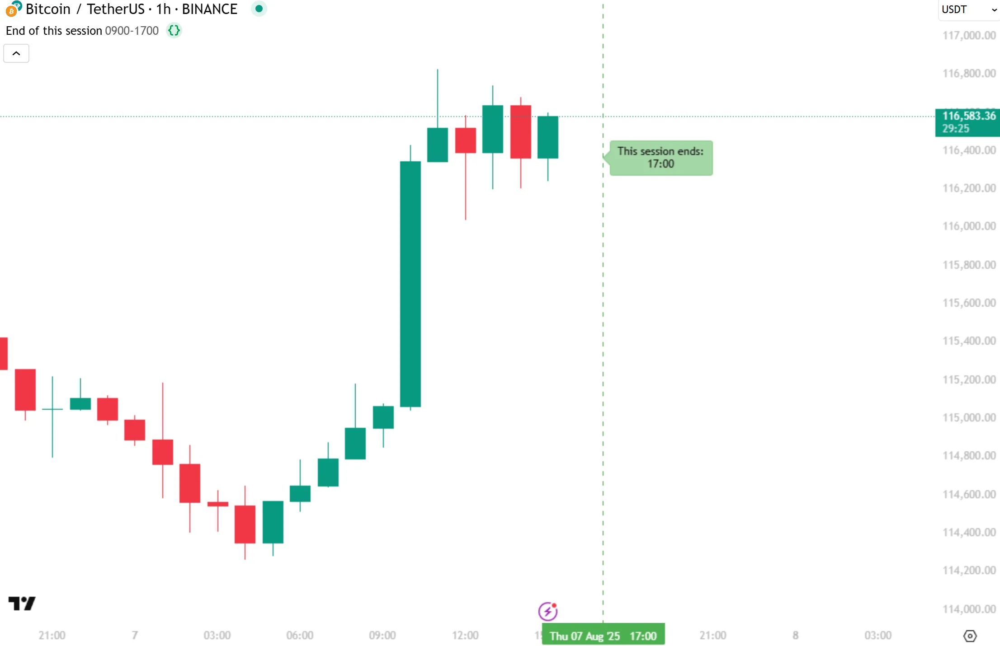

```pine
//@version=6
indicator("End of this session", overlay = true)

//@variable The session to check for. It applies every day of the week.
string sessionInput = input.session("0900-1700:1234567", "Session")

if barstate.islast
    bool isInSession = not na(time(timeframe.period, sessionInput))
    //@variable A UNIX timestamp for the closing time of the final bar in the active session, used to position the label.
    //  If session is not active, then the `time_close` of the current bar anchors the label instead.
    var int sessionEndTime = time_close

    // If the current bar is in the session, search forwards for the end of the session.
    if isInSession
        for i = 1 to 499
            // Check closing time of the next future bar, using dynamic `bars_back` argument.
            //@variable On each loop iteration, holds the closing time of the next future bar, to test if `na`.
            int futureBarCloseTime = time_close(timeframe.period, sessionInput, bars_back = -i)
            if na(futureBarCloseTime)
                break
            else
                // Update `sessionEndTime` to hold the last valid closing time found.
                sessionEndTime := futureBarCloseTime

    // Draw a label to show the session's end time. If bar is not in the session, display a message to that effect.
    var label sessionLabel = label.new(na, na, xloc = xloc.bar_time, yloc = yloc.price, text = na,
         color = color.new(color.green, 50), style = label.style_label_left, textcolor = chart.fg_color)
    //@variable The timestamp used to anchor the label either at the session's end or the current bar's closing time.
    int labelTime = isInSession ? sessionEndTime : time_close
    //@variable If session is active, text shows the "string" representation of the session's ending time.
    string labelText = isInSession ? "This session ends:\n" + str.format_time(labelTime, "HH:mm") :
         "Current bar is not in session"
    // Update the `x`, `y`, and `text` properties of the label.
    sessionLabel.set_xy(labelTime, open)
    sessionLabel.set_text(labelText)
```

Note that:

- We use [barstate.islast](../../reference manual/variables/barstate.islast.md) to avoid unnecessary historical calculations, because we want to highlight only the current session.
- The script supplies a negative integer `-i` as the argument to the `bars_back` parameter to return the closing times for _future_ bars.
- We use the `break` keyword to exit the [for](../../reference manual/keywords/for.md) loop as soon as we reach the end of the session. To learn more about this keyword, see the [Keywords and return expressions](../3. Language/language_loops.md#keywords-and-return-expressions) section of the [Loops](../3. Language/language_loops.md) page.
- The `sessionInput` end time must be within the trading period of the symbol on the chart in order for the script to display the label.
- For an extended example of using this technique to visually identify sessions, see the [How can I make an entire custom session visible?](../6. FAQ/faq_times-dates-and-sessions.md#how-can-i-make-an-entire-custom-session-visible) entry in the [Times, dates, and sessions FAQ](../6. FAQ/faq_times-dates-and-sessions.md).

## [Named sessions](../1. Concepts/concepts_sessions.md#named-sessions)

Exchanges often define _named subsessions_. These sessions can differ from the default session in one or more ways:

- They can include extended hours data, for example, pre-market and post-market trades.
- They can separate longer electronic trading sessions from shorter regular trading sessions, which is common in some futures markets.
- They can define some other periods of interest.

Traders can use named sessions to focus on trading periods with greater volume, or for other regional or timing purposes. A script can use named sessions to retrieve data from a different session than that of the chart, or to maintain the session that the script uses for its calculations even if the user changes the chart session.

To use data from a named session, first identify the exact name of the session, then [create a modified ticker](../1. Concepts/concepts_sessions.md#creating-a-session-specific-ticker) that uses that session, and finally [request data](../1. Concepts/concepts_sessions.md#requesting-data-from-session-specific-tickers) from that ticker. The sections below discuss these steps in more detail.

### [Retrieving named sessions](../1. Concepts/concepts_sessions.md#retrieving-named-sessions)

Unlike custom [time-based session](../1. Concepts/concepts_sessions.md#time-based-sessions) strings, which are user-defined, session names are _fixed_. Scripts can retrieve the active session’s name automatically. Programmers can also supply predefined session names in the code.

The following example script retrieves the name of the active session from the current chart using [syminfo.session](../../reference manual/variables/syminfo.session.md) and displays it in a [table](../2. Visuals/visuals_tables.md). The example chart below shows the script running on an hourly chart of the US stock “NASDAQ:AAPL”. We selected “Extended trading hours” from this chart’s “Sessions” menu (shown in the bottom-right corner of the image), so the session string displayed in the table is `"extended"`:

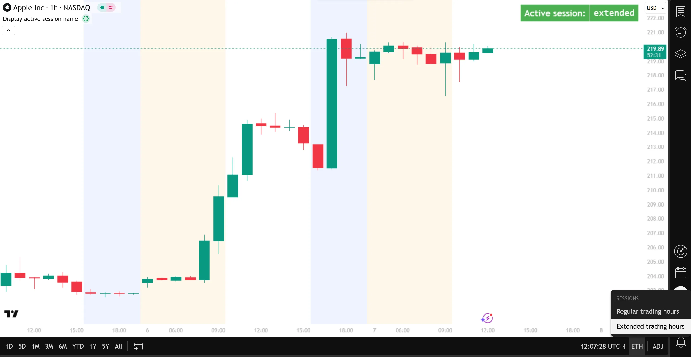

```pine
//@version=6
indicator("Display active session name", overlay = true)

if barstate.islast
    //@variable A table that displays the name of the active session on the current chart.
    table sessionTable = table.new(position = position.top_right, columns = 2, rows = 1, border_width = 1)
    sessionTable.cell(column = 0, row = 0, text = "Active session:", text_color = color.white,
      bgcolor = color.green, text_size = size.large)
    sessionTable.cell(column = 1, row = 0, text_font_family = font.family_monospace,
      text = syminfo.session, text_color = color.white, bgcolor = color.green, text_size = size.large)
```

If we select “Regular trading hours” from the chart settings, the script displays the session string `"regular"`.

For most US equities, the string `"regular"` is equivalent to the built-in constant [session.regular](../../reference manual/constants/session.regular.md), and the string `"extended"` is equivalent to the built-in constant [session.extended](../../reference manual/constants/session.extended.md). However, this is **not always** the case. Let’s look at the same script applied to the “S&P 500 E-mini futures” chart (ticker “ES1!”), with the “Electronic trading hours” session selected:

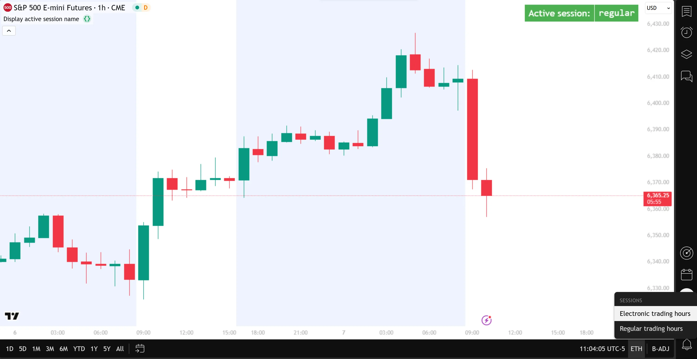

In the example above, the table shows that the active session is `"regular"`, even though the chart displays the “Electronic trading hours” session, which is _longer_ than the “Regular trading hours” session. If we switch to “Regular trading hours” on this chart, the active session is `"us_regular"`, _not_`"regular"`.

Now let’s look at some non-standard named sessions. Applying our previous example script to the “DAX Futures” chart (ticker “FDAX1!”), we can choose between the “Regular trading hours”, “Xetra trading hours”, and “Frankfurt trading hours” sessions on the chart, and the script displays the active session as `"regular"`, `"xetr_regular"`, and `"fwb_regular"`, respectively:

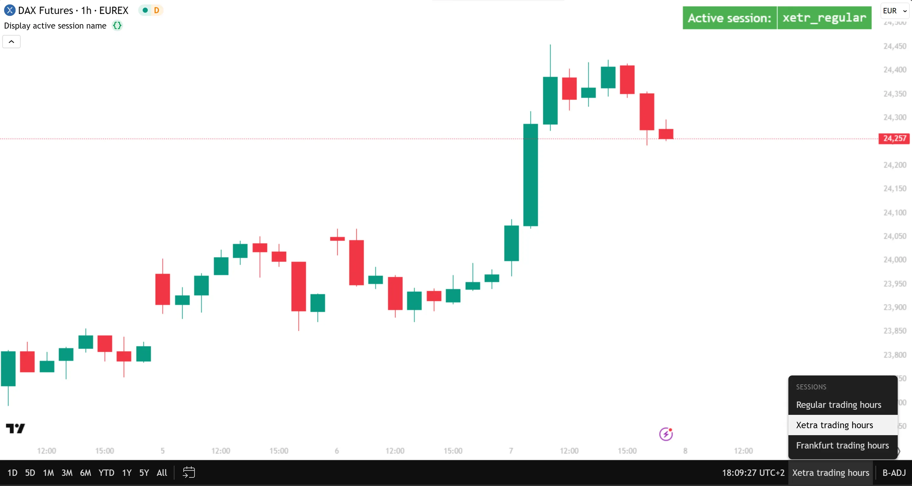

### [Creating a session-specific ticker](../1. Concepts/concepts_sessions.md#creating-a-session-specific-ticker)

A script can create a ticker that uses a specific session by using [ticker.new()](../../reference manual/functions/ticker.new.md) or [ticker.modify()](../../reference manual/functions/ticker.modify.md). Both functions create a new ticker identifier, which can specify additional session and pricing modifiers for the requested context. The only practical difference between the two functions is that [ticker.new()](../../reference manual/functions/ticker.new.md) creates a ticker from an exchange `prefix` and `ticker` name (two separate “string” arguments), whereas [ticker.modify()](../../reference manual/functions/ticker.modify.md) modifies a full ticker ID (`"prefix:ticker"` as one “string” argument, or a `tickerid` string with additional modifiers returned from `ticker.*()`).

For more information about the available `ticker.*()` functions, see the [Custom contexts](../1. Concepts/concepts_other-timeframes-and-data.md#custom-contexts) section of the [Other timeframes and data](../1. Concepts/concepts_other-timeframes-and-data.md) page.

The example script below creates the following five tickers for the “NASDAQ:AAPL” US equity and displays them in a [table](../2. Visuals/visuals_tables.md) for comparison:

1. A new ticker with the default session, using [ticker.modify()](../../reference manual/functions/ticker.modify.md).
2. A new ticker with the default session, using [ticker.new()](../../reference manual/functions/ticker.new.md).
3. A new ticker with an extended session, using [ticker.new()](../../reference manual/functions/ticker.new.md).
4. A modified version of the first ticker with an extended session, using [ticker.modify()](../../reference manual/functions/ticker.modify.md).
5. A new ticker with an extended session, using [ticker.modify()](../../reference manual/functions/ticker.modify.md).

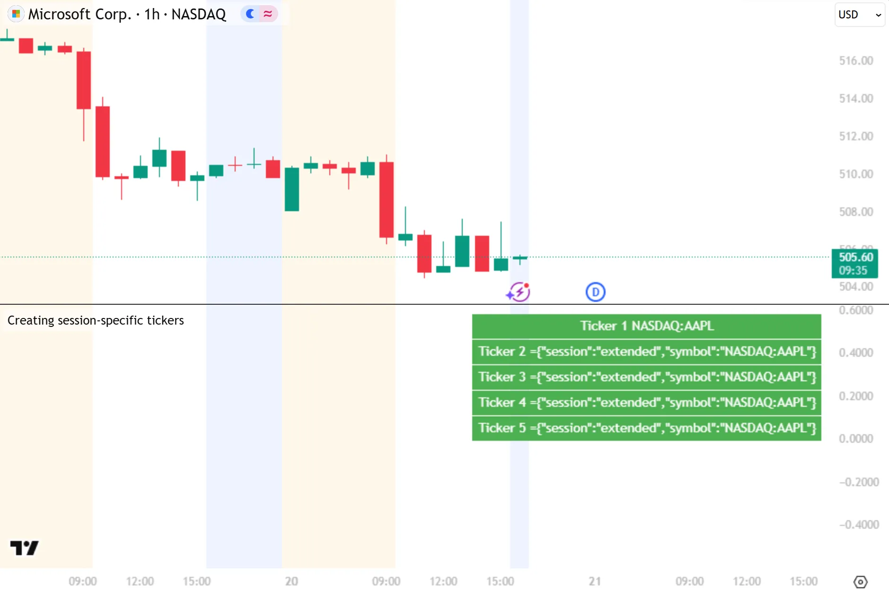

```pine
//@version=6
indicator("Creating session-specific tickers")

//@variable A new ticker ID, created using `ticker.modify()` with no optional parameters (default session).
string ticker1 = ticker.modify("NASDAQ:AAPL")
//@variable A new ticker ID, created using `ticker.new()` with no optional parameters (default session).
string ticker2 = ticker.new("NASDAQ", "AAPL")
//@variable A new ticker ID for "NASDAQ:AAPL" with an extended session, created using `ticker.new()`.
string ticker3 = ticker.new("NASDAQ", "AAPL", session.extended)
//@variable A modified version of `ticker1`, using `ticker.modify()` to modify to an extended session.
string ticker4 = ticker.modify(ticker1, session.extended)
//@variable A new ticker ID for "NASDAQ:AAPL" with an extended session, created using `ticker.modify()`.
string ticker5 = ticker.modify("NASDAQ:AAPL", session.extended)

// Display all the tickers.
if barstate.islastconfirmedhistory
    //@variable A `table` that displays the values of the different ticker ID strings created.
    table tickerTable = table.new(position = position.top_right, columns = 1, rows = 5, border_width = 1)
    tickerTable.cell(0, 0, "Ticker 1 " + ticker1, text_color = color.white, bgcolor = color.green)
    tickerTable.cell(0, 1, "Ticker 2 " + ticker2, text_color = color.white, bgcolor = color.green)
    tickerTable.cell(0, 2, "Ticker 3 " + ticker3, text_color = color.white, bgcolor = color.green)
    tickerTable.cell(0, 3, "Ticker 4 " + ticker4, text_color = color.white, bgcolor = color.green)
    tickerTable.cell(0, 4, "Ticker 5 " + ticker5, text_color = color.white, bgcolor = color.green)
```

Note that:

- The `ticker.modify("NASDAQ:AAPL")` function call always returns only a ticker. Requesting data from this ticker returns values from the _regular session_ of the equity, regardless of the session settings of the chart.
- The `ticker.new("NASDAQ", "AAPL")` call returns a ticker with extra information encoded, representing the defaults for extra optional parameters (such as settlement options for futures contracts), only for tickers where optional parameters are available. The returned ticker also encodes the session, if a non-default session is selected on the chart and the interval is intraday.
- All the other function calls _always_ return tickers with session information, because the session is specified in the call. The tickers can also contain information representing optional parameters.
- The script shows the tickers for the “NASDAQ:AAPL” symbol, regardless of the symbol that the chart displays, because the ticker information for that symbol is passed to the `ticker.*()` calls. To create tickers representing the chart symbol, use `syminfo.*` variables like [syminfo.prefix](../../reference manual/variables/syminfo.prefix.md), [syminfo.ticker](../../reference manual/variables/syminfo.ticker.md), and [syminfo.tickerid](../../reference manual/variables/syminfo.tickerid.md).

The previous example demonstrates that the two ticker creation functions are largely equivalent. For consistency, we use [ticker.new()](../../reference manual/functions/ticker.new.md) in our examples below.

### [Requesting data from session-specific tickers](../1. Concepts/concepts_sessions.md#requesting-data-from-session-specific-tickers)

Scripts use session-specific tickers in [request.security()](../../reference manual/functions/request.security.md) calls to retrieve data from that particular session.

This simple example script visualizes the [close](../../reference manual/variables/close.md) prices of the current asset from both the regular and extended sessions, using the [syminfo.prefix](../../reference manual/variables/syminfo.prefix.md) and [syminfo.ticker](../../reference manual/variables/syminfo.ticker.md) variables to create session-specific tickers for the symbol currently on the chart. It plots the prices from the extended session as a black line, and the prices from the regular session as red circles. First, we run the script on a 30-minute chart of “NASDAQ:AAPL”, with the “Extended trading hours” session selected:

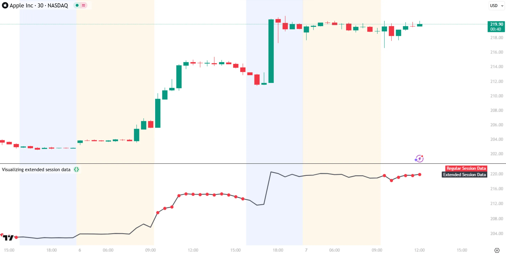

```pine
//@version=6
indicator("Visualizing extended session data")

//@variable The ticker ID for the extended session of the current chart symbol.
string extendedTicker = ticker.new(syminfo.prefix, syminfo.ticker, session.extended)
//@variable The ticker ID for the regular session of the current chart symbol.
string regularTicker  = ticker.new(syminfo.prefix, syminfo.ticker, session.regular)

//@variable The `close` price requested from the extended session of the chart's symbol.
float extendedClose  = request.security(extendedTicker, timeframe.period, close, barmerge.gaps_on)
//@variable The `close` price requested from the regular session of the chart's symbol.
float regularClose   = request.security(regularTicker, timeframe.period, close, barmerge.gaps_on)

// Plot the `extendedClose` with a black line, and the `regularClose` with red circles.
plot(extendedClose,  style = plot.style_linebr,  color = color.black, linewidth = 2, title = "Extended Session Data")
plot(regularClose,   style = plot.style_circles, color = color.red,   linewidth = 4, title = "Regular Session Data")
```

Note that:

- The chart automatically highlights the backgrounds for extended hours based on its “Symbol/Data Modification” settings; this is not controlled by the script.
- The `plot(regularClose)` call does not plot any circles during the pre-market and post-market sessions. This is because the [request.security()](../../reference manual/functions/request.security.md) call for `regularClose` allows data [gaps](../1. Concepts/concepts_other-timeframes-and-data.md#gaps) by using [barmerge.gaps\_on](../../reference manual/constants/barmerge.gaps_on.md), so it returns [na](../../reference manual/variables/na.md) for chart bars outside the regular trading session.
- The extended and regular closing prices have the same values on the 30-minute chart above. Running the same script on an _hourly_ chart instead produces _different_ values for the extended and regular closing prices, because the regular session starts at 09:30
and not on the hour.

Now let’s run the same script on the “S&P 500 E-mini futures” chart (ticker “ES1!”), with the “Electronic trading hours” session selected:

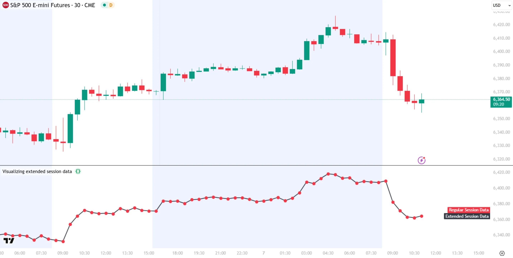

Notice that _both_ plots are exactly the same, covering the entire extended trading session. This is because, as we saw in the [Retrieving named sessions](../1. Concepts/concepts_sessions.md#retrieving-named-sessions) section, most US futures symbols use `"regular"` and `"us_regular"` as their session names. We can update our code to add a third plot that uses the `"us_regular"` session:

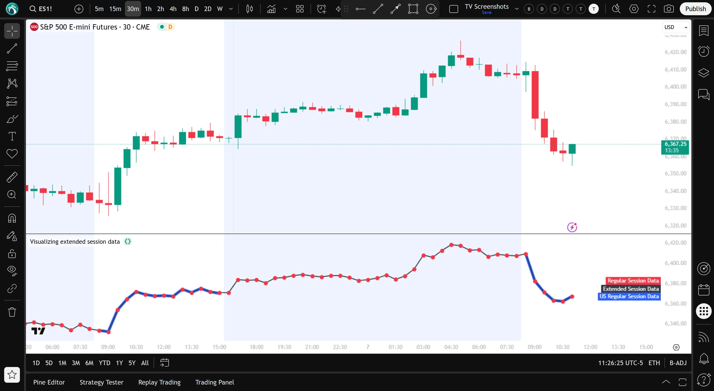

```pine
//@version=6
indicator("Visualizing extended session data")

//@variable The ticker ID for the extended session of the current chart symbol.
string extendedTicker  = ticker.new(syminfo.prefix, syminfo.ticker, "extended")
//@variable The ticker ID for the regular session of the current chart symbol.
string regularTicker   = ticker.new(syminfo.prefix, syminfo.ticker, "regular")
//@variable The ticker ID for the "us_regular" session of the current chart symbol.
string usRegularTicker = ticker.new(syminfo.prefix, syminfo.ticker, "us_regular")

//@variable The `close` price requested from the extended session of the chart's symbol.
float extendedClose   = request.security(extendedTicker,  timeframe.period, close, barmerge.gaps_on)
//@variable The `close` price requested from the regular session of the chart's symbol.
float regularClose    = request.security(regularTicker,   timeframe.period, close, barmerge.gaps_on)
//@variable The `close` price requested from the "us_regular" session of the chart's symbol.
float usRegularClose  = request.security(usRegularTicker, timeframe.period, close, barmerge.gaps_on)

// Plot the `usRegularClose` with a blue line.
plot(usRegularClose, style = plot.style_linebr,  color = color.blue,  linewidth = 6, title = "US Regular Session Data")
// Plot the `extendedClose` with a black line, and the `regularClose` with red circles.
plot(extendedClose,  style = plot.style_linebr,  color = color.black, linewidth = 2, title = "Extended Session Data")
plot(regularClose,   style = plot.style_circles, color = color.red,   linewidth = 4, title = "Regular Session Data")
```

Note that:

- The new `usRegularClose` plot, as we expect, displays prices only during the regular trading hours.
- We replaced [session.regular](../../reference manual/constants/session.regular.md) with the string `"regular"`, and [session.extended](../../reference manual/constants/session.extended.md) with the string `"extended"` in the other two [ticker.new()](../../reference manual/functions/ticker.new.md) function calls, just to show that these values are equivalent.

Lastly, let’s look at an example of using data from non-standard sessions. By applying the first example script from the [Retrieving named sessions](../1. Concepts/concepts_sessions.md#retrieving-named-sessions) section to the “DAX Futures chart” (ticker “FDAX1!”), we discovered that the chart sessions “Regular trading hours”, “Xetra trading hours”, and “Frankfurt trading hours” have the named sessions `"regular"`, `"xetr_regular"`, and `"fwb_regular"`, respectively. The following example plots the chart’s [close](../../reference manual/variables/close.md) prices with a blue line, and requests the “Frankfurt trading hours” session’s [close](../../reference manual/variables/close.md) prices to plot with teal circles. Here we run the script on the hourly “FDAX1!” chart with “Regular trading hours” selected on the chart:

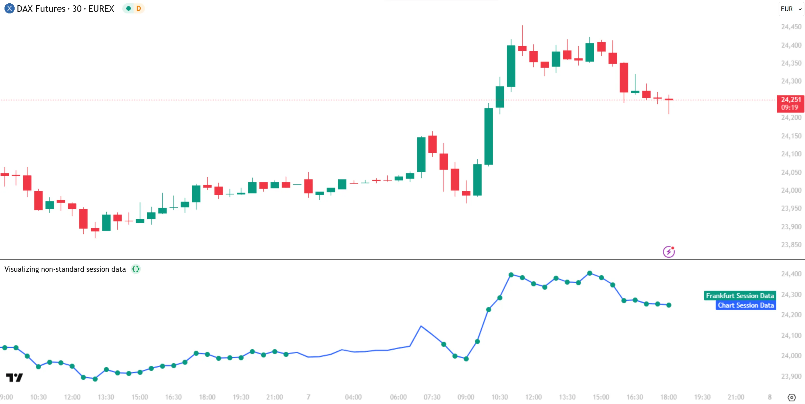

```pine
//@version=6
indicator("Visualizing non-standard session data")

//@variable The ticker ID for the "Frankfurt trading hours" session of the current chart symbol.
string fwbRegularTicker = ticker.new(syminfo.prefix, syminfo.ticker, "fwb_regular")
//@variable The `close` price requested from the "Frankfurt trading hours" session of the chart's symbol.
float fwbClose = request.security(fwbRegularTicker, timeframe.period, close, barmerge.gaps_on)

// Plot the current chart `close` with a blue line, and the `fwbClose` with teal circles.
plot(close,    style = plot.style_linebr,  color = color.blue, linewidth = 3, title = "Chart Session Data")
plot(fwbClose, style = plot.style_circles, color = color.teal,  linewidth = 4, title = "Frankfurt Session Data")
```

Note that:

- The “Frankfurt trading hours” session is shorter than the “Regular trading hours” session.
- Running this script on a chart that _does not_ define a named session `"fwb_regular"` plots circles for _all_ the bars.

## [Session variables reference](../1. Concepts/concepts_sessions.md#session-variables-reference)

Programmers can use several built-in variables for session-related data.

### [Market states](../1. Concepts/concepts_sessions.md#market-states)

The following Boolean variables track whether the current bar belongs to the pre-market or post-market session:

| Variable | Description |
| --- | --- |
| [session.ismarket](../../reference manual/variables/session.ismarket.md) | Is `true` when the bar belongs to _regular_ trading hours. On “1D” and above timeframes, this variable is always `true`. |
| [session.ispremarket](../../reference manual/variables/session.ispremarket.md) | Is `true` when the bar belongs to the extended session _preceding_ regular trading hours. Extended hours data is only shown on intraday timeframes; on “1D” and above, this variable is always `false`. |
| [session.ispostmarket](../../reference manual/variables/session.ispostmarket.md) | Is `true` when the bar belongs to the extended session _following_ regular trading hours. Extended hours data is only shown on intraday timeframes; on “1D” and above, this variable is always `false`. |

For tickers without pre-market and post-market sessions, such as “BTCUSD”, [session.ismarket](../../reference manual/variables/session.ismarket.md) is always `true` and [session.ispremarket](../../reference manual/variables/session.ispremarket.md) and [session.ispostmarket](../../reference manual/variables/session.ispostmarket.md) are always `false`.

For many futures symbols, Electronic trading hours (ETH) are considered the default session and use the named session `"regular"`, so during those hours [session.ismarket](../../reference manual/variables/session.ismarket.md) is `true` and [session.ispremarket](../../reference manual/variables/session.ispremarket.md) and [session.ispostmarket](../../reference manual/variables/session.ispostmarket.md) are both `false`.

### [First and last bars](../1. Concepts/concepts_sessions.md#first-and-last-bars)

The following Boolean variables track whether the current bar is the first or last in different sessions:

| Variable | Description |
| --- | --- |
| [session.isfirstbar](../../reference manual/variables/session.isfirstbar.md) | Is `true` if the current bar is the first bar of the day’s session, and `false` otherwise. If extended session information is used, it is only `true` on the first bar of the pre-market bars. Is `true` once for every session on the chart. |
| [session.isfirstbar\_regular](../../reference manual/variables/session.isfirstbar_regular.md) | Is `true` on the first regular session bar of the day, `false` otherwise. It is `true` only once per session. The result is the same whether extended session information is used or not. For futures, the “Electronic trading hours” session _is_ the regular session. This variable is always `false` when the ticker is configured to use a subsession. |
| [session.islastbar](../../reference manual/variables/session.islastbar.md) | Is `true` if the current bar is the last bar of the day’s session, and `false` otherwise. If extended session information is used, it is only `true` on the last bar of the post-market bars. |
| [session.islastbar\_regular](../../reference manual/variables/session.islastbar_regular.md) | Is `true` on the last regular session bar of the day, `false` otherwise. The result is the same whether extended session information is used or not. |

The [session.islastbar](../../reference manual/variables/session.islastbar.md) and [session.islastbar\_regular](../../reference manual/variables/session.islastbar_regular.md) variables might not be `true` for any bar in a session if no price or volume updates occur during the time period of the last bar. This is more likely at lower timeframes for thinly traded symbols. In contrast, [session.isfirstbar](../../reference manual/variables/session.isfirstbar.md) and [session.isfirstbar\_regular](../../reference manual/variables/session.isfirstbar_regular.md) are always `true` once for any session.

### [Named session variables](../1. Concepts/concepts_sessions.md#named-session-variables)

Scripts can use the following “string” variables to work with named sessions. The [Retrieving named sessions](../1. Concepts/concepts_sessions.md#retrieving-named-sessions) section of this page discusses the use of these variables.

| Variable | Description |
| --- | --- |
| [syminfo.session](../../reference manual/variables/syminfo.session.md) | Holds the current symbol’s session information. |
| [session.regular](../../reference manual/constants/session.regular.md) | Represents the regular trading session. |
| [session.extended](../../reference manual/constants/session.extended.md) | Represents the extended trading session. |

[Previous 
**Repainting**](../1. Concepts/concepts_repainting.md) [Next 
**Strategies**](../1. Concepts/concepts_strategies.md)