# [Strings](../1. Concepts/concepts_strings.md#strings)

## [Introduction](../1. Concepts/concepts_strings.md#introduction)

Pine Script® strings are immutable values containing sequences of up to 40,960 encoded characters, such as letters, digits, symbols, spaces, control characters, or other Unicode characters and code points. Strings allow scripts to represent a wide range of data as character patterns and human-readable text.

Scripts written in Pine use strings for several purposes, such as defining titles, expressing symbol and timeframe information, setting the contexts of data requests, creating alert and debug messages, and displaying text on the chart. The specialized functions in the `str` namespace provide convenient ways to construct strings, create modified copies of other strings, and inspect or extract substrings.

This page explains how Pine strings work, and how to construct, inspect, and modify strings using the available `str.*()` functions.

## [Literal strings](../1. Concepts/concepts_strings.md#literal-strings)

Literal strings are constant “string” values whose character sequences are defined literally in the source code. In Pine Script, programmers can define literal strings using [single-line](../1. Concepts/concepts_strings.md#single-line-strings) or [multiline](../1. Concepts/concepts_strings.md#multiline-strings) syntax.

### [Single-line strings](../1. Concepts/concepts_strings.md#single-line-strings)

A single-line string is a literal character sequence enclosed by a single pair of ASCII quotation marks (`"`) or apostrophes (`'`). All parts of the string’s definition, including the enclosing characters, occupy a _single_ line of code.

For example, the following code snippet declares two variables that store equivalent single-line strings containing the text `Hello world!`:

```pine
//@variable A literal string containing `Hello world!`. Uses the `"` character as the enclosing delimiter.
string hello1 = "Hello world!"
//@variable A literal string containing `Hello world!`. Uses the `'` character as the enclosing delimiter.
string hello2 = 'Hello world!'
```

The `"` or `'` enclosing delimiters in a single-line string definition are _not_ parts of the specified character sequence. They only mark the start and end of the string in the code. These characters _do not_ appear in outputs that display text from strings, such as [Pine Logs](../4. Writing_Scripts/writing_debugging.md#pine-logs) or various [drawings](../3. Language/language_type-system.md#drawing-types).

This example calls the [log.info()](../../reference manual/functions/log.info.md) function on the first bar to display the contents of the literal value `"Hello world!"` in the Pine Logs pane. The message in the pane displays the `Hello world!` text only, without the `"` characters:

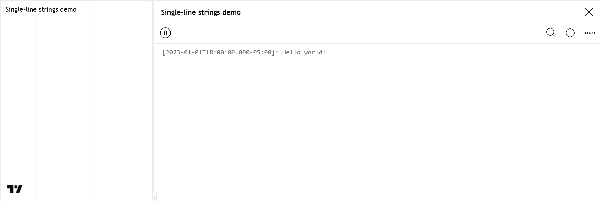

```pine
//@version=6
indicator("Single-line strings demo") // The script's displayed title does not include the quotation marks.

if barstate.isfirst
    // Log `Hello world!` on the first bar. The logged text does not include `"` characters.
    log.info("Hello world!")
```

Note that:

- The script also uses a single-line literal string to specify the `title` argument of the [indicator()](../../reference manual/functions/indicator.md) declaration statement.
- Only the `"` and `'` _ASCII_ characters are valid enclosing characters for literal strings. Other Unicode characters, such as U+FF02 (Fullwidth Quotation Mark), are not allowed in enclosing delimiters.
- The timestamp in square brackets (`[` and `]`) at the start of the logged message is an _automatic prefix_ showing the log’s time in the chart’s [time zone](../1. Concepts/concepts_time.md#time-zones). For more information, refer to the [Pine Logs](../4. Writing_Scripts/writing_debugging.md#pine-logs) section of the [Debugging](../4. Writing_Scripts/writing_debugging.md) page.

A single-line string definition can also use the enclosing `"` or `'` character within its character sequence, but only if it includes a single backslash (`\`) before each instance of the character to mark it as a _literal_ character instead of a string boundary.

For example, the following script version logs the text `"Hello world!"` in the Pine Logs pane, with quotation marks included, because the string definition uses `\"` to insert literal quotation marks:

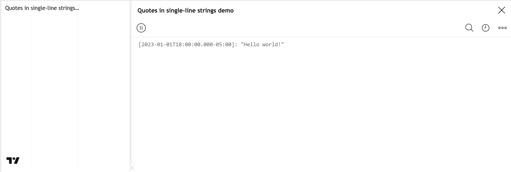

```pine
//@version=6
indicator("Quotes in single-line strings demo")

if barstate.isfirst
    // Log `"Hello world!"` on the first bar.
    // The `\"` sequences in the defined string insert literal `"` characters.
    log.info("\"Hello world!\"")
```

See the [Escape sequences](../1. Concepts/concepts_strings.md#escape-sequences) section below to learn more about the behavior of the `\` character in literal strings.

### [Multiline strings](../1. Concepts/concepts_strings.md#multiline-strings)

A multiline string is a literal character sequence enclosed by _three_ pairs of ASCII quotation marks (e.g. `"""..."""`) or apostrophes (e.g., `'''...'''`). This syntax offers convenience for defining literal strings that represent _multiline text_. All parts of a multiline string definition between the enclosing `"""` or `'''` delimiters can occupy _separate_ code lines and use _any_ amount of indentation. The definition automatically adds the _newline_ control character (U+000A) before each new line to insert a line terminator into the resulting string’s sequence.

For example, the following script defines a multiline string representing the text `Hello` and `world!` on separate text lines, then displays the result in a [label](../2. Visuals/visuals_text-and-shapes.md#labels) on the last historical bar. The string automatically includes _three_ newline characters — one before `Hello`, one before `world!`, and one before the end — because those parts of the sequence occupy _separate lines_ in the string’s definition:

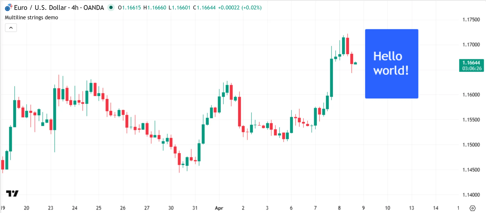

```pine
//@version=6
indicator("Multiline strings demo", overlay = true)

//@variable A string representing the text `Hello` and `world!` on separate text lines.
//          This multiline string is equivalent to the single-line string `"\nHello\nworld!\n"`
string helloStr = """
Hello
world!
"""

// Create a label to display the string's text on the last historical bar.
if barstate.islastconfirmedhistory
    label.new(
        bar_index + 10, close, helloStr,
        style = label.style_label_center,
        size = 30, textalign = text.align_left
    )
```

Note that:

- The enclosing characters of a multiline string cannot contain any other characters between them. For instance, changing the enclosing `"""` delimiter to `" " "` in this example causes a _compilation error_.
- Single-line strings can also represent multiline text if their definitions explicitly insert newline characters with the `\n` [escape sequence](../1. Concepts/concepts_strings.md#escape-sequences). For example, the single-line string `"\nHello\nworld!\n"` is equivalent to the multiline string defined in this code.

Multiline string definitions treat _all_ code between the enclosing `"""` or `'''` delimiters, including any space characters used for indentation, as _literal text_. If the separate lines in a multiline string definition contain leading spaces, the lines of text represented by the string include those spaces as well.

For example, the script below defines a multiline literal string with different numbers of leading spaces on each line, then displays the result in a label on the last historical bar. As shown below, the displayed lines of text preserve all the leading spaces included in the string definition:

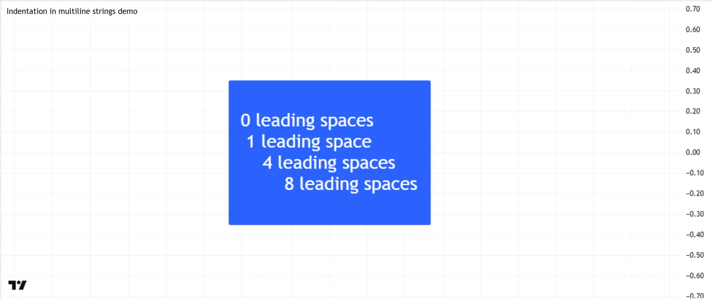

```pine
//@version=6
indicator("Indentation in multiline strings demo")

//@variable A string representing multiline text indented by spaces.
//          This multiline string is equivalent to the following single-line string:
//          `"\n0 leading spaces\n 1 leading space\n    4 leading spaces\n        8 leading spaces\n"`
string indentedText = """
0 leading spaces
1 leading space
    4 leading spaces
        8 leading spaces
"""

// Create a label to display the string's text on the last historical bar.
if barstate.islastconfirmedhistory
    label.new(
        bar_index, 0, indentedText,
        style = label.style_label_center,
        size = 30, textalign = text.align_left
    )
```

This same behavior also applies when defining multiline strings within indented code blocks or line-wrapped expressions. All lines in a multiline string definition after the first include _every_ leading space, starting from _column 0_ in the Pine Editor. They do _not_ include only the spaces starting from the indentation level of the enclosing code.

For example, the following script defines a multiline string _inside_ an [if](../../reference manual/keywords/if.md) structure and displays the string’s text in a label. Each new line in the string definition starts with four leading spaces to align with the indentation of the structure’s local block. The string definition treats these leading spaces as _literal characters_, not as syntax to indicate the local block. Therefore, the text in the label includes four-space indentation for all lines after the first:

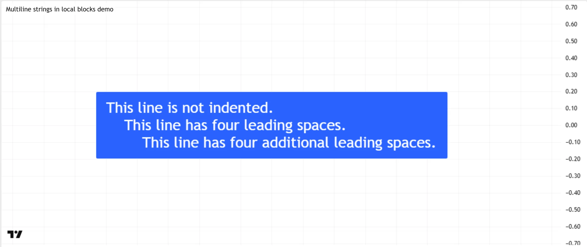

```pine
//@version=6
indicator("Multiline strings in local blocks demo")

if barstate.islastconfirmedhistory
    //@variable A multiline string defined in a local block.
    //          The string does not exclude the spaces used for block indentation.
    //          Consequently, each subseqent text line in the string starts with four spaces.
    string localMultiStr = """This line is not indented.
    This line has four leading spaces.
        This line has four additional leading spaces."""

    // Draw a label to display the string's defined text.
    label.new(
        bar_index, 0, localMultiStr,
        style = label.style_label_center,
        size = 30, textalign = text.align_left
    )
```

Multiline string definitions can include the same characters as those that define the enclosing delimiters (`"""` or `'''`) directly in their character sequences. Unlike a [single-line string](../1. Concepts/concepts_strings.md#single-line-strings) definition, which must prefix the `"` or `'` character with a backslash (`\`) to include it literally if it matches the enclosing characters, a multiline string definition does _not_ require a backslash to include the `"` or `'` character if:

- The character does not occur three consecutive times in the string’s sequence without other characters separating the occurrences.
- There is at least one other character or line break between the last `"` or `'` character and the end of the string.

For example, the following code block demonstrates equivalent literal strings that represent quoted text. The first string uses single-line syntax, and the second uses multiline syntax. The single-line syntax requires a backslash before each `"` character because it also uses that character for its enclosing delimiters. By contrast, the multiline syntax does not require a backslash before each `"` character in this example, because no part of the defined character sequence literally matches the enclosing `"""` delimiters:

```pine
//@variable A literal string, with quotes, defined using single-line syntax.
//          This example requires `\"` to include `"` in the string,
//          because that character matches the enclosing delimiters.
string quoted1 = " \"Some quoted text\" "

//@variable An equivalent literal string defined using multiline syntax.
//          Although the definition uses `"` characters in the enclosing delimiters, using `\"` is *optional*,
//          because a single `"` in the string does not match the enclosing `"""` sequences.
string quoted2 = """ "Some quoted text" """
```

## [Escape sequences](../1. Concepts/concepts_strings.md#escape-sequences)

The backslash character (`\`), also known as the Reverse Solidus in Unicode (U+005C), is an _escape character_ in Pine strings. This character forms an _escape sequence_ when it precedes another character, signaling that the following character has a potentially _different_ meaning than usual.

Characters with a special meaning in “string” value definitions, such as quotation marks and backslashes, become _literal_ characters when prefixed by a backslash (e.g., ` ` includes a single `\` in the character sequence).

This simple script declares a variable with an assigned literal “string” value enclosed in apostrophes (`'`) and displays the value’s contents in the [Pine Logs](../4. Writing_Scripts/writing_debugging.md#pine-logs) pane. It uses the `\` character to escape an extra apostrophe and another backslash, making them literal characters in the displayed text:

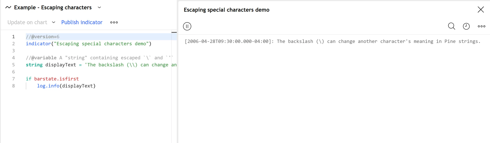

```pine
//@version=6
indicator("Escaping special characters demo")

//@variable A string containing escaped `\` and `'` characters.
string displayText = 'The backslash ( ) can change another character\'s meaning in Pine strings.'

if barstate.isfirst
    log.info(displayText)
```

Note that:

- This example must prefix the `'` character with a backslash in the string’s sequence because it also uses that character to mark its start and end boundaries. Without the backslash, it causes a _compilation error_. The script does not need to escape the apostrophe if we change the literal string’s enclosing characters to quotation marks (`"`).

The ASCII characters `n` and `t` usually have a literal meaning in Pine strings. However, when prefixed by the backslash character, they form escape sequences representing _control characters_. The `\n` sequence represents the newline character (U+000A), a line terminator for multiline text. The `\t` sequence represents the horizontal tab character (U+0009), which is helpful for indentation.

The script below creates a “string” value with multiline text on a single line of code, which it displays in a [label](../../reference manual/types/label.md) on the last historical bar. The defined value contains several `\n` and `\t` escape sequences to include line terminators and tab spaces in the displayed text:

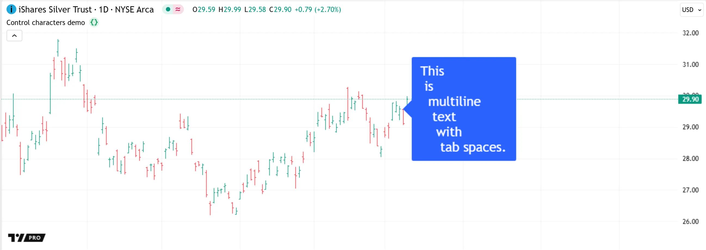

```pine
//@version=6
indicator("Control characters demo", overlay = true)

if barstate.islastconfirmedhistory
    //@variable A string containing `\n` and `\t` escape sequences. Renders as multiline text with indentation.
    string displayText = "\This\n\tis\n\t\tmultiline\n\t\t\ttext\n\t\t\t\twith\n\t\t\t\t\ttab spaces."
    // Draw a label showing the `displayText` at the bar's `high`.
    label.new(bar_index, high, displayText, style = label.style_label_left, size = 24, textalign = text.align_left)
```

Note that:

- The “string” value also includes `\` before the `T` character. However, that character still appears _literally_ in the displayed text. If a backslash applied to a character does not form a supported escape sequence, the character’s meaning _does not change_.

## [Concatenation](../1. Concepts/concepts_strings.md#concatenation)

The [+](../../reference manual/operators/+.md) and [+=](../../reference manual/operators/+=.md) operators signify _concatenation_ when the operands are strings. A concatenation operation appends the second operand’s character sequence to the first operand’s sequence to form a new, _combined_ “string” value.

For example, this script declares a `concatString` variable that holds the result of a concatenation operation. After declaring the variable, it uses the [+=](../../reference manual/operators/+=.md) operator to concatenate additional strings and reassign the variable’s value. Then, the script calls [log.info()](../../reference manual/functions/log.info.md) to show the result in the [Pine Logs](../4. Writing_Scripts/writing_debugging.md#pine-logs) pane:

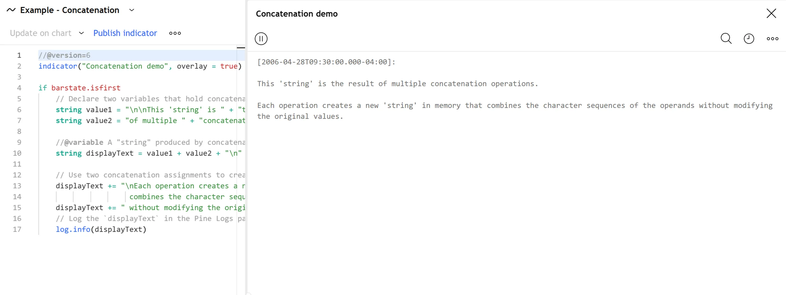

```pine
//@version=6
indicator("Concatenation demo", overlay = true)

if barstate.isfirst
    // Declare two variables that hold concatenated literal strings.
    string value1 = "\n\nThis 'string' is " + "the result "
    string value2 = "of multiple " + "concatenation operations."

    //@variable A string produced by concatenating `value1`, `value2`, and four literal strings.
    string displayText = value1 + value2 + "\n"

    // Use two concatenation assignments to create new strings from `displayText` and literal strings.
    displayText += "\nEach operation creates a new 'string' in memory that"
                     + " combines the character sequences of the operands"
    displayText += " without modifying the original values."
    // Log the `displayText` in the Pine Logs pane.
    log.info(displayText)
```

Note that:

- Strings are immutable and cannot change. Therefore, every concatenation operation creates a _new_ “string” value in memory. The operation does **not** modify either “string” operand directly.
- Another, more advanced way to combine strings is to collect them inside an [array](../../reference manual/types/array.md) and use the [array.join()](../../reference manual/functions/array.join.md) function. For more information, see the [Joining](../3. Language/language_arrays.md#joining) section of the [Arrays](../3. Language/language_arrays.md) page.
- In many cases, programmers can efficiently create _formatted strings_ with [str.format()](../../reference manual/functions/str.format.md) instead of combining individual strings with concatenation or joining. See the [Formatting strings](../1. Concepts/concepts_strings.md#formatting-strings) section to learn more.

## [String conversion and formatting](../1. Concepts/concepts_strings.md#string-conversion-and-formatting)

Programmers can use strings to represent data of virtually any type as human-readable character sequences. Converting data to strings allows scripts to perform many helpful tasks, including:

- Displaying dynamic prices and calculations as text inside [labels](../2. Visuals/visuals_text-and-shapes.md#labels), [tables](../2. Visuals/visuals_tables.md), or [boxes](../2. Visuals/visuals_lines-and-boxes.md#boxes).
- Creating [alert](../../reference manual/functions/alert.md) messages containing realtime market and indicator information.
- Logging [debug](../4. Writing_Scripts/writing_debugging.md) messages containing calculated script information in the [Pine Logs](../4. Writing_Scripts/writing_debugging.md#pine-logs) pane.
- Performing custom calculations and logic, such as constructing symbol or timeframe strings for [data requests](../1. Concepts/concepts_other-timeframes-and-data.md).

### [Converting values to strings](../1. Concepts/concepts_strings.md#converting-values-to-strings)

The simplest way to convert data to strings is to call the [str.tostring()](../../reference manual/functions/str.tostring.md) function. The function can represent values of several types as strings, based on predefined or custom formats. It has the following two signatures:

```
str.tostring(value) → string

str.tostring(value, format) → string
```

The function’s `value` parameter accepts any “int”, “float”, “bool”, or “string” value; the reference of an [array](../../reference manual/types/array.md) or [matrix](../../reference manual/types/matrix.md) containing values of these types; or a member of an [enum type](../3. Language/language_type-system.md#enum-types).

For example, this line of code creates a string representing the “float” value `123.456`, with default formatting. The result is usable in “string” operations and any script outputs that display _dynamic_ text, such as labels and tables:

```pine
//@variable Holds the "string" value `"123.456"`.
string numString = str.tostring(123.456)
```

The [str.tostring()](../../reference manual/functions/str.tostring.md) function’s `format` parameter determines the _numeric format_ for converted “int” and “float” values, [arrays](../3. Language/language_arrays.md), and [matrices](../3. Language/language_matrices.md). It can use one of the following `format.*` constants: [format.mintick](../../reference manual/constants/format.mintick.md), [format.percent](../../reference manual/constants/format.percent.md), or [format.volume](../../reference manual/constants/format.volume.md). Alternatively, programmers can use strings containing `#` (number sign), `0` (zero), `.` (period), `,` (comma), and `%` (percent sign) tokens for customized _formatting patterns_ with specific decimal precision. The default numeric format is `"#.########"`, which rounds fractional digits to eight decimal places without trailing zeros.

The script below uses the [str.tostring()](../../reference manual/functions/str.tostring.md) function to convert numeric values, a “bool” value, arrays, and a matrix into strings and displays the results in a [table](../../reference manual/types/table.md) on the last bar. The [str.tostring()](../../reference manual/functions/str.tostring.md) calls that convert numeric values and [collections](../3. Language/language_type-system.md#collections) contain different `format` arguments to demonstrate how various formatting patterns affect the results:

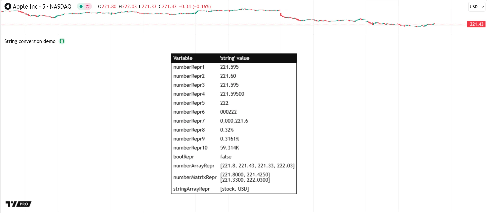

```pine
//@version=6
indicator("String conversion demo")

//@variable A 2-row, 15-column table showing "string" representations of numbers, "bool" values, and collections.
var table displayTable = table.new(position.middle_center, 2, 15, frame_color = chart.fg_color, frame_width = 1)

//@function Initializes a row to show two specified strings in the display table.
makeRow(int row, string str0, string str1) =>
    color bgColor   = row == 0 ? chart.fg_color : chart.bg_color
    color textColor = row == 0 ? chart.bg_color : chart.fg_color
    displayTable.cell(0, row, str0, text_color = textColor, text_halign = text.align_left, bgcolor = bgColor)
    displayTable.cell(1, row, str1, text_color = textColor, text_halign = text.align_left, bgcolor = bgColor)

// Initialize the header row for the `displayTable` on the first bar.
if barstate.isfirst
    makeRow(0, "Variable", "'string' value")

// Compute several "string" conversions and populate the `displayTable` with the results on the last bar.
if barstate.islast
    //@variable Represents `ta.vwap` with the default numeric format (`#.########`).
    string numberRepr1 = str.tostring(ta.vwap)
    //@variable Represents `ta.vwap` rounded to the minimum tick without trailing zeros.
    string numberRepr2 = str.tostring(ta.vwap, format.mintick)
    //@variable Represents `ta.vwap` rounded to three fractional digits without trailing zeros.
    string numberRepr3 = str.tostring(ta.vwap, "#.###")
    //@variable Represents `ta.vwap` rounded to five fractional digits with trailing zeros.
    string numberRepr4 = str.tostring(ta.vwap, "0.00000")
    //@variable Represents the `ta.vwap` as an integer.
    string numberRepr5 = str.tostring(ta.vwap, "#")
    //@variable Represents `ta.vwap` as an integer with leading zeros.
    string numberRepr6 = str.tostring(ta.vwap, "000000")
    //@variable Represents `ta.vwap` with commas for each third whole digit from the decimal point.
    //          Values less than 1000000 include leading zeros. The fractional part includes up to two digits.
    string numberRepr7 = str.tostring(ta.vwap, "0000,000.##")
    //@variable Represents `100 * ta.tr / close` rounded to two fractional digits with `%` at the end.
    string numberRepr8 = str.tostring(100 * ta.tr / close, format.percent)
    //@variable Represents `ta.tr / close` as a percentage rounded to four fractional digits.
    //          With `%` at the end of the `format`, the function multiplies the represented number by 100.
    string numberRepr9 = str.tostring(ta.tr / close, "#.####%")
    //@variable Represents `volume` with fixed precision and letter characters for large figures.
    //          `K` means "thousand", `M` means "million", `B` means "billion", and `T` means "trillion".
    string numberRepr10 = str.tostring(volume, format.volume)
    //@variable Represents a "bool" value. Is `"true"` when `ta.tr` exceeds the bar's range, `"false"` otherwise.
    string boolRepr = str.tostring(ta.tr > high - low)

    // Create an array and matrix of price values to convert into strings.
    array<float>  pricesArray  = array.from(open, close, low, high)
    matrix<float> pricesMatrix = matrix.new<float>(), pricesMatrix.add_row(0, pricesArray), pricesMatrix.reshape(2, 2)

    //@variable Represents the `pricesArray` values with up to two decimal places and no trailing zeros for each element.
    //          Contains `[` and `]` characters to mark the start and end of the array's contents.
    string numberArrayRepr = str.tostring(pricesArray, "#.##")
    //@variable Represents the `pricesMatrix` values with four decimal places and trailing zeros for each element.
    //          Contains `[` and `]` characters to mark the start and end of each row.
    string numberMatrixRepr = str.tostring(pricesMatrix, "#.0000")
    //@variable Represents a "string" array containing the symbol's type and currency.
    string stringArrayRepr = str.tostring(array.from(syminfo.type, syminfo.currency))

    // Populate the `displayTable` rows with each of the above variable names and their assigned "string" values.
    makeRow(1,  "numberRepr1",      numberRepr1)
    makeRow(2,  "numberRepr2",      numberRepr2)
    makeRow(3,  "numberRepr3",      numberRepr3)
    makeRow(4,  "numberRepr4",      numberRepr4)
    makeRow(5,  "numberRepr5",      numberRepr5)
    makeRow(6,  "numberRepr6",      numberRepr6)
    makeRow(7,  "numberRepr7",      numberRepr7)
    makeRow(8,  "numberRepr8",      numberRepr8)
    makeRow(9,  "numberRepr9",      numberRepr9)
    makeRow(10, "numberRepr10",     numberRepr10)
    makeRow(11, "boolRepr",         boolRepr)
    makeRow(12, "numberArrayRepr",  numberArrayRepr)
    makeRow(13, "numberMatrixRepr", numberMatrixRepr)
    makeRow(14, "stringArrayRepr",  stringArrayRepr)
```

Note that:

- The `#` and `0` tokens control the digits in the represented numbers in a similar way, but with different behaviors for leading and trailing _zeros_, as shown above. The `0` token _always_ includes a digit at the specified decimal place, even for a leading or trailing zero, whereas the `#` token allows a leading or trailing digit only if it is _nonzero_.
- The `format` argument requires a `#` or `0` token for each _fractional_ digit in a converted number. These tokens are optional for extra _whole_ digits, because [str.tostring()](../../reference manual/functions/str.tostring.md) includes the necessary digits automatically.
- A single `,` token adds _repeated_ comma separation to whole digits. In the [str.tostring()](../../reference manual/functions/str.tostring.md) call with the format `"0000,000.##"`, the token specifies that the result includes a dividing comma for every set of _three digits_ to the left of the decimal point.
- When the `%` token is at the _end_ of the formatting string, the representation multiplies numbers by 100 to express them as percentages, as shown by the example that uses `"#.####%"`.

### [Formatting strings](../1. Concepts/concepts_strings.md#formatting-strings)

The [str.format()](../../reference manual/functions/str.format.md) function can combine multiple “int”, “float”, “bool”, “string”, or array arguments into one output string in a specified format. Using this function is a simpler alternative to creating multiple separate strings and combining them with repeated [concatenation](../1. Concepts/concepts_strings.md#concatenation) operations. Below is the function’s signature:

```
str.format(formatString, arg0, arg1, ...) → string
```

The `formatString` parameter accepts a “string” value that defines the _format_ of the returned string, where the _placeholders_ in curly brackets (`{}`) refer to the function call’s _additional arguments_. The placeholder `"{0}"` represents the first additional argument `arg0`, `"{1}"` represents `arg1`, and so on. The function _replaces_ each placeholder in the `formatString` with a string representation of the corresponding argument. For instance, the call `str.format("The timeframe multiplier is {0}", timeframe.multiplier)` on a 1D chart returns `"The timeframe multiplier is 1"`.

The following example constructs a formatted string containing various bar information, then displays the result in a [label](../../reference manual/types/label.md) at the bar’s [high](../../reference manual/variables/high.md). The [str.format()](../../reference manual/functions/str.format.md) call’s `formatString` argument includes placeholders for 10 values, where each placeholder’s _number_ corresponds to one of the additional “string”, “bool”, “int”, or “float” arguments:

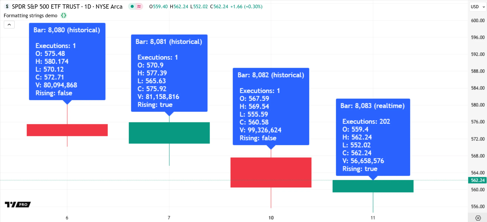

```pine
//@version=6
indicator("Formatting strings demo", overlay = true)

//@variable Counts script executions in a bar. Does not roll back because it is declared with `varip`.
varip int exCount = 0
exCount += 1

//@variable Is `true` when the `close` exceeds the current `open` and the previous `close`; `false` otherwise.
bool rising = close > math.max(nz(close[1]), open)
//@variable Is `"realtime"` for all new bars after the script's historical executions; `"historical"` otherwise.
string barState = barstate.isrealtime ? "realtime" : "historical"

//@variable A formatting string containing placeholders for 10 values.
string formatString = "Bar: {1} ({9}){0}{0}Executions: {2}{0}O: {3}{0}H: {4}{0}L: {5}{0}C: {6}{0}V: {7}{0}Rising: {8}"

//@variable A multiline string containing formatted information for the current bar.
string formattedString = str.format(
     formatString, "\n\t", bar_index, exCount - nz(exCount[1]), open, high, low, close, volume, rising, barState
)

// Draw a label displaying the `formattedString` at the bar's `high`.
label.new(bar_index, high, formattedString, size = 18, textalign = text.align_left)
```

Note that:

- The `formatString` argument can use placeholders in _any order_ and can repeat specific placeholders _more than once_. The format in this example uses `{0}` multiple times to insert the first argument (`"\n\t"`) to create multiline text with indentation.
- If a placeholder refers to a nonexistent argument, the formatted result treats that placeholder as a _literal_ character sequence. For instance, a placeholder such as `{20}` in the `formatString` argument above includes those characters literally in the formatted result, because the [str.format()](../../reference manual/functions/str.format.md) call _does not_ contain 21 additional arguments.
- _Non-quoted_ left curly brackets (`{`) must have corresponding right curly brackets (`}`) inside formatting strings. If a `formatString` contains unbalanced curly brackets, it causes a _runtime error_.

It’s important to note that the apostrophe (`'`) acts as a _quote character_ inside formatting strings. When a formatting string contains a character sequence between two apostrophes, the formatted result includes that sequence directly, without treating the characters as placeholders or formatting tokens. This behavior applies even if the formatting string prefixes apostrophes with the backslash character (`\`). The enclosing apostrophes for a non-empty quoted sequence are **not** part of the formatted string. To include literal apostrophes in a [str.format()](../../reference manual/functions/str.format.md) call’s result, pass a “string” value containing the character as an _extra argument_, then use that argument’s _placeholder_ in the specified `formatString`. Alternatively, use pairs of apostrophes with no characters between them directly in the `formatString` (e.g., `''` adds a single `'` character in the result).

The example below demonstrates how using apostrophes directly in formatting strings differs from inserting them via placeholders. The script uses the `'` character directly in the [str.format()](../../reference manual/functions/str.format.md) call’s `formatString` to define a _quoted sequence_, and it uses the `{1}` placeholder to insert the character from an extra argument without creating a quoted sequence. The script displays the resulting `formattedString` value in a single-cell [table](../../reference manual/types/table.md) on the first bar:

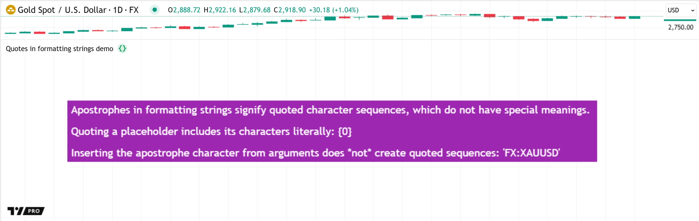

```pine
//@version=6
indicator("Quotes in formatting strings demo")

if barstate.isfirst
    //@variable A concatenated formatting string that contains apostrophes and placeholders.
    string formatString =
         "Apostrophes in formatting strings signify quoted character sequences, which do not have special meaning."
         + "\n\nQuoting a placeholder includes its characters literally: '{0}'"
         + "\n\nInserting the apostrophe character from arguments does *not* create quoted sequences: {1}{0}{1}"
    //@variable A formatted string showing how using `'` directly differs from insertion via arguments.
    string formattedString = str.format(formatString, ticker.standard(), "'")

    //@variable A single-cell table to display the `formattedString`.
    table display = table.new(position.middle_center, 1, 1, color.purple)
    // Initialize the cell with white, left-aligned text.
    display.cell(0, 0, formattedString, text_color = color.white, text_halign = text.align_left, text_size = 20)
```

When a [str.format()](../../reference manual/functions/str.format.md) call contains “int” or “float” arguments, the placeholders for those arguments in the `formatString` can include the `number` _modifier_ followed by a _formatting pattern_ for customized numeric formats (e.g., `"{0,number,#.000}"`).

The possible numeric formatting patterns are similar to those for the `format` parameter of [str.tostring()](../../reference manual/functions/str.tostring.md). They can contain `#`, `0`, and `.` tokens to specify decimal precision; use the `,` token for comma separation; and include `%` at the end for percentage conversion. Alternatively, a placeholder can use one of the following _keywords_ that specify _predefined_ formatting patterns: `integer`, `currency`, or `percent`.

The script below demonstrates how different numeric formats in a `formatString` placeholder affect the formatted representation of a “float” value. On the last bar, the script generates a pseudorandom value between 0 and 10000 with [math.random()](../../reference manual/functions/math.random.md), uses several [str.format()](../../reference manual/functions/str.format.md) calls to format the value in different ways, and displays the results in a [table](../../reference manual/types/table.md):

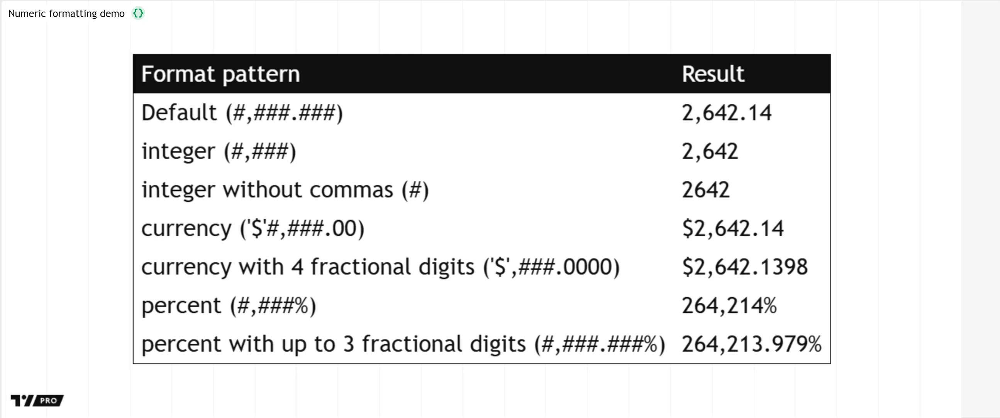

```pine
//@version=6
indicator("Numeric formatting demo")

//@variable A two-row, eight-column table showing a pseudorandom number formatted with different format patterns.
var table display = table.new(position.middle_center, 2, 8, frame_color = chart.fg_color, frame_width = 1)

//@variable Initializes a row to show two specified strings in the `display` table.
makeRow(int row, string str0, string str1) =>
    color bgColor   = row == 0 ? chart.fg_color : chart.bg_color
    color textColor = row == 0 ? chart.bg_color : chart.fg_color
    display.cell(0, row, str0, text_color = textColor, text_halign = text.align_left, text_size = 30, bgcolor = bgColor)
    display.cell(1, row, str1, text_color = textColor, text_halign = text.align_left, text_size = 30, bgcolor = bgColor)

// Initialize the header row for the `display` table on the first bar.
if barstate.isfirst
    makeRow(0, "Format pattern", "Result")

if barstate.islast
    //@variable A pseudorandom value between 0 and 10000.
    float value = math.random(0, 10000)

    //@variable Represents the `value` using the `str.format()` function's default numeric format (`#,###.###`).
    //          This format uses comma-separated sets of three whole digits, and allows up to three fractional digits.
    //          This default differs from the default for `str.tostring()` (`#.########`).
    string default = str.format("{0}", value)
    //@variable Represents the `value` using the `integer` preset (`#,###`).
    //          This format rounds the `value` to the nearest whole and adds comma separation for three-digit sets.
    string integerPreset = str.format("{0,number,integer}", value)
    //@variable Represents the `value` as an integer without comma-separated digits (`#`).
    string integerNoComma = str.format("{0,number,#}", value)
    //@variable Represents the `value` using the `currency` preset (`'$'#,###.00`).
    //          This format prefixes the result with the `$` symbol, adds comma separation for sets of three whole
    //          digits, and includes two fractional digits.
    string currencyPreset = str.format("{0,number,currency}", value)
    //@variable Represents the `value` in dollars with comma-separated whole digits and four fractional digits (`'$',###.0000`).
    string currencyCustom = str.format("{0,number,'$',###.0000}", value)
    //@variable Represents the `value` using the `percent` preset (`#,###%`).
    //          This format multiplies the `value` by 100, rounds the result to the nearest whole number, adds comma
    //          separation for three-digit sets, and includes the `%` symbol at the end.
    string percentPreset = str.format("{0,number,percent}", value)
    //@variable Represents the `value` as a percentage with comma-separated whole digits and up to three fractional digits.
    string percentCustom = str.format("{0,number,#,###.###%}", value)

    // Initialize rows showing each numeric format and the resulting representation of the `value`.
    makeRow(1, "Default (#,###.###)",                                 default)
    makeRow(2, "integer (#,###)",                                     integerPreset)
    makeRow(3, "integer without commas (#)",                          integerNoComma)
    makeRow(4, "currency ('$'#,###.00)",                              currencyPreset)
    makeRow(5, "currency with 4 fractional digits ('$',###.0000)",    currencyCustom)
    makeRow(6, "percent (#,###%)",                                    percentPreset)
    makeRow(7, "percent with up to 3 fractional digits (#,###.###%)", percentCustom)
```

Note that:

- In contrast to [str.tostring()](../../reference manual/functions/str.tostring.md), the [str.format()](../../reference manual/functions/str.format.md) function does not directly support the preset formats defined by the `format.*` constants ( [format.mintick](../../reference manual/constants/format.mintick.md), [format.percent](../../reference manual/constants/format.percent.md), and [format.volume](../../reference manual/constants/format.volume.md)). To use those formats on numeric values in a formatted string, convert the values with [str.tostring()](../../reference manual/functions/str.tostring.md) first, then use the resulting strings in the [str.format()](../../reference manual/functions/str.format.md) call.

The [str.format()](../../reference manual/functions/str.format.md) function’s `formatString` also supports placeholders with the `date` or `time` modifier, which can format an “int” [UNIX timestamp](../1. Concepts/concepts_time.md#unix-timestamps) into a _UTC_ date or time. For example, this line of code creates a string representing the current bar’s opening timestamp as a date and time in the [ISO 8601](https://en.wikipedia.org/wiki/ISO_8601#Combined_date_and_time_representations) standard format:

```pine
string formattedTime = str.format("{0,date,yyyy-MM-dd}T{0,time,HH:mm:ssZ}", time)
```

However, [str.format()](../../reference manual/functions/str.format.md) **cannot** express dates and times in other time zones. It uses _UTC+0_ exclusively. The specialized [str.format\_time()](../../reference manual/functions/str.format_time.md) function is more optimal for constructing date-time strings, because it can express dates and times in _any time zone_. See the [Formatting dates and times](../1. Concepts/concepts_time.md#formatting-dates-and-times) section of the [Time](../1. Concepts/concepts_time.md) page to learn more about this function and the available formatting tokens.

### [Custom representations](../1. Concepts/concepts_strings.md#custom-representations)

All built-in functions that create “string” values to represent data support a limited subset of built-in types. They _do not_ support “color” values or objects of most _reference types_ (e.g., [labels](../2. Visuals/visuals_text-and-shapes.md#labels)). Programmers can, however, use custom logic and formatting to create “string” representations of data that the [str.tostring()](../../reference manual/functions/str.tostring.md) or [str.format()](../../reference manual/functions/str.format.md) functions cannot express as strings directly.

For example, this script demonstrates two ways to represent a “color” value as a string based on its red, green, blue, and transparency components. The first method formats the color components directly. The second calculates and formats each component’s _hexadecimal_ form. The script displays the results of both custom formats in a [label](../../reference manual/types/label.md) on the last historical bar.

After creating the label object, the script also uses [log.info()](../../reference manual/functions/log.info.md) to create formatted text containing the label’s `x`, `y`, and `text` _properties_ and display the result in the [Pine Logs](../4. Writing_Scripts/writing_debugging.md#pine-logs) pane:

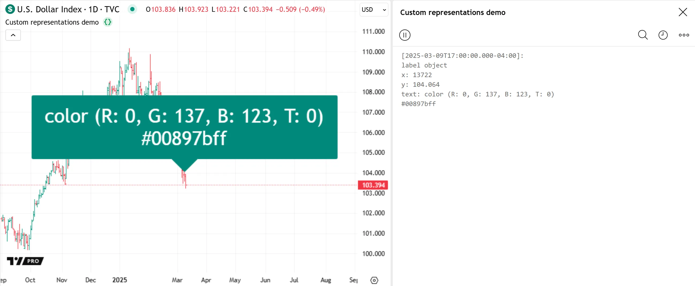

```pine
//@version=6
indicator("Custom representations demo", overlay = true)

//@variable The "color" value to color the label and convert to a string.
color colorInput = input.color(#00897b)

//@function Constructs a formatted string containing the color's R, G, B, and T components.
rgbtString(color value) =>
    str.format("color (R: {0}, G: {1}, B: {2}, T: {3})", color.r(value), color.g(value), color.b(value), color.t(value))

//@variable Constructs a string containing the color's hexadecimal RGBA representation.
hexString(color value) =>
    //@variable An array of hexadecimal characters formed by splitting a string.
    var array<string> chars = str.split("0123456789abcdef", "")
    // Get the R, G, and B channel values from the `value`.
    int r = int(color.r(value))
    int g = int(color.g(value))
    int b = int(color.b(value))
    //@variable The A (alpha) channel value (opposite of transparency), scaled to the range [0, 255].
    int a = int((100 - color.t(value)) * 255 / 100)
    //@variable A formatted string combining hex codes for the R, G, B, and A channels.
    string result = str.format(
         "#{0}{1}{2}{3}{4}{5}{6}{7}",
         chars.get(int(r / 16)), chars.get(r % 16),
         chars.get(int(g / 16)), chars.get(g % 16),
         chars.get(int(b / 16)), chars.get(b % 16),
         chars.get(int(a / 16)), chars.get(a % 16)
     )

if barstate.islastconfirmedhistory
    //@variable A formatted string containing the results of `rgbtString()` and `hexString()`.
    string labelText = str.format("{0}\n{1}", rgbtString(colorInput), hexString(colorInput))
    //@variable A label displaying the `labelText`. The script displays this object's properties in the Pine Logs pane.
    label displayLabel = label.new(
         bar_index, high, labelText, color = colorInput, textcolor = color.white, size = 36
     )
    // Log a custom representation of the `displayLabel` in the Pine Logs pane.
    log.info(
         "\nlabel object\nx: {0,number,#}\ny: {1,number,#.#####}\ntext: {2}",
         displayLabel.get_x(), displayLabel.get_y(), displayLabel.get_text()
     )
```

Note that:

- Not all special types have retrievable properties. For instance, scripts cannot retrieve information from [polylines](../2. Visuals/visuals_lines-and-boxes.md#polylines) or [tables](../2. Visuals/visuals_tables.md). To create strings for these types, track the data used in their creation with separate variables, then format the values of those variables into strings.
- For an example of creating strings from the field values of user-defined types, see the [Debugging objects of UDTs](../4. Writing_Scripts/writing_debugging.md#debugging-objects-of-udts) section of the [Debugging](../4. Writing_Scripts/writing_debugging.md) page.

## [Modifying strings](../1. Concepts/concepts_strings.md#modifying-strings)

Several `str.*()` functions provide simplified ways to modify the character sequence from a “string” value, including [str.replace()](../../reference manual/functions/str.replace.md), [str.replace\_all()](../../reference manual/functions/str.replace_all.md), [str.upper()](../../reference manual/functions/str.upper.md), [str.lower()](../../reference manual/functions/str.lower.md), [str.trim()](../../reference manual/functions/str.trim.md), and [str.repeat()](../../reference manual/functions/str.repeat.md).

Programmers can use these functions to create copies of strings with replaced character sequences, modified letter cases, trimmed whitespaces, or repeated character patterns.

### [Replacing substrings](../1. Concepts/concepts_strings.md#replacing-substrings)

The [str.replace()](../../reference manual/functions/str.replace.md) function searches a specified `source` string for the nth _non-overlapping_ occurrence of a given substring, then returns a copy of the original string containing a specified replacement at that substring’s position.

The [str.replace\_all()](../../reference manual/functions/str.replace_all.md) function searches the `source` for _every_ non-overlapping occurrence of the substring and replaces each one in its returned value.

Below are the functions’ signatures:

```
str.replace(source, target, replacement, occurrence) → string

str.replace_all(source, target, replacement) → string
```

Where:

- `source` is the “string” value containing the substrings to replace with a specified `replacement`.
- `target` is the substring replaced by the `replacement` in the returned copy. If the `source` value does not contain the substring, the function returns a copy of the value without modification.
- `replacement` is the substring inserted in place of the required `target` occurrences in the result.
- The `occurrence` parameter for [str.replace()](../../reference manual/functions/str.replace.md) specifies which non-overlapping occurrence of the `target` is swapped for the `replacement` in the result. The default value is 0, meaning the function replaces the _first_ occurrence of the `target`. If the specified occurrence does not exist in the `source` value, the function returns a copy of the value without modification.

The following script demonstrates the effects of [str.replace()](../../reference manual/functions/str.replace.md) and [str.replace\_all()](../../reference manual/functions/str.replace_all.md) calls on a string containing the sequence `Hello world!`. Additionally, it calls these functions to define the `formatString` value for a [str.format()](../../reference manual/functions/str.format.md) call, which formats all the replacement results into a single “string” value. The script displays the formatted text inside a [label](../../reference manual/types/label.md) anchored to the latest bar’s opening time:

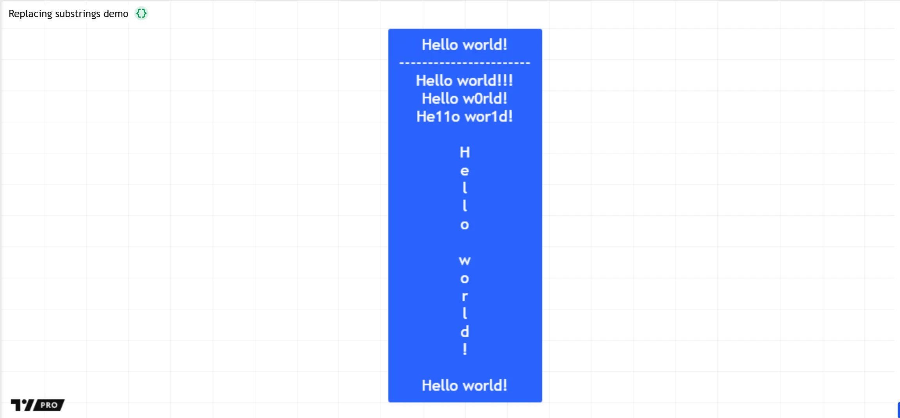

```pine
//@version=6
indicator("Replacing substrings demo")

if barstate.isfirst
    //@variable A string containing the sequence `Hello world!`.
    string originalString = "Hello world!"
    //@variable A copy of the `originalString` with `!` replaced by `!!!`.
    string changePunctuation = str.replace(originalString, "!", "!!!")
    //@variable A copy of the `originalString` with the second `o` replaced by `0`.
    string changeLetter = str.replace(originalString, "o", "0", 1)
    //@variable A copy of the `originalString` with all `l` characters replaced by 1.
    string changeLetters = str.replace_all(originalString, "l", "1")
    //@variable A copy of the `originalString` with all zero-width boundaries replaced by `\n-`.
    string insertNewlines = str.replace_all(originalString, "", "\n")
    //@variable A copy of the `originalString` without changes, as `H` does not occur two times.
    string unchanged = str.replace(originalString, "H ", "_", 1)

    //@variable A formatting string with the following initial structure: `{0}\n{1}\n{2}\n{3}\n{4}\n{5}`.
    //          The script creates the string by replacing zero-width boundaries in the sequence `012345` with
    //          `}\n{` using `str.replace_all()`, then removing the extra `}\n` and `\n{` from the start and end of the
    //          call's result with two additional `str.replace()` calls.
    string formatString = str.replace(str.replace(str.replace_all("012345", "", "}\n{"), "}\n", ""), "\n{", "", 5)

    // Create a copy of the `formatString` with the first `}` replaced by `}\n-----------------------`, then reassign
    // the variable to use that copy.
    formatString := str.replace(formatString, "}", "}\n-----------------------")

    //@variable A formatted string containing the original and modified "Hello world!" strings.
    string displayText = str.format(
         formatString, originalString, changePunctuation, changeLetter, changeLetters, insertNewlines, unchanged
     )

    // Draw a label anchored to the latest bar's opening time to show the `displayText`.
    label.new(
         math.max(last_bar_time, chart.right_visible_bar_time), 0, displayText, xloc.bar_time,
         style = label.style_label_center, size = 20
     )
```

Note that:

- Each `str.replace*()` call creates an independent, modified copy of the specified `source` value. Because each modification of the `originalString` is assigned to a separate variable, each value _does not_ contain changes from previous `str.replace*()` calls.
- The `str.replace*()` functions can replace zero-width _boundaries_ when the `target` is an empty string, as shown by the `formatString` declaration. The [str.replace\_all()](../../reference manual/functions/str.replace_all.md) call inserts `}\n{` around every character in the literal string `"012345"`.

### [Changing case](../1. Concepts/concepts_strings.md#changing-case)

The [str.upper()](../../reference manual/functions/str.upper.md) and [str.lower()](../../reference manual/functions/str.lower.md) functions create a copy of a `source` string with all ASCII letter characters converted to _uppercase_ or _lowercase_ variants, providing a convenient alternative to replacing specific characters with several `str.replace*()` calls. The [str.upper()](../../reference manual/functions/str.upper.md) function replaces all lowercase characters with uppercase characters, and [str.lower()](../../reference manual/functions/str.lower.md) does the opposite. These are the functions’ signatures:

```
str.upper(source) → string

str.lower(source) → string
```

This simple example demonstrates how these functions affect strings with _standard_ letter characters. The script declares an `originalString` variable to hold a [literal string](../1. Concepts/concepts_strings.md#literal-strings), uses [str.upper()](../../reference manual/functions/str.upper.md) on that variable to create a copied string with all letters converted to uppercase, then calls [str.lower()](../../reference manual/functions/str.lower.md) to make a copy with only lowercase characters. It logs all three strings in the [Pine Logs](../4. Writing_Scripts/writing_debugging.md#pine-logs) pane on the first bar:

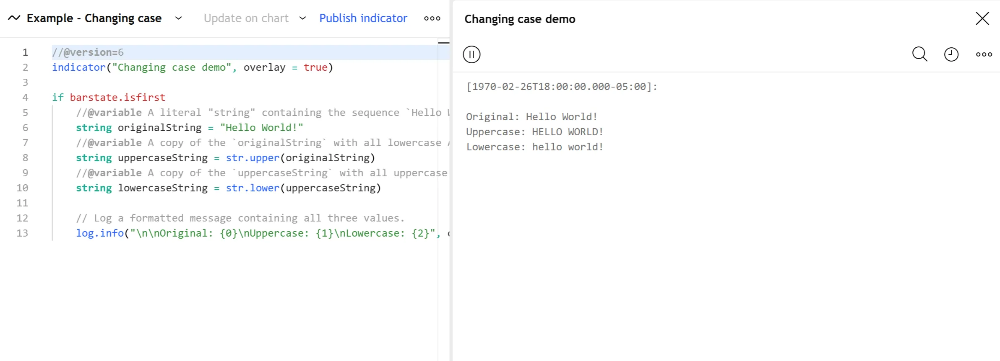

```pine
//@version=6
indicator("Changing case demo", overlay = true)

if barstate.isfirst
    //@variable A literal string containing the sequence `Hello World!`
    string originalString = "Hello World!"
    //@variable A copy of the `originalString` with all lowercase ASCII characters changed to uppercase characters.
    string uppercaseString = str.upper(originalString)
    //@variable A copy of the `uppercaseString` with all uppercase ASCII characters changed to lowercase characters.
    string lowercaseString = str.lower(uppercaseString)

    // Log a formatted message containing all three values.
    log.info("\n\nOriginal: {0}\nUppercase: {1}\nLowercase: {2}", originalString, uppercaseString, lowercaseString)
```

Note that these functions can only change the cases of _ASCII_ letter characters. They cannot convert other Unicode letters outside the ASCII range. For example, this script attempts to create uppercase and lowercase versions of a “string” value containing “Mathematical Sans-Serif” Unicode characters using [str.upper()](../../reference manual/functions/str.upper.md) and [str.lower()](../../reference manual/functions/str.lower.md). As shown below, both function calls return _identical_ copies of the value:

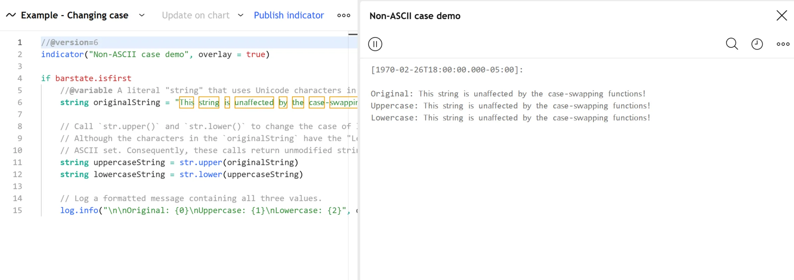

```pine
//@version=6
indicator("Non-ASCII case demo", overlay = true)

if barstate.isfirst
    //@variable A literal string that uses Unicode characters in the "Mathematical Sans-Serif" family.
    string originalString = "𝖳𝗁𝗂𝗌 𝗌𝗍𝗋𝗂𝗇𝗀 𝗂𝗌 𝗎𝗇𝖺𝖿𝖿𝖾𝖼𝗍𝖾𝖽 𝖻𝗒 𝗍𝗁𝖾 𝖼𝖺𝗌𝖾-𝗌𝗐𝖺𝗉𝗉𝗂𝗇𝗀 𝖿𝗎𝗇𝖼𝗍𝗂𝗈𝗇𝗌!"

    // Call `str.upper()` and `str.lower()` to change the case of letters.
    // Although the characters in the `originalString` have the "Letter" property, they are not part of the standard
    // ASCII set. Consequently, these calls return unmodified strings.
    string uppercaseString = str.upper(originalString)
    string lowercaseString = str.lower(uppercaseString)

    // Log a formatted message containing all three values.
    log.info("\n\nOriginal: {0}\nUppercase: {1}\nLowercase: {2}", originalString, uppercaseString, lowercaseString)
```

### [Trimming whitespaces](../1. Concepts/concepts_strings.md#trimming-whitespaces)

The [str.trim()](../../reference manual/functions/str.trim.md) function copies a `source` string and removes leading and trailing whitespace characters, including the standard space (``), newline (`\n`), and tab space (`\t`). Below is the function’s signature:

```
str.trim(source) → string
```

This simple example demonstrates the [str.trim()](../../reference manual/functions/str.trim.md) function’s behavior. The script creates a [literal string](../1. Concepts/concepts_strings.md#literal-strings) containing different types of whitespaces at the start and end of the character sequence. Then, it uses [str.trim()](../../reference manual/functions/str.trim.md) to create a new “string” value with those characters removed. The script [formats](../1. Concepts/concepts_strings.md#formatting-strings) both values into a single string, then displays the result in a [label](../../reference manual/types/label.md) on the last historical bar:

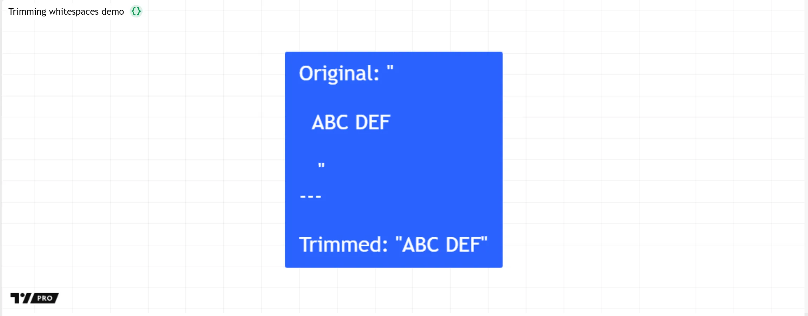

```pine
//@version=6
indicator("Trimming whitespaces demo")

if barstate.islastconfirmedhistory
    //@variable A literal string containing space, newline, and tab characters.
    string originalString = "\n\n\t\tABC DEF\t  \n\n   "
    //@variable A copy of the `originalString` that contains only `ABC DEF` without the other whitespaces.
    string trimmedString = str.trim(originalString)

    //@variable A formatted string containing the `originalString` and `trimmedString` values.
    string displayText = str.format("Original: \"{0}\"\n---\n\nTrimmed: \"{1}\"", originalString, trimmedString)

    // Draw a label to show the `displayText`.
    label.new(bar_index, 0, displayText, style = label.style_label_center, size = 30, textalign = text.align_left)
```

Note that:

- The [str.trim()](../../reference manual/functions/str.trim.md) function removes only the ASCII whitespaces to the left of the _first_ non-whitespace character and the right of the _last_ non-whitespace character. It does **not** remove whitespaces between other characters.
- The formatting string in the [str.format()](../../reference manual/functions/str.format.md) call uses `\"` to include quotation marks around the `originalString` and `trimmedString` values in the displayed text. See the [Escape sequences](../1. Concepts/concepts_strings.md#escape-sequences) section above for more information.

The [str.trim()](../../reference manual/functions/str.trim.md) function is particularly helpful when supplying calculated or input strings to built-in functions that process “string” arguments, because some function parameters require values _without_ leading or trailing whitespaces.

The following example creates an [array](../../reference manual/types/array.md) of timeframe strings by [splitting](../1. Concepts/concepts_strings.md#splitting-strings) the value of a [text area input](../1. Concepts/concepts_inputs.md#text-area-input) based on its comma characters. Within a [loop](../3. Language/language_loops.md), the script uses each element from the array in a [time()](../../reference manual/functions/time.md) call to retrieve an opening time, then [concatenates](../1. Concepts/concepts_strings.md#concatenation) a [formatted date and time](../1. Concepts/concepts_time.md#formatting-dates-and-times) with the `displayText`.

Although each item listed in the default string represents a valid timeframe, the [time()](../../reference manual/functions/time.md) call causes a runtime error. The script splits the value only by its commas, resulting in a _leading space_ in each `timeframes` element after the first, and the [time()](../../reference manual/functions/time.md) function _does not_ allow whitespaces in its `timeframe` argument.

If the user enables the input to trim the input string (which is off by default), the script uses [str.trim()](../../reference manual/functions/str.trim.md) to remove surrounding whitespaces from the [time()](../../reference manual/functions/time.md) call’s argument and prevent the formatting issue and the runtime error.

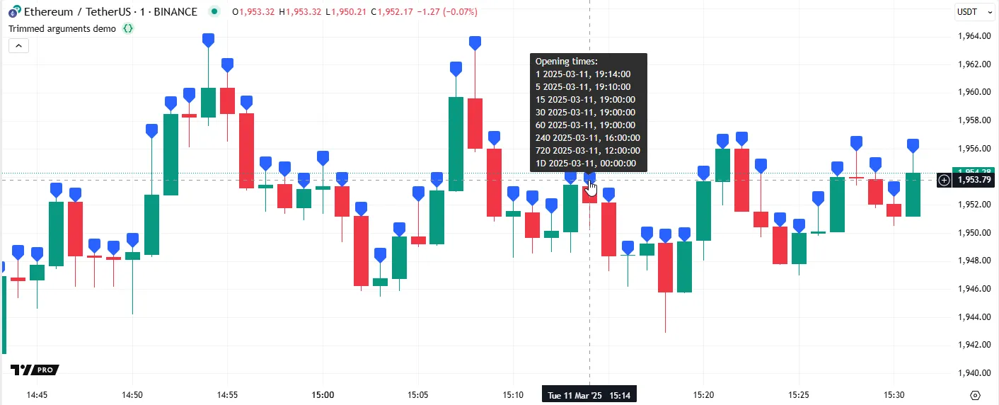

```pine
//@version=6
indicator("Invalid arguments with whitespaces demo", overlay = true)

//@variable A string containing a comma-separated list of timeframes.
string timeframesInput = input.text_area("1, 5, 15, 30, 60, 240, 720, 1D", "Timeframes")

//@variable A boolean variable that defines whether to trim the input string.
bool doTrimInput = input.bool(false, "Trim the \"Timeframes\" input string")

//@variable An array of timeframe substrings.
var array<string> timeframes = str.split(timeframesInput, ",")

//@variable A concatenated string containing formatted dates and times for each value in the `timeframes` array.
string displayText = "Opening times:"

for timeframe in timeframes
    //@variable A copy of the `timeframe` string with surrounding whitespaces removed.
    string trimmedTimeframe = str.trim(timeframe)
    //@variable The UNIX timestamp of the bar's opening time on the timeframe.
    //          This call causes a runtime error if the input string is not trimmed, because the argument contains
    //          a leading whitespace (e.g., " 5"), which is an *unsupported format* for timeframe strings.
    int timestamp = time(doTrimInput ? trimmedTimeframe : timeframe)
    // Add a new text line containing the `timestamp` formatted as a date and time in the exchange time zone.
    displayText += "\n" + timeframe + str.format_time(timestamp, " yyyy-MM-dd, HH:mm:ss")

// Draw a label at the bar's `high` with a tooltip showing the `displayText`.
label.new(bar_index, high, style = label.style_label_down, tooltip = displayText)
```

### [Repeating sequences](../1. Concepts/concepts_strings.md#repeating-sequences)

The [str.repeat()](../../reference manual/functions/str.repeat.md) function creates a “string” value that _repeats_ a `source` string’s character sequence a specified number of times, providing a convenient way to construct strings with repetitive character patterns. Below is the function’s signature:

```
str.repeat(source, repeat, separator) → string
```

Where:

- `source` is the “string” value containing the character sequence to repeat in the result.
- `repeat` is an “int” value specifying the number of times the function repeats the `source` sequence. If the value is 0, the function returns an empty string.
- `separator` is an optional “string” value containing a character sequence to _insert_ between each repeated instance of the `source` sequence. The default value is an empty string, meaning the function repeats the `source` sequence _without_ inserting additional characters.

The following script formats two numbers — the [ohlc4](../../reference manual/variables/ohlc4.md) price and its [Simple Moving Average](https://www.tradingview.com/support/solutions/43000696841/) — with a variable number of fractional digits. The minimum and maximum number of fractional digits are set by user inputs. The script uses a [str.repeat()](../../reference manual/functions/str.repeat.md) call to repeat `0` characters to create a pattern for the _required_ digits, and another call that repeats `#` characters to create a pattern for the _optional_ digits, which are displayed only if they are nonzero. The script then [concatenates](../1. Concepts/concepts_strings.md#concatenation) these patterns into one pattern and uses that in a [str.format()](../../reference manual/functions/str.format.md) call to format the two numbers.

The script calls [log.info()](../../reference manual/functions/log.info.md) to log the constructed `formatString` on the first bar, and it displays the formatted results for each bar using [labels](../2. Visuals/visuals_text-and-shapes.md#labels):

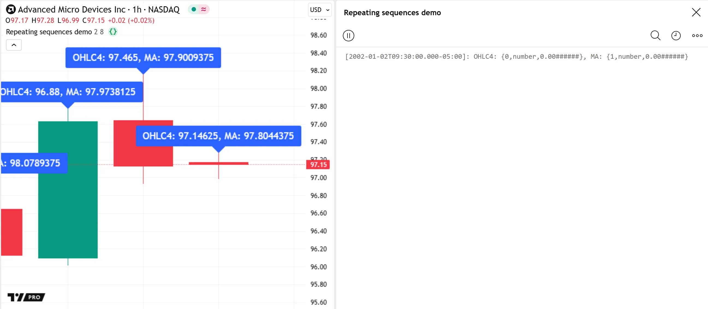

```pine
//@version=6
indicator("Repeating sequences demo", overlay = true)

//@variable The minimum number of fractional digits in the numeric strings.
int minPrecisionInput = input.int(2, "Min precision", 0, 16)
//@variable The maximum number of fractional digits in the numeric strings.
int maxPrecisionInput = input.int(8, "Max precision", 0, 16)

// Raise an error if the `maxPrecisionInput` is less than the `minPrecisionInput`.
if maxPrecisionInput < minPrecisionInput
    runtime.error("The 'Max precision' cannot be less than the 'Min precision.")

//@variable A string containing the `0` character repeated `minPrecisionInput` times.
var string requiredDigits = str.repeat("0", minPrecisionInput)
//@variable A string containing the `#` character repeated `maxPrecisionInput - minPrecisionInput` times.
var string extraDigits = str.repeat("#", maxPrecisionInput - minPrecisionInput)

//@variable A string representing a formatting pattern for numeric strings.
//          With default inputs, the value is `"0.00######"`, meaning two required digits and six nonzero extra digits.
var string formatPattern = "0." + requiredDigits + extraDigits

//@variable A formatting string that contains two placeholders for the `formatPattern` for numeric values.
var string formatString = str.format("OHLC4: '{'0,number,{0}'}', MA: '{'1,number,{0}'}'", formatPattern)

// Log the `formatString` value on the first bar.
if barstate.isfirst
    log.info(formatString)

// Draw a label to show the bar's formatted result.
label.new(bar_index, high, str.format(formatString, ohlc4, ta.sma(ohlc4, 20)), size = 18)
```

Note that:

- The apostrophe (`'`) in the [str.format()](../../reference manual/functions/str.format.md) call serves as a _quote character_, **not** a literal character. The `formatString` uses the apostrophe to quote curly brackets (`{` and `}`), treating them as literal characters instead of direct placeholder markers.

The example below demonstrates a more creative use of [str.repeat()](../../reference manual/functions/str.repeat.md). This script generates an ASCII art representation of the Pine Script logo using alternating sequences of repeated `.` (period) and `@` (at) characters. The user-defined `makeLine()` function calls [str.repeat()](../../reference manual/functions/str.repeat.md) seven times to create the repeated sequences, then formats their results into a single “string” value with a [str.format()](../../reference manual/functions/str.format.md) call. On the first bar, the script formats the results of several `makeLine()` calls into a multiline string and displays the result in a single-cell [table](../../reference manual/types/table.md) in the chart’s top-right corner:

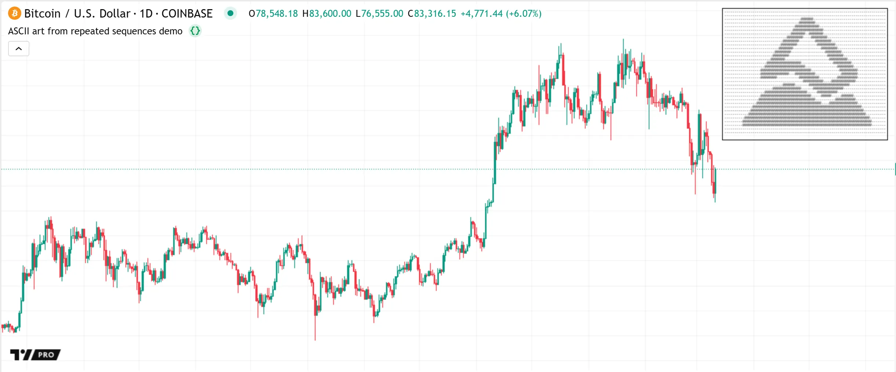

```pine
//@version=6
indicator("ASCII art from repeated sequences demo", overlay = true)

//@function Creates a string containing alternating sequences of repeated `.` and `@` characters with `\n` at the end.
//          Each `dot*` argument defines a sequence of repeated `.` characters, and each `at*` argument defines a
//          sequence of repeated `@` characters. The function formats the repeated sequences from `str.repeat()` calls
//          into a single string, in the order of the parameters.
//          For example, `makeLine(6, 5, 4, 3, 2)` returns `"......@@@@@....@@@..\n"`.
makeLine(int dot1 = 0, int at1 = 0, int dot2 = 0, int at2 = 0, int dot3 = 0, int at3 = 0, int dot4 = 0) =>
    string result = str.format(
         "{0}{1}{2}{3}{4}{5}{6}\n",
         str.repeat(".", dot1), str.repeat("@", at1), str.repeat(".", dot2), str.repeat("@", at2),
         str.repeat(".", dot3), str.repeat("@", at3), str.repeat(".", dot4)
     )
    result

if barstate.isfirst
    //@variable A string representing the Pine logo using several lines of different repeated `.` and `@` sequences.
    string asciiArt = str.format(
         "{0}{1}{2}{3}{4}{5}{6}{7}{8}{9}{10}{11}{12}{13}{14}{15}{16}{17}" +
         "{18}{19}{20}{21}{22}{23}{24}{25}{26}{27}{28}{29}{30}{31}{32}{33}",
         makeLine(80), makeLine(80), makeLine(38, 6, 36), makeLine(37, 8, 35), makeLine(35, 12, 33),
         makeLine(34, 15, 31), makeLine(33, 7, 2, 7, 31), makeLine(31, 8, 4, 8, 29), makeLine(29, 8, 8, 8, 27),
         makeLine(28, 8, 10, 9, 25), makeLine(27, 7, 14, 8, 24), makeLine(25, 8, 17, 8, 22), makeLine(24, 8, 19, 8, 21),
         makeLine(23, 7, 22, 9, 19), makeLine(21, 17, 16, 9, 17), makeLine(20, 20, 16, 8, 16),
         makeLine(18, 25, 14, 9, 14), makeLine(18, 14, 3, 10, 13, 8, 14), makeLine(18, 8, 11, 10, 9, 10, 14),
         makeLine(39, 10, 4, 12, 15), makeLine(29, 6, 7, 20, 18), makeLine(24, 14, 6, 15, 21),
         makeLine(20, 21, 5, 10, 24), makeLine(18, 25, 5, 5, 5, 6, 16), makeLine(17, 28, 10, 10, 15),
         makeLine(16, 32, 4, 14, 14), makeLine(14, 54, 12), makeLine(13, 56, 11), makeLine(12, 58, 10),
         makeLine(10, 62, 8), makeLine(9, 64, 7), makeLine(9, 64, 7), makeLine(80), makeLine(80)
     )

    //@variable A single-cell table to display the `asciiArt` value.
    table t = table.new(position.top_right, 1, 1, frame_color = chart.fg_color, frame_width = 1)
    // Initialize a left-aligned cell with monospace font for proper alignment.
    t.cell(
         0, 0, asciiArt, text_color = chart.fg_color, text_halign = text.align_left, text_size = 6,
         text_font_family = font.family_monospace
     )
```

Note that:

- The [table.cell()](../../reference manual/functions/table.cell.md) call uses [text.align\_left](../../reference manual/constants/text.align_left.md) as the `text_halign` argument and [font.family\_monospace](../../reference manual/constants/font.family_monospace.md) as the `text_font_family` argument to align the text lines to the _left_ with relatively uniform character width.
- The formatted string from each `makeLine()` call uses the `\n` [escape sequence](../1. Concepts/concepts_strings.md#escape-sequences) at the end to add a line terminator.

## [String inspection and extraction](../1. Concepts/concepts_strings.md#string-inspection-and-extraction)

Several built-in `str.*()` functions allow scripts to measure a “string” value, check for substrings and retrieve their positions, split a string into several substrings, and extract substrings based on positions or match patterns. These functions include [str.length()](../../reference manual/functions/str.length.md), [str.contains()](../../reference manual/functions/str.contains.md), [str.startswith()](../../reference manual/functions/str.startswith.md), [str.endswith()](../../reference manual/functions/str.endswith.md), [str.split()](../../reference manual/functions/str.split.md), [str.pos()](../../reference manual/functions/str.pos.md), [str.substring()](../../reference manual/functions/str.substring.md), and [str.match()](../../reference manual/functions/str.match.md).

The sections below explain these functions and some helpful techniques to use them effectively.

### [Counting characters and substrings](../1. Concepts/concepts_strings.md#counting-characters-and-substrings)

The [str.length()](../../reference manual/functions/str.length.md) function measures the length of a specified “string” value, returning an “int” value representing the number of characters in the argument’s character sequence. It has the following signature:

```
str.length(string) → int
```

This function detects _every_ character within a “string” value’s sequence, even those that are hard to see, such as leading or repeated spaces, line terminators, and invisible characters like U+200B (Zero Width Space).

For example, this simple script declares two variables with assigned [literal strings](../1. Concepts/concepts_strings.md#literal-strings) and measures their length. The script creates the first “string” value using _Em Space_ characters (U+2003), and creates the second using _En Space_ characters (U+2002) instead. It measures the length of both strings with [str.length()](../../reference manual/functions/str.length.md), creates modified strings with the `"__"` parts [replaced](../1. Concepts/concepts_strings.md#replacing-substrings) by the length values, then [concatenates](../1. Concepts/concepts_strings.md#concatenation) the results for display in a single-cell [table](../../reference manual/types/table.md).

Although the two strings look identical in the output, their lengths differ because one En Space is equivalent to _half_ the width of one Em Space, meaning the second string must include _two En Spaces_ between each word to match the width of each Em Space in the first string:

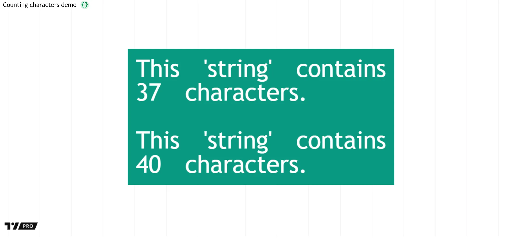

```pine
//@version=6
indicator("Counting characters demo")

if barstate.isfirst
    //@variable A single-cell table to display text.
    var table display = table.new(position.middle_center, 1, 1, color.teal)

    //@variable A literal string that uses one Em Space (U+2003) between each word.
    string testString1 = "This 'string' contains\n__ characters."

    //@variable A literal string that uses two En Spaces (U+2002) between each word.
    //          An En Space is half the width of an Em Space, so this string contains three extra characters
    //          to match the widths of each Em space in `testString1` and produce an identical output.
    string testString2 = "This  'string'  contains\n__  characters."

    // Count the number of characters in `testString1` and `testString2`.
    int length1 = str.length(testString1)
    int length2 = str.length(testString2)
    // Replace the "__" in `testString1` and `testString2` with string representations of `length1` and `length2`.
    testString1 := str.replace(testString1, "__", str.tostring(length1))
    testString2 := str.replace(testString2, "__", str.tostring(length2))

    // Concatenate both strings and two newline characters, then display the result in the table's cell.
    string displayString = testString1 + "\n\n" + testString2
    display.cell(0, 0, displayString, text_color = color.white, text_size = 50, text_halign = text.align_left)
```

Note that:

- A simple way to verify the added characters is to _split_ the `testString2` value into an [array](../../reference manual/types/array.md) of substrings with [str.split()](../../reference manual/functions/str.split.md) and inspect the array’s elements. See the [Splitting strings](../1. Concepts/concepts_strings.md#splitting-strings) section to learn more about this function.

The [str.length()](../../reference manual/functions/str.length.md) function is also useful for counting the number of _substrings_ of any size contained within a string’s sequence, which is helpful information when [replacing substrings](../1. Concepts/concepts_strings.md#replacing-substrings) or performing custom routines that depend on recurring characters.

The following example defines a `countSubstrings()` function, which uses [str.replace\_all()](../../reference manual/functions/str.replace_all.md) and [str.length()](../../reference manual/functions/str.length.md) to count the number of times a `target` substring occurs within a specified `source` value. The function creates a modified copy of the `source` with all instances of the `target` removed, then calls [str.length()](../../reference manual/functions/str.length.md) to measure the length of each separate string. It calculates the number of `target` occurrences by dividing the length difference in the original and reduced strings by the length of the substring.

The script uses [str.repeat()](../../reference manual/functions/str.repeat.md) to generate a “string” value that [repeats](../1. Concepts/concepts_strings.md#repeating-sequences) the sequence `aba` a pseudorandom number of times with `baab` inserted between each instance, then counts all occurrences of the substring `ab` in the result with a `countSubstrings()` call. It then displays a [formatted](../1. Concepts/concepts_strings.md#formatting-strings) message containing the repeated sequence and the total number of `ab` substrings in the [Pine Logs](../4. Writing_Scripts/writing_debugging.md#pine-logs) pane:

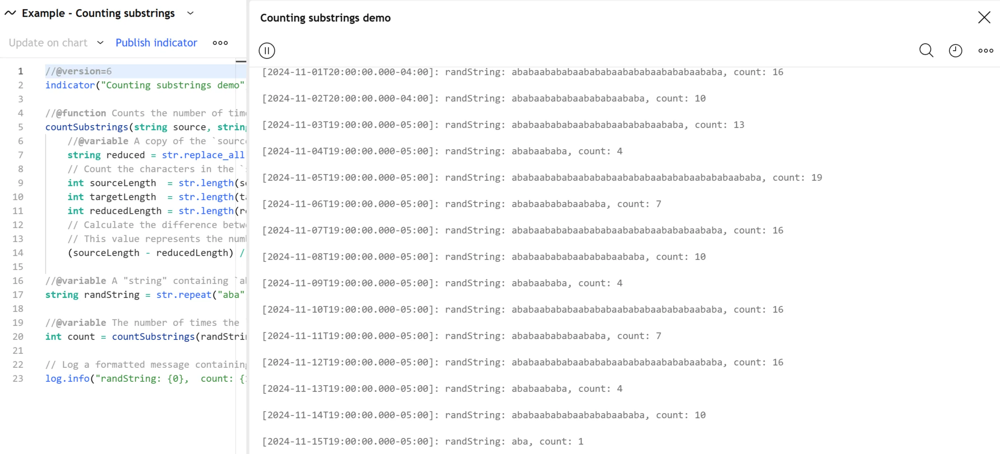

```pine
//@version=6
indicator("Counting substrings demo", overlay = true)

//@function Counts the number of times a `target` substring occurs within the specified `source`.
countSubstrings(string source, string target) =>
    //@variable A copy of the `source` string with all instances of the `target` removed.
    string reduced = str.replace_all(source, target, "")
    // Count the characters in the `source`, `target`, and `reduced` strings.
    int sourceLength  = str.length(source)
    int targetLength  = str.length(target)
    int reducedLength = str.length(reduced)
    // Calculate the difference between `sourceLength` and `reducedLength` relative to the `targetLength`.
    // This value represents the number of `target` substrings inside the original `source`.
    (sourceLength - reducedLength) / targetLength

//@variable A string containing `aba` repeated a pseudorandom number of times with `baab` inserted between each instance.
string randString = str.repeat("aba", int(math.random(1, 8)), "baab")

//@variable The number of times the `ab` sequence occurs in the `randString`.
int count = countSubstrings(randString, "ab")

// Log a formatted message containing the `randString` and `count` values in the Pine Logs pane.
log.info("randString: {0},  count: {1,number,#}", randString, count)
```

Note that:

- This script uses the _second overload_ of [log.info()](../../reference manual/functions/log.info.md), which shares the same signature as [str.format()](../../reference manual/functions/str.format.md) but logs a formatted message instead of returning a value. See the [Pine Logs](../4. Writing_Scripts/writing_debugging.md#pine-logs) section of the [Debugging](../4. Writing_Scripts/writing_debugging.md) page to learn more about the `log*()` functions.

### [Checking for substrings](../1. Concepts/concepts_strings.md#checking-for-substrings)

The [str.contains()](../../reference manual/functions/str.contains.md) function searches a `source` string for a specified substring, returning a “bool” value representing whether it found the substring. Two similar functions, [str.startswith()](../../reference manual/functions/str.startswith.md) and [str.endswith()](../../reference manual/functions/str.endswith.md), check whether the `source` _starts_ and _ends_ with a specified substring.

These functions have the following signatures:

```
str.contains(source, str) → bool

str.startswith(source, str) → bool

str.endswith(source, str) → bool
```

Where:

- `source` is the “string” value that the function searches to find the substring.
- `str` is a “string” value containing the substring to find in the `source`. The [str.contains()](../../reference manual/functions/str.contains.md) function returns `true` if the `source` contains at least one instance of the substring. The [str.startswith()](../../reference manual/functions/str.startswith.md) function returns `true` only if the `source` starts with the substring, even if the substring exists elsewhere in the character sequence. Likewise, [str.endswith()](../../reference manual/functions/str.endswith.md) returns `true` only if the `source` ends with the substring.

These functions are convenient when a script needs to check whether a substring exists but does not require the substring in additional calculations. Programmers often use these functions in conditional logic to control script behaviors based on a “string” value’s contents.

The following script creates a [spread symbol](https://www.tradingview.com/support/solutions/43000502298-spread-charts/) string from two [symbol inputs](../1. Concepts/concepts_inputs.md#symbol-input) and requests price information from that spread symbol using a [request.security()](../../reference manual/functions/request.security.md) call. Before executing the request, the script calls [str.startswith()](../../reference manual/functions/str.startswith.md) to check whether the `spreadInput` value starts with a leading space and forward slash (`/`), indicating that the first input is _empty_. If the call returns `true`, the script [replaces](../1. Concepts/concepts_strings.md#replacing-substrings) the missing symbol in the “string” value with the chart’s symbol to prevent errors.

The script then plots the retrieved data as candles in a separate pane. The colors of the candles change if the chart is in [Bar Replay](https://www.tradingview.com/support/folders/43000547807-bar-replay/) mode. The script tests for Bar Replay mode by searching for the `replay` substring in the chart’s ticker identifier ( [syminfo.tickerid](../../reference manual/variables/syminfo.tickerid.md)) using a [str.contains()](../../reference manual/functions/str.contains.md) call:

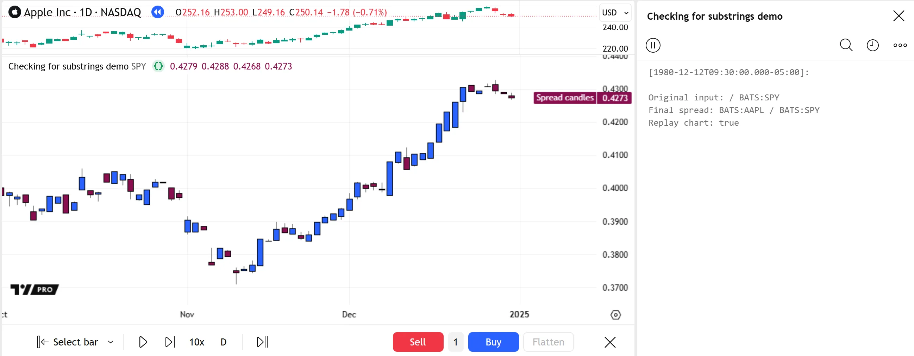

```pine
//@version=6
indicator("Checking for substrings demo")

//@variable A spread symbol created from two symbol inputs. The first input is an empty string by default.
var string spreadInput = input.symbol("", "Symbol 1") + " / " + input.symbol("BATS:SPY", "Symbol 2")

//@variable Is `true` if the `spreadInput` starts with ` /`, meaning the first input is empty.
var bool missingNumerator = str.startswith(spreadInput, " /")
//@variable A copy of the spreadInput` that inserts the chart's standard ticker ID when `missingNumerator` is `true`.
var string spread = missingNumerator ? str.replace(spreadInput, " /", ticker.standard() + " /") : spreadInput

// Request a tuple of OHLC data from the `spread` context.
[o, h, l, c] = request.security(" " + spread, "", [open, high, low, close])

//@variable Is `true` if the chart's ticker ID contains `replay`, meaning Bar Replay mode is active.
var bool isReplay = str.contains(syminfo.tickerid, "replay")

// Define variables to hold colors for up and down candles. Their values depend on whether `isReplay` is `true`.
var color upColor = isReplay ? color.blue : color.teal
var color dnColor = isReplay ? color.maroon : color.red

// Plot the candles in a separate pane.
plotcandle(o, h, l, c, "Spread candles", c > o ? upColor : dnColor)

// Log the original `spreadInput`, the final `spread` value, and the `isReplay` value` in the Pine Logs pane.
if barstate.isfirst
    log.info("\n\nOriginal input: {0}\nFinal spread: {1}\nReplay chart: {2}", spreadInput, spread, isReplay)
```

Note that:

- We used `" /"` as the substring value in the [str.startswith()](../../reference manual/functions/str.startswith.md) call because an empty string does _not_ detect the empty input value. When the substring specified in a [str.contains()](../../reference manual/functions/str.contains.md), [str.startswith()](../../reference manual/functions/str.startswith.md), or [str.endswith()](../../reference manual/functions/str.endswith.md) call is empty, the function always returns `true` because the argument can match _any position_ in a string’s sequence.

### [Splitting strings](../1. Concepts/concepts_strings.md#splitting-strings)

The [str.split()](../../reference manual/functions/str.split.md) function splits a single “string” value into one or more substrings based on a `separator` substring in the value’s character sequence, then collects the results in an [array](../../reference manual/types/array.md). Below is the function’s signature:

```
str.split(string, separator) → array<string>
```

Where:

- The specified `string` is the value to divide into substrings.
- The `separator` is a “string” value containing the characters that divide each substring. The resulting [array](../../reference manual/types/array.md) does _not_ include the separator in its elements. If the value is empty, the function splits the string into single-character substrings.

The [str.split()](../../reference manual/functions/str.split.md) function returns an [array](../3. Language/language_arrays.md) of strings, unlike the other `str.*()` functions. Scripts can use `array.*()` functions on these arrays, or iterate through them directly with [for…in](../3. Language/language_loops.md#forin-loops) loops. Programmers often use [str.split()](../../reference manual/functions/str.split.md) to process “string” inputs and parameters that represent _lists_ of arguments for [dynamic requests](../1. Concepts/concepts_other-timeframes-and-data.md#dynamic-requests) and other calculations.

The following script requests data from several contexts based on a [text area input](../1. Concepts/concepts_inputs.md#text-area-input) containing a comma-separated list of symbols. First, the script splits the input value based on its commas with [str.split()](../../reference manual/functions/str.split.md) to construct an array of symbol strings. Then, it uses a [for…in](../../reference manual/keywords/for...in.md) loop to iterate over the array’s contents, request data for each symbol, and populate a [table](../../reference manual/types/table.md) with the results. Additionally, the table’s first row contains a “string” representation of the array of symbols:


```pine
//@version=6
indicator("Splitting strings demo")

//@variable A string containing a list of symbols separated by commas and optional spaces.
string symbolListInput = input.text_area("AAPL, NVDA, MSFT, AMZN, SPY")

//@variable An array of symbols created by splitting the `symbolListInput` by its commas.
var array<string> symbolsArray = str.split(symbolListInput, ",")

if barstate.islast
    //@variable A two-column table with a row for each `symbolsArray` item.
    var table display = table.new(position.middle_center, 2, symbolsArray.size() + 1)

    // Initialize a merged cell to show the `symbolsArray`.
    display.cell(
         0, 0, "Symbols:\n" + str.tostring(symbolsArray), bgcolor = color.blue, text_color = color.white,
         text_size = 30
     )
    display.merge_cells(0, 0, 1, 0)

    // Loop through the `symbolsArray`.
    for [i, symbol] in symbolsArray
        //@variable The `close` value requested for the `symbol` on the chart's timeframe.
        float requestedValue = request.security(symbol, timeframe.period, close)
        // Initialize a cell for the `symbol` and a "string" representing the `requestedValue`.
        display.cell(0, i + 1, symbol, text_color = chart.fg_color, text_size = 20)
        display.cell(1, i + 1, str.tostring(requestedValue), text_color = chart.fg_color, text_size = 20)
```

Note that:

- The symbol strings in the array contain _extra whitespaces_, which are not visible in the table. However, in contrast to some other function parameters, the `symbol` parameter of [request.security()](../../reference manual/functions/request.security.md) ignores leading and trailing whitespaces in its argument.
- The script uses [str.tostring()](../../reference manual/functions/str.tostring.md) and [concatenation](../1. Concepts/concepts_strings.md#concatenation) to create the strings used for the table’s text.
- This script can fetch data from other contexts within a loop using “series string” `symbol` values because scripts allow dynamic requests by default. See the [Dynamic requests](../1. Concepts/concepts_other-timeframes-and-data.md#dynamic-requests) section of the [Other timeframes and data](../1. Concepts/concepts_other-timeframes-and-data.md) page for more information.

### [Locating and retrieving substrings](../1. Concepts/concepts_strings.md#locating-and-retrieving-substrings)

The [str.pos()](../../reference manual/functions/str.pos.md) function searches a `source` string for the _first_ occurrence of a specified substring and returns an “int” value representing the _position_ of its initial character boundary. The function’s signature is as follows:

```
str.pos(source, str) → int
```

Where:

- `source` is the “string” value to search for the first occurrence of the `str` substring.
- `str` is a “string” value representing the substring to locate in the `source`. If the argument is [na](../../reference manual/variables/na.md) or an empty “string” value, the function returns 0 (the first possible position).

The [str.substring()](../../reference manual/functions/str.substring.md) function retrieves a substring from a `source` value at specified character positions. This function has the following signatures:

```
str.substring(source, begin_pos) → string

str.substring(source, begin_pos, end_pos) → string
```

Where:

- `source` is the “string” value containing the substring.
- `begin_pos` is an “int” value representing the position of the substring’s first character in the `source`, where the numbering starts from zero. If the value is [na](../../reference manual/variables/na.md), the function sets the initial position to 0. The script raises an error if the specified position is invalid.
- The `end_pos` is an “int” value representing the position _after_ the substring’s last character in the `source`. This position is _exclusive_, meaning the returned value does **not** contain this position’s character. If the value is not specified or represents a position outside the string’s length, the substring includes _all_ characters from the `begin_pos` onward. If the value is less than the `begin_pos`, it causes a runtime error.

For example, the `begin_pos` value of the substring `"Trading"` in the string `"TradingView"` is 0, because the substring starts at the source string’s _first_ character position. The `end_pos` value is 7, because the substring’s last character (`g`) is at position 6, and `end_pos` represents the position _after_ that character. To retrieve only the first character of a string as a substring, use a call such as `str.substring("TradingView", 0, 1)`.

Programmers often use these functions together by retrieving positional values with [str.pos()](../../reference manual/functions/str.pos.md) and then using those values to extract substrings with [str.substring()](../../reference manual/functions/str.substring.md) for additional calculations. This technique is an efficient alternative to [matching patterns](../1. Concepts/concepts_strings.md#matching-patterns) for substrings at specific positions that have unique characters.

The following simple script uses these functions to extract the “area” and “location” parts of the [syminfo.timezone](../../reference manual/variables/syminfo.timezone.md) variable’s _IANA identifier_. The script calls [str.pos()](../../reference manual/functions/str.pos.md) to get the position of the `/` character in the [time zone string](../1. Concepts/concepts_time.md#time-zone-strings), which it assigns to the `dividerPos` variable. Then, it uses that variable in two [str.substring()](../../reference manual/functions/str.substring.md) calls. The first call retrieves the substring from position 0 to `dividerPos`, and the second retrieves the substring from the position at `dividerPos + 1` to the end of the string.

The script displays the IANA identifier, the retrieved substrings, and the [formatted date and time](../1. Concepts/concepts_time.md#formatting-dates-and-times) of the latest execution in a single-cell [table](../../reference manual/types/table.md) on the last bar:

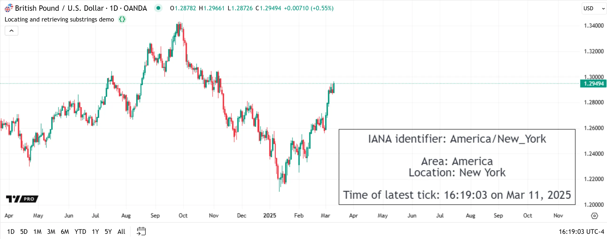

```pine
//@version=6
indicator("Locating and retrieving substrings demo", overlay = true)

if barstate.islast
    //@variable A single-cell table to show the `displayText`.
    var table display = table.new(position.bottom_right, 1, 1, frame_color = chart.fg_color, frame_width = 1)

    //@variable The position of the `/` character in the exchange time zone's IANA identifier.
    var int dividerPos = str.pos(syminfo.timezone, "/")
    //@variable The `syminfo.timezone` substring from position 0 to `dividerPos`.
    //          This substring epresents the "area" part of the time zone identifier.
    //          The character at `dividerPos` is not included.
    var string areaString = str.substring(syminfo.timezone, 0, dividerPos)

    //@variable The `syminfo.timezone` substring from `dividerPos + 1` to the end of the string, without low lines.
    //          This substring represents the "location" part of the time zone identifier.
    var string locationString = str.replace_all(str.substring(syminfo.timezone, dividerPos + 1), "_", " ")

    //@variable A string representing the latest execution's date and time in the chart's time zone.
    string formattedTime = str.format_time(timenow, "HH:mm:ss 'on' MMM d, yyyy")

    //@variable A formatted string containing `syminfo.timezone`, `areaString`, `locationString`, and `formattedTime`.
    string displayText = str.format(
         "IANA identifier: {0}\n\nArea: {1}\nLocation: {2}\n\nTime of latest tick: {3}",
         syminfo.timezone, areaString, locationString, formattedTime
     )
    // Initialize the table cell with the `displayText`.
    display.cell(0, 0, displayText, text_size = 24, text_color = chart.fg_color)
```

Note that:

- The first [str.substring()](../../reference manual/functions/str.substring.md) call does _not_ include the character at the position specified by `dividerPos`. Its result contains only the characters from position 0 to `dividerPos - 1`.

It’s important to emphasize that the [str.pos()](../../reference manual/functions/str.pos.md) function only finds the _first_ occurrence of a specified substring. However, in some cases, programmers might require the positions of the substring’s _other_ occurrences. One way to achieve this result is by repeatedly _reducing_ a “string” value with [str.substring()](../../reference manual/functions/str.substring.md) and locating the substring in the new value with [str.pos()](../../reference manual/functions/str.pos.md).

The advanced example script below contains a `getPositions()` function that returns an [array](../../reference manual/types/array.md) containing every `substring` position within a specified `source`. The function first uses [str.pos()](../../reference manual/functions/str.pos.md) to get the position of the first `substring` and creates an array containing that value with [array.from()](../../reference manual/functions/array.from.md). If the initial position is not [na](../../reference manual/variables/na.md), the function removes all characters up to the substring’s end position with [str.substring()](../../reference manual/functions/str.substring.md). Then, it executes a [for…in](../../reference manual/keywords/for...in.md) loop that repeatedly locates the substring, pushes the calculated position into the array, and reduces the character sequence. The loop stops only after the array contains the position of every substring in the `source` value.

On the first bar, the script uses the function to analyze substring occurrences in four arbitrarily selected strings, then logs [formatted](../1. Concepts/concepts_strings.md#formatting-strings) messages containing the results in the [Pine Logs](../4. Writing_Scripts/writing_debugging.md#pine-logs) pane:

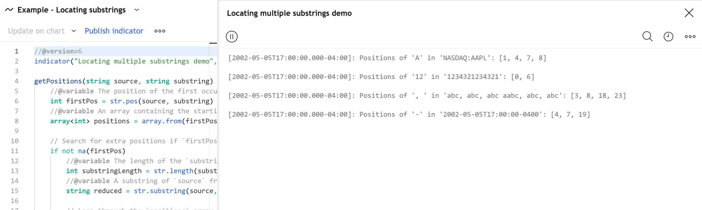

```pine
//@version=6
indicator("Locating multiple substrings demo", overlay = true)

getPositions(string source, string substring) =>
    //@variable The position of the first occurrence of the `substring`.
    int firstPos = str.pos(source, substring)
    //@variable An array containing the starting position of each `substring` occurrence in the `source`.
    array<int> positions = array.from(firstPos)

    // Search for extra positions if `firstPos` is not `na`.
    if not na(firstPos)
        //@variable The length of the `substring`.
        int substringLength = str.length(substring)
        //@variable A substring of `source` from `firstPos + substringLength` onward.
        string reduced = str.substring(source, firstPos + substringLength)

        // Loop through the `positions` array.
        for pos in positions
            //@variable The end boundary position of the first `substring` occurrence in the `reduced` string.
            int newPos = str.pos(reduced, substring) + substringLength
            // Add a new element to the `positions` array and reduce the `reduced` string if `newPos` is not `na`.
            if not na(newPos)
                // Push `pos + newPos` into the `positions` array, allowing another iteration.
                // The `newPos` is added to the latest `pos` to get the actual position in the original `source`.
                positions.push(pos + newPos)
                // Assign the substring from `newPos` onward to the `reduced` variable.
                reduced := str.substring(reduced, newPos)
    positions

if barstate.isfirst
    // Define four arbitrary strings.
    string testStr1 = "NASDAQ:AAPL"
    string testStr2 = "1234321234321"
    string testStr3 = str.repeat(str.repeat("abc", 3, ", "), 2, " a")
    string testStr4 = str.format_time(time)

    // Get arrays containing the positions of various substrings in the four test strings.
    array<int> positions1 = getPositions(testStr1, "A")
    array<int> positions2 = getPositions(testStr2, "12")
    array<int> positions3 = getPositions(testStr3, ", ")
    array<int> positions4 = getPositions(testStr4, "-")

    //@variable The formatting string for all `log.info()` calls. The `{0}` placeholder is for apostrophes.
    string formatString = "Positions of {0}{1}{0} in {0}{2}{0}: {3}"

    // Log formatted results in the Pine Logs pane.
    log.info(formatString, "'", "A", testStr1, str.tostring(positions1))
    log.info(formatString, "'", "12", testStr2, str.tostring(positions2))
    log.info(formatString, "'", ", ", testStr3, str.tostring(positions3))
    log.info(formatString, "'", "-", testStr4, str.tostring(positions4))
```

Note that:

- Although the `positions` array starts with _one_ element, the [for…in](../../reference manual/keywords/for...in.md) loop performs _more than one_ iteration because Pine loops can have dynamic boundaries. After each execution of the [array.push()](../../reference manual/functions/array.push.md) call, the `positions` array’s size increases, allowing a _new iteration_. Refer to the [Loops](../3. Language/language_loops.md) page for more information.
- Each reduced version of the string starts at the position _after_ the last character of the detected substring. The script identifies the end position by adding the substring’s [str.length()](../../reference manual/functions/str.length.md) value to its starting position.

### [Matching patterns](../1. Concepts/concepts_strings.md#matching-patterns)

Pine scripts can dynamically match and retrieve substrings using the [str.match()](../../reference manual/functions/str.match.md) function. In contrast to the other `str.*()` functions, which only match sequences of literal characters, the [str.match()](../../reference manual/functions/str.match.md) function uses [regular expressions (regex)](https://en.wikipedia.org/wiki/Regular_expression) to match variable _character patterns_. The function’s signature is as follows:

```
str.match(source, regex) → string
```

Where:

- `source` is the “string” value containing the sequence to match using the regular expression.
- `regex` is a “string” value representing the regular expression that specifies the _pattern_ to match in the `source`. The function returns the _first substring_ that follows the match pattern. If the regex does not match any substring in the `source`, the function returns an empty string.

Because the [str.match()](../../reference manual/functions/str.match.md) function matches _patterns_ in a string’s character sequence rather than strictly literal characters, a single call to this function can perform a wide range of text-matching tasks that would otherwise require multiple calls to other `str.*()` functions or custom operations.

For example, this script requests data from a [FINRA Short Sale Volume](https://www.finra.org/finra-data/browse-catalog/short-sale-volume-data) series for a specified symbol. It uses separate [str.startswith()](../../reference manual/functions/str.startswith.md) calls to check whether the symbol string has one of the supported exchange prefixes. It locates and removes the exchange prefix with [str.pos()](../../reference manual/functions/str.pos.md) and [str.substring()](../../reference manual/functions/str.substring.md), constructs a FINRA ticker ID with [str.format()](../../reference manual/functions/str.format.md) and [logs](../4. Writing_Scripts/writing_debugging.md#pine-logs) its value, then executes the [request.security()](../../reference manual/functions/request.security.md) call only if one of the [str.startswith()](../../reference manual/functions/str.startswith.md) calls returns `true`. The script plots the retrieved data on the chart as columns:

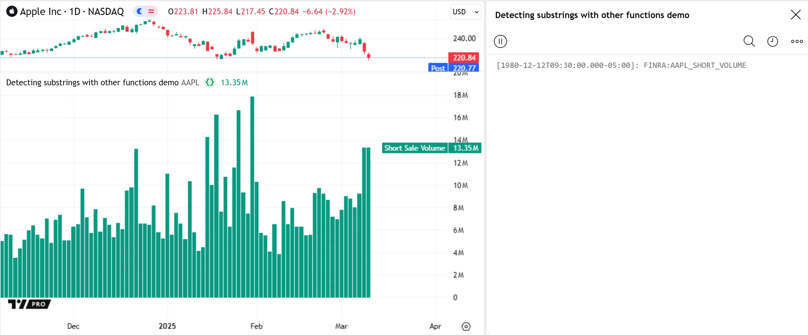

```pine
//@version=6
indicator("Detecting substrings with other functions demo")

//@variable The symbol for which to request Short Sale Volume data.
string symbolInput = input.symbol("NASDAQ:AAPL", "Symbol")

//@variable `true` if the `symbolInput` starts with `BATS:`, `NASDAQ:`, `NYSE:`, or `AMEX:`. Otherwise, `false`.
var bool supportedSymbol = str.startswith(symbolInput, "BATS:") or
                           str.startswith(symbolInput, "NASDAQ:") or
                           str.startswith(symbolInput, "NYSE:") or
                           str.startswith(symbolInput, "AMEX:")

//@variable The requested FINRA data if `supportedSymbol` is `true`, `na` otherwise.
float requestedData = if supportedSymbol
    //@variable The `symbolInput` value without the exchange prefix.
    var string noPrefix = str.substring(symbolInput, str.pos(symbolInput, ":") + 1)
    //@variable A formatted string representing the ticker ID of a FINRA Short Sale Volume dataset.
    var string finraTickerID = str.format("FINRA:{0}_SHORT_VOLUME", noPrefix)
    // Log the `finraTickerID` in the Pine Logs pane on the first bar.
    if barstate.isfirst
        log.info(finraTickerID)
    // Retrieve the data.
    request.security(finraTickerID, timeframe.isintraday ? "1D" : "", close)

// Plot the `requestedData`
plot(requestedData, "Short Sale Volume", color.teal, 1, plot.style_columns)
```

In the script version below, we replaced the multiple [str.startswith()](../../reference manual/functions/str.startswith.md) calls with an expression containing a [str.match()](../../reference manual/functions/str.match.md) call. The call matches one of the supported exchange prefixes at the start of the string using the following regular expression:

```
^(?:BATS|NASDAQ|NYSE|AMEX):
```

We also replaced the [str.pos()](../../reference manual/functions/str.pos.md) and [str.substring()](../../reference manual/functions/str.substring.md) calls with a [str.match()](../../reference manual/functions/str.match.md) call. The call calculates the `noPrefix` value with a regex that matches all characters after the input value’s colon (`:`):

```
(?<=:).+
```

These changes achieve the same results as the previous script, but with more concise function calls:

```pine
//@version=6
indicator("Matching substrings with regex demo")

//@variable The symbol for which to request Short Sale Volume data.
string symbolInput = input.symbol("NASDAQ:AAPL", "Symbol")

//@variable `true` if the `symbolInput` starts with `BATS:`, `NASDAQ:`, `NYSE:`, or `AMEX:`. Otherwise, `false`.
//          - `^` at the beginning of the regex matches the start of the string.
//          - `(?:...)` defines a non-capturing group.
//          - `|` is an OR operator that allows the group to match one of the listed options.
var bool supportedSymbol = str.match(symbolInput, "^(?:BATS|NASDAQ|NYSE|AMEX):") != ""

//@variable The requested FINRA data if `supportedSymbol` is `true`, `na` otherwise.
float requestedData = if supportedSymbol
    //@variable The `symbolInput` value without the exchange prefix.
    //          - `(?<=:)` in the regex is a lookbehind assertion that checks if `:` precedes the match.
    //          - `.` matches any character except for line terminators in this context.
    //          - `+` is a quantifier that specifies one or more consecutive `.` matches.
    var string noPrefix = str.match(symbolInput, "(?<=:).+")
    //@variable A formatted string representing the ticker ID of a FINRA Short Sale Volume dataset.
    var string finraTickerID = str.format("FINRA:{0}_SHORT_VOLUME", noPrefix)
    // Log the `finraTickerID` in the Pine Logs pane on the first bar.
    if barstate.isfirst
        log.info(finraTickerID)
    // Retrieve the data.
    request.security(finraTickerID, timeframe.isintraday ? "1D" : "", close)

// Plot the `requestedData`
plot(requestedData, "Short Sale Volume", color.teal, 1, plot.style_columns)
```

Note that:

- The caret (`^`) at the beginning of the regex string matches the _beginning_ of the `symbolInput`.
- The `(?:...)` syntax in the regex string creates a _non-capturing group_.
- The pipe character (`|`) in the regex acts as an _OR operator_. The group matches only _one_ of the character sequences separated by the character (`BATS`, `NASDAQ`, `NYSE`, or `AMEX`).
- The `(?<=...)` syntax defines a _lookbehind assertion_, which checks if the specified pattern precedes the match.
- The `.` (period) character has a special meaning in regex strings. It matches _any_ character, excluding line terminators by default.
- The `+` (plus sign) character is a _quantifier_. It specifies that the previous token (`.`) must match _one or more_ times.

The flexibility of regular expressions also allows [str.match()](../../reference manual/functions/str.match.md) to perform advanced matching tasks that are impractical or infeasible with other `str.*()` functions.

For instance, suppose we want to create a script that executes [dynamic requests](../1. Concepts/concepts_other-timeframes-and-data.md#dynamic-requests) for a list of symbols specified in a [text area input](../1. Concepts/concepts_inputs.md#text-area-input), and we require a specific input format consisting of only valid ticker patterns, comma separators with optional space characters, and no empty items. This validation is difficult to achieve with the other `str.*()` functions because they rely on _literal_ character sequences. However, with [str.match()](../../reference manual/functions/str.match.md), we can define a single regular expression that matches the input only if it meets our required formatting criteria.

The script below demonstrates a single [str.match()](../../reference manual/functions/str.match.md) function call that validates the format of an input list of symbols. The user-defined `processList()` function combines strings to form the following regex for matching the `list` value:

```
^ *(?:(?:\w+:)?\w+(?:\.\w+){0,2}!? *, *)*(?:\w+:)?\w+(?:\.\w+){0,2}!? *$
```

If the [str.match()](../../reference manual/functions/str.match.md) call returns a _non-empty_ string, meaning the constructed pattern matches the `list` argument, the `processList()` function uses [str.replace\_all()](../../reference manual/functions/str.replace_all.md) to remove all space characters, then calls [str.split()](../../reference manual/functions/str.split.md) to split the string based on its commas to create an [array](../../reference manual/types/array.md) of symbol substrings. Otherwise, it raises a runtime error with the [runtime.error()](../../reference manual/functions/runtime.error.md) function.

The script loops through the returned array of substrings to request data for each specified symbol and populate a [table](../../reference manual/types/table.md) with the results:

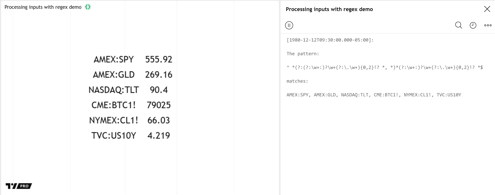

```pine
//@version=6
indicator("Processing inputs with regex demo")

//@variable A string containing a list of symbols separated by commas and optional spaces.
string listInput = input.text_area("AMEX:SPY, AMEX:GLD, NASDAQ:TLT, CME:BTC1!, NYMEX:CL1!, TVC:US10Y", "Symbol list")

//@function Checks a string value for a pattern of symbols separated by commas and optional space characters.
//          If the specified `list` does not match this format, the function raises a runtime error.
//          Otherwise, it returns an array of substrings representing each listed symbol.
processList(string list) =>
    //@variable A pattern for an optional group of one or more word characters (`\w` class) followed by a colon (`:`).
    //          This pattern matches a symbol's exchange prefix, if listed
    //          (e.g., "NASDAQ:" for "NASDAQ:AAPL" or "" for "AAPL").
    //           - `(?:...)` defines a non-capturing group.
    //           - ` w` is an ASCII digit, letter, or low line.
    //           - The `+` means the regex checks for one or more consecutive matches of the previous token (`\w`).
    //           - The `?` at the end makes the group optional.
    var string exchange = "(?: w+:)?"

    //@variable A pattern for 1+ word characters, with 0-2 extra word sequences divided by `.`, then an optional `!`.
    //          This pattern matches symbols without the exchange prefix
    //          (e.g., "AAPL" for "NASDAQ:AAPL", "BTC.D" for "CRYPTOCAP:BTC.D", "ES1!" for "CME_MINI:ES1!").
    //           - ` w+` means one or more word characters.
    //           - ` .` makes the `.` character literal. When not escaped, it matches any character.
    //           - `{0,2}` means the regex matches the group's pattern (`\.\w+`) zero to two times.
    //           - The `?` makes the `!` character optional.
    var string symbol = " w+(?: . w+){0,2}!?"

    //@variable A pattern that matches a symbol or comma-separated list of symbols with optional spaces.
    //          (e.g., "AAPL, OANDA:EURUSD, BATS:SPY, BINANCE:BTCUSDT.P")
    //           - `^` at the beginning matches the start of the text line.
    //           - `*` after the spaces and group construction `(?:...)` mean the regex matches them zero or more times.
    //           - `$` at the end matches the end of the text line.
    //          The formatted result combines `exchange` and `symbol` to form this regex pattern:
    //          `^ *(?:(?:\w+:)?\w+(?:\.\w+){0,2}!? *, *)*(?:\w+:)?\w+(?:\.\w+){0,2}!? *$`
    var string matchPattern = str.format("^ *(?:{0}{1} *, *)*{0}{1} *$", exchange, symbol)

    //@variable A copy of the `list` if the `matchPattern` produces a match. Otherwise, an empty string.
    string match = str.match(list, matchPattern)

    // If the `match` is empty, meaning the `list` does not have the required format, raise a runtime error.
    if match == ""
        runtime.error("Invalid list. The value must represent a comma-separated list of symbols with optional spaces.")

    // Log an `info` message showing the pattern and the match.
    log.info("\n\nThe pattern:\n\n{0}\n\nmatches:\n\n{1}", matchPattern, match)

    //@variable A copy of the `match` without space characters.
    string noSpaces = str.replace_all(match, " ", "")
    //@variable An array of substrings formed by splitting the `noSpaces` value by its commas.
    array<string> result = str.split(noSpaces, ",")

//@variable An array of symbols from the processed `listInput`.
var array<string> symbols = processList(listInput)

if barstate.islast
    //@variable A two-column table with a row for each `symbols` item.
    var table display = table.new(position.middle_center, 2, symbols.size())
    // Loop through the `symbols` array.
    for [i, symbol] in symbols
        //@variable The `close` value requested for the `symbol` on the chart's timeframe.
        float requestedValue = request.security(symbol, timeframe.period, close)
        // Initialize a cell for the `symbol` and a string representing the `requestedValue`.
        display.cell(0, i, symbol, text_color = chart.fg_color, text_size = 24)
        display.cell(1, i, str.tostring(requestedValue), text_color = chart.fg_color, text_size = 24)
```

Note that:

- When creating regex strings, it is often helpful to display them in a script’s text outputs to ensure they are formatted as intended. In this script, we included a [log.info()](../../reference manual/functions/log.info.md) call to show the resulting regular expression and its match in the [Pine Logs](../4. Writing_Scripts/writing_debugging.md#pine-logs) pane.
- Because the backslash (`\`) is an [escape character](../1. Concepts/concepts_strings.md#escape-sequences) in Pine strings, the value used as the `regex` argument in a [str.match()](../../reference manual/functions/str.match.md) call requires **two** consecutive backslashes for each single backslash in the regular expression.
- The ` w` parts of the regex string specify the `\w` pattern, a _predefined character class_ that matches _word characters_ (letters, digits, or low lines).
- The `*` (asterisk) and `{0,2}` parts of the regular expression are _quantifiers_, similar to `+`. The asterisk requires the previous token to match _zero or more_ times. The `{0,2}` quantifier requires the match to occur exactly _zero to two_ times.
- The `$` (dollar sign) character in this regular expression matches the _end_ of the input, excluding any final line terminators (`\n`).
- Because the `.` (period) character has a special meaning in regex strings, we must prefix it with two backslashes (` `) in the string to match a literal period.

#### [Regex syntax reference](../1. Concepts/concepts_strings.md#regex-syntax-reference)

Every programming language’s regex engine has unique characteristics and syntax. Some regex syntax is universal across engines, while other patterns and modifiers are engine-specific.

The tables below provide a categorized overview of the syntax patterns supported by Pine’s regex engine along with descriptions, remarks, and examples to explain how they work.

**Escapes and character references**

Click to show/hide

| Token/syntax | Description and remarks |
| --- | --- |
| `\` | Changes the meaning of the next character.<br>Because Pine strings natively use `\` as an escape character, regex strings containing it must include an _additional_`\` to use the token in the pattern. For example, `" "` represents a single `\` (escape token) in the regex, and `"  "` represents ` ` (literal backslash).<br>Some other characters always or conditionally represent regex syntax, including `.`, `^`, `$`, `*`, `+`, `?`, `(`, `)`, `[`, `]`, `{`, `}`, `|`, and `-`.<br>To match a special character literally, include `" "` immediately before it in the string (e.g., `" +"` matches the literal `+` character).<br>Note that some sequences of otherwise literal characters can also have syntactical meaning. See below for examples. |
| `\Q...\E` | Matches everything between `\Q` and `\E` _literally_, ignoring the syntactical meaning of special characters and sequences.<br>For example, the regex string `" Q[^abc] E"` matches the literal sequence of `[`, `^`, `a`, `b`, `c`, and `]` characters instead of creating a _character class_. |
| `a` | Matches the literal character `a` (U+0061).<br>By default, the regex engine is _case-sensitive_. If the string includes the `(?i)` modifier _before_ the token, the match becomes _case-insensitive_. For example, the regex string `"(?i)a"` matches the `a` or `A` character. |
| `\t` | Matches the _tab space_ character (U+0009). |
| `\n` | Matches the _newline_ character (U+000A). |
| `\x61` | A _two-digit_ Unicode reference that matches the hexadecimal point U+0061 (the `a` character).<br>This shorthand syntax works only for codes with leading zeros and up to **two** nonzero end digits. It cannot reference other Unicode points. For example, the regex string `" x2014"` matches U+0020 (the _space_ character) followed by U+0031 (the `1` character) and U+0034 (the `4` character). It **does not** match U+2014 (the `—` character). |
| `\u2014` | A _four-digit_ Unicode reference that matches the hexadecimal point U+2014 (`—`, Em Dash).<br>This syntax works only for codes with leading zeros and up to **four** nonzero end digits. It cannot reference larger Unicode points. For example, the regex string `" u1F5E0"` matches U+1F5E (unassigned) followed by U+0030 (the `0` character), resulting in no match. It **does not** match U+1F5E0 (the Stock Chart character). |
| `\x{...}` | The _full-range_ Unicode reference syntax. The hexadecimal digits enclosed in the brackets can refer to _any_ Unicode point.<br>Leading zeros in the digits _do not_ affect the matched Unicode point. For example, the regex strings `" x{61}"`, `" x{061}"`, `" x{0061}"`, and `" x{000061}"` all match U+0061 (the `a` character). |

**Character class and logical constructions**

Click to show/hide

| Token/syntax | Description and remarks |
| --- | --- |
| `[abc]` | A character class that matches only _one_ of the characters listed (`a`, `b`, or `c`). It does **not** match the _entire_`abc` sequence.<br>Each listed character, range, or nested class between two `[]` brackets represents a specific possible match.<br>Note that several special characters have a _literal_ meaning inside classes (e.g., the regex string `"[.+$]"` matches `.`, `+`, or `$` literally). However, regex strings must still escape the following characters to treat them literally because they maintain a special meaning in most cases: `\`, `[`, `]`, `^`, `-`. |
| `[a-z]` | A class that matches a single character in the _range_ from `a` (U+0061) to `z` (U+007A). It is equivalent to `[\x{61}-\x{7A}]`.<br>Note that the left side of the `-` character must have a _smaller_ Unicode value than the right.<br>For example, the regex string `"[f-a]"` is _invalid_ because `f` has the Unicode value U+0066, which is _larger_ than the value of `a`.<br>If the dash (`-`) is at the start or end of the enclosed text, the regex treats it as a _literal_ character instead of a character range marker (e.g., `"[-abc]"` matches `-`, `a`, `b`, or `c` literally). |
| `[a-zA-Z]` | A class containing a _list_ of character _ranges_. It matches any character from `a` (U+0061) to `z` (U+007A) or `A` (U+0041) to `Z` (U+005A) only.<br>It is equivalent to `[\x{61}-\x{7A}\x{41}-\x{5A}]`.<br>The syntax `[a-z[A-Z]]` also produces the same match. |
| `[^...]` | The syntax for a class that matches any character _except_ for the ones specified.<br>For example, the regex string `"[^abc n ]"` matches any character except for `a`, `b`, `c`, `\n` (newline), or `` (space).<br>Note that only a caret (`^`) at the _start_ of the enclosed text signifies _negation_. If the character comes after that point, the regex considers it a possible _literal_ match (e.g., `"[ab^c]"` matches the `a`, `b`, `^`, or `c` character literally). |
| `[...&&[...]]` | The syntax for a nested class structure that matches any character within the _intersection_ of two character classes.<br>Example 1: The regex string `"[abc&&[cde]]"` matches `c` exclusively because it is the only character common to both lists.<br>Example 2: The regex string `"[a-z&&[^def]]"` matches any character from lowercase `a` to `z` except for `d`, `e`, or `f`. |
| `expr1|expr2` | An OR operation that matches either the `expr1` or `expr2` substring. It does _not_ include both in the match. |

**Predefined classes**

Click to show/hide

| Token/syntax | Description and remarks |
| --- | --- |
| `.` | Matches any character on the line.<br>By default, it _excludes_ line terminators (e.g., `\n`). To include line terminators in the match, add the `(?s)` modifier _before_ the token in the regex string (e.g., `"(?s)."`). |
| `\d` | Matches a decimal digit character.<br>By default, it is equivalent to `[0-9]`. However, if the regex string includes the `"(?U)"` modifier before the token, it can match _other_ Unicode characters with the “Digit” property.<br>For example, the string `"(?U) d"` can match characters such as U+FF11 (Fullwidth Digit One). In contrast, the only “Digit One” character matched by the `[0-9]` class, even with the `(?U)` modifier, is U+0031 (the `1` character). |
| `\D` | Matches a _non-digit_ character.<br>By default, it is equivalent to `[^0-9]`, which does _not_ negate other Unicode digits. To exclude other Unicode digits from the match, include the `(?U)` modifier before the token in the regex string (e.g., `"(?U) D"`). |
| `\w` | Matches a _word character_ (letter, digit, or low line).<br>By default, it is equivalent to `[a-zA-Z0-9_]`, which excludes other Unicode characters. To include other Unicode letters, digits, or low lines in the match, add the `(?U)` modifier before the token in the regex string.<br>For example, `"(?U) w"` can match characters such as U+FE4F (Wavy Low Line), whereas the only low line character the `[a-zA-Z0-9_]` class matches is U+005F (`_`). |
| `\W` | Matches a _non-word_ character.<br>By default, it is equivalent to `[^a-zA-Z0-9_]`, which does not negate other Unicode characters. To exclude other Unicode word characters from the match, include the `(?U)` modifier before the token (e.g., `"(?U) W"`). |
| `\h` | Matches a _horizontal whitespace_ character, such as the tab space (`\t`), standard space, and other characters such as U+2003 (Em Space).<br>The token matches other Unicode characters, even if the regex string includes the `(?-U)` modifier. |
| `\H` | Matches a character that is _not_ a horizontal whitespace. It also excludes other Unicode spaces, even if the regex string includes the `(?-U)` modifier |
| `\s` | Matches a _whitespace_ or other _control character_. In contrast to `\h`, this token covers a broader range of characters, including _vertical_ spaces such as `\n`. |
| `\S` | Matches a _non-whitespace_ character. In contrast to `\H`, this token excludes a broader character range of characters from the match. |

**Unicode property classes**

Click to show/hide

| Token/syntax | Description and remarks |
| --- | --- |
| `\p{...}` | The syntax to match a Unicode point that has a specific [property](https://en.wikipedia.org/wiki/Unicode_character_property), such as [script type](https://en.wikipedia.org/wiki/Script_(Unicode)), [block](https://en.wikipedia.org/wiki/Unicode_block), [general category](https://en.wikipedia.org/wiki/Unicode_character_property#General_Category), etc. See the following rows to learn the required syntax for different common Unicode property references.<br>To match any character that does _not_ have a specific Unicode property, use the _uppercase_`P` in the syntax (`\P{...}`) |
| `\p{IsScriptName}` or<br>`\p{Script=ScriptName}` | [Unicode script](https://en.wikipedia.org/wiki/Script_(Unicode)#List_of_encoded_scripts) reference syntax. Matches any code point belonging to the `ScriptName` Unicode script. The specified name must not contain spaces.<br>For example, the regex strings `" p{IsLatin}"` and `" p{Script=Latin}"` both match any Unicode point that is part of the [Latin script](https://en.wikipedia.org/wiki/Latin_script_in_Unicode). |
| `\p{InBlockName}` or<br>`\p{Block=BlockName}` | [Unicode block](https://en.wikipedia.org/wiki/Unicode_block#List_of_blocks) reference syntax. Matches any code point belonging to the `BlockName` Unicode block. The specified name must not contain spaces.<br>For example, the regex string `" p{InBasicLatin}"` matches any Unicode point that is part of the [Basic Latin](https://en.wikipedia.org/wiki/Basic_Latin_(Unicode_block)) block, and `" p{Block=Latin-1Supplement}"` matches any point belonging to the [Latin-1 Supplement](https://en.wikipedia.org/wiki/Latin-1_Supplement) block. |
| `\p{category}` or<br>`\p{gc=category}` | Unicode [general category](https://en.wikipedia.org/wiki/Unicode_character_property#General_Category) reference syntax. Matches any Unicode point with the assigned `category` _abbreviation_.<br>For example, the regex string `" p{L}"` or `" p{gc=L}"` matches any Unicode point in the _Letter (L)_ category, and `" p{N}"` matches any point in the _Number (N)_ category.<br>Note that, unlike some regex engines, Pine’s regex engine does not support the _long form_ of a category name, (e.g., `"Letter"` instead of `"L"`). |
| `\p{ClassName}` | The syntax for referencing the Unicode mapping of a [POSIX character class](https://en.wikipedia.org/wiki/Regular_expression#Character_classes), in Java notation.<br>For example, the regex string `" p{XDigit}"` matches a _hexadecimal_ digit. By default, it is equivalent to `"[A-Fa-f0-9]"`.<br>Note that the default behavior for POSIX classes matches only _ASCII_ characters. To allow other Unicode matches for a POSIX class, use the `(?U)` modifier. For instance, `"(?U) p{XDigit}"` can match non-ASCII characters that represent hexadecimal digits, such as U+1D7D9 (the `𝟙` character). |

**Group constructions**

Click to show/hide

| Token/syntax | Description and remarks |
| --- | --- |
| `(...)` | A _capturing group_ that matches the enclosed sequence and stores the matched substring for later reference.<br>Each capturing group construction has an assigned _group number_ starting from 1. The regex can reference a capturing group’s match with the `\#` syntax, where `#` represents the group number.<br>For example, the regex string `"(a|b)cde 1"` matches `a` or `b`, followed by `cde`, and then another occurrence of the `(a|b)` group’s initial match. If the group matched `a`, the `\1` reference also matches `a`. If it matched `b`, the reference also matches `b`.<br>If the regex does not need to use a group’s match later, using a _non-capturing_ group is the more efficient choice, e.g., `(?:...)`. |
| `(?<name>...)` | A _named_ capturing group that matches the enclosed sequence and stores the matched substring with an assigned _identifier_.<br>The regex can use the `\k<name>` syntax to reference the group’s match, where `name` is the assigned _identifier_. For example, the string `"(?<myGroup>a|b)cde k<myGroup>"` matches `a` or `b`, followed by `cde`, and then another instance of the substring (`a` or `b`) matched by the capturing group.<br>As with a standard capturing group, a named capturing group contributes to the group count and has a _group number_, meaning the regex can also reference a named group with the `\#` syntax, for example, `"(?<myGroup>a|b)cde 1"`. |
| `(?:...)` | A _non-capturing_ group that matches the enclosed sequence _without_ storing the matched substring. Unlike a capturing group, the regex string _cannot_ reference a previous non-capturing group’s match.<br>For example, the regex string `"(?:a|b) 1"` matches `a` or `b`, then references an _unassigned_ group match, resulting in _no match_.<br>In contrast to all other group constructions, standard non-capturing groups can contain _pattern modifiers_ that apply exclusively to their scopes. For example, `"(?i)(?-i:a|b)c"` matches `a` or `b` followed by lowercase `c` or uppercase `C`. The `(?i)` part of the regex activates case-insensitive matching globally, but the `-i` token _deactivates_ the behavior for the group’s scope only.<br>Note that non-capturing groups typically have a _lower_ computational cost than capturing groups. |
| `(?>...)` | An _independent_ non-capturing group ( _atomic group_). Unlike a standard non-capturing group, an atomic group consumes as many characters as possible _without_ allowing other parts of the pattern to use them.<br>For example, the regex string `"(?s)(?>.+).+"` fails to produce a match because the atomic group `(?>.+)` consumes _every_ available character, leaving _nothing_ for the following `.+` portion to match.<br>In contrast, the regex string `"(?s)(?:.+).+"` matches the entire source string because the standard non-capturing group `(?:.+)` _releases_ characters from its match as needed, allowing `.+` to match _at least one_ character. |

**Quantifiers**

Click to show/hide

| Token/syntax | Description and remarks |
| --- | --- |
| `?` | Appending `?` to a character, group, or class specifies that the matched substring must contain the pattern _once_ or _not at all_.<br>For example, the regex string `"a?bc?"` matches `abc`, `ab`, `bc`, or `b` because `a` and `c` are _optional_.<br>By default, regex quantifiers are _greedy_, meaning they match as many characters as possible, releasing some as necessary. Adding `?` to another quantifier makes it _lazy_, meaning it matches the _fewest_ characters possible, expanding its match only when required.<br>For example, with a source string of `"a12b34b"`, the regex string `"a.*b"` matches the entire sequence, whereas `"a.*?b"` matches the _smallest_ valid substring with the pattern, which is `a12b`. |
| `*` | Appending `*` to a character, group, or class specifies that the matched substring must contain the pattern _zero_ or _more_ times consecutively.<br>For example, the regex string `"a*b"` matches zero or more consecutive `a` characters followed by a single `b` character. |
| `+` | Appending `+` to a character, group, or class specifies that the matched substring must contain the pattern _one_ or _more_ times consecutively.<br>For example, the regex string `" w+abc"` matches one or more consecutive word characters followed by `abc`.<br>Adding `+` to another quantifier makes it _possessive_. Unlike a greedy quantifier (default), which _releases_ characters from the match as necessary, a possessive quantifier consumes as many characters as possible _without_ releasing them for use in other parts of the pattern.<br>For instance, the regex string `" w++abc"` fails to produce a match because `\w++` consumes _all_ word characters in the pattern, including `a`, `b`, and `c`, leaving none for the `abc` portion to match. |
| `{n}` | Appending `{n}` to a character, group, or class specifies that the matched substring must contain the pattern exactly `n` times consecutively, where `n` >= 0.<br>For example, the regex string `"[abc]{2}"` matches two consecutive characters from the `[abc]` class, meaning the possible substrings are `aa`, `ab`, `ac`, `ba`, `bb`, `bc`, `ca`, `cb`, or `cc`. |
| `{n,}` | Appending `{n,}` to a character, group, or class specifies that the matched substring must contain the pattern _at least_`n` times consecutively, where `n` >= 0.<br>For example, the regex string `"a{1,}b{2,}"` matches one or more consecutive `a` characters followed by two or more consecutive `b` characters. |
| `{n, m}` | Appending `{n, m}` to a character, group, or class specifies that the matched substring must contain the pattern at least `n` times but no more than `m` times, where `n` >= 0, `m` >= 0, and `m` >= `n`.<br>For example, the regex string `" w{1,5}b{2,4}"` matches one to five consecutive word characters followed by two to four repeated `b` characters. |

**Boundary assertions**

Click to show/hide

| Token/syntax | Description and remarks |
| --- | --- |
| `\A` | Matches the _starting point_ of the source string without consuming characters. It enables the regex to isolate the initial pattern in a string without allowing matches in other locations.<br>For example, the regex string `" A w+"` matches a sequence of one or more word characters only if the sequence is at the start of the source string. |
| `^` | When this character is outside a character class construction (i.e., `[^...]`), it matches the _starting point_ of a _line_ in the source string without consuming characters.<br>By default, the character performs the same match as `\A`. However, if the regex string uses the `(?m)` modifier, it can also match a point immediately after a _newline_ character (`\n`).<br>For example, the regex string `"(?m)^[xyz]"` matches `x`, `y`, or `z` if the character is at the start of the source string or immediately after the `\n` character. |
| `\Z` | Matches the _ending point_ of the source string, or the point immediately before the final character if it is `\n`, without consuming characters. It enables the regex to isolate the final pattern in a string without allowing matches in other locations.<br>For example, the regex string `" w+ Z"` matches a sequence of one or more word characters only if the sequence is at the end of the source string or immediately before the final line terminator. |
| `\z` | Matches the _absolute_ ending point of the source string without consuming characters. Unlike `\Z` (uppercase), this token does not match the point _before_ any final line terminator.<br>For example, the regex string `"(?s) w+.* z"` matches a sequence of one or more word characters, followed by zero or more extra characters, only if the sequence is at the absolute end of the source string. |
| `$` | Matches the _ending point_ of a _line_ in the source string without consuming characters.<br>By default, it performs the same match as `\Z` (uppercase). However, if the regex string uses the `(?m)` modifier, it can match any point immediately before a newline (`\n`) character. For example, the regex string `"(?m)[123]$"` matches `1`, `2`, or `3` only if the character is at the end of the source string or immediately before the `\n` character. |
| `\b` | Matches a _word boundary_, which is the point immediately before or after a sequence of word characters (members of the `\w` class).<br>For example, the regex string `" babc"` matches `abc` only if it is at the starting point of a word character sequence. |
| `\B` | Matches a _non-word_ boundary, which is any point between characters that is _not_ the start or end of a word character sequence.<br>For example, the regex string `" Babc"` matches `abc` only if it is not at the start of a word character sequence. |

**Lookahead and lookbehind assertions**

Click to show/hide

| Token/syntax | Description and remarks |
| --- | --- |
| `(?=...)` | A _positive lookahead_ assertion that checks whether the specified sequence immediately _follows_ the current match location, without consuming characters.<br>For example, the regex string `"a(?=b)"` matches the `a` character only if `b` occurs immediately after that point, and it does not include `b` in the matched substring. |
| `(?!...)` | A _negative lookahead_ assertion that checks whether the specified sequence _does not_ immediately follow the current match location, without consuming characters.<br>For example, the regex string `"a(?!b)"` matches the `a` character only if the `b` character does not immediately follow it. |
| `(?<=...)` | A _positive lookbehind_ assertion that checks whether the specified sequence immediately _precedes_ the current match location, without consuming characters.<br>For example, the regex string `"(?<=a)b"` matches the `b` character only if the `a` character occurs immediately before that point, and it does not include `a` in the matched substring. |
| `(?<!...)` | A _negative lookbehind_ assertion that checks whether the specified sequence _does not_ immediately precede the current match location, without consuming characters.<br>For example, the regex string `"(?<!a)b"` matches the `b` character only if the `a` character does not immediately precede it. |

**Pattern modifiers**

Click to show/hide

| Token/syntax | Description and remarks |
| --- | --- |
| `(?...)` | This syntax applies a global list of inline _pattern modifiers_ (flags) to the regex string. Pattern modifiers change the matching behaviors of the regex engine. All parts of the regex string that come after this syntax update their behaviors based on the specified modifiers, and those behaviors persist from that point until explicitly overridden.<br>For example, `"(?mi)"` activates _multiline_ and _case-insensitive_ modes for the rest of the regex string.<br>To deactivate modifiers, include the `-` character before the list of modifier tokens. For instance, `"(?-mi)"` deactivates multiline and case-insensitive modes for the rest of the regex string.<br>Standard _non-capturing groups_ can also utilize modifiers _locally_, allowing different behaviors exclusively within group constructions.<br>For example, `"(?U: d)123"` activates _Unicode-aware_ matching only for the specific group. The modifier does not apply globally, meaning the remaining `123` part of the regex string can only match _ASCII_ characters.<br>See the rows below for details about the most common, useful pattern modifiers for Pine regex strings. |
| `i` | The `i` character represents _case-insensitive_ mode when used as a global modifier (`(?i)`) or group modifier (`(?i:...)`).<br>For example, the regex string `"a(?i)b(?-i)c"` matches lowercase `a`, uppercase `B` or lowercase `b`, and then lowercase `c`.<br>Note that case-insensitive mode only applies to ASCII characters unless Unicode-aware mode is active. |
| `m` | The m character represents multiline mode when used as a global modifier (`(?m)`) or group modifier (`(?m:...)`).<br>By default, the `^` and `$` boundary assertions match the start and end of the source string, excluding final line terminators. With multiline mode enabled, they match the start and end boundaries of any _separate line_ in the string.<br>For example, the regex string `"^abc"` matches `abc` only if the source string starts with that sequence, whereas `"(?m)^abc"` matches `abc` if it is at the start of the string or immediately follows a _newline character_ (`\n`). |
| `s` | The lowercase `s` character represents _single-line mode_ ( _dotall mode_) when used as a global modifier (`(?s)`) or group modifier (`(?s:...)`).<br>By default, the `.` character matches any character except for line terminators such as `\n`. With single-line mode enabled, the regex treats the source string as _one line_, allowing the character to match line terminators.<br>For example, using the regex string `".+"` on the source string `"ab\nc"` matches `ab` only, whereas `"(?m).+"` matches the _entire_ source string. |
| `U` | The uppercase `U` character represents _Unicode-aware_ mode when used as a global modifier (`(?U)`) or group modifier (`(?U:...)`).<br>By default, most of the regex engine’s predefined character classes and mapped POSIX classes do not match _non-ASCII_ characters. With Unicode-aware mode enabled, the regex allows these classes, and various ASCII character tokens, to match related Unicode characters.<br>For example, the regex string `" d(?U) d+"` matches a single ASCII digit followed by one or more Unicode digit characters. |
| `x` | The lowercase `x` character represents _verbose mode_ ( _comments mode_) when used as a global modifier (`(?x)`) or group modifier (`(?x:...)`).<br>In this mode, the regex string ignores _whitespace_ characters and treats sequences starting with `#` as _comments_.<br>For example, the regex string `"(?x)[a-f ] 1 2\n3 # this is a comment!"` produces the same match as `"[a-f]123"`. It does **not** match the space or newline characters, or anything starting from the `#` character.<br> Regex strings with this modifier can include multiple comments on _separate lines_ (e.g., `"a #match 'a' \nb #followed by 'b'"` matches `ab`).<br>To match whitespaces or the `#` character in this mode, _escape_ them using backslashes or the `\Q...\E` syntax. For instance, `"(?x) #  # #comment"` and `"(?x) Q# # E #comment"` both literally match the sequence `# #`. |

[Previous 
**Strategies**](../1. Concepts/concepts_strategies.md) [Next 
**Time**](../1. Concepts/concepts_time.md)