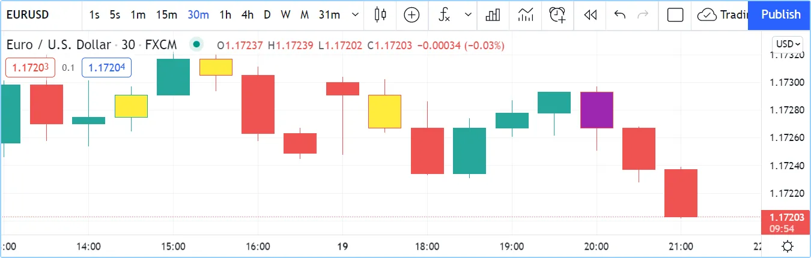

# [Bar coloring](../2. Visuals/visuals_bar-coloring.md#bar-coloring)

The [barcolor()](../../reference manual/functions/barcolor.md) function colors bars on the main chart, regardless of whether the script is running in the main chart pane or a separate pane.

The function’s signature is:

```
barcolor(color, offset, editable, show_last, title, display) → void
```

The coloring can be conditional because the `color` parameter accepts “series color” arguments.

The following script renders _inside_ and _outside_ bars in different colors:



```pine
//@version=6
indicator("barcolor example", overlay = true)
isUp = close > open
isDown = close <= open
isOutsideUp = high > high[1] and low < low[1] and isUp
isOutsideDown = high > high[1] and low < low[1] and isDown
isInside = high < high[1] and low > low[1]
barcolor(isInside ? color.yellow : isOutsideUp ? color.aqua : isOutsideDown ? color.purple : na)
```

Note that:

- The [na](../../reference manual/variables/na.md) value leaves bars as is.
- In the [barcolor()](../../reference manual/functions/barcolor.md) call, we use embedded [?:](../../reference manual/operators/{question}{colon}.md) ternary operator expressions to select the color.

[Previous 
**Backgrounds**](../2. Visuals/visuals_backgrounds.md) [Next 
**Bar plotting**](../2. Visuals/visuals_bar-plotting.md)