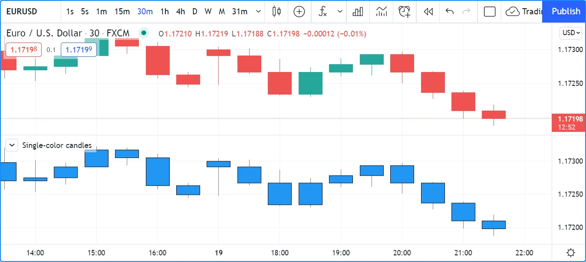
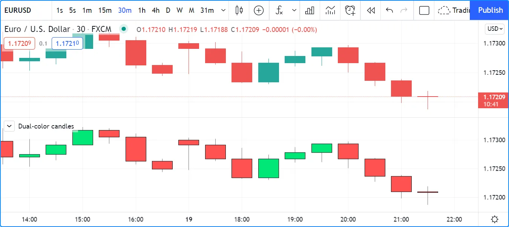
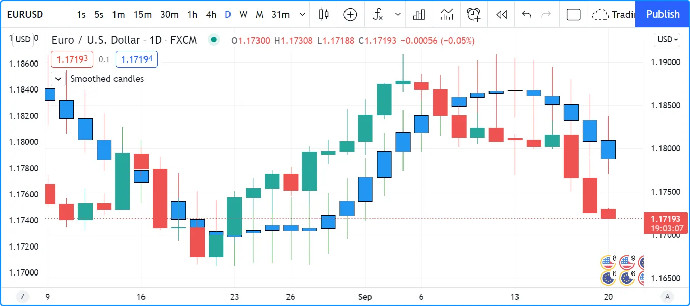
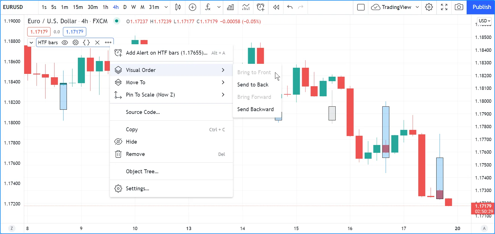
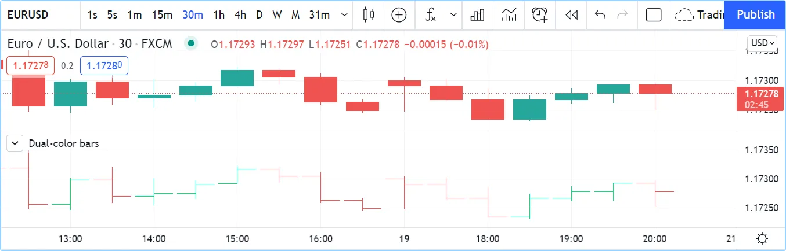

# [Bar plotting](../2. Visuals/visuals_bar-plotting.md#bar-plotting)

## [Introduction](../2. Visuals/visuals_bar-plotting.md#introduction)

The
[plotcandle()](../../reference manual/functions/plotcandle.md)
built-in function is used to plot candles.
[plotbar()](../../reference manual/functions/plotbar.md)
is used to plot conventional bars.

Both functions require four arguments that will be used for the OHLC
prices
( [open](../../reference manual/variables/open.md),
[high](../../reference manual/variables/high.md),
[low](../../reference manual/variables/low.md),
[close](../../reference manual/variables/close.md))
of the bars they will be plotting. If one of those is
[na](../../reference manual/variables/na.md), no
bar is plotted.

## [Plotting candles with ​`plotcandle()`​](../2. Visuals/visuals_bar-plotting.md#plotting-candles-with-plotcandle)

The signature of
[plotcandle()](../../reference manual/functions/plotcandle.md)
is:

```
plotcandle(open, high, low, close, title, color, wickcolor, editable, show_last, bordercolor, display) → void
```

This plots simple candles, all in blue, using the habitual OHLC values,
in a separate pane:

```pine
//@version=6
indicator("Single-color candles")
plotcandle(open, high, low, close)
```



To color them green or red, we can use the following code:

```pine
//@version=6
indicator("Example 2")
paletteColor = close >= open ? color.lime : color.red
plotbar(open, high, low, close, color = paletteColor)
```



Note that the `color` parameter accepts “series color” arguments, so
constant values such as `color.red`, `color.lime`, `"#FF9090"`, as well
as expressions that calculate colors at runtime, as is done with the
`paletteColor` variable here, will all work.

You can build bars or candles using values other than the actual OHLC
values. For example you could calculate and plot smoothed candles using
the following code, which also colors wicks depending on the position of
[close](../../reference manual/variables/close.md)
relative to the smoothed close (`c`) of our indicator:

```pine
//@version=6
indicator("Smoothed candles", overlay = true)
lenInput = input.int(9)
smooth(source, length) =>
    ta.sma(source, length)
o = smooth(open, lenInput)
h = smooth(high, lenInput)
l = smooth(low, lenInput)
c = smooth(close, lenInput)
ourWickColor = close > c ? color.green : color.red
plotcandle(o, h, l, c, wickcolor = ourWickColor)
```



You may find it useful to plot OHLC values taken from a higher
timeframe. You can, for example, plot daily bars on an intraday chart:

```pine
// NOTE: Use this script on an intraday chart.
//@version=6
indicator("Daily bars", behind_chart = false, overlay = true)

// Use gaps to return data only when the 1D timeframe completes, and to return `na` otherwise.
[o, h, l, c] = request.security(syminfo.tickerid, "D", [open, high, low, close], gaps = barmerge.gaps_on)

const color UP_COLOR = color.silver
const color DN_COLOR = color.blue
color wickColor = c >= o ? UP_COLOR : DN_COLOR
color bodyColor = c >= o ? color.new(UP_COLOR, 70) : color.new(DN_COLOR, 70)
// Plot candles on intraday timeframes,
// and when non `na` values are returned by `request.security()` because a HTF bar has completed.
plotcandle(timeframe.isintraday ? o : na, h, l, c, color = bodyColor, wickcolor = wickColor)
```



Note that:

- We set the `behind_chart` parameter of the [indicator()](../../reference manual/functions/indicator.md) declaration to `false`. This causes our script’s candles to appear on top of the chart’s candles. Selecting “Visual Order/Bring to Front” from the script’s “More” menu achieves the same result.
- The script displays candles only when two conditions are met:
  - The chart is using an intraday timeframe (see the check on `timeframe.isintraday` in the [plotcandle()](../../reference manual/functions/plotcandle.md) call). We do this because it’s not useful to show a daily value on timeframes higher or equal to 1D.
  - The [request.security()](../../reference manual/functions/request.security.md) function returns non [na](../../reference manual/variables/na.md) values (see `gaps = barmerge.gaps_on` in the function call).
- We use a tuple (`[open, high, low, close]`) with [request.security()](../../reference manual/functions/request.security.md)
to fetch four values in one call.
- We create a lighter transparency for the body of our candles in the `bodyColor` variable initialization, so they don’t obstruct the chart’s candles.

## [Plotting bars with ​`plotbar()`​](../2. Visuals/visuals_bar-plotting.md#plotting-bars-with-plotbar)

The signature of
[plotbar()](../../reference manual/functions/plotbar.md)
is:

```
plotbar(open, high, low, close, title, color, editable, show_last, display, force_overlay) → void
```

Note that
[plotbar()](../../reference manual/functions/plotbar.md)
has no parameter for `bordercolor` or `wickcolor`, as there are no
borders or wicks on conventional bars.

This plots conventional bars using the same coloring logic as in the
second example of the previous section:

```pine
//@version=6
indicator("Dual-color bars")
paletteColor = close >= open ? color.lime : color.red
plotbar(open, high, low, close, color = paletteColor)
```



[Previous 
**Bar coloring**](../2. Visuals/visuals_bar-coloring.md) [Next 
**Colors**](../2. Visuals/visuals_colors.md)