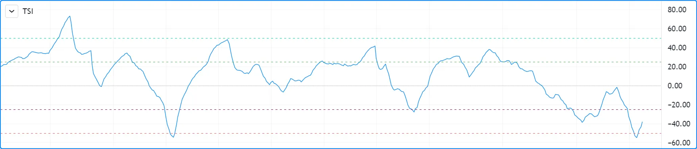
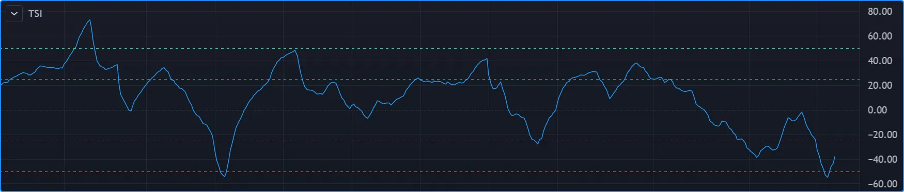
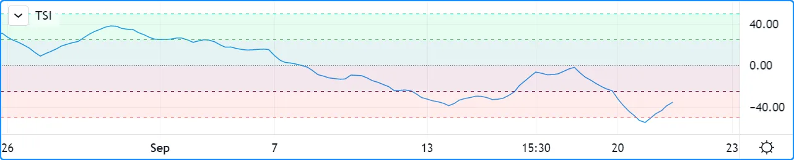
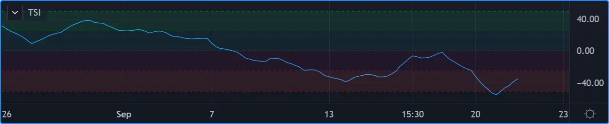

# [Levels](../2. Visuals/visuals_levels.md#levels)

## [​`hline()`​ levels](../2. Visuals/visuals_levels.md#hline-levels)

Levels are lines plotted using the
[hline()](../../reference manual/functions/hline.md)
function. It is designed to plot **horizontal** levels using a **single**
**color**, i.e., it does not change on different bars. See the
[Levels](../2. Visuals/visuals_plots.md#levels) section of the
page on
[plot()](https://www.tradingview.com/pine-script-reference/v6/#plot) for
alternative ways to plot levels when
[hline()](../../reference manual/functions/hline.md)
won’t do what you need.

The function has the following signature:

```
hline(price, title, color, linestyle, linewidth, editable, display) → hline
```

[hline()](../../reference manual/functions/hline.md)
has a few constraints when compared to
[plot()](../../reference manual/functions/plot.md):

- Since the function’s objective is to plot horizontal lines, its
`price` parameter requires an “input int/float” argument, which
means that “series float” values such as
[close](../../reference manual/variables/close.md)
or dynamically-calculated values cannot be used.
- Its `color` parameter requires an “input color” argument, which
precludes the use of dynamic colors, i.e., colors calculated on each
bar — or “series color” values.
- Three different line styles are supported through the `linestyle`
parameter: [hline.style\_solid](../../reference manual/constants/hline.style_solid.md), [hline.style\_dotted](../../reference manual/constants/hline.style_dotted.md) and
[hline.style\_dashed](../../reference manual/constants/hline.style_dashed.md).

Let’s see
[hline()](../../reference manual/functions/hline.md)
in action in the “True Strength Index” indicator:

```pine
//@version=6
indicator("TSI")
myTSI = 100 * ta.tsi(close, 25, 13)

hline( 50, "+50",  color.lime)
hline( 25, "+25",  color.green)
hline(  0, "Zero", color.gray, linestyle = hline.style_dotted)
hline(-25, "-25",  color.maroon)
hline(-50, "-50",  color.red)

plot(myTSI)
```





Note that:

- We display 5 levels, each of a different color.
- We use a different line style for the zero centerline.
- We choose colors that will work well on both light and dark themes.
- The usual range for the indicator’s values is +100 to -100. Since
the
[ta.tsi()](../../reference manual/functions/ta.tsi.md)
built-in returns values in the +1 to -1 range, we make the
adjustment in our code.

## [Fills between levels](../2. Visuals/visuals_levels.md#fills-between-levels)

The space between two levels plotted with
[hline()](../../reference manual/functions/hline.md)
can be colored using
[fill()](../../reference manual/functions/fill.md).
Keep in mind that **both** plots must have been plotted with
[hline()](../../reference manual/functions/hline.md).

Let’s put some background colors in our TSI indicator:

```pine
//@version=6
indicator("TSI")
myTSI = 100 * ta.tsi(close, 25, 13)

plus50Hline  = hline( 50, "+50",  color.lime)
plus25Hline  = hline( 25, "+25",  color.green)
zeroHline    = hline(  0, "Zero", color.gray, linestyle = hline.style_dotted)
minus25Hline = hline(-25, "-25",  color.maroon)
minus50Hline = hline(-50, "-50",  color.red)

// ————— Function returns a color in a light shade for use as a background.
fillColor(color col) =>
    color.new(col, 90)

fill(plus50Hline,  plus25Hline,  fillColor(color.lime))
fill(plus25Hline,  zeroHline,    fillColor(color.teal))
fill(zeroHline,    minus25Hline, fillColor(color.maroon))
fill(minus25Hline, minus50Hline, fillColor(color.red))

plot(myTSI)
```





Note that:

- We have now used the return value of our
[hline()](../../reference manual/functions/hline.md)
function calls, which is of the
[hline](../3. Language/language_type-system.md#plot-and-hline) special type. We use the `plus50Hline`, `plus25Hline`,
`zeroHline`, `minus25Hline` and `minus50Hline` variables to store
those “hline” IDs because we will need them in our
[fill()](../../reference manual/functions/fill.md)
calls later.
- To generate lighter color shades for the background colors, we
declare a `fillColor()` function that accepts a color and returns
its 90 transparency. We use calls to that function for the `color`
arguments in our
[fill()](../../reference manual/functions/fill.md)
calls.
- We make our
[fill()](../../reference manual/functions/fill.md)
calls for each of the four different fills we want, between four
different pairs of levels.
- We use [color.teal](../../reference manual/constants/color.teal.md) in our second fill because it produces a green
that fits the color scheme better than the [color.green](../../reference manual/constants/color.green.md) used for
the 25 level.

[Previous 
**Fills**](../2. Visuals/visuals_fills.md) [Next 
**Lines and boxes**](../2. Visuals/visuals_lines-and-boxes.md)