# [Overview](../2. Visuals/visuals_overview.md#overview)

## [Introduction](../2. Visuals/visuals_overview.md#introduction)

Well-designed visuals make indicators and strategies easier to use and less cluttered. Each visual element presents data differently:

- [Plot visuals](../2. Visuals/visuals_overview.md#plot-visuals) include all `plot*()` functions, horizontal levels, background and bar coloring, and fills.
- [Drawing visuals](../2. Visuals/visuals_overview.md#drawing-visuals) include lines, polylines, linefills, boxes, labels, and tables.

Scripts can configure where and how the visual elements appear by using the [script-wide visual settings](../2. Visuals/visuals_overview.md#script-wide-visual-settings).

By understanding [when to use](../2. Visuals/visuals_overview.md#when-to-use) each tool effectively, programmers can pick the best visual for the task to make the most of the power of Pine Script®.

This page describes plots and drawings, and what their differences are. It includes all the available visual constructs and examples of their use in built-in indicators (for more details about a specific visual element, refer to its User Manual page).

## [Script-wide visual settings](../2. Visuals/visuals_overview.md#script-wide-visual-settings)

Some visual settings control how all of the script’s outputs _collectively_ appear on the chart, regardless of their individual properties. These script-wide visual settings are parameters in the [indicator()](../../reference manual/functions/indicator.md) or [strategy()](../../reference manual/functions/strategy.md) declaration statement.

### [​`overlay`​](../2. Visuals/visuals_overview.md#overlay)

The `overlay` parameter controls whether the script’s outputs appear in the main pane or a separate pane. By default, its value is `false`, so adding a script to the chart displays its visual outputs in a _separate_ pane to the main chart series.

Whereas the `overlay` parameter affects the script as a whole, the `force_overlay` parameter controls the pane location for _individual_ elements. Using `force_overlay = true` displays the specified element in the main pane, even if the script’s `overlay` argument is `false`. This allows a script occupying a separate pane to overlay only some visuals on the main chart. The `force_overlay` parameter is available for all `plot*()` functions, [bgcolor()](../../reference manual/functions/bgcolor.md), and all drawing `*.new()` constructor functions ( [box.new()](../../reference manual/functions/box.new.md), [label.new()](../../reference manual/functions/label.new.md), etc.).

For example, the built-in [Seasonality](https://www.tradingview.com/support/solutions/43000723025-seasonality/) indicator uses `overlay = false` to display in a separate pane, where it displays its primary visual of a [table](../2. Visuals/visuals_tables.md), but draws [boxes](../2. Visuals/visuals_lines-and-boxes.md#boxes) on the main chart with `force_overlay = true`:

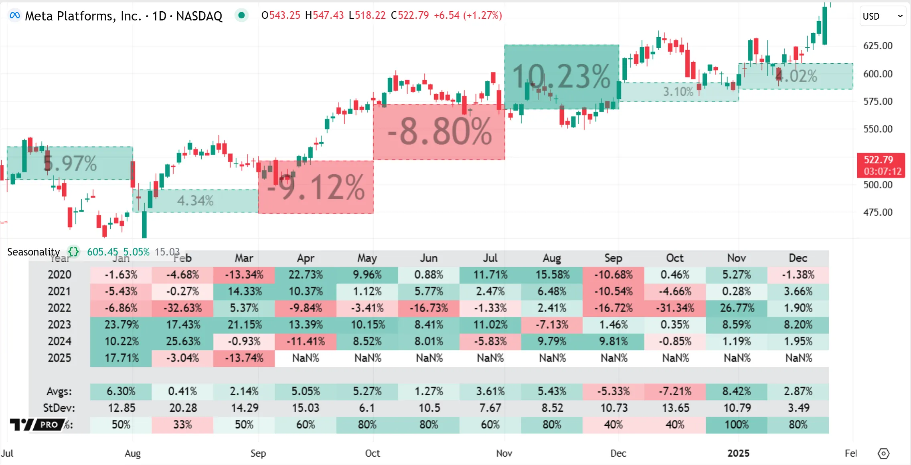

### [​`scale`​](../2. Visuals/visuals_overview.md#scale)

A script’s `scale` parameter specifies the y-axis scale that its pane visuals use. By default, scripts overlayed in the main pane use the existing chart scale ( [scale.none](../../reference manual/constants/scale.none.md)). Specifying a [scale.right](../../reference manual/constants/scale.right.md) or [scale.left](../../reference manual/constants/scale.left.md) argument in overlayed scripts generates a _new scale_ distinct from the main chart’s price scale. Scripts displaying in a separate pane generate their own scale by default, which they can also set to the left or right position. For instance, this image shows an overlayed indicator using a distinct right-side scale, and a separate pane indicator using a left-side scale:

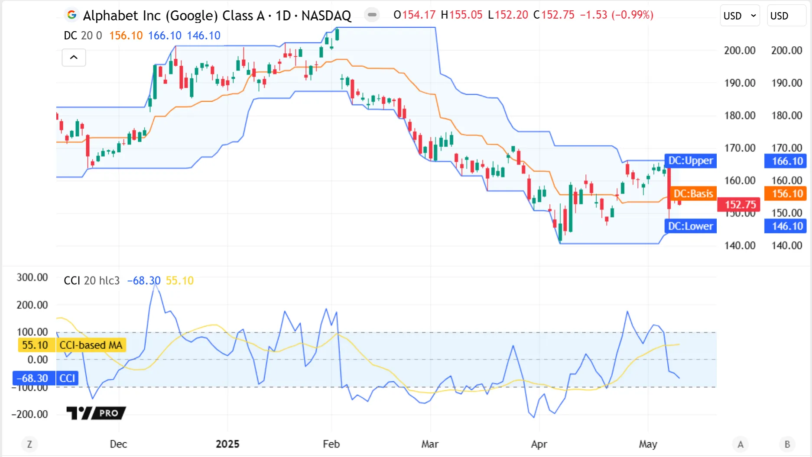

### [​`behind_chart`​](../2. Visuals/visuals_overview.md#behind_chart)

The `behind_chart` parameter specifies whether a script’s visuals appear behind or in front of the main chart series. By default, its value is `true`, so visuals overlayed in the main pane appear behind the chart bars. When `behind_chart` is `false`, visuals appear _in front of_ the bars, which may obscure bars, depending on the type of visual and its color transparency:

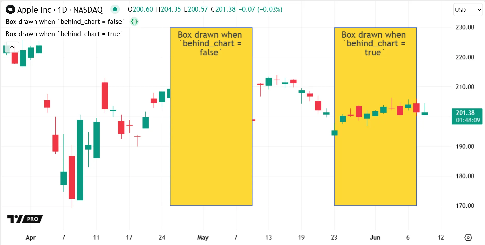

### [Changing settings](../2. Visuals/visuals_overview.md#changing-settings)

To adjust the visual settings of a script on the chart, click the “More” menu (three dots icon) in the script’s status line. Options are available to adjust the script’s visual order, move it to another pane, and change its y-axis scale:

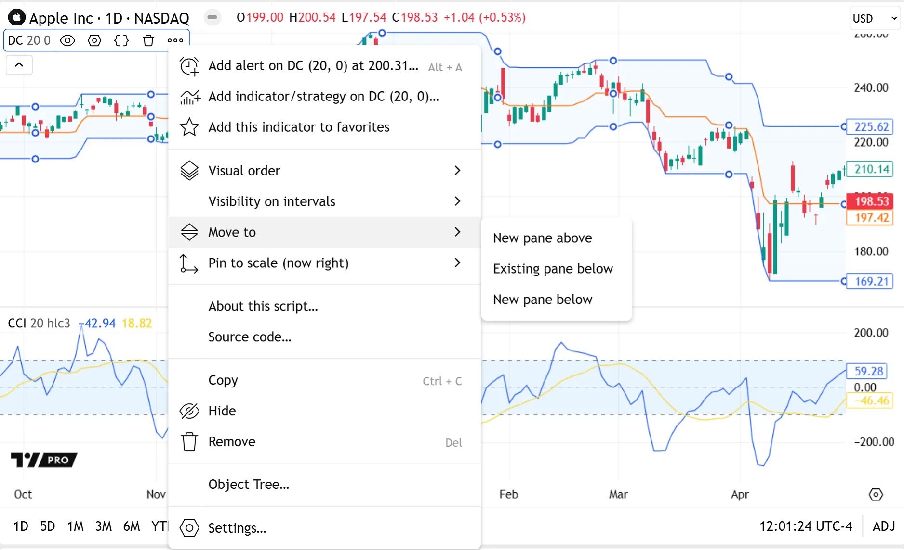

## [Plot visuals](../2. Visuals/visuals_overview.md#plot-visuals)

The outputs of the following functions are classified as plot visuals:

- All `plot*()` functions:

  - Data series [plots](../2. Visuals/visuals_plots.md) using [plot()](../../reference manual/functions/plot.md)
  - [Shape](../2. Visuals/visuals_text-and-shapes.md#plotshape) plots using [plotshape()](../../reference manual/functions/plotshape.md)
  - [Character](../2. Visuals/visuals_text-and-shapes.md#plotchar) plots using [plotchar()](../../reference manual/functions/plotchar.md)
  - [Arrow](../2. Visuals/visuals_text-and-shapes.md#plotarrow) plots using [plotarrow()](../../reference manual/functions/plotarrow.md)
  - [Bar](../2. Visuals/visuals_bar-plotting.md#plotting-bars-with-plotbar) plots using [plotbar()](../../reference manual/functions/plotbar.md)
  - [Candle](../2. Visuals/visuals_bar-plotting.md#plotting-candles-with-plotcandle) plots using [plotcandle()](../../reference manual/functions/plotcandle.md)
- [Bar coloring](../2. Visuals/visuals_bar-coloring.md) using [barcolor()](../../reference manual/functions/barcolor.md)
- [Background coloring](../2. Visuals/visuals_backgrounds.md) using [bgcolor()](../../reference manual/functions/bgcolor.md)
- [Horizontal levels](../2. Visuals/visuals_levels.md) using [hline()](../../reference manual/functions/hline.md)
- [Fills](../2. Visuals/visuals_fills.md#plot-and-hline-fills) for plots and horizontal levels using [fill()](../../reference manual/functions/fill.md)

Plots are _serial_ visuals that always return a result on each bar — although the result can be [na](../../reference manual/variables/na.md). One plot therefore forms a _series_. By contrast, [drawing visuals](../2. Visuals/visuals_overview.md#drawing-visuals) instantiate _individual objects_.
A single plot visual function call can display results on all the bars in the main series, no matter how many bars display in the series, while drawings adhere to a [drawing limit](../4. Writing_Scripts/writing_limitations.md#line-box-polyline-and-label-limits) of approximately ~500 objects.

A script creates plot visuals sequentially as it executes across the chart bars, so it cannot draw them into the past or future all at once like drawings. For example, `plot(close)` plots the _current_ [close](../../reference manual/variables/close.md) on the _current_ bar. Pine’s [execution model](../3. Language/language_execution-model.md) then repeats this for every bar in the dataset.

Scripts create plots with [offsets](../2. Visuals/visuals_plots.md#offsets) in exactly the same way. They appear to end at past or future bars because the script executes the same plot call on each bar and simply displays each result the same _fixed_ number of bars forwards or backwards.

### [Display in other locations](../2. Visuals/visuals_overview.md#display-in-other-locations)

Plots can display results in locations other than the chart pane, unlike drawings. The last numeric value of a plot can display in the price scale. The script’s status line and the Data Window can display plot values for specific bars, and the values update as the user hovers over different bars:

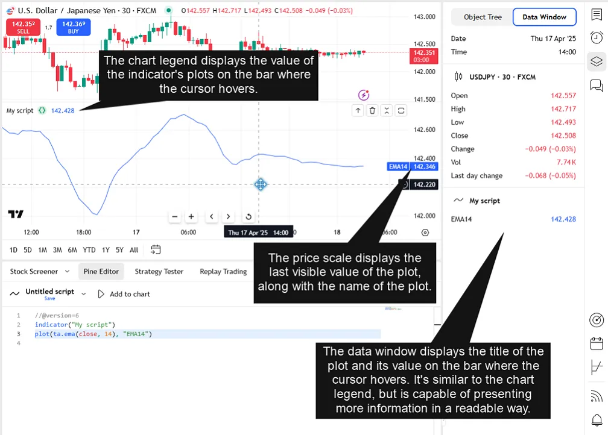

In one script, plots can display their results in different places by using different arguments for the `display` parameter for each plot function. For example, a script can display one plot’s results in all locations, display another plot everywhere but the status line, and create a third plot with no visible display.

The `plot*()` functions accept multiple `display.*` arguments and support addition and subtraction to combine arguments for further customization. Other, numerically simpler plot visuals like [horizontal levels](../2. Visuals/visuals_levels.md), [fills](../2. Visuals/visuals_overview.md#fills), and [coloring functions](../2. Visuals/visuals_overview.md#background-and-bar-coloring) have only two display states: they either display a pane visual ( [display.all](../../reference manual/constants/display.all.md)) or are hidden ( [display.none](../../reference manual/constants/display.none.md)).

This simple demonstration script uses various plot visuals and `display` locations to plot the [open](../../reference manual/variables/open.md) and [close](../../reference manual/variables/close.md) prices, plot the difference between them (`barCO`), and to signal when that difference is greater than 5:

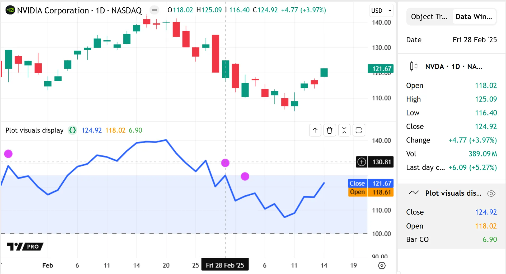

```pine
//@version=6
indicator("Plot visuals display demo", overlay = false)

//@variable The difference between the bar's `open` and `close` prices.
float barCO = close - open

// Horizontal lines and fills have only two possible `display` states.
h1 = hline(125, "Level 125", linewidth = 2, display = display.none)
h2 = hline(100, "Level 100", linewidth = 2, display = display.all)
fill(h1, h2, color = color.new(color.blue, 90), display = display.all)

// `plot*()` visuals accept multiple `display` options and support addition and subtraction.
plot(close, "Close", color.blue,   3, display = display.all)
plot(open,  "Open",  color.orange, 3, display = display.all - display.pane)
plotarrow(barCO, "Bar CO", color.green, color.red, display = display.status_line + display.data_window)
plotshape(barCO > 5, "Large CO", shape.circle, location.abovebar, color.fuchsia, display = display.pane)
```

Note that:

- Although there are no arrows visible in the script pane, the [plotarrow()](../../reference manual/functions/plotarrow.md) call still calculates and plots the `barCO` values on every bar, as indicated by the “Bar CO” result in the Data Window and the matching green result in the status line.
- Since `plotshape(barCO > 5)` uses a “bool” series, the plot’s numeric results can only be 1 or 0 on any bar. We set it to display only in the chart pane because that’s our most useful visual signal for this plot. Being selective with display options can help to keep results in any one location free from clutter.

The `format` and `precision` parameters of `plot*()` functions can further customize how numeric results appear in the status line, price scale, and Data Window. The `format` parameter specifies whether to format plot values as prices, percentages, or volume. The `precision` parameter specifies the number of decimal digits that plot values include for non-volume formats. See the [\`plot()\` parameters](../2. Visuals/visuals_plots.md#plot-parameters) section of the [Plots](../2. Visuals/visuals_plots.md) page to learn more.

Additionally, users can manage whether numeric plot results are visible for a given indicator or chart by using settings at both the indicator and chart level, without editing any source code (see the Help Center article on how to [hide values of indicators](https://www.tradingview.com/support/solutions/43000659666-i-want-to-hide-the-values-of-individual-indicators/) for more). An indicator’s settings control whether any plot values appear in _that indicator’s_ status line and price scale. A chart’s settings control whether status line and price scale values appear _at all_ in any indicators on that chart. Disabling the indicator settings overrides the script’s per-plot `display` properties, while the chart settings override both.

Users can also customize the visibility, color, and style of plot visuals without needing to create new inputs or edit the script. Settings are automatically generated in the indicator’s “Style” tab for every plot visual in the script, regardless of their `display` state:

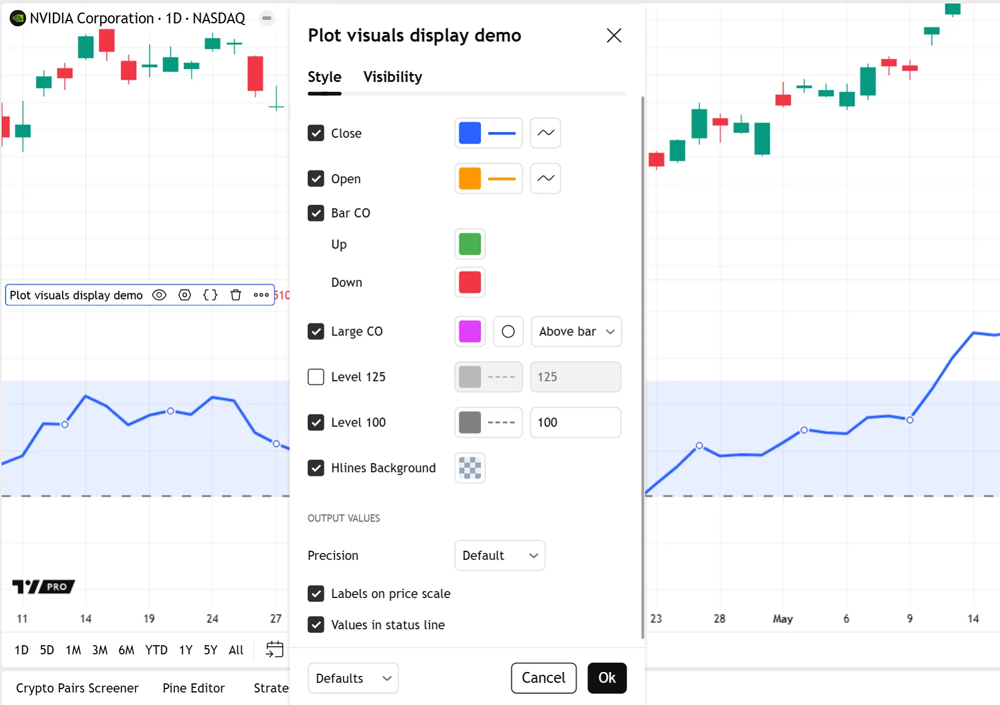

Note that if the script generates any _dynamic colors_, the color pickers in the “Style” settings do not display. See the [Maintaining automatic color selectors](../2. Visuals/visuals_colors.md#maintaining-automatic-color-selectors) section of the [Colors](../2. Visuals/visuals_colors.md) page to learn more.

The `display.*` arguments represent the _default state_ of the script’s plot visuals. Disabling a plot from the indicator’s “Style” settings and then reactivating it causes the plot to revert to [display.all](../../reference manual/constants/display.all.md), unless the indicator is reset to its default settings.

The ability to display outputs in several locations and to visually track a series across the chart bars makes plot visuals useful debugging tools. See the [Plots and chart colors](../4. Writing_Scripts/writing_debugging.md#plots-and-chart-colors) section of the [Debugging](../4. Writing_Scripts/writing_debugging.md) page for more information.

### [External uses: exports, alerts, and more](../2. Visuals/visuals_overview.md#external-uses-exports-alerts-and-more)

Unlike drawings, plots have uses outside the script: exporting data, creating [alerts](../1. Concepts/concepts_alerts.md), setting another indicator’s [source input](../1. Concepts/concepts_inputs.md#source-input), and scanning watchlists using the [Pine Screener](https://www.tradingview.com/pine-screener/).

These uses for plot results function regardless of a plot’s `display.*` state on the chart and do not require special code for the outputs. Indeed, when creating plots for use in alerts or data exports, using [display.none](../../reference manual/constants/display.none.md) can keep a script’s visuals clutter-free and avoid distorting the chart scale.

Users can export plots using the “Export chart data” feature, which generates a comma-separated values (CSV) file of the chart data (see the section on [exporting indicator data to a file](../6. FAQ/faq_indicators.md#is-it-possible-to-export-indicator-data-to-a-file) in the [Indicators FAQ](../6. FAQ/faq_indicators.md) page). The exported data includes the symbol’s OHLC ( [open](../../reference manual/variables/open.md), [high](../../reference manual/variables/high.md), [low](../../reference manual/variables/low.md), and [close](../../reference manual/variables/close.md)) values and any numeric plot results generated by active scripts on the chart, including those displayed only in the Data Window or status line. Drawings and hidden scripts are excluded from exports.

An alert can use any `plot*()` call executing on the chart as its trigger condition. Users can create alerts based on plots even if the script does not include any alert-specific code such as [alert()](../../reference manual/functions/alert.md) or [alertcondition()](../../reference manual/functions/alertcondition.md). See the Help Center article on [how to create alerts](https://www.tradingview.com/support/solutions/43000520149-tradingview-alerts-how-to-get-notifications-immediately/#How-to-create-alerts-on-TradingView) from the user interface. Users can also include the dynamic results from up to 20 `plot*()` series in an alert’s message using [placeholders](../1. Concepts/concepts_alerts.md#placeholders), as explained in the Help Center article on [using variable values in alerts](https://www.tradingview.com/support/solutions/43000531021/).

A script can use plots that are output by other indicators on the chart as a _source input_. The [input.source()](../../reference manual/functions/input.source.md) function creates a “Source” dropdown in the script’s “Inputs” settings, from which users can then select any plots displayed on the chart as the input source. Any calculated plots can act as source inputs even if they are hidden from the current chart display (e.g., the unseen `plotarrow(barCO)` plot from the example in the [display in other locations](../2. Visuals/visuals_overview.md#display-in-other-locations) section above, or any hidden indicators). Using a source input links both scripts, so changes to the original plot subsequently alter the input plot, and removing the source indicator from the chart removes the dependent script.

The [Pine Screener](https://www.tradingview.com/pine-screener/) uses an indicator’s plots to scan a watchlist of symbols. It generates columns showing the results of the indicator’s [plot()](../../reference manual/functions/plot.md) and [alertcondition()](../../reference manual/functions/alertcondition.md) calls for each symbol. Users can also choose to filter screener results based on plot conditions. See this Help Center article on [the Pine Screener](https://www.tradingview.com/support/solutions/43000742436-tradingview-pine-screener-key-features-and-requirements/) to learn more.

### [Limitations](../2. Visuals/visuals_overview.md#limitations)

Scripts can plot visuals only in the _global_ scope. Unlike drawings, plots cannot be included in the local scopes of [loops](../3. Language/language_loops.md), [conditional structures](../3. Language/language_conditional-structures.md), or [user-defined functions](../3. Language/language_user-defined-functions.md) and [methods](../3. Language/language_methods.md#user-defined-methods), and plot calls can only accept variables and literals that are declared globally. However, a script can still create visuals that [plot conditionally](../2. Visuals/visuals_plots.md#plotting-conditionally) by using [na](../../reference manual/variables/na.md) values for a plot’s `series` or `color` arguments, thus hiding the plot on certain bars.

While plot visuals are well suited for displaying dynamically-calculated series, those that support text, like [plotshape()](../../reference manual/functions/plotshape.md) and [plotchar()](../../reference manual/functions/plotchar.md), cannot display dynamic text. The parameters of these functions accept “const string” arguments, so the same text displays on all the bars, and it cannot change during execution or be an [input](../1. Concepts/concepts_inputs.md) value, unlike the text supported in [drawing visuals](../2. Visuals/visuals_overview.md#drawing-visuals).

Plots can be offset into the past or future, but only by a fixed number of bars. This makes plotted shapes, for example, suitable for marking [Williams fractals](https://www.tradingview.com/support/solutions/43000591663/), which confirm after a known number of bars, but unsuitable for marking more complex types of events that confirm after an arbitrary number of bars.

Each script instance can create a maximum of 64 plots. Depending on the complexity of the plot and its arguments, one function call can count _more than once_ towards the [plot count limit](../2. Visuals/visuals_plots.md#plot-count-limit). See the [plot limits](../4. Writing_Scripts/writing_limitations.md#plot-limits) section of the [Limitations](../4. Writing_Scripts/writing_limitations.md) page for more information.

## [Drawing visuals](../2. Visuals/visuals_overview.md#drawing-visuals)

Pine drawings display in a script’s pane, and provide the flexibility to represent graphical data beyond plotting series. The following elements are classified as drawing visuals:

- [Lines](../2. Visuals/visuals_lines-and-boxes.md#lines)
- [Polylines](../2. Visuals/visuals_lines-and-boxes.md#polylines)
- [Linefills](../2. Visuals/visuals_fills.md#line-fills)
- [Boxes](../2. Visuals/visuals_lines-and-boxes.md#boxes)
- [Labels](../2. Visuals/visuals_text-and-shapes.md#labels)
- [Tables](../2. Visuals/visuals_tables.md)

Drawings are _objects_, unlike [plots](../2. Visuals/visuals_overview.md#plot-visuals), which are _serial_ visuals, so calling a drawing function **does not** create a visual that always returns a persistent result on every bar in the dataset. Instead, a drawing function references _one instance_ of a drawing object, which can be at an arbitrary location relative to the bar on which the script called the function.

Since drawings are not serialized, scripts can call the same drawing function several times on one bar to create multiple drawings at different locations on the chart at once.

Each drawing visual has its own namespace with built-in functions for creating and managing the drawing objects. Most drawing parameters accept “series” types, which allows the visuals to use dynamic positions, colors, styles, etc. Drawing parameters support [input](../1. Concepts/concepts_inputs.md) values and complex expressions as arguments, and can update these arguments as the script executes from bar to bar. Drawings like labels, boxes, and tables can also display dynamic text.

Scripts can create and manage drawing visuals from _local_ scopes, so programmers can include drawing calls in [conditional structures](../3. Language/language_conditional-structures.md), [loops](../3. Language/language_loops.md), and [user-defined functions](../3. Language/language_user-defined-functions.md) or [methods](../3. Language/language_methods.md#user-defined-methods), unlike plot calls. While scripts _can_ call drawing functions globally, it’s rarely necessary to execute drawings on every bar. Further, because scripts that create drawing objects on each bar are likely to reach the [limit](../4. Writing_Scripts/writing_limitations.md#line-box-polyline-and-label-limits) for that drawing type, it’s more usual to create drawings in local scopes.

The ability of drawing functions to display dynamic data at any available chart location and to run in local scopes makes them useful debugging tools. See the [Pine drawings](../4. Writing_Scripts/writing_debugging.md#pine-drawings) section of the [Debugging](../4. Writing_Scripts/writing_debugging.md) page for more information.

### [Display and customization](../2. Visuals/visuals_overview.md#display-and-customization)

Unlike plots, drawings do not [display in other locations](../2. Visuals/visuals_overview.md#display-in-other-locations) — they display a visual only in the chart pane. Therefore, they cannot show any numeric results in the script’s status line, price scale, or Data Window, or by hovering over the drawing. Likewise, using drawings in a script does not automatically generate color/style customization options in the indicator’s “Style” tab.

Instead, the “Style” settings generate a checkbox for each drawing _type_ used by a script, which toggles the visibility of **all** objects of that type in that indicator:

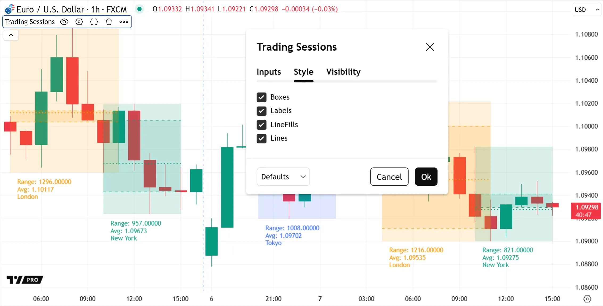

However, since drawings accept “series” arguments, scripts can use [inputs](../1. Concepts/concepts_inputs.md) to create fully customizable drawing visuals. For example, this script uses [string inputs](../1. Concepts/concepts_inputs.md#string-input), [color inputs](../1. Concepts/concepts_inputs.md#color-input), and [integer inputs](../1. Concepts/concepts_inputs.md#integer-input) to allow users to easily customize the appearance of the [table](../2. Visuals/visuals_tables.md) and [label](../2. Visuals/visuals_text-and-shapes.md#labels) visuals from the indicator’s “Inputs” tab:

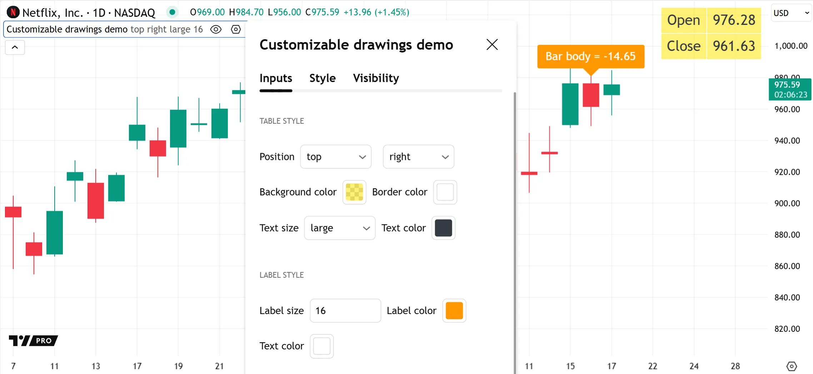

```pine
//@version=6
indicator("Customizable drawings demo", overlay = true)

// Input `group` headers to distinguish the table style inputs and the label style inputs.
const string G1 = "Table Style"
const string G2 = "Label Style"
// Create user inputs for customizing `table` style (position, colors, text size).
string tbVerticalInput   = input.string("Top", "Position", ["Top", "Middle", "Bottom"], inline = "Pos", group = G1)
string tbHorizontalInput = input.string("Right", "Center", ["Left", "Center", "Right"], inline = "Pos", group = G1)
color  tbBackgroundInput = input.color(#ffeb3bb3,  "Background color", inline = "Col", group = G1)
color  tbBorderInput     = input.color(color.white,"Border color",     inline = "Col", group = G1)
string tbTextSizeInput   = input.string(size.large, "Text size", inline = "Txt", group = G1,
     options = [size.tiny, size.small, size.normal, size.large, size.huge, size.auto])
color tbTextColorInput = input.color(color.black, "Text color", inline = "Txt", group = G1)
// Create user inputs for customizing `label` style (size, colors).
int   lblSizeInput      = input.int(16, "Label size", minval = 0, inline = "Lbl", group = G2)
color lblColorInput     = input.color(color.orange, "Label color", inline = "Lbl", group = G2)
color lblTextColorInput = input.color(color.white, "Text color", group = G2)

// On last confirmed bar, draw a table to show the `open` and `close` prices, and a label to show their difference.
if barstate.islastconfirmedhistory
    //@variable The table's `position` argument based on the values of `tbVerticalInput` and `tbHorizontalInput`.
    string tbPos = switch
        tbVerticalInput == "Top"    and tbHorizontalInput == "Left"   => position.top_left
        tbVerticalInput == "Top"    and tbHorizontalInput == "Center" => position.top_center
        tbVerticalInput == "Top"    and tbHorizontalInput == "Right"  => position.top_right
        tbVerticalInput == "Middle" and tbHorizontalInput == "Left"   => position.middle_left
        tbVerticalInput == "Middle" and tbHorizontalInput == "Center" => position.middle_center
        tbVerticalInput == "Middle" and tbHorizontalInput == "Right"  => position.middle_right
        tbVerticalInput == "Bottom" and tbHorizontalInput == "Left"   => position.bottom_left
        tbVerticalInput == "Bottom" and tbHorizontalInput == "Center" => position.bottom_center
        tbVerticalInput == "Bottom" and tbHorizontalInput == "Right"  => position.bottom_right
    //@variable A table showing the last confirmed bar's `open` and `close` prices. Inputs customize the table's style.
    var table displayTable = table.new(tbPos, 2, 2, tbBackgroundInput, border_color = tbBorderInput, border_width = 1)
    displayTable.cell(0, 0, "Open",              text_color = tbTextColorInput, text_size = tbTextSizeInput)
    displayTable.cell(1, 0, str.tostring(open),  text_color = tbTextColorInput, text_size = tbTextSizeInput)
    displayTable.cell(0, 1, "Close",             text_color = tbTextColorInput, text_size = tbTextSizeInput)
    displayTable.cell(1, 1, str.tostring(close), text_color = tbTextColorInput, text_size = tbTextSizeInput)
    //@variable The label text, containing the difference between the bar's `open` and `close` prices.
    string lblText = "Bar body = " + str.tostring(close - open)
    label.new(bar_index, high, lblText, color = lblColorInput, textcolor = lblTextColorInput, size = lblSizeInput)
```

### [Limitations](../2. Visuals/visuals_overview.md#limitations-1)

There are [limits](../4. Writing_Scripts/writing_limitations.md#line-box-polyline-and-label-limits) to the total number of drawing visuals a script can display on the chart. A single script instance can draw a maximum of approximately 500 lines, boxes, and labels, and a maximum of 100 polylines. If the number of drawings exceeds the limit, a garbage collection mechanism deletes the oldest drawings to keep only the most recent visuals on the chart.

The `max_lines_count`, `max_boxes_count`, `max_labels_count`, and `max_polylines_count` parameters in the [indicator()](../../reference manual/functions/indicator.md) or [strategy()](../../reference manual/functions/strategy.md) declaration statement control the total number of drawings the script can display for each object type. The default value for each `max_*_count` parameter is 50, so if a script does not specify this parameter, it displays the 50 most recent drawings of each type.

Most drawing types have x and y coordinates, so drawing objects move as the user scrolls the chart or zooms in or out. The only exception is _tables_, which are anchored to one of nine fixed positions in the pane itself. See the [Tables](../2. Visuals/visuals_overview.md#tables) section below for more details about their unique characteristics.

The leftmost (earliest) x coordinate of a drawing object can be no more than approximately 9999 bars before or 500 bars after the bar on which the script draws it. See [this entry](../6. FAQ/faq_techniques.md#how-can-i-prevent-the-bar-index-value-of-the-x-argument-is-too-far-from-the-current-bar-index-try-using-time-instead-and-objects-positioned-using-xlocbar_index-cannot-be-drawn-further-than-x-bars-into-the-future-errors) in the [Techniques](../6. FAQ/faq_techniques.md) FAQ to learn how to work around this issue.

Unlike plots, Pine drawings do not have [external uses](../2. Visuals/visuals_overview.md#external-uses-exports-alerts-and-more) like creating alerts or exporting data.

## [Z-index](../2. Visuals/visuals_overview.md#z-index)

All visual elements on the chart occupy a position along the z-axis, meaning that some elements appear on top of others. The _z-index_ is a value that represents the relative position of elements on the z-axis. Elements with a higher z-index appear on top of elements with a lower z-index.

Pine elements are divided into z-index groups based on their visual type. Each group has its own position in the z-space, and **within the same group**, elements created _last_ in the script’s logic appear on top of other elements from the same group.

This list orders the visual element groups by _ascending_ z-index, i.e., background colors are always at the bottom of z-space, and tables always appear on top of all other elements:

1. Background colors
2. Fills
3. Plots
4. Horizontal levels
5. Linefills
6. Lines
7. Boxes
8. Labels
9. Tables

An element cannot be placed outside the region of z-space that its group occupies — for example, a plot can never appear on top of a table, because tables have the highest z-index.
The sole exception to this rule is that programmers can choose to arrange `plot*()`, [hline()](../../reference manual/functions/hline.md), and [fill()](../../reference manual/functions/fill.md) visuals (and only these types of visuals) in z-space in the order in which they appear in the script, by using `explicit_plot_zorder = true` in [indicator()](../../reference manual/functions/indicator.md) or [strategy()](../../reference manual/functions/strategy.md) declaration statements.

## [When to use](../2. Visuals/visuals_overview.md#when-to-use)

Knowing the strengths of each type of visual element, and how they compare to each other, helps programmers develop efficient scripts that look good. The sections below describe some useful features of each visual element and spotlight a few built-in use cases. For more details about a specific visual element, refer to its User Manual page.

### [​`plot()`​](../2. Visuals/visuals_overview.md#plot)

The [plot()](../../reference manual/functions/plot.md) function displays a data series across the chart. A single [plot()](../../reference manual/functions/plot.md) visual registers one value for every bar in the main series.

Unlike [line and polyline](../2. Visuals/visuals_overview.md#lines-and-polylines) drawings, which connect two or more [chart points](../3. Language/language_type-system.md#chart-points) independent of the bar series, each data point in a [plot()](../../reference manual/functions/plot.md) series relates to a specific chart bar, and only one point can exist per bar within the same plot series. Plotted “int” and “float” series can represent a variety of [constant](../3. Language/language_type-system.md#const) values, [inputs](../1. Concepts/concepts_inputs.md), built-in series like [close](../../reference manual/variables/close.md), and dynamically-calculated results like [ta.sma()](../../reference manual/functions/ta.sma.md).

The function offers multiple plot styles, including lines, step lines, histograms, areas, crosses, and circles (see the [\`plot()\` parameters](../2. Visuals/visuals_plots.md#plot-parameters) section of the [Plots](../2. Visuals/visuals_plots.md) page for all available `style` options). Like other [plot visuals](../2. Visuals/visuals_overview.md#plot-visuals), [plot()](../../reference manual/functions/plot.md) outputs can display numeric results in locations other than the main chart pane, such as the status line, price scale, and Data Window.

Most built-in indicators generate plots in their outputs, e.g., [RSI](https://www.tradingview.com/support/solutions/43000502338/), [EMA](https://www.tradingview.com/support/solutions/43000592270/), and [Bollinger Bands](https://www.tradingview.com/support/solutions/43000501840-bollinger-bands-bb/). Indicators can use several plot styles in the same script to display different kinds of data simultaneously, like the [MACD](https://www.tradingview.com/support/solutions/43000502344-macd-moving-average-convergence-divergence/) indicator does with its line and histogram plots:

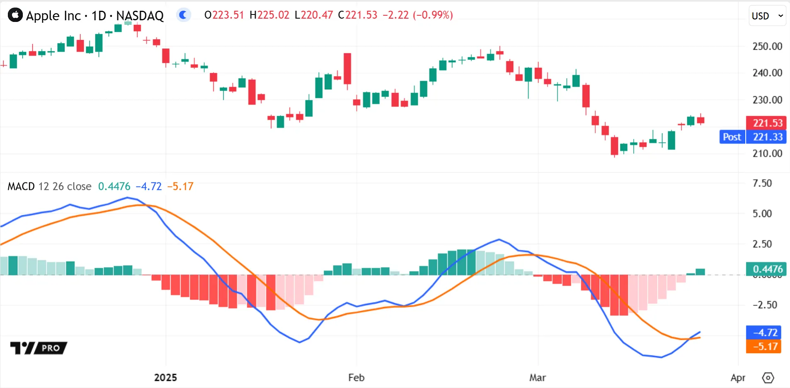

Scripts can also use [plot()](../../reference manual/functions/plot.md) to create horizontal [levels](../2. Visuals/visuals_plots.md#levels) in cases where the dedicated [hline()](../../reference manual/functions/hline.md) function is not suitable, for example, to display a dynamically-calculated level, or to create a [fill](../2. Visuals/visuals_fills.md#plot-and-hline-fills) between a horizontal line and a fluctuating series.

Unlike [\`plotshape()\` and \`plotchar()\`](../2. Visuals/visuals_overview.md#plotshape-and-plotchar), the [plot()](../../reference manual/functions/plot.md) function cannot display text and doesn’t support “bool” series. However, it can create [conditional plots](../2. Visuals/visuals_plots.md#plotting-conditionally) by setting the plot’s series values or colors to [na](../../reference manual/variables/na.md) on certain bars.

### [​`plotshape()`​ and ​`plotchar()`​](../2. Visuals/visuals_overview.md#plotshape-and-plotchar)

The [plotshape()](../../reference manual/functions/plotshape.md) and [plotchar()](../../reference manual/functions/plotchar.md) functions plot a series across the chart, like [plot()](../../reference manual/functions/plot.md), but using a wide range of shapes and characters.

The [plotshape()](../../reference manual/functions/plotshape.md) function displays specific `shape.*` styles like crosses, circles, and triangles, while [plotchar()](../../reference manual/functions/plotchar.md) displays any single alphanumeric or symbol Unicode character. See the table in the [\`plotshape()\`](../2. Visuals/visuals_text-and-shapes.md#plotshape) section of the [Text and shapes](../2. Visuals/visuals_text-and-shapes.md) page for all available `shape.*` styles.

Like other [plot visuals](../2. Visuals/visuals_overview.md#plot-visuals), these plots are connected to the main series. They produce one plot value per bar, which can also appear in the status line and Data Window. Both functions accept “int” and “float” series, like [plot()](../../reference manual/functions/plot.md), and additionally support “bool” series to display conditional plots.

For instance, the built-in [Moon phases](https://www.tradingview.com/support/solutions/43000599884-moon-phases/) indicator uses [plotshape()](../../reference manual/functions/plotshape.md) to conditionally draw circles above or below the chart bars, which represent when a new or full moon occurs:

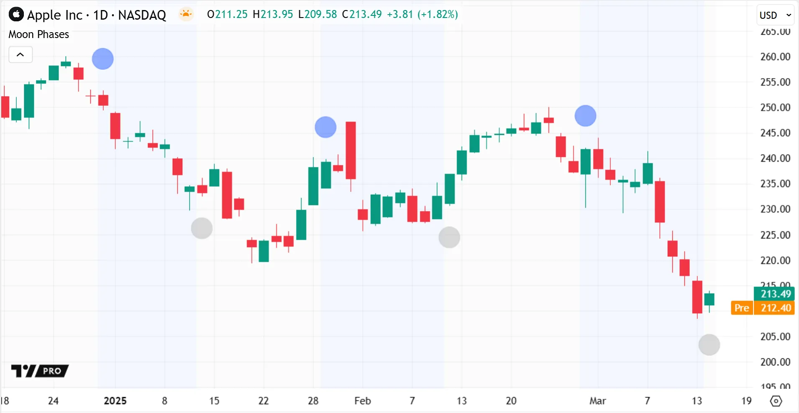

Both [plotshape()](../../reference manual/functions/plotshape.md) and [plotchar()](../../reference manual/functions/plotchar.md) have several `location` options, which can use either _relative_ or _absolute_ chart positions:

- They can plot graphics at _absolute_ price positions, corresponding to each `series` value.
- They can position graphics _near each bar_ in the main series, either above or below the bars.
- They can anchor graphics to the _pane_ itself, either at the top or bottom of the pane.

The Moon Phases indicator above uses [location.abovebar](../../reference manual/constants/location.abovebar.md) and [location.belowbar](../../reference manual/constants/location.belowbar.md) arguments to position the circle plots _near_ each bar at an automatic, consistent distance, regardless of the bar’s price fluctuation or the [plotshape()](../../reference manual/functions/plotshape.md)`series` value.

Relative positioning also makes [plotchar()](../../reference manual/functions/plotchar.md) and [plotshape()](../../reference manual/functions/plotshape.md) useful for [debugging](../4. Writing_Scripts/writing_debugging.md#plotting-and-coloring-conditions) numeric values or conditions. These functions can plot `series` values at a different scale than the chart bars without interfering with the chart scale, unlike [plot()](../../reference manual/functions/plot.md) series. Hovering over a bar can verify its numeric `series` value in the status line or Data Window — these locations show `0` as the numeric result if there is no visual marker on this particular bar. The functions do not display a visual marker when the `series` value is `false` or [na](../../reference manual/variables/na.md), and they also hide the marker for a `0` value in “int”/“float” series when using relative positioning.

For example, suppose we have a script overlayed in the main pane, and part of its logic generates an “int” series of `0` or `1` values based on some `testCondition`. Using [plotchar()](../../reference manual/functions/plotchar.md) with a relative `location` argument quickly verifies that the condition occurs where expected as the function plots a visual marker _only_ when the `series` value is `1`. Otherwise, plotting with the absolute `series` locations would distort the main price scale to accommodate a marker appearing on _every_ bar at the low price levels `0.00` and `1.00`:

```pine
//@variable An "int" series where the value is either `0` or `1`.
int mySeries = testCondition ? 1 : 0

// To verify `mySeries`, plot a "!" character at the bottom of the pane only if `mySeries` is `1`.
plotchar(mySeries, "Debugging series", "!", location = location.bottom)
```

The [plotshape()](../../reference manual/functions/plotshape.md) and [plotchar()](../../reference manual/functions/plotchar.md) functions can also display text alongside their shapes. Unlike for [labels](../2. Visuals/visuals_overview.md#labels), the string must be of type “const”, so the value cannot be dynamic and cannot represent series: the _same_ text appears for all the points in the plot.

### [​`plotarrow()`​](../2. Visuals/visuals_overview.md#plotarrow)

Similar to [\`plotshape()\` and \`plotchar()\`](../2. Visuals/visuals_overview.md#plotshape-and-plotchar), the [plotarrow()](../../reference manual/functions/plotarrow.md) function plots a series across the chart that presents graphic information using an arrow shape.

A single [plotarrow()](../../reference manual/functions/plotarrow.md) call plots an arrow on every bar, setting each arrow’s direction, position, and length based on the bar’s value in the plot `series`. Like other [plot visuals](../2. Visuals/visuals_overview.md#plot-visuals), an arrow’s numeric value can also display in the script’s status line and Data Window.

The [plotarrow()](../../reference manual/functions/plotarrow.md) function is useful for visualizing changes in the directionality and magnitude of “int” or “float” series values across the chart. The underlying `series` can be at a different scale than the chart bars without visually distorting the main chart scale.

Unlike [plotchar()](../../reference manual/functions/plotchar.md) or [plotshape()](../../reference manual/functions/plotshape.md), the [plotarrow()](../../reference manual/functions/plotarrow.md) function cannot display text and doesn’t accept “bool” series. However, the function can still achieve a conditional arrow plot by using [na](../../reference manual/variables/na.md) values for its `series` on certain bars.

This simple example indicator uses [plotarrow()](../../reference manual/functions/plotarrow.md) to visualize a `barGap` series, where each arrow represents the price difference between the current bar’s [open](../../reference manual/variables/open.md) and the previous bar’s [close](../../reference manual/variables/close.md). The function call automatically sets the locations of all the arrows, plotting positive-value arrows below bars and negative-value arrows above bars, and adjusts their lengths relative to the other values in the `barGap` series:

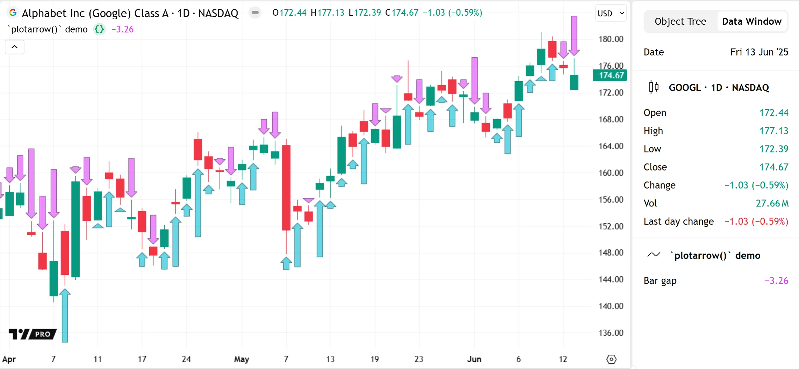

```pine
//@version=6
indicator("`plotarrow()` demo", overlay = true)

//@variable The difference between the current `open` and previous `close`.
float barGap = open - close[1]
plotarrow(barGap, "Bar gap", color.rgb(0, 187, 212, 40), color.rgb(223, 64, 251, 40))
```

### [​`plotbar()`​ and ​`plotcandle()`​](../2. Visuals/visuals_overview.md#plotbar-and-plotcandle)

The [plotbar()](../../reference manual/functions/plotbar.md) and [plotcandle()](../../reference manual/functions/plotcandle.md) functions create custom bar or candle sets on the chart. One call to either function registers four values — the bar or candle’s `open`, `high`, `low`, and `close` values — on every bar of the main chart series. As a result, a single [plotbar()](../../reference manual/functions/plotbar.md) or [plotcandle()](../../reference manual/functions/plotcandle.md) call generates _at least four_ plots counting towards a script’s total [plot limit](../4. Writing_Scripts/writing_limitations.md#plot-limits).

Indicators can use these functions to plot a new series separate from the main series, or to build new visuals for the main series itself, like the built-in [Bollinger Bars](https://www.tradingview.com/support/solutions/43000742575-bollinger-bars/) indicator does to create candles with thicker wicks:

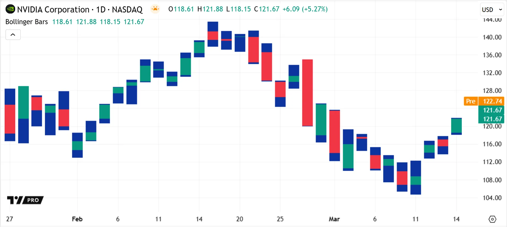

As with other [plot visuals](../2. Visuals/visuals_overview.md#plot-visuals), the [plotbar()](../../reference manual/functions/plotbar.md) and [plotcandle()](../../reference manual/functions/plotcandle.md) outputs can display in other locations: their numeric results in the script’s status line and Data Window (four values per plot) and their latest `close` value on the price scale.

See the [Bar plotting](../2. Visuals/visuals_bar-plotting.md) page for more information about these functions.

### [Horizontal levels](../2. Visuals/visuals_overview.md#horizontal-levels)

The [hline()](../../reference manual/functions/hline.md) function creates a [horizontal level](../2. Visuals/visuals_levels.md) across the script pane at a defined price. The horizontal level extends fully across the visible space of the chart in both directions.

Unlike other [plot visuals](../2. Visuals/visuals_overview.md#plot-visuals), a horizontal level’s only output is the line drawn in the script pane; it does not display values in the status line, price scale, or Data Window.

This visual element is useful for displaying minimum or maximum prices, thresholds, or support and resistance levels. Many built-in indicators like [RSI](https://www.tradingview.com/support/solutions/43000502338-relative-strength-index-rsi/), [CCI](https://www.tradingview.com/support/solutions/43000502001-commodity-channel-index-cci/), and [Stochastic](https://www.tradingview.com/support/solutions/43000502332-stochastic-stoch/) use horizontal levels to represent fixed boundaries for oscillator plots. For example, in the RSI indicator, the horizontal levels are upper and lower bands that represent the oversold and overbought boundaries:

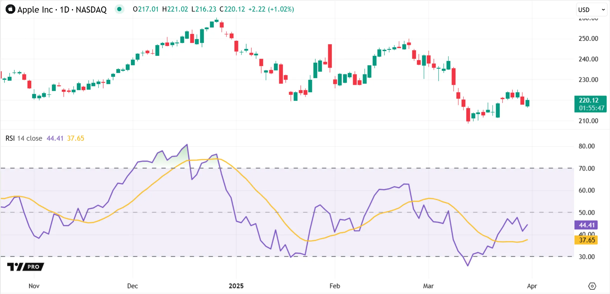

Some built-in indicators also use horizontal levels with [fills](../2. Visuals/visuals_fills.md#plot-and-hline-fills) to create colored bands, which can help to visually distinguish the typical value ranges from outlier ranges, as seen above.

A horizontal level uses a _single, fixed_ price value, so it cannot use a dynamically-calculated value or a “series” type like [close](../../reference manual/variables/close.md). Instead, scripts can use [plot()](../../reference manual/functions/plot.md) to produce similar horizontal lines for dynamically-calculated [levels](../2. Visuals/visuals_plots.md#levels).

Because an [hline()](../../reference manual/functions/hline.md) call plots only a fixed level in a single color, it is often more performant than similar [plot()](../../reference manual/functions/plot.md) lines. Adding a horizontal level does not count towards a script’s [plot limit](../4. Writing_Scripts/writing_limitations.md#plot-limits) because the [hline()](../../reference manual/functions/hline.md) function doesn’t create a plot series internally or externally to generate its visual output.

### [Background and bar coloring](../2. Visuals/visuals_overview.md#background-and-bar-coloring)

The [bgcolor()](../../reference manual/functions/bgcolor.md) function sets the [background color](../2. Visuals/visuals_backgrounds.md) of the chart space behind a bar, while the [barcolor()](../../reference manual/functions/barcolor.md) function sets the [body color](../2. Visuals/visuals_bar-coloring.md) of a candle.

The functions accept both [constant colors](../2. Visuals/visuals_colors.md#constant-colors) and dynamically-calculated colors, so they can use [conditional coloring](../2. Visuals/visuals_colors.md#conditional-coloring) for bars or backgrounds. For instance, the built-in [Moon Phases](https://www.tradingview.com/support/solutions/43000599884-moon-phases/) indicator uses [bgcolor()](../../reference manual/functions/bgcolor.md) to conditionally set the background color of the bars to highlight waxing and waning moon phases:


A [bgcolor()](../../reference manual/functions/bgcolor.md) call, like most visuals, affects the _script pane_ by default. It sets the background color behind the main bar series only when it’s overlayed in the main pane — when `overlay = true` for the script or `force_overlay = true` for [bgcolor()](../../reference manual/functions/bgcolor.md) — otherwise it sets the background for the equivalent space in a separate pane.

By contrast, the [barcolor()](../../reference manual/functions/barcolor.md) function **always** colors the main bar series in the _main_ pane, even when called by a script executing in a separate pane.

As [barcolor()](../../reference manual/functions/barcolor.md) only affects the main chart series, scripts cannot use it to alter the colors of new bars or candles created using [plotbar()](../../reference manual/functions/plotbar.md) or [plotcandle()](../../reference manual/functions/plotcandle.md).

This simple example uses arbitrary [bar\_index](../../reference manual/variables/bar_index.md) and price conditions to set conditional background and bar colors:

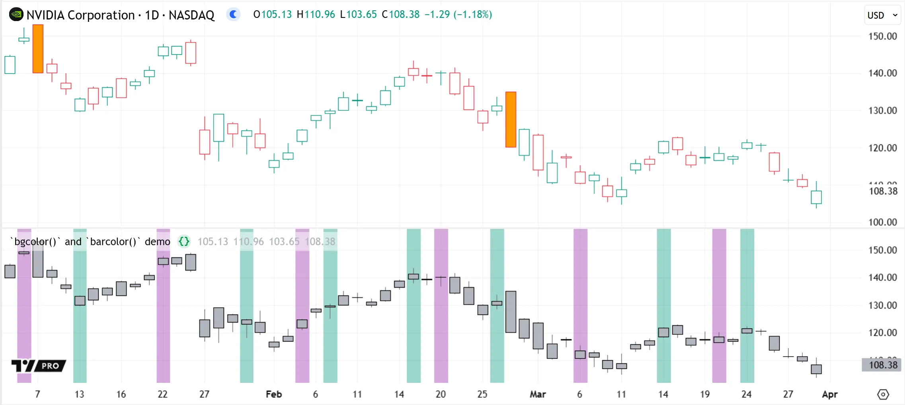

```pine
//@version=6
indicator("`bgcolor()` and `barcolor()` demo")

// Plot a new candle series for this script, separate to the main pane. Candles are set to main series OHLC values.
plotcandle(open, high, low, close, color = color.silver)

// Set the background color of the script pane. Color is set conditionally depending on divisibility of `bar_index` by 10 or 6.
bgcolor(bar_index % 10 == 0 ? color.new(color.purple, 60) : bar_index % 6 == 0 ? color.new(color.teal, 60) : na)

// Set the bar color for the main series. Although script executes in a separate pane, this call executes on the main pane.
// Bar's body color is set conditionally to highlight bars with price move of 10 or more.
barcolor(math.abs(close - open) >= 10  ? color.orange : color.white)
```

Note that:

- The script executes in a separate pane, but the [barcolor()](../../reference manual/functions/barcolor.md) function colors the main series.
- The [barcolor()](../../reference manual/functions/barcolor.md) call does _not_ affect the new candles plotted in the script pane.

### [Fills](../2. Visuals/visuals_overview.md#fills)

Scripts can use [fills](../2. Visuals/visuals_fills.md#plot-and-hline-fills) to set the background color of the space between a pair of [plots](../2. Visuals/visuals_plots.md) or [horizontal levels](../2. Visuals/visuals_levels.md). The [fill()](../../reference manual/functions/fill.md) function accepts both constant and dynamically-calculated colors. There is also a [fill()](../../reference manual/functions/fill-2.md) function overload that can create color gradient fills.

Fills between plots are commonly used in built-in indicators to visualize calculated channels or bands, like those used in the [Bollinger Bands](https://www.tradingview.com/support/solutions/43000501840-bollinger-bands-bb/) indicator, which signify the upper and lower standard deviations from its [SMA](https://www.tradingview.com/support/solutions/43000696841/) line:

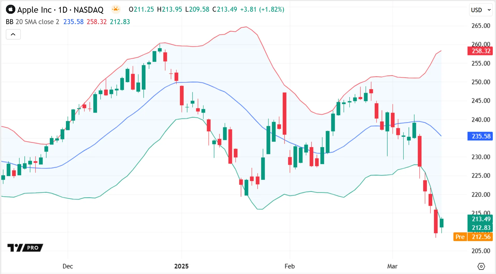

Fills between horizontal levels are often used in built-in oscillators to highlight chart regions of interest or to differentiate between typical and outlier ranges. For example, the [Stochastic Momentum Index (SMI)](https://www.tradingview.com/support/solutions/43000707882-stochastic-momentum-index-smi/) indicator fills the background between horizontal levels that signify overbought and oversold boundaries, which can help easily identify signs of bullish or bearish trends beyond the filled regions:

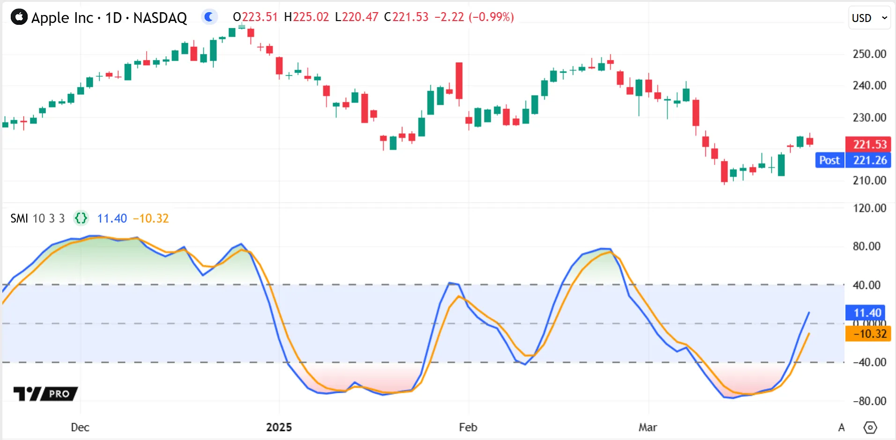

The SMI indicator also uses the [fill()](../../reference manual/functions/fill-2.md) function’s color gradient overload to gradually color the space within the plot lines green or red as they enter the overbought or oversold zones respectively.

Other Pine visuals have their own dedicated fills, like [linefills](../2. Visuals/visuals_fills.md#line-fills) for setting the fill color between two [lines](../2. Visuals/visuals_lines-and-boxes.md#lines), and built-in fill color arguments for drawing objects like [boxes](../2. Visuals/visuals_lines-and-boxes.md#boxes) and [polylines](../2. Visuals/visuals_lines-and-boxes.md#polylines). See the [Fills](../2. Visuals/visuals_fills.md) page for more information about the different fill mechanisms available.

### [Lines and polylines](../2. Visuals/visuals_overview.md#lines-and-polylines)

Scripts can draw [lines](../2. Visuals/visuals_lines-and-boxes.md#lines) to visually connect any two points on the chart horizontally, vertically, or diagonally.

Like other [drawing visuals](../2. Visuals/visuals_overview.md#drawing-visuals), lines are independent from the main series, so scripts can draw them at any available chart locations from any bar.

Programmers can specify a line’s start and end coordinates using any of the following:

- A [bar\_index](../../reference manual/variables/bar_index.md) x-coordinate and price y-coordinate.
- A [UNIX timestamp](../1. Concepts/concepts_time.md#unix-timestamps) x-coordinate and price y-coordinate.
- A [chart point](../3. Language/language_type-system.md#chart-points) object, where the x-coordinate is a bar index or time value.

Lines can also extend to the left or right of the chart, like those used in the built-in [Auto Fib Extension](https://www.tradingview.com/support/solutions/43000612397-auto-fib-extension/) indicator to visualize projected price levels:

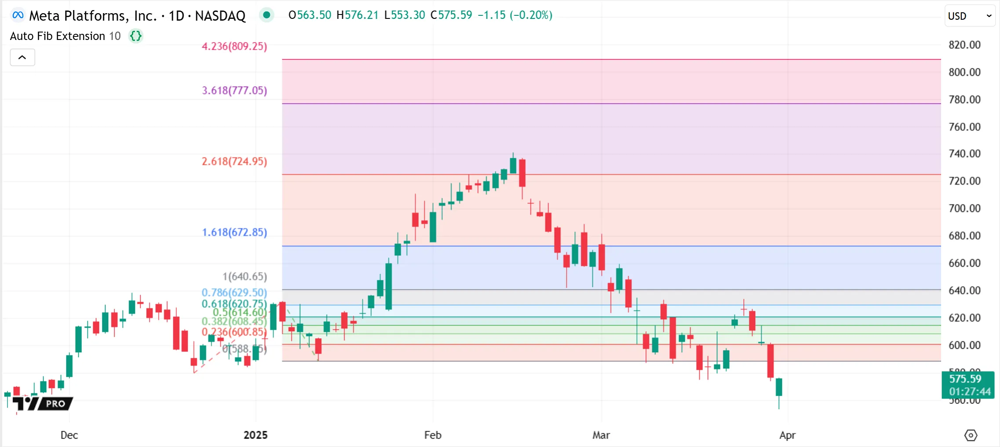

Scripts can specify line coordinates at dynamic offsets from the bars on which they’re calculated, to draw lines at varying lengths and distances. For instance, the built-in [Zig Zag](https://www.tradingview.com/support/solutions/43000591664-zig-zag/) indicator draws straight, angled lines to connect calculated high and low pivots alternatingly across the chart, connecting the last leg to the last available bar. The indicator confirms a point as a high/low pivot only when the price reverses by a specified percentage over time. Therefore, it always draws its lines _into the past_ from a different bar than that of the pivot point, and the number of bars between two sequential pivots is not predictable or consistent:

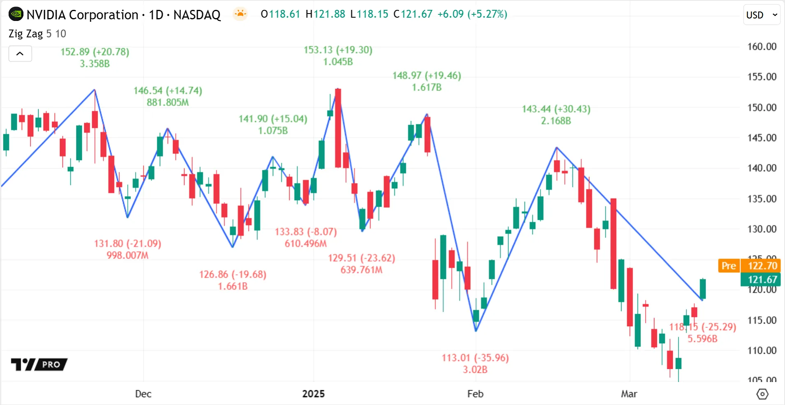

While a [line](../../reference manual/types/line.md) object can connect only two points with a straight line, a [polyline](../2. Visuals/visuals_lines-and-boxes.md#polylines) can connect _multiple_ points on the chart consecutively to create a straight or _curved_ line drawing. A polyline uses an [array](../3. Language/language_arrays.md) of [chart points](../3. Language/language_type-system.md#chart-points) to set the coordinates of its sequential line segments, which can contain up to 10,000 chart points.

Polylines can create more complex graphic formations than lines or [boxes](../2. Visuals/visuals_lines-and-boxes.md#boxes). A script can connect chart points together with [closed polylines](../2. Visuals/visuals_lines-and-boxes.md#closed-shapes) to draw polygons, or leave them open-ended to draw geometric series across the chart. Scripts can also use open-ended, curved polylines to draw chart patterns like the [Cup and Handle](https://www.tradingview.com/support/solutions/43000732556-chart-pattern-cup-and-handle/) pattern, which identifies a U-shape price trend that is difficult to produce with other drawing visuals:

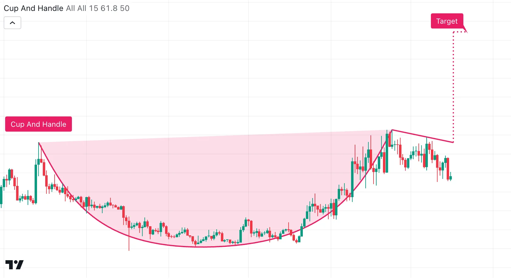

A script can replicate the visuals made by drawing several sequential [line](../../reference manual/types/line.md) objects with just one [polyline](../../reference manual/types/polyline.md) object instead. Using polylines can thus help a script to stay under the [limits](../4. Writing_Scripts/writing_limitations.md#line-box-polyline-and-label-limits) for the total number of lines.

For example, we can use a simplified version of the [Zig Zag](https://www.tradingview.com/support/solutions/43000591664-zig-zag/) indicator’s logic to illustrate this. Here, we use one polyline drawing to connect pivot points across the chart. The script stores the high and low pivots together in one [chart.point](../../reference manual/types/chart.point.md) array, and creates the [polyline](../../reference manual/types/polyline.md) object only on the last confirmed historical bar, using [barstate.islastconfirmedhistory](../../reference manual/variables/barstate.islastconfirmedhistory.md), drawing it retrospectively across the chart:

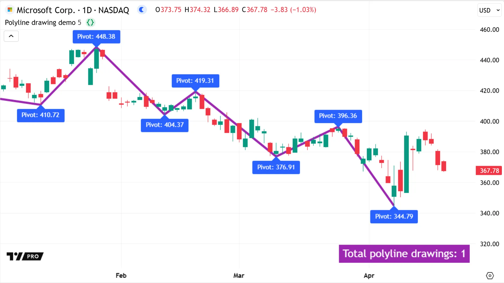

```pine
//@version=6
indicator("Polyline drawing demo", overlay = true)

//@variable The left and right strength of the pivot.
int pivotLegsInput = input.int(5, "Pivot leg length", minval = 1)
//@variable Switches the `polyline` drawing to a straight or curved line drawing.
bool isCurvedPolyline = input.bool(false, "Use curved polyline")

//@variable A persistent array that stores high and low pivots for the polyline.
var array<chart.point> pointsArray = array.new<chart.point>()
// Calculate the high and low pivot prices using `ta.pivot*()` functions.
float pivotHigh = ta.pivothigh(pivotLegsInput, pivotLegsInput)
float pivotLow = ta.pivotlow(pivotLegsInput, pivotLegsInput)
// Add all high and low pivot points sequentially to `pointsArray`, and draw labels at pivots to show prices.
if not na(pivotHigh)
    chart.point highPoint = chart.point.from_index(bar_index - pivotLegsInput, pivotHigh)
    pointsArray.push(highPoint)
    label.new(highPoint, "Pivot: " + str.tostring(pivotHigh, "##.##"))
if not na(pivotLow)
    chart.point lowPoint = chart.point.from_index(bar_index - pivotLegsInput, pivotLow)
    pointsArray.push(lowPoint)
    label.new(lowPoint, "Pivot: " + str.tostring(pivotLow, "##.##"), style = label.style_label_up)

// On the last confirmed bar, draw a polyline across the chart to connect all pivots in `pointsArray`.
if barstate.islastconfirmedhistory
    // First, remove chart points that are too far from the current bar, to prevent errors.
    // Iterate backwards to avoid index shifting issues when removing items.
    for i = (pointsArray.size() - 1) to 0
        chart.point point = pointsArray.get(i)
        if (bar_index - point.index) > 9999
            pointsArray.remove(i)

    polyline.new(pointsArray, curved = isCurvedPolyline, line_color = color.purple, line_width = 4)
    // For reference, display the total number of polyline drawings created by the script in a table cell on the chart.
    table displayTable = table.new(position.bottom_right, 1, 1, color.purple)
    displayTable.cell(0, 0, "Total polyline drawings: " + str.tostring(array.size(polyline.all)),
         text_color = color.white, text_size = size.large)
```

Note that:

- To avoid [runtime errors](../6. FAQ/faq_techniques.md#how-can-i-prevent-the-bar-index-value-of-the-x-argument-is-too-far-from-the-current-bar-index-try-using-time-instead-and-objects-positioned-using-xlocbar_index-cannot-be-drawn-further-than-x-bars-into-the-future-errors) due to the polyline trying to draw points more than approximately 9999 bars back from the current bar, one alternative is to use [chart.point.from\_time()](../../reference manual/functions/chart.point.from_time.md) to set x-coordinates with [UNIX timestamps](../1. Concepts/concepts_time.md#unix-timestamps). Here, we instead use a [loop](../3. Language/language_loops.md) to remove [chart.point](../../reference manual/types/chart.point.md) objects that are too far from the current bar, before drawing the polyline. Note that to accurately remove more than one element from an array using a loop, scripts must iterate _backwards_ through the array.
- A polyline’s `curved` parameter accepts a “series” argument, so scripts can use [Boolean inputs](../1. Concepts/concepts_inputs.md#boolean-input) like `isCurvedPolyline` in our example to easily switch between straight or curved line drawings from an indicator’s settings.

Scripts can fill the closed space of a polyline drawing using the [polyline.new()](../../reference manual/functions/polyline.new.md) function’s `fill_color` parameter. To fill the space between two [lines](../2. Visuals/visuals_lines-and-boxes.md#lines) with a specified color, use linefill objects, which are described in the next section.

### [Linefills](../2. Visuals/visuals_overview.md#linefills)

A [linefill](../2. Visuals/visuals_fills.md#line-fills) is a [drawing object](../3. Language/language_type-system.md#drawing-types), unlike the [fills](../2. Visuals/visuals_overview.md#fills) for plots and horizontal levels. Calling the [linefill.new()](../../reference manual/functions/linefill.new.md) function instantiates an _object_ of type “linefill”. Scripts can store linefill objects and manipulate them with functions, e.g., to set the associated fill color or retrieve the pair of lines.

Similar to plot fills, linefills are useful for highlighting regions of interest, like calculated channels or trend zones, between two lines on the chart. For example, the built-in [Linear Regression](https://www.tradingview.com/support/solutions/43000644936-linear-regression/) indicator uses two linefills between its baseline and its support and resistance lines, which signify the expected price movement ranges. Highlighting the upper and lower channels can make it easier to visually register the price reversal signals:

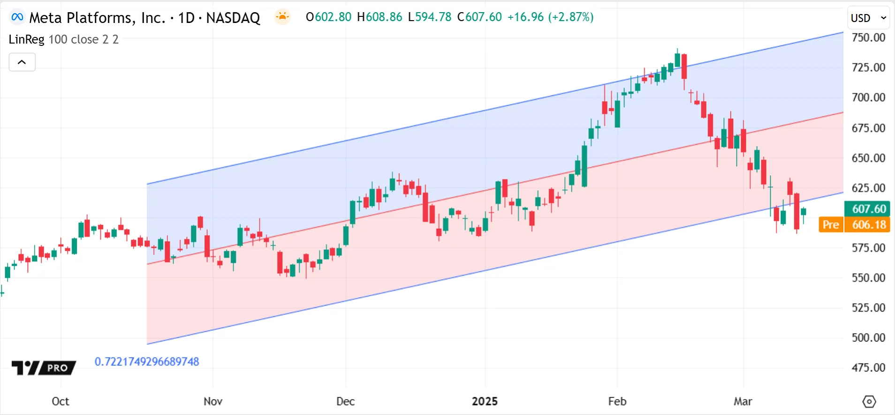

The exact dimensions occupied by a linefill object are defined by the pair of lines it’s attached to. Moving one line farther away, for example, automatically widens the attached linefill. Only one linefill instance can exist between a pair of lines, and it covers only the common space between them. If a pair of lines both extend in the same direction, the linefill can also extend infinitely, as seen in the [Auto Pitchfork](https://www.tradingview.com/support/solutions/43000657911-auto-pitchfork/) indicator:

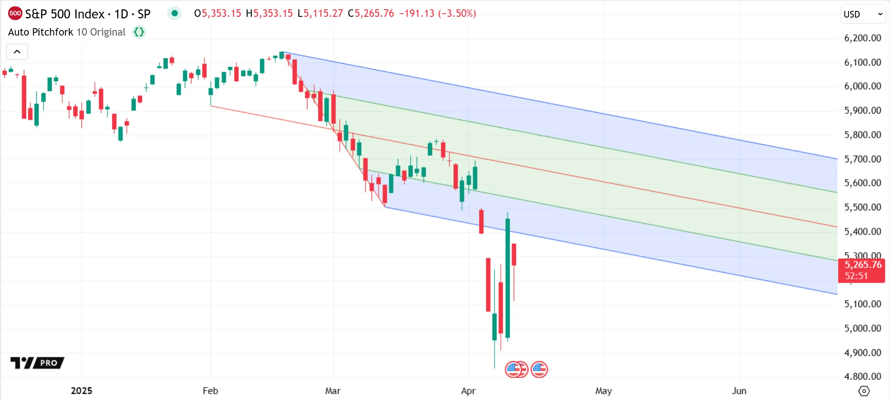

Linefills can fill the space only between two “line” objects. For [polylines](../2. Visuals/visuals_lines-and-boxes.md#polylines), the [polyline.new()](../../reference manual/functions/polyline.new.md) function has a `fill_color` parameter to fill the polyline drawing’s closed space.

### [Boxes](../2. Visuals/visuals_overview.md#boxes)

Scripts can use [boxes](../2. Visuals/visuals_lines-and-boxes.md#boxes) to create custom rectangle drawings on the chart. Like other [drawing visuals](../2. Visuals/visuals_overview.md#drawing-visuals), a box is a flexible object type, not a series visual, so a script can draw multiple boxes on the same bar, and can set box coordinates at any allowed chart locations ahead or behind the current bar.

Programmers can specify box coordinates using either two diagonal corner points or all four edges of the box, and can define the x-coordinates using [bar\_index](../../reference manual/variables/bar_index.md) or [UNIX timestamp](../1. Concepts/concepts_time.md#unix-timestamps) values.

Boxes can be useful for highlighting chart areas of interest, showing price ranges, or visually grouping bars. For example, the built-in [Multi-time period charts](https://www.tradingview.com/support/solutions/43000502591-multi-time-period-charts/) indicator overlays boxes on the current chart to visualize the corresponding higher timeframe candles:

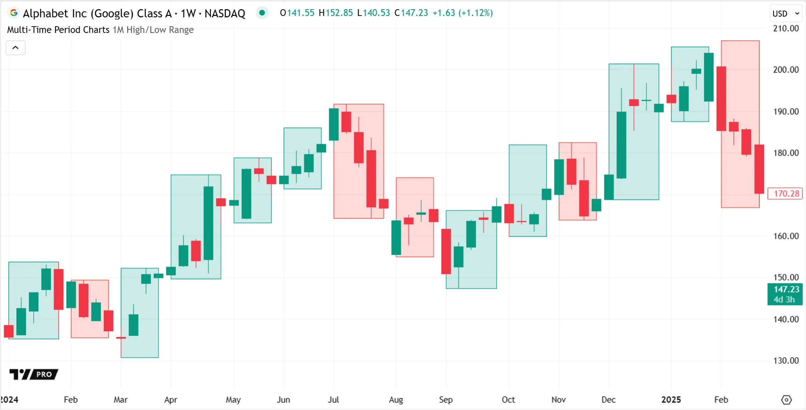

Boxes can also display text as part of their drawings, as shown in the [Seasonality](https://www.tradingview.com/support/solutions/43000723025-seasonality/) indicator below. Scripts can customize a box’s [text formatting](../2. Visuals/visuals_text-and-shapes.md#text-formatting), alignment, and wrapping, with auto-scaling and auto-wrapping options available to design boxes that are responsive to a user’s chart adjustments:

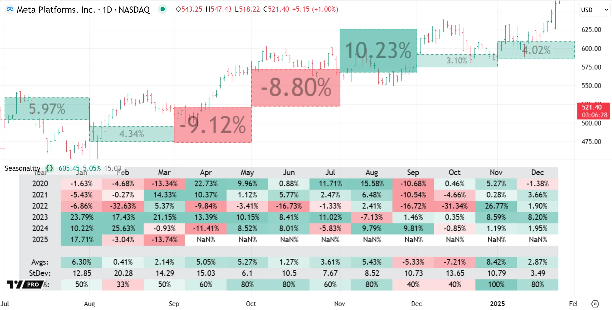

### [Labels](../2. Visuals/visuals_overview.md#labels)

[Labels](../2. Visuals/visuals_text-and-shapes.md#labels) are drawing objects that can display dynamic text on the chart. They accept “series string” arguments, so they can use changeable text values that aren’t known at the start of execution, like [inputs](../1. Concepts/concepts_inputs.md) or conditionally-calculated expressions, unlike the text displayed by [\`plotshape()\` and \`plotchar()\`](../2. Visuals/visuals_overview.md#plotshape-and-plotchar).

Scripts can manage labels in local scopes and draw them at historical or future positions, like other [drawing visuals](../2. Visuals/visuals_overview.md#drawing-visuals). Each label’s position is anchored to the chart’s x and y scales at a specific price and bar/time value. However, this position is flexible, as a script can modify a label’s coordinates any number of times.

In the built-in [Zig Zag](https://www.tradingview.com/support/solutions/43000591664-zig-zag/) indicator, text labels display the calculated pivot prices and, depending on the selected inputs, can also display the reversal price and cumulative volume data within these same labels. The indicator takes advantage of several dynamic label features when building the concatenated label text and setting each label’s high/low position, color, and variable offset:

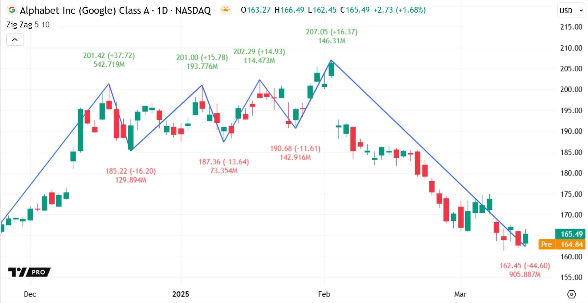

Many `label.style_*` options are available to customize a label’s visual appearance, including standard pointing labels and shape-based labels like crosses, triangles, arrows, or flags. The indicator above uses the [label.style\_none](../../reference manual/constants/label.style_none.md) style to display the text on the chart without a visible label shape or outline. See the table in the [positioning labels](../2. Visuals/visuals_text-and-shapes.md#positioning-labels) section of the [Text and shapes](../2. Visuals/visuals_text-and-shapes.md) page for all available label styles.

The versatility of labels also makes them particularly useful for [debugging](../4. Writing_Scripts/writing_debugging.md#labels) scripts. A label can easily show calculated numeric values, strings, or test conditions directly on the chart with little extra code. Scripts can even display empty labels without text to create quick visual markers, for example, to verify that conditions occur on their expected bars.

### [Tables](../2. Visuals/visuals_overview.md#tables)

[Tables](../2. Visuals/visuals_tables.md) are special drawing objects useful for displaying customized, organized information that isn’t connected to the chart’s price or bar scales.

Tables are anchored to the _pane space_ itself, not to any x or y chart coordinates. As such, they remain fixed in size and position when zooming into or scrolling across the chart, even if they are overlayed in the main pane. Like other [drawing visuals](../2. Visuals/visuals_overview.md#drawing-visuals), tables do not change the data they display when the user hovers over different bars.

Scripts can draw tables in one of _nine_ fixed pane positions, specified by the `top`, `middle`, or `bottom` vertical region of the pane and the corresponding `left`, `center`, or `right` horizontal region:

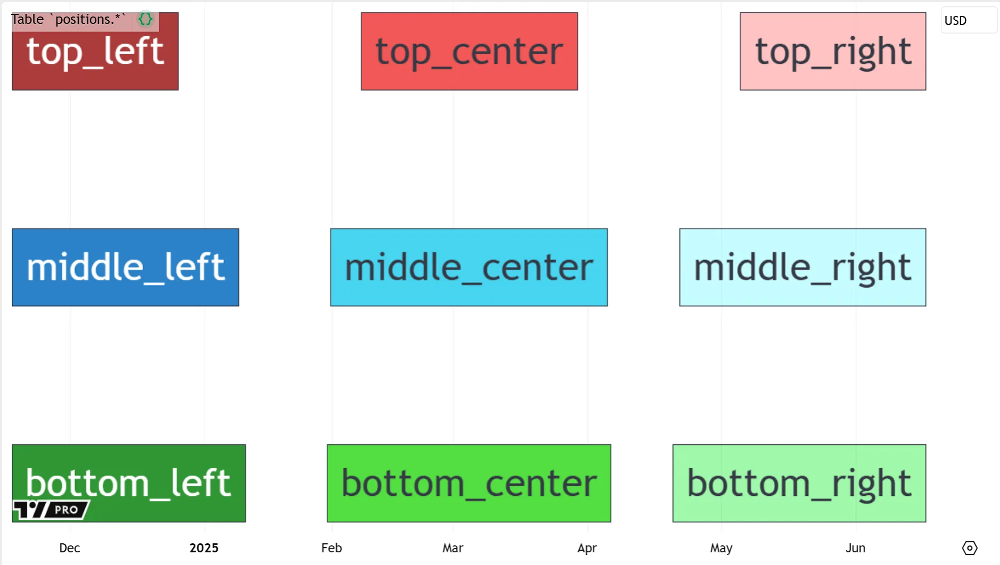

If a script displays more than one table in the same location, the table that is drawn latest in the code replaces any previous tables.

Similar to other drawings, tables have various features that scripts can modify during execution using setter functions. These include _table-specific_ features like the frame, border, and height/width in the pane, as well as _cell-specific_ features like background color, alignment, and [text formatting](../2. Visuals/visuals_text-and-shapes.md#text-formatting).

A customization feature unique to tables is that, within the same table object, _each cell_ can have different visual properties.

For example, the built-in [Performance](https://www.tradingview.com/support/solutions/43000736064-performance/) indicator shows the price percentage change at multiple timeframes for a group of symbols. It uses a variable color intensity for the cell background colors to represent each value’s absolute strength. The tabular format and dynamic cell colors make it easy to compare values across symbols and timeframes at a glance:

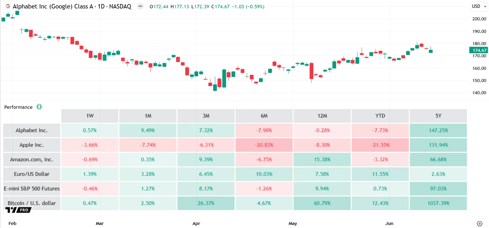

Unlike for [lines](../2. Visuals/visuals_lines-and-boxes.md#lines), [boxes](../2. Visuals/visuals_lines-and-boxes.md#boxes), and [labels](../2. Visuals/visuals_text-and-shapes.md#labels), scripts **cannot** use getter functions to retrieve properties for tables drawn on the chart. To refer to an attribute of a table later in a script, first store the value in a separate variable.

The Performance indicator above draws its table only _once_ during initial execution, on the last bar. This improves script performance and is recommended because a table only displays its _last state_. Tables are thus useful for displaying annotations or general information that won’t change during execution, like selected settings, release notes, misconfigurations, etc.

The following example script displays labels for the start and end of each daily trading session. As such, it supports only intraday data and does not display any labels on a “1D” timeframe or higher. The script displays a single-cell table if [timeframe.isdwm](../../reference manual/variables/timeframe.isdwm.md) is true, to notify users of this information:

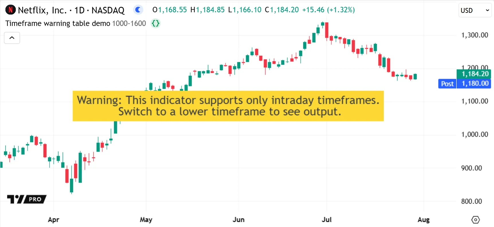

```pine
//@version=6
indicator("Timeframe warning table demo", overlay = true, max_labels_count = 500, behind_chart = false)

// Input for the trading session (e.g., "0930-1600" for US stocks regular hours)
sessionInput = input.session("0930-1600", "Trading Session")

// Display `warningTable` on last bar if the chart timeframe is not intraday.
if barstate.islastconfirmedhistory and timeframe.isdwm
    //@variable A single-cell `table` that inform users about the unsupported timeframe.
    var table warningTable = table.new(position.middle_center, 1, 1, color.yellow)
    warningTable.cell(0, 0,
         "Warning: This indicator supports only intraday timeframes.\n Switch to a lower timeframe to see output.",
         text_size = size.large)

// Plot a label at the opening price when the session starts
if timeframe.isintraday and na(time("", sessionInput)[1]) and not na(time("", sessionInput))
    label.new(bar_index, open, "Session Open: " + str.tostring(open, "#.##"), yloc = yloc.abovebar,
      color = color.green, style = label.style_label_down)

// Plot a label at the closing price on the last bar of the session
if timeframe.isintraday and not na(time("", sessionInput)[1]) and na(time("", sessionInput))
    label.new(bar_index[1], close[1], "Session Close: " + str.tostring(close[1], "#.##"), yloc = yloc.belowbar,
      color = color.red, style = label.style_label_up)
```

Note that:

- Using a table in this case ensures that users clearly see the warning, because it appears directly in the chart pane regardless of how their chart is scaled.

Lastly, a table’s organized format and fixed pane positions also makes it useful for debugging scripts. See the [Tables](../4. Writing_Scripts/writing_debugging.md#tables) section of the [Debugging](../4. Writing_Scripts/writing_debugging.md) page for more details.

[Next 
**Backgrounds**](../2. Visuals/visuals_backgrounds.md)