# [Text and shapes](../2. Visuals/visuals_text-and-shapes.md#text-and-shapes)

## [Introduction](../2. Visuals/visuals_text-and-shapes.md#introduction)

Pine Script® features five different ways to display text or shapes on the chart:

- [plotchar()](../../reference manual/functions/plotchar.md)
- [plotshape()](../../reference manual/functions/plotshape.md)
- [plotarrow()](../../reference manual/functions/plotarrow.md)
- Labels created with
[label.new()](../../reference manual/functions/label.new.md)
- Tables created with
[table.new()](../../reference manual/functions/table.new.md)
(see [Tables](../2. Visuals/visuals_tables.md))

Which one to use depends on your needs:

- Tables can display text in various relative positions on a chart, which
do not move as users zoom in or scroll the chart horizontally. Their
content is not tethered to bars. In contrast, text displayed with
[plotchar()](../../reference manual/functions/plotchar.md),
[plotshape()](../../reference manual/functions/plotshape.md)
or
[label.new()](../../reference manual/functions/label.new.md)
is always tethered to a specific bar, so it will move with the
bar’s position on the chart. See the page on
[Tables](../2. Visuals/visuals_tables.md) for more
information on them.
- Three elements can display pre-defined shapes:
[plotshape()](../../reference manual/functions/plotshape.md),
[plotarrow()](../../reference manual/functions/plotarrow.md)
and labels created with
[label.new()](../../reference manual/functions/label.new.md).
- [plotarrow()](../../reference manual/functions/plotarrow.md)
cannot display text, only up or down arrows.
- [plotchar()](../../reference manual/functions/plotchar.md)
and
[plotshape()](../../reference manual/functions/plotshape.md)
can display non-dynamic text on any bar or all bars of the chart.
- [plotchar()](../../reference manual/functions/plotchar.md)
can only display one character while
[plotshape()](../../reference manual/functions/plotshape.md)
can display strings, including line breaks.
- [label.new()](../../reference manual/functions/label.new.md)
can display a maximum of 500 labels on the chart. Its text **can**
contain dynamic text, or “series strings”. Line breaks are also
supported in label text.
- While
[plotchar()](../../reference manual/functions/plotchar.md)
and
[plotshape()](../../reference manual/functions/plotshape.md)
can display text at a fixed offset in the past or the future, which
cannot change during the script’s execution, each
[label.new()](../../reference manual/functions/label.new.md)
call can use a “series” offset that can be calculated on the fly.

These are a few things to keep in mind concerning Pine Script [strings](../1. Concepts/concepts_strings.md):

- Since the `text` parameter in both
[plotchar()](../../reference manual/functions/plotchar.md)
and
[plotshape()](../../reference manual/functions/plotshape.md)
require a “const string” argument, it cannot contain values such
as prices that can only be known on the bar (“series string”).
- To include “series” values in text displayed using
[label.new()](../../reference manual/functions/label.new.md),
they will first need to be converted to strings using
[str.tostring()](../../reference manual/functions/str.tostring.md).
- The concatenation operator for strings in Pine is `+`. It is used to
join string components into one string, e.g.,
`msg = "Chart symbol: " + syminfo.tickerid` (where
[syminfo.tickerid](../../reference manual/variables/syminfo.tickerid.md)
is a built-in variable that returns the chart’s exchange and symbol
information in string format).
- Characters displayed by all these functions can be Unicode
characters, which may include Unicode symbols. See this [Exploring 
Unicode](https://www.tradingview.com/script/0rFQOCKf-Exploring-Unicode/)
script to get an idea of what can be done with Unicode characters.
- Some functions have parameters that can specify the color, size, font family, and formatting of displayed text. For example, drawing objects like [labels](../1. Concepts/concepts_text-and-shapes.md#labels), [tables](../1. Concepts/concepts_tables.md), and [boxes](../1. Concepts/concepts_lines-and-boxes.md#boxes) support text formatting such as bold, italics, and monospace.
- Pine scripts display strings using the system default font. The exact font may vary based on the user’s operating system.

This script displays text using the four methods available in Pine
Script:

```pine
//@version=6
indicator("Four displays of text", overlay = true)
plotchar(ta.rising(close, 5), "`plotchar()`", "🠅", location.belowbar, color.lime, size = size.small)
plotshape(ta.falling(close, 5), "`plotchar()`", location = location.abovebar, color = na, text = "•`plotshape()•`\n🠇", textcolor = color.fuchsia, size = size.huge)

if bar_index % 25 == 0
    label.new(bar_index, na, "•LABEL•\nHigh = " + str.tostring(high, format.mintick) + "\n🠇", yloc = yloc.abovebar, style = label.style_none, textcolor = color.black, size = size.normal)

printTable(txt) => var table t = table.new(position.middle_right, 1, 1), table.cell(t, 0, 0, txt, bgcolor = color.yellow)
printTable("•TABLE•\n" + str.tostring(bar_index + 1) + " bars\nin the dataset")
```

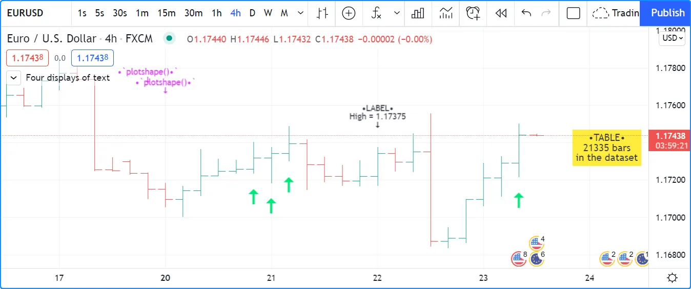

Note that:

- The method used to display each text string is shown with the text,
except for the lime up arrows displayed using
[plotchar()](../../reference manual/functions/plotchar.md),
as it can only display one character.
- Label and table calls can be inserted in conditional structures to
control when their are executed, whereas
[plotchar()](../../reference manual/functions/plotchar.md)
and
[plotshape()](../../reference manual/functions/plotshape.md)
cannot. Their conditional plotting must be controlled using their
first argument, which is a “series bool” whose `true` or `false`
value determines when the text is displayed.
- Numeric values displayed in the table and labels is first converted
to a string using
[str.tostring()](../../reference manual/functions/str.tostring.md).
- We use the `+` operator to concatenate string components.
- [plotshape()](../../reference manual/functions/plotshape.md)
is designed to display a shape with accompanying text. Its `size`
parameter controls the size of the shape, not of the text. We use
[na](../../reference manual/variables/na.md)
for its `color` argument so that the shape is not visible.
- Contrary to other texts, the table text will not move as you scroll
or scale the chart.
- Some text strings contain the 🠇 Unicode arrow (U+1F807).
- Some text strings contain the `\n` sequence that represents a new
line.

## [​`plotchar()`​](../2. Visuals/visuals_text-and-shapes.md#plotchar)

This function is useful to display a single character on bars. It has
the following syntax:

```
plotchar(series, title, char, location, color, offset, text, textcolor, editable, size, show_last, display, format, precision, force_overlay) → void
```

See the Reference Manual entry for [plotchar()](../../reference manual/functions/plotchar.md) for details on its parameters.

As explained in the
[Plotting without affecting the scale](../4. Writing_Scripts/writing_debugging.md#plotting-without-affecting-the-scale) section of our page on
[Debugging](../4. Writing_Scripts/writing_debugging.md), the function
can be used to display and inspect values in the Data Window or in the
indicator values displayed to the right of the script’s name on the
chart:

```pine
//@version=6
indicator("", "", true)
plotchar(bar_index, "Bar index", "", location.top)
```

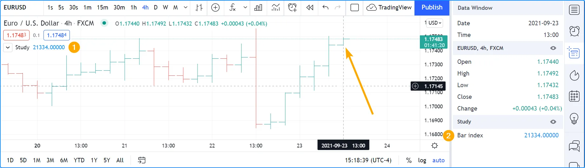

Note that:

- The cursor is on the chart’s last bar.
- The value of
[bar\_index](../../reference manual/variables/bar_index.md)
on **that** bar is displayed in indicator values (1) and in the Data
Window (2).
- We use
[location.top](../../reference manual/constants/location.top.md)
because the default
[location.abovebar](../../reference manual/constants/location.abovebar.md)
will put the price into play in the script’s scale, which will
often interfere with other plots.

[plotchar()](../../reference manual/functions/plotchar.md)
also works well to identify specific points on the chart or to validate
that conditions are `true` when we expect them to be. This example
displays an up arrow under bars where
[close](../../reference manual/variables/close.md),
[high](../../reference manual/variables/high.md)
and
[volume](../../reference manual/variables/volume.md)
have all been rising for two bars:

```pine
//@version=6
indicator("", "", true)
bool longSignal = ta.rising(close, 2) and ta.rising(high, 2) and (na(volume) or ta.rising(volume, 2))
plotchar(longSignal, "Long", "▲", location.belowbar, color = na(volume) ? color.gray : color.blue, size = size.tiny)
```

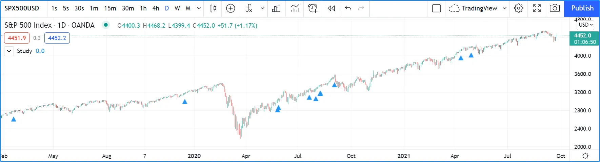

Note that:

- We use `(na(volume) or ta.rising(volume, 2))` so our script will
work on symbols without
[volume](../../reference manual/variables/volume.md)
data. If we did not make provisions for when there is no
[volume](../../reference manual/variables/volume.md)
data, which is what `na(volume)` does by being `true` when there is
no volume, the `longSignal` variable’s value would never be `true`
because `ta.rising(volume, 2)` yields `false` in those cases.
- We display the arrow in gray when there is no volume, to remind us
that all three base conditions are not being met.
- Because
[plotchar()](../../reference manual/functions/plotchar.md)
is now displaying a character on the chart, we use
`size = size.tiny` to control its size.
- We have adapted the `location` argument to display the character
under bars.

If you don’t mind plotting only circles, you could also use
[plot()](../../reference manual/functions/plot.md)
to achieve a similar effect:

```pine
//@version=6
indicator("", "", true)
longSignal = ta.rising(close, 2) and ta.rising(high, 2) and (na(volume) or ta.rising(volume, 2))
plot(longSignal ? low - ta.tr : na, "Long", color.blue, 2, plot.style_circles)
```

This method has the inconvenience that, since there is no relative
positioning mechanism with
[plot()](../../reference manual/functions/plot.md)
one must shift the circles down using something like
[ta.tr](../../reference manual/variables/ta.tr.md)
(the bar’s “True Range”):

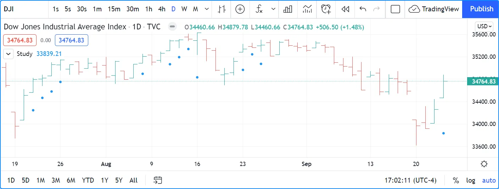

## [​`plotshape()`​](../2. Visuals/visuals_text-and-shapes.md#plotshape)

This function is useful to display pre-defined shapes and/or text on
bars. It has the following syntax:

```
plotshape(series, title, style, location, color, offset, text, textcolor, editable, size, show_last, display, format, precision, force_overlay) → void
```

See the Reference Manual entry for [plotshape()](../../reference manual/functions/plotshape.md) for details on its parameters.

Let’s use the function to achieve more or less the same result as with
our second example of the previous section:

```pine
//@version=6
indicator("", "", true)
longSignal = ta.rising(close, 2) and ta.rising(high, 2) and (na(volume) or ta.rising(volume, 2))
plotshape(longSignal, "Long", shape.arrowup, location.belowbar)
```

Note that here, rather than using an arrow character, we are using the
`shape.arrowup` argument for the `style` parameter.

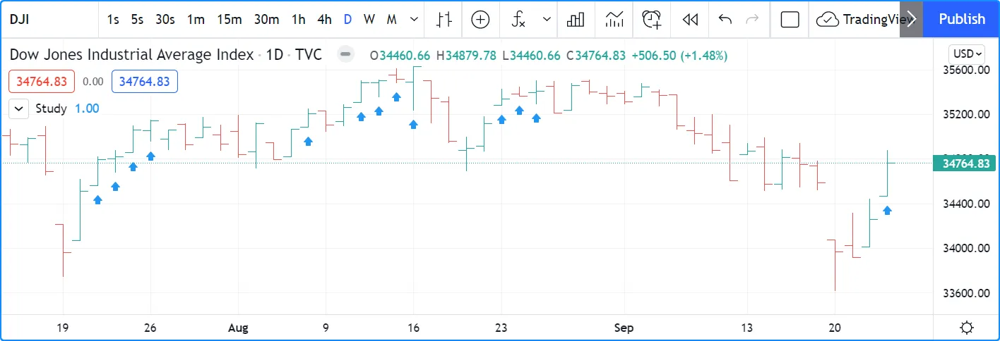

It is possible to use different [plotshape()](../../reference manual/functions/plotshape.md) calls to superimpose text on bars. You need to use the newline character sequence, `\n`. The newline needs to be the **last** one in the string for text going up, and the **first** one when you are plotting under the bar and text is
going down:

```pine
//@version=6
indicator("Lift text", "", true)
plotshape(true, "", shape.arrowup,   location.abovebar, color.green,  text = "A")
plotshape(true, "", shape.arrowup,   location.abovebar, color.lime,   text = "B\n")
plotshape(true, "", shape.arrowdown, location.belowbar, color.red,    text = "C")
plotshape(true, "", shape.arrowdown, location.belowbar, color.maroon, text = "​\nD")
```

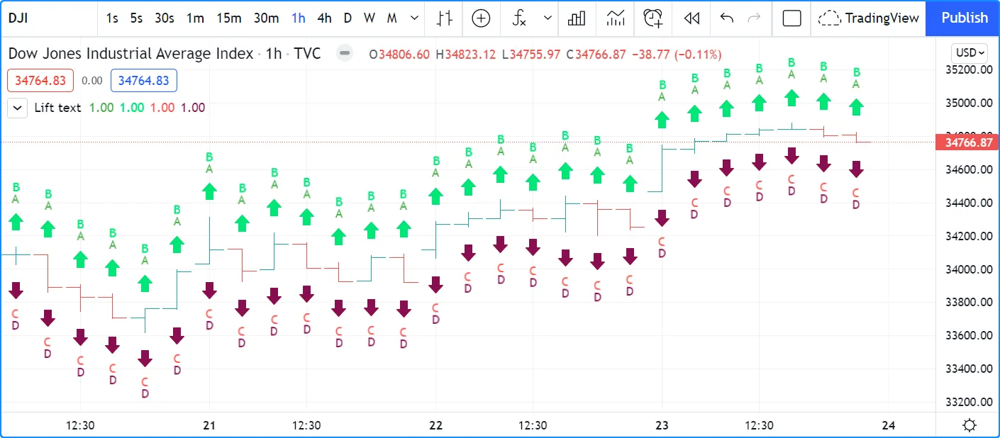

The available shapes you can use with the `style` parameter are:

| Argument | Shape | With Text | Argument | Shape | With Text |
| --- | --- | --- | --- | --- | --- |
| `shape.xcross` |  |  | `shape.arrowup` |  |  |
| `shape.cross` |  |  | `shape.arrowdown` |  |  |
| `shape.circle` |  |  | `shape.square` |  |  |
| `shape.triangleup` |  |  | `shape.diamond` |  |  |
| `shape.triangledown` |  |  | `shape.labelup` |  |  |
| `shape.flag` |  |  | `shape.labeldown` |  |  |

## [​`plotarrow()`​](../2. Visuals/visuals_text-and-shapes.md#plotarrow)

The
[plotarrow()](../../reference manual/functions/plotarrow.md)
function displays up or down arrows of variable length, based on the
relative value of the series used in the function’s first argument. It
has the following syntax:

```
plotarrow(series, title, colorup, colordown, offset, minheight, maxheight, editable, show_last, display, format, precision, force_overlay) → void
```

See the Reference Manual entry for [plotarrow()](../../reference manual/functions/plotarrow.md) for details on its parameters.

The `series` parameter in
[plotarrow()](../../reference manual/functions/plotarrow.md)
is not a “series bool” as in
[plotchar()](../../reference manual/functions/plotchar.md)
and
[plotshape()](../../reference manual/functions/plotshape.md);
it is a “series int/float” and there’s more to it than a simple
`true` or `false` value determining when the arrows are plotted. This is
the logic governing how the argument supplied to `series` affects the
behavior of
[plotarrow()](../../reference manual/functions/plotarrow.md):

- `series > 0`: An up arrow is displayed, the length of which will be
proportional to the relative value of the series on that bar in
relation to other series values.
- `series < 0`: A down arrow is displayed, proportionally-sized using
the same rules.
- `series == 0 or na(series)`: No arrow is displayed.

The maximum and minimum possible sizes for the arrows (in pixels) can be
controlled using the `minheight` and `maxheight` parameters.

Here is a simple script illustrating how
[plotarrow()](../../reference manual/functions/plotarrow.md)
works:

```pine
//@version=6
indicator("", "", true)
body = close - open
plotarrow(body, colorup = color.teal, colordown = color.orange)
```

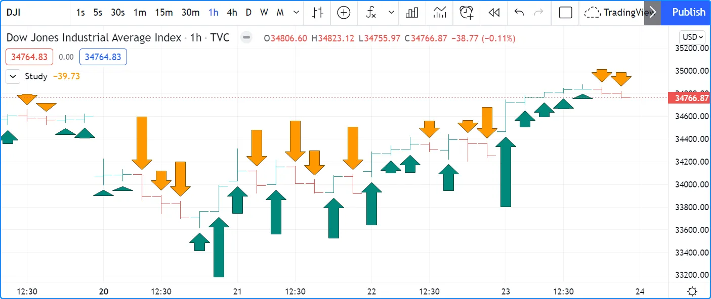

Note how the height of arrows is proportional to the relative size of
the bar bodies.

You can use any series to plot the arrows. Here we use the value of the
“Chaikin Oscillator” to control the location and size of the arrows:

```pine
//@version=6
indicator("Chaikin Oscillator Arrows", overlay = true)
fastLengthInput = input.int(3,  minval = 1)
slowLengthInput = input.int(10, minval = 1)
osc = ta.ema(ta.accdist, fastLengthInput) - ta.ema(ta.accdist, slowLengthInput)
plotarrow(osc)
```

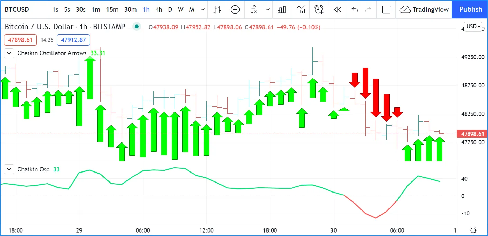

Note that we display the actual “Chaikin Oscillator” in a pane below
the chart, so you can see what values are used to determine the position
and size of the arrows.

## [Labels](../2. Visuals/visuals_text-and-shapes.md#labels)

Labels are only available in v4 and higher versions of Pine Script.
They work very differently than
[plotchar()](../../reference manual/functions/plotchar.md)
and
[plotshape()](../../reference manual/functions/plotshape.md).

Labels are objects, like
[lines and boxes](../2. Visuals/visuals_lines-and-boxes.md), or
[tables](../2. Visuals/visuals_tables.md). Like them, they are
referred to using an ID, which acts like a pointer. Label IDs are of
“label” type. As with other objects, labels IDs are “time series”
and all the functions used to manage them accept “series” arguments,
which makes them very flexible.

Labels are advantageous because:

- They allow “series” values to be converted to text and placed on
charts. This means they are ideal to display values that cannot be
known before time, such as price values, support and resistance
levels, of any other values that your script calculates.
- Their positioning options are more flexible that those of the
`plot*()` functions.
- They offer more display modes.
- Contrary to `plot*()` functions, label-handling functions can be
inserted in conditional or loop structures, making it easier to
control their behavior.
- You can add tooltips to labels.

One drawback to using labels versus
[plotchar()](../../reference manual/functions/plotchar.md)
and
[plotshape()](../../reference manual/functions/plotshape.md)
is that you can only draw a limited quantity of them on the chart. The
default is ~50, but you can use the `max_labels_count` parameter in
your
[indicator()](../../reference manual/functions/indicator.md)
or
[strategy()](../../reference manual/functions/strategy.md)
declaration statement to specify up to 500. Labels, like
[lines and boxes](../2. Visuals/visuals_lines-and-boxes.md), are
managed using a garbage collection mechanism which deletes the oldest
ones on the chart, such that only the most recently drawn labels are
visible.

Your toolbox of built-ins to manage labels are all in the `label`
namespace. They include:

- [label.new()](../../reference manual/functions/label.new.md)
to create labels.
- `label.set_*()` functions to modify the properties of an existing
label.
- `label.get_*()` functions to read the properties of an existing
label.
- [label.delete()](../../reference manual/functions/label.delete.md)
to delete labels
- The
[label.all](../../reference manual/variables/label.all.md)
array which always contains the IDs of all the visible labels on the
chart. The array’s size will depend on the maximum label count for
your script and how many of those you have drawn.
`aray.size(label.all)` will return the array’s size.

### [Creating and modifying labels](../2. Visuals/visuals_text-and-shapes.md#creating-and-modifying-labels)

The
[label.new()](../../reference manual/functions/label.new.md)
function creates a new label object on the chart. It has the following signatures:

```
label.new(point, text, xloc, yloc, color, style, textcolor, size, textalign, tooltip, text_font_family, force_overlay, text_formatting) → series label

label.new(x, y, text, xloc, yloc, color, style, textcolor, size, textalign, tooltip, text_font_family, force_overlay, text_formatting) → series label
```

The difference between the two signatures is how they specify the label’s coordinates on the chart. The first signature uses a `point` parameter, which accepts a [chart point](../3. Language/language_type-system.md#chart-points) object. The second signature uses `x` and `y` parameters, which accept “series int/float” values. For both signatures, the x-coordinate of a label can be either a bar index or time value, depending on the `xloc` property.

The _setter_ functions allowing you to change a label’s properties are:

- [label.set\_x()](../../reference manual/functions/label.set_x.md)
- [label.set\_y()](../../reference manual/functions/label.set_y.md)
- [label.set\_xy()](../../reference manual/functions/label.set_xy.md)
- [label.set\_point()](../../reference manual/functions/label.set_point.md)
- [label.set\_text()](../../reference manual/functions/label.set_text.md)
- [label.set\_xloc()](../../reference manual/functions/label.set_xloc.md)
- [label.set\_yloc()](../../reference manual/functions/label.set_yloc.md)
- [label.set\_color()](../../reference manual/functions/label.set_color.md)
- [label.set\_style()](../../reference manual/functions/label.set_style.md)
- [label.set\_textcolor()](../../reference manual/functions/label.set_textcolor.md)
- [label.set\_size()](../../reference manual/functions/label.set_size.md)
- [label.set\_textalign()](../../reference manual/functions/label.set_textalign.md)
- [label.set\_tooltip()](../../reference manual/functions/label.set_tooltip.md)
- [label.set\_text\_font\_family()](../../reference manual/functions/label.set_text_font_family.md)
- [label.set\_text\_formatting()](../../reference manual/functions/label.set_text_formatting.md)

They all have a similar signature. The one for
[label.set\_color()](../../reference manual/functions/label.set_color.md)
is:

```
label.set_color(id, color) → void
```

where:

- `id` is the ID of the label whose property is to be modified.
- The next parameter is the property of the label to modify. It
depends on the setter function used.
[label.set\_xy()](../../reference manual/functions/label.set_xy.md)
changes two properties, so it has two such parameters.

This is how you can create labels in their simplest form:

```pine
//@version=6
indicator("", "", true)
label.new(bar_index, high)
```

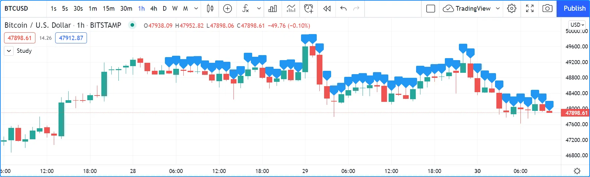

Note that:

- The label is created with the parameters `x = bar_index` (the index
of the current bar,
[bar\_index](../../reference manual/variables/bar_index.md))
and `y = high` (the bar’s
[high](../../reference manual/variables/high.md)
value).
- We do not supply an argument for the function’s `text` parameter.
Its default value being an empty string, no text is displayed.
- No logic controls our
[label.new()](../../reference manual/functions/label.new.md)
call, so labels are created on every bar.
- Only the last 54 labels are displayed because our
[indicator()](../../reference manual/functions/indicator.md)
call does not use the `max_labels_count` parameter to specify a
value other than the ~50 default.
- Labels persist on bars until your script deletes them using
[label.delete()](../../reference manual/functions/label.delete.md),
or garbage collection removes them.

In the next example we display a label on the bar with the highest
[high](../../reference manual/variables/high.md)
value in the last 50 bars:

```pine
//@version=6
indicator("", "", true)

// Find the highest `high` in last 50 bars and its offset. Change it's sign so it is positive.
LOOKBACK = 50
hi = ta.highest(LOOKBACK)
highestBarOffset = - ta.highestbars(LOOKBACK)

// Create label on bar zero only.
var lbl = label.new(na, na, "", color = color.orange, style = label.style_label_lower_left)
// When a new high is found, move the label there and update its text and tooltip.
if ta.change(hi) != 0
    // Build label and tooltip strings.
    labelText = "High: " + str.tostring(hi, format.mintick)
    tooltipText = "Offest in bars: " + str.tostring(highestBarOffset) + "\nLow: " + str.tostring(low[highestBarOffset], format.mintick)
    // Update the label's position, text and tooltip.
    label.set_xy(lbl, bar_index[highestBarOffset], hi)
    label.set_text(lbl, labelText)
    label.set_tooltip(lbl, tooltipText)
```

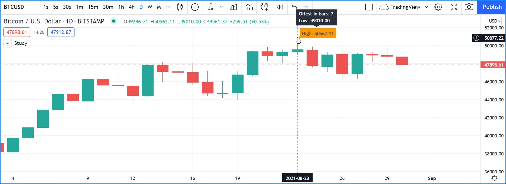

Note that:

- We create the label on the first bar only by using the
[var](../../reference manual/keywords/var.md)
keyword to declare the `lbl` variable that contains the label’s ID.
The `x`, `y` and `text` arguments in that
[label.new()](../../reference manual/functions/label.new.md)
call are irrelevant, as the label will be updated on further bars.
We do, however, take care to use the `color` and `style` we want for
the labels, so they don’t need updating later.
- On every bar, we detect if a new high was found by testing for
changes in the value of `hi`
- When a change in the high value occurs, we update our label with new
information. To do this, we use three `label.set*()` calls to change
the label’s relevant information. We refer to our label using the
`lbl` variable, which contains our label’s ID. The script is thus
maintaining the same label throughout all bars, but moving it and
updating its information when a new high is detected.

Here we create a label on each bar, but we set its properties
conditionally, depending on the bar’s polarity:

```pine
//@version=6
indicator("", "", true)
lbl = label.new(bar_index, na)
if close >= open
    label.set_text( lbl, "green")
    label.set_color(lbl, color.green)
    label.set_yloc( lbl, yloc.belowbar)
    label.set_style(lbl, label.style_label_up)
else
    label.set_text( lbl, "red")
    label.set_color(lbl, color.red)
    label.set_yloc( lbl, yloc.abovebar)
    label.set_style(lbl, label.style_label_down)
```

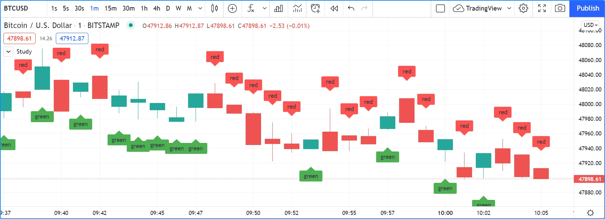

### [Positioning labels](../2. Visuals/visuals_text-and-shapes.md#positioning-labels)

Labels are positioned on the chart according to _x_ (bars) and _y_
(price) coordinates. Five parameters affect this behavior: `x`, `y`,
`xloc`, `yloc` and `style`:

`x`

Is either a bar index or a time value. When a bar index is used, the
value can be offset in the past or in the future (up to a maximum of 500 bars in the future and 10,000 bars in the past). Past or future offsets can also be calculated
when using time values. The `x` value of an existing label can be
modified using
[label.set\_x()](../../reference manual/functions/label.set_x.md)
or
[label.set\_xy()](../../reference manual/functions/label.set_xy.md).

`xloc`

Is either
[xloc.bar\_index](../../reference manual/constants/xloc.bar_index.md)
(the default) or
[xloc.bar\_time](../../reference manual/constants/xloc.bar_time.md).
It determines which type of argument must be used with `x`. With
[xloc.bar\_index](../../reference manual/constants/xloc.bar_index.md),
`x` must be an absolute bar index. With
[xloc.bar\_time](../../reference manual/constants/xloc.bar_time.md),
`x` must be a UNIX time in milliseconds corresponding to the
[time](../../reference manual/variables/time.md)
value of a bar’s
[open](../../reference manual/variables/open.md).
The `xloc` value of an existing label can be modified using
[label.set\_xloc()](../../reference manual/functions/label.set_xloc.md).

`y`

Is the price level where the label is positioned. It is only taken
into account with the default `yloc` value of [yloc.price](../../reference manual/constants/yloc.price.md). If
`yloc` is
[yloc.abovebar](../../reference manual/constants/yloc.abovebar.md)
or
[yloc.belowbar](../../reference manual/constants/yloc.belowbar.md)
then the `y` argument is ignored. The `y` value of an existing label
can be modified using
[label.set\_y()](../../reference manual/functions/label.set_y.md)
or
[label.set\_xy()](../../reference manual/functions/label.set_xy.md).

`yloc`

Can be
[yloc.price](../../reference manual/constants/yloc.price.md)
(the default),
[yloc.abovebar](../../reference manual/constants/yloc.abovebar.md)
or
[yloc.belowbar](../../reference manual/constants/yloc.belowbar.md).
The argument used for `y` is only taken into account with
[yloc.price](../../reference manual/constants/yloc.price.md).
The `yloc` value of an existing label can be modified using
[label.set\_yloc()](../../reference manual/functions/label.set_yloc.md).

`style`

The argument used has an impact on the visual appearance of the
label and on its position relative to the reference point determined
by either the `y` value or the top/bottom of the bar when
[yloc.abovebar](../../reference manual/constants/yloc.abovebar.md)
or
[yloc.belowbar](../../reference manual/constants/yloc.belowbar.md)
are used. The `style` of an existing label can be modified using
[label.set\_style()](../../reference manual/functions/label.set_style.md).

These are the available `style` arguments:

| Argument | Label | Label with text | Argument | Label | Label with text |
| --- | --- | --- | --- | --- | --- |
| `label.style_xcross` |  |  | `label.style_label_up` |  |  |
| `label.style_cross` |  |  | `label.style_label_down` |  |  |
| `label.style_flag` |  |  | `label.style_label_left` |  |  |
| `label.style_circle` |  |  | `label.style_label_right` |  |  |
| `label.style_square` |  |  | `label.style_label_lower_left` |  |  |
| `label.style_diamond` |  |  | `label.style_label_lower_right` |  |  |
| `label.style_triangleup` |  |  | `label.style_label_upper_left` |  |  |
| `label.style_triangledown` |  |  | `label.style_label_upper_right` |  |  |
| `label.style_arrowup` |  |  | `label.style_label_center` |  |  |
| `label.style_arrowdown` |  |  | `label.style_none` |  |  |

When using
[xloc.bar\_time](../../reference manual/constants/xloc.bar_time.md),
the `x` value must be a UNIX timestamp in milliseconds. See the page on
[Time](../1. Concepts/concepts_time.md) for more information.
The start time of the current bar can be obtained from the
[time](../../reference manual/variables/time.md)
built-in variable. The bar time of previous bars is `time[1]`, `time[2]`
and so on. Time can also be set to an absolute value with the
[timestamp()](../../reference manual/functions/timestamp.md)
function. You may add or subtract periods of time to achieve relative
time offset.

Let’s position a label one day ago from the date on the last bar:

```pine
//@version=6
indicator("")
daysAgoInput = input.int(1, tooltip = "Use negative values to offset in the future")
if barstate.islast
    MS_IN_ONE_DAY = 24 * 60 * 60 * 1000
    oneDayAgo = time - (daysAgoInput * MS_IN_ONE_DAY)
    label.new(oneDayAgo, high, xloc = xloc.bar_time, style = label.style_label_right)
```

Note that because of varying time gaps and missing bars when markets are
closed, the positioning of the label may not always be exact. Time
offsets of the sort tend to be more reliable on 24x7 markets.

You can also offset using a bar index for the `x` value, e.g.:

```pine
label.new(bar_index + 10, high)
label.new(bar_index - 10, high[10])
label.new(bar_index[10], high[10])
```

### [Reading label properties](../2. Visuals/visuals_text-and-shapes.md#reading-label-properties)

The following _getter_ functions are available for labels:

- [label.get\_x()](../../reference manual/functions/label.get_x.md)
- [label.get\_y()](../../reference manual/functions/label.get_y.md)
- [label.get\_text()](../../reference manual/functions/label.get_text.md)

They all have a similar signature. The one for
[label.get\_text()](../../reference manual/functions/label.get_text.md)
is:

```
label.get_text(id) → series string
```

where `id` is the label whose text is to be retrieved.

### [Cloning labels](../2. Visuals/visuals_text-and-shapes.md#cloning-labels)

The
[label.copy()](../../reference manual/functions/label.copy.md)
function is used to clone labels. Its syntax is:

```
label.copy(id) → void
```

### [Deleting labels](../2. Visuals/visuals_text-and-shapes.md#deleting-labels)

The
[label.delete()](../../reference manual/functions/label.delete.md)
function is used to delete labels. Its syntax is:

```
label.delete(id) → void
```

To keep only a user-defined quantity of labels on the chart, one could
use code like this:

```pine
//@version=6
MAX_LABELS = 500
indicator("", max_labels_count = MAX_LABELS)
qtyLabelsInput = input.int(5, "Labels to keep", minval = 0, maxval = MAX_LABELS)
myRSI = ta.rsi(close, 20)
if myRSI > ta.highest(myRSI, 20)[1]
    label.new(bar_index, myRSI, str.tostring(myRSI, "#.00"), style = label.style_none)
    if array.size(label.all) > qtyLabelsInput
        label.delete(array.get(label.all, 0))
plot(myRSI)
```

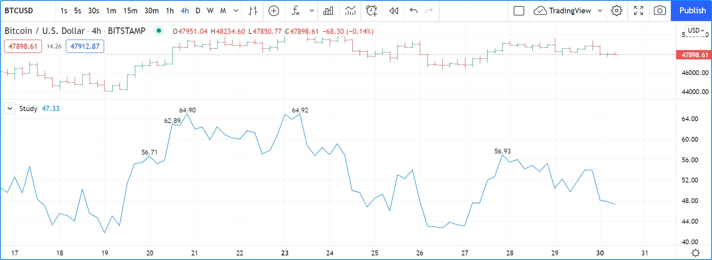

Note that:

- We define a `MAX_LABELS` constant to hold the maximum quantity of
labels a script can accommodate. We use that value to set the
`max_labels_count` parameter’s value in our
[indicator()](../../reference manual/functions/indicator.md)
call, and also as the `maxval` value in our
[input.int()](../../reference manual/functions/input.int.md)
call to cap the user value.
- We create a new label when our RSI breaches its highest value of the
last 20 bars. Note the offset of `[1]` we use in
`if myRSI > ta.highest(myRSI, 20)[1]`. This is necessary. Without
it, the value returned by
[ta.highest()](../../reference manual/functions/ta.highest.md)
would always include the current value of `myRSI`, so `myRSI` would
never be higher than the function’s return value.
- After that, we delete the oldest label in the
[label.all](../../reference manual/variables/label.all.md)
array that is automatically maintained by the Pine Script runtime
and contains the ID of all the visible labels drawn by our script.
We use the
[array.get()](../../reference manual/functions/array.get.md)
function to retrieve the array element at index zero (the oldest
visible label ID). We then use
[label.delete()](../../reference manual/functions/label.delete.md)
to delete the label linked with that ID.

Note that if one wants to position a label on the last bar only, it is
unnecessary and inefficent to create and delete the label as the script
executes on all bars, so that only the last label remains:

```pine
// INEFFICENT!
//@version=6
indicator("", "", true)
lbl = label.new(bar_index, high, str.tostring(high, format.mintick))
label.delete(lbl[1])
```

This is the efficient way to realize the same task:

```pine
//@version=6
indicator("", "", true)
if barstate.islast
    // Create the label once, the first time the block executes on the last bar.
    var lbl = label.new(na, na)
    // On all iterations of the script on the last bar, update the label's information.
    label.set_xy(lbl, bar_index, high)
    label.set_text(lbl, str.tostring(high, format.mintick))
```

### [Realtime behavior](../2. Visuals/visuals_text-and-shapes.md#realtime-behavior)

Labels are subject to both _commit_ and _rollback_ actions, which affect
the behavior of a script when it executes on the realtime bar. See the [Execution model](../3. Language/language_execution-model.md) page to learn more.

This script demonstrates the effect of rollback when running on the
realtime bar:

```pine
//@version=6
indicator("", "", true)
label.new(bar_index, high)
```

On realtime bars,
[label.new()](../../reference manual/functions/label.new.md)
creates a new label on every script update, but because of the rollback
process, the label created on the previous update on the same bar is
deleted. Only the last label created before the realtime bar’s close
will be committed, and thus persist.

## [Text formatting](../2. Visuals/visuals_text-and-shapes.md#text-formatting)

Drawing objects like [labels](../2. Visuals/visuals_text-and-shapes.md#labels), [tables](../2. Visuals/visuals_tables.md), and [boxes](../2. Visuals/visuals_lines-and-boxes.md#boxes) have text-related properties that allow users to customize how an object’s text appears on the chart. Some common properties include the text color, size, font family, and typographic emphasis.

Programmers can set an object’s text properties when initializing it using the [label.new()](../../reference manual/functions/label.new.md), [box.new()](../../reference manual/functions/box.new.md), or [table.cell()](../../reference manual/functions/table.cell.md) parameters. Alternatively, they can use the corresponding setter functions, e.g., [label.set\_text\_font\_family()](../../reference manual/functions/label.set_text_font_family.md), [table.cell\_set\_text\_color()](../../reference manual/functions/table.cell_set_text_color.md), [box.set\_text\_halign()](../../reference manual/functions/box.set_text_halign.md), etc.

All three drawing objects have a `text_formatting` parameter, which sets the typographic emphasis to display **bold**, _italicized_, or unformatted text. It accepts the constants [text.format\_bold](../../reference manual/constants/text.format_bold.md), [text.format\_italic](../../reference manual/constants/text.format_italic.md), or [text.format\_none](../../reference manual/constants/text.format_none.md) (no special formatting; default value). It also accepts `text.format_bold + text.format_italic` to display text that is both _**bold and italicized**_.

The `size` parameter in [label.new()](../../reference manual/functions/label.new.md) and the `text_size` parameter in [box.new()](../../reference manual/functions/box.new.md) and [table.cell()](../../reference manual/functions/table.cell.md) specify the size of the text displayed in the drawn objects. The parameters accept both “string” `size.*` constants and “int” typographic sizes. A “string” `size.*` constant represents one of six fixed sizing options. An “int” size value can be any positive integer, allowing scripts to replicate the `size.*` values or use other customized sizing.

This table lists the `size.*` constants and their equivalent “int” sizes for [tables](../1. Concepts/concepts_tables.md), [boxes](../1. Concepts/concepts_lines-and-boxes.md#boxes), and [labels](../1. Concepts/concepts_text-and-shapes.md#labels):

| “string” constant | ”int” `text_size` in tables and boxes | ”int” `size` in labels |
| --- | --- | --- |
| `size.auto` | 0 | 0 |
| `size.tiny` | 8 | ~7 |
| `size.small` | 10 | ~10 |
| `size.normal` | 14 | 12 |
| `size.large` | 20 | 18 |
| `size.huge` | 36 | 24 |

The example below creates a [label](../../reference manual/types/label.md) and [table](../../reference manual/types/table.md) on the last available bar. The label displays a string representation of the current [close](../../reference manual/variables/close.md) value. The single-cell table displays a string representing the price and percentage difference between the current [close](../../reference manual/variables/close.md) and [open](../../reference manual/variables/open.md) values. The label’s text size is defined by a [string input](../1. Concepts/concepts_inputs.md#string-input) that returns the value of a built-in `size.*` constant, and the table’s text size is defined by an [integer input](../1. Concepts/concepts_inputs.md#integer-input). Additionally, the script creates a [box](../../reference manual/types/box.md) that visualizes the range from the highest to lowest price over the last 20 bars. The box displays custom text, with a constant `text_size` of 19, to show the distance from the [close](../../reference manual/variables/close.md) value to the current highest or lowest price. The two [Boolean inputs](../1. Concepts/concepts_inputs.md#boolean-input) specify whether all three drawings apply bold and italic text formats to their displayed text:

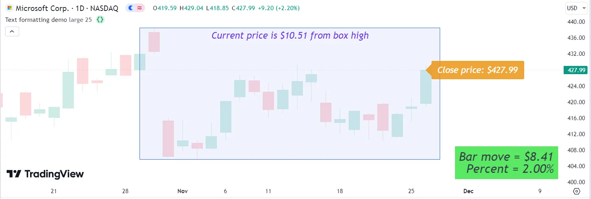

```pine
//@version=6
indicator("Text formatting demo", overlay = true)

//@variable The size of the `closeLabel` text, set using "string" `size.*` constants.
string closeLabelSize = input.string(size.large, "Label text size",
     [size.auto, size.tiny, size.small, size.normal, size.large, size.huge], group = "Text size")
//@variable The size of the `barMoveTable` text, set using "int" sizes.
int tableTextSize = input.int(25, "Table text size", minval = 0, group = "Text size")

// Toggles for the text formatting of all the drawing objects (`label`, `table` cell, and `box` texts).
bool formatBold   = input.bool(false, "Bold emphasis",   group = "Text formatting (all objects)")
bool formatItalic = input.bool(true,  "Italic emphasis", group = "Text formatting (all objects)")

// Track the highest and lowest prices in 20 bars. Used to draw a `box` of the high-low range.
float recentHighest = ta.highest(20)
float recentLowest  = ta.lowest(20)

if barstate.islast
    //@variable Label displaying `close` price on last bar. Text size is set using "string" constants.
    label closeLabel = label.new(bar_index, close, "Close price: " + str.tostring(close, "$0.00"),
         color = #EB9514D8, style = label.style_label_left, size = closeLabelSize)

    // Create a `table` cell to display the bar move (difference between `open` and `close` price).
    float barMove = close - open
    //@variable Single-cell table displaying the `barMove`. Cell text size is set using "int" values.
    var table barMoveTable = table.new(position.bottom_right, 1, 1, bgcolor = barMove > 0 ? #31E23FCC : #EE4040CC)
    barMoveTable.cell(0, 0, "Bar move = " + str.tostring(barMove, "$0.00") + "\n Percent = "
         + str.tostring(barMove / open, "0.00%"), text_halign = text.align_right, text_size = tableTextSize)

    // Draw a box to show where current price falls in the range of `recentHighest` to `recentLowest`.
    //@variable Box drawing the range from `recentHighest` to `recentLowest` in last 20 bars. Text size is set at 19.
    box rangeBox = box.new(bar_index - 20, recentHighest, bar_index + 1, recentLowest, text_size = 19,
         bgcolor = #A4B0F826, text_valign = text.align_top, text_color = #4A07E7D8)
    // Set box text to display how far current price is from the high or low of the range, depending on which is closer.
    rangeBox.set_text("Current price is " +
         (close >= (recentHighest + recentLowest) / 2 ? str.tostring(recentHighest - close, "$0.00") + " from box high"
         : str.tostring(close - recentLowest, "$0.00") + " from box low"))

    // Set the text formatting of the `closeLabel`, `barMoveTable` cell, and `rangeBox` objects.
    // `formatBold` and `formatItalic` can both be `true` to combine formats, or both `false` for no special formatting.
    switch
        formatBold and formatItalic =>
            closeLabel.set_text_formatting(text.format_bold + text.format_italic)
            barMoveTable.cell_set_text_formatting(0, 0, text.format_bold + text.format_italic)
            rangeBox.set_text_formatting(text.format_bold + text.format_italic)
        formatBold =>
            closeLabel.set_text_formatting(text.format_bold)
            barMoveTable.cell_set_text_formatting(0, 0, text.format_bold)
            rangeBox.set_text_formatting(text.format_bold)
        formatItalic =>
            closeLabel.set_text_formatting(text.format_italic)
            barMoveTable.cell_set_text_formatting(0, 0, text.format_italic)
            rangeBox.set_text_formatting(text.format_italic)
        =>
            closeLabel.set_text_formatting(text.format_none)
            barMoveTable.cell_set_text_formatting(0, 0, text.format_none)
            rangeBox.set_text_formatting(text.format_none)
```

[Previous 
**Tables**](../2. Visuals/visuals_tables.md)