ADVANCED

# [Arrays](../3. Language/language_arrays.md#arrays)

## [Introduction](../3. Language/language_arrays.md#introduction)

Pine Script _arrays_ are one-dimensional [collections](../3. Language/language_type-system.md#collections) that can store multiple values or references in a single location. Arrays are a more robust alternative to declaring a set of similar variables (e.g., `price00`, `price01`, `price02`, …).

All elements in an array must be of the same [built-in type](../3. Language/language_type-system.md#types), [user-defined type](../3. Language/language_type-system.md#user-defined-types), or [enum type](../3. Language/language_type-system.md#enum-types).

Similar to [lines](../2. Visuals/visuals_lines-and-boxes.md#lines), [labels](../2. Visuals/visuals_text-and-shapes.md#labels), and other [reference types](../3. Language/language_type-system.md#reference-types), arrays and their data are accessed using _references_, which we often refer to as _IDs_. Pine Script does not use an indexing operator to access individual array elements. Instead, functions including [array.get()](../../reference manual/functions/array.get.md) and [array.set()](../../reference manual/functions/array.set.md) read and write the elements of the array associated with a specific ID.

Scripts access specific elements in an array by specifying an _index_ in calls to these functions. The index starts at 0 and extends to one less than the number of elements in the array. Arrays in Pine Script can have dynamic sizes that vary across bars, as scripts can change the number of elements in an array on any execution. A single script can create multiple array instances. The total number of elements in any array cannot exceed 100,000.

## [Declaring arrays](../3. Language/language_arrays.md#declaring-arrays)

Pine Script uses the following syntax for array declarations:

```
[var/varip ][array<type> ]<identifier> = <expression>
```

Where `<type>` is a _type template_ that defines the type of elements that the array can contain, and `<expression>` is an expression that returns either the ID of an array or [na](../../reference manual/variables/na.md). See the [Collections](../3. Language/language_type-system.md#collections) section of the [Type system](../3. Language/language_type-system.md) page to learn about type templates.

When declaring an array variable, programmers can use the [array](../../reference manual/types/array.md) keyword followed by a type template to explicitly define the variable’s _type identifier_ (e.g., `array<int>` for a variable that can reference an array of “int” values).

Specifying a type identifier for a variable or function parameter that holds array references is usually optional. The only exceptions are when initializing an identifier with an [`na` value](../3. Language/language_type-system.md#na-value), defining exported [library functions](../1. Concepts/concepts_libraries.md#library-functions) whose parameters accept array IDs, or declaring [user-defined types](../3. Language/language_type-system.md#user-defined-types) with fields for storing array IDs. Even when not required, note that specifying an array variable’s type helps promote readability, and it helps the Pine Editor provide relevant code suggestions.

The following line of code declares an array variable named `prices` that has an initial reference of [na](../../reference manual/variables/na.md). This variable declaration _requires_ a type identifier, because the compiler cannot automatically determine the type that [na](../../reference manual/variables/na.md) represents:

```pine
array<float> prices = na
```

Scripts can use the following functions to create new arrays: [array.new<type>()](../../reference manual/functions/array.new<type>.md), [array.from()](../../reference manual/functions/array.from.md), or [array.copy()](../../reference manual/functions/array.copy.md). Each of these functions creates a new array and returns a non-na ID for use in other parts of the code. Note that these functions accept “series” arguments for all parameters, meaning the constructed arrays can have dynamic sizes and elements on each call.

The following example creates an empty “float” array and assigns its ID to a `prices` variable. Specifying a type identifier for the `prices` variable is _not_ required in this case, because the variable automatically _inherits_ the function’s returned type (`array<float>`):

```pine
prices = array.new<float>(0)
```

The `initial_value` parameter of the `array.new*()` functions enables users to set _all_ initial elements in the array to a specified value or reference. If a call to these functions does not include an `initial_value` argument, it creates an array filled with [na](../../reference manual/variables/na.md) elements.

The following line declares an array variable named `prices` and assigns it the ID of an array containing two elements. Both elements in the array hold the current bar’s [close](../../reference manual/variables/close.md) value:

```pine
prices = array.new<float>(2, close)
```

To create an array without initializing all elements to the same value or reference, use [array.from()](../../reference manual/functions/array.from.md). This function determines the array’s size and the type of elements it stores based on the arguments in the function call. All arguments supplied to the call must be of the _same type_.

For example, both lines of code in the following example show two ways to create a “bool” array using [array.from()](../../reference manual/functions/array.from.md) and declare a variable to store its ID:

```pine
statesArray = array.from(close > open, high != close)

array<bool> statesArray = array.from(close > open, high != close)
```

### [Using ​`var`​ and ​`varip`​ keywords](../3. Language/language_arrays.md#using-var-and-varip-keywords)

Programmers can use the
[var](../../reference manual/keywords/var.md) and
[varip](../../reference manual/keywords/varip.md)
keywords to instruct a script to declare an array variable on only one bar instead of on each execution of the variable’s scope. Array
variables declared using these keywords point to the same array
instances until explicitly reassigned, allowing an array and its elements to persist across bars.

When declaring an array variable using these keywords and pushing a new
value to the end of the referenced array on each bar, the array will
grow by one on each bar and be of size `bar_index + 1`
( [bar\_index](../../reference manual/variables/bar_index.md)
starts at zero) by the time the script executes on the last bar, as this
code demonstrates:

```pine
//@version=6
indicator("Using `var`")
//@variable An array that expands its size by 1 on each bar.
var a = array.new<float>(0)
array.push(a, close)

if barstate.islast
    //@variable A string containing the size of `a` and the current `bar_index` value.
    string labelText = "Array size: " + str.tostring(a.size()) + "\nbar_index: " + str.tostring(bar_index)
    // Display the `labelText`.
    label.new(bar_index, 0, labelText, size = size.large)
```

The same code without the
[var](../../reference manual/keywords/var.md)
keyword would _reinitialize_ the `a` variable with the ID of a new, empty array on every execution. In that case, after
execution of the
[array.push()](../../reference manual/functions/array.push.md)
call, the
[array.size()](../../reference manual/functions/array.size.md) _method_
call (`a.size()`) would return a value of 1.

## [Reading and writing array elements](../3. Language/language_arrays.md#reading-and-writing-array-elements)

Scripts can write values to existing individual array elements using
[array.set()](../../reference manual/functions/array.set.md),
and read using [array.get()](../../reference manual/functions/array.get.md).
When using these functions, it is imperative that the `index` in the
function call is always less than or equal to the array’s size (because
array indices start at zero). To get the size of an array, use the
[array.size()](../../reference manual/functions/array.size.md)
function.

The following example uses the
[set()](../../reference manual/functions/array.set.md)
method to populate a `fillColors` array with instances of one base color
using different transparency levels. It then uses
[array.get()](../../reference manual/functions/array.get.md)
to retrieve one of the colors from the array based on the location of
the bar with the highest price within the last `lookbackInput` bars:

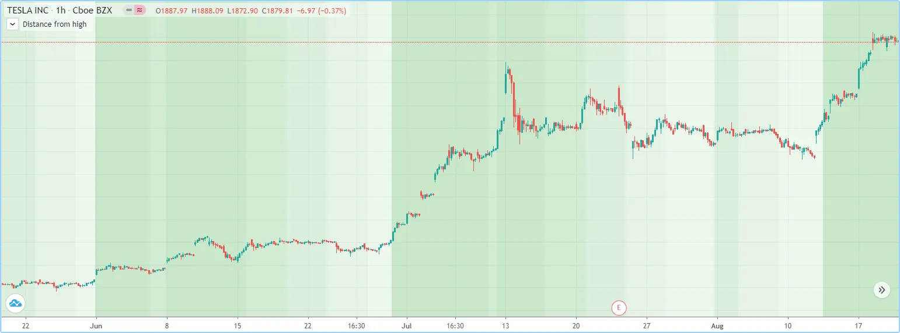

```pine
//@version=6
indicator("Distance from high", "", true)
lookbackInput = input.int(100)
FILL_COLOR = color.green
// Declare array and set its values on the first bar only.
var fillColors = array.new<color>(5)
if barstate.isfirst
    // Initialize the array elements with progressively lighter shades of the fill color.
    fillColors.set(0, color.new(FILL_COLOR, 70))
    fillColors.set(1, color.new(FILL_COLOR, 75))
    fillColors.set(2, color.new(FILL_COLOR, 80))
    fillColors.set(3, color.new(FILL_COLOR, 85))
    fillColors.set(4, color.new(FILL_COLOR, 90))

// Find the offset to highest high. Change its sign because the function returns a negative value.
lastHiBar = - ta.highestbars(high, lookbackInput)
// Convert the offset to an array index, capping it to 4 to avoid a runtime error.
// The index used by `array.get()` will be the equivalent of `floor(fillNo)`.
fillNo = math.min(lastHiBar / (lookbackInput / 5), 4)
// Set background to a progressively lighter fill with increasing distance from location of highest high.
bgcolor(array.get(fillColors, fillNo))
// Plot key values to the Data Window for debugging.
plotchar(lastHiBar, "lastHiBar", "", location.top, size = size.tiny)
plotchar(fillNo, "fillNo", "", location.top, size = size.tiny)
```

Another technique for initializing the elements in an array is to create
an _empty array_ (an array with no elements), then use
[array.push()](../../reference manual/functions/array.push.md)
to append **new** elements to the end of the array, increasing the size
of the array by one on each call. The following code is functionally
identical to the initialization section from the preceding script:

```pine
// Declare array and set its values on the first bar only.
var fillColors = array.new<color>(0)
if barstate.isfirst
    // Initialize the array elements with progressively lighter shades of the fill color.
    array.push(fillColors, color.new(FILL_COLOR, 70))
    array.push(fillColors, color.new(FILL_COLOR, 75))
    array.push(fillColors, color.new(FILL_COLOR, 80))
    array.push(fillColors, color.new(FILL_COLOR, 85))
    array.push(fillColors, color.new(FILL_COLOR, 90))
```

This code is equivalent to the one above, but it uses
[array.unshift()](../../reference manual/functions/array.unshift.md)
to insert new elements at the _beginning_ of the `fillColors` array:

```pine
// Declare array and set its values on the first bar only.
var fillColors = array.new<color>(0)
if barstate.isfirst
    // Initialize the array elements with progressively lighter shades of the fill color.
    array.unshift(fillColors, color.new(FILL_COLOR, 90))
    array.unshift(fillColors, color.new(FILL_COLOR, 85))
    array.unshift(fillColors, color.new(FILL_COLOR, 80))
    array.unshift(fillColors, color.new(FILL_COLOR, 75))
    array.unshift(fillColors, color.new(FILL_COLOR, 70))
```

We can also use
[array.from()](../../reference manual/functions/array.from.md)
to create the same `fillColors` array with a single function call:

```pine
//@version=6
indicator("Using `var`")
FILL_COLOR = color.green
var array<color> fillColors = array.from(
     color.new(FILL_COLOR, 70),
     color.new(FILL_COLOR, 75),
     color.new(FILL_COLOR, 80),
     color.new(FILL_COLOR, 85),
     color.new(FILL_COLOR, 90)
)
// Cycle background through the array's colors.
bgcolor(array.get(fillColors, bar_index % (fillColors.size())))
```

The [array.fill()](../../reference manual/functions/array.fill.md)
function points all array elements, or the elements within the `index_from` to `index_to` range, to a specified `value`. Without the
last two optional parameters, the function fills the whole array, so:

```pine
a = array.new<float>(10, close)
```

and:

```pine
a = array.new<float>(10)
a.fill(close)
```

are equivalent, but:

```pine
a = array.new<float>(10)
a.fill(close, 1, 3)
```

only fills the second and third elements (at index 1 and 2) of the array
with `close`. Note how the
[array.fill()](../../reference manual/functions/array.fill.md) function’s
last parameter, `index_to`, must have a value one greater than the last index the
function will fill. The remaining elements will hold `na` values, as the
[array.new<type>()](../../reference manual/functions/array.new<type>.md)
function call does not contain an `initial_value` argument.

## [Looping through array elements](../3. Language/language_arrays.md#looping-through-array-elements)

When looping through an array’s element indices and the array’s size
is unknown, one can use the
[array.size()](../../reference manual/functions/array.size.md)
function to get the maximum index value. For example:

```pine
//@version=6
indicator("Protected `for` loop", overlay = true)
//@variable An array of `close` prices from the 1-minute timeframe.
array<float> a = request.security_lower_tf(syminfo.tickerid, "1", close)

//@variable A string representation of the elements in `a`.
string labelText = ""
for i = 0 to (array.size(a) == 0 ? na : array.size(a) - 1)
    labelText += str.tostring(array.get(a, i)) + "\n"

label.new(bar_index, high, text = labelText)
```

Note that:

- We use the
[request.security\_lower\_tf()](../../reference manual/functions/request.security_lower_tf.md)
function which returns an array of
[close](../../reference manual/variables/close.md)
prices at the `1 minute` timeframe.
- This code example will throw an error if you use it on a chart
timeframe smaller than `1 minute`.
- [for](../../reference manual/keywords/for.md)
loops do not execute if the `to` expression is
[na](../../reference manual/variables/na.md).
Note that the `to` value is only evaluated once upon entry.

An alternative method to loop through an array is to use a
[for…in](../../reference manual/keywords/for...in.md)
loop. This approach is a variation of the standard for loop that can
iterate over the value references and indices in an array. Here is an
example of how we can write the code example from above using a
`for...in` loop:

```pine
//@version=6
indicator("`for...in` loop", overlay = true)
//@variable An array of `close` prices from the 1-minute timeframe.
array<float> a = request.security_lower_tf(syminfo.tickerid, "1", close)

//@variable A string representation of the elements in `a`.
string labelText = ""
for price in a
    labelText += str.tostring(price) + "\n"

label.new(bar_index, high, text = labelText)
```

Note that:

- [for…in](../../reference manual/keywords/for...in.md)
loops can return a tuple containing each index and corresponding
element. For example, `for [i, price] in a` returns the `i`
index and `price` value for each element in `a`.

A
[while](../../reference manual/keywords/while.md)
loop statement can also be used:

```pine
//@version=6
indicator("`while` loop", overlay = true)
array<float> a = request.security_lower_tf(syminfo.tickerid, "1", close)

string labelText = ""
int i = 0
while i < array.size(a)
    labelText += str.tostring(array.get(a, i)) + "\n"
    i += 1

label.new(bar_index, high, text = labelText)
```

## [Scope](../3. Language/language_arrays.md#scope)

Users can declare arrays within the global scope of a script, as well as
the local scopes of
[functions](../3. Language/language_user-defined-functions.md),
[methods](../3. Language/language_methods.md), and
[conditional structures](../3. Language/language_conditional-structures.md). Unlike some of the other built-in types, namely
_fundamental_ types, scripts can modify globally-assigned arrays from
within local scopes, allowing users to implement global variables that
any function in the script can directly interact with. We use the
functionality here to calculate progressively lower or higher price
levels:

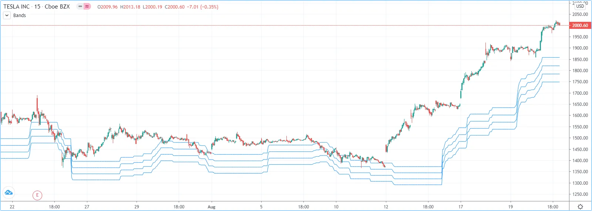

```pine
//@version=6
indicator("Bands", "", true)
//@variable The distance ratio between plotted price levels.
factorInput = 1 + (input.float(-2., "Step %") / 100)
//@variable A single-value array holding the lowest `ohlc4` value within a 50 bar window from 10 bars back.
level = array.new<float>(1, ta.lowest(ohlc4, 50)[10])

nextLevel(val) =>
    newLevel = level.get(0) * val
    // Write new level to the global `level` array so we can use it as the base in the next function call.
    level.set(0, newLevel)
    newLevel

plot(nextLevel(1))
plot(nextLevel(factorInput))
plot(nextLevel(factorInput))
plot(nextLevel(factorInput))
```

## [History referencing](../3. Language/language_arrays.md#history-referencing)

The history-referencing operator [\[\]](../../reference manual/operators/[].md) can
access the history of array variables, allowing scripts to interact with
past array instances previously assigned to a variable.

To illustrate this, let’s create a simple example to show how one can
fetch the previous bar’s `close` value in two equivalent ways. This
script uses the [\[\]](../../reference manual/operators/[].md)
operator to get the array instance assigned to `a` on the previous bar,
then uses an
[array.get()](../../reference manual/functions/array.get.md)
method call to retrieve the value of the first element (`previousClose1`).
For `previousClose2`, we use the history-referencing operator on the
`close` variable directly to retrieve the value. As we see from the
plots, `previousClose1` and `previousClose2` both return the same value:

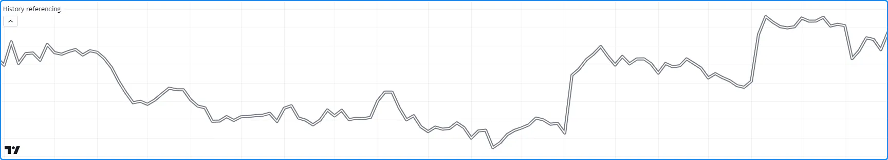

```pine
//@version=6
indicator("History referencing")

//@variable A single-value array declared on each bar.
a = array.new<float>(1)
// Set the value of the only element in `a` to `close`.
array.set(a, 0, close)

//@variable The array instance assigned to `a` on the previous bar.
previous = a[1]

previousClose1 = na(previous) ? na : previous.get(0)
previousClose2 = close[1]

plot(previousClose1, "previousClose1", color.gray, 6)
plot(previousClose2, "previousClose2", color.white, 2)
```

## [Inserting and removing array elements](../3. Language/language_arrays.md#inserting-and-removing-array-elements)

### [Inserting](../3. Language/language_arrays.md#inserting)

The following three functions can insert new elements into an array.

[array.unshift()](../../reference manual/functions/array.unshift.md)
inserts a new element at the beginning of an array (index 0) and
increases the index values of any existing elements by one.

[array.insert()](../../reference manual/functions/array.insert.md)
inserts a new element at the specified `index` and increases the index
of existing elements at or after the `index` by one.

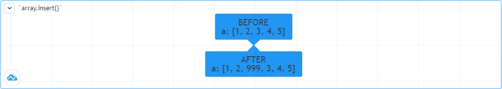

```pine
//@version=6
indicator("`array.insert()`")
a = array.new<float>(5, 0)
for i = 0 to 4
    array.set(a, i, i + 1)
if barstate.islast
    label.new(bar_index, 0, "BEFORE\na: " + str.tostring(a), size = size.large)
    array.insert(a, 2, 999)
    label.new(bar_index, 0, "AFTER\na: " + str.tostring(a), style = label.style_label_up, size = size.large)
```

[array.push()](../../reference manual/functions/array.push.md)
adds a new element at the end of an array.

### [Removing](../3. Language/language_arrays.md#removing)

These four functions remove elements from an array. The first three also
return the value of the removed element.

[array.remove()](../../reference manual/functions/array.remove.md)
removes the element at the specified `index` and returns that element’s
value.

[array.shift()](../../reference manual/functions/array.shift.md)
removes the first element from an array and returns its value.

[array.pop()](../../reference manual/functions/array.pop.md)
removes the last element of an array and returns its value.

[array.clear()](../../reference manual/functions/array.clear.md)
removes all elements from an array. Note that clearing an array won’t
delete any objects its elements referenced. See the example below that
illustrates how this works:

```pine
//@version=6
indicator("`array.clear()` example", overlay = true)

// Create a label array and add a label to the array on each new bar.
var a = array.new<label>()
label lbl = label.new(bar_index, high, "Text", color = color.red)
array.push(a, lbl)

var table t = table.new(position.top_right, 1, 1)
// Clear the array on the last bar. This doesn't remove the labels from the chart.
if barstate.islast
    array.clear(a)
    table.cell(t, 0, 0, "Array elements count: " + str.tostring(array.size(a)), bgcolor = color.yellow)
```

### [Using an array as a stack](../3. Language/language_arrays.md#using-an-array-as-a-stack)

Stacks are LIFO (last in, first out) constructions. They behave somewhat
like a vertical pile of books to which books can only be added or
removed one at a time, always from the top. Pine Script arrays can be
used as a stack, in which case we use the
[array.push()](../../reference manual/functions/array.push.md)
and
[array.pop()](../../reference manual/functions/array.pop.md)
functions to add and remove elements at the end of the array.

`array.push(prices, close)` will add a new element to the end of the
`prices` array, increasing the array’s size by one.

`array.pop(prices)` will remove the end element from the `prices` array,
return its value and decrease the array’s size by one.

See how the functions are used here to track successive lows in rallies:

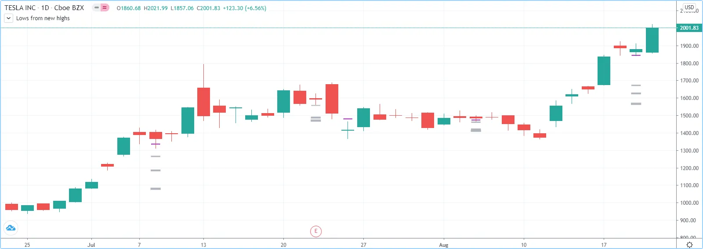

```pine
//@version=6
indicator("Lows from new highs", "", true)
var lows = array.new<float>(0)
flushLows = false

//@function Removes the last element from the `id` stack when `cond` is `true`.
array_pop(id, cond) => cond and array.size(id) > 0 ? array.pop(id) : float(na)

if ta.rising(high, 1)
    // Rising highs; push a new low on the stack.
    lows.push(low)
    // Force the return type of this `if` block to be the same as that of the next block.
    bool(na)
else if lows.size() >= 4 or low < array.min(lows)
    // We have at least 4 lows or price has breached the lowest low;
    // sort lows and set flag indicating we will plot and flush the levels.
    array.sort(lows, order.ascending)
    flushLows := true

// If needed, plot and flush lows.
lowLevel = array_pop(lows, flushLows)
plot(lowLevel, "Low 1", low > lowLevel ? color.silver : color.purple, 2, plot.style_linebr)
lowLevel := array_pop(lows, flushLows)
plot(lowLevel, "Low 2", low > lowLevel ? color.silver : color.purple, 3, plot.style_linebr)
lowLevel := array_pop(lows, flushLows)
plot(lowLevel, "Low 3", low > lowLevel ? color.silver : color.purple, 4, plot.style_linebr)
lowLevel := array_pop(lows, flushLows)
plot(lowLevel, "Low 4", low > lowLevel ? color.silver : color.purple, 5, plot.style_linebr)

if flushLows
    // Clear remaining levels after the last 4 have been plotted.
    lows.clear()
```

### [Using an array as a queue](../3. Language/language_arrays.md#using-an-array-as-a-queue)

Queues are FIFO (first in, first out) constructions. They behave
somewhat like cars arriving at a red light. New cars are queued at the
end of the line, and the first car to leave will be the first one that
arrived to the red light.

In the following code example, we let users decide through the script’s
inputs how many labels they want to have on their chart. We use that
quantity to determine the size of the array of labels we then create,
initializing the array’s elements to `na`.

When a new pivot is detected, we create a label for it, saving the
label’s ID in the `pLabel` variable. We then queue the ID of that label
by using
[array.push()](../../reference manual/functions/array.push.md)
to append the new label’s ID to the end of the array, making our array
size one greater than the maximum number of labels to keep on the chart.

Lastly, we de-queue the oldest label by removing the array’s first
element using
[array.shift()](../../reference manual/functions/array.shift.md)
and deleting the label referenced by that array element’s value. As we
have now de-queued an element from our queue, the array contains
`pivotCountInput` elements once again. Note that on the dataset’s first
bars we will be deleting `na` label IDs until the maximum number of
labels has been created, but this does not cause runtime errors. Let’s
look at our code:

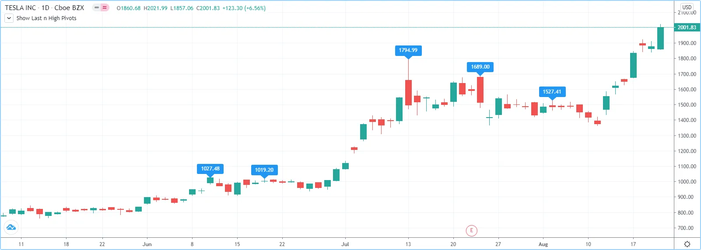

```pine
//@version=6
MAX_LABELS = 100
indicator("Show Last n High Pivots", "", true, max_labels_count = MAX_LABELS)

pivotCountInput = input.int(5, "How many pivots to show", minval = 0, maxval = MAX_LABELS)
pivotLegsInput  = input.int(3, "Pivot legs", minval = 1, maxval = 5)

// Create an array containing the user-selected max count of label IDs.
var labelIds = array.new<label>(pivotCountInput)

pHi = ta.pivothigh(pivotLegsInput, pivotLegsInput)
if not na(pHi)
    // New pivot found; plot its label `pivotLegsInput` bars behind the current `bar_index`.
    pLabel = label.new(bar_index - pivotLegsInput, pHi, str.tostring(pHi, format.mintick), textcolor = color.white)
    // Queue the new label's ID by appending it to the end of the array.
    array.push(labelIds, pLabel)
    // De-queue the oldest label ID from the queue and delete the corresponding label.
    label.delete(array.shift(labelIds))
```

## [Negative indexing](../3. Language/language_arrays.md#negative-indexing)

The [array.get()](../../reference manual/functions/array.get.md), [array.set()](../../reference manual/functions/array.set.md), [array.insert()](../../reference manual/functions/array.insert.md), and [array.remove()](../../reference manual/functions/array.remove.md) functions support _negative indexing_, which references elements starting from the end of the array. An index of `-1` refers to the last element in the array, an index of `-2` refers to the second to last element, and so on.

When using a _positive_ index, functions traverse the array _forwards_ from the beginning of the array ( _first to last_ element). The first element’s index is `0`, and the last element’s index is `array.size() - 1`. When using a _negative_ index, functions traverse the array _backwards_ from the end of the array ( _last to first_ element). The last element’s index is `-1`, and the first element’s index is `–array.size()`:

```pine
array<string> myArray = array.from("first", "second", "third", "fourth", "last")

// Positive indexing: Indexes forwards from the beginning of the array.
myArray.get(0)                        // Returns "first" element
myArray.get(myArray.size() - 1)       // Returns "last" element
myArray.get(4)                        // Returns "last" element

// Negative indexing: Indexes backwards from the end of the array.
myArray.get(-1)                       // Returns "last" element
myArray.get(-myArray.size())          // Returns "first" element
myArray.get(-5)                       // Returns "first" element
```

Like positive indexing, negative indexing is bound by the size of the array. For example, functions operating on an array of 5 elements only accept indices of 0 to 4 (first to last element) or -1 to -5 (last to first element). Any other indices are [out of bounds](../3. Language/language_arrays.md#index-xx-is-out-of-bounds-array-size-is-yy) and will raise a runtime error.

We can use negative indices to retrieve, update, add, and remove array elements. This simple script creates an “int” `countingArray` and calls the [array.get()](../../reference manual/functions/array.get.md), [array.set()](../../reference manual/functions/array.set.md), [array.insert()](../../reference manual/functions/array.insert.md), and [array.remove()](../../reference manual/functions/array.remove.md) functions to perform various array operations using negative indices. It displays each array operation and its corresponding result using a [table](../../reference manual/types/table.md):

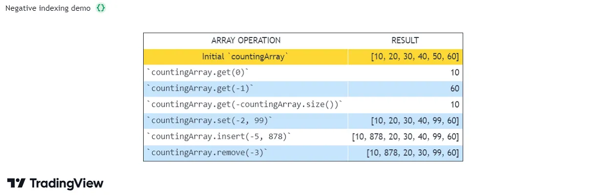

```pine
//@version=6
indicator("Negative indexing demo", overlay = false)

//@variable A table that displays various array operations and their results.
var table displayTable = table.new(
     position.middle_center, 2, 15, bgcolor = color.white,
     frame_color = color.black, frame_width = 1, border_width = 1
)

//@function Initializes a `displayTable` row to output a "string" of an `arrayOperation` and the `operationResult`.
displayRow(int rowID, string arrayOperation, operationResult) =>
    //@variable Is white if the `rowID` is even, light blue otherwise. Used to set alternating table row colors.
    color rowColor = rowID % 2 == 0 ? color.white : color.rgb(33, 149, 243, 75)
    // Display the `arrayOperation` in the row's first cell.
    displayTable.cell(0, rowID, arrayOperation, text_color = color.black,
         text_halign = text.align_left, bgcolor = rowColor, text_font_family = font.family_monospace
     )
    // Display the `operationResult` in the row's second cell.
    displayTable.cell(1, rowID, str.tostring(operationResult), text_color = color.black,
         text_halign = text.align_right, bgcolor = rowColor
     )

if barstate.islastconfirmedhistory
    //@variable Array of "int" numbers. Holds six multiples of 10, counting from 10 to 60.
    array<int> countingArray = array.from(10, 20, 30, 40, 50, 60)

    // Initialize the table's header cells.
    displayTable.cell(0, 0, "ARRAY OPERATION")
    displayTable.cell(1, 0, "RESULT")

    // Display the initial `countingArray` values.
    displayTable.cell(0, 1, "Initial `countingArray`",
         text_color = color.black, text_halign = text.align_center, bgcolor = color.yellow)
    displayTable.cell(1, 1, str.tostring(countingArray),
         text_color = color.black, text_halign = text.align_right, bgcolor = color.yellow)

    // Retrieve array elements using negative indices in `array.get()`.
    displayRow(2, "`countingArray.get(0)`", countingArray.get(0))
    displayRow(3, "`countingArray.get(-1)`", countingArray.get(-1))
    displayRow(4, "`countingArray.get(-countingArray.size())`", countingArray.get(-countingArray.size()))

    // Update array elements using negative indices in `array.set()` and `array.insert()`.
    countingArray.set(-2, 99)
    displayRow(5, "`countingArray.set(-2, 99)`", countingArray)

    countingArray.insert(-5, 878)
    displayRow(6, "`countingArray.insert(-5, 878)`", countingArray)

    // Remove array elements using negative indices in `array.remove()`.
    countingArray.remove(-3)
    displayRow(7, "`countingArray.remove(-3)`", countingArray)
```

Note that not all array operations can use negative indices. For example, [search functions](../3. Language/language_arrays.md#searching-arrays) like [array.indexof()](../../reference manual/functions/array.indexof.md) and [array.binary\_search()](../../reference manual/functions/array.binary_search.md) return the _positive_ index of an element if it’s found in the array. If the value is not found, the functions return `-1`. However, this returned value is **not** a negative index, and using it as one would incorrectly reference the last array element. If a script needs to use a search function’s returned index in subsequent array operations, it must appropriately differentiate between this `-1` result and other valid indices.

## [Calculations on arrays](../3. Language/language_arrays.md#calculations-on-arrays)

While series variables can be viewed as a horizontal set of values
stretching back in time, Pine Script’s one-dimensional arrays can be
viewed as vertical structures residing on each bar. As an array’s set
of elements is not a
[time series](../3. Language/language_execution-model.md#time-series),
Pine Script’s usual mathematical functions are not allowed on them.
Special-purpose functions must be used to operate on all of an array’s
values. The available functions are:
[array.abs()](../../reference manual/functions/array.abs.md),
[array.avg()](../../reference manual/functions/array.avg.md),
[array.covariance()](../../reference manual/functions/array.covariance.md),
[array.min()](../../reference manual/functions/array.min.md),
[array.max()](../../reference manual/functions/array.max.md),
[array.median()](../../reference manual/functions/array.median.md),
[array.mode()](../../reference manual/functions/array.mode.md),
[array.percentile\_linear\_interpolation()](../../reference manual/functions/array.percentile_linear_interpolation.md),
[array.percentile\_nearest\_rank()](../../reference manual/functions/array.percentile_nearest_rank.md),
[array.percentrank()](../../reference manual/functions/array.percentrank.md),
[array.range()](../../reference manual/functions/array.range.md),
[array.standardize()](../../reference manual/functions/array.standardize.md),
[array.stdev()](../../reference manual/functions/array.stdev.md),
[array.sum()](../../reference manual/functions/array.sum.md),
[array.variance()](../../reference manual/functions/array.variance.md).

Note that contrary to the usual mathematical functions in Pine Script,
those used on arrays do not return `na` when some of the values they
calculate on have `na` values. There are a few exceptions to this rule:

- When all array elements have `na` value or the array contains no
elements, `na` is returned. `array.standardize()` however, will
return an empty array.
- `array.mode()` will return `na` when no mode is found.

## [Manipulating arrays](../3. Language/language_arrays.md#manipulating-arrays)

### [Concatenation](../3. Language/language_arrays.md#concatenation)

Two arrays can be merged — or concatenated — using
[array.concat()](../../reference manual/functions/array.concat.md).
When arrays are concatenated, the second array is appended to the end of
the first, so the first array is modified while the second one remains
intact. The function returns the array ID of the first array:

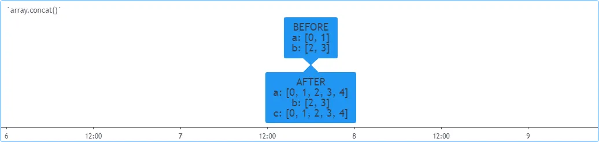

```pine
//@version=6
indicator("`array.concat()`")
a = array.new<float>(0)
b = array.new<float>(0)
array.push(a, 0)
array.push(a, 1)
array.push(b, 2)
array.push(b, 3)
if barstate.islast
    label.new(bar_index, 0, "BEFORE\na: " + str.tostring(a) + "\nb: " + str.tostring(b), size = size.large)
    c = array.concat(a, b)
    array.push(c, 4)
    label.new(bar_index, 0, "AFTER\na: " + str.tostring(a) + "\nb: " + str.tostring(b) + "\nc: " + str.tostring(c), style = label.style_label_up, size = size.large)
```

### [Copying](../3. Language/language_arrays.md#copying)

Scripts can create copies of an array by using [array.copy()](../../reference manual/functions/array.copy.md). This function creates a new array with the same elements and returns that array’s unique ID. Changes to a copied array do not directly affect the original.

For example, the following script creates a new array with `array.new<float>()` and assigns its ID to the `a` variable. Then, it calls `array.copy(a)` to copy that array, and it assigns the copied array’s ID to the `b` variable. Any changes to the array referenced by `b` do not affect the one referenced by `a`, because both variables refer to _separate_ array objects:

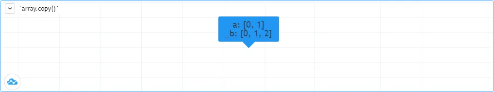

```pine
//@version=6
indicator("`array.copy()`")
a = array.new<float>(0)
array.push(a, 0)
array.push(a, 1)
if barstate.islast
    b = array.copy(a)
    array.push(b, 2)
    label.new(bar_index, 0, "a: " + str.tostring(a) + "\nb: " + str.tostring(b), size = size.large)
```

Note that assigning one variable’s stored array ID to another variable _does not_ create a copy of the referenced array. For example, if we use `b = a` instead of `b = array.copy(a)` in the above script, the `b` variable _does not_ reference a copy of the array referenced by `a`. Instead, both variables hold a reference to the _same_ array. In that case, the call `array.push(b, 2)` directly modifies the array referenced by `a`, and the label’s text shows identical results for the two variables.

### [Joining](../3. Language/language_arrays.md#joining)

The [array.join()](../../reference manual/functions/array.join.md) function converts an “int”, “float”, or “string” array’s elements into strings, then _joins_ each one to form a single “string” value with a specified `separator` inserted between each combined value. It provides a convenient alternative to converting values to strings with [str.tostring()](../../reference manual/functions/str.tostring.md) and performing repeated string concatenation operations.

The following script demonstrates the [array.join()](../../reference manual/functions/array.join.md) function’s behaviors. It requests [tuples](../3. Language/language_type-system.md#tuples) of “string”, “int”, and “float” values from three different contexts with [request.security()](../../reference manual/functions/request.security.md) calls, creates separate arrays for each type with [array.from()](../../reference manual/functions/array.from.md), then creates joined strings with the [array.join()](../../reference manual/functions/array.join.md) function. Lastly, it creates another array from those strings with [array.from()](../../reference manual/functions/array.from.md) and joins them with another [array.join()](../../reference manual/functions/array.join.md) call, using a newline as the separator, and displays the final string in the [table](../../reference manual/types/table.md):

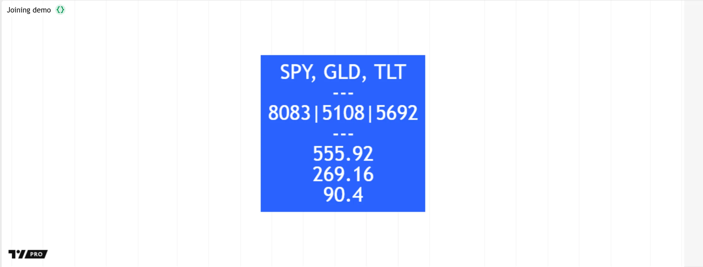

```pine
//@version=6
indicator("Joining demo")

//@function Returns a tuple containing the ticker ID ("string"), bar index ("int"), and closing price ("float").
dataRequest() =>
    [syminfo.tickerid, bar_index, close]

if barstate.islast
    //@variable A single-cell table displaying the results of `array.join()` calls.
    var table displayTable = table.new(position.middle_center, 1, 1, color.blue)
    // Request data for three symbols.
    [ticker1, index1, price1] = request.security("SPY", "", dataRequest())
    [ticker2, index2, price2] = request.security("GLD", "", dataRequest())
    [ticker3, index3, price3] = request.security("TLT", "", dataRequest())

    // Create separate "string", "int", and "float" arrays to hold the requested data.
    array<string> tickerArray = array.from(ticker1, ticker2, ticker3)
    array<int> indexArray = array.from(index1, index2, index3)
    array<float> priceArray = array.from(price1, price2, price3)

    // Convert each array's data to strings and join them with different separators.
    string joined1 = array.join(tickerArray, ", ")
    string joined2 = indexArray.join("|")
    string joined3 = priceArray.join("\n")

    //@variable A joined "string" containing the `joined1`, `joined2`, and `joined3` values.
    string displayText = array.from(joined1, joined2, joined3).join("\n---\n")
    // Initialize a cell to show the `displayText`.
    displayTable.cell(0, 0, displayText, text_color = color.white, text_size = 36)
```

Note that:

- Each [array.join()](../../reference manual/functions/array.join.md) call inserts the specified separator only between each element string. It does _not_ include the separator at the start or end of the returned value.
- The [array.join()](../../reference manual/functions/array.join.md) function uses the same numeric format as the default for [str.tostring()](../../reference manual/functions/str.tostring.md). See the [String conversion and formatting](../1. Concepts/concepts_strings.md#string-conversion-and-formatting) section of the [Strings](../1. Concepts/concepts_strings.md) page to learn more.
- Calls to [array.join()](../../reference manual/functions/array.join.md) cannot directly convert elements of “bool”, “color”, or other types to strings. Scripts must convert data of these types separately.

### [Sorting](../3. Language/language_arrays.md#sorting)

Scripts can _sort_ arrays containing values of the “int”, “float”, or “string” type by using the [array.sort()](../../reference manual/functions/array.sort.md) function. The function’s `order` parameter accepts one of the two `order.*` constants to specify the sorting order. If the argument is [order.ascending](../../reference manual/constants/order.ascending.md) (the default), a call to the function rearranges the specified array’s elements in ascending order by value. If the argument is [order.descending](../../reference manual/constants/order.descending.md), the call rearranges the elements in descending order instead.

If an array contains “int” or “float” elements, the [array.sort()](../../reference manual/functions/array.sort.md) function sorts the array using each element’s numeric value. If it uses ascending order, the element with the _lowest_ value becomes the array’s _first_ element (at index 0), and the one with the _highest_ value becomes the _last_ element. If it sorts in descending order, the element with the _highest_ value becomes the first element, and the one with the _lowest_ value becomes the last.

The following example script uses the [array.from()](../../reference manual/functions/array.from.md) function to create an array of arbitrary “float” values on the last historical bar. It then sorts the array in ascending order, and then in descending order, using two [array.sort()](../../reference manual/functions/array.sort.md) calls. The script creates a string representation of the array after each step, then formats those representations into a single string and displays the result in a [label](../2. Visuals/visuals_text-and-shapes.md#labels):

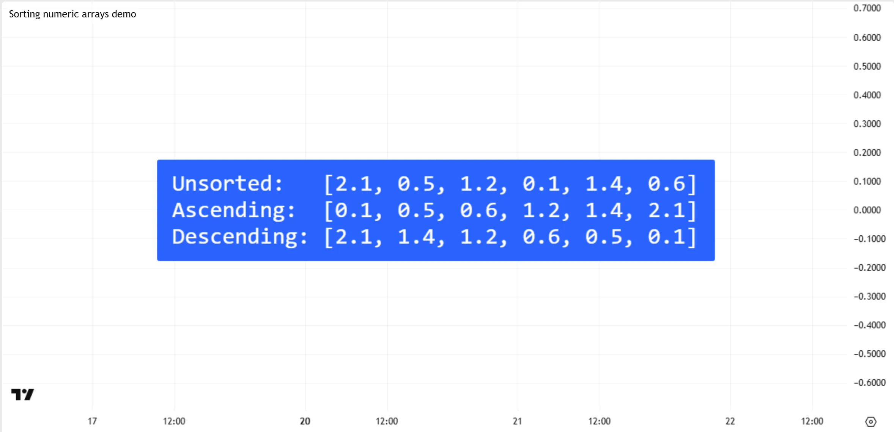

```pine
//@version=6
indicator("Sorting numeric arrays demo")

if barstate.islastconfirmedhistory
    //@variable References an array of arbitrary "float" values.
    array<float> numbers = array.from(2.1, 0.5, 1.2, 0.1, 1.4, 0.6)
    //@variable A string representing the array's unsorted, ascending, and descending order.
    string displayStr = "Unsorted:   " + str.tostring(numbers) + "\n"

    // Sort the array in ascending order.
    // The `order` argument is optional; `order.ascending` is the default.
    array.sort(numbers, order = order.ascending)
    // Concatenate a string representation of the sorted array with the `displayStr` value.
    displayStr += "Ascending:  " + str.tostring(numbers) + "\n"

    // Sort the `numbers` array again, this time in descending order.
    numbers.sort(order = order.descending)
    // Concatenate another string representation of the sorted result.
    displayStr += "Descending: " + str.tostring(numbers)

    // Display the final string's text in a label.
    label.new(
        bar_index, 0, displayStr, style = label.style_label_center, size = 30,
        textalign = text.align_left, text_font_family = font.family_monospace
    )
```

If an array contains “string” elements, the [array.sort()](../../reference manual/functions/array.sort.md) function sorts the elements based on the [Unicode](https://en.wikipedia.org/wiki/Unicode) values of the strings’ _individual characters_. The sorting algorithm initially compares the _first_ character in each string, then compares subsequent characters as necessary if multiple strings have matching characters at the same position. The strings that have leading characters with the lowest Unicode values move to the beginning of the array if the order is ascending, or to the end of the array if the order is descending.

The example script below defines an arbitrary [literal string](../1. Concepts/concepts_strings.md#literal-strings), then uses the [str.split()](../../reference manual/functions/str.split.md) function to [split](../1. Concepts/concepts_strings.md#splitting-strings) the string and construct an array of substrings. Afterward, the script calls the [array.sort()](../../reference manual/functions/array.sort.md) function to sort the array’s elements in ascending order. The script displays formatted text representing the original string, and the array’s structure before and after sorting, in a label on the last historical bar:

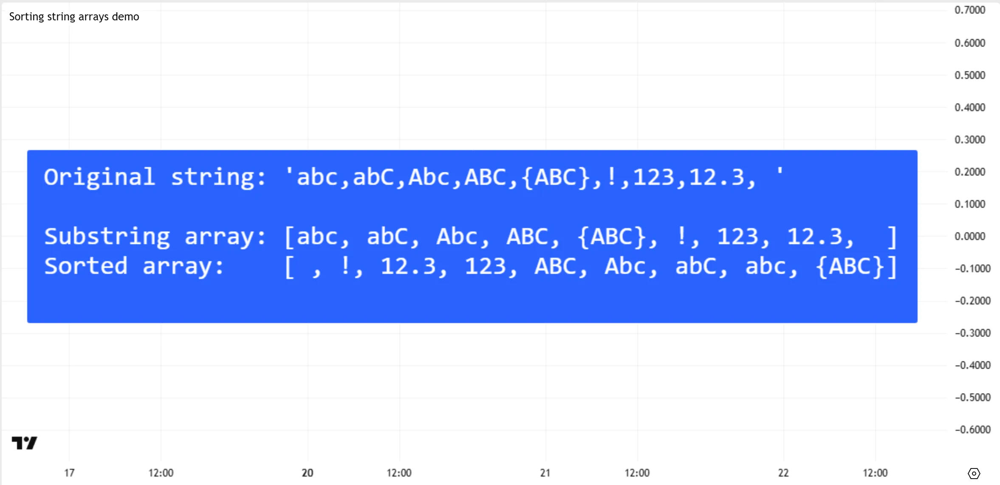

```pine
//@version=6
indicator("Sorting string arrays demo")

if barstate.islastconfirmedhistory
    //@variable A literal string to split at each `,` character.
    string originalStr = "abc,abC,Abc,ABC,{ABC},!,123,12.3, "

    //@variable References an array of substrings formed by splitting the original string at each comma.
    array<string> splitStrArray = str.split(originalStr, ",")

    //@variable A string to represent the original string and the array of substrings.
    string displayStr = str.format("Original string: ''{0}''\n\nSubstring array: {1}\n", originalStr, splitStrArray)

    // Sort the array in ascending order, based on the Unicode values of characters in each string.
    splitStrArray.sort()
    // Concatenate a string representing the sorted result.
    displayStr += str.format("Sorted array:    {0}\n", splitStrArray)

    // Display the final `displayStr` value's text in a label.
    label.new(
        bar_index, 0, displayStr, style = label.style_label_center, size = 30,
        textalign = text.align_left, text_font_family = font.family_monospace
    )
```

Note that:

- The `" "` string appears first in the sorted array because standard whitespace and control characters have the _lowest_ Unicode values (U+0000 - U+0020). The space character’s Unicode value is U+0020.
- ASCII _digits_ (U+0030 - U+0039) have _lower_ Unicode values than all _letter_ characters. Therefore, the sorted array lists all strings that start with digits before those that start with letters.
- _Uppercase_ ASCII letters (U+0041 - U+005A) have lower Unicode values than _lowercase_ ASCII letters (U+0061 - U+007A). Therefore, strings that start with `A` appear _before_ those that start with `a` in the sorted array.
- Some ASCII punctuation marks and symbols have lower Unicode values than ASCII letters or digits, and some others have Unicode values that are between or higher than those of such characters. For instance, the sorted array lists the `"!"` string before other strings except for `" "` because the Unicode value of `!` is U+0021. By contrast, it lists the `"{ABC}"` string at the end because the `{` character’s Unicode value is U+007B.

Every [array.sort()](../../reference manual/functions/array.sort.md) call directly _changes_ the positions of elements in the original array, as demonstrated above. However, in some cases, a programmer might need to access an array’s elements in a sorted order _without_ rearranging the array itself.

To access an array’s sorted elements without modifying the array, programmers can use the [array.sort\_indices()](../../reference manual/functions/array.sort_indices.md) function. This function creates a _separate_ “int” array containing the _indices_ of the original array’s elements, organized in the _sorted order_ for those elements. Scripts can use the indices in the resulting array to [read](../3. Language/language_arrays.md#reading-and-writing-array-elements) the original array’s elements in the specified order ( [order.ascending](../../reference manual/constants/order.ascending.md) by default) while also preserving the original array’s unsorted order for other calculations.

The following example script queues [close](../../reference manual/variables/close.md) values into a persistent array across the chart. It calls the [array.sort\_indices()](../../reference manual/functions/array.sort_indices.md) function on the last historical bar to get the ID of an array containing sorted indices, and constructs a string representation of both arrays. Then, it loops through the array of indices using a [for…in](../../reference manual/keywords/for...in.md) loop. On each iteration, the script concatenates the string with another string representing a value from the `prices` array, that value’s index in the array, and the value’s sorted position. It then displays the final string in a label:

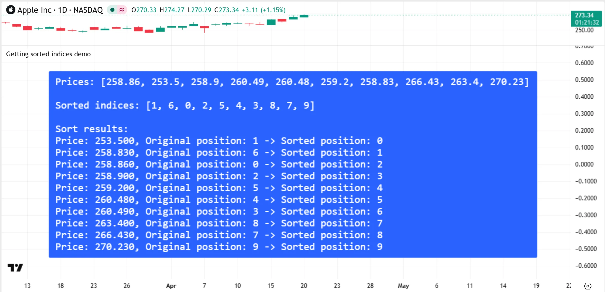

```pine
//@version=6
indicator("Getting sorted indices demo")

//@variable References a persistent array that stores the last 10 `close` values.
var array<float> prices = array.new<float>(10)
// Push a new value to the end of the array, and remove the oldest (first) element.
prices.push(close)
prices.shift()

if barstate.islastconfirmedhistory
    //@variable References an "int" array containing the `prices` array indices in ascending order by element value.
    //          The `array.sort_indices()` call maps sorted positions in the array without modifying it.
    array<int> indices = prices.sort_indices()
    //@variable A formatted string to display in a label.
    string displayStr = str.format("Prices: {0}\n\nSorted indices: {1}\n\nSort results:", prices, indices)

    // Loop through the `indices` array.
    // The `i` variable stores the current index of the `indices` array's element.
    // The `index` variable stores that element's value (the index for one of the `prices` array's elements).
    // Using `index` to retrieve `prices` array's elements accesses those elements in ascending order.
    for [i, index] in indices
        // Concatenate the `displayStr` value with a string representing the sorted `prices` array element,
        // the original position (index) of the element, and the sorted position of that element.
        displayStr += str.format(
            "\nPrice: {0,number,0.000}, Original position: {1} -> Sorted position: {2}",
            prices.get(index), index, i
        )
    // Display the final string's text in a label.
    label.new(
        bar_index, 0, displayStr, style = label.style_label_center, size = 20,
        textalign = text.align_left, text_font_family = font.family_monospace
    )
```

#### [Sorting arrays of user-defined types](../3. Language/language_arrays.md#sorting-arrays-of-user-defined-types)

The [array.sort()](../../reference manual/functions/array.sort.md) and [array.sort\_indices()](../../reference manual/functions/array.sort_indices.md) functions can also sort arrays whose elements refer to [objects](../3. Language/language_objects.md) of [user-defined types (UDTs)](../3. Language/language_type-system.md#user-defined-types). For such arrays, the functions compare values from one of the “int”, “float”, or “string” _fields_ of each object referenced by the array’s elements, using the sorting rules described in the [Sorting](../3. Language/language_arrays.md#sorting) section above.

The `sort_field` parameter of these functions specifies _which_ object field they analyze to sort a UDT array’s elements. The parameter can specify a field using either a _“const int”_ or _“const string”_ argument:

- A “const int” argument specifies a field by its _field index_, where a value of 0 refers to the _first_ field listed in the [type declaration](../3. Language/language_type-system.md#user-defined-types), 1 refers to the _second_ field, and so on. The value can be any non-negative, non-na number up to one less than the total number of fields.
- A “const string” argument specifies a field by its _identifier (name)_. The string must literally match one of the field names listed in the type declaration.

The default `sort_field` value is 0, meaning that an [array.sort()](../../reference manual/functions/array.sort.md) or [array.sort\_indices()](../../reference manual/functions/array.sort_indices.md) call attempts to compare values from the first field of each object referenced by the specified array if no argument is specified.

The following example script demonstrates the sorting behavior for arrays of UDT elements. The script declares a custom type named `myType` with three fields: `field0`, `field1`, and `field2`. On the last historical bar, it creates five `myType` objects, stores their IDs in an array, then executes an [array.sort()](../../reference manual/functions/array.sort.md) call to sort the array in ascending order using each object’s first, second, or third field, depending on the selected [inputs](../1. Concepts/concepts_inputs.md). The script loops through the sorted array using a [for…in](../../reference manual/keywords/for...in.md) loop to create a custom string representation of its structure, then displays the resulting string’s text in a label:

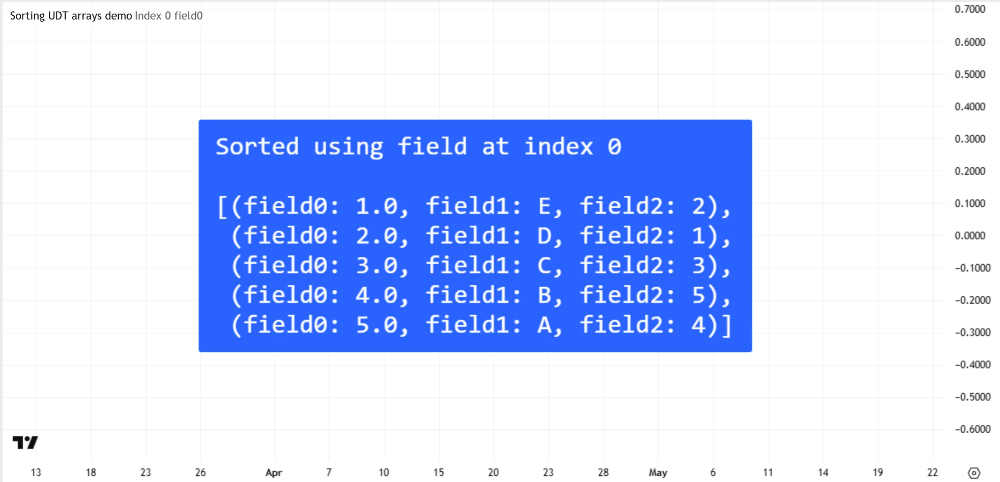

```pine
//@version=6
indicator("Sorting UDT arrays demo")

//@type  A custom type for creating objects that store "float", "string", and "int" values.
type myType
    float  field0 // This field's index is 0.
    string field1 // This field's index is 1.
    int    field2 // This field's index is 2.

//@variable A string to indicate whether the script specifies sorting fields by index or name.
string specifyInput = input.string("Index", "Specify a field using its", ["Index", "Name"])
//@variable The index of the field to use for sorting if the `specifyInput` value is `"Index"`.
int indexInput = input.int(0, "Field index", 0, 2, active = specifyInput == "Index")
//@variable The name of the field to use for sorting if the `specifyInput` value is `"Name"`.
string nameInput = input.string("field0", "Field name", ["field0", "field1", "field2"], active = specifyInput == "Name")

if barstate.islastconfirmedhistory
    //@variable References an array that stores the IDs of `myType` objects.
    array<myType> udtArray = array.from(
        myType.new(field0 = 2.0, field1 = "D", field2 = 1), myType.new(field0 = 1.0, field1 = "E", field2 = 2),
        myType.new(field0 = 3.0, field1 = "C", field2 = 3), myType.new(field0 = 5.0, field1 = "A", field2 = 4),
        myType.new(field0 = 4.0, field1 = "B", field2 = 5)
    )
    // Sort the array in ascending order. Use the field at the specified index if the `specifyInput` value is `"Index"`.
    if specifyInput == "Index"
        switch indexInput
            0 => udtArray.sort(sort_field = 0)
            1 => udtArray.sort(sort_field = 1)
            2 => udtArray.sort(sort_field = 2)
    // Otherwise, sort using the field with the specified name.
    else
        switch nameInput
            "field0"  => udtArray.sort(sort_field = "field0")
            "field1"  => udtArray.sort(sort_field = "field1")
            "field2"  => udtArray.sort(sort_field = "field2")

    //@variable A string representing the structure of the sorted array.
    string displayStr = switch specifyInput
        "Index" => str.format("Sorted using field at index {0}\n\n[", indexInput)\
        =>         str.format("Sorted using field named ''{0}''\n\n[",    nameInput)\
\
    // Concatenate formatted strings to represent the array's structure.\
    for [i, id] in udtArray\
        displayStr += str.format(\
            " (field0: {0,number,0.0}, field1: {1}, field2: {2}),\n",\
            id.field0, id.field1, id.field2\
        )\
    // Adjust the final result to align enclosing brackets.\
    displayStr := str.replace(str.substring(displayStr, 0, str.length(displayStr) - 2), "[ ", "[") + "]"\
    // Display the final string's text in a label.\
    label.new(\
        bar_index, 0, displayStr, style = label.style_label_center, size = 30,\
        textalign = text.align_left, text_font_family = font.family_monospace\
    )\
```\
\
Note that:\
\
- The `sort_field` parameter accepts only values that have the _“const”_ [qualifier](../3. Language/language_type-system.md#qualifiers); it cannot accept values qualified as “input”, “simple”, or “series”. Therefore, to sort the array using an input-specified field, this script uses a _separate_ [array.sort()](../../reference manual/functions/array.sort.md) call for each input combination.\
\
It’s important to emphasize that the [array.sort()](../../reference manual/functions/array.sort.md) and [array.sort\_indices()](../../reference manual/functions/array.sort_indices.md) functions can sort UDT arrays only by referencing object fields of the type “int”, “float”, or “string”. They cannot sort elements using fields of any other type.\
\
For example, the following script declares a custom `myColor` type whose first field is of the type “color”. It creates an array of `myColor` IDs, then attempts to sort the array using an [array.sort()](../../reference manual/functions/array.sort.md) call. The call does not include a `sort_field` argument, so it references each object’s _first_ field, which is _incompatible_ with the sorting algorithm. Consequently, a _compilation error_ occurs:\
\
[Pine Script®](https://tradingview.com/pine-script-docs)\
Copied\
\
``//@version=6\
indicator("Incompatible sorting field demo", overlay = true)\
\
//@type  A custom type for creating objects that contain color information.\
type myColor\
    color c // Index 0.\
    float r // Index 1.\
    float g // Index 2.\
    float b // Index 3.\
\
//@function Creates a new `myColor` instance with pseudorandom field values.\
randColor() =>\
    color c = color.rgb(math.random(0, 128), math.random(128, 255), math.random(128, 255))\
    myColor.new(c = c, r = color.r(c), g = color.g(c), b = color.b(c))\
\
//@variable References an array of `myColor` IDs.\
var array<myColor> arr = array.new<myColor>()\
\
if barstate.isfirst\
    // Populate the array with 10 `myColor` IDs.\
    for i = 1 to 10\
        arr.push(randColor())\
\
    // Call `array.sort()` using the default `sort_field` argument (0).\
    // This call causes a *compilation error*, because the `array.sort()` function cannot sort "color" values.\
    arr.sort()\
\
//@variable The index of the array element to retrieve.\
int ind = nz(int(math.round(9 * (close - low) / (high - low))))\
\
//@variable The `myColor` ID stored at index `ind`.\
myColor id = arr.get(ind)\
\
// Color the bar using the `id.c` value.\
barcolor(id.c)\
``\
\
To resolve the error, we can either rearrange the type declaration to list one of the type’s “float” fields as the _first_ one, or include a `sort_field` argument in the [array.sort()](../../reference manual/functions/array.sort.md) call to specify one of those fields. For example:\
\
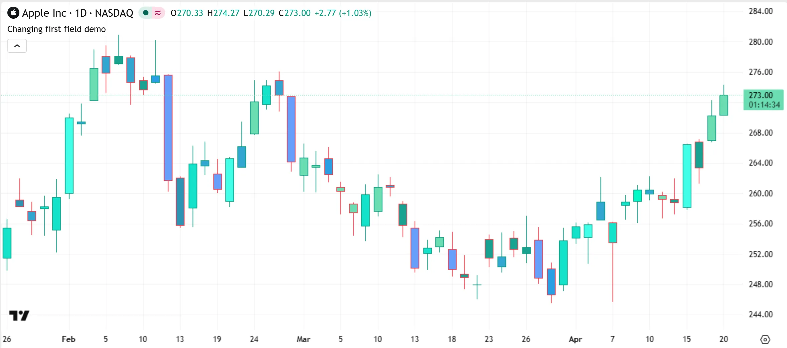\
\
[Pine Script®](https://tradingview.com/pine-script-docs)\
Copied\
\
``//@version=6\
indicator("Changing first field demo", overlay = true)\
\
//@type  A custom type for creating objects that contain color information.\
type myColor\
    float g // Moved to index 0.\
    color c // Moved to index 1.\
    float r // Moved to index 2.\
    float b // Moved to index 3.\
\
//@function Creates a new `myColor` instance with pseudorandom field values.\
randColor() =>\
    color c = color.rgb(math.random(0, 128), math.random(128, 255), math.random(128, 255))\
    myColor.new(c = c, r = color.r(c), g = color.g(c), b = color.b(c))\
\
//@variable References an array of `myColor` IDs.\
var array<myColor> arr = array.new<myColor>()\
\
if barstate.isfirst\
    // Populate the array with 10 `myColor` IDs.\
    for i = 1 to 10\
        arr.push(randColor())\
\
    // This call does *not* cause an error, because the default `sort_field` argument now refers\
    // to the type's `g` field ("float").\
    arr.sort()\
\
//@variable The index of the array element to retrieve.\
int ind = nz(int(math.round(9 * (close - low) / (high - low))))\
\
//@variable The `myColor` ID stored at index `ind`.\
myColor id = arr.get(ind)\
\
// Color the bar using the `id.c` value.\
barcolor(id.c)\
``\
\
The [array.sort](../../reference manual/functions/array.sort.md) and [array.sort\_indices](../../reference manual/functions/array.sort_indices.md) functions can sort UDT arrays whose referenced objects have “int”, “float”, or “string” fields that contain [`na` values](../3. Language/language_type-system.md#na-value). However, these functions **cannot** sort UDT arrays that contain [na](../../reference manual/variables/na.md) _elements_. In a UDT array, an [na](../../reference manual/variables/na.md) element represents a _nonexistent ID_, meaning that there is _no associated object_ that contains the field required for sorting. Consequently, attempting to sort a UDT array with one or more [na](../../reference manual/variables/na.md) elements causes a _runtime error_.\
\
For example, the script below declares a type named `Number` with a single “float” field named `value`. On the last historical bar, it creates an array containing multiple `Number` IDs, two of which are [na](../../reference manual/variables/na.md). Calling [array.sort()](../../reference manual/functions/array.sort.md) to rearrange that array causes an error, because the [na](../../reference manual/variables/na.md) elements in the array do not refer to valid `Number` objects:\
\
[Pine Script®](https://tradingview.com/pine-script-docs)\
Copied\
\
``//@version=6\
indicator("Cannot sort `na` IDs demo")\
\
//@variable A custom type for creating objects that store a single "float" value.\
type Number\
    float value\
\
if barstate.islastconfirmedhistory\
    //@variable References an array of `Number` IDs, two of which are `na`.\
    array<Number> numbers = array.from(Number.new(1.2), na, Number.new(5.4), na, Number.new(3.14))\
\
    // This call causes a runtime error. The `na` elements do not refer to valid `Number` objects, so the function\
    // cannot access `value` fields for sorting.\
    numbers.sort()\
\
    //@variable A string representing the array's structure.\
    string displayStr = "["\
    // Concatenate a string representing the `value` field from each object referenced by the sorted array.\
    for number in numbers\
        displayStr += str.tostring(number.value) + ", "\
    // Remove the final `", "` sequence and add a closing bracket.\
    displayStr := str.substring(displayStr, 0, str.length(displayStr) - 2) + "]"\
    // Display the resulting string's text in a label.\
    label.new(bar_index, 0, displayStr, style = label.style_label_center, size = 40, textalign = text.align_left)\
``\
\
To prevent such errors, _remove_ all [na](../../reference manual/variables/na.md) IDs from a UDT array before using the [array.sort()](../../reference manual/functions/array.sort.md) or [array.sort\_indices()](../../reference manual/functions/array.sort_indices.md) function on it, or _replace_ them with the IDs of _new_ objects that contain [na](../../reference manual/variables/na.md) _fields_ instead.\
\
For example, the script version below includes a [user-defined function](../3. Language/language_user-defined-functions.md) named `replaceNa()`, which replaces [na](../../reference manual/variables/na.md)`Number` IDs in an array with the IDs of new objects that contain [na](../../reference manual/variables/na.md)`value` fields. Using this function before sorting the array with the [array.sort()](../../reference manual/functions/array.sort.md) call prevents the runtime error:\
\
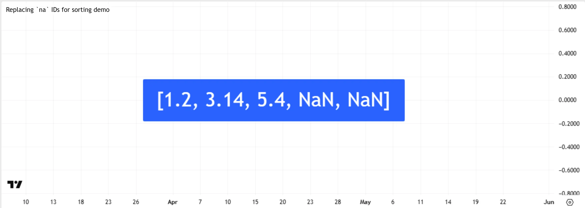\
\
[Pine Script®](https://tradingview.com/pine-script-docs)\
Copied\
\
``//@version=6\
indicator("Replacing `na` IDs for sorting demo")\
\
//@variable A custom type for creating objects that store a single "float" value.\
type Number\
    float value\
\
//@function Replaces `na` instances in a specified `Number` array with the IDs of new `Number` objects with `na` fields.\
replaceNa(array<Number> arrID) =>\
    if array.includes(arrID, na)\
        // Loop through the array referenced by `arrID`.\
        for [i, objID] in arrID\
            // If the `objID` variable stores `na`, replace the element at index `i` with a new `Number` ID.\
            if na(objID)\
                arrID.set(i, Number.new())\
\
if barstate.islastconfirmedhistory\
    //@variable References an array of `Number` IDs, two of which are `na`.\
    array<Number> numbers = array.from(Number.new(1.2), na, Number.new(5.4), na, Number.new(3.14))\
    // If we call `replaceNa()` before sorting the array, no error occurs, because all elements now refer\
    // to a valid `Number` object.\
    replaceNa(numbers)\
    numbers.sort()\
\
    //@variable A string representing the array's structure.\
    string displayStr = "["\
    // Concatenate a string representing the `value` field from each object referenced by the sorted array.\
    for number in numbers\
        displayStr += str.tostring(number.value) + ", "\
    // Remove the final `", "` sequence and add a closing bracket.\
    displayStr := str.substring(displayStr, 0, str.length(displayStr) - 2) + "]"\
    // Display the resulting string's text in a label.\
    label.new(bar_index, 0, displayStr, style = label.style_label_center, size = 40, textalign = text.align_left)\
``\
\
Note that:\
\
- This example moves the IDs of all objects with an [na](../../reference manual/variables/na.md)`value` field to the _end_ of the array because the script’s [array.sort()](../../reference manual/functions/array.sort.md) call sorts the array’s elements in ascending order. If we use [order.descending](../../reference manual/constants/order.descending.md) as the `order` argument, those elements move to the _beginning_ of the array instead.\
\
### [Reversing](../3. Language/language_arrays.md#reversing)\
\
Use\
[array.reverse()](../../reference manual/functions/array.reverse.md)\
to reverse an array:\
\
[Pine Script®](https://tradingview.com/pine-script-docs)\
Copied\
\
``//@version=6\
indicator("`array.reverse()`")\
a = array.new<float>(0)\
array.push(a, 0)\
array.push(a, 1)\
array.push(a, 2)\
if barstate.islast\
    array.reverse(a)\
    label.new(bar_index, 0, "a: " + str.tostring(a))\
``\
\
### [Slicing](../3. Language/language_arrays.md#slicing)\
\
Slicing an array using\
[array.slice()](../../reference manual/functions/array.slice.md)\
creates a shallow copy of a subset of the parent array. You determine\
the size of the subset to slice using the `index_from` and `index_to`\
parameters. The `index_to` argument must be one greater than the end of\
the subset you want to slice.\
\
The shallow copy created by the slice acts like a window on the parent\
array’s content. The indices used for the slice define the window’s\
position and size over the parent array. If, as in the example below, a\
slice is created from the first three elements of an array (indices 0 to\
2), then regardless of changes made to the parent array, and as long as\
it contains at least three elements, the shallow copy will always\
contain the parent array’s first three elements.\
\
Additionally, once the shallow copy is created, operations on the copy\
are mirrored on the parent array. Adding an element to the end of the\
shallow copy, as is done in the following example, will widen the window\
by one element and also insert that element in the parent array at index\
3\. In this example, to slice the subset from index 0 to index 2 of array\
`a`, we must use `sliceOfA = array.slice(a, 0, 3)`:\
\
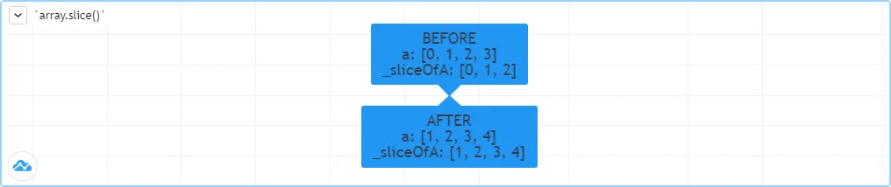\
\
[Pine Script®](https://tradingview.com/pine-script-docs)\
Copied\
\
``//@version=6\
indicator("`array.slice()`")\
a = array.new<float>(0)\
array.push(a, 0)\
array.push(a, 1)\
array.push(a, 2)\
array.push(a, 3)\
if barstate.islast\
    // Create a shadow of elements at index 1 and 2 from array `a`.\
    sliceOfA = array.slice(a, 0, 3)\
    label.new(bar_index, 0, "BEFORE\na: " + str.tostring(a) + "\nsliceOfA: " + str.tostring(sliceOfA))\
    // Remove first element of parent array `a`.\
    array.remove(a, 0)\
    // Add a new element at the end of the shallow copy, thus also affecting the original array `a`.\
    array.push(sliceOfA, 4)\
    label.new(bar_index, 0, "AFTER\na: " + str.tostring(a) + "\nsliceOfA: " + str.tostring(sliceOfA), style = label.style_label_up)\
``\
\
## [Searching arrays](../3. Language/language_arrays.md#searching-arrays)\
\
We can test if a value is part of an array with the\
[array.includes()](../../reference manual/functions/array.includes.md)\
function, which returns true if the element is found. We can find the\
first occurrence of a value in an array by using the\
[array.indexof()](../../reference manual/functions/array.indexof.md)\
function. The first occurrence is the one with the lowest index. We can\
also find the last occurrence of a value with\
[array.lastindexof()](../../reference manual/functions/array.lastindexof.md):\
\
[Pine Script®](https://tradingview.com/pine-script-docs)\
Copied\
\
`//@version=6\
indicator("Searching in arrays")\
valueInput = input.int(1)\
a = array.new<float>(0)\
array.push(a, 0)\
array.push(a, 1)\
array.push(a, 2)\
array.push(a, 1)\
if barstate.islast\
    valueFound      = array.includes(a, valueInput)\
    firstIndexFound = array.indexof(a, valueInput)\
    lastIndexFound  = array.lastindexof(a, valueInput)\
    label.new(bar_index, 0, "a: " + str.tostring(a) +\
      "\nFirst " + str.tostring(valueInput) + (firstIndexFound != -1 ? " value was found at index: " + str.tostring(firstIndexFound) : " value was not found.") +\
      "\nLast " + str.tostring(valueInput)  + (lastIndexFound  != -1 ? " value was found at index: " + str.tostring(lastIndexFound) : " value was not found."))\
`\
\
We can also perform a binary search on an array but note that performing\
a binary search on an array means that the array will first need to be\
sorted in ascending order only. The\
[array.binary\_search()](../../reference manual/functions/array.binary_search.md)\
function will return the value’s index if it was found or -1 if it\
wasn’t. If we want to always return an existing index from the array\
even if our chosen value wasn’t found, then we can use one of the other\
binary search functions available. The\
[array.binary\_search\_leftmost()](../../reference manual/functions/array.binary_search_leftmost.md)\
function, which returns an index if the value was found or the first\
index to the left where the value would be found. The\
[array.binary\_search\_rightmost()](../../reference manual/functions/array.binary_search_rightmost.md)\
function is almost identical and returns an index if the value was found\
or the first index to the right where the value would be found.\
\
## [Error handling](../3. Language/language_arrays.md#error-handling)\
\
Malformed `array.*()` call syntax in Pine scripts will cause the usual\
**compiler** error messages to appear in Pine Editor’s console, at the\
bottom of the window, when you save a script. Refer to the Pine Script\
[v6 Reference 
Manual](https://www.tradingview.com/pine-script-reference/v6/) when in\
doubt regarding the exact syntax of function calls.\
\
Scripts using arrays can also throw **runtime** errors, which appear as\
an exclamation mark next to the indicator’s name on the chart. We\
discuss some of the most common runtime errors in this section.\
\
### [Index xx is out of bounds. Array size is yy](../3. Language/language_arrays.md#index-xx-is-out-of-bounds-array-size-is-yy)\
\
This error is the most frequent one programmers encounter when using arrays. The error occurs when the script references a _nonexistent_ array index. The “xx”\
value represents the out-of-bounds index the function tried to use, and “yy” represents the array’s size. Recall that array indices start at zero — not one — and end at the array’s size, minus one. For instance, the last valid index in a three-element array is `2`.\
\
To avoid this error, you must make provisions in your code logic to prevent using an index value outside the array’s boundaries. This code example generates the error because the last `i` value in the loop’s iterations is beyond the valid index range for the `a` array:\
\
[Pine Script®](https://tradingview.com/pine-script-docs)\
Copied\
\
`//@version=6\
indicator("Out of bounds index")\
a = array.new<float>(3)\
for i = 1 to 3\
    array.set(a, i, i)\
plot(array.pop(a))\
`\
\
To resolve the error, last `i` value in the loop statement should be less than or equal to 2:\
\
[Pine Script®](https://tradingview.com/pine-script-docs)\
Copied\
\
`for i = 0 to 2\
`\
\
To iterate over all elements in an array of _unknown_ size with a [for](../3. Language/language_loops.md#for-loops) loop, set the loop counter’s final value to one less than the [array.size()](../../reference manual/functions/array.size.md) value:\
\
[Pine Script®](https://tradingview.com/pine-script-docs)\
Copied\
\
``//@version=6\
indicator("Protected `for` loop")\
sizeInput = input.int(0, "Array size", minval = 0, maxval = 100000)\
a = array.new<float>(sizeInput)\
for i = 0 to (array.size(a) == 0 ? na : array.size(a) - 1)\
    array.set(a, i, i)\
plot(array.pop(a))\
``\
\
When sizing arrays dynamically using a field in the script’s\
_Settings/Inputs_ tab, protect the boundaries of that value using\
[input.int()](../../reference manual/functions/input.int.md)‘s\
`minval` and `maxval` parameters:\
\
[Pine Script®](https://tradingview.com/pine-script-docs)\
Copied\
\
`//@version=6\
indicator("Protected array size")\
sizeInput = input.int(10, "Array size", minval = 1, maxval = 100000)\
a = array.new<float>(sizeInput)\
for i = 0 to sizeInput - 1\
    array.set(a, i, i)\
plot(array.size(a))\
`\
\
See the [Looping through array elements](../3. Language/language_arrays.md#looping-through-array-elements)\
section of this page for more information.\
\
### [Cannot call array methods when ID of array is ‘na’](../3. Language/language_arrays.md#cannot-call-array-methods-when-id-of-array-is-na)\
\
If an array variable is initialized with [na](../../reference manual/variables/na.md), using `array.*()` functions on that variable is _not allowed_, because the variable does not store the ID of an existing array. Note that an empty array containing no elements still has a valid ID. A variable that references an empty array still holds a valid ID, whereas a variable that stores [na](../../reference manual/variables/na.md) does not. The code below demonstrates this error:\
\
[Pine Script®](https://tradingview.com/pine-script-docs)\
Copied\
\
``//@version=6\
indicator("Array methods on `na` array")\
array<int> a = na\
array.push(a, 111)\
label.new(bar_index, 0, "a: " + str.tostring(a))\
``\
\
To avoid the error, create an empty array and assign its reference to the variable instead. For example:\
\
[Pine Script®](https://tradingview.com/pine-script-docs)\
Copied\
\
`array<int> a = array.new<int>(0)\
`\
\
Note that the `array<int>` type identifier in the above declaration is optional. We can define the variable without it. For example:\
\
[Pine Script®](https://tradingview.com/pine-script-docs)\
Copied\
\
`a = array.new<int>(0)\
`\
\
### [Array is too large. Maximum size is 100000](../3. Language/language_arrays.md#array-is-too-large-maximum-size-is-100000)\
\
This error appears if your code attempts to declare an array with a\
size greater than 100,000. It will also occur if, while dynamically\
appending elements to an array, a new element would increase the\
array’s size past the maximum.\
\
### [Cannot create an array with a negative size](../3. Language/language_arrays.md#cannot-create-an-array-with-a-negative-size)\
\
We haven’t found any use for arrays of negative size yet, but if you\
ever do, we may allow them :)\
\
### [Cannot use shift() if array is empty.](../3. Language/language_arrays.md#cannot-use-shift-if-array-is-empty)\
\
This error occurs if\
[array.shift()](../../reference manual/functions/array.shift.md)\
is called to remove the first element of an empty array.\
\
### [Cannot use pop() if array is empty.](../3. Language/language_arrays.md#cannot-use-pop-if-array-is-empty)\
\
This error occurs if\
[array.pop()](../../reference manual/functions/array.pop.md)\
is called to remove the last element of an empty array.\
\
### [Index ‘from’ should be less than index ‘to’](../3. Language/language_arrays.md#index-from-should-be-less-than-index-to)\
\
When two indices are used in functions such as\
[array.slice()](../../reference manual/functions/array.slice.md),\
the first index must always be smaller than the second one.\
\
### [Slice is out of bounds of the parent array](../3. Language/language_arrays.md#slice-is-out-of-bounds-of-the-parent-array)\
\
This message occurs whenever the parent array’s size is modified in\
such a way that it makes the shallow copy created by a slice point\
outside the boundaries of the parent array. This code will reproduce it\
because after creating a slice from index 3 to 4 (the last two elements\
of our five-element parent array), we remove the parent’s first\
element, making its size four and its last index 3. From that moment on,\
the shallow copy which is still pointing to the “window” at the parent\
array’s indices 3 to 4, is pointing out of the parent array’s\
boundaries:\
\
[Pine Script®](https://tradingview.com/pine-script-docs)\
Copied\
\
`//@version=6\
indicator("Slice out of bounds")\
a = array.new<float>(5, 0)\
b = array.slice(a, 3, 5)\
array.remove(a, 0)\
c = array.indexof(b, 2)\
plot(c)\
`\
\
[Previous 
**Methods**](../3. Language/language_methods.md) [Next 
**Matrices**](../3. Language/language_matrices.md)