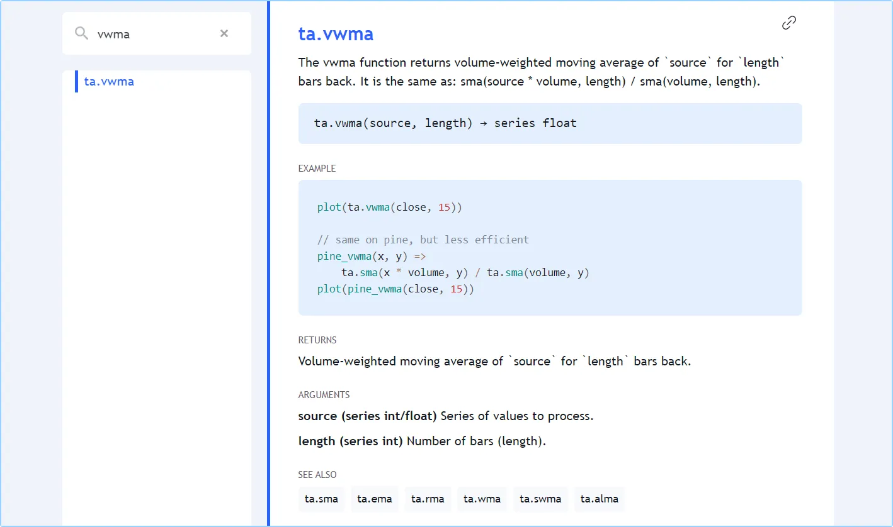

# [Built-ins](../3. Language/language_built-ins.md#built-ins)

## [Introduction](../3. Language/language_built-ins.md#introduction)

Pine Script® has hundreds of _built-in_ variables and functions. They
provide your scripts with valuable information and make calculations for
you, dispensing you from coding them. The better you know the built-ins,
the more you will be able to do with your Pine scripts.

On this page, we present an overview of some of Pine’s built-in
variables and functions. They will be covered in more detail in the
pages of this manual covering specific themes.

All built-in variables and functions are defined in the Pine Script [v6 
Reference 
Manual](https://www.tradingview.com/pine-script-reference/v6/). It is
called a “Reference Manual” because it is the definitive reference on
the Pine Script language. It is an essential tool that will accompany
you anytime you code in Pine, whether you are a beginner or an expert.
If you are learning your first programming language, make the [Reference 
Manual](https://www.tradingview.com/pine-script-reference/v6/) your
friend. Ignoring it will make your programming experience with Pine
Script difficult and frustrating — as it would with any other
programming language.

Variables and functions in the same family share the same _namespace_,
which is a prefix to the function’s name. The
[ta.sma()](../../reference manual/functions/ta.sma.md)
function, for example, is in the `ta` namespace, which stands for
“technical analysis”. A namespace can contain both variables and
functions.

Some variables have function versions as well, e.g.:

- The
[ta.tr](../../reference manual/functions/ta.tr.md)
variable returns the “True Range” of the current bar. The
[ta.tr(true)](../../reference manual/functions/ta.tr.md)
function call also returns the “True Range”, but when the previous
[close](../../reference manual/variables/close.md)
value which is normally needed to calculate it is
[na](../../reference manual/variables/na.md),
it calculates using `high - low` instead.
- The
[time](../../reference manual/variables/time.md)
variable gives the time at the
[open](../../reference manual/variables/open.md)
of the current bar. The
[time(timeframe)](../../reference manual/functions/time.md)
function returns the time of the bar’s
[open](../../reference manual/variables/open.md)
from the `timeframe` specified, even if the chart’s timeframe is
different. The [time(timeframe, 
session)](../../reference manual/functions/time.md)
function returns the time of the bar’s
[open](../../reference manual/variables/open.md)
from the `timeframe` specified, but only if it is within the
`session` time. The [time(timeframe, session, 
timezone)](../../reference manual/functions/time.md)
function returns the time of the bar’s
[open](../../reference manual/variables/open.md)
from the `timeframe` specified, but only if it is within the
`session` time in the specified `timezone`.

## [Built-in variables](../3. Language/language_built-ins.md#built-in-variables)

Built-in variables exist for different purposes. These are a few
examples:

- Price- and volume-related variables:
[open](../../reference manual/variables/open.md),
[high](../../reference manual/variables/high.md),
[low](../../reference manual/variables/low.md),
[close](../../reference manual/variables/close.md),
[hl2](../../reference manual/variables/hl2.md),
[hlc3](../../reference manual/variables/hlc3.md),
[ohlc4](../../reference manual/variables/ohlc4.md),
and
[volume](../../reference manual/variables/volume.md).
- Symbol-related information in the `syminfo` namespace:
[syminfo.basecurrency](../../reference manual/variables/syminfo.basecurrency.md),
[syminfo.currency](../../reference manual/variables/syminfo.currency.md),
[syminfo.description](../../reference manual/variables/syminfo.description.md),
[syminfo.main\_tickerid](../../reference manual/variables/syminfo.main_tickerid.md),
[syminfo.mincontract](../../reference manual/variables/syminfo.mincontract.md),
[syminfo.mintick](../../reference manual/variables/syminfo.mintick.md),
[syminfo.pointvalue](../../reference manual/variables/syminfo.pointvalue.md),
[syminfo.prefix](../../reference manual/variables/syminfo.prefix.md),
[syminfo.root](../../reference manual/variables/syminfo.root.md),
[syminfo.session](../../reference manual/variables/syminfo.session.md),
[syminfo.ticker](../../reference manual/variables/syminfo.ticker.md),
[syminfo.tickerid](../../reference manual/variables/syminfo.tickerid.md),
[syminfo.timezone](../../reference manual/variables/syminfo.timezone.md),
and
[syminfo.type](../../reference manual/variables/syminfo.type.md).
- Timeframe (a.k.a. “interval” or “resolution”, e.g., 15sec,
30min, 60min, 1D, 3M) variables in the `timeframe` namespace:
[timeframe.isseconds](../../reference manual/variables/timeframe.isseconds.md),
[timeframe.isminutes](../../reference manual/variables/timeframe.isminutes.md),
[timeframe.isintraday](../../reference manual/variables/timeframe.isintraday.md),
[timeframe.isdaily](../../reference manual/variables/timeframe.isdaily.md),
[timeframe.isweekly](../../reference manual/variables/timeframe.isweekly.md),
[timeframe.ismonthly](../../reference manual/variables/timeframe.ismonthly.md),
[timeframe.isdwm](../../reference manual/variables/timeframe.isdwm.md),
[timeframe.multiplier](../../reference manual/variables/timeframe.multiplier.md),
[timeframe.main\_period](../../reference manual/variables/timeframe.main_period.md),
and
[timeframe.period](../../reference manual/variables/timeframe.period.md).
- Bar states in the `barstate` namespace (see the
[Bar states](../1. Concepts/concepts_bar-states.md) page):
[barstate.isconfirmed](../../reference manual/variables/barstate.isconfirmed.md),
[barstate.isfirst](../../reference manual/variables/barstate.isfirst.md),
[barstate.ishistory](../../reference manual/variables/barstate.ishistory.md),
[barstate.islast](../../reference manual/variables/barstate.islast.md),
[barstate.islastconfirmedhistory](../../reference manual/variables/barstate.islastconfirmedhistory.md),
[barstate.isnew](../../reference manual/variables/barstate.isnew.md),
and
[barstate.isrealtime](../../reference manual/variables/barstate.isrealtime.md).
- Strategy-related information in the `strategy` namespace:
[strategy.equity](../../reference manual/variables/strategy.equity.md),
[strategy.initial\_capital](../../reference manual/variables/strategy.initial_capital.md),
[strategy.grossloss](../../reference manual/variables/strategy.grossloss.md),
[strategy.grossprofit](../../reference manual/variables/strategy.grossprofit.md),
[strategy.wintrades](../../reference manual/variables/strategy.wintrades.md),
[strategy.losstrades](../../reference manual/variables/strategy.losstrades.md),
[strategy.position\_size](../../reference manual/variables/strategy.position_size.md),
[strategy.position\_avg\_price](../../reference manual/variables/strategy.position_avg_price.md),
[strategy.wintrades](../../reference manual/variables/strategy.wintrades.md),
etc.

## [Built-in functions](../3. Language/language_built-ins.md#built-in-functions)

Many functions are used for the result(s) they return. These are a few
examples:

- Math-related functions in the `math` namespace:
[math.abs()](../../reference manual/functions/math.abs.md),
[math.log()](../../reference manual/functions/math.log.md),
[math.max()](../../reference manual/functions/math.max.md),
[math.random()](../../reference manual/functions/math.random.md),
[math.round\_to\_mintick()](../../reference manual/functions/math.round_to_mintick.md),
etc.
- Technical indicators in the `ta` namespace:
[ta.sma()](../../reference manual/functions/ta.sma.md),
[ta.ema()](../../reference manual/functions/ta.ema.md),
[ta.macd()](../../reference manual/functions/ta.macd.md),
[ta.rsi()](../../reference manual/functions/ta.rsi.md),
[ta.supertrend()](../../reference manual/functions/ta.supertrend.md),
etc.
- Support functions often used to calculate technical indicators in
the `ta` namespace:
[ta.barssince()](../../reference manual/functions/ta.barssince.md),
[ta.crossover()](../../reference manual/functions/ta.crossover.md),
[ta.highest()](../../reference manual/functions/ta.highest.md),
etc.
- Functions to request data from other symbols or timeframes in the
`request` namespace:
[request.dividends()](../../reference manual/functions/request.dividends.md),
[request.earnings()](../../reference manual/functions/request.earnings.md),
[request.financial()](../../reference manual/functions/request.financial.md),
[request.quandl()](../../reference manual/functions/request.quandl.md),
[request.security()](../../reference manual/functions/request.security.md),
[request.splits()](../../reference manual/functions/request.splits.md).
- Functions to manipulate strings in the `str` namespace:
[str.format()](../../reference manual/functions/str.format.md),
[str.length()](../../reference manual/functions/str.length.md),
[str.tonumber()](../../reference manual/functions/str.tonumber.md),
[str.tostring()](../../reference manual/functions/str.tostring.md),
etc.
- Functions used to define the input values that script users can
modify in the script’s “Settings/Inputs” tab, in the `input`
namespace:
[input()](../../reference manual/functions/input.md),
[input.color()](../../reference manual/functions/input.color.md),
[input.int()](../../reference manual/functions/input.int.md),
[input.session()](../../reference manual/functions/input.session.md),
[input.symbol()](../../reference manual/functions/input.symbol.md),
etc.
- Functions used to manipulate colors in the `color` namespace:
[color.from\_gradient()](../../reference manual/functions/color.from_gradient.md),
[color.rgb()](../../reference manual/functions/color.rgb.md),
[color.new()](../../reference manual/functions/color.new.md),
etc.

Some functions do not return a result but are used for their side
effects, which means they do something, even if they don’t return a
result:

- Functions used as a declaration statement defining one of three
types of Pine scripts, and its properties. Each script must begin
with a call to one of these functions:
[indicator()](../../reference manual/functions/indicator.md),
[strategy()](../../reference manual/functions/strategy.md)
or
[library()](../../reference manual/functions/library.md).
- Plotting or coloring functions:
[bgcolor()](../../reference manual/functions/bgcolor.md),
[plotbar()](../../reference manual/functions/plotbar.md),
[plotcandle()](../../reference manual/functions/plotcandle.md),
[plotchar()](../../reference manual/functions/plotchar.md),
[plotshape()](../../reference manual/functions/plotshape.md),
[fill()](../../reference manual/functions/fill.md).
- Strategy functions placing orders, in the `strategy` namespace:
[strategy.cancel()](../../reference manual/functions/strategy.cancel.md),
[strategy.close()](../../reference manual/functions/strategy.close.md),
[strategy.entry()](../../reference manual/functions/strategy.entry.md),
[strategy.exit()](../../reference manual/functions/strategy.exit.md),
[strategy.order()](../../reference manual/functions/strategy.order.md),
etc.
- Strategy functions returning information on indivdual past trades,
in the `strategy` namespace:
[strategy.closedtrades.entry\_bar\_index()](../../reference manual/functions/strategy.closedtrades.entry_bar_index.md),
[strategy.closedtrades.entry\_price()](../../reference manual/functions/strategy.closedtrades.entry_price.md),
[strategy.closedtrades.entry\_time()](../../reference manual/functions/strategy.closedtrades.entry_time.md),
[strategy.closedtrades.exit\_bar\_index()](../../reference manual/functions/strategy.closedtrades.exit_bar_index.md),
[strategy.closedtrades.max\_drawdown()](../../reference manual/functions/strategy.closedtrades.max_drawdown.md),
[strategy.closedtrades.max\_runup()](../../reference manual/functions/strategy.closedtrades.max_runup.md),
[strategy.closedtrades.profit()](../../reference manual/functions/strategy.closedtrades.profit.md),
etc.
- Functions to generate alert events:
[alert()](../../reference manual/functions/alert.md)
and
[alertcondition()](../../reference manual/functions/alertcondition.md).

Other functions return a result, but we don’t always use it, e.g.:
[hline()](../../reference manual/functions/hline.md),
[plot()](../../reference manual/functions/plot.md),
[array.pop()](../../reference manual/functions/array.pop.md),
[label.new()](../../reference manual/functions/label.new.md),
etc.

All built-in functions are defined in the Pine Script [v6 Reference 
Manual](https://www.tradingview.com/pine-script-reference/v6/). You can
click on any of the function names listed here to go to its entry in the
Reference Manual, which documents the function’s signature, i.e., the
list of _parameters_ it accepts and the qualified type of the value(s)
it returns (a function can return more than one result). The Reference
Manual entry will also list, for each parameter:

- Its name.
- The qualified type of the value it requires (we use _argument_ to
name the values passed to a function when calling it).
- If the parameter is required or not.

All built-in functions have one or more parameters defined in their
signature. Not all parameters are required for every function.

Let’s look at the
[ta.vwma()](../../reference manual/functions/ta.vwma.md)
function, which returns the volume-weighted moving average of a source
value. This is its entry in the Reference Manual:



The entry gives us the information we need to use it:

- What the function does.
- Its signature (or definition):

```
ta.vwma(source, length) → series float
```

- The parameters it includes: `source` and `length`
- The qualified type of the result it returns: “series float”.
- An example showing it in use: `plot(ta.vwma(close, 15))`.
- An example showing what it does, but in long form, so you can better
understand its calculations. Note that this is meant to explain ---
not as usable code, because it is more complicated and takes longer
to execute. There are only disadvantages to using the long form.
- The “RETURNS” section explains exacty what value the function
returns.
- The “ARGUMENTS” section lists each parameter and gives the
critical information concerning what qualified type is required for
arguments used when calling the function.
- The “SEE ALSO” section refers you to related Reference Manual
entries.

This is a call to the function in a line of code that declares a
`myVwma` variable and assigns the result of `ta.vwma(close, 20)` to it:

```pine
myVwma = ta.vwma(close, 20)
```

Note that:

- We use the built-in variable
[close](../../reference manual/variables/close.md)
as the argument for the `source` parameter.
- We use `20` as the argument for the `length` parameter.
- If placed in the global scope (i.e., starting in a line’s first
position), it will be executed by the Pine Script runtime on each
bar of the chart.

We can also use the parameter names when calling the function. Parameter
names are called _keyword arguments_ when used in a function call:

```pine
myVwma = ta.vwma(source = close, length = 20)
```

You can change the position of arguments when using keyword arguments,
but only if you use them for all your arguments. When calling functions
with many parameters such as
[indicator()](../../reference manual/functions/indicator.md),
you can also forego keyword arguments for the first arguments, as long
as you don’t skip any. If you skip some, you must then use keyword
arguments so the Pine Script compiler can figure out which parameter
they correspond to, e.g.:

```pine
indicator("Example", "Ex", true, max_bars_back = 100)
```

Mixing things up this way is not allowed:

```pine
indicator(precision = 3, "Example") // Compilation error!
```

**When calling built-ins, it is critical to ensure that the arguments**
**you use are of the required qualified type, which will vary for each**
**parameter.**

To learn how to do this, one needs to understand Pine Script’s
[type system](../3. Language/language_type-system.md). The
Reference Manual entry for each built-in function includes an
“ARGUMENTS” section which lists the qualified type required for the
argument supplied to each of the function’s parameters.

[Previous 
**Loops**](../3. Language/language_loops.md) [Next 
**User-defined functions**](../3. Language/language_user-defined-functions.md)