# [Declaration statements](../3. Language/language_declaration-statements.md#declaration-statements)

## [Introduction](../3. Language/language_declaration-statements.md#introduction)

In Pine Script®, a _declaration statement_ is a mandatory function call that declares the script’s _type_ and its _properties_ at _compile time_. The available declaration functions are [indicator()](../../reference manual/functions/indicator.md), [strategy()](../../reference manual/functions/strategy.md), and [library()](../../reference manual/functions/library.md). Each type of script has different capabilities and behaviors, the compiler uses different rules to compile them, and Pine’s runtime system also [executes](../3. Language/language_execution-model.md) them differently.

Every script must include exactly **one** declaration statement, and that statement must be in the script’s [global scope](../6. FAQ/faq_programming.md#what-does-scope-mean). Our [style guide](../4. Writing_Scripts/writing_style-guide.md#script-organization) recommends placing the statement directly below the `@version=` [compiler annotation](../3. Language/language_script-structure.md#compiler-annotations) at the top of the source code. For example:

```pine
//@version=6
indicator("My script") // Declares that the script is an indicator named "My script" with default properties.

// Plot the `close` series across the chart.
plot(close)
```

The parameters of a declaration statement define various script-wide properties and default behaviors. Only the `title` parameter, which sets the script’s _main title_, requires an argument. Supplying arguments to any other parameters is _optional_. Note that all parameters in each declaration statement require arguments qualified as “const”. They _cannot_ accept values with the “input”, “simple”, or “series” [type qualifier](../3. Language/language_type-system.md#qualifiers).

The [`indicator()`](../3. Language/language_declaration-statements.md#indicator), [`strategy()`](../3. Language/language_declaration-statements.md#strategy), and [`library()`](../3. Language/language_declaration-statements.md#library) sections below explain the parameters available for each declaration statement and how they affect a script, as well as various unique characteristics of each script type.

## [​`indicator()`​](../3. Language/language_declaration-statements.md#indicator)

The [indicator()](../../reference manual/functions/indicator.md) function declares that the script is an _indicator_. Indicators perform calculations across a dataset to generate [visuals](../2. Visuals/visuals_overview.md), [alerts](../1. Concepts/concepts_alerts.md), or [Pine Logs](../4. Writing_Scripts/writing_debugging.md#pine-logs). They are the most common type of scripts in Pine.

The built-in [Relative Strength Index (RSI)](https://www.tradingview.com/support/solutions/43000502338/) script is an example of an indicator. It calculates the RSI of a specified source series and plots the result in a separate pane. It can also plot a smoothed RSI, display divergence signals, and generate divergence alerts.

Indicators have several distinct characteristics, including the following:

- Indicators are the _only_ scripts that can use alert triggers from calls to both the [alert()](../../reference manual/functions/alert.md) and [alertcondition()](../../reference manual/functions/alertcondition.md) functions.
- Unlike [strategies](../1. Concepts/concepts_strategies.md), indicators _cannot_ use any `strategy.*` built-ins or simulate trades.
- Unlike [libraries](../1. Concepts/concepts_libraries.md), indicators cannot _export_ code for use in other scripts. However, other scripts that include [source inputs](../1. Concepts/concepts_inputs.md#source-input) can retrieve values from an indicator’s _plots_ created by [plot()](../../reference manual/functions/plot.md) calls.
- The [Pine Screener](https://www.tradingview.com/support/solutions/43000742436-tradingview-pine-screener-key-features-and-requirements/) is compatible with indicators only. The screener can display plotted values from an indicator’s [plot()](../../reference manual/functions/plot.md) function calls, and _filter_ the results using data from other [plot()](../../reference manual/functions/plot.md) or [alertcondition()](../../reference manual/functions/alertcondition.md) calls.
- Indicators always execute _once per bar_ on historical bars, and _once per data feed update (tick)_ on [realtime bars](../3. Language/language_execution-model.md#realtime-bars).
- Indicators must include _at least one_ call to a function that creates one of the following outputs: [plot visuals](../2. Visuals/visuals_overview.md#plot-visuals), [drawing visuals](../2. Visuals/visuals_overview.md#drawing-visuals), [alert triggers](../1. Concepts/concepts_alerts.md), or [Pine Logs](../4. Writing_Scripts/writing_debugging.md#pine-logs).

The signature for the [indicator()](../../reference manual/functions/indicator.md) function is as follows:

```
indicator(title, shorttitle, overlay, format, precision, scale, max_bars_back, timeframe, timeframe_gaps, explicit_plot_zorder, max_lines_count, max_labels_count, max_boxes_count, calc_bars_count, max_polylines_count, dynamic_requests, behind_chart) → void
```

The following sections explain the parameters of the [indicator()](../../reference manual/functions/indicator.md) declaration statement and how they work.

### [​`title`​ and ​`shorttitle`​](../3. Language/language_declaration-statements.md#title-and-shorttitle)

The required `title` parameter defines the script’s _main title_. The script displays the specified “string” title in all possible chart locations by default. Additionally, the “Publish script” window automatically suggests using that title for a [script publication](../4. Writing_Scripts/writing_publishing.md).

The optional `shorttitle` parameter defines a _short display title_ for the script. If the declaration statement includes a `shorttitle` argument that is not an empty string, the string’s text appears instead of the main title in multiple chart locations, including:

- The script’s status line on the chart.
- The chart’s object tree and data window.
- The script’s “Settings” window.
- The “Condition” section of the “Create alert” dialog box.
- The listed alerts and logs for the script in the “Alerts” pane.
- The [Pine Logs](../4. Writing_Scripts/writing_debugging.md#pine-logs) pane.

The example script below plots an [Exponential Moving Average (EMA)](https://www.tradingview.com/support/solutions/43000592270-exponential-moving-average/) for a selected source series and length. The declaration statement sets the script’s main title to `"Exponential Moving Average indicator"`. However, because the declaration statement also includes the argument `shorttitle = "EMA"`, the script’s status line and the data window display “EMA” instead of the main title. Hovering over the short title in the status line reveals a tooltip containing the script’s main title:

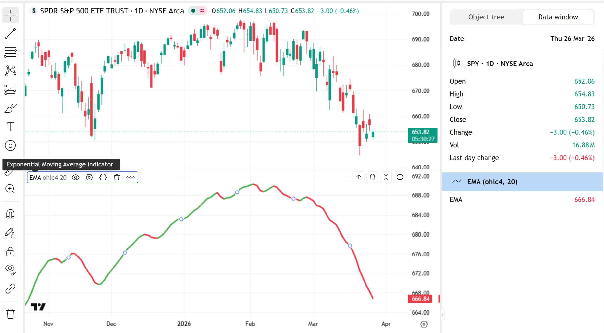

```pine
//@version=6
indicator("Exponential Moving Average indicator", shorttitle = "EMA")

//@variable The source series for which to calculate the EMA.
float sourceInput = input.source(ohlc4, "Source")
//@variable The length value for the EMA's smoothing factor.
int lengthInput = input.int(20, "Length", minval = 1)

// Calculate the EMA for the specified series and length, and plot the result as a color-coded line.
float ema = ta.ema(sourceInput, lengthInput)
plot(ema, "EMA", ema > ema[1] ? color.green : color.red, 3)
```

### [​`overlay`​, ​`scale`​, and ​`behind_chart`​](../3. Language/language_declaration-statements.md#overlay-scale-and-behind_chart)

The `overlay`, `scale`, and `behind_chart` parameters of the declaration statement configure where the script displays its chart outputs. They control the _global default_ display location and scaling behavior of the script’s [visuals](../2. Visuals/visuals_overview.md), separate to the individual properties of [plot visuals](../2. Visuals/visuals_overview.md#plot-visuals) or [drawing visuals](../2. Visuals/visuals_overview.md#drawing-visuals).

The `overlay` parameter specifies which _default_ chart pane the script uses to display its visuals when the user adds the script to their chart. If the argument is `true`, the script’s visuals appear in the _main chart pane_ by default, or in another script’s pane if the user adds it to the chart via the “Add indicator/strategy on” option in the other script’s “More” menu. If the `overlay` argument is `false` (default), the script’s visuals occupy a _separate chart pane_ by default.

The `scale` parameter defines the location of the script’s _price scale_ and the scaling behavior of the script’s plots and drawings. The possible arguments are [scale.left](../../reference manual/constants/scale.left.md), [scale.right](../../reference manual/constants/scale.right.md), and [scale.none](../../reference manual/constants/scale.none.md). The behaviors associated with this parameter are as follows:

- If the declaration statement includes _any_`scale` argument, the script scales its visuals _independently_ to fit the vertical range of the pane that it occupies.
- If the argument is [scale.left](../../reference manual/constants/scale.left.md) or [scale.right](../../reference manual/constants/scale.right.md), and the script overlays on an existing pane, the script adds a _separate_ scale for its visuals on the specified side of that pane.
- If the script occupies a separate pane, an argument of [scale.left](../../reference manual/constants/scale.left.md) or [scale.right](../../reference manual/constants/scale.right.md) moves that pane’s scale to the specified side without creating a new scale.
- If the argument is [scale.none](../../reference manual/constants/scale.none.md), which is valid only if the `overlay` argument is `true`, the script displays plotted numbers directly on the scale of an existing pane without creating a new scale. If the user moves the script to a separate pane, the script displays values on a new price scale in that pane.
- If the statement does not include a `scale` argument, the script uses the main price scale for the pane it occupies, and it does _not_ scale its visuals separately if it overlays on an existing pane.

The following example indicator plots an [RSI](https://www.tradingview.com/support/solutions/43000502338-relative-strength-index-rsi/) as translucent, color-coded columns. The script displays the columns on the main chart pane because its declaration statement includes `overlay = true`. Additionally, the script adds a separate scale to the left side of the pane and scales its plotted values independently because the statement uses [scale.left](../../reference manual/constants/scale.left.md) as the `scale` argument:

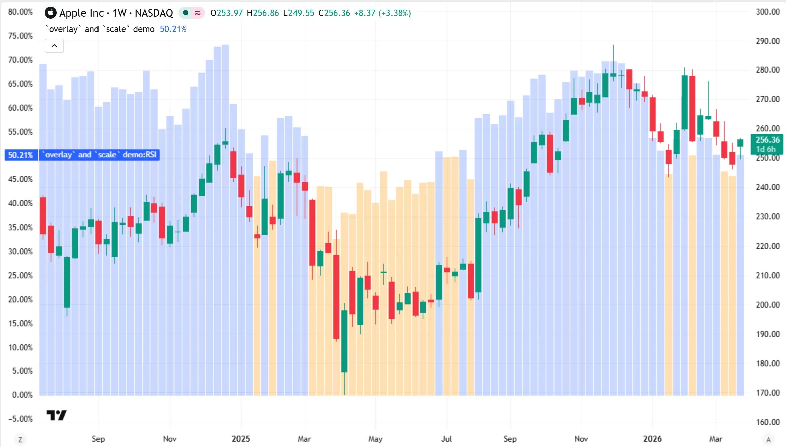

```pine
//@version=6
indicator("`scale` demo", overlay = true, scale = scale.left, format = format.percent)

//@variable The RSI of the `close` series with a length of 14.
float rsi = ta.rsi(close, 14)

// Plot the RSI as translucent columns. Use an orange color for values of 50 or greater, and blue for others.
plot(rsi, "RSI", rsi <= 50 ? color.new(color.orange, 70) : color.new(color.blue, 75), 2, plot.style_columns)
```

Note that:

- The script formats the plotted numbers and the values in the left-side scale as _percentages_ because the [indicator()](../../reference manual/functions/indicator.md) statement includes the argument `format = format.percent`. See the [`format` and `precision`](../3. Language/language_declaration-statements.md#format-and-precision) section below to learn more.

The `behind_chart` parameter determines the _visual order_ of the script’s plots and drawings relative to the main chart series. Specifying an argument for this parameter affects the script’s visuals only if the `overlay` argument is `true`, because the behavior does not apply to non-overlay scripts. If the `behind_chart` value is `true` (default), the script’s visuals appear _behind_ the main series. If the value is `false`, they appear _in front_ of the main series and can cover the chart’s bars.

### [​`format`​ and ​`precision`​](../3. Language/language_declaration-statements.md#format-and-precision)

The `format` and `precision` parameters of the declaration statement control the default appearance of _plotted numbers_ in the script’s status line, the price scales, and the data window.

The `precision` parameter determines the default number of _fractional digits_ that the script shows for plotted values and the numbers in the price scale. It accepts a value from 0 to 16. This parameter affects the appearance of all plotted numbers except for those formatted using [format.volume](../../reference manual/constants/format.volume.md), because the decimal precision rules of the built-in volume format supersede other precision settings. If the declaration statement does not include a `precision` argument, the script inherits its default precision settings from the main chart series, or from another script if it accesses one of that script’s plots using a [source input](../1. Concepts/concepts_inputs.md#source-inputs).

The `format` parameter determines whether the script displays plotted numbers and the numbers in the price scale using a price, percentage, or volume format, or if it inherits formatting settings from the chart or another script. The possible arguments are [format.price](../../reference manual/constants/format.price.md), [format.percent](../../reference manual/constants/format.percent.md), [format.volume](../../reference manual/constants/format.volume.md) and [format.inherit](../../reference manual/constants/format.inherit.md). The default is [format.inherit](../../reference manual/constants/format.inherit.md).

Below, we list how a script formats plotted values when using each of these arguments:

`format.price`

The script formats plotted values as whole numbers with two fractional digits by default. For example, a script that uses this argument and default precision settings formats a plot value of 122 as 122.0, and a value of 122.355 as 122.36. If a rounded value is greater than or equal to 1000, the script uses a comma as the thousands separator. For instance, it formats a value of 14489245 as 14,489,245.00. If a number is extremely large, the script formats it as a rounded value in [E notation](https://en.wikipedia.org/wiki/Scientific_notation#E_notation) (e.g., `1e+21`).

`format.percent`

The script applies similar formatting rules to those defined by [format.price](../../reference manual/constants/format.price.md), and it appends a percent sign (`%`) to express plotted values as percentages. By default, the format rounds plotted numbers to two fractional digits. For example, it formats the value 39.787 as 39.79%. This format does _not_ recalculate values to express them as percentages. To represent a _ratio_ as a percentage when using this format, multiply the value by 100 before plotting it.

`format.volume`

The script formats plotted numbers as _abbreviated_ values that follow special precision rules. If a rounded value is greater than or equal to 1000, the script includes a letter representing a multiplied quantity: “K” for thousand, “M” for million, “B” for billion, or “T” for trillion. For example, it formats a plot value of 2474 as 2.74K, and a value of 14489245 as 14.49M. If a value is extremely large, the script displays a number with commas or E notation followed by “T”. For values less than 1000, the script displays those values rounded to the nearest whole number by default. Note that these formatting rules can apply to any plotted numbers; they are not limited to only volume values.

`format.inherit`

The script inherits the same formatting settings as those defined for the main chart series, or the global formatting settings for another script if it accesses one of the script’s plots using a [source input](../1. Concepts/concepts_inputs.md#source-input). For example, the script uses price formatting when applied to a stock chart series, and percentage formatting when applied to a bond chart series.

The example indicator below plots [volume](../../reference manual/variables/volume.md) values as color-coded columns, and it plots the average value over a specified number of bars as a line. The [indicator()](../../reference manual/functions/indicator.md) declaration statement includes [format.volume](../../reference manual/constants/format.volume.md) as the `format` argument to apply the volume formatting rules described above to the script’s plots and scale. On our daily “NASDAQ:NFLX” chart, the current plotted values are in _millions_, so the script displays the numbers in an abbreviated format with “M” as the suffix:

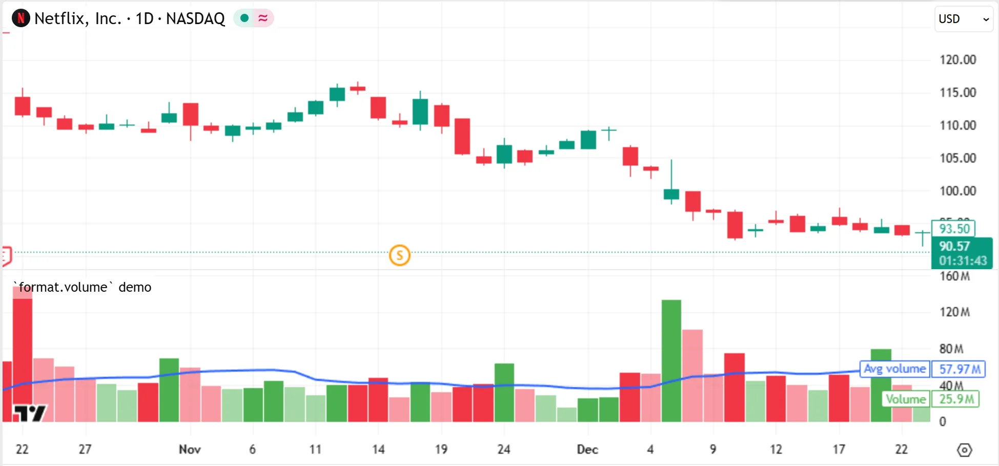

```pine
//@version=6
indicator("`format.volume` demo", format = format.volume)

//@variable The number of bars over which to calculate the average volume.
int lengthInput = input.int(14, "Average length", minval = 1)

//@variable A red color if `close < open`, and green otherwise. The color is 50% transparent if `volume <= volume[1]`.
color volColor = switch
    volume > volume[1] => close < open ? color.red : color.green
    => close < open ? color.new(color.red, 50) : color.new(color.green, 50)

// Plot volume as columns, and the average volume as a line.
// Both of these plots automatically format numbers using `format.volume` rules.
plot(volume, "Volume", volColor, style = plot.style_columns)
plot(ta.sma(volume, lengthInput), "Avg volume", color.blue, linewidth = 2)
```


Note that the `plot*()` functions also include `format` and `precision` parameters, which enable scripts to define specific formatting behaviors for each separate plot. By default, a plot automatically inherits the default format and precision settings defined by the declaration statement, as demonstrated by the previous example. However, if a `plot*()` call includes `format` or `precision` arguments, those arguments _take precedence_ over the script’s default settings.

For example, in the script version below, we added the argument `format = format.price` to the [plot()](../../reference manual/functions/plot.md) call for the average volume display. With this change, the script formats the average volume values using the rules defined by [format.price](../../reference manual/constants/format.price.md), while the volume plot and the price scale both continue to use the default [format.volume](../../reference manual/constants/format.volume.md) rules specified by the declaration statement:

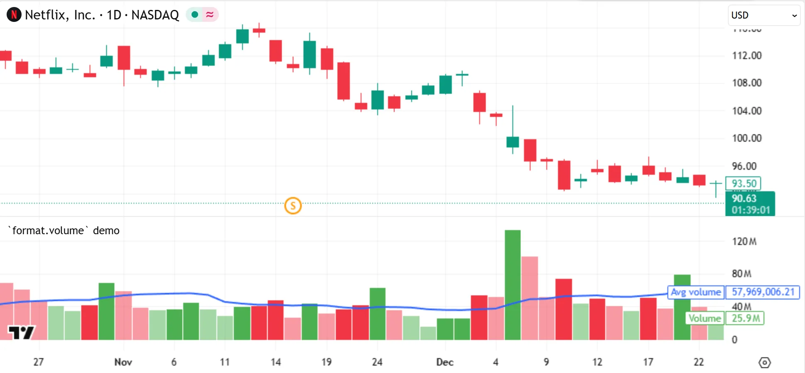

```

//@version=6
indicator("`format.volume` demo", format = format.volume)

//@variable The number of bars over which to calculate the average volume.
int lengthInput = input.int(14, "Average length", minval = 1)

//@variable A red color if `close < open`, and green otherwise. The color is 50% transparent if `volume <= volume[1]`.
color volColor = switch
    volume > volume[1] => close < open ? color.red : color.green
    => close < open ? color.new(color.red, 50) : color.new(color.green, 50)

// Because this call does not include a `format` argument, it inherits `format.volume` rules.
plot(volume, "Volume", volColor, style = plot.style_columns)
// By contrast, this call uses `format.price` rules, because the `format` argument here
// *overrides* the script's default plot format.
plot(ta.sma(volume, lengthInput), "Avg volume", color.blue, linewidth = 2, format = format.price)
```

### [[max_bars_back]]


The `max_bars_back` parameter of the declaration statement, if it has a specified argument, sets the initial maximum _history-referencing length_ for each series in a script. It accepts an “int” value from 0 to 5000, representing the number of past data points maintained in memory for _all_ variables and expressions.

As a script executes, Pine’s runtime system stores data for each variable and expression across bars in fixed-length [historical buffers](../3. Language/language_execution-model.md#historical-buffers). The script can access _past bar data_ from these buffers by using the [`[]` history-referencing operator](../3. Language/language_operators.md#-history-referencing-operator) or the [built-in functions](../3. Language/language_built-ins.md#built-in-functions) that reference history internally. For example, the expression `close[10]` retrieves the last saved value of the [close](../../reference manual/variables/close.md) variable from _10 bars back_.

By default, the system automatically sizes each historical buffer by analyzing the historical references that the script executes as it loads across historical bars. For resource efficiency, each buffer typically contains only enough past data to accommodate the script’s historical references, but _not more_. For instance, if a script requests the value of a variable from up to 500 bars back as it loads across a chart’s history, the buffer for that variable typically includes data for only the latest 500 past bars.

In most cases, this automatic sizing process accommodates a script’s historical references without issues. Therefore, manually setting the sizes of historical buffers is often **unnecessary**. However, in some cases, the system might fail to determine appropriate buffer sizes on its own, resulting in a [runtime error](../5. Errors_And_Warnings/errors_re10143.md#the-requested-historical-offset-x-is-beyond-the-historical-buffers-limit-y). One possible way to resolve that error is to set the default size of the script’s historical buffers in advance by including a `max_bars_back` argument in the declaration statement.

Before using this parameter, ensure that _all_ or _most_ of the series in the script actually require historical buffers with the _same_ specific size. Manually setting buffers in a script to use a specific size when unnecessary can **negatively** impact the script’s performance. If only _specific_ series require manually sized buffers, either of the following approaches is far more efficient:

- Use the [max\_bars\_back()](../../reference manual/functions/max_bars_back.md) _function_ to set the sizes of only the problematic historical buffers.
- Structure the script’s history-referencing operations to request the _maximum_ required amount of history on the _first bar_.

See the [historical buffer limit](../5. Errors_And_Warnings/errors_re10143.md#the-requested-historical-offset-x-is-beyond-the-historical-buffers-limit-y) error page to learn more. For _advanced_ details about the workings of historical buffers, refer to the [Historical buffers](../3. Language/language_execution-model.md#historical-buffers) section of the [Execution model](../3. Language/language_execution-model.md) page.

### [​`timeframe`​ and ​`timeframe_gaps`​](../3. Language/language_declaration-statements.md#timeframe-and-timeframe_gaps)

The `timeframe` parameter of the [indicator()](../../reference manual/functions/indicator.md) declaration statement sets the script’s _main timeframe_. It enables the script to perform calculations on the data for a different timeframe than that of the chart without requiring `request.*()` function calls. The parameter accepts a valid [timeframe string](../1. Concepts/concepts_timeframes.md#timeframe-string-specifications), such as `"1D"` for the daily timeframe or `"30"` for the 30-minute timeframe. If an argument is not specified, or if the value is an empty string (`""`), the script executes on the data for the current chart’s timeframe.

The `timeframe_gaps` parameter determines how the script handles _time gaps_ when plotting data from a _higher timeframe_. It allows an argument only if the declaration statement also includes a `timeframe` argument. The parameter works similarly to the [`gaps`](../1. Concepts/concepts_other-timeframes-and-data.md#gaps) parameter of [request.security()](../../reference manual/functions/request.security.md) and other `request.*()` functions. If the value is `true` (default), the script plots values only on the chart bars where new, _confirmed_ data is available from the specified timeframe, and displays [na](../../reference manual/variables/na.md) results on other bars. If `false`, the script plots the _last retrieved values_ from the higher timeframe on the chart bars where new data is not available.

If the declaration statement specifies a `timeframe` argument, the script automatically adds a “Calculation” group with a “Timeframe” input to the “Settings/Inputs” tab. If the statement includes a `timeframe_gaps` argument, the script also adds a “Wait for timeframe closes” input below the “Timeframe” input. These inputs enable users to customize the script’s main timeframe and its gap-handling behavior without modifying the source code. To learn more about them, see the [Leveraging multi-timeframe analysis](https://www.tradingview.com/support/solutions/43000591555-leveraging-multi-timeframe-analysis/) article in our Help Center.

The following example demonstrates the behavior of both parameters. The indicator below calculates and plots the 14-bar average of [close](../../reference manual/variables/close.md) values on a specified timeframe. The [indicator()](../../reference manual/functions/indicator.md) declaration statement includes `"1D"` as the `timeframe` argument, so it performs calculations using daily data for the current chart’s symbol by default, regardless of the chart’s timeframe. On an intraday chart, the script plots an “x-cross” shape only on the _last_ chart bar for each trading day by default, and [na](../../reference manual/variables/na.md) on other bars, because the declaration statement also includes the argument `timeframe_gaps = true`:

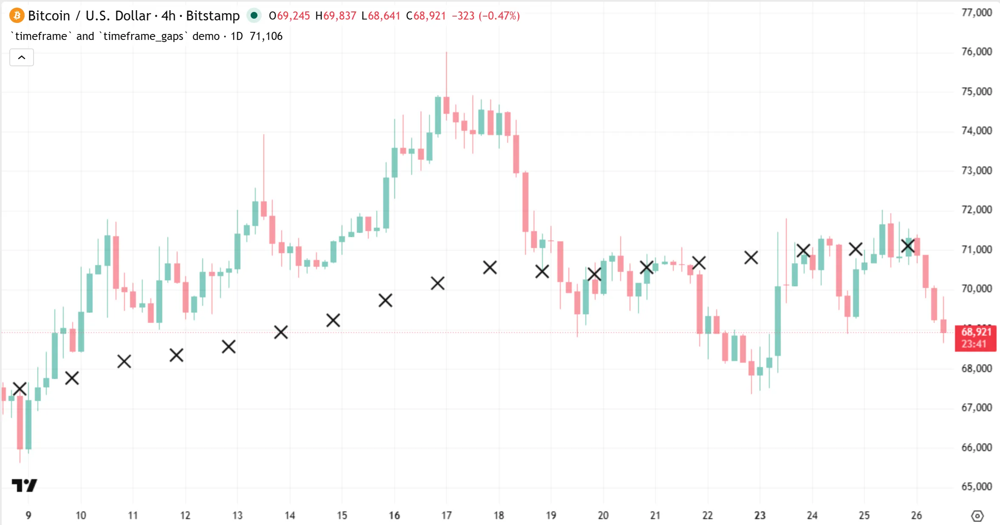

```pine
//@version=6
indicator(
    "`timeframe` and `timeframe_gaps` demo",
    overlay = true, behind_chart = false,
    timeframe = "1D", timeframe_gaps = true // <- These arguments automatically add inputs to the "Settings/Inputs" tab.
)

//@variable The 14-bar average `close` value on the script's main timeframe ("1D" by default).
float avgClose = ta.sma(close, 14)

// Plot the `avgClose` series as "x-cross" shapes.
// By default, a new shape appears only on the last chart bar for each "1D" period. On other bars, the plot shows `na`.
plotshape(avgClose, "Avg close", shape.xcross, location.absolute, size = size.small)
```

Note that:

- If the specified timeframe is _lower_ than or _equal_ to the chart’s timeframe, the script plots an “x-cross” shape on _every_ chart bar.
- An alternative way to achieve this script’s default result without using these parameters is to plot the value returned by the call `request.security(syminfo.tickerid, "1D", ta.sma(close, 14), gaps = barmerge.gaps_on)`. Refer to the [Other timeframes and data](../1. Concepts/concepts_other-timeframes-and-data.md) page to learn more about `request.*()` functions.

### [​`explicit_plot_zorder`​](../3. Language/language_declaration-statements.md#explicit_plot_zorder)

The `explicit_plot_zorder` parameter of the declaration statement determines the _visual order_ in which the script’s [plots](../2. Visuals/visuals_plots.md), [horizontal levels](../2. Visuals/visuals_levels.md), and [fills](../2. Visuals/visuals_fills.md) _stack_ on the chart.

If the value is `true`, the script visually stacks plots, levels, and fills based on the order of the `plot()*`, [hline()](../../reference manual/functions/hline.md), and [fill()](../../reference manual/functions/fill.md) function calls in the source code, where each written call’s output appears _on top_ of the outputs from the calls that _precede_ it. For example, if the code lists a [fill()](../../reference manual/functions/fill.md) call after a [plot()](../../reference manual/functions/plot.md) call, the resulting fill appears on top of the plot. Likewise, if the code lists a [plot()](../../reference manual/functions/plot.md) call after an [hline()](../../reference manual/functions/hline.md) call, the plot appears on top of the horizontal line.

If the value is `false` (default), the script visually stacks its plots, levels, and fills based on the order of those visuals in the [z-index](../2. Visuals/visuals_overview.md#z-index), regardless of the order in which the function calls for each type of output occur in the code. Horizontal levels always appear on top of plots, and plots always appear on top of fills. However, visual outputs of the _same_ type or group still stack on top of each other based on the order of their function calls. For example, if a script includes two calls to the [plot()](../../reference manual/functions/plot.md) function, the _second_ plot appears on top of the first.

### [​`max_lines_count`​, ​`max_labels_count`​, ​`max_boxes_count`​, and ​`max_polylines_count`​](../3. Language/language_declaration-statements.md#max_lines_count-max_labels_count-max_boxes_count-and-max_polylines_count)

The `max_lines_count`, `max_labels_count`, `max_boxes_count`, and `max_polylines_count` parameters of the declaration statement limit the number of [line](../../reference manual/types/line.md), [label](../../reference manual/types/label.md), [box](../../reference manual/types/box.md), and [polyline](../../reference manual/types/polyline.md) drawing objects that the script can maintain in memory. As the script creates new objects of a given [drawing type](../3. Language/language_type-system.md#drawing-types), the runtime system _deletes_ the _oldest_ drawings of that type as necessary if the number of active objects exceeds the script’s limit.

The `max_lines_count`, `max_labels_count`, and `max_boxes_count` parameters accept an “int” value from 1 to 500, and the `max_polylines_count` parameter accepts an “int” value from 1 to 100. The default for each parameter is 50.

See the [Line, box, polyline, and label limits](../4. Writing_Scripts/writing_limitations.md#line-box-polyline-and-label-limits) section of the [Limitations](../4. Writing_Scripts/writing_limitations.md) page and the [Total number of objects](../2. Visuals/visuals_lines-and-boxes.md#total-number-of-objects) section of the [Lines and boxes](../2. Visuals/visuals_lines-and-boxes.md) page to learn more about drawing limits.

### [​`calc_bars_count`​](../3. Language/language_declaration-statements.md#calc_bars_count)

The `calc_bars_count` parameter of the declaration statement sets the default _maximum_ number of most recent _historical bars_ that the script can access for its calculations. It accepts an “int” value that is greater than or equal to 0.

If the value is 0 (default), the script executes on _all_ the available bars in the dataset, starting from the first available bar. If the value is greater than 0, the script instead starts executions on the bar that is N bars before the _latest_ available bar at loading time, or on the dataset’s first bar if the value exceeds the number of available bars. Additionally, a positive `calc_bars_count` argument adds a “Calculation” group with a _“Calculated bars”_ input to the script’s “Settings/Inputs” tab, where users can adjust the number of historical bars available to the script without editing the source code.

The following example script plots the [close](../../reference manual/variables/close.md) series across a limited number of historical bars and all realtime bars. The [indicator()](../../reference manual/functions/indicator.md) declaration statement includes the argument `calc_bars_count = 40`, which forces the script to treat the last 40 historical bars as the _only_ ones available in the dataset by default:

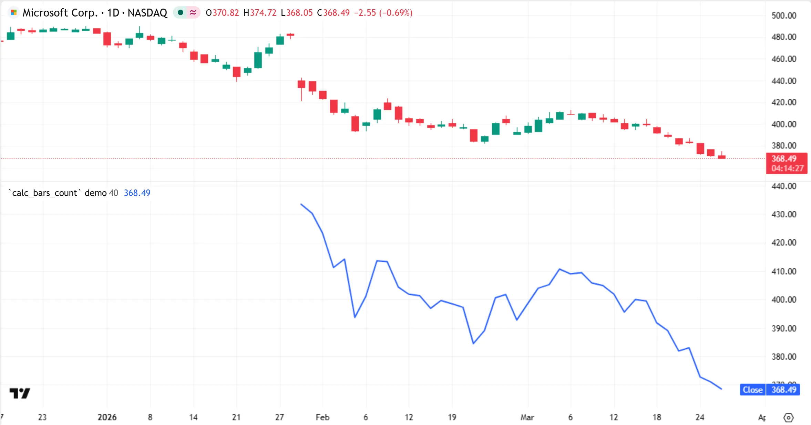

```pine
//@version=6

// The `calc_bars_count` argument in this declaration statement specifies that the script can use
// only the last 40 historical bars for its calculations by default. It also adds a "Calculated bars"
// input to the script's "Settings/Inputs" tab.
indicator("`calc_bars_count` demo", calc_bars_count = 40)

// Plot the `close` series on the specified number of recent historical bars and all realtime bars.
plot(close, "Close", linewidth = 2)
```

### [​`dynamic_requests`​](../3. Language/language_declaration-statements.md#dynamic_requests)

The `dynamic_requests` parameter of the declaration statement specifies whether the script can use `request.*()` function calls to execute [dynamic requests](../1. Concepts/concepts_other-timeframes-and-data.md#dynamic-requests). If the value is `true` (default), the script can:

- Include calls to `request.*()` functions inside the [local scopes](../1. Concepts/concepts_other-timeframes-and-data.md#in-local-scopes) of [conditional structures](../3. Language/language_conditional-structures.md) and [loops](../3. Language/language_loops.md), and in the operands of conditional expressions.
- Use [“series” arguments](../1. Concepts/concepts_other-timeframes-and-data.md#series-arguments) that vary across bars to specify the ticker identifier, timeframe, and other settings of a `request.*()` call.
- Execute [nested requests](../1. Concepts/concepts_other-timeframes-and-data.md#nested-requests), where one `request.*()` call evaluates another inside its context.

If the value is `false`, the script is more limited in how it can use `request.*()` functions:

- All `request.*()` calls must execute in the script’s global scope, and outside the conditional operands of [ternary](../3. Language/language_operators.md#-ternary-operator) or [and](../../reference manual/keywords/and.md)/ [or](../../reference manual/keywords/or.md) operations.
- All `request.*()` parameters except for `expression` require arguments with the “simple” [type qualifier](../3. Language/language_type-system.md#qualifiers) or a weaker qualifier, meaning their values _cannot change_ across bars.
- A `request.*()` call whose `expression` argument depends on another `request.*()` call _cannot_ evaluate the other call within its context.

The following example script calculates a [weighted moving average (WMA)](https://www.tradingview.com/support/solutions/43000594680-weighted-moving-average/) of [hl2](../../reference manual/variables/hl2.md) values over a specified number of chart bars. It also uses a [request.security()](../../reference manual/functions/request.security.md) call within an [if](../../reference manual/keywords/if.md) structure to optionally calculate the latest confirmed WMA on a specified higher timeframe. The script can use the request inside the [if](../../reference manual/keywords/if.md) structure because the [indicator()](../../reference manual/functions/indicator.md) declaration statement’s `dynamic_requests` argument is `true`:

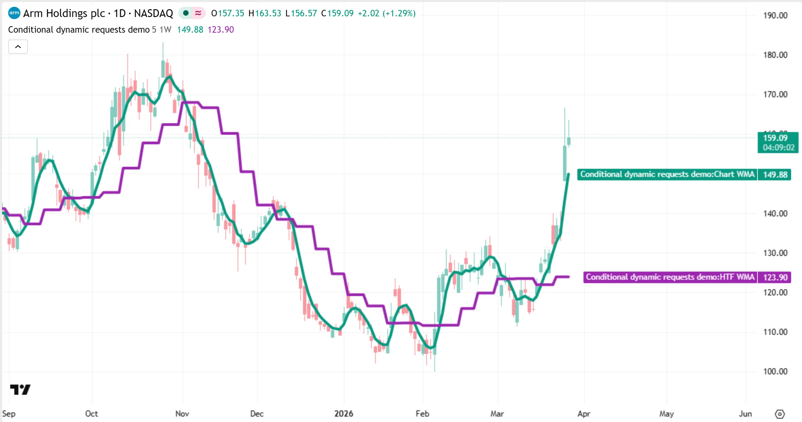

```pine
//@version=6
indicator("Conditional dynamic requests demo", overlay = true, behind_chart = false, dynamic_requests = true)

//@variable The number of bars to use in the WMA calculation.
int lengthInput = input.int(5, "WMA length", minval = 1)
//@variable Specifies whether to retrieve a higher-timeframe WMA.
bool htfRequestInput = input.bool(true, "Show higher-timeframe WMA")
//@variable A higher-timeframe string for the data request.
string timeframeInput = input.timeframe("1W", "Higher timeframe", active = htfRequestInput)

//@variable The weighted moving average of `hl2` values over the specified length.
float chartWMA = ta.wma(hl2, lengthInput)

//@variable The WMA calculated on the higher timeframe if the `htfRequestInput` value is `true`, and `na` otherwise.
float requestedWMA = na

if htfRequestInput
    // Raise an error if the specified timeframe is *not* higher than the chart's timeframe.
    if timeframe.in_seconds(timeframeInput) <= timeframe.in_seconds(timeframe.period)
        runtime.error("The requested timeframe must be higher than the chart's timeframe.")

    // Execute the `request.security()` call for the higher-timeframe request.
    // The call works in this `if` structure because the declaration statement enables dynamic requests.
    // If we change the `dynamic_requests` argument to `false`, this call causes a *compilation error*.
    requestedWMA := request.security(
        syminfo.tickerid, timeframeInput, ta.wma(hl2, lengthInput)[1], lookahead = barmerge.lookahead_on
    )

// Plot the chart WMA and the optional HTF WMA.
plot(chartWMA,     "Chart WMA", color.teal,   4)
plot(requestedWMA, "HTF WMA",   color.purple, 4)
```

Note that:

- The script behaves the same if we remove the `dynamic_requests` argument from the declaration statement, because the default argument is `true`.
- If we change the `dynamic_requests` argument to `false`, the [request.security()](../../reference manual/functions/request.security.md) call causes a _compilation error_ because the script cannot use it inside the [if](../../reference manual/keywords/if.md) statement. To resolve the error without enabling dynamic requests, programmers must move the call to the _global scope_.
- Users can change the “Higher timeframe” input in the “Settings/Inputs” tab only if they select the “Show higher-timeframe WMA” checkbox, because the [input.timeframe()](../../reference manual/functions/input.timeframe.md) call includes the argument `active = htfRequestInput` to control when the input is _active_. See the [Input function parameters](../1. Concepts/concepts_inputs.md#input-function-parameters) section of the [Inputs](../1. Concepts/concepts_inputs.md) page to learn more about `active` and other input parameters.

To learn more about the `request.*()` functions and the differences between dynamic and non-dynamic requests, refer to the [Other timeframes and data](../1. Concepts/concepts_other-timeframes-and-data.md) page.

## [​`strategy()`​](../3. Language/language_declaration-statements.md#strategy)

The [strategy()](../../reference manual/functions/strategy.md) function declares that the script is a _strategy_. [Strategies](../1. Concepts/concepts_strategies.md) can simulate orders and trades across a dataset, enabling users to backtest and forward test their trading systems. They have many similar capabilities to indicators, while also providing the ability to analyze hypothetical trading performance in a dedicated tab.

The built-in [RSI Strategy](https://www.tradingview.com/support/solutions/43000645066-rsi-strategy/) script is an example of a simple strategy. The script simulates entering and exiting positions based on the RSI crossing the defined overbought and oversold levels. It displays trade markers directly on the chart and shows a detailed strategy report in a separate panel below the chart.

Scripts declared as strategies have several unique characteristics, including the following:

- Strategies are the only scripts that can send [orders](../1. Concepts/concepts_strategies.md#orders-and-trades) to the [broker emulator](../1. Concepts/concepts_strategies.md#broker-emulator) and display simulated performance results using the [Strategy Tester](../1. Concepts/concepts_strategies.md#strategy-tester).
- The “Settings” window for strategy scripts features a unique “Properties” tab, where users can customize the [properties](https://www.tradingview.com/support/solutions/43000628599-strategy-properties/) of the strategy simulation. Programmers can specify _default_ properties for this tab via the unique parameters in the [strategy()](../../reference manual/functions/strategy.md) statement.
- Unlike indicators, strategies cannot run on data for other timeframes. They always use the same timeframe as the chart.
- Strategies _cannot_ create alert triggers using the [alertcondition()](../../reference manual/functions/alertcondition.md) function, but they can create them by using calls to the [alert()](../../reference manual/functions/alert.md) function. Additionally, unlike indicators, they can generate special alerts from [order fill events](../1. Concepts/concepts_alerts.md#order-fill-events).
- Unlike the plots created by indicators or [libraries](../1. Concepts/concepts_libraries.md), strategy plots are _not_ accessible to [source inputs](../1. Concepts/concepts_inputs.md#source-input) in other scripts.
- Strategies execute differently from indicators or libraries. By default, they execute strictly _once per closed bar_ and do _not_ execute on open bars. However, users can customize a strategy’s [calculation behavior](../1. Concepts/concepts_strategies.md#altering-calculation-behavior) to enable additional executions on open bars or after the broker emulator fills an order.
- Strategies must include at least one call to an [order placement command](../1. Concepts/concepts_strategies.md#order-placement-and-cancellation), or to a function that creates [plot visuals](../2. Visuals/visuals_overview.md#plot-visuals), [drawing visuals](../2. Visuals/visuals_overview.md#drawing-visuals), [alert triggers](../1. Concepts/concepts_alerts.md), or [Pine Logs](../4. Writing_Scripts/writing_debugging.md#pine-logs).

The [strategy()](../../reference manual/functions/strategy.md) function has the following signature:

```
strategy(title, shorttitle, overlay, format, precision, scale, pyramiding, calc_on_order_fills, calc_on_every_tick, max_bars_back, backtest_fill_limits_assumption, default_qty_type, default_qty_value, initial_capital, currency, slippage, commission_type, commission_value, process_orders_on_close, close_entries_rule, margin_long, margin_short, explicit_plot_zorder, max_lines_count, max_labels_count, max_boxes_count, calc_bars_count, risk_free_rate, use_bar_magnifier, fill_orders_on_standard_ohlc, max_polylines_count, dynamic_requests, behind_chart) → void
```

Because strategies have many of the same features as indicators, the [strategy()](../../reference manual/functions/strategy.md) function includes most of the [indicator()](../../reference manual/functions/indicator.md) function’s parameters. The only exceptions are the [`timeframe` and `timeframe_gaps`](../3. Language/language_declaration-statements.md#timeframe-and-timeframe_gaps) parameters, because strategies cannot execute on other timeframes.

The unique parameters in the [strategy()](../../reference manual/functions/strategy.md) declaration statement define the _default properties_ of the strategy simulation, including the initial simulated capital, default order sizes, hypothetical trading costs, and calculation behaviors. The sections below explain these unique parameters. To learn about the other parameters that are common to both indicators and strategies, see the [`indicator()`](../3. Language/language_declaration-statements.md#indicator) section above.

For detailed information about how to use the unique [strategy()](../../reference manual/functions/strategy.md) function parameters and the built-ins in the `strategy` namespace, refer to the [Strategies](../1. Concepts/concepts_strategies.md) page.

### [​`pyramiding`​](../3. Language/language_declaration-statements.md#pyramiding)

The `pyramiding` parameter of the [strategy()](../../reference manual/functions/strategy.md) declaration statement accepts an “int” value specifying the default maximum number of _open trades_, from the orders created by [strategy.entry()](../../reference manual/functions/strategy.entry.md) calls, that a strategy allows for a single position. The default argument is 1, meaning that the strategy can open only _one_ long or short trade at a time using orders from [strategy.entry()](../../reference manual/functions/strategy.entry.md) calls and _cannot_ execute another entry order in the _same direction_ until after the existing trade closes. Users can adjust the script’s pyramiding limit without editing the code by using the “Pyramiding” input in the script’s “Settings/Properties” tab.

The following example strategy uses two calls to the [strategy.entry()](../../reference manual/functions/strategy.entry.md) command to create [market orders](../1. Concepts/concepts_strategies.md#market-orders) for entering long and short trades. The call for long orders executes once every five bars, excluding multiples of 30, and the one for short orders executes once every 30 bars. The [strategy()](../../reference manual/functions/strategy.md) declaration statement includes the argument `pyramiding = 3`, meaning that the strategy can enter up to _three trades_ for the same position using [strategy.entry()](../../reference manual/functions/strategy.entry.md) calls by default.

As shown below, although the strategy’s long condition (highlighted by the purple background) occurs _five_ times before the short condition (highlighted by the orange background), the strategy executes only **three** entry orders for each long position instead of five. Once the number of open trades reaches three, it does not execute new long entry orders until after the short order _closes_ the existing long position:

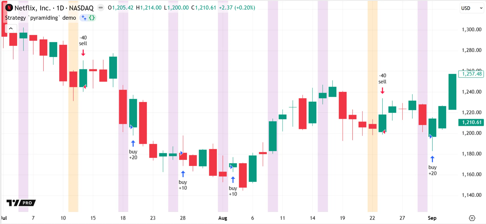

```pine
//@version=6
strategy("Strategy `pyramiding` demo", overlay = true, pyramiding = 3, default_qty_value = 10)

// The `pyramiding = 3` argument above specifies that, by default, the strategy cannot use `strategy.entry()` calls to
// maintain an open position consisting of more than three trades.

//@variable The value for the short condition: `true` on every 30th bar, and `false` otherwise.
bool sellCondition = bar_index % 30 == 0
//@variable The value for the long condition: `true` on every 5th bar, excluding multiples of 30, and `false` otherwise.
bool buyCondition = bar_index % 5 == 0 and not sellCondition

if buyCondition
    // Place a market order named "buy" to close any short position and enter or add to a long position.
    strategy.entry("buy", strategy.long)
if sellCondition
    // Place a market order named "sell" to close any long position and enter or add to a short position.
    strategy.entry("sell", strategy.short)

// Highlight the background when the `buyCondition` or `sellCondition` value is `true`.
bgcolor(
    sellCondition ? color.new(color.orange, 80) : buyCondition ? color.new(color.purple, 85) : na,
    title = "Order conditions highlight"
)
```

Note that:

- By default, the orders from the [strategy.entry()](../../reference manual/functions/strategy.entry.md) command automatically close an existing position in the opposite direction and enter a new trade with the specified quantity. See the [Reversing positions](../1. Concepts/concepts_strategies.md#reversing-positions) section of the [Strategies](../1. Concepts/concepts_strategies.md) page for more information about this behavior.
- The `default_qty_value` argument in the declaration statement specifies the initial default size of the strategy’s orders. See the [`default_qty_type` and `default_qty_value`](../3. Language/language_declaration-statements.md#default_qty_type-and-default_qty_value) section to learn more.
- The strategy enters a new trade after every occurrence of the long condition only if the `pyramiding` value is at least 5.

### [​`calc_on_every_tick`​, ​`calc_on_order_fills`​, and ​`process_orders_on_close`​](../3. Language/language_declaration-statements.md#calc_on_every_tick-calc_on_order_fills-and-process_orders_on_close)

The `calc_on_every_tick`, `calc_on_order_fills`, and `process_orders_on_close` parameters of the [strategy()](../../reference manual/functions/strategy.md) declaration statement specify the strategy’s default [calculation behaviors](../1. Concepts/concepts_strategies.md#altering-calculation-behavior). If the argument for each of these parameters is `false` (default), the strategy executes strictly _once per bar_, on each bar’s _closing tick_, and the [broker emulator](../1. Concepts/concepts_strategies.md#broker-emulator) fills each order from the strategy on the _open_ of the next available bar. Specifying a value of `true` for any of these parameters changes the strategy’s default execution and order-fill behaviors. Users can also change these behaviors via the “On every tick”, “After order is filled”, and “On bar close” checkboxes in the script’s “Settings/Properties” tab.

The `calc_on_every_tick` parameter specifies whether the strategy performs a _new execution_ on _each new tick_ of a [realtime bar](../3. Language/language_execution-model.md#realtime-bars) by default. If the value is `true`, the strategy executes once after _every update_ from the realtime data feed, similar to how an indicator executes, instead of waiting for each realtime bar to close. This parameter does _not_ affect the strategy’s executions on _historical bars_, because realtime tick information is not available on those bars.

The `calc_on_order_fills` parameter specifies whether the strategy can immediately recalculate and place additional orders on any bar where an _order fills_ by default. If the value is `true`, the strategy _re-executes_ on the next available tick following any tick where the broker emulator fills an order, even if that tick occurs during an open bar. This behavior enables the script to execute _more than once_ on any bar where an order fill occurs — up to four times per historical bar by default (at the open, high, low, and close), and up to once for each new tick on a realtime bar.

The `process_orders_on_close` parameter specifies whether the broker emulator can fill an order on the _same closing tick_ where the strategy creates the order by default. If the value is `false` (default), the earliest point at which the broker emulator can fill an order that occurs on a bar’s close is at the _open_ of the _following bar_, because that point is the next possible tick. If the value is `true`, the emulator fills the order _immediately_ on the bar’s close instead of waiting for the next bar’s opening tick.

For example, the following strategy simulates opening a position after one exponential moving average (EMA) crosses over another. On each bar where the EMAs cross, the script highlights the chart’s background, then creates a long or short [market order](../1. Concepts/concepts_strategies.md#market-orders) on that bar’s closing tick. With the default behavior defined by `process_orders_on_close = false`, the broker emulator does not fill each order on the same bar where the strategy creates it. Instead, it fills the order at the open of the following bar, because that point is the next available tick:

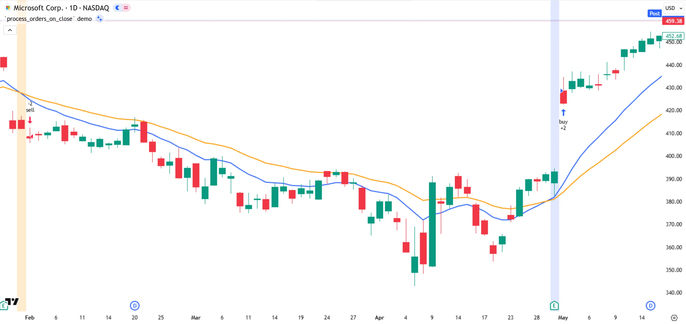

```pine
//@version=6
strategy("`process_orders_on_close` demo", overlay = true, process_orders_on_close = false)

// Calculate fast and slow moving averages.
float fastMA = ta.ema(close, 13)
float slowMA = ta.ema(close, 26)

// Set long and short order conditions based on crosses of the moving averages.
//@variable Is `true` if `fastMA` crosses above `slowMA`.
bool longCondition = ta.crossover(fastMA, slowMA)
//@variable Is `true` if `fastMA` crosses under `slowMA`.
bool shortCondition = ta.crossunder(fastMA, slowMA)
if longCondition
    strategy.entry("buy", strategy.long)
if shortCondition
    strategy.entry("sell", strategy.short)

// Plot the moving averages, and highlight the bars where order conditions occur.
plot(fastMA, "Fast MA", color.blue,   linewidth = 2)
plot(slowMA, "Slow MA", color.orange, linewidth = 2)
// Highlights background blue if long entry condition occurs, or orange if short entry condition occurs.
bgcolor(longCondition ? color.new(color.blue, 85) : shortCondition ? color.new(color.orange, 80) : na)
```

If we include `process_orders_on_close = true` in the [strategy()](../../reference manual/functions/strategy.md) declaration statement, the broker emulator is no longer limited to filling our strategy’s orders on the next available tick by default. Instead, it fills the orders immediately on each bar’s close:

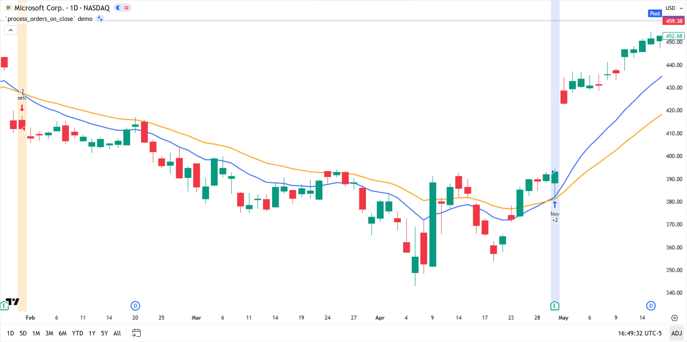

```pine
//@version=6
strategy("`process_orders_on_close` demo", overlay = true, process_orders_on_close = true)

// Calculate fast and slow moving averages.
float fastMA = ta.ema(close, 13)
float slowMA = ta.ema(close, 26)

// Set long and short order conditions based on crosses of the moving averages.
//@variable Is `true` if `fastMA` crosses above `slowMA`.
bool longCondition = ta.crossover(fastMA, slowMA)
//@variable Is `true` if `fastMA` crosses under `slowMA`.
bool shortCondition = ta.crossunder(fastMA, slowMA)
if longCondition
    strategy.entry("buy", strategy.long)
if shortCondition
    strategy.entry("sell", strategy.short)

// Plot the moving averages, and highlight the bars where order conditions occur.
plot(fastMA, "Fast MA", color.blue,   linewidth = 2)
plot(slowMA, "Slow MA", color.orange, linewidth = 2)
// Highlights background blue if long entry condition occurs, or orange if short entry condition occurs.
bgcolor(longCondition ? color.new(color.blue, 85) : shortCondition ? color.new(color.orange, 80) : na)
```

See the [Altering calculation behavior](../1. Concepts/concepts_strategies.md#altering-calculation-behavior) section of the [Strategies](../1. Concepts/concepts_strategies.md) page to learn more about the `calc_on_every_tick`, `calc_on_order_fills`, and `process_orders_on_close` parameters. For detailed information about how scripts execute on historical and realtime bars, and how these parameters affect executions, refer to the [Execution model](../3. Language/language_execution-model.md) page.

### [​`slippage`​ and ​`backtest_fill_limits_assumption`​](../3. Language/language_declaration-statements.md#slippage-and-backtest_fill_limits_assumption)

The `slippage` parameter of the `strategy()` declaration statement specifies the default fixed number of ticks that the strategy applies to the fill prices of _all_ [market orders](../1. Concepts/concepts_strategies.md#market-orders) and [stop orders](../1. Concepts/concepts_strategies.md#stop-and-stop-limit-orders) to simulate [slippage](../1. Concepts/concepts_strategies.md#slippage-and-unfilled-limits). If the argument is a positive “int” value, the strategy adds the specified number of ticks to the fill prices of long orders and subtracts it from the fill prices of short orders. This behavior helps simulate the disparity between expected and actual fill prices that might occur in real-world trading. If the `slippage` argument is 0 (default), the strategy fills orders at their expected prices without simulating any slippage. Users can change the specified slippage amount via the “Slippage” input in the strategy’s “Settings/Properties” tab.

The `backtest_fill_limits_assumption` parameter specifies the default number of ticks by which the market price must _exceed_ the prices of [limit orders](../1. Concepts/concepts_strategies.md#limit-orders) before the [broker emulator](../1. Concepts/concepts_strategies.md#broker-emulator) can fill the orders. If the argument is a positive “int” value, the broker emulator fills a limit order at the defined price only if the market price moves _past_ it by the specified number of ticks in the favorable direction. This behavior helps simulate the possibility of [unfilled limit orders](../1. Concepts/concepts_strategies.md#slippage-and-unfilled-limits), as filling limit orders in the real world requires sufficient liquidity and price action around the limit level. If the argument is 0 (default), the emulator fills orders as soon as the market price reaches the limit price or a more favorable value. Users can adjust a strategy’s limit verification requirements via the “Verify price for limit orders” input in the “Settings/Properties” tab.

### [​`default_qty_type`​ and ​`default_qty_value`​](../3. Language/language_declaration-statements.md#default_qty_type-and-default_qty_value)

The `default_qty_type` and `default_qty_value` parameters of the [strategy()](../../reference manual/functions/strategy.md) declaration statement specify the initial _default order size_ for the [strategy.entry()](../../reference manual/functions/strategy.entry.md) and [strategy.order()](../../reference manual/functions/strategy.order.md) commands. If a call to either command does not specify an order size, the resulting order uses the default order size defined by these parameters. Users can adjust these properties via the “Default order size” inputs in the script’s “Settings/Properties” tab.

The `default_qty_type` parameter specifies the default _quantity type_ for each order from [strategy.entry()](../../reference manual/functions/strategy.entry.md) and [strategy.order()](../../reference manual/functions/strategy.order.md) calls. The possible arguments and their effects are as follows:

- [strategy.fixed](../../reference manual/constants/strategy.fixed.md) — The default order size is a fixed number of contracts, shares, lots, or units, depending on the instrument.
- [strategy.cash](../../reference manual/constants/strategy.cash.md) — The default size is a fixed number of units of the account currency specified by the [`currency`](../3. Language/language_declaration-statements.md#initial_capital-and-currency) argument.
- [strategy.percent\_of\_equity](../../reference manual/constants/strategy.percent_of_equity.md) — The default size is a fixed percentage of the strategy’s available equity.

The default argument is [strategy.fixed](../../reference manual/constants/strategy.fixed.md).

The `default_qty_value` parameter accepts a “float” value that specifies the amount of the defined quantity type to use as the default order size. The default argument is 1, meaning that the strategy uses the default order size of one contract/share/lot/unit, one unit of the account currency, or one percent of the available equity, depending on the `default_qty_type` argument.

The specified default order size applies only to the orders from [strategy.entry()](../../reference manual/functions/strategy.entry.md) and [strategy.order()](../../reference manual/functions/strategy.order.md) calls that do _not_ include a `qty` argument. If a call to either command does include a `qty` argument, that call creates an order for the number of contracts/shares/lots/units specified by the argument instead of using the default quantity type and value. See the [Position sizing](../1. Concepts/concepts_strategies.md#position-sizing) section of the [Strategies](../1. Concepts/concepts_strategies.md) page for an example.

The following example demonstrates how different default order sizes can affect a strategy’s entry orders. The script below uses a [strategy.entry()](../../reference manual/functions/strategy.entry.md) call, without a `qty` argument, to place a long [market order](../1. Concepts/concepts_strategies.md#market-orders) when the [close](../../reference manual/variables/close.md) and [volume](../../reference manual/variables/volume.md) values are rising over a specified number of bars, then uses a [strategy.close\_all()](../../reference manual/functions/strategy.close_all.md) call to close the open position when the [close](../../reference manual/variables/close.md) value is falling while the [volume](../../reference manual/variables/volume.md) value is rising. It also plots the value of the [strategy.position\_size](../../reference manual/variables/strategy.position_size.md) variable in a separate pane to visualize the size of each open position.

The [strategy()](../../reference manual/functions/strategy.md) statement in this example includes the arguments `default_qty_type = strategy.fixed` and `default_qty_value = 20`, which set the strategy’s default order size to 20 contracts/shares/lots/units. As shown by the trade markers and the plot on our NYSE:UBER chart below, each order from the [strategy.entry()](../../reference manual/functions/strategy.entry.md) command consistently opens a 20-share trade:

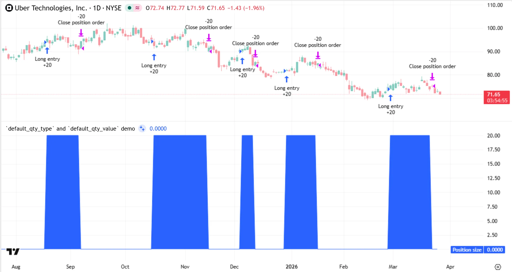

```pine
//@version=6
// The `default_qty_*` arguments in this declaration statement specify that, by default, `strategy.entry()` and
// `strategy.order()` calls create orders for 20 contracts/shares/lots/units if they do not specify a `qty` argument.
strategy(
    "`default_qty_type` and `default_qty_value` demo",
    default_qty_type = strategy.fixed, default_qty_value = 20
)

//@variable The number of bars for the `ta.rising()` and `ta.falling()` calculations.
int lengthInput = input.int(2, "Length", minval = 1, display = display.none)

// Determine if the `close` series is rising or falling over `lengthInput` bars, and if the `volume` series is rising.
bool risingClose  = ta.rising(close,  lengthInput)
bool fallingClose = ta.falling(close, lengthInput)
bool risingVolume = ta.rising(volume, lengthInput)

if risingVolume
    switch
        // Place a long market order if the `close` and `volume` values are both rising.
        risingClose  => strategy.entry("Long entry", strategy.long)
        // Place an order to close the position if the `close` value is falling while the `volume` value is rising.
        fallingClose => strategy.close_all()

// Plot the size of the current position. The plotted value is 0 if a position is not open.
plot(strategy.position_size, "Position size", style = plot.style_area)
```

If we edit the declaration statement to use the argument `default_qty_type = strategy.percent_of_equity`, the strategy sets the default size of each entry order to allocate 20% of its current available equity instead of the amount required to purchase 20 shares. Now, the trade markers and plot show _varying sizes_, because the number of shares that corresponds to the default order size varies with both the strategy’s available equity and the current market price:

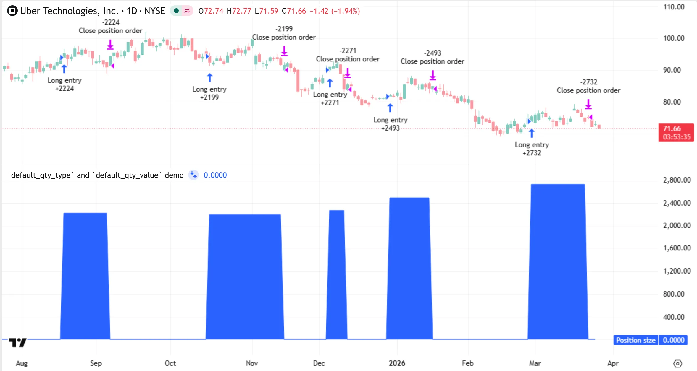

```pine
//@version=6
// The `default_qty_*` arguments in this declaration statement specify that, by default, `strategy.entry()` and
// `strategy.order()` calls create orders for 20% of the available equity if they do not specify a `qty` argument.
strategy(
    "`default_qty_type` and `default_qty_value` demo",
    default_qty_type = strategy.percent_of_equity, default_qty_value = 20
)

//@variable The number of bars for the `ta.rising()` and `ta.falling()` calculations.
int lengthInput = input.int(2, "Length", minval = 1, display = display.none)

// Determine if the `close` series is rising or falling over `lengthInput` bars, and if the `volume` series is rising.
bool risingClose  = ta.rising(close,  lengthInput)
bool fallingClose = ta.falling(close, lengthInput)
bool risingVolume = ta.rising(volume, lengthInput)

if risingVolume
    switch
        // Place a long market order if the `close` and `volume` values are both rising.
        risingClose  => strategy.entry("Long entry", strategy.long)
        // Place an order to close the position if the `close` value is falling while the `volume` value is rising.
        fallingClose => strategy.close_all()

// Plot the size of the current position. The plotted value is 0 if a position is not open.
plot(strategy.position_size, "Position size", style = plot.style_area)
```

### [​`initial_capital`​ and ​`currency`​](../3. Language/language_declaration-statements.md#initial_capital-and-currency)

The `initial_capital` parameter of the `strategy()` declaration statement specifies the default _initial account balance_ for the strategy’s simulation, as a quantity of the account currency. It accepts a positive “int” or “float” argument. The default is 1000000. Users can change the strategy’s initial account balance by adjusting the “Initial capital” input in the script’s “Settings/Properties” tab.

The `currency` parameter specifies the strategy’s default _account currency_. It is the currency unit for the strategy’s initial capital and for the internal calculations in the simulation that express values as currency amounts (equity, profit and loss, commission, etc.). The parameter accepts a `currency.*` constant (e.g., [currency.USD](../../reference manual/constants/currency.USD.md)) or a string representing a valid _currency code_, (e.g., `"USD"`). The default is [currency.NONE](../../reference manual/constants/currency.NONE.md), which specifies that the strategy uses the _same currency_ as that of the quoted prices on the chart. Users can change the strategy’s account currency via the “Base currency” input in the “Settings/Properties” tab.

If the specified account currency differs from the chart’s currency, the strategy _converts_ monetary values in its calculations to express them in the account currency. However, the prices of the strategy’s orders remain expressed in the chart’s currency. To convert necessary monetary values to the account currency, the strategy typically uses the previous _daily_ value of a corresponding _currency pair_ as the conversion rate, or the value from a [spread](https://www.tradingview.com/support/solutions/43000502298-spread-charts-explained/) if no direct currency pair is available. See the [Currency](../1. Concepts/concepts_strategies.md#currency) section of the [Strategies](../1. Concepts/concepts_strategies.md) page for more information.

### [​`commission_type`​ and ​`commission_value`​](../3. Language/language_declaration-statements.md#commission_type-and-commission_value)

The `commission_type` and `commission_value` parameters of the `strategy()` declaration statement specify the default commission fees that the broker emulator applies to the strategy’s simulated transactions. Users can customize the strategy’s commission settings via the “Commission” inputs in the “Settings/Properties” tab.

The `commission_type` parameter determines the default _commission type_ for each executed order. The possible arguments and their effects are as follows:

- [strategy.commission.cash\_per\_order](../../reference manual/constants/strategy.commission.cash_per_order.md) — The default commission for each transaction is a fixed number of units in the strategy’s [account currency](../3. Language/language_declaration-statements.md#initial_capital-and-currency).
- [strategy.commission.cash\_per\_contract](../../reference manual/constants/strategy.commission.cash_per_contract.md) — The commission is a fixed account currency amount for each traded contract/lot/share/unit.
- [strategy.commission.percent](../../reference manual/constants/strategy.commission.percent.md) — The commission is a fixed percentage of each transaction’s value.

The default argument is [strategy.commission.percent](../../reference manual/constants/strategy.commission.percent.md).

The `commission_value` parameter accepts a positive “int” or “float” value specifying the default fee amount for the commission type. For example, if the value is 1, the strategy simulates a fee of one unit of the account currency per transaction, one unit of the account currency per contract/share/lot/unit, or one percent of each transaction’s size by default, depending on the `commission_type` value. The default argument is 0, meaning that the strategy does not simulate commission unless the user specifies a nonzero value for the first “Commission” input in the “Properties” tab.

### [​`close_entries_rule`​](../3. Language/language_declaration-statements.md#close_entries_rule)

The `close_entries_rule` parameter of the [strategy()](../../reference manual/functions/strategy.md) declaration statement determines the order in which the strategy simulation closes the trades in an open market position. It accepts one of two “string” arguments: `"FIFO"` or `"ANY"`. If the value is `"FIFO"`, the [broker emulator](../1. Concepts/concepts_strategies.md#broker-emulator) follows _First In, First Out (FIFO)_ rules when closing market positions. Under these rules, the _earliest_ open trade is always the _first_ to close, regardless of the entry IDs specified by the script’s [strategy.exit()](../../reference manual/functions/strategy.exit.md) or [strategy.close()](../../reference manual/functions/strategy.close.md) calls. If the value is `"ANY"`, the broker emulator _ignores_ FIFO rules and closes the trades specified by the exit commands, even if an earlier trade with a different entry ID is open. The default is `"FIFO"`.

Refer to the [Closing a market position](../1. Concepts/concepts_strategies.md#closing-a-market-position) section of the [Strategies](../1. Concepts/concepts_strategies.md) page for an example of how changing the `close_entries_rule` argument can affect a strategy’s exit behavior.

### [​`margin_long`​ and ​`margin_short`​](../3. Language/language_declaration-statements.md#margin_long-and-margin_short)

The `margin_long` and `margin_short` parameters of the [strategy()](../../reference manual/functions/strategy.md) declaration statement specify the default [margin](../1. Concepts/concepts_strategies.md#margin) requirements for the strategy’s long and short positions, respectively. Users can adjust the strategy’s long and short margin requirements via the “Margin for long positions” and “Margin for short positions” inputs in the “Settings/Properties” tab.

Margin is the percentage of a position’s value that the simulated account must retain in its balance as _collateral_ for the [broker emulator](../1. Concepts/concepts_strategies.md#broker-emulator) to cover the rest of the position. It is the _inverse_ of _leverage_. For example, if the margin requirement for a long position is 50%, the strategy must maintain sufficient funds to cover _half_ of the open position. This level of margin means that the strategy’s leverage is 2:1. In other words, the strategy can risk up to _twice_ its available balance on a simulated trade.

The default `margin_long` and `margin_short` arguments are 100, meaning that the strategy must cover _100%_ of each long and short position using its simulated account balance.

If a strategy’s available funds drop below the required margin percentage, the broker emulator triggers a _margin call_, which forcibly _liquidates_ part or all of the simulated position to cover the loss. For detailed information about margin simulation and margin call events, refer to the [How to simulate trading with leverage in Pine Script](https://www.tradingview.com/support/solutions/43000717375-how-to-simulate-trading-with-leverage-in-pine-script/) article in our Help Center.

### [​`risk_free_rate`​](../3. Language/language_declaration-statements.md#risk_free_rate)

The `risk_free_rate` parameter of the [strategy()](../../reference manual/functions/strategy.md) declaration statement specifies the annual percentage return of a hypothetical _risk-free_ investment. The strategy uses the specified risk-free rate to calculate the [Sharpe ratio](https://www.tradingview.com/support/solutions/43000681694-risk-performance-ratios-sharpe-ratio/) and [Sortino ratio](https://www.tradingview.com/support/solutions/43000681697-risk-performance-ratios-sortino-ratio/) metrics displayed in the “Strategy report” panel. The default value is 2, meaning that these metrics assess the strategy’s _risk-adjusted returns_ relative to a hypothetical 2% risk-free rate.

### [​`use_bar_magnifier`​](../3. Language/language_declaration-statements.md#use_bar_magnifier)

The `use_bar_magnifier` parameter of the [strategy()](../../reference manual/functions/strategy.md) declaration statement specifies whether the strategy enables the [Bar Magnifier](../1. Concepts/concepts_strategies.md#bar-magnifier) backtesting mode by default. Users can activate or deactivate the Bar Magnifier mode by selecting the “Using bar magnifier” checkbox in the strategy’s “Settings/Properties” tab. If the value is `true`, the broker emulator retrieves available prices from a _lower timeframe_ on historical bars by default for more precise intrabar order fills. If the argument is `false` (default), the broker emulator relies on default _assumptions_ about intrabar price movement instead of using prices from a lower timeframe. See the [Broker emulator](../1. Concepts/concepts_strategies.md#broker-emulator) section of the [Strategies](../1. Concepts/concepts_strategies.md) page to learn more.

### [​`fill_orders_on_standard_ohlc`​](../3. Language/language_declaration-statements.md#fill_orders_on_standard_ohlc)

The `fill_orders_on_standard_ohlc` parameter of the [strategy()](../../reference manual/functions/strategy.md) declaration statement specifies whether the broker emulator fills the strategy’s orders using actual prices by default when the strategy executes on a [Heikin Ashi chart](https://www.tradingview.com/support/solutions/43000619436-understanding-heikin-ashi-charts/). Users can activate or deactivate the feature via the “Using standard OHLC” input in the strategy’s “Settings/Properties” tab. If the value is `false`, the emulator fills the strategy’s orders using the chart’s _synthetic prices_ by default. If `true`, it fills the orders using the _actual_ open, high, low, and close prices from a _standard chart_ dataset for more realistic results. The default argument is `false`.

## [​`library()`​](../3. Language/language_declaration-statements.md#library)

The [library()](../../reference manual/functions/library.md) function declares that the script is a library. [Libraries](../1. Concepts/concepts_libraries.md) _export_ reusable [functions](../3. Language/language_user-defined-functions.md), [methods](../3. Language/language_methods.md#user-defined-methods), [user-defined types (UDTs)](../3. Language/language_type-system.md#user-defined-types), [enum types](../3. Language/language_type-system.md#enum-types), or [constant variables](../3. Language/language_type-system.md#const). Libraries can also include _non-exported_ code to demonstrate how they work and how to use them. Indicators, strategies, and other libraries can use the [import](../../reference manual/keywords/import.md) keyword to import a [published](../4. Writing_Scripts/writing_publishing.md) library’s exported code components. Importing components from libraries often helps programmers streamline script creation and simplify source code.

The [VisibleChart](https://www.tradingview.com/script/j7vCseM2-VisibleChart/) publication from [PineCoders](https://www.tradingview.com/u/PineCoders/#published-scripts) is an example of a library. It exports functions that perform calculations on the chart’s visible bars. The example script in the FAQ entry [Can I create an indicator that plots like the built-in Volume or Volume Profile indicators](../6. FAQ/faq_indicators.md#can-i-create-an-indicator-that-plots-like-the-built-in-volume-or-volume-profile-indicators) demonstrates how scripts can import and use functions from this library.

Because the primary purpose of a library is to export components for other scripts, they have multiple unique characteristics, including the following:

- Libraries are the only scripts that can use the [export](../../reference manual/keywords/export.md) keyword.
- Libraries _cannot_ directly create alert triggers, but they can _export_ custom functions that contain [alert()](../../reference manual/functions/alert.md) calls. Indicators and strategies can use the alert triggers from calls to those functions.
- A library’s title acts similarly to a _namespace_ identifier when another script imports the library. Therefore, unlike indicators and strategies, libraries must follow [identifier](../3. Language/language_identifiers.md) naming rules in their titles.
- [User-defined functions](../3. Language/language_user-defined-functions.md) and methods exported by libraries must prefix each declared parameter with a [type keyword](../3. Language/language_user-defined-functions.md#type-keywords).
- The example code of a library executes similarly to an indicator. When applied to a chart, the code executes _once per bar_ on historical bars and _once per tick_ on [realtime bars](../3. Language/language_execution-model.md#realtime-bars).
- Libraries use default indicator properties when their code executes on a chart. The declaration statement of a library does not include parameters for setting decimal precision, plot formatting, scales, drawing limits, or other script properties.
- Unlike indicators, libraries can use the available `strategy.*` built-ins. However, unlike strategies, a library’s example code does _not_ display trade markers on the chart or generate a strategy report.
- For a library to compile, it must use the [export](../../reference manual/keywords/export.md) keyword to export _at least one_ function, method, enum, UDT, or “const” variable.

The [library()](../../reference manual/functions/library.md) function’s signature is as follows:

```
library(title, overlay, dynamic_requests) → void
```

The `overlay` parameter behaves the same as that of the [indicator()](../../reference manual/functions/indicator.md) and [strategy()](../../reference manual/functions/strategy.md) declaration statements. Refer to the [`overlay`, `scale`, and `behind_chart`](../3. Language/language_declaration-statements.md#overlay-scale-and-behind_chart) section above for information about this parameter.

The `title` and `dynamic_requests` parameters are also common to the [indicator()](../../reference manual/functions/indicator.md) and [strategy()](../../reference manual/functions/strategy.md) functions. However, they have some _unique_ characteristics in libraries, as explained in the sections below.

### [​`title`​](../3. Language/language_declaration-statements.md#title)

The `title` parameter of the [library()](../../reference manual/functions/library.md) declaration statement specifies the library’s unique name, which other scripts _reference_ to import and use the library’s code. For example, if a `userName` user [publishes](../4. Writing_Scripts/writing_publishing.md) a library that uses `"foo"` as the `title` argument, another script imports version 1 of the library using the following [import](../../reference manual/keywords/import.md) statement:

```pine
// Imports version 1 of the `foo` library from the `userName` user.
import userName/foo/1
```

The script can then use the library’s defined title (or a specified _alias_) similarly to a _namespace_ to access the imported components. For example, if the library exports a function named `bar()`, the script that imports the library references the library’s title using _dot notation_ when calling the function:

```pine
// Calls the `bar()` function from the `foo` library and assigns the result to a variable.
result = foo.bar()
```

Because a library’s title behaves as a _code identifier_ in other scripts, the `title` argument must follow identifier naming rules. The “string” argument can contain ASCII letters (`a-z` and `A-Z`), numeric digits (`0-9`), and underscores (`_`). The argument cannot be an empty string, cannot contain spaces or special characters, and cannot _start_ with a numeric digit. Special characters include any of the following:

- Basic punctuation, including periods (`.`), commas (`,`), quotation marks (`"`), apostrophes (`'`), exclamation points (`!`), etc.
- Symbols that scripts use for syntax, such as parentheses (`( )`), square brackets (`[ ]`), plus signs (`+`), hyphens (`-`), asterisks (`*`), slashes (`/`), and percent signs (`%`).
- Currency symbols, such as `$` or `€`.
- Non-ASCII letters and digits, such as the Unicode character `𝖠` (U+1D5A0).
- Other Unicode characters, such as emoji or special-purpose symbols.

For example, a string such as `"Library_for_14_day_averages"` is a valid `title` argument for the [library()](../../reference manual/functions/library.md) declaration statement, but an argument such as `"Library for 14-day averages"` causes a _compilation error_.

If a user applies the library directly to their chart, the `title` argument’s text appears as the display name in all relevant chart locations, including the script’s status line, the data window, and the [Pine Logs](../4. Writing_Scripts/writing_debugging.md#pine-logs) pane.

### [​`dynamic_requests`​](../3. Language/language_declaration-statements.md#dynamic_requests-1)

The `dynamic_requests` parameter of the [library()](../../reference manual/functions/library.md) declaration statement specifies whether the library can use [dynamic requests](../1. Concepts/concepts_other-timeframes-and-data.md#dynamic-requests). If the argument is `true` (default), the library can use `request.*()` function calls with [“series” arguments](../1. Concepts/concepts_other-timeframes-and-data.md#nested-requests) to define the requested ticker ID and timeframe, include `request.*()` calls [in the local scopes](../1. Concepts/concepts_other-timeframes-and-data.md#in-local-scopes) of [conditional structures](../3. Language/language_conditional-structures.md) or [loops](../3. Language/language_loops.md), and execute [nested requests](../1. Concepts/concepts_other-timeframes-and-data.md#nested-requests). Additionally, the library can _export_ [user-defined functions](../3. Language/language_user-defined-functions.md) and [methods](../3. Language/language_methods.md#user-defined-methods) that use `request.*()` calls within their [function scopes](../3. Language/language_user-defined-functions.md#function-scopes).

If the `dynamic_requests` argument is `false`, the library allows `request.*()` calls only in the _global scope_ or within _non-exported_ functions, and those calls require arguments with “simple” or a weaker [type qualifier](../3. Language/language_type-system.md#qualifiers) for all parameters except for `expression`.

The example library below exports a custom `requestFinancialInsights()` function, which uses multiple `request.*()` calls to retrieve the quarterly Earnings Per Share (EPS), total revenue, total outstanding shares for a stock, and estimates the instrument’s market capitalization. The function returns a [tuple](../3. Language/language_type-system.md#tuples) containing all four values. The library can export this function because its declaration statement enables dynamic requests.

The library’s example code, listed below the user-defined function, demonstrates one way that programmers who import the library can use the function. The code creates a table and populates its cells with a `requestFinancialInsights()` call’s results on the last available bar:

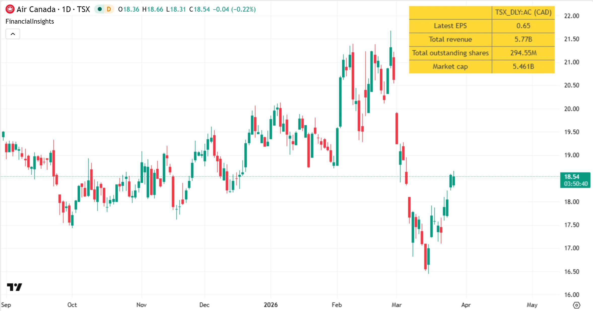

```pine
//@version=6

//@description This library exports a function that uses dynamic `request.*()` calls to retrieve multiple financial
//             metrics for a stock instrument.
library("FinancialInsights", overlay = true, dynamic_requests = true)

//#region --- Exported code ---

//@function      Requests the latest quarterly Earnings Per Share (EPS), total revenue, and total outstanding shares,
//               and calculates the latest market capitalization value for the specified stock.
//@param symbol  The symbol or ticker ID for the data requests. Requires an exchange prefix (e.g., `"NASDAQ:AAPL"`).
//@returns       A tuple containing the EPS, total revenue, outstanding shares, and market cap values, respectively.
export requestFinancialInsights(string symbol) =>
    //@variable The latest Earnings Per Share reported for the stock.
    float eps = request.earnings(symbol, earnings.actual)
    //@variable The quarterly total revenue reported for the issuing company.
    float totalRevenue = request.financial(symbol, "TOTAL_REVENUE", "FQ")
    //@variable The quarterly total number of outstanding shares reported for the stock.
    float totalSharesOutstanding = request.financial(symbol, "TOTAL_SHARES_OUTSTANDING", "FQ")
    //@variable The market capitalization, estimated by multiplying outstanding shares by current share price.
    float marketCap = totalSharesOutstanding * close
    // Return the four results in a tuple.
    [eps, totalRevenue, totalSharesOutstanding, marketCap]
//#endregion

//#region --- Example code ---

// The code defined below shows an example of *how to use* the library's exported function.
// This code is *not* exported; a script that imports the library cannot access it.

//@variable References a `table` object that displays financial insights for the stock represented on the chart.
var table tbl = table.new(position.top_right, 2, 5, color.yellow, border_color = color.gray, border_width = 1)

// Initialize row and column header cells in the table on the first bar.
if barstate.isfirst
    tbl.cell(0, 1, "Latest EPS"),                tbl.cell(0, 2, "Total revenue")
    tbl.cell(0, 3, "Total outstanding shares"),  tbl.cell(0, 4, "Market cap")
    tbl.cell(1, 0, str.format("{0} ({1})", syminfo.tickerid, syminfo.currency))
if barstate.islast
    // Call the `requestFinancialInsights()` function and declare a tuple of variables to store the data on the last bar.
    [currEPS, currRevenue, currShares, currMarketCap] = requestFinancialInsights(syminfo.tickerid)
    // Populate the remaining table cells with the retrieved results.
    tbl.cell(1, 1, str.tostring(currEPS,       "0.00"))
    tbl.cell(1, 2, str.tostring(currRevenue,   format.volume))
    tbl.cell(1, 3, str.tostring(currShares,    format.volume))
    tbl.cell(1, 4, str.tostring(currMarketCap, format.volume))
//#endregion
```

Note that:

- We included `dynamic_requests = true` in the [library()](../../reference manual/functions/library.md) statement only to emphasize the `dynamic_requests` parameter. Specifying this argument is unnecessary; the value is `true` by default. A compilation error occurs if we change the value to `false`, because the library cannot export the custom function or call it within the example code’s [if](../../reference manual/keywords/if.md) structure.
- The ` @description` [annotation](../3. Language/language_script-structure.md#compiler-annotations) at the top of the script sets a _default description_ for the library. Similarly, the ` @function`, ` @param`, and ` @returns` annotations specify documentation for the exported function. Users who import this hypothetical library can hover over its identifiers to view the formatted text from these annotations. Additionally, the “Publish script” window uses these annotations to generate a default [publication description](../4. Writing_Scripts/writing_publishing.md#title-and-description).
- The source code includes `//#region` and `//#endregion` annotations to define _collapsible regions_ that visually separate the library’s exported code from its non-exported code in the Pine Editor.

See the [Request](https://www.tradingview.com/script/Rpmobpw5-Request/) publication from the [TradingView](https://www.tradingview.com/u/TradingView/#published-scripts) account for an advanced example of a library that exports custom functions using dynamic requests.

[Previous 
**Identifiers**](../3. Language/language_identifiers.md) [Next 
**Variable declarations**](../3. Language/language_variable-declarations.md)