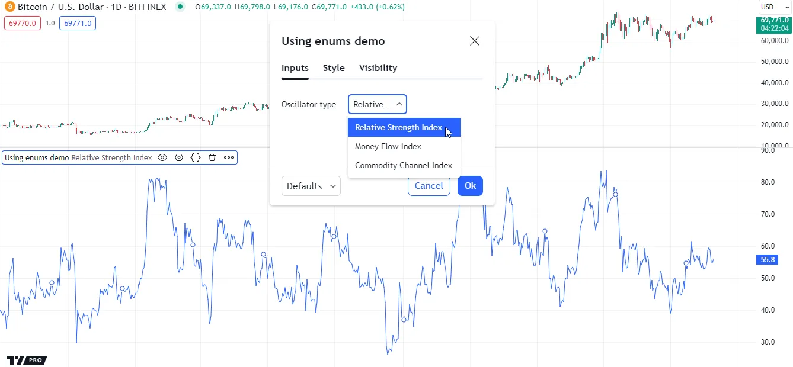
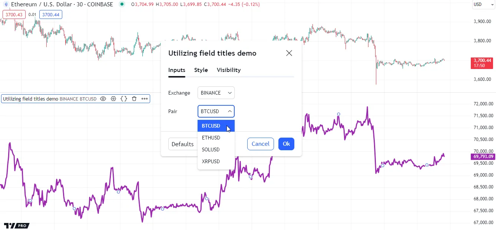
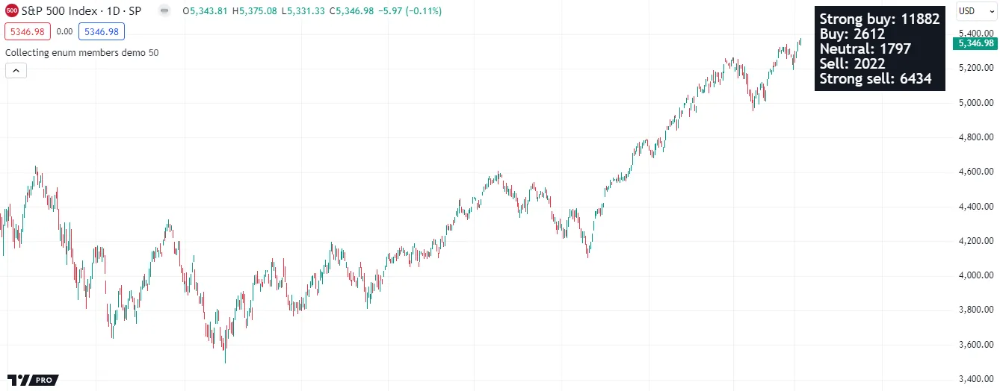

ADVANCED

# [Enums](../3. Language/language_enums.md#enums)

## [Introduction](../3. Language/language_enums.md#introduction)

Pine Script Enums, otherwise known as _enumerations_, _enumerated_
_types_, or
[enum types](../3. Language/language_type-system.md#enum-types), are unique data types with all possible values ( _members_)
explicitly defined by the programmer in advance. They provide a human-readable,
expressive way to declare distinct sets of _predefined values_ that
variables, conditional expressions, and
[collections](../3. Language/language_type-system.md#collections) can accept, allowing more strict control over the values
used in a script’s logic.

## [Declaring an enum](../3. Language/language_enums.md#declaring-an-enum)

To declare an enum, use the
[enum](../../reference manual/keywords/enum.md)
keyword with the following syntax:

```
[export ]enum <enumName>

    <field_1>[ = <title_1>]

    <field_2>[ = <title_2>]

    ...

    <field_N>[ = <title_N>]
```

Each **field** in the enum represents a unique, _named member_ (value)
of the [enum type](../3. Language/language_type-system.md#enum-types). Users can specify optional “const string” **titles** for
enum fields to add extra information about what their values represent.
If the programmer does not specify a field’s title, its title is the
“string” representation of its name.
[Enum inputs](../1. Concepts/concepts_inputs.md#enum-input) display enum field titles within their dropdown menus in a
script’s “Settings/Inputs” tab. Scripts can also retrieve enum field
titles using the
[str.tostring()](../../reference manual/functions/str.tostring.md)
function, allowing their use in additional calculations. See
[this section](../3. Language/language_enums.md#utilizing-field-titles) below for more information.

While the above syntax may look similar to the syntax for declaring
[user-defined types (UDTs)](../3. Language/language_type-system.md#user-defined-types), it’s crucial to understand that
[enum types](../3. Language/language_type-system.md#enum-types) and
[UDTs](../3. Language/language_type-system.md#user-defined-types)
serve different purposes. Scripts use
[UDTs](../3. Language/language_type-system.md#user-defined-types)
to create [objects](../3. Language/language_objects.md) with
“series” fields that can hold values of _any_ specified type. In
contrast, enums are distinct groups of “const” fields representing
the specific, _predefined values_ of the same _unique_ type. Scripts can use these types to define identifiers and [collections](../3. Language/language_type-system.md#collections) that allow only a limited set of possible values.

For example, this code block declares a `Signal` enum with three fields:
`buy`, `sell`, and `neutral`. Each field represents a distinct member
(possible value) of the `Signal` [enum type](../3. Language/language_type-system.md#enum-types). Any variable declared with this type accepts only these members or [na](../../reference manual/variables/na.md):

```pine
//@enum           An enumeration of named values representing buy, sell, and neutral signal states.
//@field buy      Represents a "Buy signal" state.
//@field sell     Represents a "Sell signal" state.
//@field neutral  Represents a "neutral" state.
enum Signal
    buy     = "Buy signal"
    sell    = "Sell signal"
    neutral
```

Note that:

- The `Signal` identifier represents the enum’s name, which signifies the _unique type_ to which the fields belong.
- We use the `//@enum` and `//@field` [annotations](../3. Language/language_script-structure.md#compiler-annotations) to document the meaning of the enum and its members in the code.
- Unlike the `buy` and `sell` fields, the `neutral` field does not include a specified title. Therefore, its title is the “string” representation of its _name_ (`"neutral"`).

To retrieve a member of an enum, use _dot notation_ syntax on the enum name. For example, the following expression retrieves the `fieldName` member of the `enumName` type:

```pine
enumName.fieldName
```

As with other types, scripts can assign enum members to variables,
function parameters, and
[UDT](../3. Language/language_type-system.md#user-defined-types)
fields, enabling strict control over their allowed values.

For instance, the code line below declares a `mySignal` variable whose
value is the `neutral` member of the `Signal` enum. Any value assigned
to this variable later must also be of the same
[enum type](../3. Language/language_type-system.md#enum-types):

```pine
mySignal = Signal.neutral
```

Note that the above line does not require specifying the variable’s _type_ as `Signal`, because the compiler can automatically determine that information from the assigned value. However, if we use [na](../../reference manual/variables/na.md) as the initial value instead, we must include `Signal` as the variable’s type keyword to specify that `mySignal` accepts members of the `Signal` type:

```pine
Signal mySignal = na
```

## [Using enums](../3. Language/language_enums.md#using-enums)

Scripts can compare enum members with the
[==](../../reference manual/operators/==.md) and
[!=](../../reference manual/operators/!=.md)
operators and use the results of those comparisons in
[conditional structures](../3. Language/language_conditional-structures.md), allowing the convenient creation of logical patterns with a
reduced risk of unintended values or operations.

The following example declares an `OscType` enum with three fields representing different oscillator choices: `rsi`, `mfi`, and `cci`. The `calcOscillator()` function compares the `OscType` members within a [switch](../../reference manual/keywords/switch.md) structure to determine which `ta.*()` function it uses to calculate an oscillator. The script calls `calcOscillator()` using the value from an [enum input](../1. Concepts/concepts_inputs.md#enum-input) as the `selection` argument, and then plots the returned oscillator value on the chart:



```pine
//@version=6
indicator("Using enums demo")

//@enum An enumeration of oscillator choices.
enum OscType
    rsi = "Relative Strength Index"
    mfi = "Money Flow Index"
    cci = "Commodity Channel Index"

//@variable An enumerator (member) of the `OscType` enum. Its type is "input OscType".
OscType oscInput = input.enum(OscType.rsi, "Oscillator type")

//@function         Calculates one of three oscillators based on a specified `selection` value.
//@param source     The series of values to process.
//@param length     The number of bars in the calculation.
//@param selection  Determines which oscillator to calculate.
//                  Possible values are: `OscType.rsi`, `OscType.mfi`, `OscType.cci`, or `na`.
calcOscillator(float source, simple int length, OscType selection) =>
    result = switch selection
        OscType.rsi => ta.rsi(source, length)
        OscType.mfi => ta.mfi(source, length)
        OscType.cci => ta.cci(source, length)

// Plot the value of a `calcOscillator()` call with `oscInput` as the `selection` argument.
plot(calcOscillator(close, 20, selection = oscInput))
```

Note that:

- The `selection` parameter of the `calcOscillator()` function can accept one of only _four_ possible values: `OscType.rsi`, `OscType.mfi`, `OscType.cci`, or [na](../../reference manual/variables/na.md).
- The “Oscillator type” input in the script’s “Settings/Inputs” tab displays all `OscType` field titles in its dropdown menu. See the [Enum input](../1. Concepts/concepts_inputs.md#enum-input) section of the [Inputs](../1. Concepts/concepts_inputs.md) page to learn more.

It’s crucial to note that each declared enum represents a _unique_
type. Scripts **cannot** compare members of different enums or use such
members in expressions requiring a specific
[enum type](../3. Language/language_type-system.md#enum-types), even if the fields have identical names and titles.

In this example, we added an `OscType2` enum to the above script and
changed the `oscInput` variable to use a member of that enum. The script
now causes a _compilation error_, because it cannot use a member of the
`OscType2` enum as the `selection` argument in the `calcOscillator()`
call:

```pine
//@version=6
indicator("Incompatible enums demo")

//@enum An enumeration of oscillator choices.
enum OscType
    rsi = "Relative Strength Index"
    mfi = "Money Flow Index"
    cci = "Commodity Channel Index"

//@enum An enumeration of oscillator choices. Its fields *do not* represent the same values those in the `OscType` enum.
enum OscType2
    rsi = "Relative Strength Index"
    mfi = "Money Flow Index"
    cci = "Commodity Channel Index"

//@variable An enumerator (member) of the `OscType2` enum. Its type is "input OscType2".
OscType2 oscInput = input.enum(OscType2.rsi, "Oscillator type")

//@function         Calculates one of three oscillators based on a specified `selection` value.
//@param source     The series of values to process.
//@param length     The number of bars in the calculation.
//@param selection  Determines which oscillator to calculate.
//                  Possible values are: `OscType.rsi`, `OscType.mfi`, `OscType.cci`, or `na`.
calcOscillator(float source, simple int length, OscType selection) =>
    result = switch selection
        OscType.rsi => ta.rsi(source, length)
        OscType.mfi => ta.mfi(source, length)
        OscType.cci => ta.cci(source, length)

// This line causes an error. The `selection` parameter of `calcOscillator()` requires an `OscType` value,
// but the `oscInput` value has a *different* type (`OscType2`).
plot(calcOscillator(close, 20, selection = oscInput))
```

### [Utilizing field titles](../3. Language/language_enums.md#utilizing-field-titles)

The “string” titles of an enum’s fields allow programmers to add
extra information to each member. These field titles appear within a
dropdown input in the script’s “Settings/Inputs” tab when the script uses the
[input.enum()](../../reference manual/functions/input.enum.md)
function.

Scripts can also use enum field titles in their calculations and logic. To access the title of an enum member, use the [str.tostring()](../../reference manual/functions/str.tostring.md) function on the member.

The following example combines the titles from members of two separate enums to create a ticker identifier for a data request. The script declares two enums, `Exchange` and `Pair`, whose fields represent _exchange_ and _currency pair_ names. It creates two [enum inputs](../1. Concepts/concepts_inputs.md#enum-input) using these enums, and assigns their values to the `exchangeInput` and `pairInput` variables. The script uses [str.tostring()](../../reference manual/functions/str.tostring.md) on those variables to retrieve the selected titles, and then [concatenates](../1. Concepts/concepts_strings.md#concatenation) the results to form the “Exchange:Symbol” pair for the [request.security()](../../reference manual/functions/request.security.md) call:



```pine
//@version=6
indicator("Utilizing field titles demo")

//@enum An enumeration of cryptocurrency exchanges. All field titles are the same as the field names.
enum Exchange
    BINANCE
    BITSTAMP
    BITFINEX
    COINBASE
    KRAKEN

//@enum An enumeration of cryptocurrency pairs. All the field titles are the same as the field names.
enum Pair
    BTCUSD
    ETHUSD
    SOLUSD
    XRPUSD

//@variable An enumerator (member) of the `Exchange` enum.
Exchange exchangeInput = input.enum(Exchange.BINANCE, "Exchange")
//@variable An enumerator (member) of the `Pair` enum.
Pair pairInput = input.enum(Pair.BTCUSD, "Pair")

//@variable The exchange-symbol pair for the data request.
simple string symbol = str.tostring(exchangeInput) + ":" + str.tostring(pairInput)

// Plot the `close` value requested from the `symbol` context.
plot(request.security(symbol, timeframe.period, close), "Requested close", color.purple, 3)
```

Note that:

- None of the members of the `Exchange` or `Pair` enums have
specified titles. Therefore, each field’s title is the
“string” representation of its name, as shown by the script’s
[enum inputs](../1. Concepts/concepts_inputs.md#enum-input).
- Calling the
[str.tostring()](../../reference manual/functions/str.tostring.md)
function on an enum field is the **only** way to retrieve its
title for additional calculations. The
[str.format()](../../reference manual/functions/str.format.md)
and `log.*()` functions _cannot_ accept enum members. To use a
field’s title in a string formatting function, call
[str.tostring()](../../reference manual/functions/str.tostring.md)
on the field first, then pass the resulting “string” to the
function.

## [Collecting enum members](../3. Language/language_enums.md#collecting-enum-members)

Pine Script [collections](../3. Language/language_type-system.md#collections) ( [arrays](../3. Language/language_arrays.md), [matrices](../3. Language/language_matrices.md), and [maps](../3. Language/language_maps.md)) can store enum members, allowing strict control over the values they can contain. To create a collection of enum members, include the enum’s _name_ in the _type template_ of the `*.new*()` function from the collection’s namespace (e.g., [array.new<type>()](../../reference manual/functions/array.new<type>.md)).

For example, the following code block creates an empty
[array](../../reference manual/types/array.md) object
to store members of a `FooBar` enum. The only values that the array can contain are `FooBar.foo`, `FooBar.bar`, `FooBar.baz`, and
[na](../../reference manual/variables/na.md):

```pine
//@variable An enumeration of miscellaneous named members.
enum FooBar
    foo
    bar
    baz

//@variable An array that can only contain the following values: `FooBar.foo`, `FooBar.bar`, `FooBar.baz`, `na`.
array<FooBar> fooBarArray = array.new<FooBar>()
```

Enums are particularly helpful when working with
[maps](../3. Language/language_maps.md), as unlike other
_non-fundamental_ [types](../3. Language/language_type-system.md#types), scripts can declare [maps](../3. Language/language_maps.md) with _keys_ of an
[enum type](../3. Language/language_type-system.md#enum-types), enabling strict control over all possible keys allowed in
their key-value pairs.

The following example uses a
[map](../../reference manual/types/map.md)
with enum keys and “int” values to track and count signal states
across chart bars. The script’s `Signal` enum contains five fields
representing specific named states. The `signalCounters` [map](../../reference manual/types/map.md)
uses the `Signal` name as the _first keyword_ in its type template to specify that it can accept only `Signal` members as keys.

The script uses a
[switch](../../reference manual/keywords/switch.md)
structure to calculate a `signalState` variable whose value is a member
of the `Signal` enum, which it uses to determine the counter value to
update in the `signalCounters` map. It constructs a “string” to
represent the key-value pairs of the
[map](../../reference manual/types/map.md)
and displays the result in a single-cell
[table](../../reference manual/types/table.md)
on the last chart bar:



```pine
//@version=6
indicator("Collecting enum members demo", overlay = true)

//@enum An enumeration of named signal states.
enum Signal
    strongBuy  = "Strong buy"
    buy        = "Buy"
    neutral    = "Neutral"
    sell       = "Sell"
    strongSell = "Strong sell"

//@variable The number of bars in the signal calculation.
int lengthInput = input.int(50, "Length", 2)

//@variable A map of `Signal.*` keys and "int" values counting the number of bars with each signal state.
//          Allowed keys: `Signal.strongBuy`, `Signal.buy`, `Signal.neutral`, `Signal.sell`, `Signal.strongSell`, `na`.
var map<Signal, float> signalCounters = map.new<Signal, float>()

//@variable A single-cell table displaying the key-value pairs of the `signalCounters` map.
var table infoTable = table.new(position.top_right, 1, 1, chart.fg_color)

if barstate.isfirst
    // Put `Signal.*`-"int" pairs into the `signalCounters` map to establish insertion order.
    signalCounters.put(Signal.strongBuy, 0)
    signalCounters.put(Signal.buy, 0)
    signalCounters.put(Signal.neutral, 0)
    signalCounters.put(Signal.sell, 0)
    signalCounters.put(Signal.strongSell, 0)
    // Initialize the `infoTable` cell.
    infoTable.cell(0, 0, text_color = chart.bg_color, text_halign = text.align_left, text_size = size.large)

// Calculate the EMA and Percent rank of `source` data over `length` bars.
float ema  = ta.ema(close, lengthInput)
float rank = ta.percentrank(close, lengthInput)

//@variable A `Signal` member representing the current signal state based on `ema` and `rank` values.
Signal signalState = switch
    close > ema => rank > 70 ? Signal.strongBuy  : rank > 50 ? Signal.buy  : Signal.neutral
    close < ema => rank < 30 ? Signal.strongSell : rank < 50 ? Signal.sell : Signal.neutral
    => Signal.neutral

// Add 1 to the value in the `signalCounters` map associated with the `signalState` key.
signalCounters.put(signalState, signalCounters.get(signalState) + 1)

// Update the `infoTable` cell's text using the keys and values from the `signalCounters` map on the last bar.
if barstate.islast
    string tableText = ""
    for [state, count] in signalCounters
        tableText += str.tostring(state) + ": " + str.tostring(count) + "\n"
    infoTable.cell_set_text(0, 0, str.trim(tableText))
```

Note that:

- The `signalCounters` map can contain up to _six_ key-value
pairs, as the `Signal` enum has _five_ predefined values, plus a
possible value of
[na](../../reference manual/variables/na.md),
and [maps](../3. Language/language_maps.md) cannot
contain _repetitive_ keys.
- The script declares the `signalCounters` variable using the
[var](../../reference manual/keywords/var.md)
keyword, signifying that the assigned
[map](../../reference manual/types/map.md)
instance persists across executions.
- On the first chart bar, the script uses five
[map.put()](../../reference manual/functions/map.put.md)
calls to establish the _insertion order_ of keys in the
`signalCounters` map. See
[this section](../3. Language/language_maps.md#mapkeys-and-mapvalues) of the [Maps](../3. Language/language_maps.md) page for more information.
- To minimize _resource usage_, the script declares the
`infoTable` variable and initializes the referenced table’s cell only on the _first bar_, and then
updates the cell’s text on the _latest bar_. See the
[Reducing drawing updates](../4. Writing_Scripts/writing_profiling-and-optimization.md#reducing-drawing-updates) section of the
[Profiling and optimization](../4. Writing_Scripts/writing_profiling-and-optimization.md) page to learn more.

## [Shadowing](../3. Language/language_enums.md#shadowing)

In contrast to [user-defined types (UDTs)](../3. Language/language_type-system.md#user-defined-types), which can have names that _shadow_ some built-in types or namespaces, enum types require _unique_ names that do **not** match any built-in types or namespaces.

For example, this code declares four enums named `Syminfo`, `syminfo`, `polyline`, and `ta`. The last three all cause a compilation error because their names match built-in namespaces:

```pine
//@version=6
indicator("Shadowing demo")

// Naming an enum "Syminfo" with a capital "S" works without an issue.
enum Syminfo
    abcd

// In contrast, the names "syminfo", "polyline", "ta", etc. cause a compilation error because they match
// built-in namespaces:
enum syminfo
    abcd

enum polyline
    abcd

enum ta
    abcd
```

[Previous 
**Objects**](../3. Language/language_objects.md) [Next 
**Methods**](../3. Language/language_methods.md)