ADVANCED

# [Matrices](../3. Language/language_matrices.md#matrices)

## [Introduction](../3. Language/language_matrices.md#introduction)

Pine Script _matrices_ are [collections](../3. Language/language_type-system.md#collections) that store values or references in a rectangular format. They are the equivalent of two-dimensional [arrays](../3. Language/language_arrays.md) with functions and methods for inspection, modification, and advanced calculations. As with arrays, all elements within a matrix must be of the same [built-in type](../3. Language/language_type-system.md#types), [user-defined type](../3. Language/language_type-system.md#user-defined-types), or [enum type](../3. Language/language_type-system.md#enum-types).

Matrices store elements using _two_ separate indices. One index specifies which _row_ contains the element, and the other specifies the element’s _column_. Both indices start at 0 and extend to one less than the total number of rows/columns in the matrix. Matrices in Pine can have dynamic numbers of rows and columns that vary across bars. The total number of elements within a matrix is the _product_ of the number of rows and columns it contains (e.g., a five-row, five-column matrix contains 25 elements). Similar to [arrays](../3. Language/language_arrays.md), the total number of elements in a matrix cannot exceed 100,000.

## [Declaring a matrix](../3. Language/language_matrices.md#declaring-a-matrix)

Pine Script uses the following syntax for matrix declarations:

```
[var/varip ][matrix<type> ]<identifier> = <expression>
```

Where `<type>` is a _type template_ that defines the type of elements that the matrix can contain, and `<expression>` is an expression that returns either the _reference (ID)_ of a matrix or [na](../../reference manual/variables/na.md). See the [Collections](../3. Language/language_type-system.md#collections) section of the [Type system](../3. Language/language_type-system.md) page to learn about type templates.

When initializing a matrix variable using [na](../../reference manual/variables/na.md), programmers must prefix the variable declaration with the [matrix](../../reference manual/types/matrix.md) keyword followed by a type template to explicitly define the variable’s _type identifier_ (e.g., `matrix<int>` for a variable that can reference a matrix of “int” values).

The following line of code declares a `myMatrix` variable with an initial reference of [na](../../reference manual/variables/na.md). It uses `matrix<float>` as the type identifier, telling the compiler that the variable can accept the ID of a matrix containing “float” elements:

```pine
matrix<float> myMatrix = na
```

If a matrix variable is not initialized with [na](../../reference manual/variables/na.md), specifying a type identifier is optional, because the compiler can automatically determine the variable’s accepted type from the assigned matrix ID.

This code line declares a `myMatrix` variable to store the result of a call to `matrix.new<float>()`. The call creates a two-row, two-column “float” matrix with all initial elements set to 0, and then returns the ID of that matrix. An explicit type identifier is optional in this variable declaration, because the compiler uses the assigned ID to determine that the variable’s type is `matrix<float>`:

```pine
myMatrix = matrix.new<float>(2, 2, 0.0)
```

### [Using ​`var`​ and ​`varip`​ keywords](../3. Language/language_matrices.md#using-var-and-varip-keywords)

As with other variables, users can include the
[var](../../reference manual/keywords/var.md) or
[varip](../../reference manual/keywords/varip.md)
keywords to instruct a script to declare a matrix variable on only one bar instead of on every execution of the variable’s scope. A matrix variable declared with this keyword points to the same instance throughout the span of the chart unless
the script explicitly assigns another matrix reference to it. This behavior allows a matrix
and its elements to persist across bars.

This script declares an `m` variable to reference a matrix that holds a
single row of two
[int](../../reference manual/types/int.md)
elements using the
[var](../../reference manual/keywords/var.md)
keyword. On every 20th bar, the script adds 1 to the first element on
the first row of the `m` matrix. The
[plot()](../../reference manual/functions/plot.md)
call displays this element’s value on the chart. As we see from the plot, the
value of the [matrix.get()](../../reference manual/functions/matrix.get.md) method call
persists across bars, never returning to the initial value of 0:

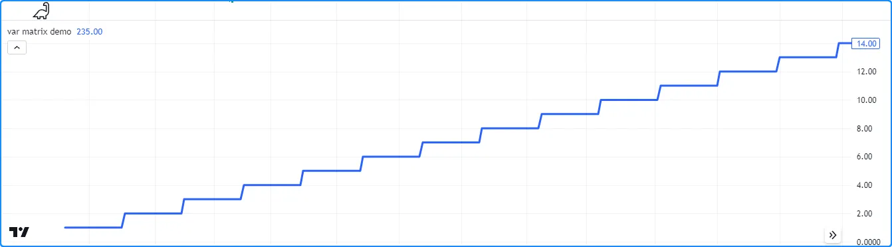

```pine
//@version=6
indicator("var matrix demo")

//@variable A 1x2 rectangular matrix declared only at `bar_index == 0`, i.e., the first bar.
var m = matrix.new<int>(1, 2, 0)

//@variable Is `true` on every 20th bar.
bool update = bar_index % 20 == 0

if update
    int currentValue = m.get(0, 0) // Get the current value of the first row and column.
    m.set(0, 0, currentValue + 1)  // Set the first row and column element value to `currentValue + 1`.

plot(m.get(0, 0), linewidth = 3) // Plot the value from the first row and column.
```

## [Reading and writing matrix elements](../3. Language/language_matrices.md#reading-and-writing-matrix-elements)

### [​`matrix.get()`​ and ​`matrix.set()`​](../3. Language/language_matrices.md#matrixget-and-matrixset)

To retrieve the value from a matrix at a specified `row` and `column`
index, use
[matrix.get()](../../reference manual/functions/matrix.get.md).
This function locates the specified matrix element and returns its
value. Similarly, to overwrite a specific element’s value, use
[matrix.set()](../../reference manual/functions/matrix.set.md)
to assign the element at the specified `row` and `column` to a new
`value`.

The example below defines a square matrix `m` with two rows and columns
and an `initial_value` of 0 for all elements on the first bar. The
script adds 1 to each element’s value on different bars using [matrix.get()](../../reference manual/functions/matrix.get.md)
and
[matrix.set()](../../reference manual/functions/matrix.set.md)
method calls. It updates the first row’s first value once every 11 bars, the
first row’s second value once every seven bars, the second row’s first
value once every five bars, and the second row’s second value once
every three bars. The script plots each element’s value on the chart:

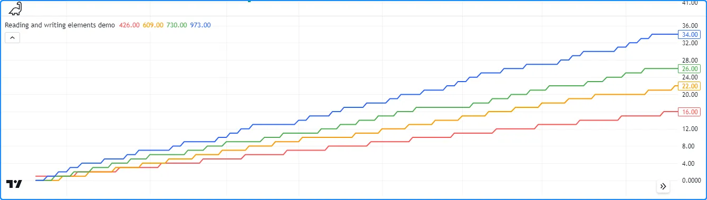

```pine
//@version=6
indicator("Reading and writing elements demo")

//@variable A 2x2 square matrix of `float` values.
var m = matrix.new<float>(2, 2, 0.0)

switch
    bar_index % 11 == 0 => m.set(0, 0, m.get(0, 0) + 1.0) // Adds 1 to the value at row 0, column 0 every 11th bar.
    bar_index % 7  == 0 => m.set(0, 1, m.get(0, 1) + 1.0) // Adds 1 to the value at row 0, column 1 every 7th bar.
    bar_index % 5  == 0 => m.set(1, 0, m.get(1, 0) + 1.0) // Adds 1 to the value at row 1, column 0 every 5th bar.
    bar_index % 3  == 0 => m.set(1, 1, m.get(1, 1) + 1.0) // Adds 1 to the value at row 1, column 1 every 3rd bar.

plot(m.get(0, 0), "Row 0, Column 0 Value", color.red, 2)
plot(m.get(0, 1), "Row 0, Column 1 Value", color.orange, 2)
plot(m.get(1, 0), "Row 1, Column 0 Value", color.green, 2)
plot(m.get(1, 1), "Row 1, Column 1 Value", color.blue, 2)
```

### [​`matrix.fill()`​](../3. Language/language_matrices.md#matrixfill)

To overwrite all matrix elements with a specific value, use
[matrix.fill()](../../reference manual/functions/matrix.fill.md).
This function points all items in the entire matrix or within the
`from_row/column` and `to_row/column` index range to the `value`
specified in the call. For example, this snippet declares a 4x4 square
matrix, then fills its elements with the result of a
[math.random()](../../reference manual/functions/math.random.md)
call:

```pine
myMatrix = matrix.new<float>(4, 4)
myMatrix.fill(math.random())
```

Note when using
[matrix.fill()](../../reference manual/functions/matrix.fill.md)
with matrices of _reference types_
( [line](../../reference manual/types/line.md),
[linefill](../../reference manual/types/linefill.md),
[box](../../reference manual/types/box.md),
[polyline](../../reference manual/types/polyline.md),
[label](../../reference manual/types/label.md),
[table](../../reference manual/types/table.md),
or
[chart.point](../../reference manual/types/chart.point.md))
or [UDTs](../3. Language/language_type-system.md#user-defined-types), all replaced elements will point to the same object passed
in the function call.

This script declares a matrix with four rows and columns of
[label](../../reference manual/types/label.md)
references, which it fills with a new
[label](../../reference manual/types/label.md)
reference on the first bar. On each bar, the script sets the `x` property
of the label referenced at row 0, column 0 to
[bar\_index](../../reference manual/variables/bar_index.md),
and the `text` property of the one referenced at row 3, column 3 to the
number of labels on the chart. Although the matrix can reference 16
(4x4) labels, each element refers to the _same_ label object, resulting in
only one label on the chart with coordinates and displayed text that update on each bar:

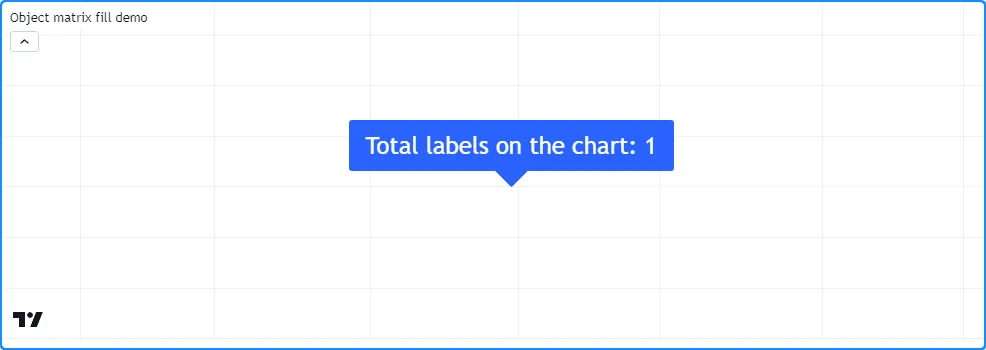

```pine
//@version=6
indicator("Object matrix fill demo")

//@variable A 4x4 label matrix.
var matrix<label> m = matrix.new<label>(4, 4)

// Fill `m` with a new label object on the first bar.
if bar_index == 0
    m.fill(label.new(0, 0, textcolor = color.white, size = size.huge))

//@variable The number of label objects on the chart.
int numLabels = label.all.size()

// Set the `x` of the label from the first row and column to `bar_index`.
m.get(0, 0).set_x(bar_index)
// Set the `text` of the label at the last row and column to the number of labels.
m.get(3, 3).set_text(str.format("Total labels on the chart: {0}", numLabels))
```

## [Rows and columns](../3. Language/language_matrices.md#rows-and-columns)

### [Retrieving](../3. Language/language_matrices.md#retrieving)

Scripts can retrieve all the data from a specific row or
column in a matrix via the
[matrix.row()](../../reference manual/functions/matrix.row.md)
and
[matrix.col()](../../reference manual/functions/matrix.col.md)
functions. These functions return the row or column contents as an
[array](../../reference manual/types/array.md) sized according to the other dimension of the matrix. The
size of a
[matrix.row()](../../reference manual/functions/matrix.row.md)
array equals the number of columns ( [matrix.columns()](../../reference manual/functions/matrix.columns.md)), and the size of a [matrix.col()](../../reference manual/functions/matrix.col.md) array equals the number of rows [matrix.rows()](../../reference manual/functions/matrix.rows.md).

The script below populates a 3x2 `m` matrix with the values 1 - 6 on the
first chart bar. It uses
[matrix.row()](../../reference manual/functions/matrix.row.md)
and
[matrix.col()](../../reference manual/functions/matrix.col.md)
method calls to access the first row and column arrays from the matrix and
displays them on the chart in a label along with the array sizes:

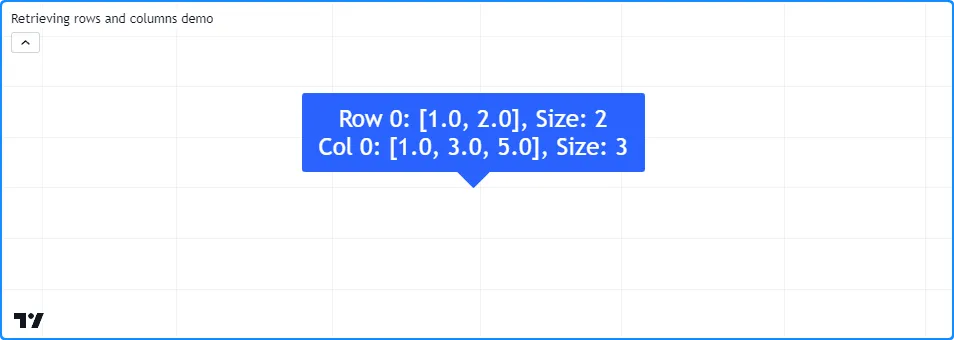

```pine
//@version=6
indicator("Retrieving rows and columns demo")

//@variable A 3x2 rectangular matrix.
var matrix<float> m = matrix.new<float>(3, 2)

if bar_index == 0
    m.set(0, 0, 1.0) // Set row 0, column 0 value to 1.
    m.set(0, 1, 2.0) // Set row 0, column 1 value to 2.
    m.set(1, 0, 3.0) // Set row 1, column 0 value to 3.
    m.set(1, 1, 4.0) // Set row 1, column 1 value to 4.
    m.set(2, 0, 5.0) // Set row 2, column 0 value to 5.
    m.set(2, 1, 6.0) // Set row 2, column 1 value to 6.

//@variable The first row of the matrix.
array<float> row0 = m.row(0)
//@variable The first column of the matrix.
array<float> column0 = m.col(0)

//@variable Displays the first row and column of the matrix and their sizes in a label.
var label debugLabel = label.new(0, 0, color = color.blue, textcolor = color.white, size = size.huge)
debugLabel.set_x(bar_index)
debugLabel.set_text(str.format("Row 0: {0}, Size: {1}\nCol 0: {2}, Size: {3}", row0, m.columns(), column0, m.rows()))
```

Note that:

- To get the sizes of the arrays displayed in the label, we used
the
[matrix.rows()](../../reference manual/functions/matrix.rows.md)
and
[matrix.columns()](../../reference manual/functions/matrix.columns.md)
methods rather than
[array.size()](../../reference manual/functions/array.size.md)
to demonstrate that the size of the `row0` array equals the
number of matrix columns and the size of the `column0` array equals the
number of matrix rows.

The [matrix.row()](../../reference manual/functions/matrix.row.md)
and
[matrix.col()](../../reference manual/functions/matrix.col.md) functions
copy the contents of a row/column to a new
[array](../../reference manual/types/array.md).
Modifications to the [arrays](../3. Language/language_arrays.md)
returned by these functions do not directly affect the elements or the
shape of a matrix.

Here, we’ve modified the previous script to set the first element of
`row0` to 10 via the
[array.set()](../../reference manual/functions/array.set.md)
method before displaying the label. This script also plots the value
from row 0, column 0. As we see, the label shows that the first element
of the `row0` array is 10. However, the plot
shows that the corresponding matrix element still has a value of 1:

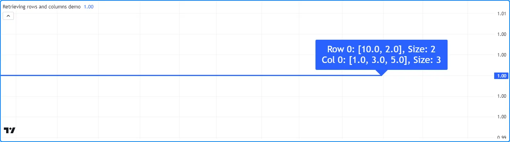

```pine
//@version=6
indicator("Retrieving rows and columns demo")

//@variable A 3x2 rectangular matrix.
var matrix<float> m = matrix.new<float>(3, 2)

if bar_index == 0
    m.set(0, 0, 1.0) // Set row 0, column 0 value to 1.
    m.set(0, 1, 2.0) // Set row 0, column 1 value to 2.
    m.set(1, 0, 3.0) // Set row 1, column 0 value to 3.
    m.set(1, 1, 4.0) // Set row 1, column 1 value to 4.
    m.set(2, 0, 5.0) // Set row 1, column 0 value to 5.
    m.set(2, 1, 6.0) // Set row 1, column 1 value to 6.

//@variable The first row of the matrix.
array<float> row0 = m.row(0)
//@variable The first column of the matrix.
array<float> column0 = m.col(0)

// Set the first `row` element to 10.
row0.set(0, 10)

//@variable Displays the first row and column of the matrix and their sizes in a label.
var label debugLabel = label.new(0, m.get(0, 0), color = color.blue, textcolor = color.white, size = size.huge)
debugLabel.set_x(bar_index)
debugLabel.set_text(str.format("Row 0: {0}, Size: {1}\nCol 0: {2}, Size: {3}", row0, m.columns(), column0, m.rows()))

// Plot the first element of `m`.
plot(m.get(0, 0), linewidth = 3)
```

Although changes to an
[array](../../reference manual/types/array.md)
constructed from
[matrix.row()](../../reference manual/functions/matrix.row.md)
or
[matrix.col()](../../reference manual/functions/matrix.col.md)
do not directly affect a parent matrix, it’s important to note the
resulting array from a matrix containing
[UDTs](../3. Language/language_type-system.md#user-defined-types)
or special types, including
[line](../../reference manual/types/line.md),
[linefill](../../reference manual/types/linefill.md),
[box](../../reference manual/types/box.md),
[polyline](../../reference manual/types/polyline.md),
[label](../../reference manual/types/label.md),
[table](../../reference manual/types/table.md),
or
[chart.point](../../reference manual/types/chart.point.md),
behaves as a _shallow copy_ of a row/column, i.e., the elements within
an array returned from these functions reference the same objects as the
corresponding matrix elements.

This script contains a custom `myUDT` type containing a `value` field
with an initial value of 0. It declares a 1x1 `m` matrix to hold a
single `myUDT` instance on the first bar, then calls `m.row(0)` to copy
the first row of the matrix as an
[array](../../reference manual/types/array.md).
On every chart bar, the script adds 1 to the `value` field of the first
`row` array element. In this case, the `value` field of the matrix
element increases on every bar as well, because both elements refer to the
same object:

```pine
//@version=6
indicator("Row with reference types demo")

//@type A custom type that holds a float value.
type myUDT
    float value = 0.0

//@variable A 1x1 matrix of `myUDT` type.
var matrix<myUDT> m = matrix.new<myUDT>(1, 1, myUDT.new())
//@variable A shallow copy of the first row of `m`.
array<myUDT> row = m.row(0)
//@variable The first element of the `row`.
myUDT firstElement = row.get(0)

firstElement.value += 1.0 // Add 1 to the `value` field of `firstElement`. Also affects the element in the matrix.

plot(m.get(0, 0).value, linewidth = 3) // Plot the `value` of the `myUDT` object from the first row and column of `m`.
```

### [Inserting](../3. Language/language_matrices.md#inserting)

Scripts can add new rows and columns to a matrix via
[matrix.add\_row()](../../reference manual/functions/matrix.add_row.md)
and
[matrix.add\_col()](../../reference manual/functions/matrix.add_col.md).
These functions insert the values or references from an
[array](../../reference manual/types/array.md)
into a matrix at the specified `row/column` index. If the `id` matrix is
empty (has no rows or columns), the array referenced by `array_id` in the call can be of any
size. If a row/column exists at the specified index, the matrix
increases the index value for the existing row/column and all after it
by one.

The script below declares an empty `m` matrix and inserts rows and
columns by calling
[matrix.add\_row()](../../reference manual/functions/matrix.add_row.md)
and
[matrix.add\_col()](../../reference manual/functions/matrix.add_col.md) as
methods. It first inserts an array with three elements at row 0, turning
`m` into a 1x3 matrix, then another at row 1, changing the shape to 2x3.
After that, the script inserts another array at row 0, which changes the
shape of `m` to 3x3 and shifts the index of all rows previously at index
0 and higher. It inserts another array at the last column index,
changing the shape to 3x4. Finally, it adds an array with four values at
the end row index.

The resulting matrix has four rows and columns and contains values 1-16
in ascending order. The script displays the rows of the matrix after each
row/column insertion with a user-defined `debugLabel()` function to
visualize the process:

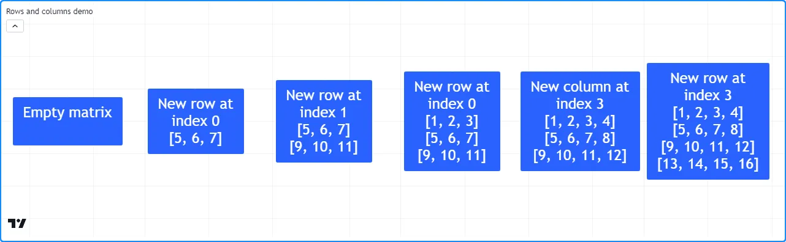

```pine
//@version=6
indicator("Rows and columns demo")

//@function Displays the rows of a matrix in a label with a note.
//@param    this The matrix to display.
//@param    barIndex The `bar_index` to display the label at.
//@param    bgColor The background color of the label.
//@param    textColor The color of the label's text.
//@param    note The text to display above the rows.
method debugLabel(
     matrix<float> this, int barIndex = bar_index, color bgColor = color.blue,
     color textColor = color.white, string note = ""
) =>
    labelText = note + "\n" + str.tostring(this)
    if barstate.ishistory
        label.new(
             barIndex, 0, labelText, color = bgColor, style = label.style_label_center,
             textcolor = textColor, size = size.huge
         )

//Create an empty matrix.
var m = matrix.new<float>()

if bar_index == last_bar_index - 1
    debugLabel(m, bar_index - 30, note = "Empty matrix")

    // Insert an array at row 0. `m` will now have 1 row and 3 columns.
    m.add_row(0, array.from(5, 6, 7))
    debugLabel(m, bar_index - 20, note = "New row at\nindex 0")

    // Insert an array at row 1. `m` will now have 2 rows and 3 columns.
    m.add_row(1, array.from(9, 10, 11))
    debugLabel(m, bar_index - 10, note = "New row at\nindex 1")

    // Insert another array at row 0. `m` will now have 3 rows and 3 columns.
    // The values previously on row 0 will now be on row 1, and the values from row 1 will be on row 2.
    m.add_row(0, array.from(1, 2, 3))
    debugLabel(m, bar_index, note = "New row at\nindex 0")

    // Insert an array at column 3. `m` will now have 3 rows and 4 columns.
    m.add_col(3, array.from(4, 8, 12))
    debugLabel(m, bar_index + 10, note = "New column at\nindex 3")

    // Insert an array at row 3. `m` will now have 4 rows and 4 columns.
    m.add_row(3, array.from(13, 14, 15, 16))
    debugLabel(m, bar_index + 20, note = "New row at\nindex 3")
```

### [Removing](../3. Language/language_matrices.md#removing)

To remove a specific row or column from a matrix, use
[matrix.remove\_row()](../../reference manual/functions/matrix.remove_row.md)
and
[matrix.remove\_col()](../../reference manual/functions/matrix.remove_col.md).
These functions remove the specified row/column and decrease the index
values of all rows/columns after it by one.

For this example, we’ve added these lines of code to our “Rows and
columns demo” script from the
[Inserting](../3. Language/language_matrices.md#inserting) section above:

```pine
// Removing example

    // Remove the first row and last column from the matrix. `m` will now have 3 rows and 3 columns.
    m.remove_row(0)
    m.remove_col(3)
    debugLabel(m, bar_index + 30, color.red, note = "Removed row 0\nand column 3")
```

This code removes the first row and the last column of the `m` matrix
using
[matrix.remove\_row()](../../reference manual/functions/matrix.remove_row.md)
and
[matrix.remove\_col()](../../reference manual/functions/matrix.remove_col.md)
method calls, then displays the rows in a label at `bar_index + 30`. As we can
see, the matrix has a 3x3 shape after the script executes this block, and the index
values for all existing rows are reduced by 1:

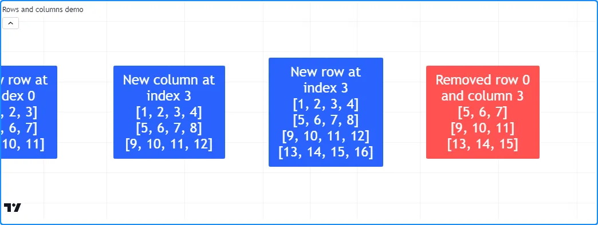

### [Swapping](../3. Language/language_matrices.md#swapping)

To swap the rows and columns of a matrix without altering its
dimensions, use
[matrix.swap\_rows()](../../reference manual/functions/matrix.swap_rows.md)
and
[matrix.swap\_columns()](../../reference manual/functions/matrix.swap_columns.md).
These functions swap the positions of the elements at the `row1/column1`
and `row2/column2` indices.

Let’s add another set of code lines to the example from the
[removing](../3. Language/language_matrices.md#removing) section. The following lines swap the first and last rows of the `m` matrix and display the
changes in a label at `bar_index + 40`:

```pine
// Swapping example

    // Swap the first and last row. `m` retains the same dimensions.
    m.swap_rows(0, 2)
    debugLabel(m, bar_index + 40, color.purple, note = "Swapped rows 0\nand 2")
```

In the new label, we see the matrix has the same number of rows as
before, and the first and last rows have traded places:

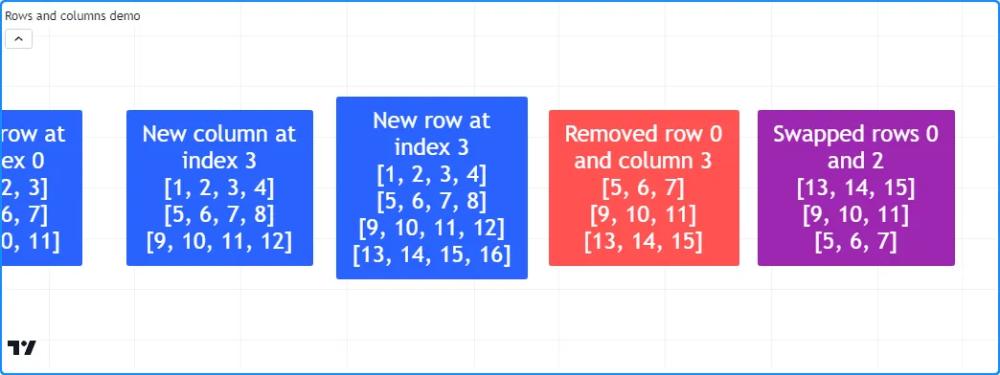

### [Replacing](../3. Language/language_matrices.md#replacing)

It may be desirable in some cases to completely _replace_ a row or
column in a matrix. To do so,
[insert](../3. Language/language_matrices.md#inserting) another array’s elements at the desired `row/column` and
[remove](../3. Language/language_matrices.md#removing) the old elements previously at that index.

In the following code, we’ve defined a `replaceRow()` method that uses
the
[matrix.add\_row()](../../reference manual/functions/matrix.add_row.md)
function to insert the new `values` at the `row` index, and the
[matrix.remove\_row()](../../reference manual/functions/matrix.remove_row.md)
method to remove the old row that moved to the `row + 1` index. This
script uses the `replaceRow()` method to fill the rows of a 3x3 matrix
with the numbers 1-9. It draws a label on the chart before and after
replacing the rows using the custom `debugLabel()` method:

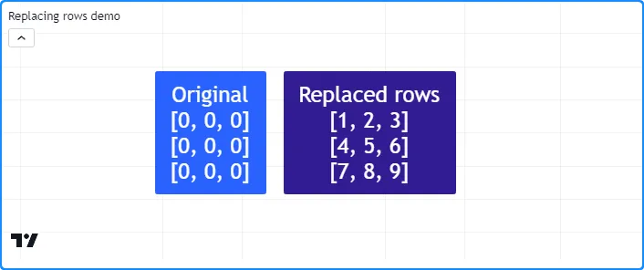

```pine
//@version=6
indicator("Replacing rows demo")

//@function Displays the rows of a matrix in a label with a note.
//@param    this The matrix to display.
//@param    barIndex The `bar_index` to display the label at.
//@param    bgColor The background color of the label.
//@param    textColor The color of the label's text.
//@param    note The text to display above the rows.
method debugLabel(
     matrix<float> this, int barIndex = bar_index, color bgColor = color.blue,
     color textColor = color.white, string note = ""
) =>
    labelText = note + "\n" + str.tostring(this)
    if barstate.ishistory
        label.new(
             barIndex, 0, labelText, color = bgColor, style = label.style_label_center,
             textcolor = textColor, size = size.huge
         )

//@function Replaces the `row` of `this` matrix with a new array of `values`.
//@param    row The row index to replace.
//@param    values The array of values to insert.
method replaceRow(matrix<float> this, int row, array<float> values) =>
    this.add_row(row, values) // Inserts a copy of the `values` array at the `row`.
    this.remove_row(row + 1)  // Removes the old elements previously at the `row`.

//@variable A 3x3 matrix.
var matrix<float> m = matrix.new<float>(3, 3, 0.0)

if bar_index == last_bar_index - 1
    m.debugLabel(note = "Original")
    // Replace each row of `m`.
    m.replaceRow(0, array.from(1.0, 2.0, 3.0))
    m.replaceRow(1, array.from(4.0, 5.0, 6.0))
    m.replaceRow(2, array.from(7.0, 8.0, 9.0))
    m.debugLabel(bar_index + 10, note = "Replaced rows")
```

## [Looping through a matrix](../3. Language/language_matrices.md#looping-through-a-matrix)

### [​`for`​](../3. Language/language_matrices.md#for)

When a script only needs to iterate over the row/column indices in a
matrix, the most common method is to use
[for](../../reference manual/keywords/for.md)
loops. For example, this line creates a loop with a `row` value that
starts at 0 and increases by one until it reaches one less than the
number of rows in the `m` matrix (i.e., the last row index):

```pine
for row = 0 to m.rows() - 1
```

To iterate over all index values in the `m` matrix, we can create a
_nested_ loop that iterates over each `column` index on each `row`
value:

```pine
for row = 0 to m.rows() - 1
    for column = 0 to m.columns() - 1
```

Let’s use this nested structure to create a
[method](../3. Language/language_methods.md) that visualizes
matrix elements. In the script below, we’ve defined a `toTable()`
method that displays the elements of a matrix within a
[table](../../reference manual/types/table.md)
object. It iterates over each `row` index and over each `column` index
on every `row`. Within the loop, it converts each element to a
[string](../../reference manual/types/string.md)
to display in the corresponding table cell.

On the first bar, the script creates an empty `m` matrix, populates it
with rows, and calls `m.toTable()` to display its elements:

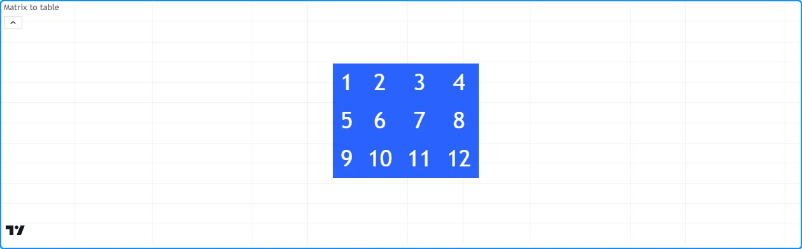

```pine
//@version=6
indicator("Matrix too large demo")

var matrix<float> m = matrix.new<float>()

if bar_index == 0
    for i = 1 to 1000
        // This raises an error because the script adds 101 elements on each iteration.
        // 1000 rows * 101 elements per row = 101000 total elements. This is too large.
        m.add_row(m.rows(), array.new<float>(101, i))

plot(m.get(0, 0))
```

### [​`for...in`​](../3. Language/language_matrices.md#forin)

When a script needs to iterate over and retrieve the rows of a matrix,
using the
[for…in](../../reference manual/operators/for...in.md)
structure is often preferred over the standard [for](../../reference manual/keywords/for.md) loop. This
structure directly references the row
[arrays](../3. Language/language_arrays.md) in a matrix, making
it a more convenient option for such use cases. For example, this line
creates a loop that returns the reference of an array representing a row in the `m`
matrix on each iteration:

```pine
for row in m
```

The following indicator calculates the moving average of OHLC data with
an input `length` and displays the values on the chart. The custom
`rowWiseAvg()` method loops through the rows of a matrix using a
[for…in](../../reference manual/operators/for...in.md) structure to produce an array containing the
[array.avg()](../../reference manual/functions/array.avg.md) value
for each `row` array.

On the first chart bar, the script creates a new `m` matrix with four
rows and `length` columns, which it queues a new column of OHLC data
into by calling
[matrix.add\_col()](../../reference manual/functions/matrix.add_col.md)
and
[matrix.remove\_col()](../../reference manual/functions/matrix.remove_col.md)
as methods on each subsequent bar. It uses `m.rowWiseAvg()` to calculate
the array of row-wise averages, then it plots the value of each array element on
the chart:

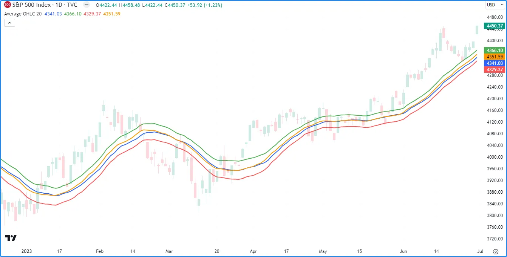

```pine
//@version=6
indicator("for...in loop demo", "Average OHLC", overlay = true)

//@variable The number of terms in the average.
int length = input.int(20, "Length", minval = 1)

//@function Calculates the average of each matrix row.
method rowWiseAvg(matrix<float> this) =>
    //@variable An array with elements corresponding to each row's average.
    array<float> result = array.new<float>()
    // Iterate over each `row` of `this` matrix.
    for row in this
        // Push the average of each `row` into the `result`.
        result.push(row.avg())
    result // Return the resulting array.

//@variable A 4x`length` matrix of values.
var matrix<float> m = matrix.new<float>(4, length)

// Add a new column containing OHLC values to the matrix.
m.add_col(m.columns(), array.from(open, high, low, close))
// Remove the first column.
m.remove_col(0)

//@variable An array containing averages of `open`, `high`, `low`, and `close` over `length` bars.
array<float> averages = m.rowWiseAvg()

plot(averages.get(0), "Average Open",  color.blue,   2)
plot(averages.get(1), "Average High",  color.green,  2)
plot(averages.get(2), "Average Low",   color.red,    2)
plot(averages.get(3), "Average Close", color.orange, 2)
```

Note that:

- The [for…in](../../reference manual/operators/for...in.md) loop structure can also access the _index_ value of each row.
For example, `for [i, row] in m` creates a tuple containing the
`i` row index and the reference of the corresponding `row` array from the `m`
matrix on each loop iteration.

## [Copying a matrix](../3. Language/language_matrices.md#copying-a-matrix)

### [Shallow copies](../3. Language/language_matrices.md#shallow-copies)

Pine scripts can copy matrices via
[matrix.copy()](../../reference manual/functions/matrix.copy.md).
This function returns a _shallow copy_ of a matrix that does not affect
the shape of the original matrix or its contents.

For example, this script assigns a new matrix reference to the `myMatrix` variable
and adds two columns. It creates a new `myCopy` matrix from that matrix
by calling
[matrix.copy()](../../reference manual/functions/matrix.copy.md)
as a method, then adds a new row to the resulting copy. It displays the rows of both matrices in
labels via the user-defined `debugLabel()` function:

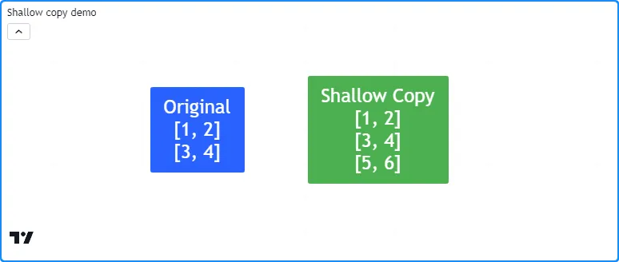

```pine
//@version=6
indicator("Shallow copy demo")

//@function Displays the rows of a matrix in a label with a note.
//@param    this The matrix to display.
//@param    barIndex The `bar_index` to display the label at.
//@param    bgColor The background color of the label.
//@param    textColor The color of the label's text.
//@param    note The text to display above the rows.
method debugLabel(
     matrix<float> this, int barIndex = bar_index, color bgColor = color.blue,
     color textColor = color.white, string note = ""
) =>
    labelText = note + "\n" + str.tostring(this)
    if barstate.ishistory
        label.new(
             barIndex, 0, labelText, color = bgColor, style = label.style_label_center,
             textcolor = textColor, size = size.huge
         )

//@variable A 2x2 `float` matrix.
matrix<float> myMatrix = matrix.new<float>()
myMatrix.add_col(0, array.from(1.0, 3.0))
myMatrix.add_col(1, array.from(2.0, 4.0))

//@variable A shallow copy of `myMatrix`.
matrix<float> myCopy = myMatrix.copy()
// Add a row to the last index of `myCopy`.
myCopy.add_row(myCopy.rows(), array.from(5.0, 6.0))

if bar_index == last_bar_index - 1
    // Display the rows of both matrices in separate labels.
    myMatrix.debugLabel(note = "Original")
    myCopy.debugLabel(bar_index + 10, color.green, note = "Shallow Copy")
```

It’s important to note that the elements within shallow copies of a
matrix have the same values or references as the original matrix. When matrices
contain references to special types
( [line](../../reference manual/types/line.md),
[linefill](../../reference manual/types/linefill.md),
[box](../../reference manual/types/box.md),
[polyline](../../reference manual/types/polyline.md),
[label](../../reference manual/types/label.md),
[table](../../reference manual/types/table.md),
or
[chart.point](../../reference manual/types/chart.point.md))
or
[user-defined types](../3. Language/language_type-system.md#user-defined-types), the elements of a shallow copy reference the same objects
as the original matrix.

This script declares a `myMatrix` variable with a `newLabel` as the initial value. It then copies `myMatrix` to a `myCopy` variable by calling the built-in [matrix.copy()](../../reference manual/functions/matrix.copy.md) function in the dot notation form `myMatrix.copy,`and plots the number of labels. As we see below, there’s only one
[label](../../reference manual/types/label.md)
on the chart, as the element in `myCopy` references the same object as
the element in `myMatrix`. Consequently, changes to the object referenced in the copied matrix affects the object referenced in the original matrix:

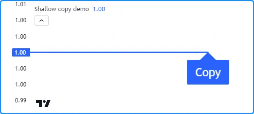

```pine
//@version=6
indicator("Shallow copy demo")

//@variable Initial value of the original matrix elements.
var label newLabel = label.new(
     bar_index, 1, "Original", color = color.blue, textcolor = color.white, size = size.huge
)

//@variable A 1x1 matrix containing a new `label` instance.
var matrix<label> myMatrix = matrix.new<label>(1, 1, newLabel)
//@variable A shallow copy of `myMatrix`.
var matrix<label> myCopy = myMatrix.copy()

//@variable The first label from the `myCopy` matrix.
label testLabel = myCopy.get(0, 0)

// Change the `text`, `style`, and `x` values of `testLabel`. Also affects the `newLabel`.
testLabel.set_text("Copy")
testLabel.set_style(label.style_label_up)
testLabel.set_x(bar_index)

// Plot the total number of labels.
plot(label.all.size(), linewidth = 3)
```

### [Deep copies](../3. Language/language_matrices.md#deep-copies)

One can produce a _deep copy_ of a matrix (i.e., a matrix whose elements refer to copies of the objects referenced by the original matrix) by explicitly copying each element in the matrix.

Here, we’ve added a `deepCopy()` user-defined method to our previous
script. The method creates a new matrix and uses nested
[\`for\` loops](../3. Language/language_matrices.md#for) to assign all elements to copies of the originals. When the
script calls this method instead of
[matrix.copy()](../../reference manual/functions/matrix.copy.md),
we see that there are now two labels on the chart, and any changes to
the label referenced by the copied matrix do not affect the one referenced by the original matrix:

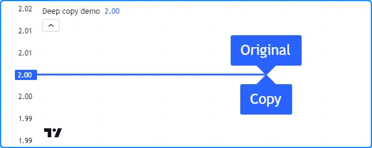

```pine
//@version=6
indicator("Deep copy demo")

//@function Returns a deep copy of a label matrix.
method deepCopy(matrix<label> this) =>
    //@variable A deep copy of `this` matrix.
    matrix<label> that = this.copy()
    for row = 0 to that.rows() - 1
        for column = 0 to that.columns() - 1
            // Assign the element at each `row` and `column` of `that` matrix to a copy of the retrieved label.
            that.set(row, column, that.get(row, column).copy())
    that

//@variable Initial value of the original matrix.
var label newLabel = label.new(
     bar_index, 2, "Original", color = color.blue, textcolor = color.white, size = size.huge
)

//@variable A 1x1 matrix containing a new `label` instance.
var matrix<label> myMatrix = matrix.new<label>(1, 1, newLabel)
//@variable A deep copy of `myMatrix`.
var matrix<label> myCopy = myMatrix.deepCopy()

//@variable The first label from the `myCopy` matrix.
label testLabel = myCopy.get(0, 0)

// Change the `text`, `style`, and `x` values of `testLabel`. Does not affect the `newLabel`.
testLabel.set_text("Copy")
testLabel.set_style(label.style_label_up)
testLabel.set_x(bar_index)

// Change the `x` value of `newLabel`.
newLabel.set_x(bar_index)

// Plot the total number of labels.
plot(label.all.size(), linewidth = 3)
```

### [Submatrices](../3. Language/language_matrices.md#submatrices)

In Pine, a _submatrix_ is a
[shallow copy](../3. Language/language_matrices.md#shallow-copies) of an existing matrix that only includes the rows and
columns specified by the `from_row/column` and `to_row/column`
parameters. In essence, it is a sliced copy of a matrix.

For example, the script below creates an `mSub` matrix from the `m`
matrix via the
[matrix.submatrix()](../../reference manual/functions/matrix.submatrix.md)
method, then calls our user-defined `debugLabel()` function to display
the rows of both matrices in labels:

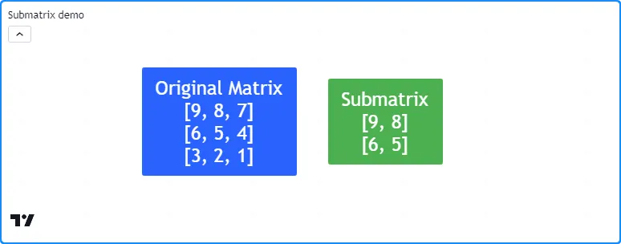

```pine
//@version=6
indicator("Submatrix demo")

//@function Displays the rows of a matrix in a label with a note.
//@param    this The matrix to display.
//@param    barIndex The `bar_index` to display the label at.
//@param    bgColor The background color of the label.
//@param    textColor The color of the label's text.
//@param    note The text to display above the rows.
method debugLabel(
     matrix<float> this, int barIndex = bar_index, color bgColor = color.blue,
     color textColor = color.white, string note = ""
) =>
    labelText = note + "\n" + str.tostring(this)
    if barstate.ishistory
        label.new(
             barIndex, 0, labelText, color = bgColor, style = label.style_label_center,
             textcolor = textColor, size = size.huge
         )

//@variable A 3x3 matrix of values.
var m = matrix.new<float>()

if bar_index == last_bar_index - 1
    // Add columns to `m`.
    m.add_col(0, array.from(9, 6, 3))
    m.add_col(1, array.from(8, 5, 2))
    m.add_col(2, array.from(7, 4, 1))
    // Display the rows of `m`.
    m.debugLabel(note = "Original Matrix")

    //@variable A 2x2 submatrix of `m` containing the first two rows and columns.
    matrix<float> mSub = m.submatrix(from_row = 0, to_row = 2, from_column = 0, to_column = 2)
    // Display the rows of `mSub`
    debugLabel(mSub, bar_index + 10, bgColor = color.green, note = "Submatrix")
```

## [Scope and history](../3. Language/language_matrices.md#scope-and-history)

Matrix variables leave historical trails on each bar, allowing scripts
to use the history-referencing operator
[\[\]](../../reference manual/operators/[].md)
to interact with past matrix instances previously assigned to a
variable. Additionally, scripts can modify matrices assigned to global
variables from within the scopes of
[user-defined functions](../3. Language/language_user-defined-functions.md),
[methods](../3. Language/language_methods.md#user-defined-methods), and
[conditional structures](../3. Language/language_conditional-structures.md).

This script calculates the average ratios of body and wick distances
relative to the bar range over `length` bars. It displays the data along
with values from `length` bars ago in a table. The user-defined
`addData()` function adds columns of current and historical ratios to
the a matrix created in the global scope, and the `calcAvg()` function references previous
matrices assigned to the `globalMatrix` variable using the
[\[\]](../../reference manual/operators/[].md)
operator to calculate a matrix of averages:

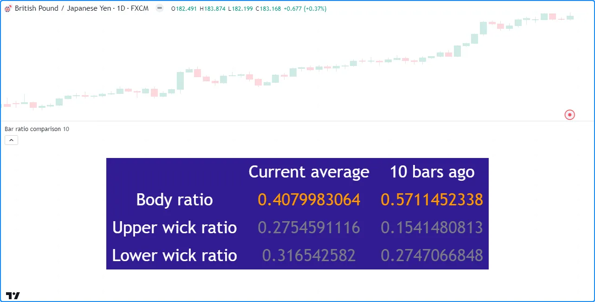

```pine
//@version=6
indicator("Scope and history demo", "Bar ratio comparison")

int length = input.int(10, "Length", 1)

//@variable A global matrix.
matrix<float> globalMatrix = matrix.new<float>()

//@function Calculates the ratio of body range to candle range.
bodyRatio() =>
    math.abs(close - open) / (high - low)

//@function Calculates the ratio of upper wick range to candle range.
upperWickRatio() =>
    (high - math.max(open, close)) / (high - low)

//@function Calculates the ratio of lower wick range to candle range.
lowerWickRatio() =>
    (math.min(open, close) - low) / (high - low)

//@function Adds data to the `globalMatrix`.
addData() =>
    // Add a new column of data at `column` 0.
    globalMatrix.add_col(0, array.from(bodyRatio(), upperWickRatio(), lowerWickRatio()))
    //@variable The column of `globalMatrix` from index 0 `length` bars ago.
    array<float> pastValues = globalMatrix.col(0)[length]
    // Add `pastValues` to the `globalMatrix`, or an array of `na` if `pastValues` is `na`.
    if na(pastValues)
        globalMatrix.add_col(1, array.new<float>(3))
    else
        globalMatrix.add_col(1, pastValues)

//@function Returns the `length`-bar average of matrices assigned to `globalMatrix` on historical bars.
calcAvg() =>
    //@variable The sum historical `globalMatrix` matrices.
    matrix<float> sums = matrix.new<float>(globalMatrix.rows(), globalMatrix.columns(), 0.0)
    for i = 0 to length - 1
        //@variable The `globalMatrix` matrix `i` bars before the current bar.
        matrix<float> previous = globalMatrix[i]
        // Break the loop if `previous` is `na`.
        if na(previous)
            sums.fill(na)
            break
        // Assign the sum of `sums` and `previous` to `sums`.
        sums := matrix.sum(sums, previous)
    // Divide the `sums` matrix by the `length`.
    result = sums.mult(1.0 / length)

// Add data to the `globalMatrix`.
addData()

//@variable The historical average of the `globalMatrix` matrices.
globalAvg = calcAvg()

//@variable A `table` displaying information from the `globalMatrix`.
var table infoTable = table.new(
     position.middle_center, globalMatrix.columns() + 1, globalMatrix.rows() + 1, bgcolor = color.navy
)

// Define value cells.
for [i, row] in globalAvg
    for [j, value] in row
        color textColor = value > 0.333 ? color.orange : color.gray
        infoTable.cell(j + 1, i + 1, str.tostring(value), text_color = textColor, text_size = size.huge)

// Define header cells.
infoTable.cell(0, 1, "Body ratio", text_color = color.white, text_size = size.huge)
infoTable.cell(0, 2, "Upper wick ratio", text_color = color.white, text_size = size.huge)
infoTable.cell(0, 3, "Lower wick ratio", text_color = color.white, text_size = size.huge)
infoTable.cell(1, 0, "Current average", text_color = color.white, text_size = size.huge)
infoTable.cell(2, 0, str.format("{0} bars ago", length), text_color = color.white, text_size = size.huge)
```

Note that:

- The `addData()` and `calcAvg()` functions have no parameters, as
they directly interact with the `globalMatrix` and `length`
variables declared in the outer scope.
- The `calcAvg()` functions calculates the averages by adding `previous` matrices
using
[matrix.sum()](../../reference manual/functions/matrix.sum.md)
and multiplying all elements by `1 / length` using
[matrix.mult()](../../reference manual/functions/matrix.mult.md).
We discuss these and other specialized functions in the
[Matrix calculations](../3. Language/language_matrices.md#matrix-calculations) section below.

## [Inspecting a matrix](../3. Language/language_matrices.md#inspecting-a-matrix)

The ability to inspect the shape of a matrix and patterns within its
elements is crucial, as it helps reveal important information about a
matrix and its compatibility with various calculations and
transformations. Pine Script includes several built-ins for matrix
inspection, including
[matrix.is\_square()](../../reference manual/functions/matrix.is_square.md),
[matrix.is\_identity()](../../reference manual/functions/matrix.is_identity.md),
[matrix.is\_diagonal()](../../reference manual/functions/matrix.is_diagonal.md),
[matrix.is\_antidiagonal()](../../reference manual/functions/matrix.is_antidiagonal.md),
[matrix.is\_symmetric()](../../reference manual/functions/matrix.is_symmetric.md),
[matrix.is\_antisymmetric()](../../reference manual/functions/matrix.is_antisymmetric.md),
[matrix.is\_triangular()](../../reference manual/functions/matrix.is_triangular.md),
[matrix.is\_stochastic()](../../reference manual/functions/matrix.is_stochastic.md),
[matrix.is\_binary()](../../reference manual/functions/matrix.is_binary.md),
and
[matrix.is\_zero()](../../reference manual/functions/matrix.is_zero.md).

To demonstrate these features, this example contains a custom
`inspect()` method that uses conditional blocks with `matrix.is_*()`
functions to return information about a matrix. It displays a string
representation of an `m` matrix and the description returned from
`m.inspect()` in labels on the chart:

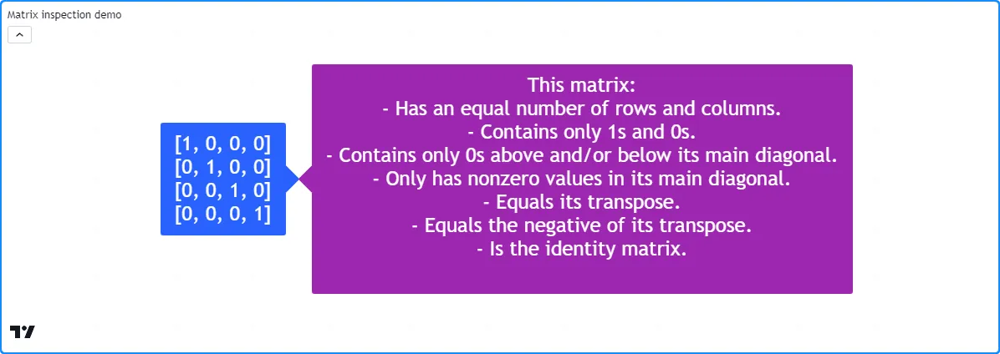

```pine
//@version=6
indicator("Matrix inspection demo")

//@function Inspects a matrix using `matrix.is_*()` functions and returns a `string` describing some of its features.
method inspect(matrix<int> this)=>
    //@variable A string describing `this` matrix.
    string result = "This matrix:\n"
    if this.is_square()
        result += "- Has an equal number of rows and columns.\n"
    if this.is_binary()
        result += "- Contains only 1s and 0s.\n"
    if this.is_zero()
        result += "- Is filled with 0s.\n"
    if this.is_triangular()
        result += "- Contains only 0s above and/or below its main diagonal.\n"
    if this.is_diagonal()
        result += "- Only has nonzero values in its main diagonal.\n"
    if this.is_antidiagonal()
        result += "- Only has nonzero values in its main antidiagonal.\n"
    if this.is_symmetric()
        result += "- Equals its transpose.\n"
    if this.is_antisymmetric()
        result += "- Equals the negative of its transpose.\n"
    if this.is_identity()
        result += "- Is the identity matrix.\n"
    result

//@variable A 4x4 identity matrix.
matrix<int> m = matrix.new<int>()

// Add rows to the matrix.
m.add_row(0, array.from(1, 0, 0, 0))
m.add_row(1, array.from(0, 1, 0, 0))
m.add_row(2, array.from(0, 0, 1, 0))
m.add_row(3, array.from(0, 0, 0, 1))

if bar_index == last_bar_index - 1
    // Display the `m` matrix in a blue label.
    label.new(
         bar_index, 0, str.tostring(m), color = color.blue, style = label.style_label_right,
         textcolor = color.white, size = size.huge
     )
    // Display the result of `m.inspect()` in a purple label.
    label.new(
         bar_index, 0, m.inspect(), color = color.purple, style = label.style_label_left,
         textcolor = color.white, size = size.huge
     )
```

## [Manipulating a matrix](../3. Language/language_matrices.md#manipulating-a-matrix)

### [Reshaping](../3. Language/language_matrices.md#reshaping)

The shape of a matrix can determine its compatibility with various
matrix operations. In some cases, it is necessary to change the
dimensions of a matrix without affecting the number of elements or the
values they reference, otherwise known as _reshaping_. To reshape a
matrix in Pine, use the
[matrix.reshape()](../../reference manual/functions/matrix.reshape.md)
function.

This example demonstrates the results of multiple reshaping operations
on a matrix. The initial `m` matrix has a 1x8 shape (one row and eight
columns). Through successive calls to the
[matrix.reshape()](../../reference manual/functions/matrix.reshape.md)
method, the script changes the shape of `m` to 2x4, 4x2, and 8x1. It
displays each reshaped matrix in a label on the chart using the custom
`debugLabel()` method:

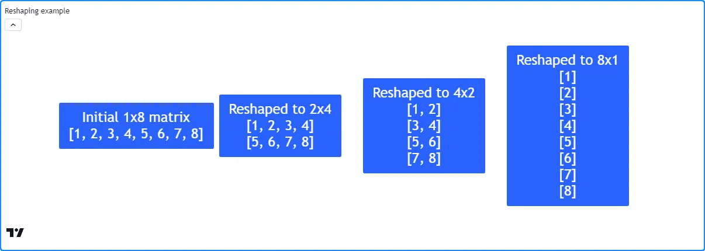

```pine
//@version=6
indicator("Reshaping example")

//@function Displays the rows of a matrix in a label with a note.
//@param    this The matrix to display.
//@param    barIndex The `bar_index` to display the label at.
//@param    bgColor The background color of the label.
//@param    textColor The color of the label's text.
//@param    note The text to display above the rows.
method debugLabel(
     matrix<float> this, int barIndex = bar_index, color bgColor = color.blue,
     color textColor = color.white, string note = ""
) =>
    labelText = note + "\n" + str.tostring(this)
    if barstate.ishistory
        label.new(
             barIndex, 0, labelText, color = bgColor, style = label.style_label_center,
             textcolor = textColor, size = size.huge
         )

//@variable A matrix containing the values 1-8.
matrix<int> m = matrix.new<int>()

if bar_index == last_bar_index - 1
    // Add the initial vector of values.
    m.add_row(0, array.from(1, 2, 3, 4, 5, 6, 7, 8))
    m.debugLabel(note = "Initial 1x8 matrix")

    // Reshape. `m` now has 2 rows and 4 columns.
    m.reshape(2, 4)
    m.debugLabel(bar_index + 10, note = "Reshaped to 2x4")

    // Reshape. `m` now has 4 rows and 2 columns.
    m.reshape(4, 2)
    m.debugLabel(bar_index + 20, note = "Reshaped to 4x2")

    // Reshape. `m` now has 8 rows and 1 column.
    m.reshape(8, 1)
    m.debugLabel(bar_index + 30, note = "Reshaped to 8x1")
```

Note that:

- The order of elements in `m` does not change with each
`m.reshape()` call.
- When reshaping a matrix, the product of the `rows` and `columns`
arguments must equal the
[matrix.elements\_count()](../../reference manual/functions/matrix.elements_count.md)
value, as
[matrix.reshape()](../../reference manual/functions/matrix.reshape.md)
cannot change the number of elements in a matrix.

### [Reversing](../3. Language/language_matrices.md#reversing)

One can reverse the order of all elements in a matrix using
[matrix.reverse()](../../reference manual/functions/matrix.reverse.md).
This function moves the references of an m-by-n matrix `id` at the i-th
row and j-th column to the m - 1 - i row and n - 1 - j column.

For example, this script creates a 3x3 matrix containing the values 1-9
in ascending order, then uses the
[matrix.reverse()](../../reference manual/functions/matrix.reverse.md)
method to reverse its contents. It displays the original and modified
versions of the matrix in labels on the chart via `m.debugLabel()`:

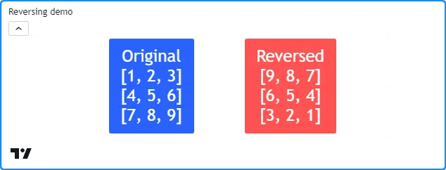

```pine
//@version=6
indicator("Reversing demo")

//@function Displays the rows of a matrix in a label with a note.
//@param    this The matrix to display.
//@param    barIndex The `bar_index` to display the label at.
//@param    bgColor The background color of the label.
//@param    textColor The color of the label's text.
//@param    note The text to display above the rows.
method debugLabel(
     matrix<float> this, int barIndex = bar_index, color bgColor = color.blue,
     color textColor = color.white, string note = ""
) =>
    labelText = note + "\n" + str.tostring(this)
    if barstate.ishistory
        label.new(
             barIndex, 0, labelText, color = bgColor, style = label.style_label_center,
             textcolor = textColor, size = size.huge
         )

//@variable A 3x3 matrix.
matrix<float> m = matrix.new<float>()

// Add rows to `m`.
m.add_row(0, array.from(1, 2, 3))
m.add_row(1, array.from(4, 5, 6))
m.add_row(2, array.from(7, 8, 9))

if bar_index == last_bar_index - 1
    // Display the contents of `m`.
    m.debugLabel(note = "Original")
    // Reverse `m`, then display its contents.
    m.reverse()
    m.debugLabel(bar_index + 10, color.red, note = "Reversed")
```

### [Transposing](../3. Language/language_matrices.md#transposing)

Transposing a matrix is a fundamental operation that flips all rows and
columns in a matrix about its _main diagonal_ (the diagonal vector of
all values in which the row index equals the column index). This process
produces a new matrix with reversed row and column dimensions, known as
the _transpose_. Scripts can calculate the transpose of a matrix using
[matrix.transpose()](../../reference manual/functions/matrix.transpose.md).

For any m-row, n-column matrix, the matrix returned from
[matrix.transpose()](../../reference manual/functions/matrix.transpose.md)
will have n rows and m columns. All elements in a matrix at the i-th row
and j-th column correspond to the elements in its transpose at the j-th
row and i-th column.

This example declares a 2x4 `m` matrix, calculates its transpose by calling
[matrix.transpose()](../../reference manual/functions/matrix.transpose.md) as a
method, then displays strings representing both matrices on the chart using our custom
`debugLabel()` method. As we can see below, the transposed matrix has a
4x2 shape, and the rows of the transpose match the columns of the
original matrix:

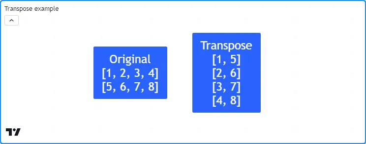

```pine
//@version=6
indicator("Transpose example")

//@function Displays the rows of a matrix in a label with a note.
//@param    this The matrix to display.
//@param    barIndex The `bar_index` to display the label at.
//@param    bgColor The background color of the label.
//@param    textColor The color of the label's text.
//@param    note The text to display above the rows.
method debugLabel(
     matrix<float> this, int barIndex = bar_index, color bgColor = color.blue,
     color textColor = color.white, string note = ""
) =>
    labelText = note + "\n" + str.tostring(this)
    if barstate.ishistory
        label.new(
             barIndex, 0, labelText, color = bgColor, style = label.style_label_center,
             textcolor = textColor, size = size.huge
         )

//@variable A 2x4 matrix.
matrix<int> m = matrix.new<int>()

// Add columns to `m`.
m.add_col(0, array.from(1, 5))
m.add_col(1, array.from(2, 6))
m.add_col(2, array.from(3, 7))
m.add_col(3, array.from(4, 8))

//@variable The transpose of `m`. Has a 4x2 shape.
matrix<int> mt = m.transpose()

if bar_index == last_bar_index - 1
    m.debugLabel(note = "Original")
    mt.debugLabel(bar_index + 10, note = "Transpose")
```

### [Sorting](../3. Language/language_matrices.md#sorting)

Scripts can sort a matrix containing “int”, “float”, or “string” values by using the [matrix.sort()](../../reference manual/functions/matrix.sort.md) function. This function rearranges the _rows_ of a matrix in a specified order by comparing the elements in a specified _column_.

The `column` parameter specifies the index of the column to use for sorting. The default value is 0, meaning that a call to the function compares elements in the _first_ column by default.

The `order` parameter accepts one of the two `order.*` constants. If the argument is [order.ascending](../../reference manual/constants/order.ascending.md) (the default), a [matrix.sort()](../../reference manual/functions/matrix.sort.md) call sorts the matrix rows in ascending order based on the values from the given column. If the argument is [order.descending](../../reference manual/constants/order.descending.md), it sorts the rows in descending order instead.

If a matrix contains “int” or “float” elements, a call to the [matrix.sort()](../../reference manual/functions/matrix.sort.md) function sorts the rows in the matrix by comparing a column’s numeric values. If the order is ascending, the row of the column element with the lowest value becomes the first row (at row index 0), and the row of the element with the highest value becomes the last row. The opposite applies when sorting in descending order.

For example, the following script sorts a 3x3 “int” matrix in ascending and descending order using values from a specified column. After each step, it creates a string representation of the matrix and displays the result in a separate [label](../2. Visuals/visuals_text-and-shapes.md#labels):

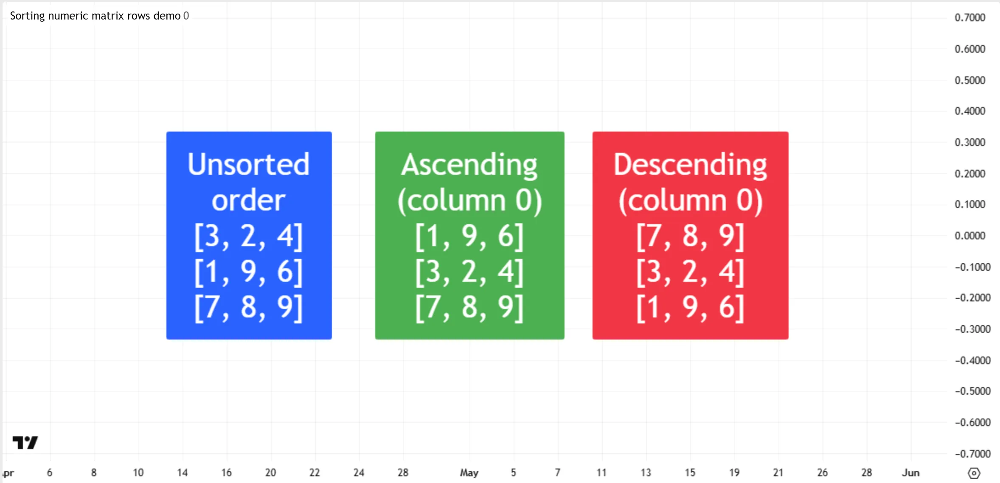

```pine
//@version=6
indicator("Sorting numeric matrix rows demo")

//@variable The index of the column to use for sorting.
int colInput = input.int(0, "Column", 0, 2)

if barstate.islastconfirmedhistory
    //@variable References a 3x3 matrix of "int" values.
    matrix<int> numbers = matrix.new<int>()
    // Insert a row of elements into the matrix, then reshape it to 3x3.
    numbers.add_row(0, array.from(3, 2, 4, 1, 9, 6, 7, 8, 9))
    numbers.reshape(3, 3)
    // Draw a label at the current `bar_index` value to display the original structure of the matrix.
    label.new(
        bar_index, 0, "Unsorted\norder\n" + str.tostring(numbers), style = label.style_label_center, size = 36
    )

    // Sort the matrix rows in ascending order (the default) using the column at the `colInput` index.
    numbers.sort(colInput)
    // Draw a label at `bar_index + 10` to display the updated structure.
    label.new(
        bar_index + 10, 0, str.format("Ascending\n(column {0})\n{1}", colInput, str.tostring(numbers)),
        color = color.green, style = label.style_label_center, size = 36
    )

    // Sort the matrix rows in *descending* order using the column at the `colInput` index.
    numbers.sort(colInput, order.descending)
    // Draw a label at `bar_index + 20` to display the updated structure.
    label.new(
        bar_index + 20, 0, str.format("Descending\n(column {0})\n{1}", colInput, str.tostring(numbers)),
        color = color.red, style = label.style_label_center, size = 36
    )
```

If a matrix contains “string” elements, a [matrix.sort()](../../reference manual/functions/matrix.sort.md) call sorts the rows in the matrix by comparing the [Unicode](https://en.wikipedia.org/wiki/Unicode) values of _individual characters_ in the strings from the specified column. The sorting algorithm initially compares the _first_ character in each string, then compares subsequent characters as necessary if multiple strings have matching characters at the same position. The rows whose column elements contain leading characters with the lowest Unicode values move to the beginning of the matrix if the order is ascending, or to the end of the matrix if the order is descending.

For example, the script version below sorts a 3x3 matrix of strings in ascending and descending order using the elements from a specified column. As with the previous example, the script draws three labels to show the structure of the matrix after each step:

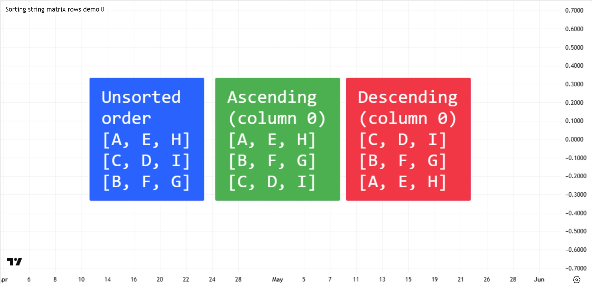

```pine
//@version=6
indicator("Sorting string matrix rows demo")

//@variable The index of the column to use for sorting.
int colInput = input.int(0, "Column", 0, 2)

if barstate.islastconfirmedhistory
    //@variable References a 3x3 matrix of "string" values.
    matrix<string> strings = matrix.new<string>()
    // Insert a row of elements into the matrix, then reshape it to 3x3.
    strings.add_row(0, array.from("A", "E", "H", "C", "D", "I", "B", "F", "G"))
    strings.reshape(3, 3)
    // Draw a label at the current `bar_index` value to display the original structure of the matrix.
    label.new(
        bar_index, 0, "Unsorted\norder\n" + str.tostring(strings), style = label.style_label_center,
        size = 36, textalign = text.align_left, text_font_family = font.family_monospace
    )

    // Sort the matrix rows in ascending order (the default) using the column at the `colInput` index.
    strings.sort(colInput)
    // Draw a label at `bar_index + 10` to display the updated structure.
    label.new(
        bar_index + 10, 0, str.format("Ascending\n(column {0})\n{1}", colInput, str.tostring(strings)),
        color = color.green, style = label.style_label_center, size = 36,
        textalign = text.align_left, text_font_family = font.family_monospace
    )

    // Sort the matrix rows in descending order using the column at the `colInput` index.
    strings.sort(colInput, order.descending)
    // Draw a label at `bar_index + 20` to display the updated structure.
    label.new(
        bar_index + 20, 0, str.format("Descending\n(column {0})\n{1}", colInput, str.tostring(strings)),
        color = color.red, style = label.style_label_center, size = 36,
        textalign = text.align_left, text_font_family = font.family_monospace
    )
```

Note that:

- This example uses strings containing all _uppercase_ ASCII letters. Therefore, the effect of the [matrix.sort()](../../reference manual/functions/matrix.sort.md) calls is the same as sorting column strings in _alphabetical_ order. However, if we add _lowercase_ characters to the start of some strings, the sorting order would _not_ be alphabetical, because all uppercase ASCII letters _precede_ lowercase letters in the Unicode Standard. See the [Sorting](../3. Language/language_arrays.md#sorting) section of the [Arrays](../3. Language/language_arrays.md) page for an example of this behavior.

In some cases, a programmer might need to sort the _columns_ of a matrix rather than sorting its rows. Although the [matrix.sort()](../../reference manual/functions/matrix.sort.md) function does not support column-wise sorting directly, programmers can achieve this effect by sorting the [transpose](../3. Language/language_matrices.md#transposing) of the specified matrix. The steps are as follows:

1. Create a transposed copy of the matrix by calling the [matrix.transpose()](../../reference manual/functions/matrix.transpose.md) function. The rows of the original matrix become _columns_ in the copy, and the original columns become rows.
2. Sort the rows in the transposed matrix using a [matrix.sort()](../../reference manual/functions/matrix.sort.md) function call.
3. Create a transposed copy of the sorted matrix by using a second [matrix.transpose()](../../reference manual/functions/matrix.transpose.md) call. This step changes the sorted rows from step 2 back to columns.

The modified example below adds a [user-defined function](../3. Language/language_user-defined-functions.md) named `sortColumns()` to the first example script in this section, then replaces the script’s [matrix.sort()](../../reference manual/functions/matrix.sort.md) calls with calls to that function. The `sortColumns()` function performs the above steps to create a copy of the matrix with sorted columns. The script displays strings representing the structure of the original matrix and the sorted results in [labels](../2. Visuals/visuals_text-and-shapes.md#labels) on the last historical bar:

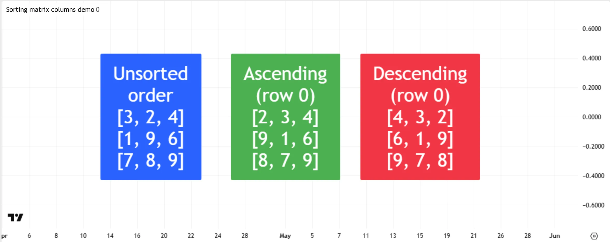

```pine
//@version=6
indicator("Sorting matrix columns demo")

//@function         Creates a copy of a specified matrix with sorted columns.
//@param id         The ID of the matrix to sort.
//@param row        The index of the row to use for sorting.
//@param ascending  Optional. If `true`, the function sorts the copy in ascending order.
//                  If `false`, it sorts in descending order. The default is `true`.
//@returns          The ID of the sorted copy.
sortColumns(matrix<int> id, int row, bool ascending = true) =>
    // Create a transposed copy of the matrix. The rows in the copy correspond to the original columns.
    matrix<int> t = id.transpose()
    // Sort the rows of the transposed copy.
    t.sort(row, ascending ? order.ascending : order.descending)
    // Create a transposed copy of the sorted matrix and return its ID.
    t.transpose()

//@variable The index of the row to use for sorting.
int rowInput = input.int(0, "Row", 0, 2)

if barstate.islastconfirmedhistory
    //@variable References a 3x3 matrix of "int" values.
    matrix<int> numbers = matrix.new<int>()
    // Insert a row of elements into the matrix, then reshape it to 3x3.
    numbers.add_row(0, array.from(3, 2, 4, 1, 9, 6, 7, 8, 9))
    numbers.reshape(3, 3)
    // Draw a label at the current `bar_index` value to display the original structure of the matrix.
    label.new(
        bar_index, 0, "Unsorted\norder\n" + str.tostring(numbers), style = label.style_label_center, size = 36
    )

    // Sort the matrix columns in ascending order using the row at the `rowInput` index.
    numbers := sortColumns(numbers, rowInput, true)
    // Draw a label at `bar_index + 10` to display the updated structure.
    label.new(
        bar_index + 10, 0, str.format("Ascending\n(row {0})\n{1}", rowInput, str.tostring(numbers)),
        color = color.green, style = label.style_label_center, size = 36
    )

    // Sort the matrix columns in descending order using the row at the `rowInput` index.
    numbers := sortColumns(numbers, rowInput, false)
    // Draw a label at `bar_index + 20` to display the updated structure.
    label.new(
        bar_index + 20, 0, str.format("Descending\n(row {0})\n{1}", rowInput, str.tostring(numbers)),
        color = color.red, style = label.style_label_center, size = 36
    )
```

#### [Sorting matrices of user-defined types](../3. Language/language_matrices.md#sorting-matrices-of-user-defined-types)

The [matrix.sort()](../../reference manual/functions/matrix.sort.md) function can also sort matrices whose elements reference [objects](../3. Language/language_objects.md) of [user-defined types (UDTs)](../3. Language/language_type-system.md#user-defined-types). For such matrices, the function compares values from one of the “int”, “float”, or “string” _fields_ of each object referenced by the elements in a specified column, using the sorting rules described in the [Sorting](../3. Language/language_matrices.md#sorting) section above.

The function’s `sort_field` parameter specifies which object field a call to the function uses to sort the rows in the matrix. The parameter can specify a field using either a _“const int”_ or _“const string”_ argument:

- A “const int” argument specifies a field by its _field index_, where a value of 0 refers to the _first_ field listed in the [type declaration](../3. Language/language_type-system.md#user-defined-types), 1 refers to the _second_ field, and so on. The value can be any non-negative number up to one less than the total number of fields.
- A “const string” argument specifies a field by its _identifier (name)_. The string must literally match one of the field names listed in the type declaration.

The default `sort_field` argument is 0. Therefore, if a [matrix.sort()](../../reference manual/functions/matrix.sort.md) call does not specify a `sort_field` argument, it attempts to sort rows in the matrix by comparing the first field of each object referenced by a given column.

The following script is a modified form of the _first_ example in the [Sorting arrays of user-defined types](../3. Language/language_arrays.md#sorting-arrays-of-user-defined-types) section of the [Arrays](../3. Language/language_arrays.md) page. It sorts a 3x2 matrix of object IDs instead of an array of IDs. The script declares a custom type named `myType` with three fields: `field0`, `field1`, and `field2`. Then, it creates six `myType` objects and stores their IDs in a matrix on the last historical bar. The script executes a [matrix.sort()](../../reference manual/functions/matrix.sort.md) call to sort the rows of the matrix by the first, second, or third field of the objects referenced on a given column, depending on the selected [inputs](../1. Concepts/concepts_inputs.md). The script loops through the matrix with a [for…in](../../reference manual/keywords/for...in.md) loop to create a concatenated string representing its sorted structure, then displays the resulting string’s text in a label:

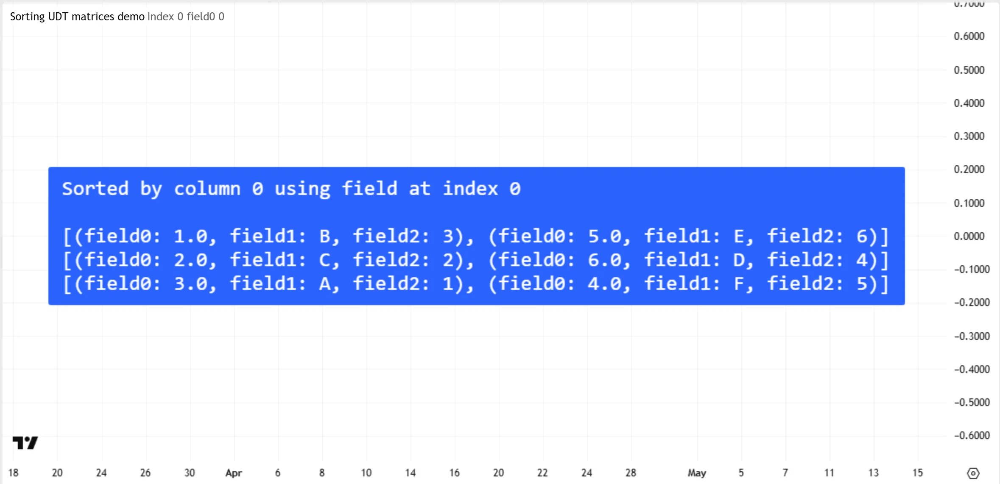

```pine
//@version=6
indicator("Sorting UDT matrices demo")

//@type  A custom type for creating objects that store "float", "string", and "int" values.
type myType
    float  field0 // This field's index is 0.
    string field1 // This field's index is 1.
    int    field2 // This field's index is 2.

//@variable A string to indicate whether the script specifies sorting fields by index or name.
string specifyInput = input.string("Index", "Specify a field using its", ["Index", "Name"])
//@variable The index of the field to use for sorting if the `specifyInput` value is `"Index"`.
int indexInput = input.int(0, "Field index", 0, 2, active = specifyInput == "Index")
//@variable The name of the field to use for sorting if the `specifyInput` value is `"Name"`.
string nameInput = input.string("field0", "Field name", ["field0", "field1", "field2"], active = specifyInput == "Name")
//@variable The index of the column to use for sorting.
int colInput = input.int(0, "Column to check", 0, 1)

if barstate.islastconfirmedhistory
    //@variable References an array that stores the IDs of `myType` objects.
    array<myType> udtArray = array.from(
        myType.new(field0 = 2.0, field1 = "C", field2 = 2), myType.new(field0 = 6.0, field1 = "D", field2 = 4),
        myType.new(field0 = 1.0, field1 = "B", field2 = 3), myType.new(field0 = 5.0, field1 = "E", field2 = 6),
        myType.new(field0 = 3.0, field1 = "A", field2 = 1), myType.new(field0 = 4.0, field1 = "F", field2 = 5)
    )
    //@variable References a 3x2 matrix of `myType` IDs retrieved from the array.
    matrix<myType> udtMatrix = matrix.new<myType>()
    // Populate the matrix using the `udtArray` array, then reshape it using `matrix.reshape()`.
    udtMatrix.add_row(0, udtArray)
    udtMatrix.reshape(3, 2)

    // Sort the rows in ascending order. Use the field at the specified index if the `specifyInput` value is `"Index"`.
    if specifyInput == "Index"
        switch indexInput
            0 => udtMatrix.sort(colInput, sort_field = 0)
            1 => udtMatrix.sort(colInput, sort_field = 1)
            2 => udtMatrix.sort(colInput, sort_field = 2)
    // Otherwise, sort using the field with the specified name.
    else
        switch nameInput
            "field0"  => udtMatrix.sort(colInput, sort_field = "field0")
            "field1"  => udtMatrix.sort(colInput, sort_field = "field1")
            "field2"  => udtMatrix.sort(colInput, sort_field = "field2")

    //@variable A string representing the structure of the sorted matrix.
    string displayStr = switch specifyInput
        "Index" => str.format("Sorted by column {0} using field at index {1}\n\n",  colInput, indexInput)
        =>         str.format("Sorted by column {0} using field named ''{1}''\n\n", colInput, nameInput)

    // Concatenate formatted strings to represent the sorted structure.
    for [i, row] in udtMatrix
        string tempStr = "["\
        for [j, id] in row\
            tempStr += str.format(\
                "(field0: {0,number,0.0}, field1: {1}, field2: {2}), ",\
                id.field0, id.field1, id.field2\
            )\
        displayStr += str.substring(tempStr, 0, str.length(tempStr) - 2) + "]\n"
    displayStr := str.substring(displayStr, 0, str.length(displayStr) - 1)
    // Display the final string's text in a label.
    label.new(
        bar_index, 0, displayStr, style = label.style_label_center, size = 24,
        textalign = text.align_left, text_font_family = font.family_monospace
    )
```

Note that:

- The `sort_field` parameter accepts only values that have the _“const”_ [qualifier](../3. Language/language_type-system.md#qualifiers); it cannot accept values qualified as “input”, “simple”, or “series”. Therefore, to sort the matrix using an input-specified field, this script uses a _separate_ [matrix.sort()](../../reference manual/functions/matrix.sort.md) call for each input combination.

When sorting matrices that store IDs of a user-defined type, it’s important to understand the following limitations:

- The `sort_field` argument of a [matrix.sort()](../../reference manual/functions/matrix.sort.md) call must refer to an “int”, “float”, or “string” field. Attempting to sort UDT matrices using fields of other types causes a _compilation error_.
- While the [matrix.sort()](../../reference manual/functions/matrix.sort.md) function can sort the rows of a matrix using a column containing objects that have _fields_ with [na](../../reference manual/variables/na.md) values, it **cannot** sort a matrix using columns that contain [na](../../reference manual/variables/na.md) _elements_. Elements that are [na](../../reference manual/variables/na.md) represent _nonexistent IDs_, meaning that there are _no associated objects_ from which to retrieve a field value for sorting. Attempting to sort a UDT matrix using a column with [na](../../reference manual/variables/na.md) elements causes a _runtime error_.

Refer to the [Sorting arrays of user-defined types](../3. Language/language_arrays.md#sorting-arrays-of-user-defined-types) section of the [Arrays](../3. Language/language_arrays.md) page for examples of errors relating to these limitations and ways to resolve them. The principles explained in those examples also apply to sorting matrices with the [matrix.sort()](../../reference manual/functions/matrix.sort.md) function.

### [Concatenating](../3. Language/language_matrices.md#concatenating)

Scripts can _concatenate_ two matrices using
[matrix.concat()](../../reference manual/functions/matrix.concat.md).
This function appends the rows of an `id2` matrix to the end of an `id1`
matrix with the same number of columns.

To create a matrix with elements representing the _columns_ of a matrix
appended to another,
[transpose](../3. Language/language_matrices.md#transposing) both matrices, use
[matrix.concat()](../../reference manual/functions/matrix.concat.md)
on the transposed matrices, then
[transpose()](../../reference manual/functions/matrix.transpose.md)
the result.

For example, this script appends the rows of the `m2` matrix to the `m1`
matrix and appends their columns using _transposed copies_ of the
matrices. It displays the `m1` and `m2` matrices and the results after
concatenating their rows and columns in labels using the custom
`debugLabel()` method:

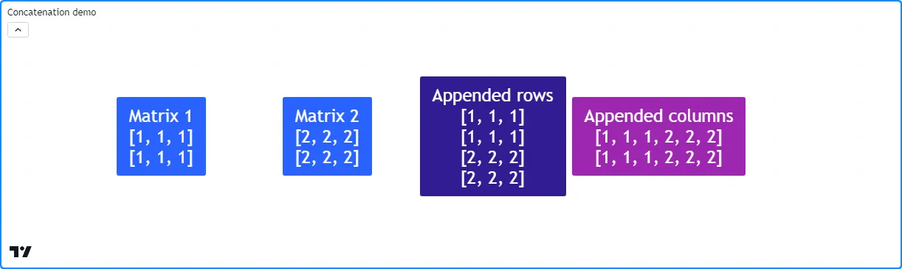

```pine
//@version=6
indicator("Concatenation demo")

//@function Displays the rows of a matrix in a label with a note.
//@param    this The matrix to display.
//@param    barIndex The `bar_index` to display the label at.
//@param    bgColor The background color of the label.
//@param    textColor The color of the label's text.
//@param    note The text to display above the rows.
method debugLabel(
     matrix<float> this, int barIndex = bar_index, color bgColor = color.blue,
     color textColor = color.white, string note = ""
) =>
    labelText = note + "\n" + str.tostring(this)
    if barstate.ishistory
        label.new(
             barIndex, 0, labelText, color = bgColor, style = label.style_label_center,
             textcolor = textColor, size = size.huge
         )

//@variable A 2x3 matrix filled with 1s.
matrix<int> m1 = matrix.new<int>(2, 3, 1)
//@variable A 2x3 matrix filled with 2s.
matrix<int> m2 = matrix.new<int>(2, 3, 2)

//@variable The transpose of `m1`.
t1 = m1.transpose()
//@variable The transpose of `m2`.
t2 = m2.transpose()

if bar_index == last_bar_index - 1
    // Display the original matrices.
    m1.debugLabel(note = "Matrix 1")
    m2.debugLabel(bar_index + 10, note = "Matrix 2")
    // Append the rows of `m2` to the end of `m1` and display `m1`.
    m1.concat(m2)
    m1.debugLabel(bar_index + 20, color.blue, note = "Appended rows")
    // Append the rows of `t2` to the end of `t1`, then display the transpose of `t1`.
    t1.concat(t2)
    t1.transpose().debugLabel(bar_index + 30, color.purple, note = "Appended columns")
```

## [Matrix calculations](../3. Language/language_matrices.md#matrix-calculations)

### [Element-wise calculations](../3. Language/language_matrices.md#element-wise-calculations)

Pine scripts can calculate the _average_, _minimum_, _maximum_, and
_mode_ of all elements within a matrix via
[matrix.avg()](../../reference manual/functions/matrix.avg.md),
[matrix.min()](../../reference manual/functions/matrix.min.md),
[matrix.max()](../../reference manual/functions/matrix.max.md),
and
[matrix.mode()](../../reference manual/functions/matrix.mode.md).
These functions operate the same as their `array.*` equivalents,
allowing users to run element-wise calculations on a matrix, its
[submatrices](../3. Language/language_matrices.md#submatrices), and its
[rows and columns](../3. Language/language_matrices.md#rows-and-columns) using the same syntax. For example, the built-in `*.avg()`
functions called on a 3x3 matrix with values 1-9 and an
[array](../../reference manual/types/array.md)
with the same nine elements will both return a value of 5.

The script below uses `*.avg()`, `*.max()`, and `*.min()` methods to
calculate developing averages and extremes of OHLC data in a period. It
adds a new column of
[open](../../reference manual/variables/open.md),
[high](../../reference manual/variables/high.md),
[low](../../reference manual/variables/low.md),
and
[close](../../reference manual/variables/close.md)
values to the end of the `ohlcData` matrix whenever `queueColumn` is
`true`. When `false`, the script uses the
[matrix.get()](../../reference manual/functions/matrix.get.md)
and
[matrix.set()](../../reference manual/functions/matrix.set.md) methods to adjust the elements in the last column for developing
HLC values in the current period. It uses the `ohlcData` matrix, a submatrix, and row and column
arrays to calculate the developing OHLC4 and HL2 averages over `length`
periods, the maximum high and minimum low over `length` periods, and the
current period’s developing OHLC4 price:

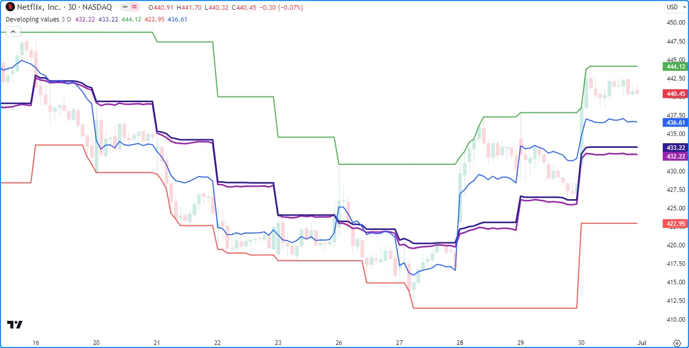

```pine
//@version=6
indicator("Element-wise calculations example", "Developing values", overlay = true)

//@variable The number of data points in the averages.
int length = input.int(3, "Length", 1)
//@variable The timeframe of each reset period.
string timeframe = input.timeframe("D", "Reset Timeframe")

//@variable A 4x`length` matrix of OHLC values.
var matrix<float> ohlcData = matrix.new<float>(4, length)

//@variable Is `true` at the start of a new bar at the `timeframe`.
bool queueColumn = timeframe.change(timeframe)

if queueColumn
    // Add new values to the end column of `ohlcData`.
    ohlcData.add_col(length, array.from(open, high, low, close))
    // Remove the oldest column from `ohlcData`.
    ohlcData.remove_col(0)
else
    // Adjust the last element of column 1 for new highs.
    if high > ohlcData.get(1, length - 1)
        ohlcData.set(1, length - 1, high)
    // Adjust the last element of column 2 for new lows.
    if low < ohlcData.get(2, length - 1)
        ohlcData.set(2, length - 1, low)
    // Adjust the last element of column 3 for the new closing price.
    ohlcData.set(3, length - 1, close)

//@variable The `matrix.avg()` of all elements in `ohlcData`.
avgOHLC4 = ohlcData.avg()
//@variable The `matrix.avg()` of all elements in rows 1 and 2, i.e., the average of all `high` and `low` values.
avgHL2   = ohlcData.submatrix(from_row = 1, to_row = 3).avg()
//@variable The `matrix.max()` of all values in `ohlcData`. Equivalent to `ohlcData.row(1).max()`.
maxHigh = ohlcData.max()
//@variable The `array.min()` of all `low` values in `ohlcData`. Equivalent to `ohlcData.min()`.
minLow = ohlcData.row(2).min()
//@variable The `array.avg()` of the last column in `ohlcData`, i.e., the current OHLC4.
ohlc4Value = ohlcData.col(length - 1).avg()

plot(avgOHLC4, "Average OHLC4", color.purple, 2)
plot(avgHL2, "Average HL2", color.navy, 2)
plot(maxHigh, "Max High", color.green)
plot(minLow, "Min Low", color.red)
plot(ohlc4Value, "Current OHLC4", color.blue)
```

Note that:

- In this example, we used
`array.*()` and `matrix.*()` methods interchangeably to demonstrate their similarities in syntax and behavior.
- Users can calculate the matrix equivalent of
[array.sum()](../../reference manual/functions/array.sum.md)
by multiplying the values of [matrix.avg()](../../reference manual/functions/matrix.avg.md) and [matrix.elements\_count()](../../reference manual/functions/matrix.elements_count.md).

### [Special calculations](../3. Language/language_matrices.md#special-calculations)

Pine Script features several built-in functions for performing
essential matrix arithmetic and linear algebra operations, including
[matrix.sum()](../../reference manual/functions/matrix.sum.md),
[matrix.diff()](../../reference manual/functions/matrix.diff.md),
[matrix.mult()](../../reference manual/functions/matrix.mult.md),
[matrix.pow()](../../reference manual/functions/matrix.pow.md),
[matrix.det()](../../reference manual/functions/matrix.det.md),
[matrix.inv()](../../reference manual/functions/matrix.inv.md),
[matrix.pinv()](../../reference manual/functions/matrix.pinv.md),
[matrix.rank()](../../reference manual/functions/matrix.rank.md),
[matrix.trace()](../../reference manual/functions/matrix.trace.md),
[matrix.eigenvalues()](../../reference manual/functions/matrix.eigenvalues.md),
[matrix.eigenvectors()](../../reference manual/functions/matrix.eigenvectors.md),
and
[matrix.kron()](../../reference manual/functions/matrix.kron.md).
These functions are advanced features that facilitate a variety of
matrix calculations and transformations.

Below, we explain a few fundamental functions with some basic examples.

#### [​`matrix.sum()`​ and ​`matrix.diff()`​](../3. Language/language_matrices.md#matrixsum-and-matrixdiff)

Scripts can perform addition and subtraction of two matrices with the
same shape or a matrix and a scalar value using the
[matrix.sum()](../../reference manual/functions/matrix.sum.md)
and
[matrix.diff()](../../reference manual/functions/matrix.diff.md)
functions. These functions use the values from the `id2` matrix or
scalar to add to or subtract from the elements in `id1`.

This script demonstrates a simple example of matrix addition and
subtraction in Pine. It creates a 3x3 matrix, calculates its
[transpose](../3. Language/language_matrices.md#transposing), then calculates the
[matrix.sum()](../../reference manual/functions/matrix.sum.md)
and
[matrix.diff()](../../reference manual/functions/matrix.diff.md)
results using the two matrices. This example displays the original matrix, its
[transpose](../3. Language/language_matrices.md#transposing),
and the resulting sum and difference matrices in labels on the chart:

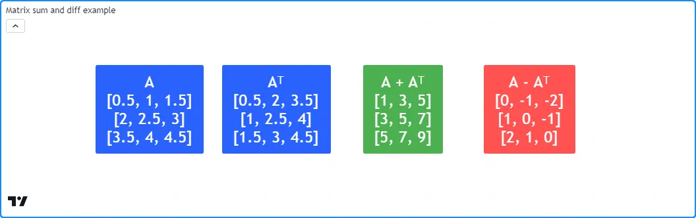

```pine
//@version=6
indicator("Matrix sum and diff example")

//@function Displays the rows of a matrix in a label with a note.
//@param    this The matrix to display.
//@param    barIndex The `bar_index` to display the label at.
//@param    bgColor The background color of the label.
//@param    textColor The color of the label's text.
//@param    note The text to display above the rows.
method debugLabel(
     matrix<float> this, int barIndex = bar_index, color bgColor = color.blue,
     color textColor = color.white, string note = ""
) =>
    labelText = note + "\n" + str.tostring(this)
    if barstate.ishistory
        label.new(
             barIndex, 0, labelText, color = bgColor, style = label.style_label_center,
             textcolor = textColor, size = size.huge
         )

//@variable A 3x3 matrix.
m = matrix.new<float>()

// Add rows to `m`.
m.add_row(0, array.from(0.5, 1.0, 1.5))
m.add_row(1, array.from(2.0, 2.5, 3.0))
m.add_row(2, array.from(3.5, 4.0, 4.5))

if bar_index == last_bar_index - 1
    // Display `m`.
    m.debugLabel(note = "A")
    // Get and display the transpose of `m`.
    matrix<float> t = m.transpose()
    t.debugLabel(bar_index + 10, note = "Aᵀ")
    // Calculate the sum of the two matrices. The resulting matrix is symmetric.
    matrix.sum(m, t).debugLabel(bar_index + 20, color.green, note = "A + Aᵀ")
    // Calculate the difference between the two matrices. The resulting matrix is antisymmetric.
    matrix.diff(m, t).debugLabel(bar_index + 30, color.red, note = "A - Aᵀ")
```

Note that:

- In this example, we’ve labeled the original matrix as “A” and
the transpose as “Aᵀ”.
- Adding “A” and “Aᵀ” produces a _symmetric_ matrix, and subtracting them produces an _antisymmetric_ matrix. The functions [matrix.is\_symmetric()](../../reference manual/functions/matrix.is_symmetric.md) and [matrix.is\_antisymmetric()](../../reference manual/functions/matrix.is_antisymmetric.md) test a matrix for these conditions.

#### [​`matrix.mult()`​](../3. Language/language_matrices.md#matrixmult)

Scripts can multiply two matrices via the
[matrix.mult()](../../reference manual/functions/matrix.mult.md)
function. This function can also multiply a matrix by an
[array](../../reference manual/types/array.md)
or a scalar value.

In the case of multiplying two matrices, unlike addition and
subtraction, matrix multiplication does not require two matrices to
share the same shape. However, the number of columns in the first matrix
must equal the number of rows in the second one. The resulting matrix
returned by
[matrix.mult()](../../reference manual/functions/matrix.mult.md)
will contain the same number of rows as the `id1` matrix and the same number of
columns as the `id2` matrix. For instance, a 2x3 matrix multiplied by a 3x4 matrix
will produce a matrix with two rows and four columns, as shown below.
Each value within the resulting matrix is the [dot 
product](https://en.wikipedia.org/wiki/Dot_product) of the corresponding
row in the `id1` maxtrix and column in the `id2` matrix:

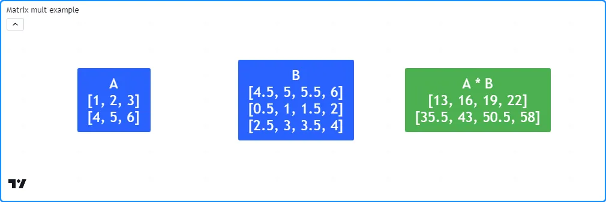

```pine
//@version=6
indicator("Matrix mult example")

//@function Displays the rows of a matrix in a label with a note.
//@param    this The matrix to display.
//@param    barIndex The `bar_index` to display the label at.
//@param    bgColor The background color of the label.
//@param    textColor The color of the label's text.
//@param    note The text to display above the rows.
method debugLabel(
     matrix<float> this, int barIndex = bar_index, color bgColor = color.blue,
     color textColor = color.white, string note = ""
) =>
    labelText = note + "\n" + str.tostring(this)
    if barstate.ishistory
        label.new(
             barIndex, 0, labelText, color = bgColor, style = label.style_label_center,
             textcolor = textColor, size = size.huge
         )

//@variable A 2x3 matrix.
a = matrix.new<float>()
//@variable A 3x4 matrix.
b = matrix.new<float>()

// Add rows to `a`.
a.add_row(0, array.from(1, 2, 3))
a.add_row(1, array.from(4, 5, 6))

// Add rows to `b`.
b.add_row(0, array.from(0.5, 1.0, 1.5, 2.0))
b.add_row(1, array.from(2.5, 3.0, 3.5, 4.0))
b.add_row(0, array.from(4.5, 5.0, 5.5, 6.0))

if bar_index == last_bar_index - 1
    //@variable The result of `a` * `b`.
    matrix<float> ab = a.mult(b)
    // Display `a`, `b`, and `ab` matrices.
    debugLabel(a, note = "A")
    debugLabel(b, bar_index + 10, note = "B")
    debugLabel(ab, bar_index + 20, color.green, note = "A * B")
```

Note that:

- In contrast to the multiplication of scalars, matrix
multiplication is _non-commutative_, i.e., `matrix.mult(a, b)`
does not necessarily produce the same result as
`matrix.mult(b, a)`. In the context of our example, the latter
will raise a runtime error because the number of columns in `b`
doesn’t equal the number of rows in `a`.

When multiplying a matrix and an
[array](../../reference manual/types/array.md),
this function treats the operation the same as multiplying the `id1` matrix by a
single-column matrix, but it returns an
[array](../../reference manual/types/array.md)
with the same number of elements as the number of matrix rows. When
[matrix.mult()](../../reference manual/functions/matrix.mult.md)
passes a scalar as its `id2` value, the function returns a new matrix
whose elements are the elements in the `id1` matrix multiplied by the `id2` value.

#### [​`matrix.det()`​](../3. Language/language_matrices.md#matrixdet)

A _determinant_ is a scalar value associated with a square
matrix that describes some of its characteristics, namely its
invertibility. If a matrix has an
[inverse](../3. Language/language_matrices.md#matrixinv-and-matrixpinv),
its determinant is nonzero. Otherwise, the matrix is _singular_
(non-invertible). Scripts can calculate the determinant of a matrix via
[matrix.det()](../../reference manual/functions/matrix.det.md).

Programmers can use determinants to detect similarities between
matrices, identify _full-rank_ and _rank-deficient_ matrices, and solve
systems of linear equations, among other applications.

For example, this script uses determinants to solve a system of
linear equations with a matching number of unknown values using
[Cramer’s rule](https://en.wikipedia.org/wiki/Cramer's_rule). The
user-defined `solve()` function returns the reference of an
[array](../../reference manual/types/array.md)
containing solutions for each unknown value in the system, where the
n-th element of the array is the determinant of the coefficient matrix
with the n-th column replaced by the column of constants divided by the
determinant of the original coefficients.

In this script, we’ve defined the matrix `m` that holds coefficients
and constants for these three equations:

```
3 * x0 + 4 * x1 - 1 * x2 = 8

5 * x0 - 2 * x1 + 1 * x2 = 4

2 * x0 - 2 * x1 + 1 * x2 = 1
```

The solution to this system is `(x0 = 1, x1 = 2, x2 = 3)`. The script
calculates these values from `m` via `m.solve()` and plots them on the
chart:

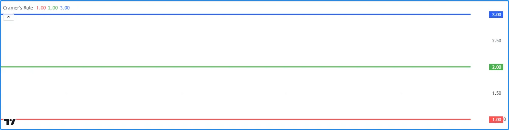

```pine
//@version=6
indicator("Determinants example", "Cramer's Rule")

//@function Solves a system of linear equations with a matching number of unknowns using Cramer's rule.
//@param    this An augmented matrix containing the coefficients for each unknown and the results of
//          the equations. For example, a row containing the values 2, -1, and 3 represents the equation
//          `2 * x0 + (-1) * x1 = 3`, where `x0` and `x1` are the unknown values in the system.
//@returns  An array containing solutions for each variable in the system.
solve(matrix<float> this) =>
    //@variable The coefficient matrix for the system of equations.
    matrix<float> coefficients = this.submatrix(from_column = 0, to_column = this.columns() - 1)
    //@variable The array of resulting constants for each equation.
    array<float> constants = this.col(this.columns() - 1)
    //@variable An array containing solutions for each unknown in the system.
    array<float> result = array.new<float>()

    //@variable The determinant value of the coefficient matrix.
    float baseDet = coefficients.det()
    matrix<float> modified = na
    for col = 0 to coefficients.columns() - 1
        modified := coefficients.copy()
        modified.add_col(col, constants)
        modified.remove_col(col + 1)

        // Calculate the solution for the column's unknown by dividing the determinant of `modified` by the `baseDet`.
        result.push(modified.det() / baseDet)

    result

//@variable A 3x4 matrix containing coefficients and results for a system of three equations.
m = matrix.new<float>()

// Add rows for the following equations:
// Equation 1: 3 * x0 + 4 * x1 - 1 * x2 = 8
// Equation 2: 5 * x0 - 2 * x1 + 1 * x2 = 4
// Equation 3: 2 * x0 - 2 * x1 + 1 * x2 = 1
m.add_row(0, array.from(3.0, 4.0, -1.0, 8.0))
m.add_row(1, array.from(5.0, -2.0, 1.0, 4.0))
m.add_row(2, array.from(2.0, -2.0, 1.0, 1.0))

//@variable An array of solutions to the unknowns in the system of equations represented by `m`.
solutions = solve(m)

plot(solutions.get(0), "x0", color.red, 3)   // Plots 1.
plot(solutions.get(1), "x1", color.green, 3) // Plots 2.
plot(solutions.get(2), "x2", color.blue, 3)  // Plots 3.
```

Note that:

- Solving systems of equations is particularly useful for
_regression analysis_, e.g., linear and polynomial regression.
- Cramer’s rule works fine for small systems of equations.
However, it’s computationally inefficient on larger systems.
Other methods, such as [Gaussian 
elimination](https://en.wikipedia.org/wiki/Gaussian_elimination),
are often preferred for such use cases.

#### [​`matrix.inv()`​ and ​`matrix.pinv()`​](../3. Language/language_matrices.md#matrixinv-and-matrixpinv)

For any non-singular square
matrix, there is an inverse matrix that yields the identity
matrix when
[multiplied](../3. Language/language_matrices.md#matrixmult) by the original. Inverses have use in various matrix
transformations and solving systems of equations. Scripts can calculate
the inverse of a matrix **when one exists** via the
[matrix.inv()](../../reference manual/functions/matrix.inv.md)
function.

For singular (non-invertible) matrices, one can calculate a generalized
inverse
( [pseudoinverse](https://en.wikipedia.org/wiki/Moore%E2%80%93Penrose_inverse)),
regardless of whether the matrix is square or has a nonzero [determinant](../3. Language/language_matrices.md#matrixdet), via the
[matrix.pinv()](../../reference manual/functions/matrix.pinv.md)
function. Keep in mind that unlike a true inverse, the product of a
pseudoinverse and the original matrix does not necessarily equal the
identity matrix unless the original matrix _is invertible_.

The following example forms a 2x2 `m` matrix from user inputs, then calls
[matrix.inv()](../../reference manual/functions/matrix.inv.md)
and
[matrix.pinv()](../../reference manual/functions/matrix.pinv.md) as methods to calculate the inverse or pseudoinverse of `m`. The script
displays [strings](../1. Concepts/concepts_strings.md) representing the original matrix, its inverse or pseudoinverse, and their
product in labels on the chart:

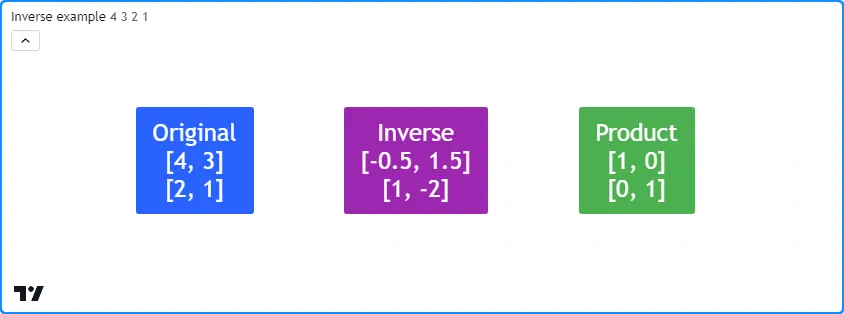

```pine
//@version=6
indicator("Inverse example")

// Element inputs for the 2x2 matrix.
float r0c0 = input.float(4.0, "Row 0, Col 0")
float r0c1 = input.float(3.0, "Row 0, Col 1")
float r1c0 = input.float(2.0, "Row 1, Col 0")
float r1c1 = input.float(1.0, "Row 1, Col 1")

//@function Displays the rows of a matrix in a label with a note.
//@param    this The matrix to display.
//@param    barIndex The `bar_index` to display the label at.
//@param    bgColor The background color of the label.
//@param    textColor The color of the label's text.
//@param    note The text to display above the rows.
method debugLabel(
     matrix<float> this, int barIndex = bar_index, color bgColor = color.blue,
     color textColor = color.white, string note = ""
) =>
    labelText = note + "\n" + str.tostring(this)
    if barstate.ishistory
        label.new(
             barIndex, 0, labelText, color = bgColor, style = label.style_label_center,
             textcolor = textColor, size = size.huge
         )

//@variable A 2x2 matrix of input values.
m = matrix.new<float>()

// Add input values to `m`.
m.add_row(0, array.from(r0c0, r0c1))
m.add_row(1, array.from(r1c0, r1c1))

//@variable Is `true` if `m` is square with a nonzero determinant, indicating invertibility.
bool isInvertible = m.is_square() and m.det() != 0

//@variable The inverse or pseudoinverse of `m`.
mInverse = isInvertible ? m.inv() : m.pinv()

//@variable The product of `m` and `mInverse`. Returns the identity matrix when `isInvertible` is `true`.
matrix<float> product = m.mult(mInverse)

if bar_index == last_bar_index - 1
    // Display `m`, `mInverse`, and their `product`.
    m.debugLabel(note = "Original")
    mInverse.debugLabel(bar_index + 10, color.purple, note = isInvertible ? "Inverse" : "Pseudoinverse")
    product.debugLabel(bar_index + 20, color.green, note = "Product")
```

Note that:

- This script calls `m.inv()` only when `isInvertible` is `true`, i.e., when `m` is square and has a nonzero [determinant](../3. Language/language_matrices.md#matrixdet). Otherwise, it uses `m.pinv()` to calculate the generalized inverse.

#### [​`matrix.rank()`​](../3. Language/language_matrices.md#matrixrank)

The _rank_ of a matrix represents the number of linearly independent
vectors (rows or columns) it contains. In essence, matrix rank measures
the number of vectors one cannot express as a linear combination of
others, or in other words, the number of vectors that contain **unique**
information. Scripts can calculate the rank of a matrix via
[matrix.rank()](../../reference manual/functions/matrix.rank.md).

This script identifies the number of linearly independent vectors in two
3x3 matrices (`m1` and `m2`) using [matrix.rank()](../../reference manual/functions/matrix.rank.md) and plots the values in a separate pane. As
we see on the chart, the `m1.rank()` value is 3 because each vector is unique. The `m2.rank()` value, on the other hand, is 1 because it has just one unique vector:

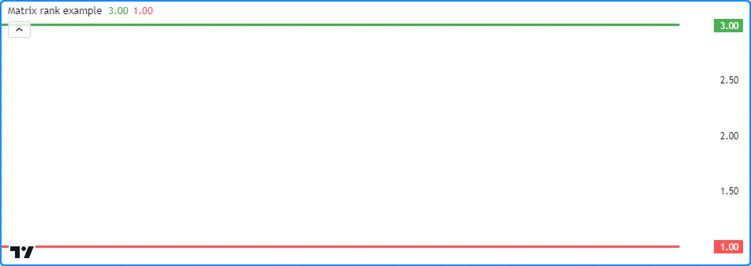

```pine
//@version=6
indicator("Matrix rank example")

//@variable A 3x3 full-rank matrix.
m1 = matrix.new<float>()
//@variable A 3x3 rank-deficient matrix.
m2 = matrix.new<float>()

// Add linearly independent vectors to `m1`.
m1.add_row(0, array.from(3, 2, 3))
m1.add_row(1, array.from(4, 6, 6))
m1.add_row(2, array.from(7, 4, 9))

// Add linearly dependent vectors to `m2`.
m2.add_row(0, array.from(1, 2, 3))
m2.add_row(1, array.from(2, 4, 6))
m2.add_row(2, array.from(3, 6, 9))

// Plot `matrix.rank()` values.
plot(m1.rank(), color = color.green, linewidth = 3)
plot(m2.rank(), color = color.red, linewidth = 3)
```

Note that:

- The highest rank value a matrix can have is the minimum of its
number of rows and columns. A matrix with the maximum possible
rank is known as a _full-rank_ matrix, and any matrix without
full rank is known as a _rank-deficient_ matrix.
- The
[determinants](../3. Language/language_matrices.md#matrixdet) of full-rank square matrices are nonzero, and such
matrices have
[inverses](../3. Language/language_matrices.md#matrixinv-and-matrixpinv). Conversely, the determinant of a rank-deficient matrix is always 0.
- For any matrix that contains nothing but the same value in each
of its elements (e.g., a matrix filled with 0), the rank is
always 0 since none of the vectors hold unique information. For
any other matrix with distinct values, the minimum possible rank
is 1.

## [Error handling](../3. Language/language_matrices.md#error-handling)

In addition to usual **compiler** errors, which occur during a script’s
compilation due to improper syntax, scripts using matrices can raise
specific **runtime** errors during their execution. When a script raises
a runtime error, it displays a red exclamation point next to the script
title. Users can view the error message by clicking this icon.

In this section, we discuss runtime errors that users may encounter
while utilizing matrices in their scripts.

### [The row/column index (xx) is out of bounds, row/column size is (yy).](../3. Language/language_matrices.md#the-rowcolumn-index-xx-is-out-of-bounds-rowcolumn-size-is-yy)

This runtime error occurs when trying to access indices outside the
matrix dimensions with functions including
[matrix.get()](../../reference manual/functions/matrix.get.md),
[matrix.set()](../../reference manual/functions/matrix.set.md),
[matrix.fill()](../../reference manual/functions/matrix.fill.md),
and
[matrix.submatrix()](../../reference manual/functions/matrix.submatrix.md),
as well as some of the functions relating to the
[rows and columns](../3. Language/language_matrices.md#rows-and-columns) of a matrix.

For example, this code contains two lines that will produce this runtime error. The `m.set()` method references a `row` index that doesn’t exist (2). The `m.submatrix()` method references all column indices up to `to_column - 1`. A `to_column` value of 4 results in a runtime error because the last column index referenced (3) does not exist in `m`:

```pine
//@version=6
indicator("Out of bounds demo")

//@variable A 2x3 matrix with a max row index of 1 and max column index of 2.
matrix<float> m = matrix.new<float>(2, 3, 0.0)

m.set(row = 2, column = 0, value = 1.0)     // The `row` index is out of bounds on this line. The max value is 1.
m.submatrix(from_column = 1, to_column = 4) // The `to_column` index is invalid on this line. The max value is 3.

if bar_index == last_bar_index - 1
    label.new(bar_index, 0, str.tostring(m), color = color.navy, textcolor = color.white, size = size.huge)
```

Users can avoid this error in their scripts by ensuring their function
calls do not reference indices greater than or equal to the number of
rows/columns.

### [The array size does not match the number of rows or columns in the matrix.](../3. Language/language_matrices.md#the-array-size-does-not-match-the-number-of-rows-or-columns-in-the-matrix)

When using
[matrix.add\_row()](../../reference manual/functions/matrix.add_row.md)
and
[matrix.add\_col()](../../reference manual/functions/matrix.add_col.md)
functions to
[insert](../3. Language/language_matrices.md#inserting) rows and columns into a non-empty matrix, the size of the
inserted array must align with the matrix dimensions. The size of an
inserted row must match the number of columns, and the size of an
inserted column must match the number of rows. Otherwise, the script
will raise this runtime error. For example:

```pine
//@version=6
indicator("Invalid array size demo")

// Declare an empty matrix.
m = matrix.new<float>()

m.add_col(0, array.from(1, 2))    // Add a column. Changes the shape of `m` to 2x1.
m.add_col(1, array.from(1, 2, 3)) // Raises a runtime error because `m` has 2 rows, not 3.

plot(m.col(0).get(1))
```

Note that:

- When `m` is empty, one can insert a row or column array of _any_
size, as shown in the first `m.add_col()` line.

### [Cannot call matrix methods when the ID of matrix is ‘na’.](../3. Language/language_matrices.md#cannot-call-matrix-methods-when-the-id-of-matrix-is-na)

When a matrix variable is assigned to `na`, it means that the variable
doesn’t reference an existing object. Consequently, one cannot use
built-in `matrix.*()` functions and methods with it. For example:

```pine
//@version=6
indicator("na matrix methods demo")

//@variable A `matrix` variable assigned to `na`.
matrix<float> m = na

mCopy = m.copy() // Raises a runtime error. You can't copy a matrix that doesn't exist.

if bar_index == last_bar_index - 1
    label.new(bar_index, 0, str.tostring(mCopy), color = color.navy, textcolor = color.white, size = size.huge)
```

To resolve this error, assign `m` to a valid matrix instance before
using `matrix.*()` functions.

### [Matrix is too large. Maximum size of the matrix is 100,000 elements.](../3. Language/language_matrices.md#matrix-is-too-large-maximum-size-of-the-matrix-is-100000-elements)

The total number of elements in a matrix
( [matrix.elements\_count()](../../reference manual/functions/matrix.elements_count.md))
cannot exceed **100,000**, regardless of its shape. For example, this
script will raise an error because it
[inserts](../3. Language/language_matrices.md#inserting) 1000 rows with 101 elements into the `m` matrix:

```pine
//@version=6
indicator("Matrix too large demo")

var matrix<float> m = matrix.new<float>()

if bar_index == 0
    for i = 1 to 1000
        // This raises an error because the script adds 101 elements on each iteration.
        // 1000 rows * 101 elements per row = 101000 total elements. This is too large.
        m.add_row(m.rows(), array.new<float>(101, i))

plot(m.get(0, 0))
```

### [The row/column index must be 0 <= from\_row/column < to\_row/column.](../3. Language/language_matrices.md#the-rowcolumn-index-must-be-0--from_rowcolumn--to_rowcolumn)

When using `matrix.*()` functions with `from_row/column` and
`to_row/column` indices, the `from_*` values must be less than the
corresponding `to_*` values, with the minimum possible value being 0.
Otherwise, the script will raise a runtime error.

For example, this script shows an attempt to declare a
[submatrix](../3. Language/language_matrices.md#submatrices) from a 4x4 `m` matrix with a `from_row` value of 2 and a
`to_row` value of 2, which will result in an error:

```pine
//@version=6
indicator("Invalid from_row, to_row demo")

//@variable A 4x4 matrix filled with a pseudorandom value.
matrix<float> m = matrix.new<float>(4, 4, math.random())

matrix<float> mSub = m.submatrix(from_row = 2, to_row = 2) // Raises an error. `from_row` can't equal `to_row`.

plot(mSub.get(0, 0))
```

### [Matrices ‘id1’ and ‘id2’ must have an equal number of rows and columns to be added.](../3. Language/language_matrices.md#matrices-id1-and-id2-must-have-an-equal-number-of-rows-and-columns-to-be-added)

When using
[matrix.sum() and matrix.diff()](../3. Language/language_matrices.md#matrixsum-and-matrixdiff) functions, the `id1` and `id2` matrices must have the same
number of rows and the same number of columns. Attempting to add or
subtract two matrices with mismatched dimensions will raise an error, as
demonstrated by this code:

```pine
//@version=6
indicator("Invalid sum dimensions demo")

//@variable A 2x3 matrix.
matrix<float> m1 = matrix.new<float>(2, 3, 1)
//@variable A 3x4 matrix.
matrix<float> m2 = matrix.new<float>(3, 4, 2)

mSum = matrix.sum(m1, m2) // Raises an error. `m1` and `m2` don't have matching dimensions.

plot(mSum.get(0, 0))
```

### [The number of columns in the ‘id1’ matrix must equal the number of rows in the matrix (or the number of elements in the array) ‘id2’.](../3. Language/language_matrices.md#the-number-of-columns-in-the-id1-matrix-must-equal-the-number-of-rows-in-the-matrix-or-the-number-of-elements-in-the-array-id2)

When using
[matrix.mult()](../3. Language/language_matrices.md#matrixmult) to multiply an `id1` matrix by an `id2` matrix or array, the
[matrix.rows()](../../reference manual/functions/matrix.rows.md)
or
[array.size()](../../reference manual/functions/array.size.md)
of `id2` must equal the
[matrix.columns()](../../reference manual/functions/matrix.columns.md)
in `id1`. If they don’t align, the script will raise this error.

For example, this script tries to multiply two 2x3 matrices. While
_adding_ these matrices is possible, _multiplying_ them is not:

```pine
//@version=6
indicator("Invalid mult dimensions demo")

//@variable A 2x3 matrix.
matrix<float> m1 = matrix.new<float>(2, 3, 1)
//@variable A 2x3 matrix.
matrix<float> m2 = matrix.new<float>(2, 3, 2)

mSum = matrix.mult(m1, m2) // Raises an error. The number of columns in `m1` and rows in `m2` aren't equal.

plot(mSum.get(0, 0))
```

### [Operation not available for non-square matrices.](../3. Language/language_matrices.md#operation-not-available-for-non-square-matrices)

Some matrix operations, including
[matrix.inv()](../../reference manual/functions/matrix.inv.md),
[matrix.det()](../../reference manual/functions/matrix.det.md),
[matrix.eigenvalues()](../../reference manual/functions/matrix.eigenvalues.md),
and
[matrix.eigenvectors()](../../reference manual/functions/matrix.eigenvectors.md)
only work with **square** matrices, i.e., matrices with the same number
of rows and columns. When attempting to execute such functions on
non-square matrices, the script will raise an error stating the
operation isn’t available or that it cannot calculate the result for
the matrix `id`. For example:

```pine
//@version=6
indicator("Non-square demo")

//@variable A 3x5 matrix.
matrix<float> m = matrix.new<float>(3, 5, 1)

plot(m.det()) // Raises a runtime error. You can't calculate the determinant of a 3x5 matrix.
```

[Previous 
**Arrays**](../3. Language/language_arrays.md) [Next 
**Maps**](../3. Language/language_maps.md)