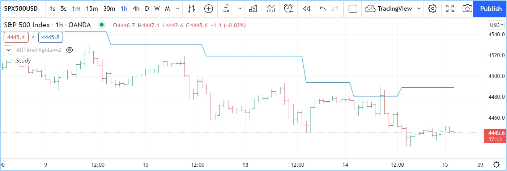
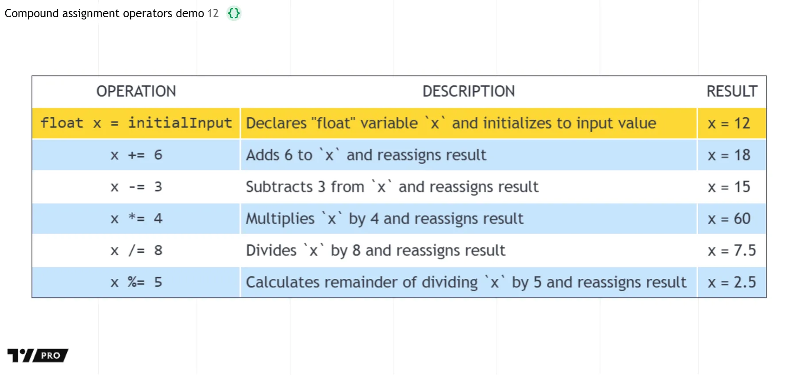

# [Operators](../3. Language/language_operators.md#operators)

## [Introduction](../3. Language/language_operators.md#introduction)

Some operators are used to build _expressions_ returning a result:

- Arithmetic operators
- Comparison operators
- Logical operators
- The
[?:](../../reference manual/operators/{question}{colon}.md)
ternary operator
- The
[\[\]](../../reference manual/operators/[].md)
history-referencing operator

Other operators are used to assign values to variables:

- `=` is used to assign a value to a variable, **but only when you**
**declare the variable** (the first time you use it)
- `:=` is used to assign a value to a **previously declared**
**variable**. The following operators can also be used in such a way:
`+=`, `-=`, `*=`, `/=`, `%=`

As is explained in the [Type system](../3. Language/language_type-system.md) page, _qualifiers_ and _types_ play a critical role in
determining the type of results that expressions yield. This, in turn,
has an impact on how and with what functions you will be allowed to use
those results. Expressions always return a value with the strongest
qualifier used in the expression, e.g., if you multiply an “input int”
with a “series int”, the expression will produce a “series int”
result, which you will not be able to use as the argument to `length` in
[ta.ema()](../../reference manual/functions/ta.ema.md).

This script will produce a compilation error:

```pine
//@version=6
indicator("")
lenInput = input.int(14, "Length")
factor = year > 2020 ? 3 : 1
adjustedLength = lenInput * factor
ma = ta.ema(close, adjustedLength)  // Compilation error!
plot(ma)
```

The compiler will complain: _Cannot call ‘ta.ema’ with argument_
_‘length’=‘adjustedLength’. An argument of ‘series int’ type was_
_used but a ‘simple int’ is expected;_. This is happening because
`lenInput` is an “input int” but `factor` is a “series int” (it can
only be determined by looking at the value of
[year](../../reference manual/variables/year.md)
on each bar). The `adjustedLength` variable is thus assigned a “series
int” value. Our problem is that the Reference Manual entry for
[ta.ema()](../../reference manual/functions/ta.ema.md)
tells us that its `length` parameter requires a “simple” value, which
is a weaker qualifier than “series”, so a “series int” value is not
allowed.

The solution to our conundrum requires:

- Using another moving average function that supports a “series int”
length, such as
[ta.sma()](../../reference manual/functions/ta.sma.md),
or
- Not using a calculation producing a “series int” value for our
length.

## [Arithmetic operators](../3. Language/language_operators.md#arithmetic-operators)

There are five arithmetic operators in Pine Script®:

| Operator | Meaning |
| --- | --- |
| `+` | Addition and string concatenation |
| `-` | Subtraction |
| `*` | Multiplication |
| `/` | Division |
| `%` | Modulo (remainder after division) |

The arithmetic operators above are all _binary_, meaning they need two _operands_ — or values — to work on, as in the example operation `1 + 2`. The `+` and `-` can also be _unary_ operators, which means they work on one operand, as in the example values `-1` or `+1`.

If both operands are numbers but at least one of these is of
[float](../../reference manual/types/float.md)
type, the result will also be a
[float](../../reference manual/types/float.md).
If both operands are of
[int](../../reference manual/types/int.md)
type, the result will also be an
[int](../../reference manual/types/int.md).
If at least one operand is
[na](../../reference manual/variables/na.md), the
result is also
[na](../../reference manual/variables/na.md).

Note that when using the division operator with “int” operands, if the two “int” values are not evenly divisible, the result of the division is always a number with a fractional value, e.g., `5/2 = 2.5`. To discard the fractional remainder, wrap the division with the [int()](../../reference manual/functions/int.md) function, or round the result using [math.round()](../../reference manual/functions/math.round.md), [math.floor()](../../reference manual/functions/math.floor.md), or [math.ceil()](../../reference manual/functions/math.ceil.md).

The `+` operator also serves as the concatenation operator for strings.
`"EUR"+"USD"` yields the `"EURUSD"` string.

The `%` operator calculates the modulo by rounding down the quotient to
the lowest possible value. Here is an easy example that helps illustrate
how the modulo is calculated behind the scenes:

```pine
//@version=6
indicator("Modulo function")
modulo(series int a, series int b) =>
    a - b * math.floor(nz(a/b))
plot(modulo(-1, 100))
```

## [Comparison operators](../3. Language/language_operators.md#comparison-operators)

There are six comparison operators in Pine Script:

| Operator | Meaning |
| --- | --- |
| `<` | Less Than |
| `<=` | Less Than or Equal To |
| `!=` | Not Equal |
| `==` | Equal |
| `>` | Greater Than |
| `>=` | Greater Than or Equal To |

Comparison operations are binary, and return a result of type “bool”, i.e., [true](../../reference manual/constants/true.md) or [false](../../reference manual/constants/false.md). The `==` equal and `!=` not equal operators can work with operands of any fundamental type, such as colors and strings, while the other comparison operators are only applicable to numerical values. Therefore, `"a" != "b"` is a valid comparison, but `"a" > "b"` is invalid.

Examples:

```pine
1 > 2  // false
1 != 1 // false
close >= open  // Depends on values of `close` and `open`
```

## [Logical operators](../3. Language/language_operators.md#logical-operators)

There are three logical operators in Pine Script:

| Operator | Meaning |
| --- | --- |
| `not` | Negation |
| `and` | Logical Conjunction |
| `or` | Logical Disjunction |

The operator `not` is unary. When applied to a `true`, operand the
result will be `false`, and vice versa.

`and` operator truth table:

| a | b | a and b |
| --- | --- | --- |
| true | true | true |
| true | false | false |
| false | true | false |
| false | false | false |

`or` operator truth table:

| a | b | a or b |
| --- | --- | --- |
| true | true | true |
| true | false | true |
| false | true | true |
| false | false | false |

## [​`?:`​ ternary operator](../3. Language/language_operators.md#-ternary-operator)

The
[?:](../../reference manual/operators/{question}{colon}.md)
ternary operator is used to create expressions of the form:

```pine
condition ? valueWhenConditionIsTrue : valueWhenConditionIsFalse
```

The ternary operator returns a result that depends on the value of `condition`. If it is `true`, then it returns `valueWhenConditionIsTrue`. Otherwise, if `condition` is `false`, then it returns `valueWhenConditionIsFalse`.

A combination of ternary expressions can be used to achieve the same
effect as a
[switch](../../reference manual/keywords/switch.md)
structure, e.g.:

```pine
timeframe.isintraday ? color.red : timeframe.isdaily ? color.green : timeframe.ismonthly ? color.blue : na
```

The example is calculated from left to right:

- If
[timeframe.isintraday](../../reference manual/variables/timeframe.isintraday.md)
is `true`, then `color.red` is returned. If it is `false`, then
[timeframe.isdaily](../../reference manual/variables/timeframe.isdaily.md)
is evaluated.
- If
[timeframe.isdaily](../../reference manual/variables/timeframe.isdaily.md)
is `true`, then `color.green` is returned. If it is `false`, then
[timeframe.ismonthly](../../reference manual/variables/timeframe.ismonthly.md)
is evaluated.
- If
[timeframe.ismonthly](../../reference manual/variables/timeframe.ismonthly.md)
is `true`, then `color.blue` is returned, otherwise
[na](../../reference manual/variables/na.md)
is returned.

Note that, in contrast to [conditional structures](../3. Language/language_conditional-structures.md), the ternary operator does _not_ create [local scopes](../6. FAQ/faq_programming.md#what-does-scope-mean).

## [​`[]`​ history-referencing operator](../3. Language/language_operators.md#-history-referencing-operator)

It is possible to refer to past values of
[time series](../3. Language/language_execution-model.md#time-series) using the
[\[\]](../../reference manual/operators/[].md)
history-referencing operator. Past values are values a variable had on
bars preceding the bar where the script is currently executing — the
_current bar_. See the
[Execution model](../3. Language/language_execution-model.md)
page for more information about the way scripts are executed on bars.

The
[\[\]](../../reference manual/operators/[].md)
operator is used after a variable, expression or function call. The
value used inside the square brackets of the operator is the offset in
the past we want to refer to. To refer to the value of the
[volume](../../reference manual/variables/volume.md)
built-in variable two bars away from the current bar, one would use
`volume[2]`.

Because series grow dynamically, as the script calculates on successive bars, a constant historical offset refers to different bars. Let’s see how the value returned by the same offset is dynamic, and why series are very different from arrays. In Pine Script, the
[close](../../reference manual/variables/close.md)
variable, or `close[0]` which is equivalent, holds the value of the
current bar’s “close”. If your code is now executing on the **third**
bar of the _dataset_ (the set of all bars on your chart), `close` will
contain the price at the close of that bar, `close[1]` will contain the
price at the close of the preceding bar (the dataset’s second bar), and
`close[2]`, the first bar. `close[3]` will return
[na](../../reference manual/variables/na.md)
because no bar exists in that position, and thus its value is _not_
_available_.

When the same code is executed on the next bar, the **fourth** in the
dataset, `close` will now contain the closing price of that bar, and the
same `close[1]` used in your code will now refer to the “close” of the
third bar in the dataset. The close of the first bar in the dataset will
now be `close[3]`, and this time `close[4]` will return
[na](../../reference manual/variables/na.md).

In the Pine Script runtime environment, as your code is executed once
for each historical bar in the dataset, starting from the left of the
chart, Pine Script is adding a new element in the series at index 0 and
pushing the pre-existing elements in the series one index further away.
Arrays, in comparison, can have constant or variable sizes, and their
content or indexing structure is not modified by the runtime
environment. Pine Script series are thus very different from arrays and
only share familiarity with them through their indexing syntax.

When the market for the chart’s symbol is open and the script is
executing on the chart’s last bar, the _realtime bar_,
[close](../../reference manual/variables/close.md)
returns the value of the current price. It will only contain the actual
closing price of the realtime bar the last time the script is executed
on that bar, when it closes.

Pine Script has a variable that contains the number of the bar the
script is executing on:
[bar\_index](../../reference manual/variables/bar_index.md).
On the first bar,
[bar\_index](../../reference manual/variables/bar_index.md)
is equal to 0 and it increases by 1 on each successive bar the script
executes on. On the last bar,
[bar\_index](../../reference manual/variables/bar_index.md)
is equal to the number of bars in the dataset minus one.

There is another important consideration to keep in mind when using the
`[]` operator in Pine Script. We have seen cases when a history
reference may return the
[na](../../reference manual/variables/na.md)
value.
[na](../../reference manual/variables/na.md)
represents a value which is not a number and using it in any expression
will produce a result that is also
[na](../../reference manual/variables/na.md)
(similar to [NaN](https://en.wikipedia.org/wiki/NaN)). Such cases often
happen during the script’s calculations in the early bars of the
dataset, but can also occur in later bars under certain conditions.
If your code does not explicitly handle these special cases using the [na()](../../reference manual/functions/na.md) and [nz()](../../reference manual/functions/nz.md) functions, [na](../../reference manual/variables/na.md) values can introduce invalid results in your script’s calculations that can affect calculations all the way to the realtime bar.

These are all valid uses of the
[\[\]](../../reference manual/operators/[].md)
operator:

```pine
high[10]
ta.sma(close, 10)[1]
ta.highest(high, 10)[20]
close > nz(close[1], open)
```

Note that the
[\[\]](../../reference manual/operators/[].md)
operator can only be used once on the same value. This is not allowed:

```pine
close[1][2] // Error: incorrect use of [] operator
```

## [Operator precedence](../3. Language/language_operators.md#operator-precedence)

The order of calculations is determined by the operators’ precedence.
Operators with greater precedence are calculated first. Below is a list
of operators sorted by decreasing precedence:

| Precedence | Operator |
| --- | --- |
| 9 | `[]` |
| 8 | unary `+`, unary `-`, `not` |
| 7 | `*`, `/`, `%` |
| 6 | `+`, `-` |
| 5 | `>`, `<`, `>=`, `<=` |
| 4 | `==`, `!=` |
| 3 | `and` |
| 2 | `or` |
| 1 | `?:` |

If in one expression there are several operators with the same
precedence, then they are calculated left to right.

If the expression must be calculated in a different order than
precedence would dictate, then parts of the expression can be grouped
together with parentheses.

## [​`=`​ assignment operator](../3. Language/language_operators.md#-assignment-operator)

The `=` operator assigns an initial value or reference to a declared variable. It means _this is a new variable, and it starts with this value_.

These are all valid variable declarations:

```pine
i = 1
MS_IN_ONE_MINUTE = 1000 * 60
showPlotInput = input.bool(true, "Show plots")
pHi = ta.pivothigh(5, 5)
plotColor = color.green
```

See the
[Variable declarations](../3. Language/language_variable-declarations.md) page for more information on how to declare variables.

## [​`:=`​ reassignment operator](../3. Language/language_operators.md#-reassignment-operator)

The `:=` is used to _reassign_ a value to an existing variable. It says
_use this variable that was declared earlier in my script, and give it a_
_new value_.

Variables which have been first declared, then reassigned using `:=`,
are called _mutable_ variables. All the following examples are valid
variable reassignments. You will find more information on how
[var](../../reference manual/keywords/var.md)
works in the section on the
[\`var\` declaration mode](../3. Language/language_variable-declarations.md#var):

```pine
//@version=6
indicator("", "", true)
// Declare `pHi` and initilize it on the first bar only.
var float pHi = na
// Reassign a value to `pHi`
pHi := nz(ta.pivothigh(5, 5), pHi)
plot(pHi)
```

Note that:

- We declare `pHi` with this code: `var float pHi = na`. The
[var](../../reference manual/keywords/var.md)
keyword tells Pine Script that we only want that variable
initialized with
[na](../../reference manual/variables/na.md)
on the dataset’s first bar. The `float` keyword tells the compiler
we are declaring a variable of type “float”. This is necessary
because, contrary to most cases, the compiler cannot automatically
determine the type of the value on the right side of the `=` sign.
- While the variable declaration will only be executed on the first
bar because it uses
[var](../../reference manual/keywords/var.md),
the `pHi := nz(ta.pivothigh(5, 5), pHi)` line will be executed on
all the chart’s bars. On each bar, it evaluates if the
[ta.pivothigh()](../../reference manual/functions/ta.pivothigh.md)
call returns
[na](../../reference manual/variables/na.md)
because that is what the function does when it hasn’t found a new
pivot. The
[nz()](../../reference manual/functions/nz.md)
function is the one doing the “checking for
[na](../../reference manual/variables/na.md)”
part. When its first argument (`ta.pivothigh(5, 5)`) is
[na](../../reference manual/variables/na.md),
it returns the second argument (`pHi`) instead of the first. When
[ta.pivothigh()](../../reference manual/functions/ta.pivothigh.md)
returns the price point of a newly found pivot, that value is
assigned to `pHi`. When it returns
[na](../../reference manual/variables/na.md)
because no new pivot was found, we assign the previous value of
`pHi` to itself, in effect preserving its previous value.

The output of our script looks like this:



Note that:

- The line preserves its previous value until a new pivot is found.
- Pivots are detected five bars after the pivot actually occurs
because our `ta.pivothigh(5, 5)` call says that we require five
lower highs on both sides of a high point for it to be detected as a
pivot.

See the
[Variable reassignment](../3. Language/language_variable-declarations.md#variable-reassignment) section for more information on how to reassign values to
variables.

## [Compound assignment operators](../3. Language/language_operators.md#compound-assignment-operators)

A _compound assignment operator_ combines an [arithmetic operator](../3. Language/language_operators.md#arithmetic-operators) with the [reassignment operator](../3. Language/language_operators.md#-reassignment-operator). It provides a shorthand way to perform an arithmetic calculation on a variable and then assign the result back to that same variable.

For example, `counter += 1` adds 1 to the current value of a `counter` variable and assigns the new incremented value back to `counter`. This operation is equivalent to `counter := counter + 1`. Note that a variable must be declared before a script can use a compound assignment operator on it.

There are five compound assignment operators in Pine Script:

| Operator | Meaning |
| --- | --- |
| `+=` | Addition assignment and string concatenation |
| `-=` | Subtraction assignment |
| `*=` | Multiplication assignment |
| `/=` | Division assignment |
| `%=` | Modulo (remainder after division) assignment |

This example executes various compound assignment operations on one “float” variable, `x`, and traces how each operation changes the variable’s stored value. The script draws a [table](../1. Concepts/concepts_tables.md) to show each operation and its resulting value of `x` after reassignment. A [float input](../1. Concepts/concepts_inputs.md#float-input) can change the initial value assigned to `x`, which in turn changes the result of each row’s calculation:



```pine
//@version=6
indicator("Compound assignment operators demo")

//@variable The initial value assigned to the `x` variable.
float initialInput = input.float(12, "Initial value of `x`", minval = 0)

//@variable A `table` that displays the executed operations and traces their results on the `x` variable.
var table resultsTable = table.new(position.middle_center, 3, 7, color.white, color.black, 1, color.white, 2)

//@function Initializes a `resultsTable` row to show an `operation` and the resulting `x` variable value.
displayResult(int rowID, string operation, string description, float x, bool initialRow = false) =>
    //@variable Is yellow only for initial row. Otherwise, alternates row colors: blue if `rowID` is even, white if odd.
    color rowColor = initialRow ? color.yellow : rowID % 2 == 0 ? color.rgb(33, 149, 243, 75) : color.white
    // Display the `operation` in the row's first cell.
    resultsTable.cell(0, rowID, operation, bgcolor = rowColor, text_font_family = font.family_monospace)
    // Display the operation's `description` in the row's second cell.
    resultsTable.cell(1, rowID, description, bgcolor = rowColor, text_halign = text.align_left)
    // Show the result of the `operation` on the `x` variable by outputting its current value in the row's third cell.
    resultsTable.cell(2, rowID, str.format(" x = {0}", x), bgcolor = rowColor, text_halign = text.align_left)

if barstate.islastconfirmedhistory
    // Display the table's header cells.
    resultsTable.cell(0, 0, "OPERATION")
    resultsTable.cell(1, 0, "DESCRIPTION")
    resultsTable.cell(2, 0, "RESULT")

    // Declare and initialize the `x` variable, and display an initial row in the table to show its starting value.
    float x = initialInput
    displayResult(1, "float x = initialInput", "Declares \"float\" variable `x` and initializes to input value", x, true)

    // Execute various compound assignments successively on `x`, displaying each operation and its result in the table.
    x += 6
    displayResult(2, "x += 6", "Adds 6 to `x` and reassigns result", x)
    x -= 3
    displayResult(3, "x -= 3", "Subtracts 3 from `x` and reassigns result", x)
    x *= 4
    displayResult(4, "x *= 4", "Multiplies `x` by 4 and reassigns result", x)
    x /= 8
    displayResult(5, "x /= 8", "Divides `x` by 8 and reassigns result", x)
    x %= 5
    displayResult(6, "x %= 5", "Calculates remainder of dividing `x` by 5 and reassigns result", x)
```

The `+=` operator also acts as a [concatenation](../1. Concepts/concepts_strings.md#concatenation) operator when both operands are [strings](../1. Concepts/concepts_strings.md). For example, if a `symTicker` variable holds the string `"NASDAQ:"`, then `symTicker += "AAPL"` appends the `"AAPL"` characters to the `"NASDAQ:"` characters to create a new “string” value `"NASDAQ:AAPL"`, which is then assigned back to `symTicker`.

[Previous 
**Variable declarations**](../3. Language/language_variable-declarations.md) [Next 
**Conditional structures**](../3. Language/language_conditional-structures.md)