# [Variable declarations](../3. Language/language_variable-declarations.md#variable-declarations)

## [Introduction](../3. Language/language_variable-declarations.md#introduction)

Variables are _named containers_ that store calculated values or other data for a script to access and use within a given scope. Variables in Pine Script® can hold data of any available [type](../3. Language/language_type-system.md#types) that is not [void](../3. Language/language_type-system.md#void), including the direct values of [value types](../3. Language/language_type-system.md#value-types), and the _IDs_ (references) of [drawings](../3. Language/language_type-system.md#drawing-types), [collections](../3. Language/language_type-system.md#collections), [plots](../3. Language/language_type-system.md#plot-and-hline) or other instances of [reference types](../3. Language/language_type-system.md#reference-types).

A variable in Pine Script consists of three main parts:

- An [identifier](../3. Language/language_identifiers.md) (name), which represents the variable in the source code.
- A [qualified type](../3. Language/language_type-system.md), which determines the kind of data the variable stores and whether the data can change.
- An assigned value or reference.

Programmers write _variable declarations_ to create _custom_ variables for working with data of specific types when the available [built-in variables](../3. Language/language_built-ins.md#built-in-variables) do not suffice. A variable declaration is a statement specifying that, from a particular point onward in a specific _scope_, an identifier refers to a variable with a given initial value or reference. The script accesses the saved value or reference while evaluating expressions or statements that use the variable’s identifier.

There are two forms of variable declarations in Pine Script:

- [Single-variable declarations](../3. Language/language_variable-declarations.md#single-variable-declarations) declare and initialize _one_ variable. Programmers can include optional keywords in the statement to define the variable’s type and its declaration behavior, or to export the variable from a [library](../1. Concepts/concepts_libraries.md).
- [Tuple declarations](../3. Language/language_variable-declarations.md#tuple-declarations) declare and initialize _multiple_ variables using a _tuple_ format. Programmers use these statements to declare variables that hold the data from _function calls_, [conditional structures](../3. Language/language_conditional-structures.md), or [loops](../3. Language/language_loops.md) that return [tuples](../3. Language/language_type-system.md#tuples) of data.

All of the statements in the following code block are examples of valid variable declarations. Each identifier to the left of an [=](../../reference manual/operators/=.md) operator in the code is the _name_ of a _new variable_, and the expression or structure to the right determines that variable’s initial value or reference:

```pine
// Declares a variable named `oc2` that holds a "series float" value.
oc2 = (open + close) / 2

// Declares a variable named `MULT` that holds a "const float" value.
// The `const` and `float` keywords are optional. Using `const` prevents the script from changing the value later.
const float MULT = 2.5

// Declares *three* variables named `basis`, `upper`, and `lower` to hold all the values returned by `ta.bb()`.
// This declaration format does not support keywords; each variable inherits the type of its assigned value.
[basis, upper, lower] = ta.bb(oc2, 20, MULT)

// Declares a variable named `ratio`. The type is "series float".
// The `float` keyword is optional, but helps promote readability.
float ratio = math.pow((oc2 - basis) / (upper - lower), 3)

// Declares a `ratioColor` variable to hold a "series color" value returned by a `switch` structure.
// The `series` and `color` keywords are optional.
series color ratioColor = switch
    ratio >  0.05 => color.green
    ratio < -0.05 => color.red
    => color.gray

// Declares a variable named `historyBarsStr` on the *first* bar only. Its type is "series string".
// The `var` keyword causes the variable and its value to *persist* across subsequent bars.
var historyBarsStr = "Historical bars: " + str.tostring(last_bar_index + 1)

// Declares a persistent `timeLabel` variable to hold a `label` ID. The `label` keyword is optional.
var label timeLabel = label.new(
    last_bar_time, 0, historyBarsStr, xloc.bar_time, yloc.price, color.blue, label.style_label_left
)

// Declares a persistent "float" variable named `highLevel`.
// The `float` keyword is *required* because the initial value is *undefined*.
// The `varip` keyword causes the variable to persist across *every* execution, not just every bar.
varip float highLevel = na

// These statements declare variables to hold "plot" IDs, which the script can use in `fill()` function calls.
ratioPlot = plot(ratio, "Ratio", ratioColor, 3)
basisPlot = plot(0, "Zero")
```

Regardless of format, several key characteristics and limitations apply to user-defined variables:

- Every variable has _one_ qualified type, even if its declaration does not explicitly [specify the type](../3. Language/language_variable-declarations.md#declaring-qualified-types) in the code. Variables declared without [type keywords](../3. Language/language_variable-declarations.md#type-keywords) or [qualifier keywords](../3. Language/language_variable-declarations.md#qualifier-keywords) _inherit_ type information from their assigned data. A variable’s qualified type _never changes_ across script executions.
- Most custom variables are _mutable_. Scripts can [reassign](../3. Language/language_variable-declarations.md#variable-reassignment) mutable variables by using the [reassignment](../3. Language/language_operators.md#-reassignment-operator) or [compound assignment](../3. Language/language_operators.md#compound-assignment-operators) operators. However, they _cannot_ reassign any _global_ variables from inside [user-defined functions](../3. Language/language_user-defined-functions.md) or [methods](../3. Language/language_methods.md#user-defined-methods).
- The [scope](../3. Language/language_variable-declarations.md#scopes) of a variable depends on the location of its declaration in the code. The scope determines which parts of the script can _access_ that variable. A variable is available to all parts of a script _after_ its declaration in the _same scope_ or a _nested scope_, but **not** to any part that is _before_ the declaration or in an _outer scope_.
- Variables in _different_ scopes can have the _same name_, but all variables in the _same_ scope require _unique names_. The only exception is for variables whose identifier is an [underscore](../3. Language/language_variable-declarations.md#using-an-underscore-as-an-identifier) (`_`), which makes them _unusable_ in any expressions or statements.
- If a variable in a nested scope has the same name as one in an outer scope, that variable [shadows](../3. Language/language_variable-declarations.md#shadowing) the outer scope’s variable. In other words, the script _cannot access_ the outer scope’s variable in any part of the nested scope following the inner variable’s declaration.
- By default, a script declares and initializes a variable anew during _each execution_ of its scope. However, a single-variable declaration can include the [var](../../reference manual/keywords/var.md) or [varip](../../reference manual/keywords/varip.md) keyword to set an alternative [declaration mode](../3. Language/language_variable-declarations.md#declaration-modes), causing the variable and its data to _persist_ across bars or ticks.

## [Single-variable declarations](../3. Language/language_variable-declarations.md#single-variable-declarations)

A single-variable declaration is a statement that creates one new variable, names it, and assigns it an initial value or reference. The statement can include _keywords_ to specify the variable’s qualified type and declaration mode, or to export the variable. The syntax is as follows:

```
[export ][var |varip ][[qualifier ]<type> ]<identifier> = <expression>|<structure>
```

Where:

- The `|` character represents _OR_, all parts enclosed in angle brackets (`<>`) represent _required_ syntax, and all parts in square brackets (`[]`) represent _optional_ syntax.
- [export](../../reference manual/keywords/export.md) is the optional keyword for exporting the variable from a [library](../1. Concepts/concepts_libraries.md), enabling its use in other scripts. Exporting is allowed only if the variable is of a [fundamental type](../3. Language/language_type-system.md#types) and the declaration includes the [const](../../reference manual/types/const.md) keyword.
- [var](../../reference manual/keywords/var.md) and [varip](../../reference manual/keywords/varip.md) are optional keywords that cause the variable and its data to _persist_ across bars or ticks. If the declaration does not include either keyword, the script _reinitializes_ the variable during _every_ execution of the variable’s [scope](../3. Language/language_variable-declarations.md#scopes). Refer to the [Declaration modes](../3. Language/language_variable-declarations.md#declaration-modes) section for more information.
- `qualifier` and `type` refer to _keywords_ for specifying the variable’s [qualified type](../3. Language/language_type-system.md). These keywords are usually optional. If the declaration does not include them, the variable’s assigned data determines its type information. See the [Declaring qualified types](../3. Language/language_variable-declarations.md#declaring-qualified-types) section to learn more.
- `identifier` is the variable’s _name_.
- [=](../../reference manual/operators/=.md) is the [assignment operator](../3. Language/language_operators.md#-assignment-operator). The `expression` or `structure` part to the right of the operator determines the initial value or reference that it assigns to the new variable. `expression` refers to a literal value, the identifier of another variable, an operation, or a _function_ or [method](../3. Language/language_methods.md#methods) call that returns a single value or reference. `structure` refers to any [conditional structure](../3. Language/language_conditional-structures.md) or [loop](../3. Language/language_loops.md) that returns a single value or reference.

The example below demonstrates a single-variable declaration that declares a “float” variable named `median` to hold the current value returned by a [ta.median()](../../reference manual/functions/ta.median.md) function call:

```pine
//@variable  Holds the 20-bar median of `hl2` values as of the current bar.
float median = ta.median(hl2, 20)
```

Note that:

- This statement initializes the `median` variable anew on _every_ execution, because it does not specify a different [declaration mode](../3. Language/language_variable-declarations.md#declaration-modes) with the [var](../../reference manual/keywords/var.md) or [varip](../../reference manual/keywords/varip.md) keyword. Each execution thus _updates_ the variable with the function call’s latest result for the current bar.
- The `//@variable` comment is an optional [annotation](../3. Language/language_script-structure.md#compiler-annotations) that _documents_ the declared variable in the code. Users can hover over the `median` identifier in the Pine Editor to view a pop-up window that displays the specified line of text.

After a script declares a variable, it can then use that variable in any subsequent part of the code in the same [scope](../3. Language/language_variable-declarations.md#scopes) or a nested scope. The variable’s identifier serves as a _placeholder_ for a specific value or reference in the script’s logic. When the script evaluates an expression that contains the identifier, it retrieves the variable’s saved data and uses that data in the calculation.

For example, the following script calculates the median of [hl2](../../reference manual/variables/hl2.md) values over a specified number of bars, then plots the median on the chart as a color-coded line. It declares variables to store the median and other values for the calculations, and uses three of the variables as arguments for the [plot()](../../reference manual/functions/plot.md) call at the end:

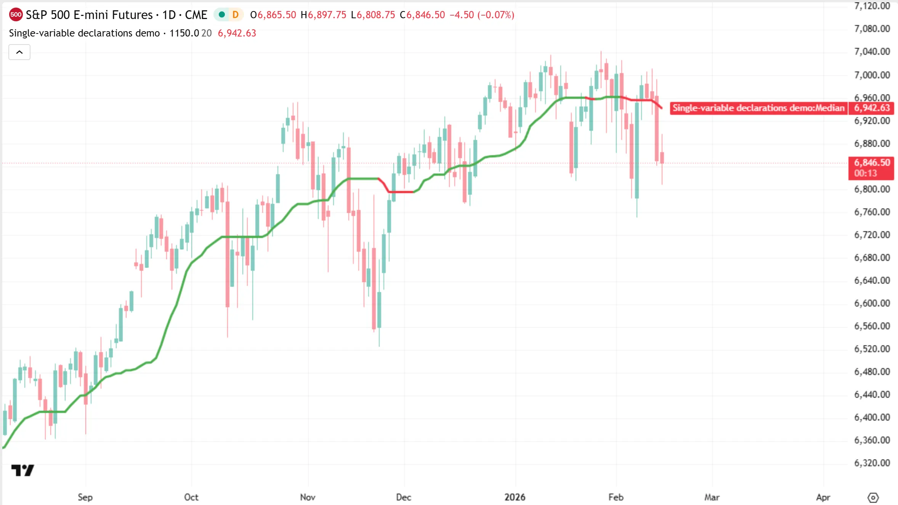

```pine
//@version=6
indicator("Single-variable declarations demo", overlay = true)

//@variable Holds a "const string" value for use as the `title` argument in the `plot()` call.
const string PLOT_TITLE = "Median"

//@variable Holds an "input int" value for use as the `length` argument in the `ta.median()` call.
int lengthInput = input.int(20, "Length", 1)

//@variable Stores the current median of `hl2` values over `lengthInput` bars. The value updates on every bar.
//          The script uses it to calculate `isUptrend`, and to define the `series` argument of the `plot()` call.
float median = ta.median(hl2, length = lengthInput)

//@variable Holds `true` if the last change in the `median` value was positive, and `false` otherwise.
bool isUptrend = ta.valuewhen(median != median[1], median > median[1], 0)

//@variable Holds the value of `color.green` if the value of `isUptrend` is `true`, and `color.red` otherwise.
color plotColor = if isUptrend
    color.green
else
    color.red

// Plot the current `median` value. Set the plot's title and color using the values of `PLOT_TITLE` and `plotColor`.
plot(series = median, title = PLOT_TITLE, color = plotColor, linewidth = 3)
```

Note that:

- The [const](../../reference manual/types/const.md) keyword specifies that the script cannot [reassign](../3. Language/language_variable-declarations.md#variable-reassignment) the variable. For [value types](../3. Language/language_type-system.md#value-types) such as “string”, it also declares that the variable’s [qualifier](../3. Language/language_type-system.md#qualifiers) is “const”, meaning that it accepts only _constant_ values that are available at _compile time_.
- The script uses the [int](../../reference manual/types/int.md), [float](../../reference manual/types/float.md), [bool](../../reference manual/types/bool.md), [color](../../reference manual/types/color.md), and [string](../../reference manual/types/string.md) keywords to specify the [type](../3. Language/language_type-system.md#types) of each variable. Using type keywords is optional in all the above declarations, because the compiler can automatically determine the appropriate types, but doing so helps promote readability. See the [Declaring qualified types](../3. Language/language_variable-declarations.md#declaring-qualified-types) section to learn more about type and qualifier keywords.
- The script can assign the result of the [if](../../reference manual/keywords/if.md) structure to a variable because both of the structure’s local blocks return the same type (“color”). See the [Matching local block type requirement](../3. Language/language_conditional-structures.md#matching-local-block-type-requirement) section of the [Conditional structures](../3. Language/language_conditional-structures.md) page to learn more.

It’s important to note that a script _cannot_ use a custom variable in any expressions or statements that _precede_ the variable’s declaration, because the variable is _not available_ at that point in the code. Attempting to use a variable in any code before its declaration causes a compilation error.

For example, moving the `median` declaration in the previous script to the end of the source code causes an error, because the script can no longer access the variable for the `isUptrend` calculation or the [plot()](../../reference manual/functions/plot.md) call:

```pine
//@version=6
indicator("Inaccessible variable demo", overlay = true)

const string PLOT_TITLE = "Median"

int lengthInput = input.int(20, "Length", 1)

bool isUptrend = ta.valuewhen(median != median[1], median > median[1], 0)

color plotColor = if isUptrend
    color.green
else
    color.red

plot(series = median, title = PLOT_TITLE, color = plotColor, linewidth = 3)

// Moving this statement to the bottom of the code makes `median` *inaccessible* to all code above.
// This change causes an error, because `isUptrend` and the `plot()` call both require the variable's value.
float median = ta.median(hl2, length = lengthInput)
```

## [Tuple declarations](../3. Language/language_variable-declarations.md#tuple-declarations)

Some [conditional structures](../3. Language/language_conditional-structures.md), [loops](../3. Language/language_loops.md), and function or [method](../3. Language/language_methods.md#methods) calls return [tuples](../3. Language/language_type-system.md#tuples) containing _multiple_ values or references. To use the data returned from such expressions and structures, programmers must write _tuple declarations_, which are single statements that declare multiple variables using a tuple format.

The syntax for a tuple declaration is as follows:

```
<tuple_of_identifiers> = <function_call>|<structure>
```

Where:

- The `|` character represents _OR_, and all parts enclosed in angle brackets (`<>`) represent required syntax.
- `tuple_of_identifiers` represents a comma-separated list of variable names enclosed in square brackets (e.g., `[x, y, z]`). The tuple must contain _one_ new identifier for _each_ returned value or reference.
- [=](../../reference manual/operators/=.md) is the [assignment operator](../3. Language/language_operators.md#-assignment-operator). The `function_call` or `structure` part to the right of the operator determines the initial data that it assigns to each new variable. `function_call` refers to a call to a [built-in function](../3. Language/language_built-ins.md#built-in-functions) or [user-defined function](../3. Language/language_user-defined-functions.md), or method, that returns a tuple. Likewise, `structure` refers to a loop or conditional structure that returns a tuple.

Some built-in functions in the `ta` namespace return a tuple instead of a single value. Therefore, scripts must use tuple declarations to create variables that store the data from calls to those functions. For example, the [ta.bb()](../../reference manual/functions/ta.bb.md) function returns a tuple containing all _three_ values of the [Bollinger Bands](https://www.tradingview.com/support/solutions/43000501840-bollinger-bands-bb/) indicator in the following order: the basis moving average, the upper band, and the lower band. Therefore, a script must use a tuple declaration, such as the following, to declare one new variable for _each_ returned value:

```pine
// Declares three variables named `bbMiddle`, `bbUpper`, and `bbLower` to hold the values returned by `ta.bb()`.
// `bbMiddle` stores the middle band (SMA), `bbUpper` stores the upper band, and `bbLower` stores the lower band.
[bbMiddle, bbUpper, bbLower] = ta.bb(close, 5, 4)
```

Programmers often use tuples in [user-defined functions](../3. Language/language_user-defined-functions.md) and methods to return multiple values for use later in a script’s calculations. A user-defined function returns a tuple only if the _final code_ in its body is a tuple of expressions.

For example, the code block below defines a `calcWidthAndColor()` function that returns a two-item tuple. The tuple contains a “float” value representing the width between two bands, and a “color” value based on the width value. The code then calls that function using variables from the previous example declaration as arguments, and uses a tuple declaration to declare two new variables to store the returned values:

```pine
//@function Calculates the width between two bands, and a gradient color based on the normalized width over a
//          specified length.
calcWidthAndGradient(float upper, float lower, int length, color upperColor, color lowerColor) =>
    float width = upper - lower
    float normWidth = width / ta.highest(width, length)
    color gradient = color.from_gradient(normWidth, 0, 1, lowerColor, upperColor)
    // Return a tuple containing the values of `width` ("series float") and `gradient` ("series color").
    [width, gradient]

[bbMiddle, bbUpper, bbLower] = ta.bb(close, 5, 4)

// Declares two variables named `bandWidth` and `widthColor` to store the values returned by `calcWidthAndGradient()`.
// `bandWidth` stores the returned `width` value, and `widthColor` stores the returned `gradient` value.
[bandWidth, widthColor] = calcWidthAndGradient(bbUpper, bbLower, 5, color.orange, color.purple)
```

Note that:

- The `upper`, `lower`, `length`, `upperColor`, and `lowerColor` identifiers in the function definition represent _parameters_, which determine the types of _arguments_ that a call to the function requires.
- The function definition uses [single-variable declarations](../3. Language/language_variable-declarations.md#single-variable-declarations) in its body to create variables that store the necessary data for the function’s calculations. Those variables are available only inside the function definition; a script _cannot_ access them in any other [scope](../3. Language/language_variable-declarations.md#scopes).

Programmers often use tuple declarations to declare multiple variables that store results returned by [conditional structures](../3. Language/language_conditional-structures.md). Similar to a function, a conditional structure returns a tuple if the final code in _each local block_ is a tuple of expressions.

For example, the following code block declares two variables, `lowColor` and `highColor`, to hold “color” values returned by a [switch](../../reference manual/keywords/switch.md) structure based on the value of a [string input](../1. Concepts/concepts_inputs.md#string-input):

```pine
//@variable Holds a string to specify a colorful or grayscale style.
string styleInput = input.string("Color", "Style", ["Color", "Grayscale"])

// Declares two variables named `lowColor` and `highColor` to hold the two values returned by the `switch` structure.
// The value of `lowColor` is `color.purple` or `#606060`, and the value of `highColor` is `color.orange` or `#b1b1b1`.
[lowColor, highColor] = switch styleInput
    "Color" => [color.purple, color.orange]
    =>         [#606060, #b1b1b1]
```

The following script combines all three examples above to calculate a set of Bollinger Bands, their width, and a gradient color, then plots all the values on the chart:

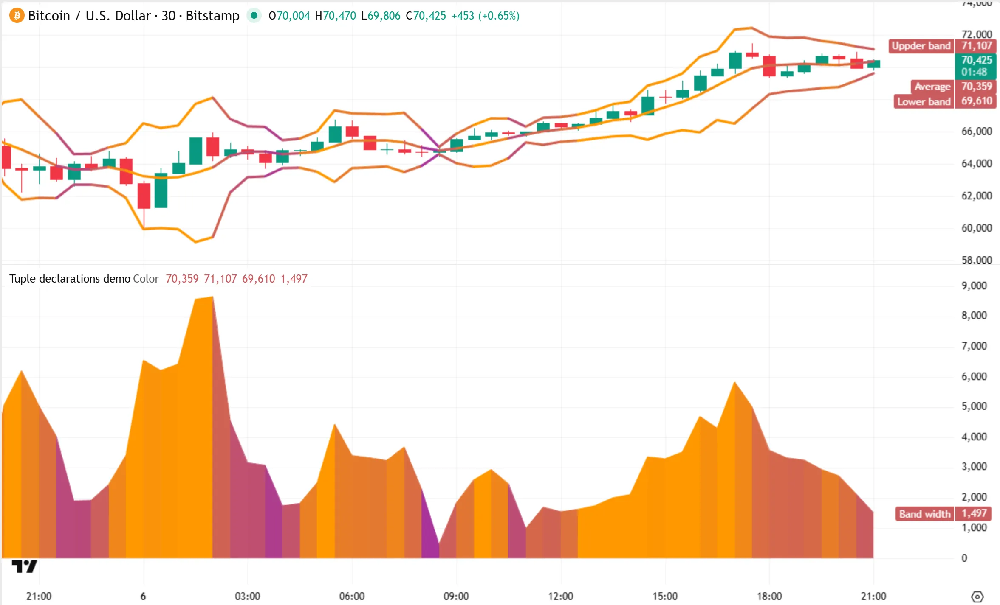

```pine
//@version=6
indicator("Tuple declarations demo")

//@variable Holds a string to specify a colorful or grayscale style.
string styleInput = input.string("Color", "Style", ["Color", "Grayscale"])

//@function Calculates the width between two bands, and a gradient color based on the normalized width over a
//          specified length.
calcWidthAndGradient(float upper, float lower, int length, color upperColor, color lowerColor) =>
    float width = upper - lower
    float normWidth = width / ta.highest(width, length)
    color gradient = color.from_gradient(normWidth, 0, 1, lowerColor, upperColor)
    // Return a tuple containing the values of `width` ("series float") and `gradient` ("series color").
    [width, gradient]

// Declares two variables named `lowColor` and `highColor` to hold the two values returned by the `switch` structure.
// The value of `lowColor` is `color.purple` or `#606060`, and the value of `highColor` is `color.orange` or `#b1b1b1`.
[lowColor, highColor] = switch styleInput
    "Color" => [color.purple, color.orange]
    =>         [#606060, #b1b1b1]

// Declares three variables named `bbMiddle`, `bbUpper`, and `bbLower` to hold the values returned by `ta.bb()`.
// `bbMiddle` stores the middle band (SMA), `bbUpper` stores the upper band, and `bbLower` stores the lower band.
[bbMiddle, bbUpper, bbLower] = ta.bb(close, 5, 3)

// Declares two variables named `bandWidth` and `widthColor` to store the values returned by `calcWidthAndGradient()`.
// `bandWidth` stores the returned `width` value, and `widthColor` stores the returned `gradient` value.
[bandWidth, widthColor] = calcWidthAndGradient(bbUpper, bbLower, 5, highColor, lowColor)

// Plot the `bbMiddle`, `bbUpper`, and `bbLower` series on the main pane, using `widthColor` as each plot's color.
plot(bbMiddle, "Average",     widthColor, 3, force_overlay = true)
plot(bbUpper,  "Upper band",  widthColor, 3, force_overlay = true)
plot(bbLower,  "Lower band",  widthColor, 3, force_overlay = true)
// Plot the `bandWidth` series as columns in a separate pane, and color the plot using `widthColor`.
plot(bandWidth, "Band width", widthColor, style = plot.style_area)
```

## [Using an underscore as an identifier](../3. Language/language_variable-declarations.md#using-an-underscore-as-an-identifier)

Scripts can declare variables using a _single underscore_ (`_`) as the identifier to mark those variables as _unused_. A script _cannot_ access data from any variables named `_` or use those variables in other expressions or statements after their declaration. Programmers can write any number of `_` variable declarations anywhere in a script, including multiple times in the same [scope](../3. Language/language_variable-declarations.md#scopes).

This behavior is useful in cases where a function call returns a [tuple](../3. Language/language_type-system.md#tuples) of multiple values, but the script requires only _some_ of those values in its calculations. Rather than specifying unique names for all the unused variables from a [tuple declaration](../3. Language/language_variable-declarations.md#tuple-declarations), programmers can _discard_ those variables by using `_` as the name for each one.

For example, the following script calculates the highest and lowest prices across the chart’s visible bars. It imports the [VisibleChart](https://www.tradingview.com/script/j7vCseM2-VisibleChart/) library from PineCoders and calls the library’s `ohlcv()` function to perform the calculation. The call returns a tuple of five values: the visible chart range’s open, high, low, close, and cumulative volume. However, our script requires only the high and low. Instead of specifying unique names for all the unused variables, we use `_` as each unused variable’s identifier:

```pine
//@version=6
indicator("Underscores in tuple declarations demo", overlay = true)

// Import version 5 of the `VisibleChart` library from PineCoders.
import PineCoders/VisibleChart/5 as visChart

// Declare a tuple of variables for all values returned by the imported `ohlcv()` function.
// This function returns five values in the following order: open, high, low, close, and cumulative volume.
// We require only the high and low, so we use `_` to discard the other returned values.
[_, visibleHigh, visibleLow, _, _] = visChart.ohlcv()

// Plot the values of the `visibleHigh` and `visibleLow` variables on the chart.
plot(visibleHigh, "Visible high", color.green, 3)
plot(visibleLow,  "Visible low",  color.red,   3)
```

Programmers also occasionally use `_` when writing a [loop](../3. Language/language_loops.md) whose calculations do not require the variables declared in the loop’s header. For example, the script below calculates the sum of 20 pseudorandom values from [math.random()](../../reference manual/functions/math.random.md) calls using a [for](../../reference manual/keywords/for.md) loop. The calculation does not require the loop’s _counter_ variable, so we used `_` as the variable’s name to mark it as unused:

```pine
//@version=6
indicator("Underscores for loop variables demo")

//@variable Stores a pseudorandom value from a Bates distribution.
float sample = 0.0

// Calculate the sum of 20 `math.random()` values in a `for` loop.
// The calculation does not require the counter variable from the loop's header, so we set its identifier to `_`.
for _ = 1 to 20
    sample += math.random()

// Divide by 20 to calculate the final sample.
sample /= 20

// Plot the resulting value.
plot(sample, "Pseudorandom sample")
```

Note that:

- The [+=](../../reference manual/operators/+=.md) and [/=](../../reference manual/operators//=.md) operators in this script _reassign_ the value of the `sample` variable after initialization. See the [Variable reassignment](../3. Language/language_variable-declarations.md#variable-reassignment) section to learn more.

## [Declaring qualified types](../3. Language/language_variable-declarations.md#declaring-qualified-types)

Every variable has an assigned [type](../3. Language/language_type-system.md#types) and a [type qualifier](../3. Language/language_type-system.md#qualifiers), which together define the variable’s _qualified type_. A variable’s type determines _what kind_ of data the variable represents in the script’s calculations, as well as the types of data that the script can pass to the variable. A variable’s qualifier indicates _when_ the assigned data is available and whether it can _change_ across executions.

By default, the Pine Script compiler automatically determines the qualified type of a variable based on its assigned data. However, in [single-variable declarations](../3. Language/language_variable-declarations.md#single-variable-declarations), programmers can override this behavior and specify qualified types directly by prefixing the declared identifiers with [type keywords](../3. Language/language_variable-declarations.md#type-keywords) and [qualifier keywords](../3. Language/language_variable-declarations.md#qualifier-keywords).

The following sections explain how these keywords affect declared variables. For detailed information about Pine’s types and qualifiers, and how they work, refer to the [Type system](../3. Language/language_type-system.md) page.

### [Type keywords](../3. Language/language_variable-declarations.md#type-keywords)

A variable declaration that prefixes the variable’s identifier with a _type keyword_ specifies the [type](../3. Language/language_type-system.md#types) of data that the variable represents in the script’s calculations.

Programmers can use any of the following as the type keyword in a [single-variable declaration](../3. Language/language_variable-declarations.md#single-variable-declarations) to set the variable’s type:

- Built-in type keywords: [int](../../reference manual/types/int.md), [float](../../reference manual/types/float.md), [bool](../../reference manual/types/bool.md), [color](../../reference manual/types/color.md), [string](../../reference manual/types/string.md), [line](../../reference manual/types/line.md), [linefill](../../reference manual/types/linefill.md), [box](../../reference manual/types/box.md), [polyline](../../reference manual/types/polyline.md), [label](../../reference manual/types/label.md), [table](../../reference manual/types/table.md), [chart.point](../../reference manual/types/chart.point.md), [footprint](../../reference manual/types/footprint.md), and [volume\_row](../../reference manual/types/volume_row.md).
- [Collection](../3. Language/language_type-system.md#collections) type identifiers, which contain the [array](../../reference manual/types/array.md), [matrix](../../reference manual/types/matrix.md), or [map](../../reference manual/types/map.md) keyword followed by a _type template_ (e.g., `array<int>`, `matrix<float>`, `map<string, color>`).
- The names of [enum types](../3. Language/language_type-system.md#enum-types) or [user-defined types](../3. Language/language_type-system.md#user-defined-types).

Including a type keyword in a variable declaration is usually _optional_, because the Pine Script compiler can automatically determine a variable’s type based on its assigned value or reference. However, a variable declaration _requires_ a type keyword if any of the following conditions apply:

- The declaration includes a [qualifier keyword](../3. Language/language_variable-declarations.md#qualifier-keywords).
- The variable is a constant exported by a [library](../1. Concepts/concepts_libraries.md).
- The variable’s initial value is [na](../../reference manual/variables/na.md) (undefined), and the statement does not cast it to a valid type using the available [type-casting](../3. Language/language_type-system.md#type-casting) functions (e.g., [int()](../../reference manual/functions/int.md)). See the [`na` value](../3. Language/language_type-system.md#na-value) section of the [Type system](../3. Language/language_type-system.md) page for more information.

If a variable declaration does _not_ include a type keyword, the variable automatically inherits the _same type_ as the data that the script uses to initialize it.

For example, the script below declares a variable named `myVar` without using a type keyword. It initializes the variable using the result of the expression `last_bar_index - bar_index`, which returns an “int” value. Therefore, the variable automatically inherits the “int” type:

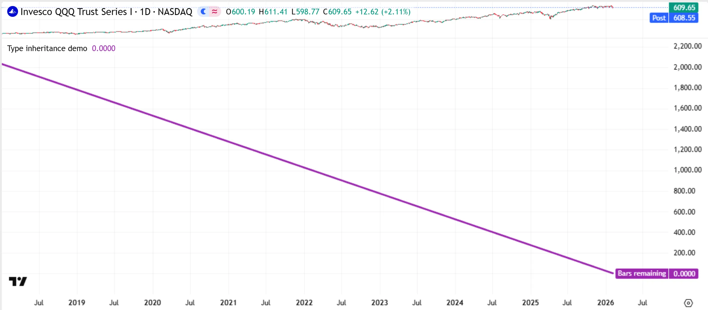

```pine
//@version=6
indicator("Type inheritance demo")

//@variable Counts the number of bars remaining until the script reaches the latest bar.
//          The expression returns a "series int" value. Therefore, the variable automatically inherits the "int" type.
//          You can hover over the `myVar` identifier to confirm the type.
myVar = last_bar_index - bar_index

// Plot the value on the chart.
plot(myVar, "Bars remaining", color.purple, 3)
```

Note that:

- The variable’s _qualified type_ is “series int”, because the built-in variables in the expression store “series” values that change from bar to bar. See the [Qualifiers](../3. Language/language_type-system.md#qualifiers) section of the [Type system](../3. Language/language_type-system.md) page and the [Qualifier keywords](../3. Language/language_variable-declarations.md#qualifier-keywords) section below to learn more.

After a variable inherits a type, the script can assign only data of the inherited type or data that Pine Script can [cast](../3. Language/language_type-system.md#type-casting) to that type, because a variable’s assigned type _cannot change_ after initialization.

For example, the following script attempts to [reassign](../3. Language/language_variable-declarations.md#variable-reassignment) the `myVar` variable using an expression that returns a “float” value after initializing the variable with an “int” value. This script causes a _compilation error_, because it cannot automatically cast a “float” value to the “int” type that the `myVar` variable requires:

```pine
//@version=6
indicator("Cannot change an inherited type demo")

//@variable The natural logarithm of bars remaining until the script reaches the latest bar.
//          The expression returns a "series int" value. Therefore, the variable automatically inherits the "int" type.
//          You can hover over the `myVar` identifier to confirm the type.
myVar = last_bar_index - bar_index

// This line causes a compilation error. The `myVar` variable already inherited the type "int", so the script cannot
// later assign it the "float" value returned by `math.log()`.
myVar := nz(math.log(myVar))

// Plot the value on the chart.
plot(myVar, "Log of bars remaining", color.purple, 3)
```

If a variable declaration _does_ include a type keyword, the compiler assigns the specified type directly to the variable instead of using the type of the initial value or reference. The script can then assign the variable only data of the specified type, or data that Pine can cast to that type.

For example, if we add the [float](../../reference manual/types/float.md) type keyword to the `myVar` declaration in the previous example, no compilation error occurs. The keyword directly sets that variable’s type to “float”. Variables of the “float” type can accept “float” or “int” values without errors, because Pine automatically casts “int” values to the “float” type when necessary:

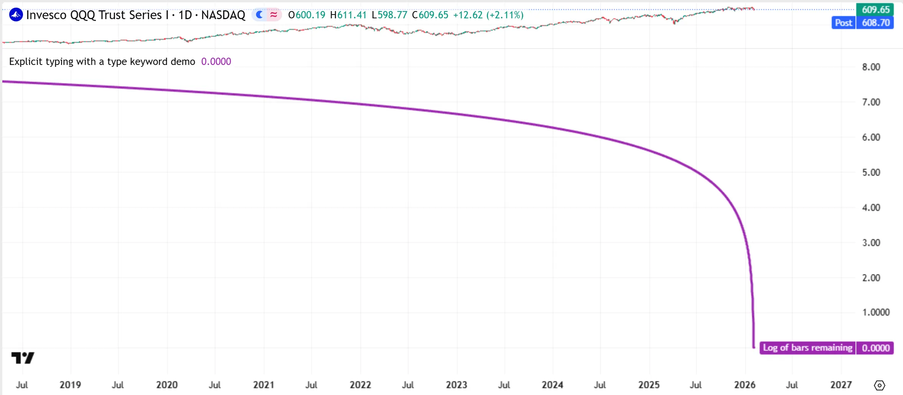

```pine
//@version=6
indicator("Explicit typing with a type keyword demo")

//@variable The natural logarithm of bars remaining until the script reaches the latest bar.
//          Although the initial expression returns an "int" value, the `float` keyword directly sets the variable's
//          type to "float".
float myVar = last_bar_index - bar_index

// This line does not cause an error, because the expression's returned type ("float") matches the type of the variable.
myVar := nz(math.log(myVar))

// Plot the value on the chart.
plot(myVar, "Log of bars remaining", color.purple, 3)
```

### [Qualifier keywords](../3. Language/language_variable-declarations.md#qualifier-keywords)

A [single-variable declaration](../3. Language/language_variable-declarations.md#single-variable-declarations) that includes a _qualifier keyword_ ( [const](../../reference manual/types/const.md), [simple](../../reference manual/types/simple.md), or [series](../../reference manual/types/series.md)) before the [type keyword](../3. Language/language_variable-declarations.md#type-keywords) specifies the variable’s [type qualifier](../3. Language/language_type-system.md#qualifiers). A variable’s type qualifier indicates _when_ the assigned value must be accessible, and whether the value can _change_ during or across script executions. Qualifier keywords are almost always _optional_. The only exception is for a [library’s](../1. Concepts/concepts_libraries.md) exported variables, which require the [const](../../reference manual/types/const.md) keyword in their declarations.

Below, we list how each qualifier keyword affects declared variables of [value types](../3. Language/language_type-system.md#value-types):

`const`

The variable has the [“const” qualifier](../3. Language/language_type-system.md#const). It accepts only a “const” value, which is a compile-time constant that never changes at runtime. Additionally, the keyword _prevents_ the script from [reassigning](../3. Language/language_variable-declarations.md#variable-reassignment) the variable. Other code that requires any value of the type specified by the type keyword can use the variable, because the “const” qualifier is the _weakest_ in Pine’s [qualifier hierarchy](../3. Language/language_type-system.md#qualifiers).

`simple`

The variable has the [“simple” qualifier](../3. Language/language_type-system.md#simple). It accepts a “simple” value, which becomes available at _runtime_, during script executions on the _first bar_ of the dataset, and remains _consistent_ across all subsequent bars. It can also accept a value with a _weaker_ qualifier (“input” or “const”). The script can use the variable in any code that allows “simple” values of the given type, but _not_ in any code that requires values with the “input” or “const” qualifiers.

`series`

The variable has the [“series” qualifier](../3. Language/language_type-system.md#series). It can accept values with _any_ type qualifier, because “series” is the _strongest_ qualifier in Pine’s qualifier hierarchy. The variable’s value is available at runtime and _can change_ on any bar. The script can use the variable in code that allows “series” values of the given type, but _not_ in any code that requires a value with a weaker qualifier.

If the declaration of a value-type variable does _not_ include a qualifier keyword, the compiler automatically assigns the variable the _strongest_ type qualifier used by the expressions and structures that determine its value, including those that the script uses to [reassign](../3. Language/language_variable-declarations.md#variable-reassignment) the variable after declaring it.

For example, the following script calculates and plots the RMA of the [close](../../reference manual/variables/close.md) series with a specified length when it runs on a standard chart. It declares multiple variables of value types without using qualifier keywords. Therefore, each variable automatically inherits a qualifier based on its assigned data:

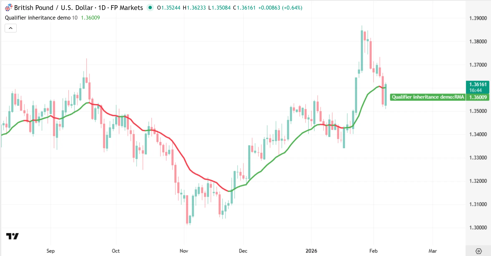

```pine
//@version=6
indicator("Qualifier inheritance demo", overlay = true)

//@variable Holds a string for use as the `title` argument in `input.int()`.
//          The assigned literal string has the "const string" qualified type.
//          Therefore, this variable automatically inherits the "const" qualifier.
string INPUT_TITLE = "Length"

//@variable Holds an integer for calculating the `length` argument for the `ta.rma()` call.
//          All `input*()` functions except for `input.source()` return a value qualified as "input".
//          Therefore, this variable inherits the "input" qualifier.
int lengthInput = input.int(10, title = INPUT_TITLE, minval = 1)

//@variable Holds the value of `lengthInput` if the chart is a standard type, and 1 otherwise.
//          The `chart.is_standard` variable has the "simple" qualifier, because it depends on data that does not change
//          but is available only at runtime. The other parts of the expression have weaker qualifiers.
//          Therefore, the expression returns a "simple" value, and the variable inherits the "simple" qualifier.
int lengthVal = chart.is_standard ? lengthInput : 1

//@variable Stores the RMA of `close` calculated using `lengthVal` as the `length` argument.
//          The `close` variable is of the type "series float", and `ta.rma()` always returns a "series" result.
//          Therefore, this variable inherits the "series" qualifier.
float rma = ta.rma(close, length = lengthVal)

//@variable Stores a "color" value for the plot.
//          The variable is initialized using the value of `color.gray`, which is of the type "const color".
//          However, the variable does **not** inherit the "const" qualifier, because the script *reassigns* the
//          variable later in an `if` structure with logic that depends on a "series" value.
//          Therefore, this variable's qualifier is "series".
color plotColor = color.gray

// If we remove this structure from the code, the `plotColor` variable's qualified type becomes "const color".
if ta.change(rma) > 0
    plotColor := color.green
else
    plotColor := color.red

// Plot the `rma` series.
plot(rma, "RMA", plotColor, 3)
```

Note that:

- If a [reassignment](../3. Language/language_operators.md#-reassignment-operator) or [compound assignment](../3. Language/language_operators.md#compound-assignment-operators) operation modifies any variable declared without a qualifier keyword, and the operation depends on a value with a stronger type qualifier than that of the variable’s initial value, the variable automatically _inherits_ that stronger qualifier. For instance, the `plotColor` variable has the _“series”_ qualifier, even though the script initializes it using a “const color” value, because the [if](../../reference manual/keywords/if.md) structure where the script [reassigns](../3. Language/language_variable-declarations.md#variable-reassignment) the value depends on a _“series bool”_ expression (`ta.change(rma) > 0`).

If a value-type variable declaration _does_ include a qualifier keyword, the compiler assigns the specified qualifier directly to the variable. The variable can accept a value of the specified type with the given qualifier or a _weaker_ one, but it _cannot_ accept a value with a _stronger_ qualifier.

Below, we modified the previous example from this section to demonstrate how qualifier keywords restrict assigned values. Each declaration after the first includes a qualifier keyword that represents a _weaker_ qualifier than that of the variable’s assigned value, causing a _compilation error_:

```pine
//@version=6
indicator("Invalid qualifier keywords demo", overlay = true)

// The `const` keyword sets the variable's qualifier to "const", which matches the qualifier of the assigned value.
// Therefore, no error occurs here.
const string INPUT_TITLE = "Length"

// The `const` keyword causes a compilation error here. A "const" variable cannot accept a value qualified as "input".
const int lengthInput = input.int(10, title = INPUT_TITLE, minval = 1)

// The `const` keyword also causes an error in this declaration, as a "const" variable cannot hold a "simple" value.
const int lengthVal = chart.is_standard ? lengthInput : 1

// Using `simple` in this declaration causes an error, because "series" values cannot be stored by "simple" variables.
simple float rma = ta.rma(close, length = lengthVal)

// Using `simple` in this declaration causes compilation errors in the `if` structure below, because that structure
// depends on a "series" value.
simple color plotColor = color.gray

// The reassignment operations here attempt to assign a "series" value to a "simple" variable. Such operations are not
// allowed.
if ta.change(rma) > 0
    plotColor := color.green
else
    plotColor := color.red

// Plot the `rma` series.
plot(rma, "RMA", plotColor, 3)
```

In addition to restricting when a variable’s value must be available and whether it can change, a qualifier keyword restricts _how_ the script can use the variable. Scripts can pass a variable only to code that accepts the variable’s qualified type, or to code that allows a value of the same type with a _stronger_ qualifier. If a script attempts to use the variable in code that requires a value with a _weaker_ qualifier, a compilation error occurs.

For example, the script version below uses the [simple](../../reference manual/types/simple.md) keyword for the `INPUT_TITLE` declaration. This change causes an error in the [input.int()](../../reference manual/functions/input.int.md) call. The [simple](../../reference manual/types/simple.md) keyword sets the `INPUT_TITLE` variable’s type to “simple string”, but the `title` parameter of the [input.int()](../../reference manual/functions/input.int.md) function _requires_ an argument of the type “const string”. The parameter cannot accept “string” arguments with any other type qualifier:

```pine
//@version=6
indicator("Invalid argument qualifier demo", overlay = true)

// The `simple` keyword explicitly sets the variable's qualifier to "simple".
simple string INPUT_TITLE = "Length"

// The `input.int()` call causes a compilation error. The `title` parameter requires a "const" argument. It cannot
// accept an argument with a stronger qualifier such as "simple".
int lengthInput = input.int(10, title = INPUT_TITLE, minval = 1)

int lengthVal = chart.is_standard ? lengthInput : 1
float rma = ta.rma(close, length = lengthVal)
color plotColor = color.gray

if ta.change(rma) > 0
    plotColor := color.green
else
    plotColor := color.red

// Plot the `rma` series.
plot(rma, "RMA", plotColor, 3)
```

## [Variable reassignment](../3. Language/language_variable-declarations.md#variable-reassignment)

In Pine Script, most variables declared by a script are _mutable_, meaning that the script can _change (reassign)_ their assigned values or references (IDs) after their declarations. The only exception is for variables that a script declares using the [const](../../reference manual/types/const.md) keyword, because that keyword explicitly _prevents_ the script from reassigning those variables.

Scripts can reassign custom variables of most available [types](../3. Language/language_type-system.md#types) by using the [reassignment operator (:=)](../3. Language/language_operators.md#-reassignment-operator). The operator directly _replaces_ the variable’s assigned value or reference with the one returned by the specified expression or structure.

For example, the following script declares a variable named `myVar` with an initial value of 0. Then, it uses the [:=](../../reference manual/operators/:=.md) operator to reassign the variable a value of 10 and plots the result. The script plots a consistent value of 10, not 0, because the [:=](../../reference manual/operators/:=.md) operation _overwrites_ the variable’s initial value:

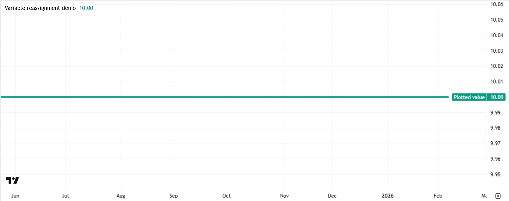

```pine
//@version=6
indicator("Variable reassignment demo")

//@variable Stores an initial value of 0.
int myVar = 0

// This operation changes the variable's value to 10. The previous value of 0 is no longer stored by the variable.
myVar := 10

// This call plots a consistent value of 10, not 0.
plot(myVar, "Plotted value", color.teal, 4)
```

Note that scripts cannot reassign variables _before_ declaring those variables. Similarly, they cannot reassign _local_ variables while executing code in an outer scope or a separate local scope. See the [Scopes](../3. Language/language_variable-declarations.md#scopes) section below for more information.

For example, a compilation error occurs if we move the [:=](../../reference manual/operators/:=.md) operation _above_ the `myVar` declaration in the previous script, because the variable is _not available_ at that point in the global scope:

```pine
//@version=6
indicator("Invalid reassignment of undeclared variable demo")

// This operation causes a compilation error.
// The `myVar` identifier does not refer to a valid variable in this part of the code.
myVar := 10

// The reassignment operation must occur *after* this declaration.
int myVar = 0

plot(myVar, "Plotted value", color.teal, 4)
```

Scripts can also reassign variables of specific [value types](../3. Language/language_type-system.md#value-types) by using the [compound assignment](../3. Language/language_operators.md#compound-assignment-operators) operators. These operators perform an _arithmetic_ operation using the value of a variable and another specified value, and then reassign the result directly to the original variable:

- Addition/concatenation assignment ( [+=](../../reference manual/operators/+=.md))
- Subtraction assignment ( [-=](../../reference manual/operators/-=.md))
- Multiplication assignment ( [\*=](../../reference manual/operators/*=.md))
- Division assignment ( [/=](../../reference manual/operators//=.md))
- Modulo (remainder) assignment ( [%=](../../reference manual/operators/%=.md))

The following example calculates an EMA of the [close](../../reference manual/variables/close.md) series with a user-specified length using reassignment and compound assignment operations. It declares a variable named `ema` and initializes it with a value of 0, and then reassigns the variable to store the value of `nz(ema[1], close)`. Afterward, the script uses the [\*=](../../reference manual/operators/*=.md) operator to multiply the variable’s value by the value of `(1.0 - alpha)`, and then calculates the final value by using the [+=](../../reference manual/operators/+=.md) operator to add the result of `alpha * close`:

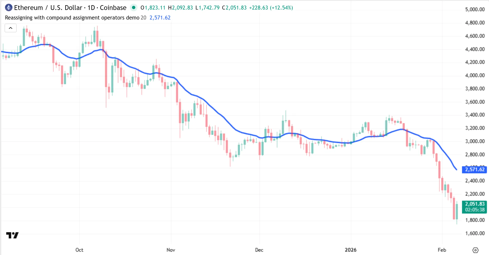

```pine
//@version=6
indicator("Reassigning with compound assignment operators demo", overlay = true)

//@variable Stores the length for the smoothing factor of the EMA (`alpha`).
int lengthInput = input.int(20, "Length", 1)

//@variable The EMA's smoothing factor.
float alpha = 2.0 / (lengthInput + 1.0)

//@variable Stores an initial value of 0, and is modified through reassignment.
float ema = 0.0

// Reassign the `ema` variable the previous bar's `ema` value, or the `close` value if the previous value is `na`.
// The variable no longer stores a value of 0.
ema := nz(ema[1], close)

// Multiply and reassign the `ema` variable's value.
// After this operation, the value equals the result of `nz(ema[1], close) * (1.0 - alpha)`.
ema *= (1.0 - alpha)

// Add and reassign the variable's value.
// After this operation, the value equals the result of `nz(ema[1], close) * (1.0 - alpha) + alpha * close`.
// This result on the current bar is what the `ema[1]` operation retrieves on the next bar.
ema += alpha * close

// Plot the final value of the `ema` variable for the current bar.
plot(ema, "EMA", color.blue, 3)
```

Note that:

- This script uses compound assignment operators for demonstration purposes. An equivalent way to calculate the `ema` value with _fewer_ lines of code is to use a single [:=](../../reference manual/operators/:=.md) operation to reassign the variable the result of `(1.0 - alpha) * nz(ema[1], close) + alpha * close`.
- Reassigning a variable can affect its [type qualifier](../3. Language/language_type-system.md#qualifiers). For example, although the script initializes the `ema` variable using a “const” value, it also reassigns the variable using _“series”_ expressions. Therefore, the variable inherits the “series” qualifier, because that qualifier is _stronger_ than “const”.

Variables declared in [tuple declarations](../3. Language/language_variable-declarations.md#tuple-declarations) are also compatible with reassignment or compound assignment operators. For example, the script below uses a tuple declaration to declare three variables that hold the result of a [ta.macd()](../../reference manual/functions/ta.macd.md) call, and then uses the [:=](../../reference manual/operators/:=.md) operator on the declared `macd` variable to assign it a new value. It plots the value of the variable before _and_ after the operation for comparison:

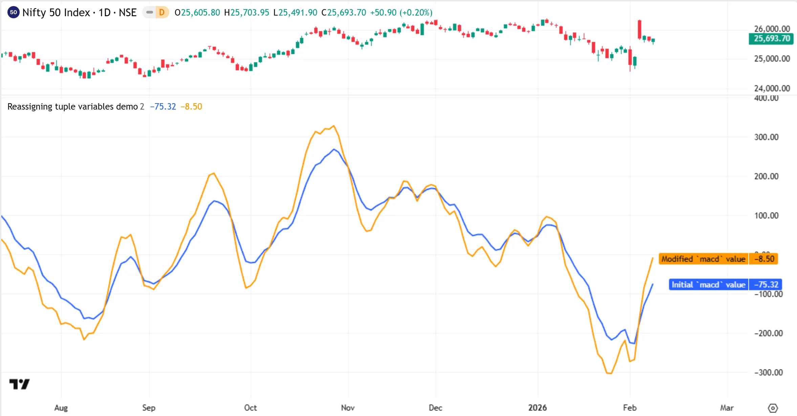

```pine
//@version=6
indicator("Reassigning tuple variables demo")

//@variable Stores a multiplier to apply to the histogram value while modifying the `macd` variable.
float factorInput = input.float(2.0, "Factor")

// Declare three variables to store the MACD, signal, and histogram values from `ta.macd()`.
[macd, sig, hist] = ta.macd(close, 12, 26, 9)

// Plot the initial value of the `macd` variable. The reassignment operation below does not affect this plot.
plot(macd, "Initial `macd` value", color.blue, 2)

// Reassign the `macd` variable a new value.
macd := sig + hist * factorInput

// Plot the new value of the `macd` variable.
plot(macd, "Modified `macd` value", color.orange, 2)
```

Note that:

- A reassignment or compound assignment operation does not apply to a variable in any code before that operation in the script. The two [plot()](../../reference manual/functions/plot.md) calls demonstrate this behavior. Although both calls use the `macd` variable, they show different results because the first call uses the variable’s _initial_ value, and the second uses the variable’s value _after_ executing the [:=](../../reference manual/operators/:=.md) operation.

## [Scopes](../3. Language/language_variable-declarations.md#scopes)

The _scope_ of a variable refers to the region of a script in which the script can use the declared [identifier](../3. Language/language_identifiers.md) to access that variable and its data. Every script has one _global_ scope and zero or more _local_ scopes.

The location of a variable declaration in a source code determines the resulting variable’s scope:

- A variable declared _inside_ the code block of a [conditional structure](../3. Language/language_conditional-structures.md), a [loop](../3. Language/language_loops.md), or a [user-defined function](../3. Language/language_user-defined-functions.md) or [method](../3. Language/language_methods.md#methods) definition belongs to a unique local scope.
- All variables declared outside these structures, as signified by _non-indented_ lines of code, belong to the script’s global scope.

The global scope is the _outermost_ scope; it encloses all parts of the script defined in the source code. Every local scope is an _inner_ scope, nested into an outer scope, that encloses only the parts of the script defined within a specific _structure_. In general, declared variables that belong to a given outer scope are _accessible_ to the inner scopes defined within that scope, but only if the structures that create those scopes are _below_ the variable declarations in the code. However, variables that belong to an inner scope are **not** accessible to any outer scope.

For example, the following script declares a variable named `counter` and increments its assigned value inside the scope of an [if](../../reference manual/keywords/if.md) structure, then attempts to use that local variable’s identifier for the `series` argument of a [plot()](../../reference manual/functions/plot.md) call in the global scope. This script causes a compilation error, because only the [if](../../reference manual/keywords/if.md) structure can use the `counter` identifier to access the variable declared within it. In the global scope, the identifier _does not_ refer to a valid variable:

```pine
//@version=6
indicator("Visibility of inner scopes demo")

if close > open
    //@variable A persistent *local* variable that tracks the number of upward bars.
    //          Only the `if` structure's scope can access this variable. The variable is inaccessible to other scopes.
    var int counter = 0
    // Increment the variable's value by 1 in this scope.
    counter += 1

// The use of `counter` in this `plot()` call causes a compilation error.
// No variable with that name exists in this scope, and the outermost (global) scope cannot access local variables.
plot(counter, "Up bar count", color.teal, 3)
```

By contrast, if we move the `counter` variable declaration _above_ the [if](../../reference manual/keywords/if.md) structure in the previous code, the variable then belongs to the _global scope_. With this change, the [plot()](../../reference manual/functions/plot.md) call can now use the variable. Additionally, the script can still use the identifier in the [if](../../reference manual/keywords/if.md) structure’s [+=](../../reference manual/operators/+=.md) operation to [reassign](../3. Language/language_variable-declarations.md#variable-reassignment) the variable without causing an error, because a global variable _is accessible_ to the local scopes of the structures defined after its declaration:

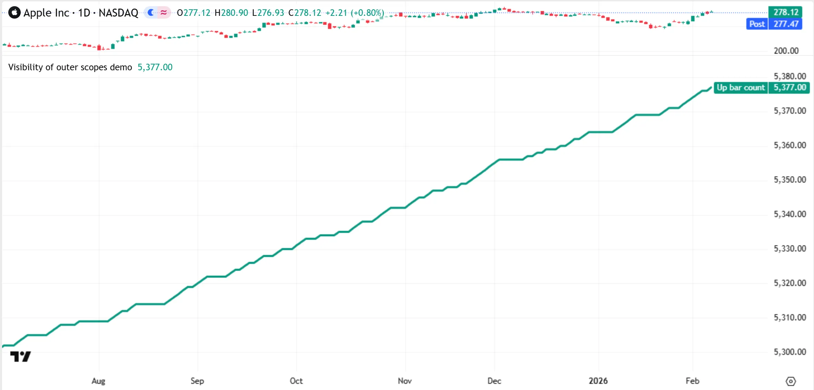

```pine
//@version=6
indicator("Visibility of outer scopes demo")

//@variable A persistent *global* variable that tracks the number of upward bars.
//          The global scope encloses all parts of the script. Therefore, the `if` structure below can access
//          this variable.
var int counter = 0

if close > open
    // Increment the variable's value by 1 in this scope. This does not cause an error, as `counter` refers to the
    // global variable declared above.
    counter += 1

// Plot the global `counter` series.
plot(counter, "Up bar count", color.teal, 3)
```

Note that:

- The script uses the [var](../../reference manual/keywords/var.md) keyword to enable the `counter` variable and its value to _persist_ across bars. To learn more about this keyword, see the [Declaration modes](../3. Language/language_variable-declarations.md#declaration-modes) section below.

Each variable in a script is a _unique container_ that stores a specific value or reference (ID). As such, every variable that belongs to the _same_ scope must have a _unique_ identifier, because using two variables with identical names in the same scope causes ambiguity. The only exception is for variables that have a [single underscore](../3. Language/language_variable-declarations.md#using-an-underscore-as-an-identifier) (`_`) as their identifier, because the identifier makes those variables _unusable_.

However, variables that belong to _different_ scopes can have the _same_ identifier, even if they differ in their [qualified types](../3. Language/language_variable-declarations.md#declaring-qualified-types) or [declaration modes](../3. Language/language_variable-declarations.md#declaration-modes), because the identifier refers to only one specific variable while the script executes the scope where each variable declaration occurs.

For example, the script below calculates the percentage difference between the total number of rising and falling bars. It declares three variables named `counter` for its calculations. The script declares the first two inside the separate [if](../../reference manual/keywords/if.md) structures, and the last one _below_ those structures in the global scope. Although multiple variables share the `counter` identifier, each exists in a _different_ scope, and the identifier refers to only _one_ of those variables at a time. Therefore, the script compiles successfully:

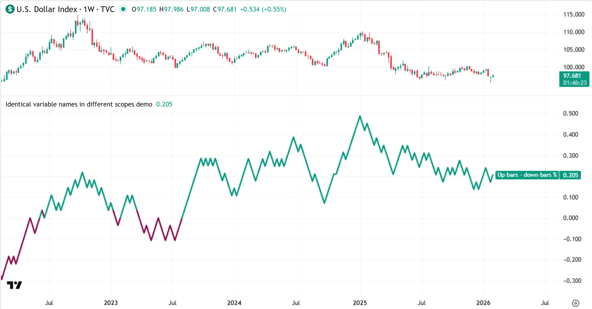

```pine
//@version=6
indicator("Identical variable names in different scopes demo")

//@variable Stores the total number of up bars if `close > open`, and `na` otherwise.
int risingCount = if close > close[1]
    // Declare a local variable named `counter` and increment its value.
    // This variable is a unique entity that exists only in this `if` structure's scope. No other scopes can access it.
    var int counter = 0
    counter += 1 // Modifies the variable declared on line 8.

//@variable Stores the total number of down bars if `close < open`, and `na` otherwise.
int fallingCount = if close < close[1]
    // Declare another variable named `counter` and increment its value.
    // Although it has the same name as the variable in the `if` block above, it exists only in this structure's scope.
    var int counter = 0
    counter += 1 // Modifies the variable declared on line 15. Does not affect the variable on line 8.

// Declare a global variable named `counter` and increment its value. The identifier here does not refer to either of
// the local variables above, because this declaration is in the outermost scope.
var int counter = 0
counter += 1 // Modifies the variable declared on line 20. Does not affect the ones on lines 8 and 15.

//@variable The percentage difference between the total number of up bars and down bars.
//          The `counter` identifier in the expression refers to the variable declared on line 20.
float diff = 100 * (fixnan(risingCount) - fixnan(fallingCount)) / counter

// Plot the `diff` series as a color-coded line.
plot(diff, "Up bars - down bars %", diff > 0 ? color.teal : color.maroon, 3)
```

Note that:

- The script declares the global `risingCount` and `fallingCount` variables to store the values returned by the [if](../../reference manual/keywords/if.md) structures, because the local `counter` variables are not accessible to the expressions outside their local scopes. When either structure executes its scope, it returns the result of its `counter += 1` statement. Otherwise, it returns [na](../../reference manual/variables/na.md).
- If we move the variable declaration on line 20 in this script _above_ the two [if](../../reference manual/keywords/if.md) statements, a _compiler warning_ occurs because the local variables named `counter` _shadow_ the global variable. See the [Shadowing](../3. Language/language_variable-declarations.md#shadowing) section below to learn more.

### [Shadowing](../3. Language/language_variable-declarations.md#shadowing)

_Variable shadowing_ refers to the behavior in which a variable in a specific scope _prevents access_ to a variable with the _same name_ in an outer scope. If a script declares a variable within an inner scope and assigns it the same identifier as a variable declared before it in an outer scope, the script **cannot** use the identifier to access the outer variable while executing the rest of the inner scope. In other words, the inner variable _shadows_ the outer variable.

In most cases, variable shadowing is _unintentional_. It typically occurs in parts of a script where the programmer intends to [reassign](../3. Language/language_variable-declarations.md#variable-reassignment) a variable instead of creating a new one. Therefore, the compiler displays a _warning_ in the Pine Editor to inform the programmer when it detects a local variable that shadows an outer-scope variable.

Consider the following script, which checks for engulfing candlestick patterns on the chart. It declares a global variable named `isEngulf` with an initial conditional value of `true` or `false`. Then, the script uses the `isEngulf` identifier in an [if](../../reference manual/keywords/if.md) structure to filter the condition using criteria based on [inputs](../1. Concepts/concepts_inputs.md), and draws a diamond [label](../2. Visuals/visuals_text-and-shapes.md#labels) if the filtered condition remains true. Lastly, the script uses the identifier in a [barcolor()](../../reference manual/functions/barcolor.md) call to highlight bars in yellow or orange if the global variable’s value is `true`.

A newcomer to Pine might expect the script to color the same bars for which it also draws a label, and not others. However, the script colors _every_ bar where the expression on line 16 returns `true`, and the inputs intended to filter the condition do not affect that output:

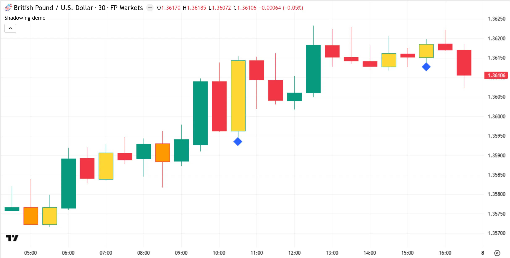

```pine
//@version=6
indicator("Avoiding shadowing demo", overlay = true, max_labels_count = 500)

// Declare "input" variables specifying allowed directions, and whether only strong patterns appear in the result.
bool bullInput       = input.bool(true,  "Include bullish patterns")
bool bearInput       = input.bool(false, "Include bearish patterns")
bool showStrongInput = input.bool(true,  "Show strong patterns only")

// Declare variables to store candle body information for pattern detection.
float bodyLow   = math.min(close, open)
float bodyHigh  = math.max(close, open)
float bodyDir   = math.sign(close - open)
float bodyRange = bodyHigh - bodyLow

//@variable Holds a "bool" value indicating whether an engulfing pattern is detected on the current bar.
bool isEngulf = (
    bodyDir != bodyDir[1] and bodyLow <= bodyLow[1] and bodyHigh >= bodyHigh[1] and bodyRange > bodyRange[1]
)

if isEngulf
    // This statement uses the `:=` operator instead of the `=` operator. Now, the script directly modifies the
    // global variable from line 16 instead of creating a new variable that shadows it.
    isEngulf := switch bodyDir
        1  => bullInput and (showStrongInput ? bodyHigh >= high[1] : true)
        -1 => bearInput and (showStrongInput ? bodyLow  <= low[1] : true)
    // `isEngulf` in this nested statement now refers to the global variable.
    if isEngulf
        label.new(bar_index, bodyDir == 1 ? low : high, style = label.style_diamond, size = size.small)

// Now that the `if` structure modifies the global `isEngulf` variable, this call colors the same recent bars where
// a label drawing occurs.
barcolor(isEngulf ? (bodyDir == 1 ? color.yellow : color.orange) : na, title = "Engulfing bar color")
```

This behavior occurs because the script uses the [=](../../reference manual/operators/=.md) operator with the `isEngulf` identifier inside the [if](../../reference manual/keywords/if.md) structure, then uses the identifier further in the local block to specify the condition that controls the label drawings. That [=](../../reference manual/operators/=.md) operation declares a new, _local_ variable named `isEngulf`, and the new variable _shadows_ the global variable declared on line 16. Consequently, the logic of the structure does not affect the value of the global `isEngulf` variable. The compiler also displays a warning on line 25 in the code, where the local `isEngulf` declaration occurs.

We can align the script’s visuals and resolve the compiler warning by replacing the [=](../../reference manual/operators/=.md) operator with the [reassignment operator (:=)](../3. Language/language_operators.md#-reassignment-operator) in the [if](../../reference manual/keywords/if.md) structure. This simple change causes the script to _reassign_ the global `isEngulf` variable using the [switch](../../reference manual/keywords/switch.md) statement’s result rather than creating a new local variable. Because the script directly changes the value of the global variable in the [if](../../reference manual/keywords/if.md) structure and uses that variable to control both the label and the bar color, both outputs now occur on the same recent bars:

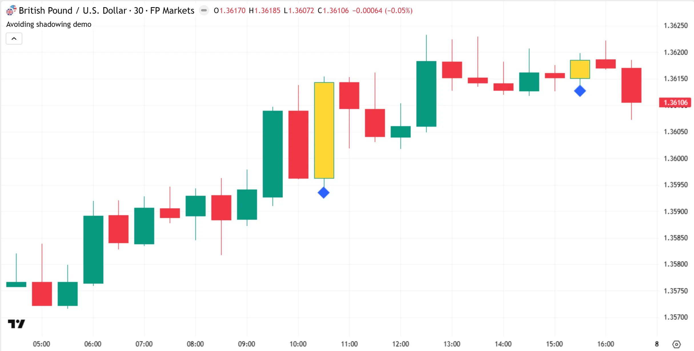

```pine
//@version=6
indicator("Avoiding shadowing demo", overlay = true, max_labels_count = 500)

// Declare "input" variables specifying allowed directions, and whether only strong patterns appear in the result.
bool bullInput       = input.bool(true,  "Include bullish patterns")
bool bearInput       = input.bool(false, "Include bearish patterns")
bool showStrongInput = input.bool(true,  "Show strong patterns only")

// Declare variables to store candle body information for pattern detection.
float bodyLow   = math.min(close, open)
float bodyHigh  = math.max(close, open)
float bodyDir   = math.sign(close - open)
float bodyRange = bodyHigh - bodyLow

//@variable Holds a "bool" value indicating whether an engulfing pattern is detected on the current bar.
bool isEngulf = (
    bodyDir != bodyDir[1] and bodyLow <= bodyLow[1] and bodyHigh >= bodyHigh[1] and bodyRange > bodyRange[1]
)

if isEngulf
    // This statement uses the `:=` operator instead of the `=` operator. Now, the script directly modifies the
    // global variable from line 16 instead of creating a new variable that shadows it.
    isEngulf := switch bodyDir
        1  => bullInput and (showStrongInput ? bodyHigh >= high[1] : true)
        -1 => bearInput and (showStrongInput ? bodyLow  <= low[1] : true)
    // `isEngulf` in this nested statement now refers to the global variable.
    if isEngulf
        label.new(bar_index, bodyDir == 1 ? low : high, style = label.style_diamond, size = size.small)

// Now that the `if` structure modifies the global `isEngulf` variable, this call colors the same recent bars where
// a label drawing occurs.
barcolor(isEngulf ? (bodyDir == 1 ? color.yellow : color.orange) : na, title = "Engulfing bar color")
```

It is also possible for custom variables in a script to shadow some [built-in variables](../3. Language/language_built-ins.md#built-in-variables). If a script declares a variable with the same identifier as a built-in variable, the identifier refers exclusively to that variable for the remainder of the scope. As with custom variables, shadowing a built-in variable causes a compiler warning.

For example, the script below declares a variable named `close` and assigns it the value of the built-in [open](../../reference manual/variables/open.md) variable, then plots the values associated with the two identifiers. Both plots show the _same_ values, because the variable declaration makes the built-in [close](../../reference manual/variables/close.md) variable _inaccessible_ to the script:

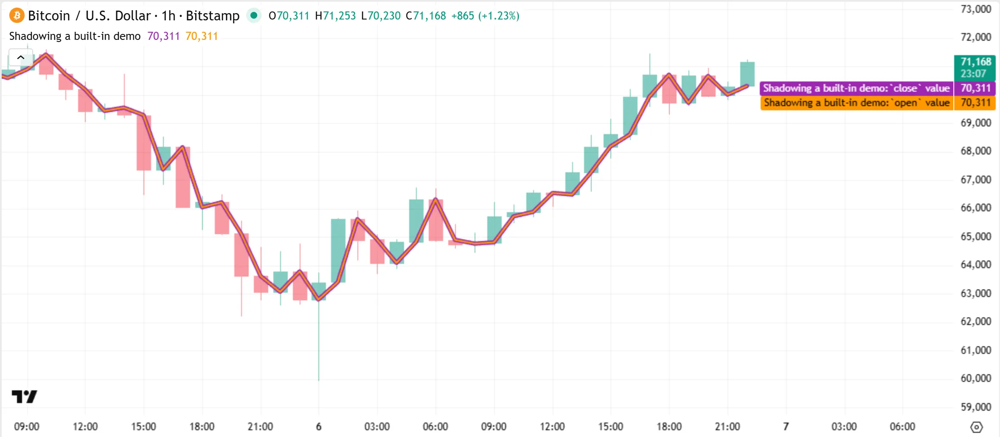

```pine
//@version=6
indicator("Shadowing a built-in demo", overlay = true)

//@variable Stores the value of the `open` variable.
float close = open

// Plot the values associated with the `close` and `open` identifiers.
// Both plots show the *same* value, because the script *cannot access* the built-in `close` variable in this part of
// the global scope.
plot(close, "`close` value", color.purple, 5)
plot(open, "`open` value", color.orange, 2)
```

However, shadowing a built-in variable is possible only if the script does not use the identifier to represent the built-in anywhere in the code. If a script already uses the built-in variable, creating a custom variable that shadows it causes a _compilation error_. For example:

```pine
//@version=6
indicator("Cannot use and shadow a built-in demo", overlay = true)

// The `switch` structure for this declaration uses `close` to refer to the *built-in* variable.
float ma = switch
    chart.is_standard => ta.sma(close, 20)
    => close

// This declaration now causes a compilation error. A script cannot use the identifier of a built-in to access that
// built-in and then use the identifier for a custom variable later. This applies regardless of the scope where the
// script accesses the built-in.
float close = open

plot(close, "`close` value", color.purple, 5)
plot(open,  "`open` value",  color.orange, 2)
plot(ma)
```

Some variables can also have the same names as _namespaces_. This naming does not typically result in shadowing. For example, a script can name a variable `barstate` and still access variables from the `barstate` namespace. However, if a variable is of a [user-defined type](../3. Language/language_type-system.md#user-defined-types) (UDT), a compilation error occurs if its name matches a namespace. Such an identifier is _not_ allowed for the type because it can cause _obscuring_, where the namespace becomes inaccessible or the use of the name becomes ambiguous. For example:

```pine
//@version=6
indicator("Cannot obscure namespaces demo")

//@type A custom type with a single "int" field named `tickerid`.
type myType
    int tickerid = 1

// This declaration causes an error.
// A UDT variable with the name `syminfo` can obscure the `syminfo` namespace.
myType syminfo = myType.new()

log.info(str.tostring(syminfo.tickerid))
```

## [Declaration modes](../3. Language/language_variable-declarations.md#declaration-modes)

A variable’s _declaration mode_ defines whether and how the variable and its data _persist_ across script executions. By default, declared variables _do not_ persist beyond a single execution; the script declares and initializes them anew during _every_ execution of their [scopes](../3. Language/language_variable-declarations.md#scopes).

Programmers can override this behavior and specify an alternative mode in a [single-variable declaration](../3. Language/language_variable-declarations.md#single-variable-declarations) by including the [var](../../reference manual/keywords/var.md) or [varip](../../reference manual/keywords/varip.md) keyword in the statement:

- If the declaration includes the [var](../../reference manual/keywords/var.md) keyword, the resulting variable persists _across bars_ after the first execution of its scope on a bar’s closing tick. After initialization on a closing tick, the variable remains initialized and preserves any data changes that occur on the close of each subsequent bar. However, it does _not_ preserve any changes that occur on a bar _before_ the bar’s closing tick.

- If the declaration includes the [varip](../../reference manual/keywords/varip.md) keyword, the resulting variable persists _across every execution_. The variable remains initialized after the _first execution_ of its scope, even if that execution occurs _before_ the bar’s closing tick. After initialization, the variable preserves all changes that occur on _any_ execution, including on those for the incoming ticks of open [realtime bars](../3. Language/language_execution-model.md#realtime-bars).


### [Default](../3. Language/language_variable-declarations.md#default)

If a script declares a variable without using the [var](../../reference manual/keywords/var.md) or [varip](../../reference manual/keywords/varip.md) keyword, it declares and initializes that variable anew during _every_ execution of the variable’s [scope](../3. Language/language_variable-declarations.md#scopes). In other words, the variable _resets_ and holds a new value or reference on each new execution, without preserving the data stored during the scope executions on previous bars or ticks.

The following example demonstrates the default declaration behavior. The script declares a variable named `count` with an initial value of 0, then uses the [+=](../../reference manual/operators/+=.md) operator to increase its value by one and plots the result. Because the variable declaration does not include the [var](../../reference manual/keywords/var.md) or [varip](../../reference manual/keywords/varip.md) keyword, the script _reinitializes_ the variable with a value of 0 on every execution. Therefore, the [+=](../../reference manual/operators/+=.md) operation [reassigns](../3. Language/language_variable-declarations.md#variable-reassignment) a constant value of 1 to the variable across the entire dataset:

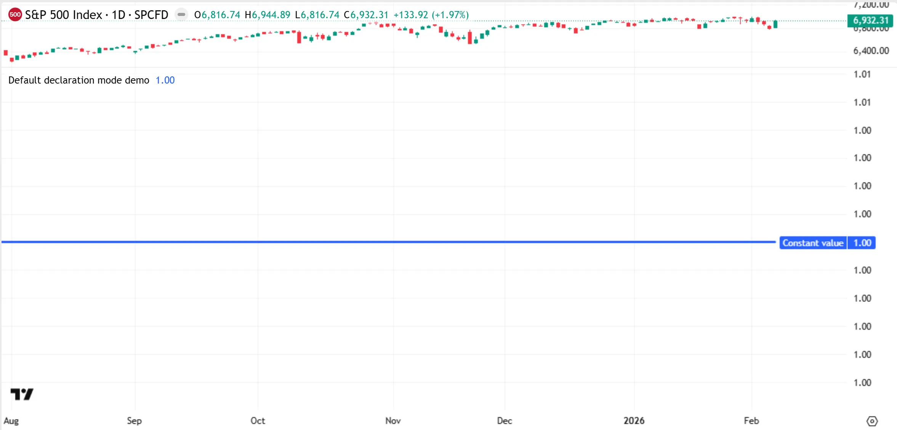

```pine
//@version=6
indicator("Default declaration mode demo")

// This declaration does not use `var` or `varip`.
// Therefore, the script reinitializes the variable to 0 on every execution.
int count = 0

// Increment the `count` variable by one. Because the variable resets to 0, this operation consistently reassigns it
// a value of 1.
count += 1

// Plot the variable's final value.
plot(count, "Constant value", color.blue, 3)
```

Although a variable that uses the default declaration mode does not persist across executions, Pine’s runtime system _commits (saves)_ a script’s calculated data from each execution on a bar’s _closing tick_, including the data for all the script’s variables, to internal [time series](../3. Language/language_execution-model.md#time-series) structures. Scripts can access a variable’s _previous_ saved values or references (IDs) by using the [history-referencing operator](../3. Language/language_operators.md#-history-referencing-operator) or the [built-in functions](../3. Language/language_built-ins.md#built-in-functions) that retrieve history internally.

For example, the script version below retrieves the last saved value of the `count` variable from _one bar back_ using the expression `nz(count[1])`, then increments that value by one and reassigns the result to the `count` variable on the current bar using the [:=](../../reference manual/operators/:=.md) operator. The plot now shows a value that _increases_ by one on each bar rather than remaining at a constant value, because the final value of the `count` variable on each bar is one greater than the retrieved value for the previous bar:

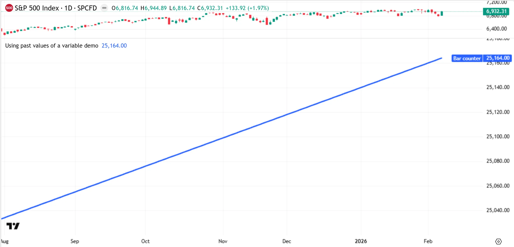

```pine
//@version=6
indicator("Using past values of a variable demo")

// This declaration does not use `var` or `varip`.
// Therefore, the script reinitializes the variable to 0 on every execution.
int count = 0

// Retrieve the value of the `count` variable from the previous bar, or 0 if it is not available, add 1 to that value,
// then reassign the result to the `count` variable on the current bar. The script accesses this result with
// the `count[1]` operation while executing on the next bar.
// Therefore, the current value of the variable is always one greater than the value on the previous bar.
count := nz(count[1]) + 1

// Plot the variable's final value.
plot(count, "Bar counter", color.blue, 3)
```

Note that:

- The expression `count[1]` returns [na](../../reference manual/variables/na.md) on the _first_ bar of the dataset, because there is no previous bar for the script to access at that point. Therefore, we use the [nz()](../../reference manual/functions/nz.md) function to replace [na](../../reference manual/variables/na.md) with 0 in the calculation. See the [`na` value](../3. Language/language_type-system.md#na-value) section of the [Type system](../3. Language/language_type-system.md) page to learn more.
- A simpler way to achieve the same plotted result is to add [var](../../reference manual/keywords/var.md) to the `counter` variable declaration in the previous example script. See the [`var`](../3. Language/language_variable-declarations.md#var) section to learn more.

### [​`var`​](../3. Language/language_variable-declarations.md#var)

A variable declaration that includes the [var](../../reference manual/keywords/var.md) keyword creates a variable that persists _across bars_. The variable _remains initialized_ after the _first_ execution of its [scope](../3. Language/language_variable-declarations.md#scopes) on a bar’s _closing tick_. From that bar onward, the variable automatically preserves its assigned value or reference until the script explicitly [reassigns](../3. Language/language_variable-declarations.md#variable-reassignment) it.

In the following example, we modified the first example from the [Default](../3. Language/language_variable-declarations.md#default) section above by adding the [var](../../reference manual/keywords/var.md) keyword to the `count` variable declaration. With this change, the script no longer reinitializes the variable on every bar. Instead, the variable becomes _permanently_ initialized as of the closing tick of the dataset’s _first bar_. On each subsequent bar, the [+=](../../reference manual/operators/+=.md) operation increases the variable’s value by one, and that new value persists into the next execution. The script now plots a value that changes to 1 on the first bar, then to 2 on the second, and so on:

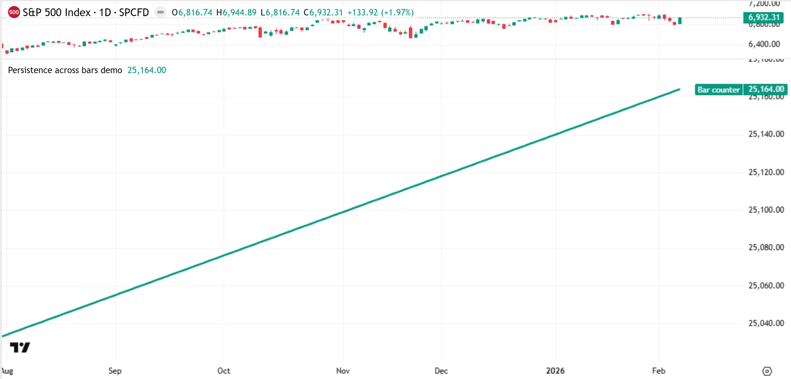

```pine
//@version=6
indicator("Persistence across bars demo")

//@variable A persistent variable initialized to 0 on the first bar, and then modified on each bar.
//          The script does not reinitialize this variable after the first bar.
var int count = 0

// Increment the `count` variable by one. Because the `count` variable persists, it preserves the result of this
// operation on the close of each bar. Therefore, on each bar, the variable's current value is one greater than the
// value on the previous bar.
count += 1

// Plot the variable's final value.
plot(count, "Bar counter", color.teal, 3)
```

Scripts can use the [var](../../reference manual/keywords/var.md) keyword to declare persistent variables of most available [types](../3. Language/language_type-system.md#types), including [reference types](../3. Language/language_type-system.md#reference-types). If a variable declared with [var](../../reference manual/keywords/var.md) stores the reference (ID) of an _object_, such as a [collection](../3. Language/language_type-system.md#collections), changes to that object’s saved data also persist across bars.

For example, the script below declares a variable named `myArray` using [var](../../reference manual/keywords/var.md) and initializes it with the ID of an empty [array](../3. Language/language_arrays.md) created from a call to `array.new<float>()`. Then, it uses the variable in a call to [array.push()](../../reference manual/functions/array.push.md) to add a _new element_ to the array once every five bars, and plots the array’s size on the chart. The plotted size increases by one on every fifth bar without resetting to zero, because assigning an array’s ID to a [var](../../reference manual/keywords/var.md) variable causes that array to persist while the variable continues to reference it:

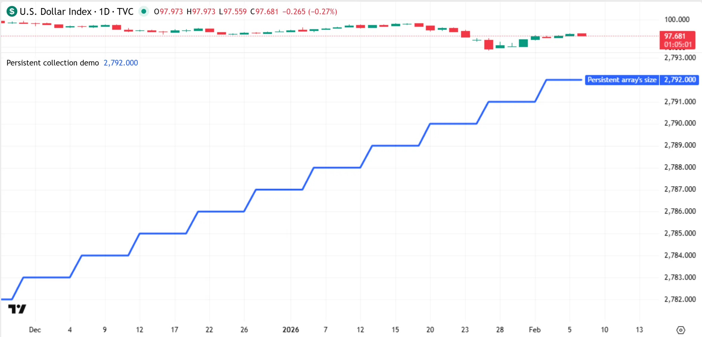

```pine
//@version=6
indicator("Persistent collection demo")

//@variable A persistent variable that stores the ID of an array created on the first bar.
var array<float> myArray = array.new<float>()

// Push the current `close` value into the end of the array once every five bars.
if bar_index % 5 == 0
    array.push(myArray, close)

// Plot the size of the array referenced by `myArray`.
plot(array.size(myArray), "Persistent array's size", linewidth = 3)
```

The [var](../../reference manual/keywords/var.md) keyword is often helpful when working with instances of [drawing types](../3. Language/language_type-system.md#drawing-types), such as [lines](../2. Visuals/visuals_lines-and-boxes.md#lines). Drawing objects automatically persist across bars until deleted by the runtime system or calls to the built-in `*.delete()` functions, even if a script does not assign their IDs to variables. However, using [var](../../reference manual/keywords/var.md) variables to directly store drawing IDs, or the data that the drawings require, often makes them simpler to manage across bars. Additionally, it helps promote runtime efficiency.

For example, the script below draws a line from the open to the close of each daily period on the chart. It uses [ta.valuewhen()](../../reference manual/functions/ta.valuewhen.md) calls to calculate the opening time and price values for the current period, and assigns those values to variables. On historical bars, the script creates a new line using [line.new()](../../reference manual/functions/line.new.md) and initializes a `currLine` variable with the returned ID when a new period starts. On realtime bars where the current period is open, the script retrieves the last [line](../../reference manual/types/line.md) ID saved by the variable (`currLine[1]`), deletes the referenced line with a call to [line.delete()](../../reference manual/functions/line.delete.md), and then creates a new line to follow the latest price.

This code is not the most efficient way to achieve the intended result, because it uses [ta.valuewhen()](../../reference manual/functions/ta.valuewhen.md) to calculate values that the script does _not_ require on every bar, and it deletes and redraws lines on the last bar rather than using `line.set*()` functions to _modify_ the latest line:

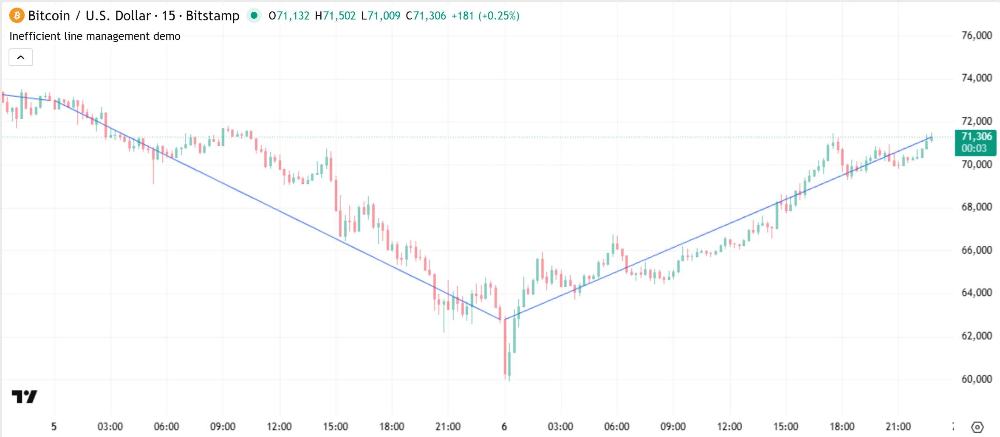

```pine
//@version=6
indicator("Inefficient line management demo", overlay = true)

//@variable Holds `true` on the first bar in a "1D" period, and `false` on all other bars.
bool newPeriod = timeframe.change("1D")

// Retrieve the `time` and `open` values from the last bar where the `newPeriod` value was `true`,
// and assign the results to variables.
int   openTime  = ta.valuewhen(newPeriod, time, 0)
float openPrice = ta.valuewhen(newPeriod, open, 0)

// Declare a variable to reference the latest line.
line currLine = na

if barstate.islast
    // Create a new `line` object and assign its ID to the `currLine` variable.
    currLine := line.new(openTime, openPrice, time, close, xloc.bar_time)
    // Delete the line drawn on the previous bar if the `newPeriod` value is `false`.
    if not newPeriod
        line.delete(currLine[1])
// On historical bars where a new period starts, draw a line connecting the period's final values.
else if newPeriod
    currLine := line.new(openTime[1], openPrice[1], time[1], close[1], xloc.bar_time)
```

The following script version demonstrates a simpler and more efficient way to achieve the same result. It uses the [var](../../reference manual/keywords/var.md) keyword in the `currLine` variable declaration to initialize the variable on only the first bar. On historical bars where a new period starts, the script calls [line.set\_xy2()](../../reference manual/functions/line.set_xy2.md) to update the end coordinates of the current line referenced by the `currLine` variable, and then creates a new line for the current bar and reassigns the variable to store that line’s ID. On the latest bar where the current period is open, the script passes the variable to a [line.set\_xy2()](../../reference manual/functions/line.set_xy2.md) call to update the current line instead of deleting that line and creating a new one:

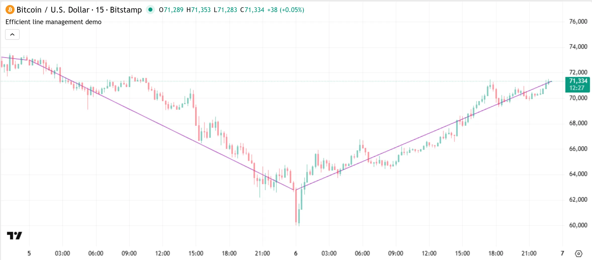

```pine
//@version=6
indicator("Efficient line management demo", overlay = true)

//@variable Holds `true` on the first bar in a "1D" period, and `false` on all other bars.
bool newPeriod = timeframe.change("1D")

// Declare a variable that persistently stores a `line` ID or `na` across bars until reassigned.
var line currLine = na

if barstate.islast
    // At the start of a new period, create a new `line` object with coordinates for the current bar, and reassign
    // the `currLine` variable. The variable stores the new `line` ID until the `newPeriod` value is `true` again.
    if newPeriod
        currLine := line.new(time, open, time, close, xloc.bar_time, color = color.purple)
    // Set the `x2` and `y2` (end) coordinates of the current line to the current bar's `time` and `close` values
    // while the period is open.
    currLine.set_xy2(time, close)
else if newPeriod
    // Update the end coordinates of the latest line on historical bars to the final value of the previous period.
    currLine.set_xy2(time[1], close[1])
    // Create a new `line` object and assign its ID to the `currLine` variable. On the next historical bar where
    // a new period starts, the script modifies the new line.
    currLine := line.new(time, open, time, close, xloc.bar_time, color = color.purple)
```

Note that:

- Programmers can observe the performance difference between these scripts by analyzing them with the [Pine Profiler](../4. Writing_Scripts/writing_profiling-and-optimization.md#pine-profiler) on the historical and realtime bars of an intraday chart.
- It is possible to search the built-in [line.all](../../reference manual/variables/line.all.md) array to access the last drawn line instead of using a persistent variable. However, that approach requires checking the array’s size with the [array.size()](../../reference manual/functions/array.size.md) function and using the [array.get()](../../reference manual/functions/array.get.md) or [array.last()](../../reference manual/functions/array.last.md) function to retrieve the latest [line](../../reference manual/types/line.md) ID. These extra steps require _more_ resources than maintaining a persistent ID with a [var](../../reference manual/keywords/var.md) variable and updating the referenced line’s data across specific bars.

Scripts can use the [var](../../reference manual/keywords/var.md) keyword to declare variables in global or local [scopes](../3. Language/language_variable-declarations.md#scopes). If a [var](../../reference manual/keywords/var.md) variable declaration is in a local scope, such as within a [conditional structure](../3. Language/language_conditional-structures.md), that variable persists across each execution of the scope and preserves changes that occur on a bar’s closing tick. The variable does not reset to its initial state on bars where the scope does not execute.

For example, the script below declares a persistent local variable named `localVar` with an initial value of -1 inside the scope of an [if](../../reference manual/keywords/if.md) structure. The structure’s local code executes once every 10 bars. After initializing the persistent variable, the structure uses the [\*=](../../reference manual/operators/*=.md) operator to multiply the variable’s current value by -1 and reassign it. The script assigns the local variable’s value to a variable in the global scope named `globalVar` and plots the result on the chart. Because the `localVar` variable persists without resetting to its initial value, the plotted results on each 10th bar alternate between -1 and 1:

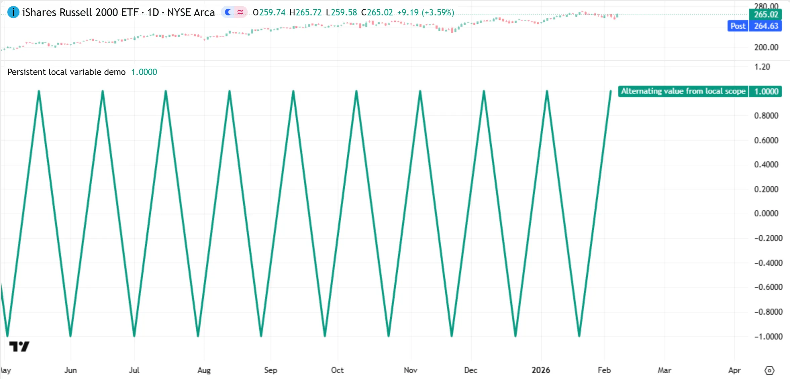

```pine
//@version=6
indicator("Persistent local variable demo")

//@variable Stores the value of the `localVar` variable on each 10th bar, and `na` on other bars.
int globalVar = if bar_index % 10 == 0
    //@variable A persistent local variable initialized to -1 and then modified across bars.
    //          This variable persists across bars after initialization, even when the scope does not execute.
    var int localVar = -1
    // Multiply the local variable's value by -1 and reassign it using the result.
    // If the current value is -1, it changes to 1. If 1, it changes to -1.
    // The structure returns the result of this operation only on bars where the scope executes.
    localVar *= -1

// Plot the value of the `globalVar` variable.
plot(globalVar, "Alternating value from local scope", color.teal, 3)
```

Note that:

- The [if](../../reference manual/keywords/if.md) structure returns [na](../../reference manual/variables/na.md) on each bar where the local scope does not execute. Therefore, the `globalVar` variable stores a value other than [na](../../reference manual/variables/na.md) only on each 10th bar.
- If we remove [var](../../reference manual/keywords/var.md) from the `localVar` variable declaration, causing it to use the [default](../3. Language/language_variable-declarations.md#default) declaration mode, the script plots a consistent value of 1 on each 10th bar, and [na](../../reference manual/variables/na.md) on other bars. The result changes because each execution of the scope reinitializes the value to -1, and multiplying that value by -1 results in a value of 1.

It’s important to note that local variables declared using [var](../../reference manual/keywords/var.md) inside [loops](../3. Language/language_loops.md) behave very differently from those declared using the [default](../3. Language/language_variable-declarations.md#default) declaration mode. If a local variable in a loop uses the default mode, the script reinitializes it on _every iteration_. By contrast, if the local declaration uses [var](../../reference manual/keywords/var.md), the variable remains initialized after the _first_ loop iteration on a bar’s closing tick. From that point onward, it persists and preserves changes to its data from each iteration on the closing ticks of subsequent bars.

For example, the following script declares two local variables inside the body of a [for](../../reference manual/keywords/for.md) loop that performs five iterations. The `local1` variable declaration uses the default declaration mode, and the `local2` declaration uses the [var](../../reference manual/keywords/var.md) keyword. The loop [reassigns](../3. Language/language_variable-declarations.md#variable-reassignment) a value of 0 to the `local2` variable on the first iteration, then increments the values of both variables by one on every iteration. The loop _returns_ a tuple containing both values when it ends, and the script uses a [tuple declaration](../3. Language/language_variable-declarations.md#tuple-declarations) to create global variables that store the returned values for its plots:

```pine
//@version=6
indicator("Persistent loop variable demo")

// Declare two global variables to store the values of the `local1` and `local2` variables returned
// after the loop's final iteration.
[global1, global2] = for i = 1 to 5
    //@variable A local variable declared using the default mode.
    //          The script reinitializes this variable to 0 on *every* loop iteration.
    int local1 = 0
    //@variable A local variable declared using `varip`.
    //          This variable remains initialized after the first loop iteration.
    var int local2 = 0
    // On the first iteration, reset the `local2` variable's value to 0. Without this statement, the value would
    // continue to increase across bars.
    if i == 1
        local2 := 0
    // Because the `local1` variable consistently resets to 0 before this operation,
    // its final value is 1 on each iteration.
    local1 += 1
    // By contrast, the `local2` variable does not reset to its previous state on each iteration. The operation on the
    // first iteration changes the value to 1, the operation on the second changes the value to 2, and so on.
    local2 += 1
    // Return both variables' values in a tuple for plotting.
    [local1, local2]

// Plot the values saved to `global1` and `global2`, which equal those of `local1` and `local2`, on the chart.
plot(global1, "Non-persistent", color.blue,   3)
plot(global2, "Persistent",     color.orange, 3)
```

As shown below, the final value of the `local1` variable on each bar is 1, whereas the value of the `local2` variable is 5. This difference occurs because the script reinitializes the `local1` variable to hold 0 on every loop iteration, so the [+=](../../reference manual/operators/+=.md) operation on that variable consistently sets the value to 1. In contrast, the `local2` variable remains initialized after the first loop iteration. Therefore, the [+=](../../reference manual/operators/+=.md) operation on that variable consistently increases the assigned value. The variable stores a value of 1 on the first iteration, 2 on the second iteration, and so on until it reaches the final value of 5 on the last iteration:

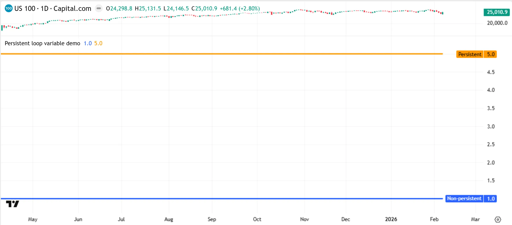

Note that:

- As demonstrated by the previous example, even local variables declared with [var](../../reference manual/keywords/var.md) persist across bars. Therefore, if we remove the [if](../../reference manual/keywords/if.md) statement that reassigns 0 to the `local2` variable, that variable’s value consistently increases by five on each bar.

### [​`varip`​](../3. Language/language_variable-declarations.md#varip)

A variable declaration that includes the [varip](../../reference manual/keywords/varip.md) keyword creates a variable that persists across _every tick_. The variable becomes permanently initialized after the _first_ execution of its [scope](../3. Language/language_variable-declarations.md#scopes), even if that execution occurs _before_ a bar’s closing tick. From that point onward, all changes to the variable’s data persist, even those that occur during script executions on an _open_ bar. The “ip” in the keyword stands for _“intrabar persist”_, as the value or reference stored by the variable persists across every update within each bar until the script explicitly [reassigns](../3. Language/language_variable-declarations.md#variable-reassignment) the variable.

The [varip](../../reference manual/keywords/varip.md) keyword is compatible with variables that store only specific types of data, including the following:

- Values of any [fundamental type](../3. Language/language_type-system.md#types) (“int”, “float”, “bool”, “color”, or “string”).
- Members of [enum types](../3. Language/language_type-system.md#enum-types).
- IDs of the [chart.point](../../reference manual/types/chart.point.md), [footprint](../../reference manual/types/footprint.md), or [volume\_row](../../reference manual/types/volume_row.md) type.
- The IDs for [objects](../3. Language/language_objects.md) of [user-defined types (UDTs)](../3. Language/language_type-system.md#user-defined-types).

The keyword is also compatible with variables that store the IDs of [collections](../3. Language/language_type-system.md#collections), but only if those collections store the following types of data:

- Values of a fundamental type.
- IDs of the [chart.point](../../reference manual/types/chart.point.md), [footprint](../../reference manual/types/footprint.md), or [volume\_row](../../reference manual/types/volume_row.md) type.
- IDs for objects of a user-defined type with fields for storing data of only the above types or the IDs of other collections that contain elements of only these types.

A variable declared with [varip](../../reference manual/keywords/varip.md) typically behaves the same as a variable declared with [var](../../reference manual/keywords/var.md) on _historical bars_ (where the value of the [barstate.ishistory](../../reference manual/variables/barstate.ishistory.md) variable is `true`), because by default, all scripts execute _once per bar_ on that part of the dataset. However, on [realtime bars](../3. Language/language_execution-model.md#realtime-bars), which form over time as new ticks become available from the data feed, [indicator](../../reference manual/functions/indicator.md) and [library](../../reference manual/functions/library.md) scripts execute _once per tick_ instead of once per bar. Variables declared with [var](../../reference manual/keywords/var.md) and [varip](../../reference manual/keywords/varip.md) typically behave differently on these bars.

As noted in the previous section, if a script modifies a [var](../../reference manual/keywords/var.md) variable while executing on an open bar, those modifications **do not** persist. Pine’s _rollback_ process _reverts_ the variable to its last confirmed state as of the previous bar’s close before the script executes on the bar again. This process ensures that the variable stores only _confirmed_ data at the start of each execution, and not any _temporary_ data from ticks that arrive before the bar closes.

By contrast, a variable declared with [varip](../../reference manual/keywords/varip.md) is _not_ affected by rollback. If a script modifies a variable declared with [varip](../../reference manual/keywords/varip.md) while executing on an open bar, the variable preserves its new value or reference without reverting to a previous state after the execution ends. The variable’s new data persists across every subsequent execution on that bar and the bars that follow until the script explicitly changes it again.

The following indicator script demonstrates how [varip](../../reference manual/keywords/varip.md) variables behave differently from [var](../../reference manual/keywords/var.md) variables on realtime bars. The script declares two global variables named `counter1` and `counter2`. The first declaration uses the [var](../../reference manual/keywords/var.md) keyword, and the second uses [varip](../../reference manual/keywords/varip.md). On each execution, the script uses the [+=](../../reference manual/operators/+=.md) operator to increment the values of both variables by one, and then plots the resulting values on the chart. The script also colors the background when the value of [barstate.isrealtime](../../reference manual/variables/barstate.isrealtime.md) is `true` to emphasize realtime bars:

```pine
//@version=6
indicator("Persistence across ticks demo")

//@variable A persistent variable whose value increases by one on each bar.
var int counter1 = 0
//@variable A persistent variable whose value increases by one on each execution.
varip int counter2 = 0

// Increase the `counter1` variable's value by one on each execution. If the current bar is open, the
// system resets the variable to its previous state before the next execution.
// Regardless of how many times the script executes on a realtime bar, the variable's final value for that bar is
// only one greater than the value on the previous bar.
counter1 += 1

// Increase the `counter2` variable's value by one on each execution. Unlike the `counter1` variable, the `counter2`
// variable does not reset. If the bar is open, the new value persists into the next execution.
// Therefore, if five executions occur on a realtime bar, the variable's final value for that bar is five greater
// than the value on the previous bar.
counter2 += 1

// Plot the values of the two variables on the chart. Both plots show the same value on historical bars,
// but they can differ on realtime bars when the script executes more than once per bar.
plot(counter2, "`varip` counter", color.purple, 5)
plot(counter1, "`var` counter",   color.teal,   2)
// Highlight the background of realtime bars for visual reference.
bgcolor(barstate.isrealtime ? color.new(color.orange, 80) : na, title = "Realtime bar highlight")
```

While running on historical bars, the script executes once on each bar’s closing tick. Therefore, the values of both variables consistently increase by one on each bar in that part of the dataset, and the plots for the two variables show the same results. Then, when the script reaches realtime bars, the two plots begin to diverge.

The script executes _multiple times_ on each realtime bar — once for each new tick — to calculate the bar’s results using the latest available data. The [+=](../../reference manual/operators/+=.md) operations on each execution increase the values of both variables by one. However, while the current bar is open, the change to the `counter1` variable _resets_ before each new execution. The variable preserves only the change that occurs on the bar’s _closing tick_. Therefore, the variable’s final value increases by only one on each realtime bar, just like it does on historical bars.

By contrast, the `counter2` variable, declared using [varip](../../reference manual/keywords/varip.md), does _not_ revert to a previous state on any execution. With each new tick in an open realtime bar, the [+=](../../reference manual/operators/+=.md) operation increases the variable’s value by one, and the new value for the variable persists into the execution on the next tick. Therefore, the variable’s final value for each realtime bar increases by the number of ticks that are available for that bar:

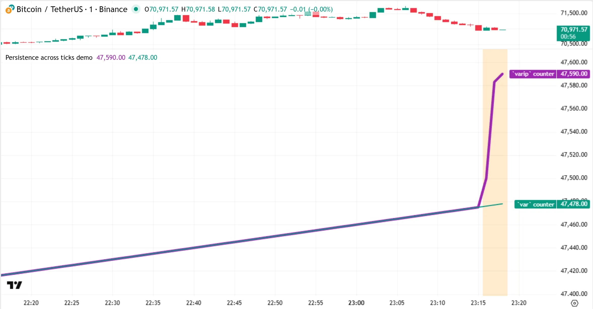

When using the [varip](../../reference manual/keywords/varip.md) keyword to declare variables that access _objects_ of built-in [reference types](../3. Language/language_type-system.md#reference-types), including [chart points](../3. Language/language_type-system.md#chart-points) or [collections](../3. Language/language_type-system.md#collections) of value types, changes to the values stored by those objects also persist across each tick without resetting to a previous state.

For example, the script below uses [varip](../../reference manual/keywords/varip.md) to declare a variable named `testPoint` that stores a persistent reference to a [chart.point](../../reference manual/types/chart.point.md) object. Then, it uses the [+=](../../reference manual/operators/+=.md) operator to increase the value of the object’s `price` field by one on each execution and plots the field’s final value for each bar. The plot increments by one across all historical bars, where the script executes only once per bar. On realtime bars, the plot increments by the number of ticks available for each bar, because the chart point’s `price` field does _not_ reset to a previous state after each [+=](../../reference manual/operators/+=.md) operation while a bar is open:

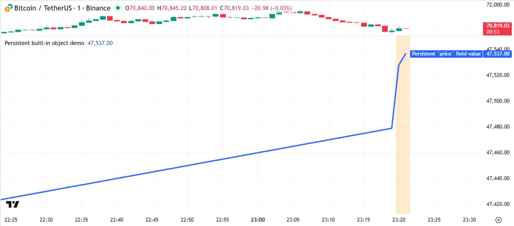

```pine
//@version=6
indicator("Persistent built-in object demo")

//@variable Stores a persistent reference to a `chart.point` object. The object's fields persist across ticks.
varip chart.point testPoint = chart.point.now(0)

// Increment the `price` field of the persistent chart point.
testPoint.price += 1

// Plot the field's value on the chart.
plot(testPoint.price, "Persistent `price` field value", linewidth = 3)
// Highlight the background of realtime bars for visual reference.
bgcolor(barstate.isrealtime ? color.new(color.orange, 80) : na, title = "Realtime bar highlight")
```

Note that:

- The same persistent behavior applies to built-in objects whose IDs are stored in collections referenced by [varip](../../reference manual/keywords/varip.md) variables. For example, if a script declares a [varip](../../reference manual/keywords/varip.md) variable that references an [array](../3. Language/language_arrays.md) of [chart.point](../../reference manual/types/chart.point.md) IDs, changes to the chart points referenced by the array, and their fields, persist across ticks.

It’s crucial to note that [strategies](../1. Concepts/concepts_strategies.md) execute _differently_ from indicators. By default, a strategy executes strictly _once per bar_, even on [realtime bars](../3. Language/language_execution-model.md#realtime-bars). Therefore, [varip](../../reference manual/keywords/varip.md) variables in a strategy behave the same as [var](../../reference manual/keywords/var.md) variables by default. However, users can change a strategy’s [calculation behavior](../1. Concepts/concepts_strategies.md#altering-calculation-behavior) to enable additional executions on [each new tick](../1. Concepts/concepts_strategies.md#calc_on_every_tick) or [after order fills](../1. Concepts/concepts_strategies.md#calc_on_order_fills). These settings can cause a strategy’s [varip](../../reference manual/keywords/varip.md) variables to behave differently on both realtime and historical bars.

For example, the simple strategy below alternates between creating a long and short [market order](../1. Concepts/concepts_strategies.md#market-orders) on each execution. It also declares two persistent variables named `counter1` and `counter2` and increments their values by one with the [+=](../../reference manual/operators/+=.md) operator. The first declaration uses [var](../../reference manual/keywords/var.md), and the second uses [varip](../../reference manual/keywords/varip.md). The script also colors the background of all realtime bars for visual reference:

```pine
//@version=6
strategy("`varip` vs. `var` in strategies demo")

// This logic creates a new market order on each execution for demonstration purposes.
if strategy.position_size <= 0
    strategy.entry("Long", strategy.long)
else
    strategy.entry("Short", strategy.short)

//@variable A persistent variable whose value increases by one on each bar.
var int counter1 = 0
//@variable A persistent variable whose value increases by one on each execution.
varip int counter2 = 0

// The result of this operation does not vary with the strategy's calculation behavior.
// The variable's value consistently increases by one on each bar.
counter1 += 1

// By contrast, this operation's result does depend on the specified calculation behavior:
// - If the default behavior is used, the value increases by one on each bar, just like the value of `counter1`.
// - If recalculation on each tick is enabled, the value can increase by more than one on each realtime bar.
// - If recalculation after order fills is enabled, the value increases by four on each historical bar by default,
//   and by the number of new ticks on each realtime bar.
counter2 += 1

// Plot the values of the `counter1` and `counter2` variables for comparison.
plot(counter2, "`varip` counter", color.purple, 5)
plot(counter1, "`var` counter",   color.teal,   2)
// Highlight the background of realtime bars.
bgcolor(barstate.isrealtime ? color.new(color.orange, 80) : na, title = "Realtime bar highlight")
```

If we run the script with the default calculation behavior, the strategy executes only once on every closed bar. On realtime bars, it waits for each bar to close before performing a new execution. As such, the values of both variables consistently increment by the same amount across all bars and do not diverge:

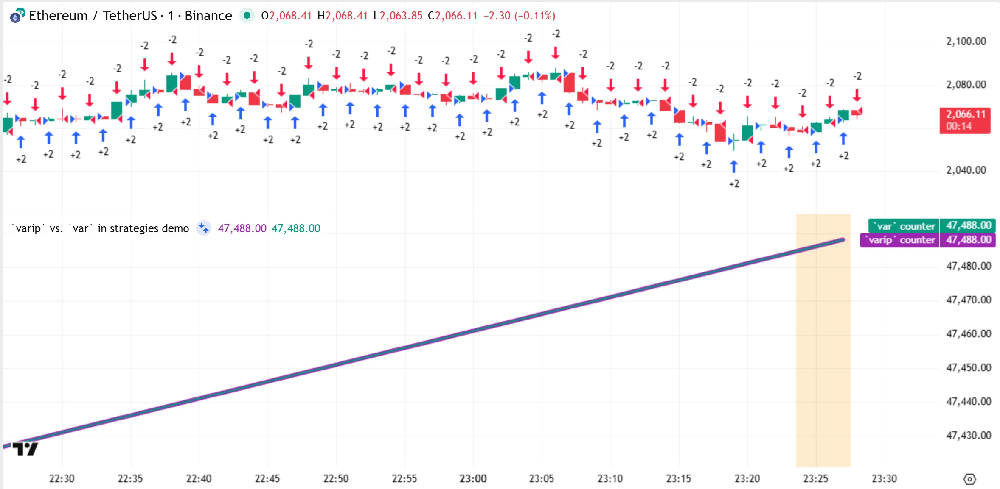

If we select the “On every tick” checkbox in the strategy’s “Properties” tab, the script executes on _each new tick_ in a realtime bar, similar to an indicator. With this change, the plot for the `counter2` variable diverges from that of the `counter1` variable on realtime bars:

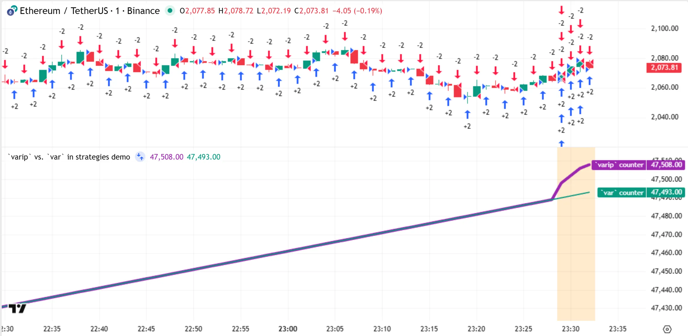

If we select the “After an order is filled” checkbox, the script executes again on _any_ bar where the [broker emulator](../1. Concepts/concepts_strategies.md#broker-emulator) fills an order. By default, the emulator assumes that the open, high, low, and close of historical bars are all valid ticks for filling orders, and our script creates a new order on every available tick. With this change, in addition to incrementing by the number of ticks on each realtime bar, the value of the `counter2` variable increments by _four_ instead of one on each _historical bar_ after the first:

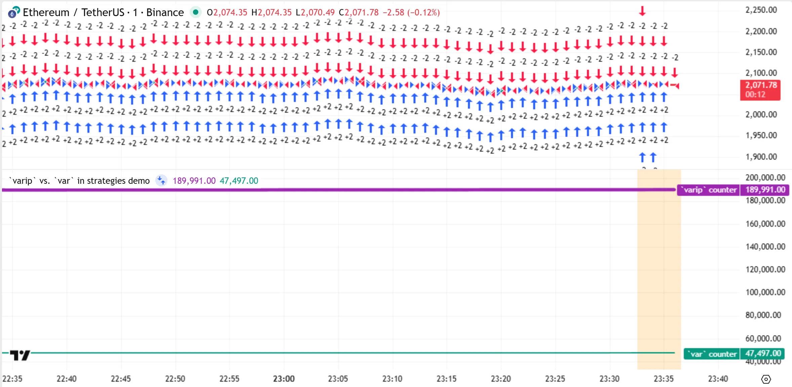

For more detailed information about this historical behavior, see the [Executions on historical bars](../3. Language/language_execution-model.md#executions-on-historical-bars) section of the [Execution model](../3. Language/language_execution-model.md) page.

[Previous 
**Declaration statements**](../3. Language/language_declaration-statements.md) [Next 
**Operators**](../3. Language/language_operators.md)