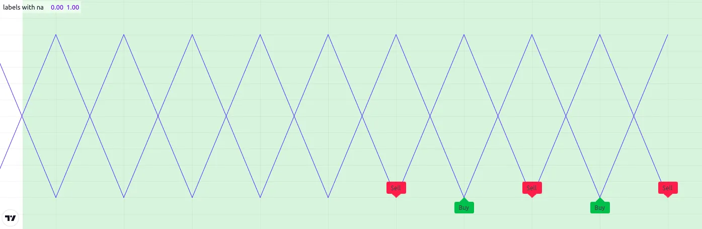
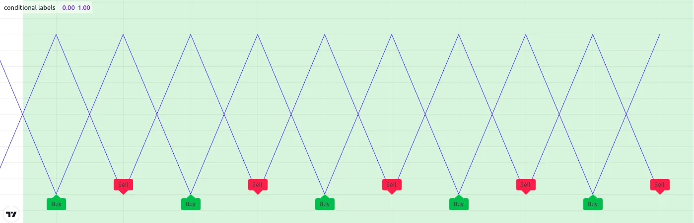

# [Limitations](../4. Writing_Scripts/writing_limitations.md#limitations)

## [Introduction](../4. Writing_Scripts/writing_limitations.md#introduction)

As is mentioned in our [Welcome](https://www.tradingview.com/pine-script-docs/welcome/) page:

> _Because each script uses computational resources in the cloud, we_
> _must impose limits in order to share these resources fairly among our_
> _users. We strive to set as few limits as possible, but will of course_
> _have to implement as many as needed for the platform to run smoothly._
> _Limitations apply to the amount of data requested from additional_
> _symbols, execution time, memory usage and script size._

If you develop complex scripts using Pine Script®, sooner or later you
will run into some of the limitations we impose. This section provides
you with an overview of the limitations that you may encounter. There
are currently no means for Pine Script programmers to get data on the
resources consumed by their scripts. We hope this will change in the
future.

In the meantime, when you are considering large projects, it is safest
to make a proof of concept in order to assess the probability of your
script running into limitations later in your project.

Below, we describe the limits imposed in the Pine Script environment.

## [Time](../4. Writing_Scripts/writing_limitations.md#time)

### [Script compilation](../4. Writing_Scripts/writing_limitations.md#script-compilation)

Scripts must compile before they are executed on charts. Compilation
occurs when you save a script from the Pine Editor or when you add a
script to the chart. A two-minute limit is imposed on compilation time,
which will depend on the size and complexity of your script, and whether
or not a cached version of a previous compilation is available. When a
compile exceeds the two-minute limit, a warning is issued. Heed that
warning by shortening your script because after three consecutive
warnings a one-hour ban on compilation attempts is enforced. The first
thing to consider when optimizing code is to avoid repetitions by using
functions to encapsulate oft-used segments, and call functions instead
of repeating code.

### [Script execution](../4. Writing_Scripts/writing_limitations.md#script-execution)

Once a script is compiled it can be executed. See the
[Events that trigger script executions](../3. Language/language_execution-model.md#events-that-trigger-script-executions) section of the [Execution model](../3. Language/language_execution-model.md) page for a list of the events triggering the execution of a
script. The time allotted for the script to execute on all bars of a
dataset varies with account types. The limit is 20 seconds for basic
accounts, 40 for others.

### [Loop execution](../4. Writing_Scripts/writing_limitations.md#loop-execution)

The execution time for any loop on any single bar is limited to 500
milliseconds. The outer loop of embedded loops counts as one loop, so it
will time out first. Keep in mind that even though a loop may execute
under the 500 ms time limit on a given bar, the time it takes to execute
on all the dataset’s bars may nonetheless cause your script to exceed
the total execution time limit. For example, the limit on total
execution time will make it impossible for you script to execute a 400
ms loop on each bar of a 20,000-bar dataset because your script would
then need 8000 seconds to execute.

## [Chart visuals](../4. Writing_Scripts/writing_limitations.md#chart-visuals)

### [Plot limits](../4. Writing_Scripts/writing_limitations.md#plot-limits)

A maximum of 64 plot counts are allowed per script. The functions that
generate plot counts are:

- [plot()](../../reference manual/functions/plot.md)
- [plotarrow()](../../reference manual/functions/plotarrow.md)
- [plotbar()](../../reference manual/functions/plotbar.md)
- [plotcandle()](../../reference manual/functions/plotcandle.md)
- [plotchar()](../../reference manual/functions/plotchar.md)
- [plotshape()](../../reference manual/functions/plotshape.md)
- [alertcondition()](../../reference manual/functions/alertcondition.md)
- [bgcolor()](../../reference manual/functions/bgcolor.md)
- [barcolor()](../../reference manual/functions/barcolor.md)
- [fill()](../../reference manual/functions/fill.md),
but only if its `color` is of the
[series](../../reference manual/types/series.md)
form.

The following functions do not generate plot counts:

- [hline()](../../reference manual/functions/hline.md)
- [line.new()](../../reference manual/functions/line.new.md)
- [label.new()](../../reference manual/functions/label.new.md)
- [table.new()](../../reference manual/functions/table.new.md)
- [box.new()](../../reference manual/functions/box.new.md)

One function call can generate up to seven plot counts, depending on the
function and how it is called. When your script exceeds the maximum of
64 plot counts, the runtime error message will display the plot count
generated by your script. Once you reach that point, you can determine
how many plot counts a function call generates by commenting it out in a
script. As long as your script still throws an error, you will be able
to see how the actual plot count decreases after you have commented out
a line.

The following example shows different function calls and the number of
plot counts each one will generate:

```pine
//@version=6
indicator("Plot count example")

bool isUp = close > open
color isUpColor = isUp ? color.green : color.red
bool isDn = not isUp
color isDnColor = isDn ? color.red : color.green

// Uses one plot count each.
p1 = plot(close, color = color.white)
p2 = plot(open, color = na)

// Uses two plot counts for the `close` and `color` series.
plot(close, color = isUpColor)

// Uses one plot count for the `close` series.
plotarrow(close, colorup = color.green, colordown = color.red)

// Uses two plot counts for the `close` and `colorup` series.
plotarrow(close, colorup = isUpColor)

// Uses three plot counts for the `close`, `colorup`, and the `colordown` series.
plotarrow(close - open, colorup = isUpColor, colordown = isDnColor)

// Uses four plot counts for the `open`, `high`, `low`, and `close` series.
plotbar(open, high, low, close, color = color.white)

// Uses five plot counts for the `open`, `high`, `low`, `close`, and `color` series.
plotbar(open, high, low, close, color = isUpColor)

// Uses four plot counts for the `open`, `high`, `low`, and `close` series.
plotcandle(open, high, low, close, color = color.white, wickcolor = color.white, bordercolor = color.purple)

// Uses five plot counts for the `open`, `high`, `low`, `close`, and `color` series.
plotcandle(open, high, low, close, color = isUpColor, wickcolor = color.white, bordercolor = color.purple)

// Uses six plot counts for the `open`, `high`, `low`, `close`, `color`, and `wickcolor` series.
plotcandle(open, high, low, close, color = isUpColor, wickcolor = isUpColor , bordercolor = color.purple)

// Uses seven plot counts for the `open`, `high`, `low`, `close`, `color`, `wickcolor`, and `bordercolor` series.
plotcandle(open, high, low, close, color = isUpColor, wickcolor = isUpColor , bordercolor = isUp ? color.lime : color.maroon)

// Uses one plot count for the `close` series.
plotchar(close, color = color.white, text = "|", textcolor = color.white)

// Uses two plot counts for the `close`` and `color` series.
plotchar(close, color = isUpColor, text = "—", textcolor = color.white)

// Uses three plot counts for the `close`, `color`, and `textcolor` series.
plotchar(close, color = isUpColor, text = "O", textcolor = isUp ? color.yellow : color.white)

// Uses one plot count for the `close` series.
plotshape(close, color = color.white, textcolor = color.white)

// Uses two plot counts for the `close` and `color` series.
plotshape(close, color = isUpColor, textcolor = color.white)

// Uses three plot counts for the `close`, `color`, and `textcolor` series.
plotshape(close, color = isUpColor, textcolor = isUp ? color.yellow : color.white)

// Uses one plot count.
alertcondition(close > open, "close > open", "Up bar alert")

// Uses one plot count.
bgcolor(isUp ? color.yellow : color.white)

// Uses one plot count for the `color` series.
fill(p1, p2, color = isUpColor)
```

This example generates a plot count of 56. If we were to add two more
instances of the last call to
[plotcandle()](../../reference manual/functions/plotcandle.md),
the script would throw an error stating that the script now uses 70 plot
counts, as each additional call to
[plotcandle()](../../reference manual/functions/plotcandle.md)
generates seven plot counts, and 56 + (7 \* 2) is 70.

### [Line, box, polyline, and label limits](../4. Writing_Scripts/writing_limitations.md#line-box-polyline-and-label-limits)

Contrary to [plots](../2. Visuals/visuals_plots.md), which can
cover the chart’s entire dataset, scripts will only show the last 50
[lines](../2. Visuals/visuals_lines-and-boxes.md#lines),
[boxes](../2. Visuals/visuals_lines-and-boxes.md#boxes),
[polylines](../2. Visuals/visuals_lines-and-boxes.md#polylines),
and [labels](../2. Visuals/visuals_text-and-shapes.md#labels) on
the chart by default. One can increase the maximum number for each of
these
[drawing types](../3. Language/language_type-system.md#drawing-types) via the `max_lines_count`, `max_boxes_count`,
`max_polylines_count`, and `max_labels_count` parameters of the
script’s
[indicator()](../../reference manual/functions/indicator.md)
or
[strategy()](../../reference manual/functions/strategy.md)
declaration statement. The maximum number of
[line](../../reference manual/types/line.md),
[box](../../reference manual/types/box.md),
and
[label](../../reference manual/types/label.md)
IDs is 500, and the maximum number of
[polyline](../../reference manual/types/polyline.md)
IDs is 100.

In this example, we set the maximum number of recent labels shown on the
chart to 100:

```pine
//@version=6
indicator("Label limits example", max_labels_count = 100, overlay = true)
label.new(bar_index, high, str.tostring(high, format.mintick))
```

It’s important to note when setting any of a drawing object’s
properties to
[na](../../reference manual/variables/na.md) that
its ID still exists and thus contributes to a script’s drawing totals.
To demonstrate this behavior, the following script draws a “Buy” and
“Sell”
[label](../../reference manual/types/label.md)
on each bar, with `x` values determined by the `longCondition` and
`shortCondition` variables.

The “Buy” label’s `x` value is
[na](../../reference manual/variables/na.md) when
the bar index is even, and the “Sell” label’s `x` value is
[na](../../reference manual/variables/na.md) when
the bar index is odd. Although the `max_labels_count` is 10 in this
example, we can see that the script displays fewer than 10
[labels](../2. Visuals/visuals_text-and-shapes.md#labels) on the
chart since the ones with
[na](../../reference manual/variables/na.md)
values also count toward the total:



```pine
//@version=6

// Approximate maximum number of label drawings
MAX_LABELS = 10

indicator("labels with na", overlay = false, max_labels_count = MAX_LABELS)

// Add background color for the last MAX_LABELS bars.
bgcolor(bar_index > last_bar_index - MAX_LABELS ? color.new(color.green, 80) : na)

longCondition =  bar_index % 2 != 0
shortCondition = bar_index % 2 == 0

// Add "Buy" and "Sell" labels on each new bar.
label.new(longCondition ? bar_index : na,  0, text = "Buy", color = color.new(color.green, 0), style = label.style_label_up)
label.new(shortCondition ? bar_index : na, 0, text = "Sell", color = color.new(color.red, 0), style = label.style_label_down)

plot(longCondition  ? 1 : 0)
plot(shortCondition ? 1 : 0)
```

To display the desired number of labels, we must eliminate label
drawings we don’t want to show rather than setting their properties to
[na](../../reference manual/variables/na.md). The
example below uses an
[if](../../reference manual/keywords/if.md)
structure to conditionally draw the “Buy” and “Sell” labels,
preventing the script from creating new label IDs when it isn’t
necessary:



```pine
//@version=6

// Approximate maximum number of label drawings
MAX_LABELS = 10

indicator("conditional labels", overlay = false, max_labels_count = MAX_LABELS)

// Add background color for the last MAX_LABELS bars.
bgcolor(bar_index > last_bar_index - MAX_LABELS ? color.new(color.green, 80) : na)

longCondition =  bar_index % 2 != 0
shortCondition = bar_index % 2 == 0

// Add a "Buy" label when `longCondition` is true.
if longCondition
    label.new(bar_index,  0, text = "Buy", color = color.new(color.green, 0), style = label.style_label_up)
// Add a "Sell" label when `shortCondition` is true.
if shortCondition
    label.new(bar_index, 0, text = "Sell", color = color.new(color.red, 0), style = label.style_label_down)

plot(longCondition  ? 1 : 0)
plot(shortCondition ? 1 : 0)
```

### [Table limits](../4. Writing_Scripts/writing_limitations.md#table-limits)

Scripts can display a maximum of nine
[tables](../2. Visuals/visuals_tables.md) on the chart, one
for each of the possible locations:
[position.bottom\_center](../../reference manual/constants/position.bottom_center.md),
[position.bottom\_left](../../reference manual/constants/position.bottom_left.md),
[position.bottom\_right](../../reference manual/constants/position.bottom_right.md),
[position.middle\_center](../../reference manual/constants/position.middle_center.md),
[position.middle\_left](../../reference manual/constants/position.middle_left.md),
[position.middle\_right](../../reference manual/constants/position.middle_right.md),
[position.top\_center](../../reference manual/constants/position.top_center.md),
[position.top\_left](../../reference manual/constants/position.top_left.md),
and
[position.top\_right](../../reference manual/constants/position.top_right.md).
When attempting to place two tables in the same location, only the
newest instance will show on the chart.

## [​`request.*()`​ calls](../4. Writing_Scripts/writing_limitations.md#request-calls)

### [Number of calls](../4. Writing_Scripts/writing_limitations.md#number-of-calls)

A script can use up to 40 _unique_ calls to the functions in the `request.*()` namespace, or up to 64 unique calls if the user has the [Ultimate plan](https://www.tradingview.com/pricing/). A subsequent call to the same `request.*()` function with the same arguments is not typically unique. This limitation applies when using any of the following `request.*()` functions:

- [request.security()](../../reference manual/functions/request.security.md)
- [request.security\_lower\_tf()](../../reference manual/functions/request.security_lower_tf.md)
- [request.currency\_rate()](../../reference manual/functions/request.currency_rate.md)
- [request.dividends()](../../reference manual/functions/request.dividends.md)
- [request.splits()](../../reference manual/functions/request.splits.md)
- [request.earnings()](../../reference manual/functions/request.earnings.md)
- [request.quandl()](../../reference manual/functions/request.quandl.md)
- [request.financial()](../../reference manual/functions/request.financial.md)
- [request.economic()](../../reference manual/functions/request.economic.md)
- [request.seed()](../../reference manual/functions/request.seed.md)

When a script executes two or more identical `request.*()` function calls, only the _first_ call usually counts toward this limit. The repeated calls do not count because they _reuse_ the data from the first call rather than executing a redundant request. Note that when a script imports [library](../1. Concepts/concepts_libraries.md) functions containing `request.*()` calls within their scopes, those calls **do** count toward this limit, even if the script already calls the same `request.*()` function with the same arguments in its main scope.

The script below calls [request.security()](../../reference manual/functions/request.security.md) with the same arguments 50 times within a [for](../../reference manual/keywords/for.md) loop. Although the script contains more than 40 `request.*()` calls, it _does not_ raise an error because each call is **identical**. In this case, it reuses the data from the first iteration’s [request.security()](../../reference manual/functions/request.security.md) call for the repeated calls on all subsequent iterations:

```pine
//@version=6
indicator("`request.*()` call limit demo")

//@variable The sum of values requested from all `request.security()` calls.
float reqSum = 0.0

// Call `request.security()` 50 times within a loop.
// More than 40 `request.*()` calls occur, but each call is identical. Redundant calls do not count toward the limit.
for i = 1 to 50
    reqSum += request.security(syminfo.tickerid, "1D", close)

plot(reqSum)
```

Here, we modified the above script to call [request.security()](../../reference manual/functions/request.security.md) with a different `timeframe` argument on each iteration, meaning all 50 calls are now **unique**. This time, the script will reach the `request.*()` call limit while executing the loop and raise a runtime error because it requests a _distinct_ dataset on each iteration:

```pine
//@version=6
indicator("`request.*()` call limit demo")

//@variable The sum of values requested from all `request.security()` calls.
float reqSum = 0.0

// Call `request.security()` 50 times within a loop with different `timeframe` arguments.
// This loop causes a runtime error when `i == 41` because each iteration executes a unique request.
for i = 1 to 50
    reqSum += request.security(syminfo.tickerid, str.tostring(i), close)

plot(reqSum)
```

Note that:

- These example scripts can call [request.security()](../../reference manual/functions/request.security.md) within a loop and allow “series string” `timeframe` arguments because Pine v6 scripts enable dynamic requests by default. See [this section](../1. Concepts/concepts_other-timeframes-and-data.md#dynamic-requests) of the [Other timeframes and data](../1. Concepts/concepts_other-timeframes-and-data.md) page for more information.

### [Intrabars](../4. Writing_Scripts/writing_limitations.md#intrabars)

Scripts can retrieve up to the most recent 200,000 _intrabars_
(lower-timeframe bars) via the [request.security()](../../reference manual/functions/request.security.md) or [request.security\_lower\_tf()](../../reference manual/functions/request.security_lower_tf.md) functions, depending on the user’s plan:

- All non-professional plans — Basic, Essential, Plus, and Premium — can request up to 100K bars of data.
- Expert plans have access to 125K bars of data.
- Ultimate plans can request 200K lower-timeframe bars.

The `calc_bars_count` parameter of the `request.*()` functions limits the intrabar data retrieved by a request. If a `request.*()` call does not include a `calc_bars_count` argument, the number of requested bars is the same as the number of [chart bars](../4. Writing_Scripts/writing_limitations.md#chart-bars) available for the symbol and timeframe. Otherwise, the function retrieves up to the specified number of bars, depending on the span of the dataset. The largest possible number of bars in the request depends on the limits listed above.

The number of bars on the chart’s timeframe covered by a lower-timeframe request varies with the number of intrabars available for each chart bar. For example, if a script running on a 60-minute chart uses a `request.*()` call that requests data from the 1-minute timeframe, that call can retrieve data for up to 60 intrabars per chart bar. If the call uses the argument `calc_bars_count = 100000`, the minimum number of chart bars covered by the request is 1666, because 100000 / 60 = 1666.67. However, it’s important to note that a that a provider might not report data for _every_ minute within an hour. Therefore, such a request might cover more chart bars, depending on the available data.

### [Tuple element limit](../4. Writing_Scripts/writing_limitations.md#tuple-element-limit)

All the `request.*()` function calls in a script taken together cannot
return more than 127 tuple elements. When the combined tuple size of all
`request.*()` calls will exceed 127 elements, one can instead utilize
[user-defined types (UDTs)](../3. Language/language_type-system.md#user-defined-types) to request a greater number of values.

The example below outlines this limitation and the way to work around
it. The first
[request.security()](../../reference manual/functions/request.security.md)
call represents using a tuple with 128 elements as the `expression`
argument. Since the number of elements is greater than 127, it would
result in an error.

To avoid the error, we can use those same values as _fields_ within an
[object](../3. Language/language_objects.md) of a
[UDT](../3. Language/language_type-system.md#user-defined-types)
and pass its ID to the `expression` instead:

```pine
//@version=6
indicator("Tuple element limit")

s1 = close
s2 = close * 2
...
s128 = close * 128

// Causes an error.
[v1, v2, v3, ..., v128] = request.security(syminfo.tickerid, "1D", [s1, s2, s3, ..., s128])

// Works fine:
type myType
    float v1
    float v2
    float v3
    ...
    float v128

myObj = request.security(syminfo.tickerid, "1D", myType.new(s1, s2, s3, ..., s128))
```

Note that:

- This example outlines a scenario where the script tries to
evaluate 128 tuple elements in a single
[request.security()](../../reference manual/functions/request.security.md)
call. The same limitation applies if we were to split the tuple
request across _multiple_ calls. For example, two
[request.security()](../../reference manual/functions/request.security.md)
calls that each retrieve a tuple with 64 elements will also
cause an error.

## [Script size and memory](../4. Writing_Scripts/writing_limitations.md#script-size-and-memory)

### [Compiled tokens](../4. Writing_Scripts/writing_limitations.md#compiled-tokens)

Before the execution of a script, the compiler translates it into a
tokenized _Intermediate Language_ (IL). Using an IL allows Pine Script
to accommodate larger scripts by applying various memory and performance
optimizations. The compiler determines the size of a script based on the
_number of tokens_ in its IL form, **not** the number of characters or
lines in the code viewable in the Pine Editor.

The compiled form of each indicator, strategy, and library script is
limited to 100,000 tokens. If a script imports libraries, the total
number of tokens from all imported libraries cannot exceed 1 million.
There is no way to inspect a script’s compiled form, nor its IL token
count. As such, you will only know your script exceeds the size limit
when the compiler reaches it.

In most cases, a script’s compiled size will likely not reach the
limit. However, if a compiled script does reach the token limit, the
most effective ways to decrease compiled tokens are to reduce repetitive
code, encapsulate redundant calls within functions, and utilize
[libraries](../1. Concepts/concepts_libraries.md) when possible.

It’s important to note that the compilation process omits any _unused_
variables, functions, types, etc. from the final IL form, where
“unused” refers to anything that _does not_ affect the script’s
outputs. This optimization prevents superfluous elements in the code
from contributing to the script’s IL token count.

For example, the script below declares a
[user-defined type](../3. Language/language_type-system.md#user-defined-types) and a
[user-defined method](../3. Language/language_methods.md#user-defined-methods) and defines a sequence of calls using them:

```pine
//@version=6
indicator("My Script")
plot(close)

type myType
    float field = 10.0

method m(array<myType> a, myType v) =>
    a.push(v)

var arr = array.new<myType>()
arr.push(myType.new(25))
arr.m(myType.new())
```

Despite the inclusion of `array.new<myType>()`,
`myType.new()`, and `arr.m()` calls in the script, the only thing
actually **output** by the script is `plot(close)`. The rest of the code
does not affect the output. Therefore, the compiled form of this script
will have the _same_ number of tokens as:

```pine
//@version=6
indicator("My Script")
plot(close)
```

### [Variables per scope](../4. Writing_Scripts/writing_limitations.md#variables-per-scope)

Scripts can contain up to 1,000 variables in each of its scopes. Pine
scripts always contain one global scope, represented by non-indented
code, and they may contain zero or more local scopes. Local scopes are
sections of indented code representing procedures executed within
[functions](../3. Language/language_user-defined-functions.md) and
[methods](../3. Language/language_methods.md#user-defined-methods), as well as
[if](../../reference manual/keywords/if.md),
[switch](../../reference manual/keywords/switch.md),
[for](../../reference manual/keywords/for.md),
[for…in](../../reference manual/keywords/for...in.md),
and
[while](../../reference manual/keywords/while.md)
structures, which allow for one or more local blocks. Each local block
counts as one local scope.

The branches of a conditional expression using the
[?:](../../reference manual/operators/{question}{colon}.md)
ternary operator do not count as local blocks.

### [Compilation request size](../4. Writing_Scripts/writing_limitations.md#compilation-request-size)

The size of the compilation request for a script cannot exceed 5MB. The compilation request is all of the information that is sent to the compiler. This information comprises the script itself and any libraries the script imports.

Unlike the limit for compiled tokens, the request size limit includes unused parts of code. This is because the script is not compiled yet, so any unused code has not yet been optimized out.

To reduce the compilation request size, you can:

- Reduce the size of the script by optimizing the code.
- Reduce the number of script inputs (script inputs are counted separately).
- Remove any imported libraries that are not needed.
- Use smaller libraries. The entire library is sent for compilation, regardless of which functions are called.

### [Collections](../4. Writing_Scripts/writing_limitations.md#collections)

Pine Script collections ( [arrays](../3. Language/language_arrays.md), [matrices](../3. Language/language_matrices.md),
and [maps](../3. Language/language_maps.md)) can have a maximum
of 100,000 elements. Each key-value pair in a map contains two elements,
meaning [maps](../3. Language/language_maps.md) can contain a
maximum of 50,000 key-value pairs.

## [Other limitations](../4. Writing_Scripts/writing_limitations.md#other-limitations)

### [Maximum bars back](../4. Writing_Scripts/writing_limitations.md#maximum-bars-back)

References to past values using the
[\[\]](../../reference manual/operators/[].md) [history-referencing operator](../3. Language/language_operators.md#-history-referencing-operator) are dependent on the size of the [historical 
buffer](../3. Language/language_execution-model.md#historical-buffers) maintained by the Pine Script runtime, which is limited to a
maximum of 5000 bars for most series. Some built-in series like [open](../../reference manual/variables/open.md), [high](../../reference manual/variables/high.md), [low](../../reference manual/variables/low.md), [close](../../reference manual/variables/close.md), and [time](../../reference manual/variables/time.md) have larger historical buffers that can reference up to 10,000 bars.

If a script references values beyond the historical buffer’s limit, it causes a runtime error. For more information about this error, refer to [this section](https://www.tradingview.com/pine-script-docs/error-messages/#the-requested-historical-offset-x-is-beyond-the-historical-buffers-limit-y) of the [Error messages](https://www.tradingview.com/pine-script-docs/error-messages/) page, which discusses the historical buffer and how to change its size using either the [max\_bars\_back()](../../reference manual/functions/max_bars_back.md) function or the `max_bars_back` parameter of the [indicator()](../../reference manual/functions/indicator.md) or [strategy()](../../reference manual/functions/strategy.md) declaration statement.

Drawings using [xloc.bar\_index](../../reference manual/constants/xloc.bar_index.md) can be positioned a maximum of 10,000 bars in the past.

### [Maximum bars forward](../4. Writing_Scripts/writing_limitations.md#maximum-bars-forward)

When positioning drawings using [xloc.bar\_index](../../reference manual/constants/xloc.bar_index.md), it is possible to use
bar index values greater than that of the current bar as _x_
coordinates. A maximum of 500 bars in the future can be referenced.

This example shows how we use the `maxval` parameter in our
[input.int()](../../reference manual/functions/input.int.md)
function call to cap the user-defined number of bars forward we draw a
projection line so that it never exceeds the limit:

```pine
//@version=6
indicator("Max bars forward example", overlay = true)

// This function draws a `line` using bar index x-coordinates.
drawLine(bar1, y1, bar2, y2) =>
    // Only execute this code on the last bar.
    if barstate.islast
        // Create the line only the first time this function is executed on the last bar.
        var line lin = line.new(bar1, y1, bar2, y2, xloc.bar_index)
        // Change the line's properties on all script executions on the last bar.
        line.set_xy1(lin, bar1, y1)
        line.set_xy2(lin, bar2, y2)

// Input determining how many bars forward we draw the `line`.
int forwardBarsInput = input.int(10, "Forward Bars to Display", minval = 1, maxval = 500)

// Calculate the line's left and right points.
int   leftBar  = bar_index[2]
float leftY    = high[2]
int   rightBar = leftBar + forwardBarsInput
float rightY   = leftY + (ta.change(high)[1] * forwardBarsInput)

// This function call is executed on all bars, but it only draws the `line` on the last bar.
drawLine(leftBar, leftY, rightBar, rightY)
```

### [Chart bars](../4. Writing_Scripts/writing_limitations.md#chart-bars)

The number of bars appearing on charts is dependent on the amount of
historical data available for the chart’s symbol and timeframe, and on
the type of account you hold. When the required historical date is
available, the minimum number of chart bars is:

- 40000 historical bars for the Ultimate plan.
- 25000 historical bars for the Expert plan.
- 20000 historical bars for the Premium plan.
- 10000 historical bars for Essential and Plus plans.
- 5000 historical bars for other plans.

### [Trade orders in backtesting](../4. Writing_Scripts/writing_limitations.md#trade-orders-in-backtesting)

A script can place a maximum of 9000 orders when backtesting strategies. Once it reaches that limit, the earlier orders are _trimmed_ to store the information of new orders. Programmers can use the [strategy.closedtrades.first\_index](../../reference manual/variables/strategy.closedtrades.first_index.md) variable to reference the index of the earliest untrimmed trade.

When using Deep Backtesting, the order limit is 1,000,000.

[Previous 
**Publishing scripts**](../4. Writing_Scripts/writing_publishing.md)