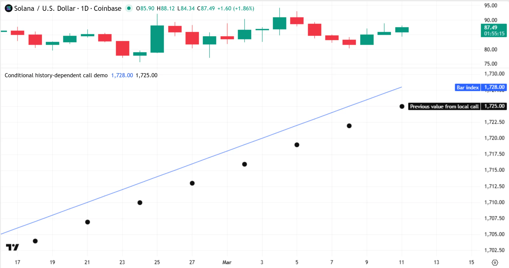
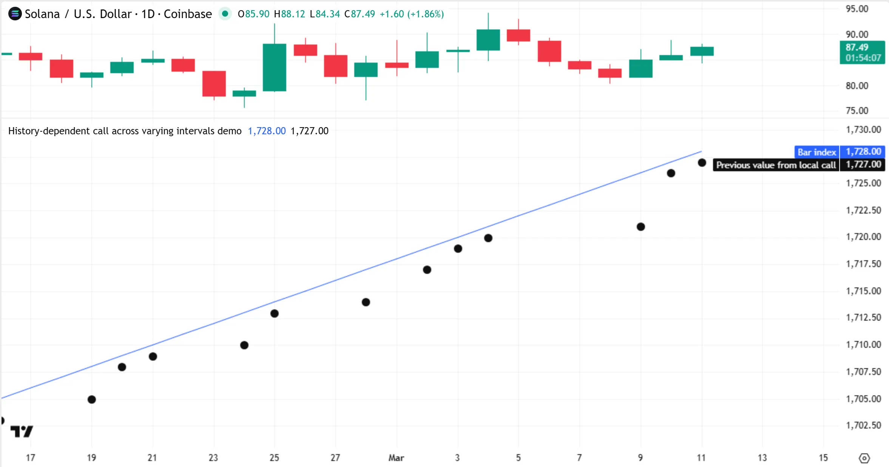
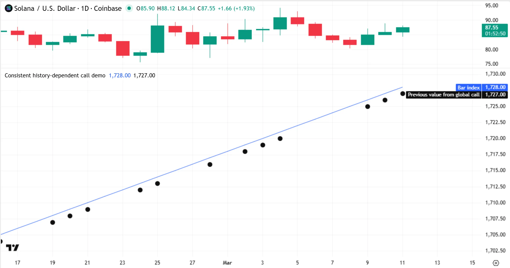
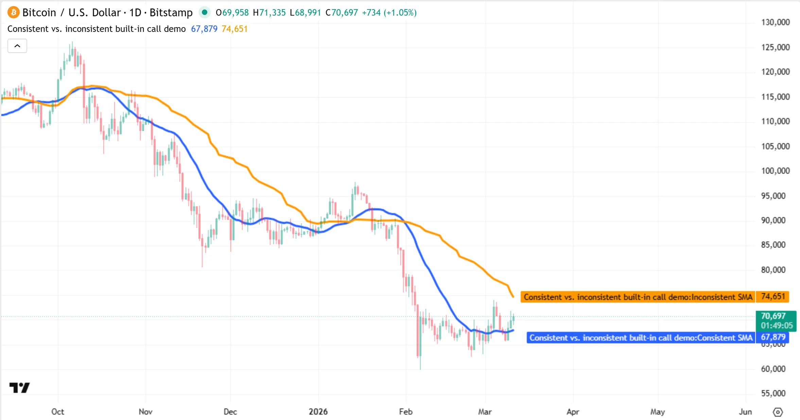

## [The function “X” should be called on each calculation for consistency. It is recommended to extract the call from this scope.](../5. Errors_And_Warnings/errors_cw10003.md#the-function-x-should-be-called-on-each-calculation-for-consistency-it-is-recommended-to-extract-the-call-from-this-scope)

This compiler warning occurs if a call to a [built-in function](../3. Language/language_built-ins.md#built-in-functions) or [user-defined function](../3. Language/language_user-defined-functions.md) (or [method](../3. Language/language_methods.md)) inside a [conditional structure](../3. Language/language_conditional-structures.md) or [loop](../3. Language/language_loops.md) retrieves data from its calculations on _past bars_ by using the [`[]` history-referencing operator](../3. Language/language_operators.md#-history-referencing-operator) or other functions that rely on history internally. History-dependent function calls that execute either conditionally or iteratively can cause **unintended results**. A similar warning also occurs if a [ternary](../3. Language/language_operators.md#-ternary-operator) or [and](../../reference manual/keywords/and.md)/ [or](../../reference manual/keywords/or.md) operation executes a history-dependent function call conditionally.

As a script runs a dataset, Pine’s runtime system successively _commits (saves)_ the data for the script’s variables and expressions on each closed bar to internal [time series](../3. Language/language_execution-model.md#time-series) structures. For the system to save _consistent_ time series data for a function call, the call must execute **once** on **each** bar’s close. If the call does not execute on each bar, or if it executes more than once on some bars, the time series for the call contains an **inconsistent** history of past data.

This behavior affects the results of history-referencing operations that access the history of a function call’s parameters, variables, or expressions. To ensure consistent historical references in a function call, move the call to the script’s **global scope** and _outside_ conditional expressions.

For example, the following script defines a `previousValue()` function that uses the [\[\]](../../reference manual/operators/[].md) operator with an offset of 1 to access the last saved value of its `source` parameter as of the previous bar. The script calls the function once every three bars in an [if](../../reference manual/keywords/if.md) structure to retrieve a past value of the [bar\_index](../../reference manual/variables/bar_index.md) variable and plots the result on the chart. Because the call executes only on each third bar, its `source` series contains data for only those bars. Consequently, the `source[1]` expression _does not_ retrieve a value from one bar back in this case; it retrieves the `source` value for the last bar on which the call executed — three bars ago:



```pine
//@version=6
indicator("Conditional history-dependent call demo")

//@function  Returns the last saved value of the `source` parameter as of the previous bar.
//
//           This function requires one execution on each bar's close for consistent results, because it uses the
//           `[]` operator to access past values from its `source` series.
//
//           If a written call does not execute on a bar, nothing is saved to the time series, and the `[]`
//           operator cannot consistently retrieve a value corresponding to only one bar back.
previousValue(source) => source[1]

//@variable Stores the result from calling `previousValue()` once every three bars, and `na` on other bars.
float pastValue = na

if bar_index % 3 == 0
    // The `previousValue()` call below causes the warning.
    // The call's `source` series contains only `bar_index` values for each third bar, and not other bars.
    // Therefore, the `source[1]` expression executed by the call does not retrieve the `bar_index` value from one bar back.
    // Instead, it retrieves the value from *three* bars back, because that's the last bar on which the call executed.
    pastValue := previousValue(source = bar_index)

// Plot the result alongside the bar index.
plot(bar_index, "Bar index")
plot(pastValue, "Previous value from local call", chart.fg_color, 5, plot.style_circles)
```

Note that:

- This script has the same behaviors we describe below if it uses the statement `float pastValue = bar_index % 3 == 0 ? previousValue(source = bar_index) : na` instead of the [if](../../reference manual/keywords/if.md) structure.
- The compiler displays the warning on line 21, where the local `previousValue()` call occurs, to inform the user that the call might cause inconsistent results.

If the conditions that control the executions of a function call vary, the historical references in the [call’s scope](../3. Language/language_user-defined-functions.md#scope-of-a-function-call) access data from a _varying_ number of bars back, even if the specified offset is a constant. This behavior is a common cause of unexpected results. For example, in the following script version, we changed the [if](../../reference manual/keywords/if.md) structure’s condition to `close > open`. With this change, the plotted results now show the [bar\_index](../../reference manual/variables/bar_index.md) value from an inconsistent number of bars back, because the `previousValue()` call builds a series of `source` data for only the bars whose closing price exceeds their opening price:



```pine
//@version=6
indicator("History-dependent call across varying intervals demo")

//@function  Returns the last saved value of the `source` parameter as of the previous bar.
//
//           This function requires one execution on each bar's close for consistent results, because it uses the
//           `[]` operator to access past values from its `source` series.
//
//           If a written call does not execute on a bar, nothing is saved to the time series, and the `[]`
//           operator cannot consistently retrieve a value corresponding to only one bar back.
previousValue(source) => source[1]

//@variable Stores the result from calling `previousValue()` on bars that close above the opening price.
float pastValue = na

if close > open
    // The `previousValue()` call below causes the warning.
    // The call's `source` series contains `bar_index` values only for bars whose close exceeds their open.
    // The bars back that the `source[1]` expression represents *varies* in this case.
    pastValue := previousValue(source = bar_index)

// Plot the result alongside the bar index.
plot(bar_index, "Bar index")
plot(pastValue, "Previous value from local call", chart.fg_color, 5, plot.style_circles)
```

To ensure that the `previousValue()` call consistently returns a value from _one_ bar back, regardless of conditions, we must move the call to the _global_ scope, outside conditional expressions, so that its `source` series stores values for _consecutive bars_.

For example, this script version executes the `previousValue()` call in the global scope and [reassigns](../3. Language/language_variable-declarations.md#variable-reassignment) the result to the `pastValue` variable inside the [if](../../reference manual/keywords/if.md) structure. Now, on bars where the plot appears, the result consistently shows the [bar\_index](../../reference manual/variables/bar_index.md) value from one bar back:



```pine
//@version=6
indicator("Consistent history-dependent call demo")

//@function  Returns the last saved value of the `source` parameter as of the previous bar.
//
//           This function requires one execution on each bar's close for consistent results, because it uses the
//           `[]` operator to access past values from its `source` series.
//
//           If a written call does not execute on a bar, nothing is saved to the time series, and the `[]`
//           operator cannot consistently retrieve a value corresponding to only one bar back.
previousValue(source) => source[1]

//@variable Stores the previous bar's `bar_index` value if `close > open`, and `na` otherwise.
float pastValue = na

//@variable Stores the previous bar's `bar_index` value on each bar.
//          This call executes on each bar, so its history stores consecutive past values.
float globalPrev = previousValue(source = bar_index)

if close > open
    // This code does not cause a warning.
    // Reassigning the call's result to another variable does not change the call's behavior.
    pastValue := globalPrev

// Plot the result alongside the bar index.
plot(bar_index, "Bar index")
plot(pastValue, "Previous value from global call", chart.fg_color, 5, plot.style_circles)
```

Inconsistent time series storage can significantly change the results from calls to [built-in functions](../3. Language/language_built-ins.md#built-in-functions) that reference history internally, such as those in the `ta` namespace. For instance, the [ta.sma()](../../reference manual/functions/ta.sma.md) function calculates the average of a specified number of recent values from a series. If a script does not execute a call to this function once on _every_ bar’s closing tick, the call builds an _inconsistent_ history for its calculations, and its results can change significantly.

The following example executes two calls to [ta.sma()](../../reference manual/functions/ta.sma.md) — one in the script’s global scope, and the other inside an [if](../../reference manual/keywords/if.md) structure — and then plots the result on the chart. As shown below, the two plots display very different values. The _global_ [ta.sma()](../../reference manual/functions/ta.sma.md) call executes on each bar, so its `source` series records values for _consecutive_ bars to use in the resulting 20-bar average. By contrast, the local call does _not_ use consecutive bars in its average. Instead, the call calculates the average of [close](../../reference manual/variables/close.md) values from the latest 20 bars on which it executes:



```pine
//@version=6
indicator("Consistent vs. inconsistent built-in call demo", overlay = true)

//@variable The 20-bar average of consecutive values from the `close` series.
float consistentSMA = ta.sma(source = close, length = 20)

//@variable The average of `close` values over the latest 20 bars where `close > close[1]` returns `true`.
//          On bars where the condition is `false`, the value is `na`.
float inconsistentSMA = if close > close[1]
    // This call causes a warning, and returns a very different result,
    // because it uses inconsistent historical references internally.
    ta.sma(close, 20)

// Plot the two results for comparison.
plot(consistentSMA,   "Consistent SMA",   color.blue,   3)
plot(inconsistentSMA, "Inconsistent SMA", color.orange, 3)
```

### [Why this behavior?](../5. Errors_And_Warnings/errors_cw10003.md#why-this-behavior)

This behavior is necessary because forcing a function call to execute once on each bar, regardless of scope, would cause erroneous or unexpected results, especially in functions that produce _side effects_, such as [drawings](../2. Visuals/visuals_overview.md#drawing-visuals), [alerts](../1. Concepts/concepts_alerts.md), and [Pine Logs](../4. Writing_Scripts/writing_debugging.md#pine-logs), or functions that use persistent variable [declaration modes](../3. Language/language_variable-declarations.md#declaration-modes).

For example, forcing calls to the [label.new()](../../reference manual/functions/label.new.md) function inside an [if](../../reference manual/keywords/if.md) structure to execute on each bar would cause a new label drawing to appear on every bar instead of only when the condition’s value is `true`. Likewise, forcing a local call to a function that modifies [var](../../reference manual/keywords/var.md) variables to execute once on each bar can cause unintended values to persist in calculations.

### [Exceptions](../5. Errors_And_Warnings/errors_cw10003.md#exceptions)

Not all functions use previous values from their scopes in their calculations. Calls to such functions _do not_ require execution on every bar for correct results. For example, the built-in [math.max()](../../reference manual/functions/math.max.md) function returns the maximum value from its specified arguments. It does not use past values from its scope in its calculations. Therefore, calling the function conditionally or iteratively does _not_ affect the function’s behavior.

If the use of a function call in a local block does not cause a compiler warning, it is typically safe to use the call in that block without affecting the call’s calculations. However, if the warning occurs, move the function call to the global scope and outside [ternary](../3. Language/language_operators.md#-ternary-operator) or [and](../../reference manual/keywords/and.md)/ [or](../../reference manual/keywords/or.md) operations to ensure consistency. If you choose to keep a function call within a local block or a conditional expression despite encountering a warning, [debug](../4. Writing_Scripts/writing_debugging.md) the script carefully to avoid unintended results.

[Previous 
**CE10101**](../5. Errors_And_Warnings/errors_ce10101.md) [Next 
**RE10139**](../5. Errors_And_Warnings/errors_re10139.md)